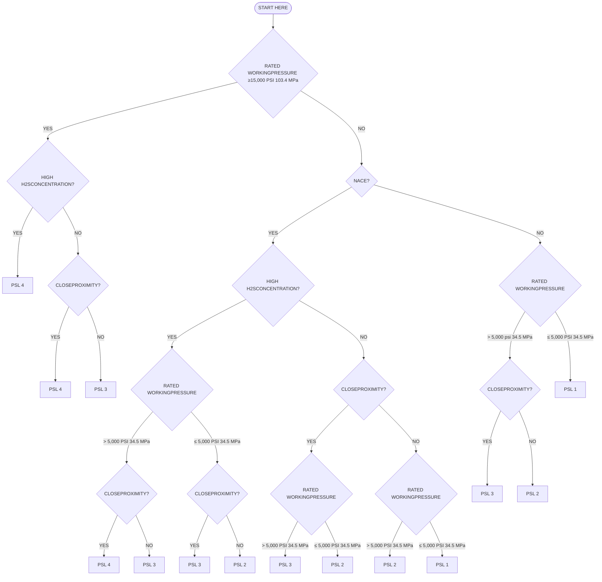

# Specification for Wellhead and Christmas Tree Equipment

## 1 Scope

## 1.1 PURPOSE

This specification was formulated to provide for the availability of safe, dimensionally and functionally interchangeable wellhead and Christmas tree equipment.

The technical content provides requirements for performance, design, materials, testing, inspection, welding, marking, handling, storing and shipping by the manufacturer. This specification does not apply to field use or field testing of wellhead and Christmas tree equipment.

Critical components are those parts having requirements specified in this document.

## 1.2 APPLICATIONS

### 1.2.1 Coverage

This specification covers equipment utilized for pressure control systems for the production of oil and gas. Specific equipment covered by this specification is listed as follows:

a. Wellhead Equipment
* Casing Head Housings
* Casing Head Spools
* Tubing Head Spools
* Crossover Spools
* Multistage Head Housings and Spools

b. Connectors and Fittings
* Crossover Connectors
* Tubing Head Adapters
* Top Connectors
* Tees and Crosses
* Fluid Sampling Devices
* Adapter and Spacer Spools

c. Casing and Tubing Hangers
* Mandrel Hangers
* Slip Hangers

d. Valves and Chokes
* Single Completion Valves
* Multiple Completion Valves
* Actuated Valves
* Valves Prepared for Actuators
* Check Valves
* Chokes
* Surface and Underwater Safety Valves and Actuators for Offshore Service

e. Loose Connectors [Flanged, Threaded, Other End Connectors (O.E.C.), and Welded]
* Weld Neck Connectors
* Blind Connectors
* Threaded Connectors
* Adapter and Spacer Connectors

f. Other Equipment
* Actuators
* Ring Gaskets

The typical equipment nomenclature used in this specification is shown in Figure 1.1 and Figure 1.2.

Appendix A provides purchasing guidelines to users for API Spec 6A equipment.

### 1.2.2 Service Conditions

a. General
Service conditions refer to classifications for pressure, temperature, and the various well-bore constituents and operating conditions.

b. Pressure Ratings
Pressure ratings indicate rated working pressures expressed as gage pressure (psig or MPa gage).

c. Temperature Ratings
Temperature ratings indicate temperature ranges, from minimum ambient to maximum flowing fluid temperatures, expressed in degrees Fahrenheit (°F) or degrees Celsius (°C).

d. Materials Class Ratings
Materials class ratings indicate the material for the equipment components. A guideline (not a requirement) for the basic well-bore constituents and operating conditions is covered in Appendix A.

## 1.3 PRODUCT SPECIFICATION LEVELS (PSL)

a. General
This specification establishes requirements for four product specification levels. These four PSL designations define different levels of technical requirements. Appendix A provides guidelines (not requirements) for selecting an acceptable PSL.

b. PSL 1
PSL 1 includes practices currently being implemented by a broad spectrum of the industry for service conditions recommended in Appendix A of this specification.

c. PSL 2
PSL 2 includes all the requirements of PSL 1 plus additional practices currently being implemented by a broad spectrum of the industry for service conditions recommended in Appendix A of this specification.

d. PSL 3
PSL 3 includes all the requirements of PSL 2 plus additional practices currently being implemented by a broad

![Diagram showing various cross-sections of wellhead assemblies with detailed nomenclature labels for components like tubing head adapters, casing hangers, packoffs, and valves.]

Figure 1.1—Typical Wellhead Assembly Nomenclature

![Diagram of a typical Christmas tree assembly with labels for Gauge Valve, Top Connection, Swab or Crown Valve (Flowline Valve), Tee (See Note), Wing Valve (Flowline Valve), Choke, Master Valve (Flowline Valve), and Tubing Head Adapter.]

Figure 1.2—Typical Christmas Tree Nomenclature

spectrum of users for the service conditions recommended in Appendix A of this specification.

e. PSL 4

PSL 4 includes all the requirements of PSL 3 plus additional practices currently being implemented by a broad spectrum of users for the service conditions recommended in Appendix A of this specification.

## 1.4 INTERCHANGEABILITY

A decimal/inch system is the standard for the dimensions shown in this specification. Nominal sizes will continue to be shown as fractions. This change from previous editions of API Spec 6A reflects current widespread industry practice.

It is not intended that this modify the fractional dimensions or tolerances from earlier editions. Table 4.4 gives fraction to decimal equivalence. For the purposes of this specification,

the fractions and their decimal equivalents are equal and interchangeable. Metric conversions and dimensional tables are in Appendix B. Millimeter dimensions in this specification are based on the original fractional inch designs. Functional dimensions have been converted exactly into the metric system to insure interchangeability of products manufactured in inch and metric systems.

All parts whose physical dimensions conform to the inch tables incorporated into the body of this specification or to the metric tables in Appendix B are acceptable under this specification.

## 1.5 APPENDICES

Appendices to this specification are not requirements. They are included only as guidelines or information.

# 2 References

## 2.1 GENERAL

Only those reference standards listed in Section 2.2 are considered part of this specification. Documents (sub-tier) that are referenced by those documents are not considered part of this specification.

When the latest edition is specified it may be used on issue and shall be mandatory 6 months from the date of revision. The replaced edition may be used up to 6 months from the date of the latest revision.

## 2.2 REFERENCE STANDARDS

This specification includes by reference, either in total or in part, other API, industry and government standards listed below:

The latest edition of these standards shall be used unless otherwise noted below:

### API

<table>
  <thead>
    <tr>
        <th>Standard</th>
        <th>Description</th>
    </tr>
  </thead>
  <tbody>
    <tr>
        <td>Spec 5B</td>
        <td><em>Threading, Gaging, and Thread Inspection of Casing, Tubing and Line Pipe Threads</em></td>
    </tr>
    <tr>
        <td>Spec 5CT</td>
        <td><em>Casing and Tubing</em></td>
    </tr>
    <tr>
        <td>Spec 5L</td>
        <td><em>Line Pipe</em></td>
    </tr>
    <tr>
        <td>Spec 6AV1</td>
        <td><em>Verification Test of Wellhead Surface Safety Valves and Underwater Safety Valves for Offshore Service</em></td>
    </tr>
    <tr>
        <td>RP 14F</td>
        <td><em>Recommended Practice for Design and Inspection of Electrical Systems for Offshore Production Platforms</em></td>
    </tr>
  </tbody>
</table>

### ANSI1

<table>
  <thead>
    <tr>
        <th>Standard</th>
        <th>Description</th>
    </tr>
  </thead>
  <tbody>
    <tr>
        <td>B1.1</td>
        <td><em>Unified Standard Inch Screw Threads</em></td>
    </tr>
    <tr>
        <td>B1.2</td>
        <td><em>Gages and Gaging for Unified Inch Screw Threads</em></td>
    </tr>
  </tbody>
</table>

### ANSI/ASQC

<table>
  <thead>
    <tr>
        <th>Standard</th>
        <th>Description</th>
    </tr>
  </thead>
  <tbody>
    <tr>
        <td>Z1.4</td>
        <td><em>Sampling Procedures and Tables for Inspection by Attributes</em></td>
    </tr>
  </tbody>
</table>

### ASME/ANSI

<table>
  <thead>
    <tr>
        <th>Standard</th>
        <th>Description</th>
    </tr>
  </thead>
  <tbody>
    <tr>
        <td>B1.20.1</td>
        <td><em>Pipe Threads, General Purpose (Inch)</em></td>
    </tr>
    <tr>
        <td>B18.2.2</td>
        <td><em>Square and Hex Nuts</em></td>
    </tr>
  </tbody>
</table>

### ASME2

*Boiler and Pressure Vessel Code*

<table>
  <thead>
    <tr>
        <th>Section</th>
        <th>Description</th>
    </tr>
  </thead>
  <tbody>
    <tr>
        <td>Section V</td>
        <td><em>Nondestructive Testing, Article 5, UT Examination Methods for Materials and Fabrication Para. T522 &amp; T542</em></td>
    </tr>
    <tr>
        <td>Section VIII, Division 1</td>
        <td> </td>
    </tr>
    <tr>
        <td> </td>
        <td>a) <em>Part UG-101: Proof Tests to Establish Maximum Allowable Working Pressure</em></td>
    </tr>
    <tr>
        <td> </td>
        <td>b) <em>Appendix 4: Rounded Indication Charts Acceptance Standard for Radiographically Determined Rounded Indications in Welds.</em></td>
    </tr>
    <tr>
        <td>Section VIII, Division 2</td>
        <td><em>Pressure Vessels—Alternate Rules</em></td>
    </tr>
    <tr>
        <td> </td>
        <td>a) <em>Appendix 4: Design Based on Stress Analysis</em></td>
    </tr>
    <tr>
        <td> </td>
        <td>b) <em>Appendix 6: Experimental Stress Analysis</em></td>
    </tr>
    <tr>
        <td>Section IX</td>
        <td><em>Welding and Brazing Qualifications.</em></td>
    </tr>
  </tbody>
</table>

### ASNT3

<table>
  <thead>
    <tr>
        <th>Standard</th>
        <th>Description</th>
    </tr>
  </thead>
  <tbody>
    <tr>
        <td>SNT-TC-1A</td>
        <td><em>Personnel Qualification and Certification in Nondestructive Testing</em></td>
    </tr>
  </tbody>
</table>

### ASTM4

<table>
  <thead>
    <tr>
        <th>Standard</th>
        <th>Description</th>
    </tr>
  </thead>
  <tbody>
    <tr>
        <td>A 193</td>
        <td><em>Alloy Steel and Stainless Steel Bolting Materials for High Temperature Service</em></td>
    </tr>
    <tr>
        <td>A 194</td>
        <td><em>Carbon Alloy Steel Nuts for Bolts for High Pressure Temperature Service</em></td>
    </tr>
    <tr>
        <td>A 307</td>
        <td><em>Carbon Steel Externally Threaded Standard Fasteners</em></td>
    </tr>
    <tr>
        <td>A 320</td>
        <td><em>Alloy Steel Bolting Materials for Low Temperature Service</em></td>
    </tr>
    <tr>
        <td>A 370</td>
        <td><em>Standard Methods and Definitions for Mechanical Testing of Steel Products</em></td>
    </tr>
    <tr>
        <td>A 388</td>
        <td><em>Recommended Practice for Ultrasonic Examination of Heavy Steel Forgings</em></td>
    </tr>
    <tr>
        <td>A 453</td>
        <td><em>Bolting Materials, High Temperature, 50 to 129 ksi Yield Strength, with Expansion Coefficients Comparable to Austenitic Steels</em></td>
    </tr>
    <tr>
        <td>A 609</td>
        <td><em>Specification for Ultrasonic Examination for Carbon and Low-Alloy Steel Castings</em></td>
    </tr>
    <tr>
        <td>A 703/A 703M</td>
        <td><em>Specification for Steel Castings, General Requirements, for Pressure Containing Parts</em></td>
    </tr>
    <tr>
        <td>D 395</td>
        <td><em>Rubber Property—Compression Set</em></td>
    </tr>
    <tr>
        <td>D 412</td>
        <td><em>Rubber Properties in Tension</em></td>
    </tr>
    <tr>
        <td>D 471</td>
        <td><em>Rubber Property—Effect on Liquids</em></td>
    </tr>
    <tr>
        <td>D 573</td>
        <td><em>Rubber—Deterioration in an Air Oven</em></td>
    </tr>
    <tr>
        <td>D 865</td>
        <td><em>Rubber—Deterioration by Heating in Air (Test Tube Enclosure)</em></td>
    </tr>
    <tr>
        <td>D 1414</td>
        <td><em>Rubber O-Rings</em></td>
    </tr>
  </tbody>
</table>

<table>
  <tbody>
    <tr>
        <td>D 1415</td>
        <td><em>Rubber Property—International Hardness</em></td>
    </tr>
    <tr>
        <td>D 1418</td>
        <td><em>Rubber and Rubber Latices—Nomenclature</em></td>
    </tr>
    <tr>
        <td>D 2240</td>
        <td><em>Rubber Property—Durometer Hardness</em></td>
    </tr>
    <tr>
        <td>E 10</td>
        <td><em>Standard Test Methods for Brinell Hardness of Metallic Materials</em></td>
    </tr>
    <tr>
        <td>E 18</td>
        <td><em>Standard Test Methods for Rockwell Hardness and Rockwell Superficial Hardness of Metallic Materials</em></td>
    </tr>
    <tr>
        <td>E 92</td>
        <td><em>Standard Test Method for Vickers Hardness of Metallic Materials</em></td>
    </tr>
    <tr>
        <td>E 94</td>
        <td><em>Standard Practice for Radiographic Testing</em></td>
    </tr>
    <tr>
        <td>E 140</td>
        <td><em>Standard Hardness Conversion Tables for Metals</em></td>
    </tr>
    <tr>
        <td>E 165</td>
        <td><em>Standard Practice for Liquid Penetrant Inspection</em></td>
    </tr>
    <tr>
        <td>E 186</td>
        <td><em>Standard Reference for Heavy Walled (2 to 4 1/2 in.) (51 to 114 mm) Steel Castings</em></td>
    </tr>
    <tr>
        <td>E 280</td>
        <td><em>Standard Reference Radiographs for 4 1/2 to 12 in. (114 to 305 mm) Steel Castings</em></td>
    </tr>
    <tr>
        <td>E 428</td>
        <td><em>Standard Recommended Practice for Fabrication and Control of Steel Reference Blocks Used in Ultrasonic Inspection</em></td>
    </tr>
    <tr>
        <td>E 446</td>
        <td><em>Standard Reference Radiographs for Steel Castings up to 2 in. in Thickness</em></td>
    </tr>
    <tr>
        <td>E 709</td>
        <td><em>Standard Recommended Practice for Magnetic Particle Examination</em></td>
    </tr>
    <tr>
        <td>E 747</td>
        <td><em>Standard Method for Controlling Quality of Radiographic Testing Using Wire Penetrameters</em></td>
    </tr>
  </tbody>
</table>
<table>
  <tbody>
    <tr>
        <td>MIL STD5 H-6875F</td>
        <td><em>Heat Treatment of Steels—Aircraft Practice Process</em></td>
    </tr>
    <tr>
        <td>MSS SP-556</td>
        <td><em>Quality Standard for Steel Castings for Valves, Flanges and Fittings and Other Piping Components (Visual Method)</em></td>
    </tr>
    <tr>
        <td>NACE7 MR0175</td>
        <td><em>Sulfide Stress Cracking Resistant Metallic Materials for Oilfield Equipment</em></td>
    </tr>
  </tbody>
</table>

# 4 Design and Performance—General Requirements

## 4.1 PERFORMANCE REQUIREMENTS—GENERAL

Performance requirements are specific and unique to the product in the as shipped condition. All products shall be designed to perform according to the requirements of this section and Section 10 while in the pressure and temperature ranges and the test fluids consistent with the material class in Table 4.3 for which they are rated. Other requirements include load capability, cycles, and operating force or torque. There are two Performance Requirement Levels, PR1 and PR2. The latter represents more rigorous performance requirements.

### b. API Threaded Equipment Limitations

Equipment designed with internal API threaded end and outlet connections shall be limited to the thread sizes and rated working pressures in Table 4.1. Ratings do not include tubing and casing hangers.

### c. Design Considerations

The design shall take into account the effects of pressure containment and other pressure-induced loads. Specialized conditions shall also be considered, such as pressure rating changes in crossover connectors and pressurizing with temporary test plugs. The effects of external loads (i.e., bending moments, tensions, etc.) on the assembly of components are not within the scope of this document.

## 4.2 SERVICE CONDITIONS

### 4.2.1 Pressure Ratings

#### a. General

Equipment shall be designed to operate in only the following maximum rated working pressures:

<table>
  <thead>
    <tr>
        <th>psi</th>
        <th>MPa</th>
    </tr>
  </thead>
  <tbody>
    <tr>
        <td>2,000</td>
        <td>13.8</td>
    </tr>
    <tr>
        <td>3,000</td>
        <td>20.7</td>
    </tr>
    <tr>
        <td>5,000</td>
        <td>34.5</td>
    </tr>
    <tr>
        <td>10,000</td>
        <td>69.0</td>
    </tr>
    <tr>
        <td>15,000</td>
        <td>103.4</td>
    </tr>
    <tr>
        <td>20,000</td>
        <td>138.0</td>
    </tr>
  </tbody>
</table>

### 4.2.2 Temperature Ratings

#### a. General

Equipment shall be designed to operate in one or more of the specified temperature ratings with minimum and maximum temperatures as shown in Table 4.2.

Minimum temperature is the lowest ambient temperature to which the equipment may be subjected. Maximum temperature is the highest temperature of the fluid that may directly contact the equipment.

#### b. Design Considerations

The design shall consider the effects of differential thermal expansion from temperature changes and temperature gradients which the equipment would experience in service.

#### c. Temperature Rating Considerations

Choosing the temperature rating is the ultimate responsibility of the user. In making these selections, the user should consider the temperature the equipment would experience in drilling and/or production service.

Table 4.1—Pressure Ratings for Internal API Threaded End or Outlet Connections

<table>
  <thead>
    <tr>
        <th>(1)</th>
        <th>(2)</th>
        <th>(3)</th>
        <th>(4)</th>
        <th>(5)</th>
    </tr>
    <tr>
        <th>Type of API Thread</th>
        <th>Size (in.) NPS</th>
        <th>Size (mm) OD</th>
        <th>Rated Working Pressure (psi)</th>
        <th>Rated Working Pressure (MPa)</th>
    </tr>
  </thead>
  <tbody>
    <tr>
        <td rowspan="3">Line Pipe/NPT (Nominal Sizes)</td>
        <td>1/2</td>
        <td>21.3</td>
        <td>10,000</td>
        <td>69.0</td>
    </tr>
    <tr>
        <td>3/4 – 2</td>
        <td>26.7– 60.3</td>
        <td>5,000</td>
        <td>34.5</td>
    </tr>
    <tr>
        <td>2 1/2 – 6</td>
        <td>73.0–168.3</td>
        <td>3,000</td>
        <td>20.7</td>
    </tr>
    <tr>
        <td>Tubing, Nonupset, and Ext. Upset Rnd. Thd.</td>
        <td>1.050 – 4 1/2</td>
        <td>26.7–114.3</td>
        <td>5,000</td>
        <td>34.5</td>
    </tr>
    <tr>
        <td rowspan="3">Casing (8 Round, Buttress, and Extreme Line)</td>
        <td>4 1/2 – 10 3/4</td>
        <td>114.3 – 273.0</td>
        <td>5,000</td>
        <td>34.5</td>
    </tr>
    <tr>
        <td>11 3/4 – 13 3/8</td>
        <td>298.5 – 339.7</td>
        <td>3,000</td>
        <td>20.7</td>
    </tr>
    <tr>
        <td>16 – 20</td>
        <td>406.4 – 508.0</td>
        <td>2,000</td>
        <td>13.8</td>
    </tr>
  </tbody>
</table>

Table 4.2—Temperature Ratings

<table>
  <thead>
    <tr>
        <th rowspan="3">(1)</th>
        <th colspan="4">Operating Range</th>
    </tr>
    <tr>
        <th colspan="2">(2)</th>
        <th colspan="2">(3)</th>
    </tr>
    <tr>
        <th colspan="2">°F</th>
        <th colspan="2">°C</th>
    </tr>
    <tr>
        <th>Temperature Classification</th>
        <th>Min.</th>
        <th>Max.</th>
        <th>Min.</th>
        <th>Max.</th>
    </tr>
  </thead>
  <tbody>
    <tr>
        <td>K</td>
        <td>–75</td>
        <td>180</td>
        <td>–60</td>
        <td>82</td>
    </tr>
    <tr>
        <td>L</td>
        <td>–50</td>
        <td>180</td>
        <td>–46</td>
        <td>82</td>
    </tr>
    <tr>
        <td>P</td>
        <td>–20</td>
        <td>180</td>
        <td>–29</td>
        <td>82</td>
    </tr>
    <tr>
        <td>R</td>
        <td colspan="2">Room Temperature</td>
        <td colspan="2">Room Temperature</td>
    </tr>
    <tr>
        <td>S</td>
        <td>0</td>
        <td>150</td>
        <td>–18</td>
        <td>66</td>
    </tr>
    <tr>
        <td>T</td>
        <td>0</td>
        <td>180</td>
        <td>–18</td>
        <td>82</td>
    </tr>
    <tr>
        <td>U</td>
        <td>0</td>
        <td>250</td>
        <td>–18</td>
        <td>121</td>
    </tr>
    <tr>
        <td>V</td>
        <td>35</td>
        <td>250</td>
        <td>2</td>
        <td>121</td>
    </tr>
  </tbody>
</table>

# 4.3 DESIGN METHODS

## 4.3.1 Flanges

API Flanges have been designed in accordance with design criteria and methods developed by the API Committee on Standardization of Valves and Wellhead Equipment.

## 4.3.2 Casing Hangers, Tubing Hangers, Lock Screws, and Stems

Casing hangers, tubing hangers, lock screws, and stems shall be designed to satisfy the manufacturer’s documented performance characteristics and service conditions as in 4.2. The manufacturer shall specify methods to be used in design which are consistent with accepted engineering practices.

## 4.3.3 Other End Connectors, Bodies, and Bonnets

Other end connectors, bodies and bonnets that utilize Standard materials (in designs other than those specified in this specification) shall be designed in accordance with one or more of the following methods. Standard materials are those materials whose properties meet or exceed the requirements of Table 5.1.

Other end connectors, bodies and bonnets that utilize Nonstandard materials shall be designed in accordance with the requirements of 4.3.3.5. Nonstandard materials are materials with specified minimum yield strengths in excess of 75,000 psi (517 MPa) that do not meet the ductility requirements of Table 5.1. for Standard 75K materials.

Note: In the event stress levels calculated by the methods in 4.3.3.1 through 4.3.3.5 exceed the allowable stresses, other methods identified by the manufacturer shall be used to justify these stresses. Fatigue analysis and localized bearing stress values are beyond the scope of this specification.

## 4.2.3 Material Class Ratings

### a. General

Equipment shall be designed with materials, including metallics, which meet requirements set forth in Table 4.3. Table 4.3 does not define either the present or the future wellhead environment, but provides materials classes for increasing levels of severity of service conditions and relative corrosivity.

Provided the mechanical properties can be met, stainless steels may be used in place of carbon and low alloy steels and also corrosion resistant alloys may be used in place of stainless steels.

### b. Material Classes

Choosing material classes is the ultimate responsibility of the user. In making these selections, the user should consider the various environmental factors and production variables listed in Appendix A.

Table 4.3—Material Requirements

<table>
  <thead>
    <tr>
        <th> </th>
        <th colspan="2">Minimum Material Requirements</th>
    </tr>
    <tr>
        <th>Materials Class</th>
        <th>Body, Bonnet, End and Outlet Connections</th>
        <th>Pressure Controlling Parts, Stems and Mandrel Hangers</th>
    </tr>
  </thead>
  <tbody>
    <tr>
        <td>AA-General Service</td>
        <td>Carbon or low alloy steel</td>
        <td>Carbon or low alloy steel</td>
    </tr>
    <tr>
        <td>BB-General Service</td>
        <td>Carbon or low alloy steel</td>
        <td>Stainless steel</td>
    </tr>
    <tr>
        <td>CC-General Service</td>
        <td>Stainless steel</td>
        <td>Stainless steel</td>
    </tr>
    <tr>
        <td>DD-Sour Servicea</td>
        <td>Carbon or low alloy steelb</td>
        <td>Carbon or low alloy steelb</td>
    </tr>
    <tr>
        <td>EE-Sour Servicea</td>
        <td>Carbon or low alloy steelb</td>
        <td>Stainless steelb</td>
    </tr>
    <tr>
        <td>FF-Sour Servicea</td>
        <td>Stainless steelb</td>
        <td>Stainless steelb</td>
    </tr>
    <tr>
        <td>HH-Sour Servicea</td>
        <td>CRAsb</td>
        <td>CRAsb</td>
    </tr>
  </tbody>
</table>

\*aAs defined by NACE Standard MR0175.

\*bIn compliance with NACE Standard MR0175.

### 4.3.3.1 ASME

The design methodology as described in the *ASME Boiler and Pressure Vessel Code*, Section VIII, Division 2, Appendix 4, may be used for design calculations for pressure containing equipment. Design allowable stresses shall be limited by the following criteria:

$$ S_T = 0.83S_Y \text{ and } S_m = 2 \frac{S_Y}{3} $$

where

$S_m$ = design stress intensity at rated working pressure,

$S_T$ = maximum allowable general primary membrane stress intensity at hydrostatic test pressure,

$S_Y$ = material minimum specified yield strength.

### 4.3.3.2 Distortion Energy Theory

The distortion energy theory method may be used for design calculations for pressure containing equipment. Rules for the consideration of discontinuities and stress concentrations are beyond the scope of this paragraph. However, the basic pressure vessel wall thickness may be sized by combining triaxial stresses based on hydrostatic test pressure and limited by the following criterion:

$$ S_E = S_Y $$

where

$S_E$ = maximum allowable equivalent stress at the most highly stressed distance into the pressure vessel wall, computed by the distortion energy theory method,

$S_Y$ = material minimum specified yield strength.

### 4.3.3.3 Experimental Stress Analysis

Experimental stress analysis as described in the *ASME Boiler and Pressure Vessel Code*, Section VIII, Division 2, Appendix 6 may be used as an alternate method.

### 4.3.3.4 Design Qualification by Proof Test

As an alternative to the analytical methods above, the pressure rating of equipment may be determined by the use of a hydrostatic test at elevated pressure, using the following procedure:

#### 4.3.3.4.1 Test Vessel

The vessel or vessel part for which the maximum allowable working pressure is to be established shall not previously have been subjected to a pressure greater than 1 1/2 times the desired or anticipated maximum allowable working pressure.

#### 4.3.3.4.2 Determination of Yield Strength

**a. Method**

The yield strength of the material in the part tested shall be determined in accordance with the method prescribed in the applicable material specification.

**b. Specimen Preparation**

Yield strength so determined shall be the average from three or four specimens cut from the part tested after the test is completed. The specimens shall be cut from a location where the stress during the test has not exceeded the yield strength. The specimens shall not be flame cut because this might affect the strength of the material.

**c. Alternative Specimens**

When excess stock from the same piece of material is available and has been given the same heat treatment as the pressure part, the test specimens may be cut from this excess stock. The specimen shall not be removed by flame cutting or any other method involving sufficient heat to affect the properties of the specimen.

**d. Exemption**

If yield strength is not determined by test specimens, an alternative method is given in 4.3.3.4.3 for evaluation of proof test results to establish the maximum allowable working pressure.

#### 4.3.3.4.3 Test Procedure

**a. Instrumentation**

Strains shall be measured in the direction of the maximum stress as close as practical to the most highly stressed locations by means of strain gages of any type capable of indicating strains to 0.00005 in./in. 50 microstrain (µε) (0.005%). The manufacturer shall document the procedure used to determine the location or locations at which strain is to be measured, and the means to compensate for temperature and hydrostatic pressure imposed on the gages.

**b. Application of pressure**

The hydrostatic pressure in the vessel or vessel part shall be increased gradually until approximately one-half the anticipated working pressure is reached. Thereafter, the test pressure shall be increased in steps of approximately one-tenth or less of the rated working pressure until the pressure required by the test procedure is reached.

**c. Observations**

After each increment of pressure has been applied, readings of the strain gages and the hydrostatic pressure shall be taken and recorded. The pressure shall then be released and any permanent strain at each gage shall be determined after any pressure increment that indicates an increase in strain for this increment over the previous equal pressure increment. Only one application of each increment of pressure is required.

**d. Records**

Two curves of strain against test pressure shall be plotted for each gage line as the test progresses, one showing the strain under pressure and one showing the permanent strain when the pressure is removed. The test may be discontinued when the test pressure reaches the value $H$ which will, by the formula, justify the desired working pressure, but shall not exceed the pressure at which the plotted points for the most highly strained gage line reaches 0.2% strain.

**e. Resulting rating**

The maximum allowable working pressure $P$ for parts tested under this paragraph shall be computed by one of the following formulas:

If the average yield strength is determined in accordance with 4.3.3.4.2:

$$P = 0.5H(Y_s/Y_a)$$

If the actual average yield strength is not determined by test specimens:

$$P = 0.4H$$

where

$H$ = hydrostatic test pressure at which this test was stopped in accordance with 4.3.3.4.3b,

$Y_s$ = specified minimum yield strength,

$Y_a$ = actual average yield strength from test specimens.

### 4.3.3.5 Nonstandard Materials Design Requirement

The design methodology as described in the ASME Boiler and Pressure Vessel Code, Section VIII, Division 2, Appendix 4, shall be used for design and calculations for pressure containing equipment utilizing Nonstandard materials. Design allowable stresses shall be limited by the following criteria.

$S_T$ = the smaller of $5/6\ S_y$ or $2/3\ S_u$

$S_m$ = the smaller of $2/3\ S_y$ or $1/2\ S_u$

$S_S$ = the smaller of $2\ S_y$ or $S_u$

where

$S_m$ = design stress intensity at rated working pressure,

$S_S$ = maximum combined primary and secondary stress intensity,

$S_T$ = maximum allowable general primary membrane stress intensity at hydrostatic test pressure,

$S_u$ = material minimum specified ultimate tensile strength,

$S_y$ = material minimum specified yield strength.

### 4.3.4 Closure Bolting

The maximum allowable tensile stress for closure bolting shall be determined considering initial boltup, rated working pressure, and hydrostatic test pressure conditions. Bolting stresses, based on the root area of the thread, shall not exceed the following limit:

$$S_A = 0.83\ S_Y$$

where

$S_A$ = maximum allowable tensile stress,

$S_Y$ = bolting material specified minimum yield strength.

Bolting stresses shall be determined considering all loading on the closure including pressure acting over the seal area, gasket loads and any additive mechanical and thermal loads.

### 4.3.5 Other Parts

All other pressure containing parts and all pressure controlling parts shall be designed to satisfy the manufacturer's documented performance characteristics and the service conditions in 4.2. The manufacturer shall specify methods to be used in design which are consistent with accepted engineering practices.

### 4.3.6 Specific Equipment

Refer to the individual sections of equipment-specific requirements, Section 10 for additional design requirements.

## 4.4 MISCELLANEOUS DESIGN INFORMATION

### 4.4.1 General

End and outlet connections shall be an integral part of the body or attached by welding which meets requirement of Section 6. PSL 4 equipment design shall not utilize fabrication welding.

### 4.4.2 Fraction to Decimal Equivalence

Table 4.4 gives the equivalent fraction and decimal values.

### 4.4.3 Tolerances

Unless otherwise specified in the appropriate table or figure, the following tolerances shall apply:

<table>
  <thead>
    <tr>
        <th colspan="2">Inch</th>
        <th colspan="2">Metric</th>
    </tr>
    <tr>
        <th>Dimension</th>
        <th>Tolerance (in.)</th>
        <th>Dimension</th>
        <th>Tolerance (mm)</th>
    </tr>
  </thead>
  <tbody>
    <tr>
        <td>X.XX</td>
        <td>±0.02</td>
        <td>X.X</td>
        <td>±0.5</td>
    </tr>
    <tr>
        <td>X.XXX</td>
        <td>±0.005</td>
        <td>X.XX</td>
        <td>±0.1</td>
    </tr>
  </tbody>
</table>

## 4.4.4 Bolting

### 4.4.4.1 API End and Outlet Bolting

**a. Hole Alignment**

End and outlet bolt holes for API flanges shall be equally spaced and shall straddle common center lines.

**b. Stud Thread Engagement**

Stud thread engagement length into the body for API studded flanges shall be a minimum of one times the outside diameter of the stud.

### 4.4.4.2 Other Bolting

The stud thread anchoring means shall be designed to sustain a tensile load equivalent to the load which can be transferred to the stud through a fully engaged nut.

## 4.4.5 Test, Vent, Injection, and Gage Connections

### 4.4.5.1 Sealing

All test, vent, injection, and gage connections shall provide a leak tight seal at the hydrostatic test pressure of the equipment in which they are installed.

### 4.4.5.2 Test and Gage Connection Ports

**a. 10,000 psi (69.0 MPa) and Below**

Test and gage connection ports for 10,000 psi (69.0 MPa) working pressure and below shall be internally threaded in conformance with the methods specified in 10.2 and shall not be less than 1/2 in. nominal API line pipe. High pressure connections as described in 4.4.5.2b may also be used.

**b. 15,000 and 20,000 psi (103.4 and 138.0 MPa)**

Test and gage connections for 15,000 and 20,000 psi (103.4 and 138.0 MPa) working pressure shall be in accordance with 10.11.

### 4.4.5.3 Vent and Injection Ports

Vent and injection ports shall meet the requirements of the manufacturer’s specifications.

## 4.5 DESIGN DOCUMENTATION

Documentation of designs shall include methods, assumptions, calculations, and design requirements. Design requirements shall include but not be limited to those criteria for size, test and operating pressures, material, environmental and API specification requirements, and other pertinent requirements upon which the design is to be based. Design documentation media shall be clear, legible, reproducible and retrievable. Design documentation retention shall be for 5 years after the last unit of that model, size and rate working pressure is manufactured.

## 4.6 DESIGN REVIEW

Design documentation shall be reviewed and verified by any qualified individual other than the individual who created the original design.

## 4.7 DESIGN VERIFICATION

Manufacturers shall document their verification procedures and the results of performance verification of designs.

# Table 4.4—Fraction to Decimal Conversion Chart

<table>
  <thead>
    <tr>
        <th>4ths</th>
        <th>8ths</th>
        <th>16ths</th>
        <th>32nds</th>
        <th>64ths</th>
        <th>To 3 Places</th>
        <th>To 2 Places</th>
    </tr>
  </thead>
  <tbody>
    <tr>
        <td>—</td>
        <td>—</td>
        <td>—</td>
        <td>—</td>
        <td>1/64</td>
        <td>.016</td>
        <td>.02</td>
    </tr>
    <tr>
        <td>—</td>
        <td>—</td>
        <td>—</td>
        <td>1/32</td>
        <td>—</td>
        <td>.031</td>
        <td>.03</td>
    </tr>
    <tr>
        <td>—</td>
        <td>—</td>
        <td>—</td>
        <td>—</td>
        <td>3/64</td>
        <td>.047</td>
        <td>.05</td>
    </tr>
    <tr>
        <td>—</td>
        <td>—</td>
        <td>1/16</td>
        <td>—</td>
        <td>—</td>
        <td>.062</td>
        <td>.06</td>
    </tr>
    <tr>
        <td>—</td>
        <td>—</td>
        <td>—</td>
        <td>—</td>
        <td>5/64</td>
        <td>.078</td>
        <td>.08</td>
    </tr>
    <tr>
        <td>—</td>
        <td>—</td>
        <td>—</td>
        <td>3/32</td>
        <td>—</td>
        <td>.094</td>
        <td>.09</td>
    </tr>
    <tr>
        <td>—</td>
        <td>—</td>
        <td>—</td>
        <td>—</td>
        <td>7/64</td>
        <td>.109</td>
        <td>.11</td>
    </tr>
    <tr>
        <td>—</td>
        <td>1/8</td>
        <td>—</td>
        <td>—</td>
        <td>—</td>
        <td>.125</td>
        <td>.12</td>
    </tr>
    <tr>
        <td>—</td>
        <td>—</td>
        <td>—</td>
        <td>—</td>
        <td>9/64</td>
        <td>.141</td>
        <td>.14</td>
    </tr>
    <tr>
        <td>—</td>
        <td>—</td>
        <td>—</td>
        <td>5/32</td>
        <td>—</td>
        <td>.156</td>
        <td>.16</td>
    </tr>
    <tr>
        <td>—</td>
        <td>—</td>
        <td>—</td>
        <td>—</td>
        <td>11/64</td>
        <td>.172</td>
        <td>.17</td>
    </tr>
    <tr>
        <td>—</td>
        <td>—</td>
        <td>3/16</td>
        <td>—</td>
        <td>—</td>
        <td>.188</td>
        <td>.19</td>
    </tr>
    <tr>
        <td>—</td>
        <td>—</td>
        <td>—</td>
        <td>—</td>
        <td>13/64</td>
        <td>.203</td>
        <td>.20</td>
    </tr>
    <tr>
        <td>—</td>
        <td>—</td>
        <td>—</td>
        <td>7/32</td>
        <td>—</td>
        <td>.219</td>
        <td>.22</td>
    </tr>
    <tr>
        <td>—</td>
        <td>—</td>
        <td>—</td>
        <td>—</td>
        <td>15/64</td>
        <td>.234</td>
        <td>.23</td>
    </tr>
    <tr>
        <td>1/4</td>
        <td>—</td>
        <td>—</td>
        <td>—</td>
        <td>—</td>
        <td>.250</td>
        <td>.25</td>
    </tr>
    <tr>
        <td>—</td>
        <td>—</td>
        <td>—</td>
        <td>—</td>
        <td>17/64</td>
        <td>.266</td>
        <td>.27</td>
    </tr>
    <tr>
        <td>—</td>
        <td>—</td>
        <td>—</td>
        <td>9/32</td>
        <td>—</td>
        <td>.281</td>
        <td>.28</td>
    </tr>
    <tr>
        <td>—</td>
        <td>—</td>
        <td>—</td>
        <td>—</td>
        <td>19/64</td>
        <td>.297</td>
        <td>.30</td>
    </tr>
    <tr>
        <td>—</td>
        <td>—</td>
        <td>5/16</td>
        <td>—</td>
        <td>—</td>
        <td>.312</td>
        <td>.31</td>
    </tr>
    <tr>
        <td>—</td>
        <td>—</td>
        <td>—</td>
        <td>—</td>
        <td>21/64</td>
        <td>.328</td>
        <td>.33</td>
    </tr>
    <tr>
        <td>—</td>
        <td>—</td>
        <td>—</td>
        <td>11/32</td>
        <td>—</td>
        <td>.344</td>
        <td>.34</td>
    </tr>
    <tr>
        <td>—</td>
        <td>—</td>
        <td>—</td>
        <td>—</td>
        <td>23/64</td>
        <td>.359</td>
        <td>.36</td>
    </tr>
    <tr>
        <td>—</td>
        <td>3/8</td>
        <td>—</td>
        <td>—</td>
        <td>—</td>
        <td>.375</td>
        <td>.38</td>
    </tr>
    <tr>
        <td>—</td>
        <td>—</td>
        <td>—</td>
        <td>—</td>
        <td>25/64</td>
        <td>.391</td>
        <td>.39</td>
    </tr>
    <tr>
        <td>—</td>
        <td>—</td>
        <td>—</td>
        <td>13/32</td>
        <td>—</td>
        <td>.406</td>
        <td>.41</td>
    </tr>
    <tr>
        <td>—</td>
        <td>—</td>
        <td>—</td>
        <td>—</td>
        <td>27/64</td>
        <td>.422</td>
        <td>.42</td>
    </tr>
    <tr>
        <td>—</td>
        <td>—</td>
        <td>7/16</td>
        <td>—</td>
        <td>—</td>
        <td>.438</td>
        <td>.44</td>
    </tr>
    <tr>
        <td>—</td>
        <td>—</td>
        <td>—</td>
        <td>—</td>
        <td>29/64</td>
        <td>.453</td>
        <td>.45</td>
    </tr>
    <tr>
        <td>—</td>
        <td>—</td>
        <td>—</td>
        <td>15/32</td>
        <td>—</td>
        <td>.469</td>
        <td>.47</td>
    </tr>
    <tr>
        <td>—</td>
        <td>—</td>
        <td>—</td>
        <td>—</td>
        <td>31/64</td>
        <td>.484</td>
        <td>.48</td>
    </tr>
    <tr>
        <td>1/2</td>
        <td>—</td>
        <td>—</td>
        <td>—</td>
        <td>—</td>
        <td>.500</td>
        <td>.50</td>
    </tr>
    <tr>
        <td>—</td>
        <td>—</td>
        <td>—</td>
        <td>—</td>
        <td>33/64</td>
        <td>.516</td>
        <td>.52</td>
    </tr>
    <tr>
        <td>—</td>
        <td>—</td>
        <td>—</td>
        <td>17/32</td>
        <td>—</td>
        <td>.531</td>
        <td>.53</td>
    </tr>
    <tr>
        <td>—</td>
        <td>—</td>
        <td>—</td>
        <td>—</td>
        <td>35/64</td>
        <td>.547</td>
        <td>.55</td>
    </tr>
    <tr>
        <td>—</td>
        <td>—</td>
        <td>9/16</td>
        <td>—</td>
        <td>—</td>
        <td>.562</td>
        <td>.56</td>
    </tr>
    <tr>
        <td>—</td>
        <td>—</td>
        <td>—</td>
        <td>—</td>
        <td>37/64</td>
        <td>.578</td>
        <td>.58</td>
    </tr>
    <tr>
        <td>—</td>
        <td>—</td>
        <td>—</td>
        <td>19/32</td>
        <td>—</td>
        <td>.594</td>
        <td>.59</td>
    </tr>
    <tr>
        <td>—</td>
        <td>—</td>
        <td>—</td>
        <td>—</td>
        <td>39/64</td>
        <td>.609</td>
        <td>.61</td>
    </tr>
    <tr>
        <td>—</td>
        <td>5/8</td>
        <td>—</td>
        <td>—</td>
        <td>—</td>
        <td>.625</td>
        <td>.62</td>
    </tr>
    <tr>
        <td>—</td>
        <td>—</td>
        <td>—</td>
        <td>—</td>
        <td>41/64</td>
        <td>.641</td>
        <td>.64</td>
    </tr>
    <tr>
        <td>—</td>
        <td>—</td>
        <td>—</td>
        <td>21/32</td>
        <td>—</td>
        <td>.656</td>
        <td>.66</td>
    </tr>
    <tr>
        <td>—</td>
        <td>—</td>
        <td>—</td>
        <td>—</td>
        <td>43/64</td>
        <td>.672</td>
        <td>.67</td>
    </tr>
    <tr>
        <td>—</td>
        <td>—</td>
        <td>11/16</td>
        <td>—</td>
        <td>—</td>
        <td>.688</td>
        <td>.69</td>
    </tr>
    <tr>
        <td>—</td>
        <td>—</td>
        <td>—</td>
        <td>—</td>
        <td>45/64</td>
        <td>.703</td>
        <td>.70</td>
    </tr>
    <tr>
        <td>—</td>
        <td>—</td>
        <td>—</td>
        <td>23/32</td>
        <td>—</td>
        <td>.719</td>
        <td>.72</td>
    </tr>
    <tr>
        <td>—</td>
        <td>—</td>
        <td>—</td>
        <td>—</td>
        <td>47/64</td>
        <td>.734</td>
        <td>.73</td>
    </tr>
    <tr>
        <td>3/4</td>
        <td>—</td>
        <td>—</td>
        <td>—</td>
        <td>—</td>
        <td>.750</td>
        <td>.75</td>
    </tr>
    <tr>
        <td>—</td>
        <td>—</td>
        <td>—</td>
        <td>—</td>
        <td>49/64</td>
        <td>.766</td>
        <td>.77</td>
    </tr>
    <tr>
        <td>—</td>
        <td>—</td>
        <td>—</td>
        <td>25/32</td>
        <td>—</td>
        <td>.781</td>
        <td>.78</td>
    </tr>
    <tr>
        <td>—</td>
        <td>—</td>
        <td>—</td>
        <td>—</td>
        <td>51/64</td>
        <td>.797</td>
        <td>.80</td>
    </tr>
    <tr>
        <td>—</td>
        <td>—</td>
        <td>13/16</td>
        <td>—</td>
        <td>—</td>
        <td>.812</td>
        <td>.81</td>
    </tr>
    <tr>
        <td>—</td>
        <td>—</td>
        <td>—</td>
        <td>—</td>
        <td>53/64</td>
        <td>.828</td>
        <td>.83</td>
    </tr>
    <tr>
        <td>—</td>
        <td>—</td>
        <td>—</td>
        <td>27/32</td>
        <td>—</td>
        <td>.844</td>
        <td>.84</td>
    </tr>
    <tr>
        <td>—</td>
        <td>—</td>
        <td>—</td>
        <td>—</td>
        <td>55/64</td>
        <td>.859</td>
        <td>.86</td>
    </tr>
    <tr>
        <td>—</td>
        <td>7/8</td>
        <td>—</td>
        <td>—</td>
        <td>—</td>
        <td>.875</td>
        <td>.88</td>
    </tr>
    <tr>
        <td>—</td>
        <td>—</td>
        <td>—</td>
        <td>—</td>
        <td>57/64</td>
        <td>.891</td>
        <td>.89</td>
    </tr>
    <tr>
        <td>—</td>
        <td>—</td>
        <td>—</td>
        <td>29/32</td>
        <td>—</td>
        <td>.906</td>
        <td>.91</td>
    </tr>
    <tr>
        <td>—</td>
        <td>—</td>
        <td>—</td>
        <td>—</td>
        <td>59/64</td>
        <td>.922</td>
        <td>.92</td>
    </tr>
    <tr>
        <td>—</td>
        <td>—</td>
        <td>15/16</td>
        <td>—</td>
        <td>—</td>
        <td>.938</td>
        <td>.94</td>
    </tr>
    <tr>
        <td>—</td>
        <td>—</td>
        <td>—</td>
        <td>—</td>
        <td>61/64</td>
        <td>.953</td>
        <td>.95</td>
    </tr>
    <tr>
        <td>—</td>
        <td>—</td>
        <td>—</td>
        <td>31/32</td>
        <td>—</td>
        <td>.969</td>
        <td>.97</td>
    </tr>
    <tr>
        <td>—</td>
        <td>—</td>
        <td>—</td>
        <td>—</td>
        <td>63/64</td>
        <td>.984</td>
        <td>.98</td>
    </tr>
    <tr>
        <td>1</td>
        <td>—</td>
        <td>—</td>
        <td>—</td>
        <td>—</td>
        <td>1.000</td>
        <td>1.00</td>
    </tr>
  </tbody>
</table>

# 5 Materials—General Requirements

## 5.1 GENERAL

This section describes the material performance, processing and compositional requirements for bodies, bonnets, end and outlet connections, hangers, and ring gaskets. Other pressure containing and pressure controlling parts shall be made of materials that satisfy 5.2 and the design requirements of Section 4.

All materials requirements in this section apply to carbon steels, low alloy steels, and martensitic stainless steels (other than precipitation hardening types). Other alloy systems (including precipitation hardening stainless steels) may be used provided they satisfy the requirements of this section and the design requirements of Section 4.

Materials for actuators are described in 10.16.4.

## 5.2 WRITTEN SPECIFICATIONS

All metallic and nonmetallic pressure containing or pressure controlling parts shall require a written material specification.

### 5.2.1 Metallic Requirements

The manufacturer’s written specified requirements for metallic materials for bodies, bonnets, end and outlet connections, stems, valve bore sealing mechanisms and mandrel hangers shall define the following along with accept/reject criteria:

a. For PSL 1:
* Mechanical property requirements.
* Material qualification.
* Heat treatment procedure including cycle time and temperature with tolerances.
* Material composition with tolerances.
* NDE requirements.

b. For PSL 2–4:
* PSL 1 requirements, plus:
* Allowable melting practice(s).
* Forming practice(s) including hot-working and cold-working practices.
* Heat treating equipment and cooling media.

### 5.2.2 Nonmetallic Requirements

Nonmetallic pressure containing or pressure controlling seals shall have written material specifications. The manufacturer’s written specified requirement for nonmetallic materials shall define the following:
* Generic base polymer(s)—ASTM D 1418.
* Physical property requirements.
* Material qualification—shall meet the equipment class requirement.
* Storage and age control requirements.

## 5.3 MANDREL TUBING AND CASING HANGERS

### 5.3.1 Material

All mandrel tubing and casing hangers shall be fabricated from materials which meet the applicable property requirements as specified by the manufacturer.

a. PSL 1 Requirements.
* Yield, elongation, reduction of area.
* Hardness testing.

b. PSL 2–4 Requirements.
* PSL 1 requirements plus:
* Tensile requirements.
* Impact requirements.

### 5.3.2 Processing

#### 5.3.2.1 Casting Practices

a. PSL 1 Requirements
All castings used for hanger mandrels shall be of pressure vessel quality.

b. PSL 2–4 Requirements
PSL 1 requirements shall apply. The material manufacturer shall document foundry practices which establish limits for sand control, core making, rigging and melting to ensure repeatability in providing castings which meet the requirements of this specification.

#### 5.3.2.2 Hot Working Practices

a. PSL 1 Requirements
All wrought materials shall be pressure vessel quality and shall be formed using a hot working practices(s) which produce a wrought structure throughout.

b. PSL 2–4 Requirements
PSL 1 requirements shall apply. The materials manufacturer shall document hot working practices.

#### 5.3.2.3 Melting Practices

a. PSL 2–3 Requirements
The manufacturer shall select and specify the melting practices for all hanger mandrel materials.

b. PSL 4 Requirements
PSL 2–3 requirements shall apply. The manufacturer shall document the actual melting practice utilized for PSL 4 material.

### 5.3.3 Heat Treating

#### 5.3.3.1 Equipment Qualification

All heat treatment operations shall be performed utilizing equipment qualified in accordance with the requirements specified by the manufacturer.

### 5.3.3.2 Temperatures

#### a. PSL 1–3 Requirements

Time at temperature and temperature level for heat treatment cycles shall be determined in accordance with the manufacturer’s specification.

#### b. PSL 4 Requirements

The requirements of PSL 1–3 shall also apply. Temperature levels for PSL 4 parts shall be determined by using a heat sink.

The heat sink shall be made of the same class of material when the components are made of an alloy of the following classes: carbon steel, alloy steel, stainless steel, titanium base alloys, nickel-copper alloys and nickel base alloys. For components which do not meet one of the preceding classes, the heat sink shall be made from the same alloy as the component. The equivalent round (ER) section of all heat sinks shall be determined in accordance with the methods of 5.7.2. The ER of the heat sink shall be greater than or equal to the largest ER of any single body, bonnet, or end or outlet connection in a heat treatment load.

As an alternative, a production part may serve as the heat sink provided all the requirements of this section are satisfied. The temperature sensing tip of the thermocouple shall be within the part or heat sink and be no closer than 1 in. (25.4 mm) from any external or internal surface.

### 5.3.3.3 Quenching—PSL 2–4 Requirements (Applies to those materials that are quenched and tempered.)

#### a. Water Quenching

The temperature of the water or quench media used to approximate the cooling rate of water shall not exceed 100°F (40°C) at the start of the quench. For bath-type quenching the temperature of the water or quench media shall not exceed 120°F (50°C) at the completion of the quench.

#### b. Other Quenching Media

The temperature range of other quenching media shall meet the manufacturer’s written specification.

### 5.3.4 PSL 2–4 Chemical Compositions

#### 5.3.4.1 General

Hanger mandrel materials shall conform to the manufacturer’s written specification.

a. The manufacturer shall specify the nominal chemical composition including the composition tolerances of the material.

b. Material composition shall be determined on a heat basis (or a remelt ingot basis for remelt grade materials) in accordance with a nationally or internationally recognized standard specified by the manufacturer.

### 5.3.5 Material Qualification Testing—PSL 2–4 Requirements

#### 5.3.5.1 General

When minimum impact and/or tensile properties are required in order for material to be qualified for service, the tests shall be performed as follows:

A Qualification Test Coupon (QTC) as described in 5.7 shall be used. Material used shall qualify a heat and hangers produced from that heat.

#### 5.3.5.2 Tensile Testing

**a. Test Specimens**

Tensile test specimens shall be removed from a QTC as described in 5.7.

**b. Methods**

Tensile tests shall be performed at room temperature in accordance with the procedures specified in ASTM A 370.

A minimum of one tensile test shall be performed. The results of the tensile test(s) shall satisfy the manufacturer’s specified requirements.

**c. Retesting**

If the results of the tensile test(s) do not satisfy the applicable requirements, two additional tests may be performed in an effort to qualify the material. The results of each of these tests shall satisfy the applicable requirements.

#### 5.3.5.3 Impact Testing

**a. Test Specimens**

Impact test specimens shall be removed from a QTC as described in 5.7.

**b. Methods**

Impact tests shall be performed in accordance with the procedures specified in ASTM A 370 using the Charpy V-Notch technique.

In order to qualify material for an API temperature rating, the impact tests shall be performed at or below the lowest temperature of that classification range.

A minimum of three impact specimens shall be tested to qualify a heat of material. Impact properties as determined from these tests shall satisfy the manufacturer’s specified requirements.

**c. Retesting**

If a test fails, then a retest of three additional specimens (removed from the same location within the same QTC with no additional heat treatment) may be made, each of which shall exhibit an impact value equal to or exceeding the required minimum average value.

## 5.4 BODIES, BONNETS, AND END AND OUTLET CONNECTIONS

### 5.4.1 Material

**a. Tensile Property Requirements**

All bodies, bonnets, and end and outlet connections shall be fabricated from Standard or Nonstandard materials as specified in Table 5.2. Standard materials shall meet the applicable properties shown in Table 5.1. Nonstandard material shall conform to the manufacturer's written specification. The written specification shall include minimum requirements for tensile strength, yield strength, elongation, reduction of area, toughness, and hardness applicable for the specific alloy. All Nonstandard materials shall exceed a 75K minimum yield strength and meet a minimum of 15% elongation and 20% reduction of area.

**b. Impact Toughness Requirements**

Impact toughness shall conform to the requirements of Table 5.3.

When subsize specimens are used, the Charpy V-Notch impact requirements shall be equal to that of the 10 mm × 10 mm specimens multiplied by the approximate adjustment factor listed in Table 5.4. Subsized specimens shall not be used for PSL 4.

### 5.4.2 Material Qualification Testing

#### 5.4.2.1 General

When minimum impact and/or tensile properties are required in order for material to be qualified for service, the required tests shall be performed on specimens from a Test Coupon or Qualification Test Coupon as applicable.

**a. PSL 1 Requirements**

An acceptable Test Coupon (TC) as described in Section 5.6 or a Qualification Test Coupon (QTC) as described in 5.7 shall be used to qualify material.

**b. PSL 2–4 Requirements**

A Qualification Test Coupon (QTC) as described in 5.7 shall be used.

#### 5.4.2.2 PSL 1 Tensile Testing

**a. Test Specimens**

Tensile test specimens shall be removed from a test coupon as described in 5.6 or 5.7 as applicable. This test coupon shall be used to qualify a heat and the bodies, bonnets, and end and outlet connectors produced from that heat.

**b. Methods**

Tensile tests shall be performed at room temperature in accordance with the procedures specified in ASTM A 370.

A minimum of one tensile test shall be performed. The results of the tensile test(s) shall satisfy the applicable requirements of Table 5.1.

**c. Retesting**

If the results of the tensile test(s) do not satisfy the applicable requirements, two additional tests may be performed in an effort to qualify the material. The results of each of these tests shall satisfy the applicable requirements.

#### 5.4.2.3 PSL 2–4 Tensile Testing

**a. Test Specimens**

Tensile test specimens shall be removed from a QTC as described in 5.7. This QTC shall be used to qualify a heat and the bodies, bonnets, and end and outlet connections produced from that heat.

**b. Methods**

Tensile tests shall be performed at room temperature in accordance with the procedures specified in ASTM A 370.

A minimum of one tensile test shall be performed. The results of the tensile test(s) shall satisfy the applicable requirements of Table 5.1.

**c. Retesting**

If the results of the tensile test(s) do not satisfy the applicable requirements, two additional tests may be performed in an effort to qualify the material. The results of each of these tests shall satisfy the applicable requirements.

#### 5.4.2.4 PSL 1–4 Impact Testing

**a. Sampling**

Impact tests shall be performed on a heat of material when a body, bonnet, or end and outlet connections produced from that heat requires testing.

**b. Test Specimens**

Impact test specimens shall be removed from a test coupon as described in 5.6 or 5.7 as applicable. This test coupon shall be used to qualify a heat and the bodies, bonnets, and end and outlet connections produced from that heat.

**c. Methods**

Impact tests shall be performed in accordance with the procedures specified in ASTM A 370 using the Charpy V-Notch technique.

In order to qualify material for an API temperature rating, the impact tests shall be performed at or below the lowest temperature of that classification range.

A minimum of three impact specimens shall be tested to qualify a heat of material. Impact properties as determined from these tests shall satisfy the applicable requirements of Table 5.3. In no case shall an individual impact value fall below two-thirds of that required as a minimum average. Similarly, no more than one of the three test results may be below the required minimum average.

**d. PSL 1–4 Retest**

If a test fails, then a retest of three additional specimens (removed from the same location within the same QTC [QTC or TC for PSL 1 components] with no additional heat treatment) may be made, each of which shall exhibit an

5-4 API SPECIFICATION 6A

Table 5.1—API Standard Material Property Requirements for Bodies, Bonnets, and End and Outlet Connections

<table>
  <thead>
    <tr>
        <th>(1)</th>
        <th>(2)</th>
        <th>(3)</th>
        <th>(4)</th>
        <th>(5)</th>
    </tr>
    <tr>
        <th>API Material Designation</th>
        <th>0.2% Yield Strength Minimum, psi (MPa)</th>
        <th>Tensile Strength, Minimum, psi (MPa)</th>
        <th>Elongation in 2 in. (50 mm), Minimum (%)</th>
        <th>Reduction in Area, Minimum (%)</th>
    </tr>
  </thead>
  <tbody>
    <tr>
        <td>36K</td>
        <td>36,000 (248)</td>
        <td>70,000 (483)</td>
        <td>21</td>
        <td>No Requirement</td>
    </tr>
    <tr>
        <td>45K</td>
        <td>45,000 (310)</td>
        <td>70,000 (483)</td>
        <td>19</td>
        <td>32</td>
    </tr>
    <tr>
        <td>60K</td>
        <td>60,000 (414)</td>
        <td>85,000 (586)</td>
        <td>18</td>
        <td>35</td>
    </tr>
    <tr>
        <td>75K</td>
        <td>75,000 (517)</td>
        <td>95,000 (655)</td>
        <td>17</td>
        <td>35</td>
    </tr>
  </tbody>
</table>

Table 5.2—API Material Applications for Bodies, Bonnets, and End and Outlet Connections

<table>
  <thead>
    <tr>
        <th>(1)</th>
        <th>(2)</th>
        <th>(3)</th>
        <th>(4)</th>
        <th>(5)</th>
        <th>(6)</th>
        <th>(7)</th>
    </tr>
    <tr>
        <th> </th>
        <th colspan="6">Pressure Ratings, psi (MPa)</th>
    </tr>
    <tr>
        <th>Part</th>
        <th>2000 (13.8)</th>
        <th>3000 (20.7)</th>
        <th>5000 (34.5)</th>
        <th>10,000 (69.0)</th>
        <th>15,000 (103.4)</th>
        <th>20,000 (138.0)</th>
    </tr>
    <tr>
        <th> </th>
        <th colspan="6">API Material Designation</th>
    </tr>
  </thead>
  <tbody>
    <tr>
        <td rowspan="3">Bodya, Bonnet</td>
        <td>36K, 45K</td>
        <td>36K, 45K</td>
        <td>36K, 45K</td>
        <td>36K, 45K</td>
        <td>45K, 60K</td>
        <td>60K, 75K</td>
    </tr>
    <tr>
        <td>60K, 75K</td>
        <td>60K, 75K</td>
        <td>60K, 75K</td>
        <td>60K, 75K</td>
        <td>75K, NS</td>
        <td>NS</td>
    </tr>
    <tr>
        <td>NSb</td>
        <td>NS</td>
        <td>NS</td>
        <td>NS</td>
        <td> </td>
        <td> </td>
    </tr>
    <tr>
        <td colspan="7">Integral End Connection</td>
    </tr>
    <tr>
        <td>Flanged</td>
        <td>60K, 75K</td>
        <td>60K, 75K</td>
        <td>60K, 75K</td>
        <td>60K, 75K</td>
        <td>75K, NS</td>
        <td>75K, NS</td>
    </tr>
    <tr>
        <td> </td>
        <td>NS</td>
        <td>NS</td>
        <td>NS</td>
        <td>NS</td>
        <td> </td>
        <td> </td>
    </tr>
    <tr>
        <td>Threaded</td>
        <td>60K, 75K</td>
        <td>60K, 75K</td>
        <td>60K, 75K</td>
        <td>NA</td>
        <td>NA</td>
        <td>NA</td>
    </tr>
    <tr>
        <td> </td>
        <td>NS</td>
        <td>NS</td>
        <td>NS</td>
        <td> </td>
        <td> </td>
        <td> </td>
    </tr>
    <tr>
        <td>Other</td>
        <td>(See Note)</td>
        <td>(See Note)</td>
        <td>(See Note)</td>
        <td>(See Note)</td>
        <td>(See Note)</td>
        <td>(See Note)</td>
    </tr>
    <tr>
        <td colspan="7">Loose Connectors</td>
    </tr>
    <tr>
        <td>Weld Neck</td>
        <td>45K</td>
        <td>45K</td>
        <td>45K</td>
        <td>60K, 75K</td>
        <td>75K, NS</td>
        <td>75K, NS</td>
    </tr>
    <tr>
        <td> </td>
        <td> </td>
        <td> </td>
        <td> </td>
        <td>NS</td>
        <td> </td>
        <td> </td>
    </tr>
    <tr>
        <td>Blind</td>
        <td>60K, 75K</td>
        <td>60K, 75K</td>
        <td>60K, 75K</td>
        <td>60K, 75K</td>
        <td>75K, NS</td>
        <td>75K, NS</td>
    </tr>
    <tr>
        <td> </td>
        <td>NS</td>
        <td>NS</td>
        <td>NS</td>
        <td>NS</td>
        <td> </td>
        <td> </td>
    </tr>
    <tr>
        <td>Threaded</td>
        <td>60K, 75K</td>
        <td>60K, 75K</td>
        <td>60K, 75K</td>
        <td>NA</td>
        <td>NA</td>
        <td>NA</td>
    </tr>
    <tr>
        <td> </td>
        <td>NS</td>
        <td>NS</td>
        <td>NS</td>
        <td> </td>
        <td> </td>
        <td> </td>
    </tr>
    <tr>
        <td>Other</td>
        <td>(See Note)</td>
        <td>(See Note)</td>
        <td>(See Note)</td>
        <td>(See Note)</td>
        <td>(See Note)</td>
        <td>(See Note)</td>
    </tr>
  </tbody>
</table>

Note: As specified by manufacturer.

\*aProvided end connections are of the API material designation indicated, welding is done in accordance with Section 6, and design is performed in accordance with Section 4.

\*bNS indicates Nonstandard materials as defined in 4.3.3 and 5.4.1a.

Table 5.3—Charpy V-Notch Impact Requirements (10 mm × 10 mm)

<table>
  <thead>
    <tr>
        <th>(1)</th>
        <th>(2)</th>
        <th>(3)</th>
        <th>(4)</th>
        <th>(5)</th>
        <th>(6)</th>
    </tr>
    <tr>
        <th> </th>
        <th> </th>
        <th colspan="3">Minimum Average Impact Value, ft-lb (J) Transverse Direction</th>
        <th rowspan="2">Minimum Lateral Expansion, in. (mm) PSL 4</th>
    </tr>
    <tr>
        <th>Temperature Classification</th>
        <th>Test Temperature, °F (°C)</th>
        <th>PSL 1</th>
        <th>PSL 2</th>
        <th>PSL 3</th>
    </tr>
  </thead>
  <tbody>
    <tr>
        <td>K</td>
        <td>–75 (–60)</td>
        <td>15 (20)</td>
        <td>15 (20)</td>
        <td>15 (20)</td>
        <td>0.015 (0.38)</td>
    </tr>
    <tr>
        <td>L</td>
        <td>–50 (–46)</td>
        <td>15 (20)</td>
        <td>15 (20)</td>
        <td>15 (20)</td>
        <td>0.015 (0.38)</td>
    </tr>
    <tr>
        <td>P</td>
        <td>–20 (–29)</td>
        <td>—</td>
        <td>15 (20)</td>
        <td>15 (20)</td>
        <td>0.015 (0.38)</td>
    </tr>
    <tr>
        <td>R</td>
        <td>0 (–18)</td>
        <td>—</td>
        <td>—</td>
        <td>15 (20)</td>
        <td>0.015 (0.38)</td>
    </tr>
    <tr>
        <td>S</td>
        <td>0 (–18)</td>
        <td>—</td>
        <td>—</td>
        <td>15 (20)</td>
        <td>0.015 (0.38)</td>
    </tr>
    <tr>
        <td>T</td>
        <td>0 (–18)</td>
        <td>—</td>
        <td>—</td>
        <td>15 (20)</td>
        <td>0.015 (0.38)</td>
    </tr>
    <tr>
        <td>U</td>
        <td>0 (–18)</td>
        <td>—</td>
        <td>—</td>
        <td>15 (20)</td>
        <td>0.015 (0.38)</td>
    </tr>
    <tr>
        <td>V</td>
        <td>0 (–18)</td>
        <td>—</td>
        <td>—</td>
        <td>15 (20)</td>
        <td>0.015 (0.38)</td>
    </tr>
  </tbody>
</table>

Table 5.4—Adjustment Factors for Sub-Size Impact Specimens (PSL 1–3)

<table>
  <thead>
    <tr>
        <th>(1)</th>
        <th>(2)</th>
    </tr>
    <tr>
        <th>Specimen Dimension</th>
        <th>Adjustment Factor</th>
    </tr>
  </thead>
  <tbody>
    <tr>
        <td>10 mm × 7.5 mm</td>
        <td>0.833</td>
    </tr>
    <tr>
        <td>10 mm × 5.0 mm</td>
        <td>0.667</td>
    </tr>
    <tr>
        <td>10 mm × 2.5 mm</td>
        <td>0.333</td>
    </tr>
  </tbody>
</table>

impact value equal to or exceeding the required minimum average value.

**e. Specimen Orientation**

The values listed in Table 5.3 are the minimum acceptable values for forgings and wrought products tested in the transverse direction and for castings and weld qualifications. Forgings and wrought products may be tested in the longitudinal direction instead of the transverse direction and then shall exhibit 20 ft-lb (27 joules) minimum average value. Lateral expansions shall be as stated in Table 5.3 regardless of specimen orientation.

### 5.4.3 Processing

#### 5.4.3.1 Casting Practices

**a. PSL 1 Requirements**

All castings shall be of pressure vessel quality.

**b. PSL 2–4 Requirements**

PSL 1 requirements shall also apply. The materials manufacturer shall document foundry practices which establish limits for sand control, core making, rigging and melting to ensure repeatability in producing castings which meet the requirements of this specification.

#### 5.4.3.2 Hot Working Practices

**a. PSL 1 Requirements**

All wrought material(s) shall be of pressure vessel quality and shall be formed using a hot working practice(s) which produces a wrought structure throughout.

**b. PSL 2–4 Requirements**

PSL 1 requirements shall also apply. The materials manufacturer shall document hot working practices.

#### 5.4.3.3 Melting Practices

**a. PSL 2–3 Requirements**

The manufacturer shall select and specify its melting practices for all body, bonnet, and end and outlet connector material.

**b. PSL 4 Requirements**

PSL 2–3 requirements shall apply. The manufacturer shall document the actual melting practice utilized.

### 5.4.4 Heat Treating

#### 5.4.4.1 Equipment Qualification

All heat treatment operations shall be performed utilizing equipment qualified in accordance with the requirements specified by the manufacturer. Appendix H of this specification provides recommendations for heat treating equipment qualification.

#### 5.4.4.2 Temperatures

**a. PSL 1–3 Requirements**

Time at temperature and temperature level for heat treatment cycles shall be determined in accordance with the manufacturer’s specification.

b. PSL 4 Requirements

The requirements of PSL 1–3 shall also apply. Temperature levels for PSL 4 parts shall be determined by using a heat sink.

The heat sink shall be made of the same class of material when the components are made of an alloy of the following classes: carbon steel, alloy steel, stainless steel, titanium base alloy, nickel-copper alloys and nickel base alloys. For components which do not meet one of the preceding classes, the heat sink shall be made from the same alloy as the component. The equivalent round (ER) section of all heat sinks shall be determined in accordance with the methods of 5.7.2. The ER of the heat sink shall be greater than or equal to the largest ER of any single body, bonnet, or end or outlet connection in a heat treatment load.

As an alternative, a production body, bonnet, or end or outlet connection may serve as the heat sink provided all the requirements of this section are satisfied. The temperature sensing tip of the thermocouple shall be within the part or heat sink and be no closer than 1 in. (25 mm) to any external or internal surface.

### 5.4.4.3 Quenching (PSL 2–4 Requirements— Applies to those materials that are quenched and tempered)

a. Water Quenching

The temperature of the water or quench media used to approximate the cooling rate of water shall not exceed 100°F (40°C) at the start of the quench. For bath type quenching the temperature of the water or quench media shall not exceed 120°F (50°C) at the completion of the quench.

b. Other Quenching Media

The temperature range of other quenching media shall meet the manufacturer’s written specification.

## 5.4.5 Chemical Compositions

### 5.4.5.1 General

Body, bonnet, and end and outlet connection material shall conform to the manufacturer’s written specification.

a. The manufacturer shall specify the nominal chemical composition including composition tolerances of material.

b. Material composition shall be determined on a heat basis (or a remelt ingot basis for remelt grade materials) in accordance with a nationally or internationally recognized standard specified by the manufacturer.

### 5.4.5.2 Composition Limits

Tables 5.5 and 5.6 list element limits (wt %) for carbon, low alloy, and martensitic stainless steels (other than precipitation hardening types) required to manufacture bodies, bonnets, and end outlet connections. When the composition is specified per a recognized industry standard, those elements specified as residual/trace elements need not be reported provided the residual/trace element limits of the industry standard are within the API limits. Table 5.5 and Table 5.6 do not apply to other alloy systems. Composition limits of other alloy systems are purposely omitted from these tables in order to provide the manufacturer with freedom to utilize alloy systems for the multiplicity of requirements encountered.

### 5.4.5.3 Tolerances Ranges

Table 5.7 lists, for PSL 3–4 only, the tolerance range requirements for elements used in the composition of materials as described by the manufacturer’s specification. These tolerances only apply to the materials covered by Table 5.5.

When the manufacturer specifies a material for PSL 3 or 4 with chemical composition requirements per a recognized industry standard, the material shall meet the tolerance ranges of the referenced industry standard. When the manufacturer specifies a material chemistry not covered by a recognized industry standard, the tolerance ranges shall meet Table 5.7. The above tolerance requirements only apply to materials covered by Table 5.5.

## 5.5 RING GASKETS

### 5.5.1 Material

Ring gasket material shall conform to the manufacturer’s written specification.

### 5.5.2 Material Qualification Testing

a. Tensile Testing
None specified.

b. Impact Testing
None specified.

c. Hardness Requirements

The maximum hardness shall be as follows:

<table>
  <thead>
    <tr>
        <th>Material</th>
        <th>Maximum Hardness</th>
    </tr>
  </thead>
  <tbody>
    <tr>
        <td>Soft iron</td>
        <td>HRB 56</td>
    </tr>
    <tr>
        <td>Carbon and low alloys</td>
        <td>HRB 68</td>
    </tr>
    <tr>
        <td>Stainless steel</td>
        <td>HRB 83</td>
    </tr>
    <tr>
        <td>CRA</td>
        <td>Hardness shall meet the manufacturer’s written specification.</td>
    </tr>
  </tbody>
</table>

### 5.5.3 Processing

#### 5.5.3.1 Melting, Casting, and Hot Working

a. Melting Practices

The manufacturer shall select and specify the melting practice(s) used to fabricate ring gaskets. The melt shop shall use practices which produce homogeneous material, free from cracks, banding, piping and flakes.

Table 5.5—Steel Composition Limits for Bodies, Bonnets, and End and Outlet Connections Material (wt %) (PSL 2–4)

<table>
  <thead>
    <tr>
        <th>(1)</th>
        <th>(2)</th>
        <th>(3)</th>
        <th>(4)</th>
    </tr>
    <tr>
        <th>Alloying Element</th>
        <th>Carbon and Low Alloy Steels Composition Limits</th>
        <th>Martensitic Stainless Steels Composition Limits</th>
        <th>45K Material for Weld Neck Flanges Composition Limits[superscript]a</th>
    </tr>
  </thead>
  <tbody>
    <tr>
        <td>Carbon</td>
        <td>0.45 max.</td>
        <td>0.15 max.</td>
        <td>0.35 max.</td>
    </tr>
    <tr>
        <td>Manganese</td>
        <td>1.80 max.</td>
        <td>1.00 max.</td>
        <td>1.05 max.</td>
    </tr>
    <tr>
        <td>Silicon</td>
        <td>1.00 max.</td>
        <td>1.50 max.</td>
        <td>1.35 max.</td>
    </tr>
    <tr>
        <td>Phosphorus</td>
        <td>(See Table 5.6)</td>
        <td>0.05 max.</td>
        <td>0.05 max.</td>
    </tr>
    <tr>
        <td>Sulfur</td>
        <td>(See Table 5.6)</td>
        <td>0.05 max.</td>
        <td>0.05 max.</td>
    </tr>
    <tr>
        <td>Nickel</td>
        <td>1.00 max.</td>
        <td>4.50 max.</td>
        <td>NA</td>
    </tr>
    <tr>
        <td>Chromium</td>
        <td>2.75 max.</td>
        <td>11.0–14.0</td>
        <td>NA</td>
    </tr>
    <tr>
        <td>Molybdenum</td>
        <td>1.50 max.</td>
        <td>1.00 max.</td>
        <td>NA</td>
    </tr>
    <tr>
        <td>Vanadium</td>
        <td>0.30 max.</td>
        <td>NA</td>
        <td>NA</td>
    </tr>
  </tbody>
</table>

[superscript]aFor each reduction of 0.01% below the specified carbon maximum (0.35%) an increase of 0.06%, manganese above the specified maximum (1.05%) will be permitted up to a maximum of 1.35%.

**b. Casting Practices**

Centrifugal casting shall be the only acceptable method of casting ring gaskets.

**c. Hot Working Practices**

Wrought products shall be hot worked throughout. Ring gaskets may be made from pierced tubing or pipe, rolled rings, or rolled and welded bar or plate.

### 5.5.3.2 Heat Treating

**a. Equipment Qualification**

All heat treating of parts and QTCs shall be performed with equipment meeting the requirements specified by the manufacturer.

**b. Methods**

Heat treatment operations shall be in accordance with the manufacturer’s written specification.

Ring gaskets shall be either annealed, normalized, or solution treated as the last stage of material processing prior to the final machining.

**c. Quenching (PSL 2–4 Requirements—Applies to those materials that are quenched and tempered)**

1. Water quenching: The temperature of the water or quench media used to approximate the cooling rate of water shall not exceed 100°F (40°C) at the start of the quench. For bath type quenching the temperature of the water or quench media shall not exceed 120°F (50°C) at the completion of the quench.

2. Other quenching media: The temperature range of other quenching media shall meet the manufacturer’s written specification.

Table 5.6—Phosphorus and Sulfur Concentration Limitations (wt %) (PSL 2–4)

<table>
  <thead>
    <tr>
        <th>(1)</th>
        <th>(2)</th>
        <th>(3)</th>
    </tr>
    <tr>
        <th> </th>
        <th>PSL 2</th>
        <th>PSL 3–4</th>
    </tr>
  </thead>
  <tbody>
    <tr>
        <td>Phosphorus</td>
        <td>0.040 max.</td>
        <td>0.025 max.</td>
    </tr>
    <tr>
        <td>Sulfur</td>
        <td>0.040 max.</td>
        <td>0.025 max.</td>
    </tr>
  </tbody>
</table>

### 5.5.4 Chemical Composition

The chemistry of ring gaskets shall be as described in the manufacturer’s written specification.

## 5.6 TEST COUPONS (TC)

### 5.6.1 General

Table 5.7—Alloying Element Maximum Tolerance Range Requirements (wt %) (PSL 3–4)

<table>
  <thead>
    <tr>
        <th>(1)</th>
        <th>(2)</th>
        <th>(3)</th>
        <th>(4)</th>
    </tr>
    <tr>
        <th>Element</th>
        <th>Carbon and Low Alloy Steel</th>
        <th>Martensitic Stainless Steels</th>
        <th>45K Material for Weld Neck Flanges</th>
    </tr>
  </thead>
  <tbody>
    <tr>
        <td>Carbon</td>
        <td>0.08</td>
        <td>0.08</td>
        <td>NA</td>
    </tr>
    <tr>
        <td>Manganese</td>
        <td>0.40</td>
        <td>0.40</td>
        <td>NA</td>
    </tr>
    <tr>
        <td>Silicon</td>
        <td>0.30</td>
        <td>0.35</td>
        <td>NA</td>
    </tr>
    <tr>
        <td>Nickel</td>
        <td>0.50</td>
        <td>1.00</td>
        <td>NA</td>
    </tr>
    <tr>
        <td>Chromium</td>
        <td>0.50</td>
        <td>NA</td>
        <td>NA</td>
    </tr>
    <tr>
        <td>Molybdenum</td>
        <td>0.20</td>
        <td>0.20</td>
        <td>NA</td>
    </tr>
    <tr>
        <td>Vanadium</td>
        <td>0.10</td>
        <td>0.10</td>
        <td>NA</td>
    </tr>
  </tbody>
</table>

Note: These values are the total allowable variation in any one element and shall not exceed the maximum specified in Table 5.5.

The properties exhibited by the Test Coupon (TC) shall represent the properties of the thermal response of the material comprising the production parts it qualifies.

Depending upon the hardenability of a given material, the test bar results may not always correspond with the properties of the actual components at all locations throughout their cross-section.

A single TC may be used to represent the impact and/or tensile properties of the part(s) produced from the same heat provided it satisfies the requirements of this specification.

For batch heat treatment only: When the TC is a trepanned core or prolongation removed from a production part, or a sacrificial production part, the TC may only qualify production parts having the same or smaller ER. The TC shall only qualify material and parts produced from the same heat.

For material heat treated in a continuous furnace, the TC shall consist of a sacrificial production part or a prolongation removed from a production part. The sacrificial production part or prolongation TC shall only qualify production parts having identical size and shape. The TC shall only qualify material and parts produced from the same heat and heat treat lot.

## 5.6.2 Equivalent Round (ER)

### a. Selection

The size of a TC for a part shall be determined using the following equivalent round (ER) methods.

### b. ER Methods

Figure 5.1 illustrates the basic models for determining the ER of simple solid and hollow parts and some complicated parts.

The ER of a part shall be determined using the actual dimensions of the part in the "as heat treated" condition.

The ER of a studded type part shall be determined by using $T$ equal to the thickness of the thickest flange of that part. ER determination for these parts shall be in accordance with the methods for complex shaped parts.

### c. Size Requirements

The ER of the TC shall be equal to or greater than the dimensions of the part it qualifies, except as follows:

1. Forging: size not required to exceed 2 1/2 in. (63 mm) ER.

2. Casting: size not required to exceed size shown in ASTM A703/A703M, Figure 1.

Note: At the option of the manufacturer, the ER of the TC can meet ASME Section VIII, Division 2, AM-201 and AM-202 in lieu of the above requirements.

## 5.6.3 Processing

### 5.6.3.1 Melting, Casting, and Hot Working

### a. Melting Practices

In no case shall the TC be processed using a melting practice(s) cleaner than that of the material it qualifies (e.g., A TC made from a remelt grade or vacuum degassed material may not qualify material from the same primary melt which has not experienced the identical melting practice(s). Remelt grade material removed from a single remelt ingot may be used to qualify other remelt grade material which has been and is from the same primary melt; no additional alloying shall be performed on these individual remelt ingots.

### b. Casting Practices

The manufacturer shall use the same foundry practice(s) for the TC as those used for the parts it qualifies to assure accurate representation.

### c. Hot Working Practices

The manufacturer shall use hot working ratios on the TC which are equal to or less than those used in processing the

WHERE T IS THE THICKNESS WHEN THE COMPONENT IS HEAT TREATED
(1) ER = EQUIVALENT ROUND
(2) USE THE LARGER DIMENSION

Figure 5.1—Equivalent Round Models

production part(s) it qualifies. The total hot work ratio for the TC shall not exceed that total hot work ratio of the part(s) it qualifies.

## 5.6.3.2 Welding

Welding on the TC is prohibited except for attachment type welds.

## 5.6.3.3 Heat Treating

### a. Equipment Qualification

All heat treatment operations shall be performed utilizing equipment qualified in accordance with 5.8.

### b. Methods—Batch Heat Treatment

The TC shall experience the same specified heat treatment processing as the part(s) it qualifies. The TC shall be heat treated using the manufacturer’s specified heat treating procedure(s).

### c. Method—Continuous Furnaces

For material heat treated in a continuous furnace, the TC shall be from the same heat and heat treat lot as the material it qualifies.

## 5.6.4 Material Qualification

### 5.6.4.1 Tensile and Impact Test Specimens

When tensile and/or impact test specimens are required, they shall be removed from a TC after the final TC heat treatment cycle. Multiple TCs may be used provided that all the applicable API Spec 6A TC requirements are met and the TCs are processed through heat treatment using the same furnace set points and times.

Tensile specimens shall be removed from the TC such that their longitudinal center line axis is wholly within the center core 1/4T envelope for a solid TC or within 1/8 in. (3 mm) of the midthickness of the thickest section of a hollow TC (Refer to Figure 5.1).

For TCs larger than the size specified in 5.6.2.c, the test specimens need not be removed from a location farther from the TC surface than would be required if the specified TC size were used.

Test specimens shall be removed from the TC such that the tensile specimen gage length and Charpy V-Notch root are at least 1/4T from the ends of the TC.

When a sacrificial production part is used as a TC, the test specimens shall be removed from a section of the part meeting the size requirements for a TC for that production part as defined in 5.6.2.

Standard size 0.500 in. (12.7 mm) diameter tensile specimens shall be used, unless the physical configuration of the TC prevent their use. Then the standard subsize specimens referenced in ASTM A 370 may be used.

Standard size impact specimens 10 mm × 10 mm in cross section shall be used, except where there is insufficient material, in which case the next smaller standard size specimen obtainable shall be used. Impact specimens shall be removed such that the notch is within the 1/4T envelope.

### 5.6.4.2 Hardness Testing

### a. General

A Brinell hardness test shall be performed on the TC after the final heat treatment cycle.

The TC heat treatment cycles prior to hardness testing shall be the very same heat treatment cycles experienced by the tensile and impact test specimens.

### b. Methods

Hardness testing shall be performed in accordance with procedures specified in ASTM E 10. Other test methods may be used for CRAs provided they are converted to Brinell.

## 5.7 QUALIFICATION TEST COUPONS (QTC)

### 5.7.1 General

The properties exhibited by the Qualification Test Coupon (QTC) shall represent the properties of the thermal response of the material comprising the production parts it qualifies.

Depending upon the hardenability of a given material, the QTC results may not always correspond with the properties of the actual components at all locations throughout their cross-section.

A single QTC may be used to represent the impact and/or tensile properties of the part(s) produced from the same heat provided it satisfies the requirements of this specification.

For batch heat treatment only: When the QTC is a trepanned core or prolongation removed from a production part or a sacrificial production part, the QTC may only qualify production parts having the same or smaller ER. The QTC shall only qualify material and parts produced from the same heat.

For material heat treated in a continuous furnace, the QTC shall consist of a sacrificial production part or a prolongation removed from a production part. The sacrificial production part or prolongation QTC shall only qualify production parts having identical size and shape. The QTC shall only qualify material and parts produced from the same heat and heat treat lot.

### 5.7.2 Equivalent Round (ER)

### 5.7.2.1 Selection

The size of a QTC for a part shall be determined using the following equivalent round (ER) methods.

### 5.7.2.2 ER Methods

Figure 5.1 illustrates the basic models for determining the ER of simple solid and hollow parts and more complicated parts.

The ER of a part shall be determined using the actual dimensions of the part in the “as heat treated” condition.

The ER of a studded type part shall be determined by using T equal to the thickness of the thickest flange of that part. ER determination for these parts shall be in accordance with the methods for complex shaped parts.

## 5.7.2.3 Size Requirements

The ER of the QTC shall be equal to or greater than the dimensions of the part it qualifies, except as follows:

### a. For PSL 2

1. Forging: Size not required to exceed 21/2 in. (63 mm) ER.

2. Casting: Size not required to exceed size shown in ASTM A 703.

### b. For PSL 3

Size not required to exceed 5 in. (125 mm) ER.

### c. For PSL 4

Size not required to exceed 10 in. (250 mm) ER.

Note: At the option of the manufacturer, the ER of the QTC can meet ASME Section VIII, Division 2, AM-201 and AM-202 in lieu of the above requirements.

## 5.7.3 Processing

### 5.7.3.1 Melting, Casting, and Hot Working

#### a. Melting Practices

In no case shall the QTC be processed using a melting practice(s) cleaner than that of the material it qualifies (e.g., A QTC made from a remelt grade or vacuum degassed material may not qualify material from the same primary melt which has not experienced the identical melting practice(s). Remelt grade material removed from a single remelt ingot may be used to qualify other remelt grade material which has been and is from the same primary melt; no additional alloying shall be performed on these individual remelt ingots. However, remelt grade (consumable electrode process) material used to fabricate parts having a PSL 4 shall be qualified on a remelt ingot basis.

#### b. Casting Practices

The manufacturer shall use the same foundry practice(s) for the QTC as those used for the parts it qualifies to assure accurate representation.

#### c. Hot Working Practices

The manufacturer shall use hot working ratios on the QTC which are equal to or less than those used in processing the production part(s) it qualifies. The total hot work ratio for the QTC shall not exceed that total hot work ratio of the part(s) it qualifies.

### 5.7.3.2 Welding

Welding on the QTC is prohibited except for attachment type welds.

### 5.7.3.3 Heat Treating

#### a. Equipment Qualification

All heat treatment operations shall be performed utilizing equipment qualified in accordance with 5.8.

#### b. Methods—Batch Heat Treatment

The QTC shall experience the same specified heat treatment processing as the part(s) it qualifies. The QTC shall be heat treated using the manufacturer’s specified heat treating procedure(s).

When the QTC is not heat treated as part of the same heat treatment load as the part(s) it qualifies, the austenitizing, solution treating or age hardening (as applicable) temperatures for the QTC shall be within 25°F (14°C) of those for the part(s). The tempering temperature for the part(s) shall be no lower than 25°F (14°C) below that of the QTC. The upper limit shall be no higher than permitted by the heat treat procedure for that material. The cycle time at each temperature shall not exceed that for the part(s).

#### c. Methods—Continuous Furnaces

For material heat treated in a continuous furnace, the QTC shall be from the same heat and heat treat lot as the material it qualifies.

## 5.7.4 Material Qualification

### 5.7.4.1 Tensile and Impact Test Specimens

When tensile and/or impact test specimens are required, they shall be removed from a QTC after the final QTC heat treatment cycle. Multiple QTCs may be used provided that all the applicable API Spec 6A QTC requirements are met and the QTCs are processed through heat treatment using the same furnace set points and times.

Test specimens shall be removed from the QTC such that their longitudinal center line axis is wholly within the center core 1/4T envelope for a solid QTC or within 1/8 in. (3 mm) of the midthickness of the thickest section of a hollow QTC (Refer to Figure 5.1).

For QTCs larger than the size specified in 5.7.2.3, the test specimens need not be removed from a location farther from the QTC surface than would be required if the specified QTC size were used.

Test specimens shall be removed from the QTC such that the tensile specimen gage length and Charpy V-Notch root are at least 1/4T from the ends of the QTC.

When a sacrificial production part is used as a QTC, the test specimens shall be removed from a section of the part meeting the size requirements for a QTC for that production part as defined in 5.7.2.

Standard size 0.500 in. (12.7 mm) diameter tensile specimens shall be used, unless the physical configuration of the QTC prevent their use. Then the standard subsized specimens referenced in ASTM A 370 may be used.

Standard size impact specimens 10 mm × 10 mm in cross section shall be used, except where there is insufficient material, in which case the next smaller standard size specimen obtainable shall be used. Impact specimens shall be removed such that the notch is within the 1/4T envelope.

## 5.7.4.2 Hardness Testing

At least one Rockwell or Brinell hardness test shall be performed on the QTC(s) after the final heat treatment cycle.

The QTC heat treatment cycles prior to hardness testing shall be the very same heat treatment cycles experienced by the tensile and impact test specimens.

## 5.8 HEAT TREATING EQUIPMENT QUALIFICATION

All heat treating of parts, QTCs and TCs shall be performed with "Production Type" equipment meeting the requirements specified by the manufacturer.

"Production Type" heat treating equipment shall be considered equipment that is routinely used to process production parts having an ER equal to or greater than the ER of the subject TC.

## 5.9 MATERIAL QUALIFICATION

When this paragraph is specified by this document, the manufacturer shall specify the methods necessary to qualify and test materials.

# 6 Welding—General Requirements

## 6.1 GENERAL

Requirements are established in four groups as follows:

a. Nonpressure containing weldments (except for weld overlay)
PSL 1–3.

b. Pressure containing fabrication weldments for bodies, bonnets, and end and outlet connections
PSL 1–3.

c. Pressure containing repair weldments for bodies, bonnets, and end and outlet connections
PSL 1–3.

d. Weld overlay
PSL 1–4.

## 6.2 NONPRESSURE-CONTAINING WELDMENTS OTHER THAN WELD OVERLAYS (PSL 1–3)

**a. Welding Procedure/Performance**

Welding procedures and performance qualifications shall be per Articles II and III of ASME, Section IX.

**b. Application**

Welding shall be performed in accordance with qualified procedures by qualified welding personnel. Weld joint types and sizes shall meet the manufacturer’s design requirements.

**c. Quality Control Requirements**

Welding and completed welds shall meet the requirements of Table 7.2.

## 6.3 PRESSURE-CONTAINING FABRICATION WELDMENTS FOR BODIES, BONNETS, AND END AND OUTLET CONNECTIONS

### 6.3.1 PSL 1

#### 6.3.1.1 Joint Design

Design of groove and fillet welds with tolerances shall be documented in the manufacturer’s specifications. Appendix E of this specification provides recommended weld groove designs.

#### 6.3.1.2 Materials

**a. Welding Consumables**

Welding consumables shall conform to AWS or manufacturer’s specifications. The manufacturer shall have a written procedure for storage and control of welding consumables. Materials of low hydrogen type shall be stored and used as recommended by consumable manufacturer to retain their original low hydrogen properties.

**b. Deposited Weld Metal Properties**

The deposited weld metal mechanical properties, as determined by the procedure qualification record (PQR), shall meet or exceed the minimum specified mechanical properties for the base material.

#### 6.3.1.3 Welding Procedure Qualifications

**a. Written Procedure**

Welding shall be performed in accordance with welding procedure specifications (WPS) written and qualified in accordance with Article II of ASME, Section IX. The WPS shall describe all the essential, nonessential and supplementary essential (when required: see ASME, Section IX) variables.

The PQR shall record all essential and supplementary essential (when required) variables of the weld procedure used for the qualification test(s). Both the WPS and the PQR shall be maintained as records in accordance with the requirements of 7.6 of this specification.

**b. Base Metal Groupings**

The manufacturer may establish a P-number grouping for material(s) not listed in ASME, Section IX.

**c. Heat Treat Condition**

All testing shall be done with the test weldment in the post weld heat-treated condition. Post weld heat treatment of the test weldment shall be according to the manufacturer’s written specifications.

**d. Hardness Testing**

For Materials Classes DD, EE, FF, and HH, hardness tests across the weld and base material heat affected zone (HAZ) cross section shall be performed and recorded as part of the PQR. Results shall be in conformance with NACE requirements.

The manufacturer shall specify the hardness testing locations in order to determine maximum hardness. Testing shall be performed on the weld and base material HAZ cross section in accordance with ASTM E 18, Rockwell Method; or ASTM E 92, Vickers 10 kg Method. Results shall be converted to Rockwell C, as applicable, in accordance with ASTM E 140.

**e. Hardness Testing (Optional)**

Minimum Mechanical Properties. For the purpose of hardness inspection and qualifying production weldments, a minimum of three hardness tests in the weld metal shall be made--`,,`,,`,,,,`,``,`,,`,``,,`-`-`,,`,,`,`,,`--- and recorded as part of the PQR. These tests shall be made by the same methods as used to inspect production weldments. These tests may be used to qualify weld metal with hardness less than shown in 7.5.2.1.3 the method shown in that section.

**f. Impact Testing**

When impact testing is required for the base material, the testing shall be performed in accordance with ASTM A 370 using the Charpy V-Notch technique. Results of testing in the weld and base material HAZ shall meet the minimum requirements of the base material. Records of results shall become part of the PQR.

Any retests of impact testing shall be in accordance with ASTM A 370.

## 6.3.1.4 Welding Performance Qualification

**a. Testing Requirements**

Welders and welding operators shall be qualified in accordance with Article III of ASME, Section IX.

**b. Records**

Records of welding performance qualification (WPQ) tests shall include all applicable welding parameters as required by ASME, Section IX.

## 6.3.1.5 Welding Requirements

**a. Qualifications**

Welding shall be in compliance with the qualified WPS and shall be performed by qualified welders/welding operators.

**b. Use of WPS**

Welders and welding operators shall have access to, and shall comply with the welding parameters as defined in the WPS.

**c. Designed Welds**

All welds that are considered part of the design of a production part shall be specified by the manufacturer to describe the requirements for the intended weld.

**d. Preheating**

Preheating of assemblies or parts when required by the WPS shall be performed to manufacturer’s written procedures.

## 6.3.1.6 Post Weld Heat Treatment

Post weld heat treatment shall be in accordance with the applicable qualified WPS.

Welds may be locally post weld heat treated. The manufacturer shall specify procedures for the use of local post weld heat treatment.

## 6.3.1.7 Welding Controls

**a. Procedures**

The manufacturer’s welding control system shall include procedures for monitoring, updating, and controlling the qualification of welders/welding operators and the use of welding procedure specifications.

**b. Instrument Calibration**

Instruments to verify temperature, voltage, and amperage shall be serviced and calibrated in accordance with the manufacturer’s written specifications.

## 6.3.2 PSL 2

The requirements for PSL 1 shall also apply.

### 6.3.2.1 Welding Procedure Qualification

**a. Base Metal Groupings**

A WPS for each base material which is not listed in an ASME Section IX P-number grouping shall be specifically qualified for the manufacturer’s specified base material.

**b. Impact Testing**

When impact testing is required by the base material, one set of three test specimens each shall be removed at the 1/4 thickness location of the test weldment for each of the weld metal and base material HAZ. The root of the notch shall be oriented normal to the surface of the test weldment and located as follows:

1. Weld Metal Specimens (3 each) 100% weld metal.

2. HAZ Specimens (3 each) include as much HAZ material as possible.

### 6.3.2.2 Post Weld Heat Treatment—Furnace Heating

Furnace post weld heat treatment shall be performed with equipment meeting the requirements specified by the manufacturer.

### 6.3.2.3 Post Weld Heat Treatment—Local Heating

Local post weld heat treatment shall consist of heating a circumferential band around the weld at a temperature within the ranges specified in the qualified welding procedure specification. The minimum width of the controlled band at each side of the weld on the face of the greatest weld width shall be the thickness of the weld or 2 in. (50 mm) from the weld edge, whichever is less. Heating by direct flame impingement on the material shall not be permitted.

## 6.3.3 PSL 3

The requirements for PSL 1 and PSL 2 shall also apply.

### 6.3.3.1 Welding Procedure Qualification

#### 6.3.3.1.1 Heat Treatment

The post weld heat treatment of the test weldment shall be in the same temperature range as the specified on the WPS. Allowable range for the post weld heat treatment on the WPS shall be a nominal temperature range, ±25° F (±14° C).

#### 6.3.3.1.2 Chemical Analysis

Chemical analysis of the base materials and filler metal for the test weldment shall be obtained from the supplier or by testing, and shall be part of the PQR.

#### 6.3.3.1.3 Hardness Testing

When the welding procedure is to be qualified for use on parts or equipment used in materials classes DD, EE, FF, or HH, hardness testing locations and frequency shall be by the Rockwell Method or the Vickers 10-kg Method.

**a. Rockwell Method**

Test locations shall be as shown in Figure 6.1.

For a weld cross-section thickness less than 1/2 in. (13 mm), four hardness tests each shall be made in the base material(s), the weld, and the HAZ.

For a weld cross-section thickness equal to or greater than 1/2 in. (13 mm), six hardness tests each shall be made in the base material(s), the weld, and the HAZ.

For all thicknesses, HAZ hardness tests shall be performed in the base material with 1/16 in. (2 mm) of the weld interface and at least one each within 1/8 in. (3 mm) from top and bottom of the weld.

**b. Vickers 10-kg Method**

Test locations shall be as shown in Figure 6.2.

For a weld cross-section thickness less than 1/2 in. (13 mm), four hardness tests each shall be made in the base material(s) and the weld.

For a weld cross-section thickness equal to or greater than 1/2 in. (13 mm), six hardness tests each shall be made in the base material(s) and the weld.

Multiple HAZ hardness tests equally spaced 1/8 in. (3 mm) apart shall be performed in each of the base materials within 0.010 in. (0.3 mm) of the weld interface with at least one within 1/16 in. (2 mm) from the top and the bottom of the weld.

![Diagram showing Rockwell hardness test locations for weld procedure qualification for thicknesses T < 1/2" (13 mm) and T ≥ 1/2" (13 mm).]

Figure 6.1—Welding Procedure Qualification Rockwell Hardness Test Locations (PSL 3)

### 6.3.3.2 Welding Controls

Instruments, meters and gauges used to verify welding parameters shall be serviced and calibrated to the manufacturer’s written specifications by equipment traceable to a nationally or internationally recognized standard specified by the manufacturer. The calibration intervals shall be a maximum of six months until recorded calibration history can be established by the manufacturer. Intervals may be lengthened (6 month maximum increment) and shall be shortened based on the recorded history. Written records shall document the calibration date, procedure used, accuracy, frequency, and results.

### 6.3.3.3 Application

The post weld heat treatment of the production weldment shall be in the same temperature range as that specified on the WPS. The stress relieving heat treatment time(s) at temperature of production parts shall be equal to or greater than that of the test weldment.

### 6.3.4 PSL 4

Welding is not permitted except for weld overlay.

### 6.3.5 Quality Control Requirements

Requirements for pressure containing welds are shown in Table 7.2.

![Diagram showing Vickers hardness test locations for weld procedure qualification for thicknesses T < 1/2" (13 mm) and T ≥ 1/2" (13 mm).]
Figure 6.2—Welding Procedure Qualification Vickers Hardness Test Locations (PSL 3)

## 6.4 PRESSURE-CONTAINING REPAIR WELDMENTS FOR BODIES, BONNETS, AND END AND OUTLET CONNECTIONS

### 6.4.1 PSL 1

**a. General**

All repair welding procedures shall define the WPS and NDE requirements.

Welding shall be performed in accordance with the specified WPS.

**b. Base Material**

The base material requirements for material composition, API material designation, impact toughness, if required, and heat treatment condition shall be known prior to selecting a qualified WPS.

**c. Fusion**

The WPS selected and the access for repair shall be such to ensure complete fusion.

d. PQR

The WPS selected shall be supported by a PQR as described in 6.3.1.3.

e. Access

There shall be access to evaluate, remove and inspect the nonconforming condition.

f. Welder/Welding Operator Qualification

The welder/welding operator shall possess an existing qualification in accordance with 6.3.1.4.

## 6.4.2 PSL 2–3

a. The requirements for PSL 1 shall also apply.
b. Bolt Hole, Tapped Hole, and Machined Blind Hole Repair: Performance Qualification

The welder/welding operator shall perform an additional repair welding performance qualification test using a mock-up hole.

The repair welding qualification test hole shall be qualified by radiography in accordance with 7.5.2 or shall be cross-sectioned through the center line of the hole in two places 90° apart and macroetched to verify complete fusion. One surface of each of the four matching pairs shall be macroetched. This evaluation shall include the total depth of the hole.

The repair weld qualification shall be restricted by the following essential variables for performance controls:

The hole diameter used for the performance qualification test is the minimum diameter qualified. Any hole with a greater diameter than the diameter used for the test shall be considered qualified.

The depth-to-diameter ratio of the test hole shall qualify all repairs to holes with the same or smaller depth-to-diameter ratio.

The performance qualification test hole shall have straight parallel walls. If any taper, counter bore or other aid is used to enhance the hole configuration of the performance test, that configuration shall be considered an essential variable.

## 6.4.3 PSL 4

Repair welding is not permitted.

## 6.4.4 Quality Control Requirements

Weld NDE shall conform to requirements as defined by the manufacturer and this specification as shown in Table 7.2.

# 6.5 WELD OVERLAY FOR CORROSION RESISTANCE AND/OR HARD FACING AND OTHER MATERIAL SURFACE PROPERTY CONTROLS

## 6.5.1 PSL 1

### 6.5.1.1 Ring Grooves

This section applies to loose connectors, and integral end and outlet connections.

### 6.5.1.1.1 Welding Procedure/Performance Qualification

Qualification shall be in accordance with Articles II and III of ASME, Section IX, for weld overlay.

a. Chemical Analysis

Chemical analysis shall be performed in the weld metal in accordance with the requirements of ASME Section IX at a location of 0.125 in. (3 mm) or less from the original base metal surface. The chemical composition of the deposited weld metal at that location shall be as specified by the manufacturer. For 300 Series stainless steel, however, the chemical composition shall be:

<table>
  <thead>
    <tr>
        <th>Element</th>
        <th>Composition (%)</th>
    </tr>
  </thead>
  <tbody>
    <tr>
        <td>Nickel</td>
        <td>8.0 minimum</td>
    </tr>
    <tr>
        <td>Chromium</td>
        <td>16.0 minimum</td>
    </tr>
    <tr>
        <td>Carbon</td>
        <td>0.08 maximum</td>
    </tr>
  </tbody>
</table>

b. Welds for use in hydrogen sulfide service shall conform to the requirements of NACE Standard MR0175.

### 6.5.1.1.2 Application

a. Post Weld Heat Treatment

End and outlet connections with corrosion resistant weld overlaid ring grooves shall be subjected to post weld heat treatment in accordance with the weld procedure qualification.

b. API Grooves for Welding

API grooves for welding shall be prepared in accordance with Table 10.5.

c. Other Weld Preparations

Other weld preparations may be used where the mechanical properties of the deposited weld metal equals or exceeds that of the base metal.

### 6.5.1.2 Other Corrosion Resistant Overlay

This section applies to use of corrosion resistant weld overlay for bodies, bonnets, and end and outlet connectors for purposes other than ring grooves. These requirements do not apply to hardfacing or to the weld overlay of valve bore sealing mechanisms, choke trim, or valve stems.

### 6.5.1.2.1 Welding Procedure/Performance Qualification

Qualification shall be in accordance with Articles II and III of the ASME Section IX for weld overlay.

a. Chemical Analysis

Chemical analysis shall be performed in the weld metal in accordance with the requirements of ASME Section IX at the minimum overlay thickness as specified by the manufacturer for the finished component.

For 300 Series stainless steel the chemical composition shall be:

<table>
  <thead>
    <tr>
        <th>Element</th>
        <th>Composition (%)</th>
    </tr>
  </thead>
  <tbody>
    <tr>
        <td>Nickel</td>
        <td>8.0 minimum</td>
    </tr>
    <tr>
        <td>Chromium</td>
        <td>16.0 minimum</td>
    </tr>
    <tr>
        <td>Carbon</td>
        <td>0.08 maximum</td>
    </tr>
  </tbody>
</table>

For overlays utilizing Nickel Base Alloy UNS-N06625 filler material, the chemical composition of the overlay shall meet one of the following classes:

<table>
  <thead>
    <tr>
        <th>Class</th>
        <th>Element</th>
        <th>Composition (%)</th>
    </tr>
  </thead>
  <tbody>
    <tr>
        <td>Fe 5</td>
        <td>Iron</td>
        <td>5.0 maximum</td>
    </tr>
    <tr>
        <td>Fe 10</td>
        <td>Iron</td>
        <td>10.0 maximum</td>
    </tr>
  </tbody>
</table>

![Diagram showing hardness test locations on overlay, HAZ, and base material.]

Figure 6.3—Hardness Test Locations

For other compositions which must conform to the requirements of NACE Standard MR0175, the chemical analysis of the overlay shall conform to the specification limits of the corresponding NACE approved material(s).

For all other compositions, the chemical analysis of the overlay shall conform to the specified limits of the manufacturer’s written specification.

## 6.5.1.2.2 Base Material Conformance to NACE MR0175

The base material shall conform to NACE Standard MR0175 after weld overlay and any subsequent heat treatments.

## 6.5.1.3 Other

This section applies to use of weld overlay for purposes other than those covered by Sections 6.5.1.1 and 6.5.1.2.

**Welding Procedure/Performance Qualification.** Qualification requirements are not specified. A manufacturer shall use a written procedure that provides controls for consistently meeting the manufacturer specified material surface properties in the final machined condition.

### b. Mechanical Properties

The manufacturer shall specify the methods to assure these mechanical properties and record the results as part of the PQR.

**Base Metal Mechanical Properties.** The base material shall retain the API minimum mechanical properties after post weld heat treatment.

**Overlay Mechanical Properties.** When the overlay material is not considered as part of the manufacturer’s or of the API design criteria, a tensile test and a Charpy test of the overlay material are not required.

When the overlay material is considered as part of the manufacturer’s or of the API design criteria, mechanical testing of the overlay material is required.

## 6.5.1.4 Repair of Weld Overlays

Repairs of weld overlays including associated base metal build-up using the overlay material are only acceptable provided that:

1. The original applicable section requirements (Sections 6.5.1.1, 6.5.1.2 or 6.5.1.3) are adhered to.

2. When the weld overlay material and/or base metal build-up for the weld overlay are considered part of the manufacturer’s or of the API design criteria, those properties listed in the design criteria shall be met.

3. Weld overlay repairs and associated base metal build-up for use in hydrogen sulfide service shall conform to the requirements of NACE Standard MR0175. Weld repairs of the base metal that are not associated with the weld overlays are prohibited for PSL 4 equipment.

### c. Weld Conformance to NACE Standard MR0175

Welds for use in hydrogen sulfide service shall conform to the requirements of NACE Standard MR0175.

**Hardness Testing.** When the welding procedure is to be qualified for use on bodies, bonnets, or flanges used in for materials classes DD, EE, FF, or HH, hardness testing shall be by the Rockwell method or the Vickers 10-kg method. Hardness tests shall be performed at a minimum of three test locations each: in the base material, in the heat affected zone, and in each layer of overlay up to a maximum of two layers. See Figure 6.3 for required hardness test locations.

## 6.5.2 PSL 2–4

The requirements of PSL 1 shall also apply.

### 6.5.2.1 Welding Procedures/Performance Qualification

Qualification shall be in accordance with Article II and III of ASME, Section IX, for weld overlay, hard facing, or other types of overlay as applicable.

### d. Guided Bend Tests

Guided bend tests and acceptance criteria shall be in accordance with ASME Section IX to verify weld overlay/base material bond integrity.

## 6.5.2.2 Mechanical Properties

Mechanical properties of the base material shall retain the minimum mechanical property requirements after post weld heat treatment.

The manufacturer shall specify the methods to assure these mechanical properties and record the results as part of the PQR.

## 6.5.2.3 Hardness Testing for Ring Groove Overlay

Hardness testing shall be performed in the weld metal as part of the procedure qualification testing. Test locations shall be within 0.125 in. (3 mm) of the original base material. The average of 3 or more test results shall be equal to or greater than Rockwell B 83 and recorded as part of the PQR.

## 6.5.2.4 Quality Control Requirements

The quality control requirements for weld metal overlays are shown in Table 7.2.

### a. Other

This section applies to use of weld overlay for purposes other than those covered by Sections 6.5.1.1 and 6.5.1.2.

### b. Welding Procedure/Performance Qualification

Qualification requirements are not specified. A manufacturer shall use a written procedure that provides controls for consistently meeting the manufacturer specified material surface properties in the final machined condition.

# 7 Quality Control

## 7.1 SCOPE

This section specifies the quality control requirements for equipment and material manufactured to meet this specification.

## 7.2 QUALITY CONTROL RECORDS

This section also summarizes the quality control record requirements of this specification.

## 7.3 MEASURING AND TESTING EQUIPMENT

### 7.3.1 General

Equipment used to inspect, test or examine material or other equipment shall be identified, controlled, calibrated and adjusted at specified intervals in accordance with documented manufacturer instructions, and consistent with nationally or internationally recognized standards specified by the manufacturer, to maintain the accuracy required by this specification.

### 7.3.2 Pressure Measuring Devices

#### 7.3.2.1 Type and Accuracy

Test pressure measuring devices shall be accurate to at least ±0.5% of full scale range.

#### 7.3.2.2 Calibration Procedure

Pressure measuring devices shall be periodically recalibrated with a master pressure measuring device or a dead weight tester at 25%, 50%, and 75% of full scale.

#### 7.3.2.3 Calibration Intervals

a. Calibration intervals shall be established for calibrations based on repeatability and degree of usage. Intervals may be lengthened and shall be shortened based on recorded calibration history.

b. Calibration intervals shall be a maximum of 3 months until recorded calibration history can be established by the manufacturer.

## 7.4 QUALITY CONTROL PERSONNEL QUALIFICATIONS

### 7.4.1 Nondestructive Examination (NDE) Personnel

NDE Personnel shall be qualified in accordance with requirements specified in ASNT Recommended Practice SNT-TC-1A.

### 7.4.2 Visual Examination Personnel

Personnel performing visual examinations shall have an annual eye examination in accordance with SNT-TC-1A.

### 7.4.3 Welding Inspectors

Personnel performing visual inspections of welding operations and completed welds shall be qualified and certified as follows:

* AWS certified welding inspector, or
* AWS certified associated welding inspector, or
* Welding inspector certified by the manufacturer’s documented training program.

### 7.4.4 Other Personnel

All personnel performing other quality control activities directly affecting material and product quality shall be qualified in accordance with manufacturer documented requirements.

## 7.5 QUALITY CONTROL REQUIREMENTS

### 7.5.1 General

#### a. Quality Control Tables

Tables have been included in this section that provide a matrix of quality control requirements for specific parts and equipment.

#### b. Materials

Section 5 of this specification includes detailed qualification requirements for bodies, bonnets, hangers, and end and outlet connections; ring gaskets; and qualification test coupons.

#### c. Quality Control Instructions

All quality control work shall be controlled by manufacturer’s documented instructions which include appropriate methodology and quantitative or qualitative acceptance criteria.

Nondestructive examination (NDE) instructions shall be detailed regarding the requirements of this specification and those of all applicable nationally or internationally recognized standards specified by the manufacturer. All NDE instructions shall be approved by a Level III Examiner.

#### d. Acceptance Status

The acceptance status of all equipment, parts, and materials shall be indicated either on the equipment, parts, or materials or in records traceable to the equipment, parts or materials.

#### e. Materials Classes DD, EE, FF, and HH

Each pressure containing or pressure controlling part to be used in H2S service shall be hardness tested individually to verify that the NACE Standard MR0175 hardness values have been satisfied. (Except for ring gaskets which may be sampled in accordance with 7.5.6.2.) If the other requirements of this section satisfy this requirement, additional testing or examination is not required.

# 7.5.2 Bodies, Bonnets, and End and Outlet Connections (See Table 7.1.)

## 7.5.2.1 PSL 1

### 7.5.2.1.1 Tensile Testing

Refer to 5.4.2.2.

### 7.5.2.1.2 Impact Testing (for Temperature Classifications K and L)

Refer to 5.4.2.4.

### 7.5.2.1.3 Hardness Testing

Loose Connectors: No hardness test is required.

Bodies, Bonnets and End and Outlet Connectors: 2000, 3000 and 5000 PSI (13.8, 20.7, 34.5 MPa) W.P. Hardness test per ANSI/ASQC Z1.4, Level II, 4.0 AQL.

Bodies, Bonnets and End and Outlet Connectors: 10,000, 15,000, 20,000 PSI (69.0, 103.5, 138.0 MPa) W.P. Each part shall be hardness tested.

Methods: Hardness testing shall be performed in accordance with procedures specified in ASTM E 10 or E 18.

a. Hardness conversion to other measurement units shall be in accordance with ASTM E 140.

b. Tests shall be performed at a location determined by the manufacturer’s specifications and following the last heat treatment cycle (including all stress relieving heat treatment cycles) and all exterior machining.

c. When bodies, end and outlet connections have different API material designations, each part shall be tested.

### d. Acceptance Criteria

Parts shall exhibit the following minimum values.

<table>
  <thead>
    <tr>
        <th>API Material Designations</th>
        <th>Brinell Hardness</th>
    </tr>
  </thead>
  <tbody>
    <tr>
        <td>36K, 45K</td>
        <td>HB140</td>
    </tr>
    <tr>
        <td>60K</td>
        <td>HB174</td>
    </tr>
    <tr>
        <td>75K</td>
        <td>HB197</td>
    </tr>
  </tbody>
</table>

Parts manufactured from Nonstandard high strength materials shall meet the minimum hardness requirements of the manufacturer’s written specification.

e. Parts not complying with these minimum hardness levels are acceptable when the measured value satisfies the following requirement.

The average tensile strength, as determined from the tensile tests results, shall be used with the QTC hardness measurements in order to determine the minimum acceptable hardness value for production parts fabricated from the same heat. The minimum acceptable hardness value for any part shall be determined by:

$$ HB_c = \frac{UTS}{UTS_{QTC}} (HB_{QTC}) $$

where

$HB_c$ = Minimum acceptable Brinell hardness for part after the final heat treatment cycle (including stress relieving cycles),

$UTS$ = Minimum acceptable ultimate tensile strength for the applicable material designation,

$UTS_{QTC}$ = Average ultimate tensile strength determined from the QTC tensile test,

$HB_{QTC}$ = The average of the Brinell hardness values observed among all test performed on the QTC.

### 7.5.2.1.4 Dimensional Verification

#### a. Sampling
All end and outlet connection threads shall be gaged.

#### b. Methods
Threaded end and outlet connections shall be gaged for standoff at handtight assembly by use of the gages and gaging practices illustrated in Figures 10.4, 10.5, and 10.6.

#### c. Acceptance Criteria
In accordance with API Spec 5B or ANSI B1.1 and B1.2 as applicable.

Additionally, sampling shall be in accordance with ANSI/ASQC Z1.4, Level II, 1.5 AQL.

The manufacturer shall specify and verify critical dimensions.

Acceptance criteria for critical dimensions shall be as required by the manufacturer’s written specification.

### 7.5.2.1.5 Visual Examination

#### a. Sampling
Each part shall be visually examined.

#### b. Methods
Visual examinations of castings shall be performed in accordance with procedures specified in MSS-SP-55.

Visual examination of forgings shall be performed in accordance with manufacturer’s written specifications.

#### c. Acceptance Criteria
1. Castings. In accordance with MSS-SP-55.
Type 1: None acceptable.
Types 2 through 12: A and B.
2. Forgings. In accordance with manufacturer’s written specifications.

## 7.5.2.2 PSL 2

### 7.5.2.2.1 Tensile Testing

Tensile testing requirements for PSL 2 shall be per 5.4.2.3.

### 7.5.2.2.2 Impact Testing

Impact testing requirements for PSL 2 shall be per 5.4.2.4.

### 7.5.2.2.3 Hardness Testing

Hardness testing requirements for PSL 2 shall be identical to the requirements for PSL 1, except all parts shall be tested.

### 7.5.2.2.4 Dimensional Verification

Dimensional verification requirements for PSL 2 shall be identical to the requirements for PSL 1.

### 7.5.2.2.5 Traceability

Job lot traceability is required.

Identification shall be maintained on materials and parts, to facilitate traceability, as required by documented manufacturer requirements.

Manufacturer documented traceability requirements shall include provisions for maintenance or replacement of identification marks and identification control records.

### 7.5.2.2.6 Chemical Analysis

#### a. Sampling

Chemical analysis shall be performed on a heat basis.

Table 7.1—Quality Control Requirements for Bodies, Bonnets, and End and Outlet Connections

<table>
  <thead>
    <tr>
        <th>(1)</th>
        <th>(2)</th>
        <th>(3)</th>
        <th>(4)</th>
        <th>(5)</th>
    </tr>
    <tr>
        <th> </th>
        <th colspan="4">See Appropriate Section</th>
    </tr>
    <tr>
        <th> </th>
        <th>PSL 1</th>
        <th>PSL 2</th>
        <th>PSL 3</th>
        <th>PSL 4</th>
    </tr>
  </thead>
  <tbody>
    <tr>
        <td>Tensile Testing</td>
        <td>7.5.2.1.1</td>
        <td>7.5.2.2.1</td>
        <td>7.5.2.2.1</td>
        <td>7.5.2.2.1</td>
    </tr>
    <tr>
        <td>Impact Testing</td>
        <td>7.5.2.1.2</td>
        <td>7.5.2.2.2</td>
        <td>7.5.2.2.2</td>
        <td>7.5.2.4.2</td>
    </tr>
    <tr>
        <td>Hardness Testing</td>
        <td>7.5.2.1.3</td>
        <td>7.5.2.2.3</td>
        <td>7.5.2.3.3</td>
        <td>7.5.2.4.3</td>
    </tr>
    <tr>
        <td>MR0175</td>
        <td>7.5.1e</td>
        <td>7.5.1e</td>
        <td>7.5.1e</td>
        <td>7.5.1e</td>
    </tr>
    <tr>
        <td>Dimensional Verification</td>
        <td>7.5.2.1.4</td>
        <td>7.5.2.1.4</td>
        <td>7.5.2.1.4 7.5.2.3.4</td>
        <td>7.5.2.1.4 7.5.2.3.4</td>
    </tr>
    <tr>
        <td>Traceability</td>
        <td> </td>
        <td>7.5.2.2.5</td>
        <td>7.5.2.3.5</td>
        <td>7.5.2.3.5</td>
    </tr>
    <tr>
        <td>Chemical Analysis</td>
        <td> </td>
        <td>7.5.2.2.6</td>
        <td>7.5.2.2.6</td>
        <td>7.5.2.2.6</td>
    </tr>
    <tr>
        <td>Visual Examination</td>
        <td>7.5.2.1.5</td>
        <td>7.5.2.1.5 7.5.2.2.7</td>
        <td> </td>
        <td> </td>
    </tr>
    <tr>
        <td>Surface NDE</td>
        <td> </td>
        <td>7.5.2.2.8 7.5.2.2.9</td>
        <td>7.5.2.2.8 7.5.2.2.9 7.5.2.3.8</td>
        <td>7.5.2.2.8 7.5.2.2.9 7.5.2.3.8</td>
    </tr>
    <tr>
        <td>Weld NDE</td>
        <td> </td>
        <td> </td>
        <td> </td>
        <td> </td>
    </tr>
    <tr>
        <td>General</td>
        <td> </td>
        <td>7.5.2.2.10</td>
        <td>7.5.2.2.10</td>
        <td rowspan="5">No Welding Permitted Except for Weld Overlays (Ref. 7.5.2.4.9)</td>
    </tr>
    <tr>
        <td>Examination Visual</td>
        <td> </td>
        <td>7.5.2.2.11</td>
        <td>7.5.2.2.11</td>
    </tr>
    <tr>
        <td>NDE Surface</td>
        <td> </td>
        <td>7.5.2.2.12</td>
        <td>7.5.2.2.12</td>
    </tr>
    <tr>
        <td>Repair Welds</td>
        <td> </td>
        <td>7.5.2.2.13</td>
        <td>7.5.2.2.13</td>
    </tr>
    <tr>
        <td>NDE Volumetric</td>
        <td> </td>
        <td>7.5.2.2.14</td>
        <td>7.5.2.2.14 7.5.2.3.11</td>
    </tr>
    <tr>
        <td>NDE Hardness Testing</td>
        <td> </td>
        <td> </td>
        <td>7.5.2.3.12</td>
        <td> </td>
    </tr>
    <tr>
        <td>Serialization</td>
        <td> </td>
        <td> </td>
        <td>7.5.2.3.13</td>
        <td>7.5.2.3.13</td>
    </tr>
    <tr>
        <td>Volumetric NDE</td>
        <td> </td>
        <td> </td>
        <td>7.5.2.3.14</td>
        <td>7.5.2.3.14 7.5.2.4.11</td>
    </tr>
  </tbody>
</table>

b. Methods
Chemical analysis shall be performed in accordance with nationally or internationally recognized standards specified by the manufacturer.

c. Acceptance Criteria
The chemical composition shall meet the requirements of 5.4.5 and the manufacturer’s written specification.

## 7.5.2.2.7 Visual Examination
Visual examination requirements for nonwetted and non-sealing surfaces shall be identical to the requirements for PSL 1. Wetted and sealing surfaces shall be examined by surface NDE methods described in 7.5.2.2.8 and 7.5.2.2.9 as applicable.

## 7.5.2.2.8 Surface NDE—Ferromagnetic Materials
a. Sampling
All accessible wetted surfaces and all accessible sealing surfaces of each finished part shall be magnetic particle inspected after final heat treatment and final machining operations.

b. Method
All ferromagnetic materials shall be examined in accordance with procedures specified in ASTM E 709. Prods are not permitted on well fluid surfaces or sealing surfaces.

c. Acceptance Criteria
No relevant indication with a major dimension equal to or greater than 3/16 in. (5 mm).

No more than ten relevant indications in any continuous 6 sq in. (40 sq cm) area.

Four or more relevant indications in a line separated by less than 1/16 in. (1.6 mm) (edge to edge) are unacceptable.

No relevant indications in the pressure contact sealing surfaces.

## 7.5.2.2.9 Surface NDE—Nonferromagnetic Materials
a. Sampling
All accessible wetted surfaces and all accessible sealing surfaces of each finished part shall be liquid penetrant inspected after final heat treatment and final machining operations.

b. Method
All nonferromagnetic materials shall be examined in accordance with procedures specified in ASTM E 165.

c. Acceptance Criteria.
No relevant linear indications.

No relevant rounded indication with a major dimension equal to or greater than 3/16 in. (5 mm).

Four or more relevant rounded indications in a line separated by less than 1/16 in. (1.6 mm) (edge to edge) are unacceptable.

No relevant indications in pressure contact sealing surfaces.

## 7.5.2.2.10 Weld NDE—General
When examination is required herein (See Table 7.2), for all weld types essential welding variables and equipment shall be monitored; in process welding shall be audited: and completed weldments (a minimum of 1/2 in. (13 mm) of surrounding base metal and the entire accessible weld) shall be examined in accordance with the methods and acceptance criteria of this section.

Requirements and acceptance criteria for corrosion resistant weld overlay of bodies, bonnets and flanges can be different from those for other weld types and shall meet the manufacturer’s written specifications. The manufacturer’s written specification for corrosion resistant weld overlay shall include a technique for measuring the specified overlay thickness.

## 7.5.2.2.11 Weld Examination—Visual
a. Sampling. 100% of all welds shall be visually examined after post weld heat treatment and machining operations.

Examinations shall include a minimum of 1/2 in. (13 mm) of adjacent base metal on both sides of the weld.

b. Acceptance Criteria
All pressure containing welds shall have complete joint penetration.

Undercut shall not reduce the thickness in the area (considering both sides) to below the minimum thickness.

Surface porosity and exposed slag are not permitted on or within 1/8 in. (3 mm) of sealing surfaces.

## 7.5.2.2.12 Weld NDE—Surface
a. Sampling
100% of all pressure containing fabrication welds and weld overlay shall be examined by either magnetic particle (in the case of ferromagnetic materials) or liquid penetrant (in the case of nonferromagnetic materials) methods after all welding, post weld heat treatment and machining operations.

Examinations shall include a minimum of 1/2 in. (13 mm) of adjacent base metal on both sides of the weld.

b. Method—Magnetic Particle Examination
Magnetic Particle Examination shall be performed as described in 7.5.2.2.8 with additional acceptance criteria as follows:

No relevant linear indications.

No rounded indications greater than 1/8 in. (3 mm) for welds whose depth is 5/8 in. (16 mm) or less; or 3/16 in. (5 mm) for welds whose depth is greater than 5/8 in. (16 mm).

c. Method—Liquid Penetrant Examination
Liquid Penetrant Examination shall be performed as described in 7.5.2.2.9 with additional acceptance criteria as follows:

## Table 7.2—Quality Control Requirements—Welding

<table>
  <thead>
    <tr>
        <th>(1)</th>
        <th>(2)</th>
        <th>(3)</th>
        <th>(4)</th>
        <th>(5)</th>
        <th>(6)</th>
    </tr>
    <tr>
        <th>Weld Type</th>
        <th>Stages</th>
        <th>PSL 1</th>
        <th>PSL 2</th>
        <th>PSL 3</th>
        <th>PSL 4</th>
    </tr>
  </thead>
  <tbody>
    <tr>
        <td rowspan="2">Pressure Containing</td>
        <td>Preparation (see note)</td>
        <td>—</td>
        <td>—</td>
        <td>—</td>
        <td rowspan="2">No Welding Permitted</td>
    </tr>
    <tr>
        <td>Completion (see note)</td>
        <td>—</td>
        <td>a, b and (c or d)</td>
        <td>a, b, (c or d), and e</td>
    </tr>
    <tr>
        <td rowspan="2">Nonpressure Containing</td>
        <td>Preparation (see note)</td>
        <td>—</td>
        <td>—</td>
        <td>a</td>
        <td rowspan="2">No Welding Permitted</td>
    </tr>
    <tr>
        <td>Completion (see note)</td>
        <td>—</td>
        <td>a</td>
        <td>a and e</td>
    </tr>
    <tr>
        <td rowspan="2">Repair</td>
        <td>Preparation (see note)</td>
        <td>—</td>
        <td>h</td>
        <td>h</td>
        <td rowspan="2">No Welding Permitted</td>
    </tr>
    <tr>
        <td>Completion (see note)</td>
        <td>—</td>
        <td>a, b and (f or g)</td>
        <td>a, b, e and (f or g)</td>
    </tr>
    <tr>
        <td rowspan="2">Weld Metal Overlay (ring grooves, stems, valve bore sealing mechanisms, and choke trim)</td>
        <td>Preparation (see note)</td>
        <td>—</td>
        <td>—</td>
        <td>b</td>
        <td>b</td>
    </tr>
    <tr>
        <td>Completion (see note)</td>
        <td>—</td>
        <td>b</td>
        <td>b</td>
        <td>b</td>
    </tr>
    <tr>
        <td rowspan="2">Weld Metal Corrosion Resistant Alloy Overlay (bodies, bonnets and end and outlet connections)</td>
        <td>Preparation (see note)</td>
        <td>a</td>
        <td>a</td>
        <td>a</td>
        <td>a</td>
    </tr>
    <tr>
        <td>Completion (see note)</td>
        <td>a, b</td>
        <td>a, b</td>
        <td>a, b, i</td>
        <td>a, b, i</td>
    </tr>
  </tbody>
</table>

Note: Preparation = Surface prep., joint prep., fitup and preheat.
Completion = After all welding, postweld heat treat and machining.

Examinations, Tests—Codes

\*a = Visual Examination.

\*b = Penetrant, magnetic particle exam (MT for all ferromagnetic material).

\*c = Radiation (radiography or imaging) examination.

\*d = Ultrasonic examination.

\*e = Hardness test (weld).

\*f = Ultrasonic examination only when weld is greater than 25% of wall thickness or 1 in. (25 mm), whichever is less.

\*g = Radiation (radiography or imaging) examination only when weld is greater than 25% of wall thickness or 1 in. (25 mm), whichever is less.

\*h = Penetrant or magnetic particle as applicable for material defects only.

\*i = Measurement of overlay thickness, testing of bond integrity and ultrasonic examination shall be according to the manufacturer’s specifications. When the overlay is considered part of the manufacturer’s design criteria or of the API design criteria, volumetric examination shall meet the requirements of Section 7.5.2.3.14 of this specification for the base material.

No rounded indications greater than 1/8 in. (3 mm) for welds whose depth is 5/8 in. (16 mm) or less; or 3/16 in. (5 mm) for welds whose depth is greater than 5/8 in. (16 mm).

### 7.5.2.2.13 Repair Welds

All repair welds shall be examined using the same methods and acceptance criteria as used in examining the base metal or weld metal in the case of a repair to a weld.

Examinations shall include 1/2 in. (13 mm) of adjacent base metal on all sides of the weld.

Surfaces prepared for welding shall be examined prior to welding to ensure defect removal to acceptable levels. Methods and acceptance criteria shall be as described in 7.5.2.2.12.

### 7.5.2.2.14 Weld NDE—Volumetric

#### a. Sampling

100% of all pressure containing welds shall be examined by either radiography or ultrasonic methods after all welding, post weld heat treatment and machining operations. All repair welds where the repair is greater than 25% of the original wall thickness or 1 in. (25 mm) (whichever is less) shall be examined by either radiography or ultrasonic methods after all welding and post weld heat treatment. Examinations shall include at least 1/2 in. (13 mm) of adjacent base metal on all sides of the weld.

**b. Method—Radiographic Examination**

Radiographic examinations shall be performed in accordance with procedures specified in ASTM E 94, to a minimum equivalent sensitivity of 2%.

Both X-ray and gamma ray radiation sources are acceptable within the inherent thickness range limitation of each. Real time imaging and recording/enhancement methods may be used when the manufacturer has documented proof that these methods will result in a minimum equivalent sensitivity of 2%. Wire type image quality indicators are acceptable for use in accordance with ASTM E 747.

**c. Acceptance Criteria—Radiographic Examination**

No type of crack, zone of incomplete fusion or penetration. No elongated slag inclusion which has a length equal to or greater than the following:

<table>
  <thead>
    <tr>
        <th colspan="2">Weld Thickness, T</th>
        <th colspan="2">Inclusion Length</th>
    </tr>
    <tr>
        <th>in.</th>
        <th>mm</th>
        <th>in.</th>
        <th>mm</th>
    </tr>
  </thead>
  <tbody>
    <tr>
        <td>Less than 0.76</td>
        <td>19</td>
        <td>0.25</td>
        <td>6.4</td>
    </tr>
    <tr>
        <td>0.76 to 2.25</td>
        <td>19–57</td>
        <td>0.33T</td>
        <td>0.33T</td>
    </tr>
    <tr>
        <td>Greater than 2.25</td>
        <td>57</td>
        <td>0.75</td>
        <td>19.0</td>
    </tr>
  </tbody>
</table>

No group of slag inclusions in a line having an aggregated length greater than the weld thickness, $T$, in any total weld length of $12T$, except when the distance between successive inclusions exceeds six times the length of the longest inclusion.

No rounded indications in excess of that specified in ASME Section VIII, Division 1, Appendix 4.

**d. Method—Ultrasonic Examination**

Ultrasonic examinations shall be performed in accordance with procedures specified in ASME Section V, Article 5.

**e. Acceptance Criteria—Ultrasonic Examination**

No indication whose signal amplitude exceeds that reference level.

No linear indications interpreted as cracks, incomplete joint penetration or incomplete fusion.

No slag indications with amplitudes exceeding the reference level whose length exceeds the following:

<table>
  <thead>
    <tr>
        <th colspan="2">Weld Thickness, T</th>
        <th colspan="2">Inclusion Length</th>
    </tr>
    <tr>
        <th>in.</th>
        <th>mm</th>
        <th>in.</th>
        <th>mm</th>
    </tr>
  </thead>
  <tbody>
    <tr>
        <td>Less than 0.76</td>
        <td>19</td>
        <td>0.25</td>
        <td>6.4</td>
    </tr>
    <tr>
        <td>0.76 to 2.25</td>
        <td>19–57</td>
        <td>0.33T</td>
        <td>0.33T</td>
    </tr>
    <tr>
        <td>Greater than 2.25</td>
        <td>57</td>
        <td>0.75</td>
        <td>19.0</td>
    </tr>
  </tbody>
</table>

where

$T$ is the thickness of the weld being examined; if a weld joins two members having different thicknesses at the weld, $T$ is the thinner of the two thicknesses.

### 7.5.2.3 PSL 3

#### 7.5.2.3.1 Tensile Testing

Tensile testing requirements for PSL 3 shall be identical to the requirements for PSL 2.

#### 7.5.2.3.2 Impact Testing

Impact testing requirements for PSL 3 shall be per 5.4.2.4.

#### 7.5.2.3.3 Hardness Testing

Hardness testing requirements for PSL 3 shall be identical to the requirements for PSL 2 except one hardness test shall be performed on each finished part (body, bonnet, and end connections) with additional tests on each end connection face at locations specified in the manufacturer’s design documents.

#### 7.5.2.3.4 Dimensional Verification

Dimensional verification requirements for PSL 3 shall be identical to the requirements for PSL 1. Additionally, verification shall be performed on all parts.

#### 7.5.2.3.5 Traceability

Parts manufactured to PSL 3 shall be traceable to a specific heat and heat treat lot.

#### 7.5.2.3.6 Chemical Analysis

Chemical analysis requirements for PSL 3 shall be identical to the requirements for PSL 2.

#### 7.5.2.3.7 Visual Examination

None required.

#### 7.5.2.3.8 Surface NDE

Surface NDE requirements for PSL 3 shall be identical to the requirements for PSL 2. Additionally:

All accessible surfaces of each finished part shall be inspected.

All magnetic particle examinations shall use the wet fluorescent method.

Surface NDE shall be performed on all surfaces prepared for “Weld Metal Overlay;” reference Table 7.2.

#### 7.5.2.3.9 Weld Examination—Visual

Visual requirements for PSL 3 shall be identical to the requirements for PSL 2.

# 7.5.2.3.10 Weld NDE—Surface

Surface requirements for PSL 3 shall be identical to the requirements for PSL 2. Additionally, magnetic particle examination shall be performed by the wet fluorescent method.

# 7.5.2.3.11 Weld NDE—Volumetric

Volumetric requirements for PSL 3 shall be identical to the requirements for PSL 2, except all repair welds where the repair exceeds 20% of the original wall thickness or 1 in. (25 mm) (whichever is the smaller), or where the extent of the cavity exceeds approximately 10 sq. in. (65 sq. cm) or when a pressure containing casting leaks on hydrostatic test shall be examined by either radiography or ultrasonic methods after all welding and post weld heat treatment.

# 7.5.2.3.12 Weld NDE—Hardness Testing

## a. Sampling

100% of all accessible pressure containing, nonpressure containing and repair welds.

## b. Methods

Hardness testing shall be performed in accordance with procedures specified in ASTM E 10 or procedures specified in ASTM E 18.

At least one hardness test shall be performed in both the weld and in the adjacent unaffected base metals after all heat treatment and machining operations.

## c. Acceptance Criteria

Hardness values shall meet the base material requirements of 7.5.2.1.3.

The hardness recorded in the PQR shall be the basis for acceptance if the weld is not accessible for hardness testing.

# 7.5.2.3.13 Serialization

Each individual part and/or piece of equipment shall be assigned and marked with a unique code to maintain traceability and associated records.

# 7.5.2.3.14 Volumetric NDE

## a. Sampling

As far as practical the entire volume of each part shall be volumetrically inspected (radiography or ultrasonic) after heat treatment for mechanical properties and prior to machining operations that limit effective interpretation of the results of the examination.

For quench-and-tempered products, the volumetric inspection shall be performed after heat treatment for mechanical properties exclusive of stress relief treatments or retempering to reduce hardness.

## b. Method—Ultrasonic Examination

1. Hot Worked Parts: Ultrasonic examination of hot worked parts shall be performed in accordance with the flat bottom hole procedures specified in ASTM A 388 (except immersion method may be used) and ASTM E 428.

2. Castings: Ultrasonic examinations of castings shall be performed in accordance with the flat bottom hole procedures specified in ASTM A 609 (except immersion method may be used) and ASTM E 428.

3. Calibration: Distance amplitude curve (D.A.C.) shall be based on 1/16 in. (1.6 mm) flat bottom hole for metal thicknesses through 1 1/2 in. (38 mm), 1/8 in. (3.2 mm) flat bottom hole for metal thicknesses from 1 1/2 in. (38 mm) through 6 in. (150 mm), and 1/4 in. (6.4 mm) flat bottom hole for metal thicknesses exceeding 6 in. (150 mm).

## c. Acceptance Criteria—Ultrasonic Examination

No single indications exceeding reference distance amplitude curve.

No multiple indications exceeding 50% of reference distance amplitude curve. Multiple indications are defined as two or more indications (each exceeding 50% of the reference distance amplitude curve) within 1/2 (13 mm) of each other in any direction.

## d. Method—Radiographic Examination

Radiographic examination of hot worked parts or castings shall be performed in accordance with methods specified in 7.5.2.2.14.

## e. Acceptance Criteria—Radiographic Examination

1. Hot worked parts.

No cracks, laps, or bursts.
No elongated indications with length greater than:

<table>
  <thead>
    <tr>
        <th colspan="2">Weld Thickness, T</th>
        <th colspan="2">Inclusion Length</th>
    </tr>
    <tr>
        <th>in.</th>
        <th>mm</th>
        <th>in.</th>
        <th>mm</th>
    </tr>
  </thead>
  <tbody>
    <tr>
        <td>Less than 0.76</td>
        <td>19</td>
        <td>0.25</td>
        <td>6.4</td>
    </tr>
    <tr>
        <td>0.76 to 2.25</td>
        <td>19–57</td>
        <td>0.33T</td>
        <td>0.33T</td>
    </tr>
    <tr>
        <td>Greater than 2.25</td>
        <td>57</td>
        <td>0.75</td>
        <td>19.0</td>
    </tr>
  </tbody>
</table>

where

$T$ is the pressure vessel wall thickness. No group of indications in a line that have an aggregate length greater than $T$ in a length of $12T$.

2. Castings.

* ASTM E 186: *Standard Reference Radiographs for Heavy-Walled (2 to 4 1/2 in.) Steel Castings.*

* ASTM E 208: *Standard Reference Radiographs for Heavy-Walled (4 1/2 to 12 in.) Steel Castings.*

* ASTM E 446: *Standard Reference Radiographs for Steel Castings Up to 2 in. in Thickness.*

Maximum defect classification as follows:

<table>
  <thead>
    <tr>
        <th>Type</th>
        <th>Defect</th>
        <th>Maximum Defect Class</th>
    </tr>
  </thead>
  <tbody>
    <tr>
        <td>A</td>
        <td> </td>
        <td>2</td>
    </tr>
    <tr>
        <td>B</td>
        <td> </td>
        <td>2</td>
    </tr>
    <tr>
        <td>C</td>
        <td> </td>
        <td>2 (all types)</td>
    </tr>
    <tr>
        <td>D</td>
        <td> </td>
        <td>None acceptable</td>
    </tr>
    <tr>
        <td>E</td>
        <td> </td>
        <td>None acceptable</td>
    </tr>
    <tr>
        <td>F</td>
        <td> </td>
        <td>None acceptable</td>
    </tr>
    <tr>
        <td>G</td>
        <td> </td>
        <td>None acceptable</td>
    </tr>
  </tbody>
</table>

## 7.5.2.4 PSL 4

### 7.5.2.4.1 Tensile Testing

Tensile testing requirements for PSL 4 shall be identical to the requirements for PSL 2.

### 7.5.2.4.2 Impact Testing

Impact testing requirements for PSL 4 shall be per 5.4.2.4. Additionally, heats used to fabricate parts used for Temperature Classifications S, T, U or V shall be impact tested at 0°F (–18°C).

Acceptance Criteria: The minimum lateral expansion value for 10 mm × 10 mm specimens shall be 0.015 in.

### 7.5.2.4.3 Hardness Testing

Hardness testing requirements for PSL 4 shall be identical to the requirements for PSL 3.

### 7.5.2.4.4 Dimensional Verification

Dimensional verification requirements for PSL 4 shall be identical to the requirements for PSL 3.

### 7.5.2.4.5 Traceability

Traceability requirements for PSL 4 shall be identical to the requirements for PSL 3.

### 7.5.2.4.6 Chemical Analysis

Chemical analysis requirements for PSL 4 shall be identical to the requirements for PSL 2.

### 7.5.2.4.7 Visual Examination

None required.

### 7.5.2.4.8 Surface NDE

Surface NDE requirements for PSL 4 shall be identical to the requirements for PSL 3.

### 7.5.2.4.9 Weld NDE

No welding except overlay is permitted on PSL 4 parts or equipment. Weld NDE requirements for overlay in PSL 4 shall be identical to the requirements of PSL 3.

### 7.5.2.4.10 Serialization

Serialization requirements for PSL 4 shall be identical to the requirements for PSL 3.

### 7.5.2.4.11 Volumetric NDE

Volumetric NDE requirements PSL 4 shall be identical to the requirements for PSL 3 except:

#### a. Ultrasonic Acceptance Criteria

Same acceptance criteria as PSL 3. Additionally, no continuous cluster of indications on the same plane regardless of amplitude found over area twice the diameter of the search unit.

#### b. Radiographic Acceptance Criteria:

1. Hot worked parts.

* No type of crack, lap or burst.

* No elongated indications exceeding 1/4 in. (6.4 mm).

* No more than 2 indications separated by less than 1/2 in. (13 mm).

## 7.5.3 Stems (PSL 1–4)

### 7.5.3.1 Quality Control Requirements, Methods and Acceptance Criteria

Table 7.3 lists the quality control requirements for stems. The requirements shown for stems are the same as for bodies and bonnets except that material properties shall conform to the requirements of 5.1 and 5.2. Impact testing requirements for stems shall be the same as for bodies, bonnets, and end and outlet connections.

### 7.5.3.2 Volumetric Examination (PSL 3-4)

#### a. Sampling

Each stem, or bar from which stems are machined, shall be volumetrically inspected using ultrasonic or radiographic techniques. The inspection shall be conducted after final heat treatment (exclusive of stress relief treatments) and prior to machining operations that limit effective interpretation of the results of the examination.

#### b. Method

Inspection shall be performed in accordance with the methods of 7.5.2.3.14 for hot worked parts. When ultrasonic inspection is performed, each stem (or bar from which stems are machined) shall be ultrasonic inspected form the outer diameter and ends by the straight beam technique. Stems which cannot be examined axially using the straight beam technique shall be examined using the angle beam technique.

#### c. Calibration

Distance amplitude curve based on 1/8 in. (3.2 mm) flat bottom hole (straight beam technique) and 1/16 in. (1.6 mm) side drilled hole, 1 in. (25 mm) deep (angle beam technique).

#### d. Acceptance Criteria

Refer to 7.5.2.3.14.

Table 7.3—Quality Control Requirements for Stems

<table>
  <thead>
    <tr>
        <th>(1)</th>
        <th>(2)</th>
        <th>(3)</th>
        <th>(4)</th>
        <th>(5)</th>
    </tr>
    <tr>
        <th> </th>
        <th colspan="4">See Appropriate Section</th>
    </tr>
    <tr>
        <th> </th>
        <th>PSL 1</th>
        <th>PSL 2</th>
        <th>PSL 3</th>
        <th>PSL 4</th>
    </tr>
  </thead>
  <tbody>
    <tr>
        <td>Tensile Testing</td>
        <td>5.9</td>
        <td>5.7</td>
        <td>5.7</td>
        <td>5.7</td>
    </tr>
    <tr>
        <td>Impact Testing</td>
        <td>5.9</td>
        <td>7.5.2.2.2</td>
        <td>7.5.2.2.2</td>
        <td>7.5.2.4.2</td>
    </tr>
    <tr>
        <td>Hardness Testing</td>
        <td>7.5.2.1.3</td>
        <td>7.5.2.1.3 7.5.2.2.3</td>
        <td>7.5.2.1.3 7.5.2.2.3 7.5.2.3.3</td>
        <td>7.5.2.1.3 7.5.2.2.3 7.5.2.3.3</td>
    </tr>
    <tr>
        <td>MR0175</td>
        <td>7.5.1e</td>
        <td>7.5.1e</td>
        <td>7.5.1e</td>
        <td>7.5.1e</td>
    </tr>
    <tr>
        <td>Dimensional Verification</td>
        <td>7.5.2.1.4</td>
        <td>7.5.2.1.4</td>
        <td>7.5.2.1.4 7.5.2.3.4</td>
        <td>7.5.2.1.4 7.5.2.3.4</td>
    </tr>
    <tr>
        <td>Traceability</td>
        <td> </td>
        <td>7.5.2.2.5</td>
        <td>7.5.2.3.5</td>
        <td>7.5.2.3.5</td>
    </tr>
    <tr>
        <td>Chemical Analysis</td>
        <td> </td>
        <td>7.5.2.2.6</td>
        <td>7.5.2.2.6</td>
        <td>7.5.2.2.6</td>
    </tr>
    <tr>
        <td>Visual Examination</td>
        <td>7.5.2.1.5</td>
        <td>7.5.2.1.5 7.5.2.2.7</td>
        <td> </td>
        <td> </td>
    </tr>
    <tr>
        <td>Surface NDE</td>
        <td> </td>
        <td>7.5.2.2.8 7.5.2.2.9</td>
        <td>7.5.2.2.8 7.5.2.2.9 7.5.2.3.8</td>
        <td>7.5.2.2.8 7.5.2.2.9 7.5.2.3.8</td>
    </tr>
    <tr>
        <td>Weld NDE</td>
        <td> </td>
        <td> </td>
        <td> </td>
        <td> </td>
    </tr>
    <tr>
        <td>General</td>
        <td> </td>
        <td>7.5.2.2.10</td>
        <td>7.5.2.2.10</td>
        <td rowspan="5">No Welding Permitted Except for Weld Overlays (Ref. 7.5.2.4.9)</td>
    </tr>
    <tr>
        <td>Examination Visual</td>
        <td> </td>
        <td>7.5.2.2.11</td>
        <td>7.5.2.2.11</td>
    </tr>
    <tr>
        <td>NDE Surface</td>
        <td> </td>
        <td>7.5.2.2.12</td>
        <td>7.5.2.2.12 7.5.2.3.10</td>
    </tr>
    <tr>
        <td>Repair Welds</td>
        <td> </td>
        <td>7.5.2.2.13</td>
        <td>7.5.2.2.13</td>
    </tr>
    <tr>
        <td>NDE Volumetric</td>
        <td> </td>
        <td>7.5.2.2.14</td>
        <td>7.5.2.2.14 7.5.2.3.11</td>
    </tr>
    <tr>
        <td>NDE Hardness Testing</td>
        <td> </td>
        <td> </td>
        <td>7.5.2.3.12</td>
        <td> </td>
    </tr>
    <tr>
        <td>Serialization</td>
        <td> </td>
        <td> </td>
        <td>7.5.2.3.13</td>
        <td>7.5.2.3.13</td>
    </tr>
    <tr>
        <td>Volumetric NDE</td>
        <td> </td>
        <td> </td>
        <td>7.5.2.3.14 7.5.3.2</td>
        <td>7.5.2.3.14 7.5.3.2</td>
    </tr>
  </tbody>
</table>

### 7.5.4 Other Pressure Boundary Penetrations (PSL 1–4)

The quality of other pressure boundary penetrations shall be controlled in accordance with the manufacturer’s written specifications.

### 7.5.5 Valve Bore Sealing Mechanisms and Choke Trim (PSL 2–4)

Table 7.4 lists the quality control requirements for valve bore sealing mechanisms and choke trim. For choke trim, only the surface NDE and serialization shall apply. Surface NDE is not required on brazed, press-fit or shrink-fit joints. Indications that are restricted to a brazed, press-fit, or shrink fit joint are not relevant.

The requirements shown for valve bore sealing mechanisms are the same as for bodies and bonnets except material properties shall conform to the requirements of 5.1 and 5.2 and volumetric NDE is not required.

Table 7.4—Quality Control Requirements for Valve Bore Sealing Mechanisms and Choke Trim (See Note)

<table>
  <thead>
    <tr>
        <th>(1)</th>
        <th>(2)</th>
        <th>(3)</th>
        <th>(4)</th>
        <th>(5)</th>
    </tr>
    <tr>
        <th> </th>
        <th colspan="4">See Appropriate Section</th>
    </tr>
    <tr>
        <th> </th>
        <th>PSL 1</th>
        <th>PSL 2</th>
        <th>PSL 3</th>
        <th>PSL 4</th>
    </tr>
  </thead>
  <tbody>
    <tr>
        <td>Tensile Testing</td>
        <td> </td>
        <td> </td>
        <td>5.7</td>
        <td>5.7</td>
    </tr>
    <tr>
        <td>Impact Testing</td>
        <td> </td>
        <td> </td>
        <td> </td>
        <td> </td>
    </tr>
    <tr>
        <td rowspan="3">Hardness Testing</td>
        <td> </td>
        <td> </td>
        <td>7.5.2.1.3</td>
        <td>7.5.2.1.3</td>
    </tr>
    <tr>
        <td> </td>
        <td>7.5.2.2.3</td>
        <td>7.5.2.2.3</td>
        <td></td>
    </tr>
    <tr>
        <td> </td>
        <td>7.5.2.3.3</td>
        <td>7.5.2.3.3</td>
        <td></td>
    </tr>
    <tr>
        <td>MR0175</td>
        <td>7.5.1e</td>
        <td>7.5.1e</td>
        <td>7.5.1e</td>
        <td>7.5.1e</td>
    </tr>
    <tr>
        <td rowspan="2">Dimensional Verification</td>
        <td> </td>
        <td> </td>
        <td>7.5.2.1.4</td>
        <td>7.5.2.1.4</td>
    </tr>
    <tr>
        <td> </td>
        <td>7.5.2.3.4</td>
        <td>7.5.2.3.4</td>
        <td></td>
    </tr>
    <tr>
        <td>Traceability</td>
        <td> </td>
        <td> </td>
        <td>7.5.2.3.5</td>
        <td>7.5.2.3.5</td>
    </tr>
    <tr>
        <td>Chemical Analysis</td>
        <td> </td>
        <td> </td>
        <td>7.5.2.2.6</td>
        <td>7.5.2.2.6</td>
    </tr>
    <tr>
        <td>Visual Examination</td>
        <td> </td>
        <td> </td>
        <td> </td>
        <td> </td>
    </tr>
    <tr>
        <td rowspan="3">Surface NDE</td>
        <td> </td>
        <td> </td>
        <td>7.5.2.2.8</td>
        <td>7.5.2.2.8</td>
    </tr>
    <tr>
        <td> </td>
        <td>7.5.2.2.9</td>
        <td>7.5.2.2.9</td>
        <td></td>
    </tr>
    <tr>
        <td> </td>
        <td>7.5.2.3.8</td>
        <td>7.5.2.3.8</td>
        <td></td>
    </tr>
    <tr>
        <td>Weld NDE</td>
        <td> </td>
        <td> </td>
        <td> </td>
        <td> </td>
    </tr>
    <tr>
        <td>General</td>
        <td> </td>
        <td>7.5.2.2.10</td>
        <td>7.5.2.2.10</td>
        <td rowspan="4">No Welding Permitted Except for Weld Overlays (Ref. 7.5.2.4.9)</td>
    </tr>
    <tr>
        <td>Examination Visual</td>
        <td> </td>
        <td>7.5.2.2.11</td>
        <td>7.5.2.2.11</td>
    </tr>
    <tr>
        <td rowspan="2">NDE Surface</td>
        <td> </td>
        <td>7.5.2.2.12</td>
        <td>7.5.2.2.12</td>
    </tr>
    <tr>
        <td> </td>
        <td>7.5.2.3.10</td>
        <td></td>
    </tr>
    <tr>
        <td>Repair Welds</td>
        <td> </td>
        <td>7.5.2.2.13</td>
        <td>7.5.2.2.13</td>
        <td> </td>
    </tr>
    <tr>
        <td>NDE Volumetric</td>
        <td> </td>
        <td> </td>
        <td> </td>
        <td> </td>
    </tr>
    <tr>
        <td>NDE Hardness Testing</td>
        <td> </td>
        <td> </td>
        <td>7.5.2.3.12</td>
        <td> </td>
    </tr>
    <tr>
        <td>Serialization</td>
        <td> </td>
        <td> </td>
        <td>7.5.2.3.13</td>
        <td>7.5.2.3.13</td>
    </tr>
    <tr>
        <td>Volumetric NDE</td>
        <td> </td>
        <td> </td>
        <td> </td>
        <td> </td>
    </tr>
  </tbody>
</table>

Note: Only the surface NDE and serialization are required for choke trim (ref. 7.5.5).

# 7.5.6 Ring Gaskets (See Table 7.5)

## 7.5.6.1 Dimensional Verification

a. Sampling

Manufacturer’s documented requirements.

b. Methods

Manufacturer’s documented requirements.

c. Acceptance Criteria

See 10.4.

## 7.5.6.2 Hardness Testing

a. Sampling

As a minimum, sampling shall be performed on completed gaskets in accordance with ANSI/ASQC Z1.4, Level II, 1.5 AQL.

b. Methods

A minimum of one hardness test shall be performed in accordance with procedures specified in ASTM E 18. The location of the hardness test shall be in accordance with Figure 7.1.

c. Acceptance Criteria

Acceptance criteria shall be as follows:

<table>
  <thead>
    <tr>
        <th>Material</th>
        <th>Maximum Hardness</th>
    </tr>
  </thead>
  <tbody>
    <tr>
        <td>Soft iron</td>
        <td>HRB 56</td>
    </tr>
    <tr>
        <td>Carbon and low alloys</td>
        <td>HRB 68</td>
    </tr>
    <tr>
        <td>Stainless steel</td>
        <td>HRB 83</td>
    </tr>
    <tr>
        <td>CRA</td>
        <td>Hardness shall meet the manufacturer’s written specification.</td>
    </tr>
  </tbody>
</table>

--`,,`,,`,,,,`,``,`,,`,``,,`-`-`,,`,,`,`,,`---

Table 7.5—Quality Control Requirements for Ring Joint Gaskets

<table>
  <thead>
    <tr>
        <th>(1)</th>
        <th>(2)</th>
        <th>(3)</th>
        <th>(4)</th>
        <th>(5)</th>
    </tr>
    <tr>
        <th> </th>
        <th colspan="4">See Appropriate Section</th>
    </tr>
    <tr>
        <th> </th>
        <th>PSL 1</th>
        <th>PSL 2</th>
        <th>PSL 3</th>
        <th>PSL 4</th>
    </tr>
  </thead>
  <tbody>
    <tr>
        <td>Tensile Testing</td>
        <td> </td>
        <td> </td>
        <td> </td>
        <td> </td>
    </tr>
    <tr>
        <td>Impact Testing</td>
        <td> </td>
        <td> </td>
        <td> </td>
        <td> </td>
    </tr>
    <tr>
        <td>Hardness Testing</td>
        <td>7.5.6.2</td>
        <td>7.5.6.2</td>
        <td>7.5.6.2</td>
        <td>7.5.6.2</td>
    </tr>
    <tr>
        <td>MR0175</td>
        <td>7.5.1e</td>
        <td>7.5.1e</td>
        <td>7.5.1e</td>
        <td>7.5.1e</td>
    </tr>
    <tr>
        <td>Dimensional Verification</td>
        <td>7.5.6.1</td>
        <td>7.5.6.1</td>
        <td>7.5.6.1</td>
        <td>7.5.6.1</td>
    </tr>
    <tr>
        <td>Traceability</td>
        <td> </td>
        <td> </td>
        <td> </td>
        <td> </td>
    </tr>
    <tr>
        <td>Chemical Analysis</td>
        <td> </td>
        <td> </td>
        <td> </td>
        <td> </td>
    </tr>
    <tr>
        <td>Visual Examination</td>
        <td> </td>
        <td> </td>
        <td> </td>
        <td> </td>
    </tr>
    <tr>
        <td>Surface NDE</td>
        <td> </td>
        <td> </td>
        <td> </td>
        <td> </td>
    </tr>
    <tr>
        <td>Weld NDE</td>
        <td> </td>
        <td> </td>
        <td> </td>
        <td> </td>
    </tr>
    <tr>
        <td>General</td>
        <td> </td>
        <td> </td>
        <td> </td>
        <td> </td>
    </tr>
    <tr>
        <td>Examination Visual</td>
        <td> </td>
        <td> </td>
        <td> </td>
        <td> </td>
    </tr>
    <tr>
        <td>NDE Surface</td>
        <td> </td>
        <td> </td>
        <td> </td>
        <td> </td>
    </tr>
    <tr>
        <td>Repair Welds</td>
        <td> </td>
        <td> </td>
        <td> </td>
        <td> </td>
    </tr>
    <tr>
        <td>NDE Volumetric</td>
        <td> </td>
        <td> </td>
        <td> </td>
        <td> </td>
    </tr>
    <tr>
        <td>NDE Hardness Testing</td>
        <td> </td>
        <td> </td>
        <td> </td>
        <td> </td>
    </tr>
    <tr>
        <td>Serialization</td>
        <td> </td>
        <td> </td>
        <td> </td>
        <td> </td>
    </tr>
    <tr>
        <td>Volumetric NDE</td>
        <td> </td>
        <td> </td>
        <td> </td>
        <td> </td>
    </tr>
  </tbody>
</table>

### 7.5.6.3 Surface Finish

a. Sampling
No specified requirements.

b. Methods
None specified.

c. Acceptance Criteria.
Acceptance criteria as follows:

<table>
  <thead>
    <tr>
        <th>Gasket Type</th>
        <th>RMS</th>
    </tr>
  </thead>
  <tbody>
    <tr>
        <td>R</td>
        <td>63</td>
    </tr>
    <tr>
        <td>RX</td>
        <td>63</td>
    </tr>
    <tr>
        <td>BX</td>
        <td>32</td>
    </tr>
  </tbody>
</table>

Figure 7.1—Ring Gasket Hardness Test Location

### 7.5.7 Studs and Nuts (See Table 7.6)

#### 7.5.7.1 PSL 1–2

**a. General**

The requirements for studs and nuts apply only to those used to connect API end and outlet flanges and API studded connections specified in 10.1. Quality control shall be performed in conformance with Table 7.6 and the following requirements. (Other studs and nuts shall meet the design requirements of 4.3.4 and the manufacturer’s specifications.)

**b. Tensile Testing**

Tensile testing requirements for PSL 1–2 shall be performed in accordance with procedures specified in the appropriate ASTM standard (A 193, A 194, A 320, or A 453),

Table 7.6—Quality Control Requirements for Studs and Nuts

<table>
  <thead>
    <tr>
        <th>(1)</th>
        <th>(2)</th>
        <th>(3)</th>
        <th>(4)</th>
        <th>(5)</th>
    </tr>
    <tr>
        <th> </th>
        <th colspan="4">See Appropriate Section</th>
    </tr>
    <tr>
        <th> </th>
        <th>PSL 1</th>
        <th>PSL 2</th>
        <th>PSL 3</th>
        <th>PSL 4</th>
    </tr>
  </thead>
  <tbody>
    <tr>
        <td>Tensile Testing</td>
        <td>7.5.7.1b</td>
        <td>7.5.7.1b</td>
        <td>7.5.7.1b</td>
        <td>7.5.7.1b</td>
    </tr>
    <tr>
        <td>Impact Testing</td>
        <td>7.5.7.1c</td>
        <td>7.5.7.1c</td>
        <td>7.5.7.1c</td>
        <td>7.5.7.1c</td>
    </tr>
    <tr>
        <td>Hardness Testing</td>
        <td>7.5.7.1e</td>
        <td>7.5.7.1e 7.5.7.2e</td>
        <td>7.5.7.1e 7.5.7.2e</td>
        <td>7.5.7.1e</td>
    </tr>
    <tr>
        <td>MR0175</td>
        <td>7.5.1e</td>
        <td>7.5.1e</td>
        <td>7.5.1e</td>
        <td>7.5.1e</td>
    </tr>
    <tr>
        <td>Dimensional Verification</td>
        <td>7.5.7.1d</td>
        <td>7.5.7.1d</td>
        <td>7.5.7.1d</td>
        <td>7.5.7.1d</td>
    </tr>
    <tr>
        <td>Traceability</td>
        <td> </td>
        <td> </td>
        <td> </td>
        <td> </td>
    </tr>
    <tr>
        <td>Chemical Analysis</td>
        <td>7.5.7.1f</td>
        <td>7.5.7.1f</td>
        <td>7.5.7.1f</td>
        <td>7.5.7.1f</td>
    </tr>
    <tr>
        <td>Visual Examination</td>
        <td> </td>
        <td> </td>
        <td> </td>
        <td> </td>
    </tr>
    <tr>
        <td>Surface NDE</td>
        <td> </td>
        <td> </td>
        <td> </td>
        <td> </td>
    </tr>
    <tr>
        <td>Weld NDE</td>
        <td> </td>
        <td> </td>
        <td> </td>
        <td> </td>
    </tr>
    <tr>
        <td>General Examination Visual NDE</td>
        <td> </td>
        <td> </td>
        <td> </td>
        <td> </td>
    </tr>
    <tr>
        <td>Surface Repair Welds NDE</td>
        <td> </td>
        <td> </td>
        <td> </td>
        <td> </td>
    </tr>
    <tr>
        <td>Volumetric NDE</td>
        <td> </td>
        <td> </td>
        <td> </td>
        <td> </td>
    </tr>
    <tr>
        <td>Hardness Testing</td>
        <td> </td>
        <td> </td>
        <td> </td>
        <td> </td>
    </tr>
    <tr>
        <td>Serialization</td>
        <td> </td>
        <td> </td>
        <td> </td>
        <td> </td>
    </tr>
    <tr>
        <td>Volumetric NDE</td>
        <td> </td>
        <td> </td>
        <td> </td>
        <td> </td>
    </tr>
  </tbody>
</table>

except that yield strength shall meet or exceed the minimums shown in Table 10.15.

### c. Impact Testing

Impact testing shall be performed on studs and nuts as required by Table 10.15.

### d. Dimensional Verification

1. Sampling: See applicable ASTM specification.

2. Method: See applicable ASTM specification.

3. Acceptance Criteria: See applicable ASTM Specification.

### e. Hardness Testing

1. Specimens: See applicable ASTM specification.

2. Sampling: See applicable ASTM specification. Additionally, ASTM A 453, GR-660 and UNS-NO5500 bolting material shall be individually hardness tested.

3. Method: Hardness testing shall be performed in accordance with ASTM E 18 and ASTM A 370.

4. Acceptance Criteria: For NACE Class I and II bolting, see NACE Std MR0175. This specification does not specify hardness testing on NACE Standard MR0175, Class III bolting.

For all other bolting, see applicable ASTM specification.

### f. Chemical Analysis

Chemical analysis shall be performed in accordance with procedures specified in the applicable ASTM specification.

## 7.5.7.2 PSL 3–4

### a. General

The requirements for studs and nuts apply only to those used to connect API end and outlet flanges and API studded connections specified in 10.1. Quality control shall be performed in conformance with Table 7.6 and the following requirements. (Other studs and nuts shall meet the design requirements of 4.3.4 and the manufacturer’s specifications.)

### b. Tensile Testing

Tensile testing requirements for PSL 3–4 shall be identical to the requirements of PSL 1–2.

### c. Impact Testing

Impact testing requirements for PSL 3–4 shall be identical to the requirements of PSL 1–2.

### d. Dimensional Verification

Dimensional verification requirements of PSL 3–4 shall be identical to the requirements of PSL 1–2.

Table 7.7—Quality Control Requirements for Nonmetallic Sealing Materials

<table>
  <thead>
    <tr>
        <th>(1)</th>
        <th>(2)</th>
        <th>(3)</th>
        <th>(4)</th>
        <th>(5)</th>
    </tr>
    <tr>
        <th> </th>
        <th colspan="4">See Appropriate Section</th>
    </tr>
    <tr>
        <th> </th>
        <th>PSL 1</th>
        <th>PSL 2</th>
        <th>PSL 3</th>
        <th>PSL 4</th>
    </tr>
  </thead>
  <tbody>
    <tr>
        <td>Dimensional Verification</td>
        <td>7.5.8.1a</td>
        <td>7.5.8.1a</td>
        <td>7.5.8.1a</td>
        <td>7.5.8.1a</td>
    </tr>
    <tr>
        <td>Visual Examination</td>
        <td>7.5.8.1b</td>
        <td>7.5.8.1b</td>
        <td>7.5.8.1b</td>
        <td>7.5.8.1b</td>
    </tr>
    <tr>
        <td>Hardness</td>
        <td>7.5.8.1c</td>
        <td>7.5.8.1c</td>
        <td>7.5.8.1c</td>
        <td>7.5.8.1c</td>
    </tr>
    <tr>
        <td>Documentation</td>
        <td> </td>
        <td>7.5.8.2d</td>
        <td>7.5.8.2d</td>
        <td>7.5.8.2d</td>
    </tr>
    <tr>
        <td>Batch Traceability</td>
        <td> </td>
        <td> </td>
        <td>7.5.8.3d</td>
        <td>7.5.8.3d</td>
    </tr>
    <tr>
        <td>Cure Date Certification</td>
        <td> </td>
        <td> </td>
        <td>7.5.8.3d</td>
        <td>7.5.8.3d</td>
    </tr>
    <tr>
        <td>Shelf Life Expiration Date Certification</td>
        <td> </td>
        <td> </td>
        <td>7.5.8.3d</td>
        <td>7.5.8.3d</td>
    </tr>
    <tr>
        <td>Physical Property Data</td>
        <td> </td>
        <td> </td>
        <td> </td>
        <td>7.5.8.4d</td>
    </tr>
  </tbody>
</table>

**e. Hardness Testing**

Hardness testing requirements for PSL 3–4 shall be identical to PSL 1–2.

**f. Chemical Analysis**

Chemical analysis requirements for PSL 3–4 shall be identical to the requirements of PSL 1–2.

### 7.5.8 Nonmetallic Sealing Material

The quality of nonmetallic seals shall be controlled in accordance with the following specifications (see Table 7.7).

#### 7.5.8.1 PSL 1

a. Dimensional Verification

1. Sampling: Sampling shall be performed on nonmetallic seals in accordance with ANSI/ASQC Z1.4, Level II, 2.5 AQL for O-rings and 1.5 AQL for other seals.

2. Method: Each piece of the sample shall be dimensionally inspected for compliance to specific tolerances.

3. Acceptance Criteria: If inspection methods produce rejections less than allowed in sampling, the batch shall be accepted.

b. Visual Examination

1. Sampling: Sampling shall be performed in accordance with ANSI/ASQC Z1.4, Level II, 2.5 AQL for O-rings and 1.5 AQL for other seals.

2. Method: Each piece of the sample shall be visually inspected according to manufacturer’s written requirements.

3. Acceptance Criteria: If inspection methods produce rejections less than allowed, the batch shall be accepted.

c. Hardness Testing

1. Sampling: Sampling shall be performed in accordance with ANSI/ASQC Z1.4, Level II, 2.5 AQL for O-rings and 1.5 AQL for other seals.

2. Method: Hardness testing shall be performed in accordance with procedures specified in ASTM D 2240 or D 1415.

3. Acceptance Criteria: The hardness shall be controlled in accordance with the manufacturer’s written specification.

d. Documentation
None required.

#### 7.5.8.2 PSL 2

a. Dimensional Verification

Dimensional verification requirements for PSL 2 shall be identical to the requirements for PSL 1.

b. Visual Examination

Visual examination requirements for PSL 2 shall be identical to the requirements for PSL 1.

c. Hardness

Hardness testing requirements for PSL 2 shall be identical to the requirements for PSL 1.

d. Documentation

The supplier/manufacturer shall certify that materials and end products meet manufacturer’s specifications. Certification shall include manufacturer’s part number, specification number, and compound number.

#### 7.5.8.3 PSL 3

a. Dimensional Verification

Dimensional verification requirement for PSL 3 shall be identical to the requirements for PSL 1.

b. Visual Examination

Visual examination requirements for PSL 3 shall be identical to the requirements for PSL 1.

c. Hardness

Hardness testing requirements for PSL 3 shall be identical to the requirements for PSL 1.

d. Documentation

Documentation requirements for PSL 3 shall be identical to the requirements for PSL 2. Additionally, the following documentation shall be included: batch number, the cure/mold date, and shelf life expiration date.

e. Storage and Age Control

The storage of nonmetallic sealing materials shall conform to the requirements for Nonmetallic Age Control, 9.6.

### 7.5.8.4 PSL 4

a. Dimensional Verification

Dimensional verification requirements for PSL 4 shall be identical to the requirements for PSL 1.

b. Visual Examination

Visual examination requirements for PSL 4 shall be identical to the requirements for PSL 1.

c. Hardness

Hardness testing requirements for PSL 4 shall be identical to the requirements for PSL 1.

d. Documentation

Documentation requirements for PSL 4 shall be identical to the requirements for PSL 3. Additionally, the following documentation shall be included:

Supplier/manufacturer shall supply a copy of test results of the physical properties of the compound supplied. Physical properties shall be in accordance with the manufacturer's written specification.

Physical property data for qualification of homogeneous elastomers shall include the following:

<table>
  <thead>
    <tr>
        <th>Data</th>
        <th>Documentation</th>
    </tr>
  </thead>
  <tbody>
    <tr>
        <td>Hardness Testing</td>
        <td>ASTM D 1414/D 2240</td>
    </tr>
    <tr>
        <td>Tensile Testing</td>
        <td>ASTM D 412/D 1414</td>
    </tr>
    <tr>
        <td>Elongation</td>
        <td>ASTM D 412/D 1414</td>
    </tr>
    <tr>
        <td>Compression Set</td>
        <td>ASTM D 395/D 1414</td>
    </tr>
    <tr>
        <td>Modulus</td>
        <td>ASTM D 412/D 1414</td>
    </tr>
    <tr>
        <td>Fluid Immersion</td>
        <td>ASTM D 471/D 1414</td>
    </tr>
  </tbody>
</table>

Physical property data for other nonmetallic seal materials shall meet the requirements of the manufacturer's written specification.

e. Storage and Age Control

Storage requirements for PSL 4 nonmetallics shall be identical to the requirements for PSL 3.

### 7.5.9 Assembled Equipment

Tables 7.10, 7.11, 7.12, 7.13, and 7.14 provide a matrix of quality control requirements and product specification levels for assembled equipment. The requirements are outlined by product specification level.

The hydrostatic body test shall be performed first. The drift test shall be performed after the valve has been assembled, operated and tested. The sequence of other tests shall be at the option of the manufacturer.

#### 7.5.9.1 Assembly Serialization

a. PSL 1

None required.

b. PSL 2–4

Serialization of valves, wellhead equipment, tees, crosses, tubing head adapters, hangers, chokes and fluid sampling devices is required.

#### 7.5.9.2 Traceability Record

a. PSL 1–2

None required.

b. PSL 3–4

A report identifying the body, bonnet, stem, end out outlet connection, and valve bore sealing mechanisms shall be listed traceable to the assembly.

#### 7.5.9.3 PSL 1 Testing

##### 7.5.9.3.1 Drift Test—Full Bore Valves

a. Method

Pass a drift mandrel as described in Table 7.8 through the valve bore after the valve has been assembled, operated and pressure tested.

b. Acceptance Criteria

The drift mandrel shall pass completely through the valve bore.

##### 7.5.9.3.2 Drift Test—Christmas Trees

a. Method

Pass a drift mandrel as described in Table 7.8 through the main bore of Christmas tree assemblies.

b. Acceptance Criteria

The drift mandrel shall completely pass through the main bore of the Christmas tree.

##### 7.5.9.3.3 Hydrostatic Body Test—Individual Equipment

a. Method

Assembled equipment shall be subjected to a hydrostatic body test prior to shipment from the manufacturer's facility. The hydrostatic body test shall be the first pressure test performed. Test pressure shall not be applied as a differential pressure across closure mechanisms of valves. Water or water with additives shall be used as the testing fluid. Tests shall be completed either before or after painting for wellheads, bodies, bonnets, or assemblies made of wrought material. For cast wellheads, bodies, bonnets, or assemblies the test shall be performed before painting.

Loose connectors do not require a hydrostatic test.

# Table 7.8—Drift Diameter for Individual Flowline Valves and Christmas Trees

\*a Minimum length for individual valves only.
\*b Minimum length for Christmas trees.

<table>
  <thead>
    <tr>
        <th>(1)</th>
        <th> </th>
        <th>(2)</th>
        <th> </th>
        <th>(3)</th>
        <th> </th>
        <th>(4)</th>
        <th> </th>
        <th>(5)</th>
        <th> </th>
    </tr>
    <tr>
        <th colspan="2">Nominal Flange Size</th>
        <th colspan="2">Nominal Bore Size</th>
        <th colspan="2">L, in. (mm) (minimum)</th>
        <th colspan="2">D1, in. (mm) + 0.027 in. (+ 0.68 mm)</th>
        <th colspan="2">D2, in. (mm) + 0.027 in. (+ 0.7 mm)</th>
    </tr>
    <tr>
        <th>in.</th>
        <th>(mm)</th>
        <th>in.</th>
        <th>(mm)</th>
        <th>in.</th>
        <th>(mm)</th>
        <th>in.</th>
        <th>(mm)</th>
        <th>in.</th>
        <th>(mm)</th>
    </tr>
  </thead>
  <tbody>
    <tr>
        <td>1 13/16</td>
        <td>(46)</td>
        <td>1.81</td>
        <td>(46)</td>
        <td>3.00</td>
        <td>(76)</td>
        <td>1.78</td>
        <td>(45.20)</td>
        <td>1.52</td>
        <td>(38.6)</td>
    </tr>
    <tr>
        <td>2 1/16</td>
        <td>(52)</td>
        <td>1.81</td>
        <td>(46)</td>
        <td>3.00</td>
        <td>(76)</td>
        <td>1.78</td>
        <td>(45.20)</td>
        <td>1.52</td>
        <td>(38.6)</td>
    </tr>
    <tr>
        <td>2 1/16</td>
        <td>(52)</td>
        <td>2.06</td>
        <td>(52)</td>
        <td>3.00</td>
        <td>(76)</td>
        <td>2.03</td>
        <td>(51.60)</td>
        <td>1.90</td>
        <td>(48.3)</td>
    </tr>
    <tr>
        <td>2 9/16</td>
        <td>(65)</td>
        <td>2.56</td>
        <td>(65)</td>
        <td>3.00</td>
        <td>(76)</td>
        <td>2.53</td>
        <td>(64.30)</td>
        <td>2.35</td>
        <td>(59.7)</td>
    </tr>
    <tr>
        <td>3 1/16</td>
        <td>(78)</td>
        <td>3.06</td>
        <td>(78)</td>
        <td>3.06</td>
        <td>(78)</td>
        <td>3.03</td>
        <td>(77.00)</td>
        <td>2.88</td>
        <td>(73.2)</td>
    </tr>
    <tr>
        <td>3 1/8</td>
        <td>(79)</td>
        <td>3.12</td>
        <td>(79)</td>
        <td>3.12</td>
        <td>(79)</td>
        <td>3.09</td>
        <td>(78.60)</td>
        <td>2.88</td>
        <td>(73.2)</td>
    </tr>
    <tr>
        <td>4 1/16</td>
        <td>(103)</td>
        <td>4.06</td>
        <td>(103)</td>
        <td>4.06</td>
        <td>(103)</td>
        <td>4.03</td>
        <td>(102.40)</td>
        <td>3.83</td>
        <td>(97.3)</td>
    </tr>
    <tr>
        <td>5 1/8</td>
        <td>(130)</td>
        <td>5.12</td>
        <td>(130)</td>
        <td>5.12</td>
        <td>(130)</td>
        <td>5.09</td>
        <td>(129.40)</td>
        <td>4.97</td>
        <td>(126.2)</td>
    </tr>
    <tr>
        <td>7 1/16</td>
        <td>(179)</td>
        <td>6.00</td>
        <td>(152)</td>
        <td>6.00</td>
        <td>(152)</td>
        <td>5.97</td>
        <td>(151.60)</td>
        <td>5.85</td>
        <td>(148.3)</td>
    </tr>
    <tr>
        <td>7 1/16</td>
        <td>(179)</td>
        <td>6.12</td>
        <td>(156)</td>
        <td>6.12</td>
        <td>(156)</td>
        <td>6.09</td>
        <td>(154.80)</td>
        <td>5.97</td>
        <td>(151.6)</td>
    </tr>
    <tr>
        <td>7 1/16</td>
        <td>(179)</td>
        <td>6.38</td>
        <td>(162)</td>
        <td>6.38</td>
        <td>(162)</td>
        <td>6.34</td>
        <td>(161.00)</td>
        <td>6.22</td>
        <td>(158.0)</td>
    </tr>
    <tr>
        <td>7 1/16</td>
        <td>(179)</td>
        <td>6.62</td>
        <td>(168)</td>
        <td>6.62</td>
        <td>(168)</td>
        <td>6.59</td>
        <td>(167.50)</td>
        <td>6.47</td>
        <td>(164.3)</td>
    </tr>
    <tr>
        <td>7 1/16</td>
        <td>(179)</td>
        <td>7.06</td>
        <td>(179)</td>
        <td>7.06</td>
        <td>(179)</td>
        <td>7.03</td>
        <td>(178.60)</td>
        <td>6.91</td>
        <td>(175.5)</td>
    </tr>
    <tr>
        <td>9</td>
        <td>(228)</td>
        <td>9.00</td>
        <td>(228)</td>
        <td>9.00</td>
        <td>(228)</td>
        <td>8.97</td>
        <td>(227.80)</td>
        <td>8.85</td>
        <td>(224.8)</td>
    </tr>
  </tbody>
</table>

\*a Minimum length for individual valves only.
\*b Minimum length for Christmas trees.

The hydrostatic body test for assembled equipment shall consist of three parts:

* The primary pressure-holding period.

* The reduction of the pressure to zero.

* The secondary pressure-holding period.

Tests shall be conducted prior to the addition of body filler grease. Lubrication applied during assembly is acceptable.

Both pressure-holding periods shall not be less than 3 minutes, the timing of which shall not start until the test pressure has been reached, the equipment and the pressure monitoring gage have been isolated from the pressure source, and the external surfaces of the body members have been thoroughly dried.

The hydrostatic body test pressure shall be determined by the rated working pressure of the equipment. Hydrostatic test pressures shall be as given in Table 7.9.

## b. Special Considerations

1. For equipment with end or outlet connections having different working pressures, the lowest working pressure rating shall be used to determine the hydrostatic body test pressure (except for crossover connectors and chokes.)

2. A crossover connector shall be tested at a test pressure based on the pressure rating for the upper connection. Test pressure shall be applied inside and above the restricted area packoff of the lower connection. The lower connection shall be tested below the restricted area packoff to a level based on its pressure rating.

3. For chokes having an inlet connection of a higher pressure rating than the outlet connection, the body, from the inlet connection to the body-to-bean seal point of the replaceable seat or flow bean, shall be hydrostatically tested to the appropriate pressure for the inlet connection. The remainder of the body, downstream from the seal point, shall be tested to the appropriate pressure for the outlet connection. Temporary seat seals may be used to facilitate testing.

4. Valves and chokes shall be in the partially open position during testing.

5. Each bore of multiple bore equipment shall be individually tested.

Table 7.9—Hydrostatic Body Test Pressure, psi (MPa)

<table>
  <thead>
    <tr>
        <th>(1)</th>
        <th>(2)</th>
        <th>(3)</th>
        <th>(4)</th>
        <th>(5)</th>
        <th>(6)</th>
        <th>(7)</th>
    </tr>
    <tr>
        <th colspan="7">End and Outlet Connections</th>
    </tr>
    <tr>
        <th> </th>
        <th colspan="2">Nominal Size of Flange</th>
        <th> </th>
        <th colspan="3">Casing Threads, in. (mm)</th>
    </tr>
    <tr>
        <th>Working Pressure Rating</th>
        <th>13 5/8 in. (346 mm) and Smaller</th>
        <th>16 3/4 in. (425 mm) and Larger</th>
        <th>Line Pipe and Tubing Threads</th>
        <th>4 1/2–10 3/4 (114.3–273.0)</th>
        <th>11 3/4–13 3/8 (298.5–339.7)</th>
        <th>16–20 (406.5–508.0)</th>
    </tr>
  </thead>
  <tbody>
    <tr>
        <td>2,000 (13.8)</td>
        <td>4,000 (27.6)</td>
        <td>3,000 (20.7)</td>
        <td>4,000 (27.6)</td>
        <td>4,000 (27.6)</td>
        <td>4,000 (27.6)</td>
        <td>2,250 (15.5)</td>
    </tr>
    <tr>
        <td>3,000 (20.7)</td>
        <td>6,000 (41.4)</td>
        <td>4,500 (31.0)</td>
        <td>6,000 (41.4)</td>
        <td>6,000 (41.4)</td>
        <td>4,500 (31.0)</td>
        <td>—</td>
    </tr>
    <tr>
        <td>5,000 (34.5)</td>
        <td>10,000 (69.0)</td>
        <td>10,000 (69.0)</td>
        <td>10,000 (69.0)</td>
        <td>7,500 (51.7)</td>
        <td>—</td>
        <td>—</td>
    </tr>
    <tr>
        <td>10,000 (69.0)</td>
        <td>15,000 (103.4)</td>
        <td>15,000 (103.4)</td>
        <td>15,000 (103.4)</td>
        <td>—</td>
        <td>—</td>
        <td>—</td>
    </tr>
    <tr>
        <td>15,000 (103.4)</td>
        <td>22,500 (155.2)</td>
        <td>22,500 (155.2)</td>
        <td>—</td>
        <td>—</td>
        <td>—</td>
        <td>—</td>
    </tr>
    <tr>
        <td>20,000 (138.0)</td>
        <td>30,000 (207.0)</td>
        <td>—</td>
        <td>—</td>
        <td>—</td>
        <td>—</td>
        <td>—</td>
    </tr>
  </tbody>
</table>

c. Acceptance Criteria

The equipment shall show no visible leakage under the test pressure. Leakage by the thread during the in plant hydrostatic testing of a threaded wellhead member when joined with a threaded test fixture is permissible above the working pressure of the thread.

### 7.5.9.3.4 Hydrostatic Body Test—Christmas Trees

Same requirements as in 7.5.9.3.3, Individual Equipment, except that trees assembled entirely with previously hydrostatically tested equipment, other than loose connectors, need only be tested to rated working pressure.

### 7.5.9.3.5 Hydrostatic Seat Test—Valves

a. Method

Bidirectional valves shall have hydrostatic seat test pressure equal to the rated working pressure applied to each side of the gate or plug with the other side open to atmosphere.

Unidirectional valves shall have pressure applied in the direction indicated on the body, except for check valves which shall be tested on the downstream side.

Holding periods for tests shall be a minimum of 3 minutes. The pressure shall be reduced to zero between all holding periods.

Valves shall be tested a minimum of two times on each side of the gate or plug.

b. Acceptance Criteria

No visible leakage during each holding period.

## 7.5.9.4 PSL 2 Testing

### 7.5.9.4.1 Drift Test—Full Bore Valves

Same requirements as PSL 1.

### 7.5.9.4.2 Drift Test—Christmas Trees

Same requirements as PSL 1.

### 7.5.9.4.3 Hydrostatic Body Test—Individual Equipment

Same requirements as PSL 1.

### 7.5.9.4.4 Hydrostatic Body Test—Christmas Trees

Same requirements as PSL 1.

### 7.5.9.4.5 Hydrostatic Seat Test—Valves

a. Method

Valves shall have the hydrostatic seat test pressure, which is equal to the rated working pressure, applied to one side of the gate or plug with the other side open to the atmosphere. Bidirectional valves shall be tested in both directions. Unidirectional valves shall be tested in the direction indicated on the body except for check valves which will be tested on the downstream side.

After the pressure has been applied to one side of the gate or plug, the pressure shall be held and monitored for a minimum of 3 minutes.

The valve, except for check valves, shall then be opened while under full differential pressure.

The above two steps shall be repeated.

The one side of the gate or plug shall then be pressurized, held, and monitored a third time for a minimum of 3 minutes.

Bidirectional valves shall next be tested on the other side of the gate or plug using the same procedure outlined above. Split gate valves may have both seats tested simultaneously.

Table 7.10—Quality Control Requirements for Full Bore Valves

<table>
  <thead>
    <tr>
        <th>(1)</th>
        <th>(2)</th>
        <th>(3)</th>
        <th>(4)</th>
        <th>(5)</th>
    </tr>
    <tr>
        <th> </th>
        <th colspan="4">See Appropriate Section</th>
    </tr>
    <tr>
        <th> </th>
        <th>PSL 1</th>
        <th>PSL 2</th>
        <th>PSL 3</th>
        <th>PSL 4</th>
    </tr>
  </thead>
  <tbody>
    <tr>
        <td>Drift Test</td>
        <td>7.5.9.3.1</td>
        <td>7.5.9.3.1</td>
        <td>7.5.9.3.1</td>
        <td>7.5.9.3.1</td>
    </tr>
    <tr>
        <td>Hydrostatic Test</td>
        <td>Body 7.5.9.3.3 Seat 7.5.9.3.5</td>
        <td>Body 7.5.9.3.3 Seat 7.5.9.4.5</td>
        <td> </td>
        <td> </td>
    </tr>
    <tr>
        <td>Hydrostatic Test (Extended)</td>
        <td> </td>
        <td> </td>
        <td>Body 7.5.9.5.4 Seat 7.5.9.5.6</td>
        <td>Body 7.5.9.5.4 Seat 7.5.9.5.6</td>
    </tr>
    <tr>
        <td>Gas Test</td>
        <td> </td>
        <td> </td>
        <td> </td>
        <td>Body 7.5.9.6.6 Seat 7.5.9.6.7 Backseat 7.5.9.6.8</td>
    </tr>
    <tr>
        <td>Traceability</td>
        <td> </td>
        <td> </td>
        <td>7.5.9.2b</td>
        <td>7.5.9.2b</td>
    </tr>
    <tr>
        <td>Serialization</td>
        <td> </td>
        <td>7.5.9.1b</td>
        <td>7.5.9.1b</td>
        <td>7.5.9.1b</td>
    </tr>
  </tbody>
</table>

Table 7.11—Quality Control Requirements for Regular and Venturi Bore Valves

<table>
  <thead>
    <tr>
        <th>(1)</th>
        <th>(2)</th>
        <th>(3)</th>
        <th>(4)</th>
        <th>(5)</th>
    </tr>
    <tr>
        <th> </th>
        <th colspan="4">See Appropriate Section</th>
    </tr>
    <tr>
        <th> </th>
        <th>PSL 1</th>
        <th>PSL 2</th>
        <th>PSL 3</th>
        <th>PSL 4</th>
    </tr>
  </thead>
  <tbody>
    <tr>
        <td>Hydrostatic Test</td>
        <td>Body 7.5.9.3.3 Seat 7.5.9.3.5</td>
        <td>Body 7.5.9.3.3 Seat 7.5.9.4.5</td>
        <td> </td>
        <td> </td>
    </tr>
    <tr>
        <td>Hydrostatic Test (Extended)</td>
        <td> </td>
        <td> </td>
        <td>Body 7.5.9.5.4 Seat 7.5.9.5.6</td>
        <td>Body 7.5.9.5.4 Seat 7.5.9.5.6</td>
    </tr>
    <tr>
        <td>Gas Test</td>
        <td> </td>
        <td> </td>
        <td> </td>
        <td>Body 7.5.9.6.6 Seat 7.5.9.6.7 Backseat 7.5.9.6.8</td>
    </tr>
    <tr>
        <td>Traceability</td>
        <td> </td>
        <td> </td>
        <td>7.5.9.2b</td>
        <td>7.5.9.2b</td>
    </tr>
    <tr>
        <td>Serialization</td>
        <td> </td>
        <td>7.5.9.1b</td>
        <td>7.5.9.1b</td>
        <td>7.5.9.1b</td>
    </tr>
  </tbody>
</table>

Table 7.12—Quality Control Requirements for Production Check Valves

<table>
  <thead>
    <tr>
        <th>(1)</th>
        <th>(2)</th>
        <th>(3)</th>
        <th>(4)</th>
        <th>(5)</th>
    </tr>
    <tr>
        <th> </th>
        <th colspan="4">See Appropriate Section</th>
    </tr>
    <tr>
        <th> </th>
        <th>PSL 1</th>
        <th>PSL 2</th>
        <th>PSL 3</th>
        <th>PSL 4</th>
    </tr>
  </thead>
  <tbody>
    <tr>
        <td>Hydrostatic Test</td>
        <td>Body 7.5.9.3.3 Seat 7.5.9.3.5</td>
        <td>Body 7.5.9.3.3 Seat 7.5.9.4.5</td>
        <td> </td>
        <td> </td>
    </tr>
    <tr>
        <td>Hydrostatic Test (Extended)</td>
        <td> </td>
        <td> </td>
        <td>Body 7.5.9.5.4 Seat 7.5.9.5.6</td>
        <td>Body 7.5.9.5.4 Seat 7.5.9.5.6</td>
    </tr>
    <tr>
        <td>Gas Test</td>
        <td> </td>
        <td> </td>
        <td> </td>
        <td>Body 7.5.9.6.6 Seat 7.5.9.6.7</td>
    </tr>
    <tr>
        <td>Traceability</td>
        <td> </td>
        <td> </td>
        <td>7.5.9.2b</td>
        <td>7.5.9.2b</td>
    </tr>
    <tr>
        <td>Serialization</td>
        <td> </td>
        <td>7.5.9.1b</td>
        <td>7.5.9.1b</td>
        <td>7.5.9.1b</td>
    </tr>
  </tbody>
</table>

Table 7.13—Quality Control Requirements for Casing and Tubing Heads, Tubing Head Adapters, Chokes, Tees, Crosses, Fluid Sampling Devices, Crossover Connectors, and Adapter and Spacer Spools

<table>
  <thead>
    <tr>
        <th>(1)</th>
        <th>(2)</th>
        <th>(3)</th>
        <th>(4)</th>
        <th>(5)</th>
    </tr>
    <tr>
        <th> </th>
        <th colspan="4">See Appropriate Section</th>
    </tr>
    <tr>
        <th> </th>
        <th>PSL 1</th>
        <th>PSL 2</th>
        <th>PSL 3</th>
        <th>PSL 4</th>
    </tr>
  </thead>
  <tbody>
    <tr>
        <td>Hydrostatic Test</td>
        <td>7.5.9.3.3</td>
        <td>7.5.9.3.3</td>
        <td> </td>
        <td> </td>
    </tr>
    <tr>
        <td>Hydrostatic Test (Extended)</td>
        <td> </td>
        <td> </td>
        <td>7.5.9.5.4</td>
        <td>7.5.9.5.4</td>
    </tr>
    <tr>
        <td>Gas Test</td>
        <td> </td>
        <td> </td>
        <td> </td>
        <td>7.5.9.6.6</td>
    </tr>
    <tr>
        <td>Traceability</td>
        <td> </td>
        <td> </td>
        <td>7.5.9.2b</td>
        <td>7.5.9.2b</td>
    </tr>
    <tr>
        <td>Serialization</td>
        <td> </td>
        <td>7.5.9.1b</td>
        <td>7.5.9.1b</td>
        <td>7.5.9.1b</td>
    </tr>
  </tbody>
</table>

Table 7.14—Quality Control Requirements for Christmas Trees

<table>
  <thead>
    <tr>
        <th>(1)</th>
        <th>(2)</th>
        <th>(3)</th>
        <th>(4)</th>
        <th>(5)</th>
    </tr>
    <tr>
        <th> </th>
        <th colspan="4">See Appropriate Section</th>
    </tr>
    <tr>
        <th> </th>
        <th>PSL 1</th>
        <th>PSL 2</th>
        <th>PSL 3</th>
        <th>PSL 4</th>
    </tr>
  </thead>
  <tbody>
    <tr>
        <td>Drift Test</td>
        <td>7.5.9.3.2</td>
        <td>7.5.9.3.2</td>
        <td>7.5.9.3.2</td>
        <td>7.5.9.3.2</td>
    </tr>
    <tr>
        <td>Hydrostatic Test</td>
        <td>7.5.9.3.4</td>
        <td>7.5.9.3.4</td>
        <td> </td>
        <td> </td>
    </tr>
    <tr>
        <td>Hydrostatic Test (Extended)</td>
        <td> </td>
        <td> </td>
        <td>7.5.9.5.5</td>
        <td>7.5.9.5.5</td>
    </tr>
  </tbody>
</table>

**b. Acceptance Criteria—Seat Test**

Valves shall show no visible leakage during each holding period.

## 7.5.9.5 PSL 3 Testing

### 7.5.9.5.1 Drift Test—Full Bore Valves

Same requirements as PSL 1.

### 7.5.9.5.2 Drift Test—Christmas Trees

Same requirements as PSL 1.

### 7.5.9.5.3 Pressure Test Records

A chart recorder shall be used on all hydrostatic tests. The record shall identify the recording device, shall be dated, and shall be signed.

### 7.5.9.5.4 Hydrostatic Body Test (Extended)—Individual Equipment

Same requirements as PSL 1. Additionally, this hydrostatic body test requires the secondary pressure holding period to be extended to a minimum of 15 minutes.

### 7.5.9.5.5 Hydrostatic Body Test (Extended)—Christmas Trees

Same requirements as PSL 1. Additionally, this hydrostatic body test requires the secondary pressure holding period to be extended to a minimum of 15 minutes.

### 7.5.9.5.6 Hydrostatic Seat Test (Extended)—Valves

Same requirements as PSL 2. Additionally, this hydrostatic seat test requires the second and third holding periods to be extended to a minimum of 15 minutes.

### 7.5.9.5.7 Gas Body Test—Individual Equipment

A gas body test may be used in addition to a hydrostatic body test (extended)—individual equipment (refer to 7.5.9.5.4). A gas body test shall be used in conjunction with the gas seat test: valves (refer to 7.5.9.5.8), and the gas back seat test—gate valves (refer to 7.5.9.5.9).

**a. Method**

The test shall be conducted at ambient temperatures. This test medium shall be nitrogen. The test shall be conducted with the equipment completely submerged in a water bath.

Valves and chokes shall be in the partially open position during testing.

The gas body test for assembled equipment shall consist of a single pressure holding period of not less than 15 minutes, the timing of which shall not start until the test pressure has been reached and the equipment and pressure monitoring gage have been isolated from the pressure source.

Test pressure shall equal the rated working pressure of the equipment.

**b. Special Considerations**

The special considerations for hydrostatic body tests shall also apply, when appropriate, to gas body tests.

**c. Acceptance Criteria**

No visible bubbles in the water bath during the holding period.

### 7.5.9.5.8 Gas Seat Test—Valves

A gas seat test may be used in addition to or in place of a hydrostatic seat test (extended)—valves (refer to 7.5.9.5.6). A gas seat test shall be used in conjunction with the gas body test—individual equipment (refer to 7.5.9.5.7), and the gas back seat test—gate valves (refer to 7.5.9.5.9).

**a. Method**

Gas pressure shall be applied on each side of the gate or plug of bidirectional valves with the other side open to the atmosphere. Unidirectional valves shall be tested in the direction indicated on the body, except for check valves which shall be tested from the downstream side.

The test shall be conducted at ambient temperatures. The test medium shall be nitrogen. The test shall be conducted with the equipment completely submerged in a water bath.

Testing shall consist of two, monitored, holding periods.

The primary test pressure shall be the rated working pressure.

The primary test monitored hold period shall be a minimum of 15 minutes.

Reduce the pressure to zero between the primary and secondary hold points.

The secondary test pressure shall be a 300 psi, ±10%.

The secondary test monitored hold period shall be a minimum of 15 minutes.

The valves shall be fully opened and fully closed between tests.

Bidirectional valves shall next be tested on the other side of the gate or plug using the same procedure outlined above. Split gate valves may have both seats tested simultaneously.

**b. Special Considerations**

The special considerations for hydrostatic body tests shall also apply, when appropriate, to gas body tests.

**c. Acceptance Criteria**

No visible bubbles in the water bath during the holding periods.

### 7.5.9.5.9 Gas Back Seat Test—Gate Valves

A gas back seat test may be performed on gate valves. A gas back seat test shall be used in conjunction with the gas

body test—individual equipment (refer to 7.5.9.5.7) and the gas seat test—valves (refer to 7.5.9.5.8).

**a. Method**

The test shall be conducted at ambient temperatures. The test medium shall be nitrogen. The test shall be conducted with the equipment completely submerged in a water bath.

The area between the primary packing and the back seat, or other means for repacking the stuffing box, shall be vented during the test.

*   The test shall consist of one holding period.

*   The monitored hold time shall be a rated working pressure.

*   The monitored hold period shall be a minimum of 15 minutes.

**b. Acceptance Criteria**

No visible bubbles in the water bath during the holding period.

### 7.5.9.6 PSL 4 Testing

#### 7.5.9.6.1 Drift Test—Full Bore Valves

*   Same requirements as PSL 1.

#### 7.5.9.6.2 Drift Test—Christmas Trees

*   Same requirements as PSL 1.

#### 7.5.9.6.3 Hydrostatic Body Test (Extended)—Individual Equipment

*   Same requirements as PSL 3.

#### 7.5.9.6.4 Hydrostatic Body Test (Extended)—Christmas Trees

*   Same requirements as PSL 3.

#### 7.5.9.6.5 Hydrostatic Seat Test (Extended)—Valves

*   Same requirements as PSL 3.

#### 7.5.9.6.6 Gas Body Test—Individual Equipment

**a. Method**

The test shall be conducted at ambient temperatures. The test medium shall be nitrogen. The test shall be conducted with the equipment completely submerged in a water bath.

Valves and chokes shall be in the partially open position during testing.

The gas body test for assembled equipment shall consist of a single pressure holding period of not less than 15 minutes, the timing of which shall not start until the test pressure has been reached and the equipment and pressure monitoring gage have been isolated from the pressure source.

Test pressure shall equal the rated working pressure of the equipment.

**b. Special Considerations**

The special considerations for hydrostatic body tests shall also apply, when appropriate, to gas body tests.

**c. Acceptance Criteria**

No visible bubbles in the water bath during the holding period.

#### 7.5.9.6.7 Gas Seat Test—Valves

**a. Method**

Gas pressure shall be applied on each side of the gate or plug of bidirectional valves with the other side open to the atmosphere. Unidirectional valves shall be tested in the direction indicated on the body, except for check valves which will be tested from the downstream side.

The test shall be conducted at ambient temperatures. The test medium shall be nitrogen. The test shall be conducted with the equipment completed submerged in a water bath.

*   Testing shall consist of two, monitored, holding periods.

*   The primary test pressure shall equal rated working pressure.

*   The primary test monitored hold period shall be 60 minutes.

*   Reduce the pressure to zero between the primary and secondary hold points.

*   The secondary test pressure shall be greater than 5% of and less than 10% of the rated working pressure.

*   The secondary test monitored hold period shall be 60 minutes.

*   The valves shall be fully opened and fully closed between tests.

Bidirectional valves shall next be tested on the other side of the gate or plug using the same procedure outlined above. Split gate valves may have both seats tested simultaneously.

**b. Special Considerations**

The special considerations for hydrostatic body tests shall also apply, when appropriate, to gas body tests.

**c. Acceptance Criteria**

No visible bubbles in the water bath during the holding periods.

#### 7.5.9.6.8 Gas Back Seat Test—Gate Valves

**a. Method**

The back seat or other means provided for repacking shall be gas tested. The test shall be conducted at ambient temperatures. The test medium shall be nitrogen. The test shall be conducted with the equipment completely submerged in a water bath.

The area between the primary packing and the back seat or other means shall be vented during the test.

*   The test shall consist of two holding periods.

*   The monitored hold time for each period shall be 60 minutes.

The first pressure holding period shall be at rated working pressure.

Reduce the pressure to zero between the primary and secondary hold points and cycle.

The second pressure holding period shall be at a pressure greater than 5% and less than 10% of the rated working pressure.

The back seat or other means provided for repacking shall be disengaged between the high and low pressure holding periods.

b. Acceptance Criteria

No visible bubbles in the water bath during the holding period.

# 7.5.10 Casing and Tubing Hanger Mandrels (See Table 7.15.)

## 7.5.10.1 PSL 1

### 7.5.10.1.1 Tensile Testing

Refer to paragraphs 5.3.5.1 and 5.9.

### 7.5.10.1.2 Impact Testing

Refer to paragraphs 5.3.5.1 and 5.9.

### 7.5.10.1.3 Dimensional Verification

a. Sampling

All hanger suspension threads shall be gaged.

b. Methods

API threaded hanger suspension connections shall be gaged for standoff at handtight assembly by use of the gages and gaging practices illustrated in Figures 10.4, 10.5, and 10.6. Other threads shall be gaged per the requirements of the thread manufacturer’s specification.

c. Acceptance Criteria

In accordance with the applicable specification.

### 7.5.10.1.4 Hardness Testing

a. Sampling

Each part shall be hardness tested.

b. Methods

Hardness testing shall be performed in accordance with procedures specified in ASTM E 10 or ASTM E 18. Tests shall be performed at a location determined by the manufacturer’s specifications and following the last heat treatment (including all stress relieving heat treatment cycles) and all exterior machining.

c. Acceptance Criteria

Per manufacturer’s specification.

### 7.5.10.1.5 Traceability

Job lot traceability is required.

Identification shall be maintained on materials and parts, to facilitate traceability, as required by documented manufacturer requirements.

Manufacturer documented traceability requirements shall include provisions for maintenance or replacement of identification marks and identification control records.

### 7.5.10.1.6 Chemical Analysis

a. Sampling

Chemical analysis shall be performed on a heat basis.

b. Methods

Chemical analysis shall be performed in accordance with nationally or internationally recognized standards specified by the manufacturer.

c. Acceptance Criteria

The chemical composition shall meet the requirements of the manufacturer’s written specification.

### 7.5.10.1.7 Visual Examination

a. Sampling

Each part shall be visually examined.

b. Methods

Visual examinations of castings shall be performed in accordance with procedures specified in MSS SP-55.

Visual examination of forgings shall be performed in accordance with manufacturer’s written specifications.

c. Acceptance Criteria

1. Castings: In accordance with MSS SP-55.
* Type 1: None acceptable.
* Types 2 through 12: A and B.

2. Forgings: In accordance with manufacturer’s written specifications.

## 7.5.10.2 PSL 2

### 7.5.10.2.1 Tensile Testing

Refer to paragraphs 5.3.5.1 and 5.3.5.2.

### 7.5.10.2.2 Impact Testing

Refer to paragraphs 5.3.5.1 and 5.3.5.3.

### 7.5.10.2.3 Dimensional Verification

Dimensional verification requirements for PSL 2 shall be identical to the requirements for PSL 1.

### 7.5.10.2.4 Hardness Testing

Hardness testing requirements for PSL 2 shall be identical to the requirements for PSL 1.

Table 7.15—Quality Control Requirements for Casing and Tubing Hanging Mandrels

<table>
  <thead>
    <tr>
        <th>(1)</th>
        <th>(2)</th>
        <th>(3)</th>
        <th>(4)</th>
        <th>(5)</th>
    </tr>
    <tr>
        <th> </th>
        <th colspan="4">See Appropriate Section</th>
    </tr>
    <tr>
        <th> </th>
        <th>PSL 1</th>
        <th>PSL 2</th>
        <th>PSL 3</th>
        <th>PSL 4</th>
    </tr>
  </thead>
  <tbody>
    <tr>
        <td>Tensile Testinga</td>
        <td>7.5.10.1.1</td>
        <td>7.5.10.2.1</td>
        <td>7.5.10.2.1</td>
        <td>7.5.10.2.1</td>
    </tr>
    <tr>
        <td>Impact Testinga</td>
        <td>7.5.10.1.2</td>
        <td>7.5.10.2.2</td>
        <td>7.5.10.2.2</td>
        <td>7.5.10.2.2 7.5.10.4.2</td>
    </tr>
    <tr>
        <td>Hardness Testinga</td>
        <td>7.5.10.1.4</td>
        <td>7.5.10.1.4</td>
        <td>7.5.10.1.4 7.5.10.3.4</td>
        <td>7.5.10.1.4 7.5.10.3.4</td>
    </tr>
    <tr>
        <td>Dimensional Verification</td>
        <td>7.5.10.1.3</td>
        <td>7.5.10.1.3</td>
        <td>7.5.10.1.3 7.5.10.3.3</td>
        <td>7.5.10.1.3 7.5.10.3.3</td>
    </tr>
    <tr>
        <td>Traceability</td>
        <td>7.5.10.1.5</td>
        <td>7.5.10.1.5</td>
        <td>7.5.10.3.5</td>
        <td>7.5.10.3.5</td>
    </tr>
    <tr>
        <td>Chemical Analysisa</td>
        <td>7.5.10.1.6</td>
        <td>7.5.10.1.6</td>
        <td>7.5.10.1.6</td>
        <td>7.5.10.1.6</td>
    </tr>
    <tr>
        <td>Visual Examination</td>
        <td>7.5.10.1.7</td>
        <td>7.5.10.1.7</td>
        <td> </td>
        <td> </td>
    </tr>
    <tr>
        <td>Surface NDE</td>
        <td> </td>
        <td>7.5.10.2.8 7.5.2.2.8 7.5.2.2.9</td>
        <td>7.5.10.3.8 7.5.2.2.8 7.5.2.2.9</td>
        <td>7.5.10.3.8 7.5.2.2.8 7.5.2.2.9</td>
    </tr>
    <tr>
        <td>Weld NDE</td>
        <td> </td>
        <td> </td>
        <td> </td>
        <td> </td>
    </tr>
    <tr>
        <td>General</td>
        <td> </td>
        <td>7.5.10.2.9 7.5.2.2.10</td>
        <td>7.5.10.2.9 7.5.2.2.10</td>
        <td rowspan="6">No Welding Permitted Except for Weld Overlays (Ref. 7.5.10.4.9)</td>
    </tr>
    <tr>
        <td>Examination Visual</td>
        <td> </td>
        <td>7.5.2.2.11</td>
        <td>7.5.2.2.11</td>
    </tr>
    <tr>
        <td>NDE Surface</td>
        <td> </td>
        <td>7.5.2.2.12</td>
        <td>7.5.2.2.12 7.5.2.3.10</td>
    </tr>
    <tr>
        <td>Repair Welds</td>
        <td> </td>
        <td>7.5.2.2.13</td>
        <td>7.5.2.2.13</td>
    </tr>
    <tr>
        <td>NDE Volumetric</td>
        <td> </td>
        <td>7.5.2.2.14</td>
        <td>7.5.2.2.14</td>
    </tr>
    <tr>
        <td>NDE Hardness Testing</td>
        <td> </td>
        <td> </td>
        <td>7.5.10.3.12</td>
    </tr>
    <tr>
        <td>Serialization</td>
        <td> </td>
        <td> </td>
        <td>7.5.10.3.13 7.5.2.3.13</td>
        <td>7.5.10.3.13 7.5.2.3.13</td>
    </tr>
    <tr>
        <td>Volumetric NDE</td>
        <td> </td>
        <td> </td>
        <td>7.5.10.3.14 7.5.2.3.14</td>
        <td>7.5.10.3.14 7.5.2.3.14 7.5.10.4.11</td>
    </tr>
  </tbody>
</table>

\*aAcceptance criteria shall be as required by Sections 5.1, 5.2, and 5.3, as applicable.

## 7.5.10.2.5 Traceability

Traceability requirements for PSL 2 shall be identical to the requirements for PSL 1.

## 7.5.10.2.8 Surface NDE

Refer to 7.5.2.2.8 and 7.5.2.2.9.

## 7.5.10.2.6 Chemical Analysis

Chemical analysis requirements for PSL 2 shall be identical to the requirements for PSL 1.

## 7.5.10.2.9 Welding

Refer to 7.5.2.2.10 through 7.5.2.2.14.

## 7.5.10.3 PSL 3

## 7.5.10.2.7 Visual Examination

Visual examination requirements shall be identical to the requirements for PSL 1.

## 7.5.10.3.1 Tensile Testing

Tensile testing requirements for PSL 3 shall be identical to the requirements for PSL 2.

### 7.5.10.3.2 Impact Testing

Impact testing requirements for PSL 3 shall be identical to the requirements for PSL 2.

### 7.5.10.3.3 Dimensional Verification

Dimensional verification requirements for PSL 3 shall be identical to the requirements for PSL 1. Additionally, verification shall be performed on all parts.

### 7.5.10.3.4 Hardness Testing

Hardness testing requirements for PSL 3 shall be identical to the requirements for PSL 1 except:

One hardness test shall be performed on each finished part with additional tests at locations specified in the manufacturer’s design documents.

### 7.5.10.3.5 Traceability

Parts manufactured to PSL 3 shall be traceable to a specific heat and heat treat lot.

### 7.5.10.3.6 Chemical Analysis

Chemical analysis requirements for PSL 3 shall be identical to the requirements for PSL 1.

### 7.5.10.3.7 Visual Examination

None required.

### 7.5.10.3.8 Surface NDE

Refer to 7.5.2.3.8.

### 7.5.10.3.9 Weld Examination—Visual

Visual requirement for PSL 3 shall be identical to the requirements for PSL 2.

### 7.5.10.3.10 Weld NDE—Surface

Refer to 7.5.2.3.10.

### 7.5.10.3.11 Weld NDE—Volumetric

Volumetric requirements for PSL 3 shall be identical to the requirements for PSL 2.

### 7.5.10.3.12 Weld NDE—Hardness Testing

**a. Sampling**

100% of all accessible pressure containing, nonpressure containing and repair welds.

**b. Methods**

Hardness testing shall be performed in accordance with procedures specified in ASTM E 10 or procedures specified in ASTM E 18.

At least one hardness test shall be performed in both the weld and in the adjacent unaffected base metals after all heat treatment and machining operations.

**c. Acceptance Criteria**

Acceptance criteria are per manufacturer’s specifications. The hardness recorded in the PQR shall be the basis for acceptance if the weld is not accessible for hardness testing.

### 7.5.10.3.13 Serialization

Refer to 7.5.2.3.13

### 7.5.10.3.14 Volumetric NDE

Refer to 7.5.2.3.14.

## 7.5.10.4 PSL 4

### 7.5.10.4.1 Tensile Testing

Tensile testing requirements for PSL 4 shall be identical to the requirements for PSL 2.

### 7.5.10.4.2 Impact Testing

Impact testing requirements for PSL 4 shall be identical to the requirements for PSL 2.

Acceptance Criteria are per manufacturer’s specifications.

### 7.5.10.4.3 Dimensional Verification

Dimensional verification requirements for PSL 4 shall be identical to the requirements for PSL 3.

### 7.5.10.4.4 Hardness Testing

Hardness testing requirements for PSL 4 shall be identical to the requirements for PSL 3.

### 7.5.10.4.5 Traceability

Traceability requirements for PSL 4 shall be identical to the requirements for PSL 3.

### 7.5.10.4.6 Chemical Analysis

Chemical analysis requirement for PSL 4 shall be identical to the requirements for PSL 1.

### 7.5.10.4.7 Visual Examination

None required.

## 7.5.10.4.8 Surface NDE

Surface NDE requirements for PSL 4 shall be identical to the requirements for PSL 3.

## 7.5.10.4.9 Weld NDE

No welding except overlay is permitted on PSL 4 parts or equipment. Weld NDE requirements for overlay in PSL 4 shall be identical to the requirements for PSL 3.

## 7.5.10.4.10 Serialization

Serialization requirements for PSL 4 shall be identical to the requirements for PSL 3.

## 7.5.10.4.11 Volumetric NDE

Volumetric NDE requirements for PSL 4 shall be identical to the requirement for PSL 3 except:

a. Acceptance Criteria—Ultrasonic

Same acceptance criteria as PSL 3. Additionally, no continuous cluster of indications on the same plane regardless of amplitude found over area twice the diameter of the search unit.

b. Acceptance Criteria—Radiographic

1. Hot worked parts.

2. No type of crack, lap or burst.

3. No elongated indications exceeding 1/4 in. (6.4 mm).

4. No more than two indications separated by less than 1/2 in. (13 mm).

## 7.6 QUALITY CONTROL RECORDS REQUIREMENTS

### 7.6.1 General

#### 7.6.1.1 Purpose

The quality control records required by this specification are necessary to substantiate that all materials and products made to meet this specification do conform to the specified requirements.

#### 7.6.1.2 NACE Records Requirements

Records required to substantiate conformance of Materials Classes DD, EE, FF, and HH equipment to NACE Standard MR0175 requirements shall be in addition to those described in 7.6.2 unless the records required by this specification also satisfy the NACE Standard MR0175 requirements.

#### 7.6.1.3 Records Control

a. Quality control records required by this specification shall be legible, identifiable, retrievable and protected from damage, deterioration, or loss.

b. Quality control records required by this specification shall be retained by the manufacturer for a minimum of 5 years following the date of manufacture as marked on the equipment associated with the records.

c. All quality control records required by this specification shall be signed and dated.

### 7.6.2 Records to be Maintained by Manufacturer

#### 7.6.2.1 Body, Bonnet, End and Outlet Connections, Stems, Valve Bore Sealing Mechanism, Mandrel Tubing and Casing Hanger Records

a. PSL 1—Body, bonnet, end and outlet connections, stem, mandrel tubing hanger, valve bore sealing mechanisms, and mandrel casing hanger records for:

1. Material test records:
* Chemical analysis.
* Tensile test.
* Impact test (if required).
* Hardness test.

2. Welding process records:
* Weld procedure specification.
* Weld procedure qualification record.
* Welder qualification record.

3. NDE personnel qualification records.

4. Hardness test (if applicable).

b. PSL 2—Body, bonnet, end and outlet connections, stem, mandrel tubing hanger, valve bore sealing mechanisms, and mandrel casing hanger records for:

1. All records required for PSL 1 are also required for PSL 2.

2. NDE records:
* Surface NDE records.
* Weld volumetric NDE records.
* Repair weld NDE records.

3. Heat treatment certification of compliance.

c. PSL 3—Body, bonnet, end and outlet connections, stem, valve bore sealing mechanism records, mandrel tubing and casing hanger records:

1. All required records shall reference the specific part serial number.

2. All records required for PSL 2 are also required for PSL 3.

Volumetric NDE records (except valve bore sealing mechanisms).

3. Heat treatment record:
* Actual temperature.
* Actual times at temperature.

Note: Certification of compliance is not required.

4. Hardness test record:
* Actual hardness.

5. Welding Process Records:
* Welder identification.

* Weld procedures.
* Filler material type.
* Post weld heat treatments.

6. Dimensional Verification Records (those activities required by 7.5.2.3.4).

d. PSL 4—Body, bonnet, end and outlet connections, stem, valve bore sealing mechanism records, mandrel tubing and casing hanger records.

1. All required records shall reference the specific part serial number.

2. All records required for PSL 3 are also required for PSL 4.

3. Actual heat treatment temperature charts showing times and temperatures.

Note: Heat treatment records are not required.

4. Melting practice utilized (bodies, bonnets, and end and outlet connections only.)

## 7.6.2.2 Ring Gasket Records

No records are required.

## 7.6.2.3 Studs and Nuts Records

No records are required.

## 7.6.2.4 Nonmetallic Sealing Material Records

Nonmetallic sealing material records shall be required according to 7.5.8.

## 7.6.2.5 Assembled Equipment Records

a. PSL 1

No records are required.

b. PSL 2

Assembled equipment pressure test records:

* Actual test pressure.
* Hold time duration.

c. PSL 3

All records required for PSL 2 are also required for PSL 3. Additionally, the following records are required:

* Assembly traceability records.
* Hydrostatic pressure test records.

d. PSL 4

All records required for PSL 3 are also required for PSL 4. Additionally, the following gas test records are required:

* Actual test pressures.
* Actual hold time durations.

## 7.6.2.6 Choke Trim Records

a. PSL 1–2

No records are required.

b. PSL 3–4

Surface NDE records are required.

## 7.6.3 Records to be Furnished to Purchasers

### 7.6.3.1 General

a. These records shall be provided by the manufacturer to the original purchaser of API Spec 6A equipment.

b. These records, where applicable, shall be identical to or contain the same information as those retained by the manufacturer.

c. These records provided by the manufacturer shall prominently reference part serial number(s).

### 7.6.3.2 Body, Bonnet, End and Outlet Connections, Stems, Valve Bore Sealing Mechanism, Mandrel Tubing and Casing Hanger Records

a. PSL 1–3

No records are required to be furnished.

b. PSL 4.

The following records are required to be furnished:

* NDE records.
* Hardness test records.
* Material test records.
* Heat treatment records.

### 7.6.3.3 Ring Gasket Records

No records are required to be furnished.

### 7.6.3.4 Studs and Nuts Records

No records are required to be furnished.

### 7.6.3.5 Nonmetallic Sealing Material Records

a. PSL 1–3

No records are required to be furnished.

b. PSL 4

Certification of compliance stating that nonmetallic seals conform to the current edition of API 6A, PSL 4.

### 7.6.3.6 Assembled Equipment Records

a. PSL 1–2

No records are required to be furnished.

b. PSL 3

The following records are required to be furnished:

* Certificate of compliance stating that equipment conforms to current edition of API Spec 6A, PSL 3 (or 4, as appropriate), and the temperature and materials class.
* Assembly traceability records.
* Pressure test records.

c. PSL 4

All records/certifications of PSL 3 are also required in PSL 4. Additionally, gas test records shall be furnished.

# 8 Equipment Marking

## 8.1 MARKING REQUIREMENTS

### 8.1.1 General

Equipment shall be marked on the exterior surface as specified in Table 8.1. Marking shall contain the designation “6A,” the temperature rating or classification, material class, product specification level, performance requirement level, date of manufacture (month and year), and manufacturer’s name or mark. Other marking shall be as specified in Tables 8.1, 8.2, 8.3, 8.4, 8.5, 8.6, 8.7 and 8.8. Marking for features that do not exist on a product is not applicable.

### 8.1.2 Marking

Marking using low stress (dot, vibration, or rounded V) stamps is acceptable. Conventional sharp V stamping is acceptable in low stress areas, such as the outside diameter of flanges. Sharp V stamping is not permitted in high stress areas unless subsequently stress relieved at 1100°F (593°C) minimum. Method of marking on nameplates is optional.

### 8.1.8 Hardness Tests

When hardness tests are required for bodies, bonnets or end and outlet connectors, the actual value of the hardness test shall be stamped on the part adjacent to the test location. It is permissible for hardness marking to be covered by other components after assembly.

### 8.1.9 Other End Connectors

Other end connectors shall be marked with “OEC” following the size or pressure rating.

### 8.1.3 Nameplates

Nameplates are not required if the information is permanently marked on the body or connector.

### 8.1.4 Hidden Marking

Marking required on a connector OD that would be covered by clamps or other parts of the connector assembly shall be stamped in a visible location near the connector.

### 8.1.5 Thread Symbols

The thread type symbols shall be as follows:

* API Line Pipe: LP
* API Casing (short thread): CSG
* API Casing (long thread): LCSG
* API Tubing (nonupset): TBG
* API Tubing (external-upset): UPTBG

### 8.1.6 Size

The marking of size shall include the nominal size and, when applicable, the restricted or over-size bore.

### 8.1.7 Weld Metal Overlay

When equipment has weld metal overlaid ring grooves, the Ring Gasket Type and Number shall be followed by “CRA” to designate Corrosion Resistant Alloy.

## 8.2 WELLHEAD EQUIPMENT

### 8.2.1 Marking of Casing Head Housings, Casing Head Spools, Tubing Head Spools, Crossover Spools, Multistage Head Housings, Multistage Spools, and Adapter and Spacer Spools

Wellhead equipment shall be marked as specified in Tables 8.1 and 8.2. The bore size shall be preceded by the word “Bore.”

## 8.3 CONNECTORS AND FITTINGS

### 8.3.1 Marking of Crossover Connectors, Tubing Head Adapters, Top Connectors, Tees, Crosses, Fluid Sampling Devices, Adapters, and Spacers

Connectors and fittings shall be marked as shown in Tables 8.1 and 8.3. Performance requirement marking is not required for connectors and fittings.

## 8.4 CASING AND TUBING HANGERS

### 8.4.1 Marking of Mandrel Hangers

When mandrel hangers have different top and bottom threads, both threads must be listed with the bottom thread first followed by the top thread description plus the word “TOP.” Any hanger which can be installed upside down will have the word “DOWN” on the end which will face downhole when properly installed. Marking of rated working pressure and load rating is optional for mandrel hangers. Mandrel hangers shall be marked as specified in Tables 8.1 and 8.4.

### 8.4.2 Marking of Slip Hangers

Any hanger which can be installed upside down will have the word “DOWN” on the end which will face downhole when properly installed. Marking of rated working pressure and load rating is optional for slip hangers. Slip hangers shall be marked as specified in Tables 8.1 and 8.4.

8-2API SPECIFICATION 6A

# Table 8.1—Marking Requirements and Locations

<table>
  <thead>
    <tr>
        <th>Marking</th>
        <th>Wellhead Equipment</th>
        <th>Connectors and Fittings</th>
        <th>Casing and Tubing Hangers</th>
        <th>Loose Connectors</th>
        <th>Valves and Chokes</th>
        <th>Actuators</th>
    </tr>
    <tr>
        <th>Location</th>
        <th> </th>
        <th> </th>
        <th> </th>
        <th> </th>
        <th> </th>
        <th> </th>
    </tr>
  </thead>
  <tbody>
    <tr>
        <td>API Specification (6A)</td>
        <td>Nameplate and/or body</td>
        <td>Nameplate and/or body</td>
        <td>Nameplate and/or body</td>
        <td>OD of connector</td>
        <td>Nameplate and/or body</td>
        <td>Nameplate and/or body</td>
    </tr>
    <tr>
        <td>Temperature Class or Rating (4.2.2)</td>
        <td>Nameplate and/or body</td>
        <td>Nameplate and/or body</td>
        <td>Nameplate and/or body</td>
        <td>OD of connector</td>
        <td>Nameplate and/or body</td>
        <td>Nameplate and/or body (actuators containing retained fluid)</td>
    </tr>
    <tr>
        <td>Material Class (4.2.3)</td>
        <td>Nameplate and/or body</td>
        <td>Nameplate and/or body</td>
        <td>Nameplate and/or body</td>
        <td>OD of connector</td>
        <td>Nameplate and/or body</td>
        <td>Nameplate and/or body (Actuators containing retained fluid)</td>
    </tr>
    <tr>
        <td>Product Specification Level (1.3)</td>
        <td>Nameplate and/or body</td>
        <td>Nameplate and/or body</td>
        <td>Nameplate and/or body</td>
        <td>OD of connector</td>
        <td>Nameplate and/or body</td>
        <td>Nameplate and/or body (Actuators containing retained fluid)</td>
    </tr>
    <tr>
        <td>Performance Requirement Level (4.1)</td>
        <td>Nameplate and/or body</td>
        <td> </td>
        <td>Nameplate and/or body</td>
        <td>OD of connector</td>
        <td>Nameplate and/or body</td>
        <td>Nameplate and/or body</td>
    </tr>
    <tr>
        <td>Nominal Size (Bore when required)</td>
        <td>Nameplate or body and connector OD</td>
        <td>Nameplate, body and/or connector OD</td>
        <td>Nameplate and/or body</td>
        <td>OD of connector</td>
        <td>Nameplate and/or body</td>
        <td>Nameplate and/or body</td>
    </tr>
    <tr>
        <td>Thread Size (Threaded products only)</td>
        <td>Nameplate or body and/or near each thread</td>
        <td>Nameplate or body and/or near each thread</td>
        <td>Nameplate and/or near each connector</td>
        <td>OD of connector</td>
        <td>Nameplate or body and/or near each thread</td>
        <td> </td>
    </tr>
    <tr>
        <td>End and Outlet Connector Size</td>
        <td>Nameplate or body, and each connector OD</td>
        <td>Nameplate or body, and each connector OD</td>
        <td> </td>
        <td>OD of connector</td>
        <td>Nameplate and/or body</td>
        <td> </td>
    </tr>
    <tr>
        <td>Rated Working Pressure (4.2.1)</td>
        <td>Nameplate or body, and each connector OD</td>
        <td>Nameplate or body, and each connector OD</td>
        <td> </td>
        <td>OD of connector</td>
        <td>Nameplate or body, and each connector OD</td>
        <td> </td>
    </tr>
    <tr>
        <td>Ring Gasket Type and Number</td>
        <td>Near each connector</td>
        <td>Near each connector</td>
        <td> </td>
        <td>OD of connector</td>
        <td>Near each connector</td>
        <td> </td>
    </tr>
    <tr>
        <td>Date of Manufacture</td>
        <td>Nameplate and/or body</td>
        <td>Nameplate and/or body</td>
        <td>Nameplate and/or body</td>
        <td>OD of connector</td>
        <td>Nameplate and/or body</td>
        <td>Nameplate and/or body</td>
    </tr>
    <tr>
        <td>Manufacturer's Name or Mark</td>
        <td>Nameplate and/or body</td>
        <td>Nameplate and/or body</td>
        <td>Nameplate and/or body</td>
        <td>OD of connector</td>
        <td>Nameplate and/or body</td>
        <td>Nameplate and/or body</td>
    </tr>
    <tr>
        <td>Serial Number (when applicable)</td>
        <td>Nameplate and/or body</td>
        <td>Nameplate and/or body</td>
        <td>Nameplate and/or body</td>
        <td>OD of connector</td>
        <td>Nameplate and/or body</td>
        <td>Nameplate and/or body</td>
    </tr>
    <tr>
        <td>Hardness Test Values (when applicable)</td>
        <td>Adjacent to test location</td>
        <td>Adjacent to test location</td>
        <td>Adjacent to test location</td>
        <td>Adjacent to test location</td>
        <td>Adjacent to test location</td>
        <td>Adjacent to test location</td>
    </tr>
  </tbody>
</table>

Table 8.2—Additional Marking for Wellhead Equipment

<table>
  <thead>
    <tr>
        <th>(1)</th>
        <th>(2)</th>
    </tr>
    <tr>
        <th>Marking</th>
        <th>Location</th>
    </tr>
  </thead>
  <tbody>
    <tr>
        <td>Bottom Preparation</td>
        <td>Nameplate or body, &amp; bottom connector OD</td>
    </tr>
    <tr>
        <td>Minimum Vertical Bore</td>
        <td>Nameplate or body, and each connector OD</td>
    </tr>
  </tbody>
</table>

Table 8.3—Additional Marking for Connectors and Fittings

<table>
  <thead>
    <tr>
        <th>(1)</th>
        <th>(2)</th>
    </tr>
    <tr>
        <th>Marking</th>
        <th>Location</th>
    </tr>
  </thead>
  <tbody>
    <tr>
        <td>Packoff Casing Size</td>
        <td>Nameplate or body, and connector OD</td>
    </tr>
    <tr>
        <td>Minimum Vertical Bore</td>
        <td>Nameplate or body, and each connector OD</td>
    </tr>
  </tbody>
</table>

Table 8.4—Additional Marking for Hangers

<table>
  <thead>
    <tr>
        <th>(1)</th>
        <th>(2)</th>
        <th>(3)</th>
    </tr>
    <tr>
        <th> </th>
        <th colspan="2">Location</th>
    </tr>
    <tr>
        <th>Marking</th>
        <th>Mandrel Hangers</th>
        <th>Slip Hangers</th>
    </tr>
  </thead>
  <tbody>
    <tr>
        <td>Minimum Bore</td>
        <td>Nameplate and/or body</td>
        <td> </td>
    </tr>
    <tr>
        <td>Back Pressure Valve Style or Model</td>
        <td>Nameplate and/or body (Tubing hangers only)</td>
        <td> </td>
    </tr>
    <tr>
        <td>Casing or Tubing Size</td>
        <td> </td>
        <td>Nameplate and/or body</td>
    </tr>
    <tr>
        <td>Rated Working Pressure (Optional)</td>
        <td>Nameplate and/or body (Optional)</td>
        <td>Nameplate and/or body (Optional)</td>
    </tr>
    <tr>
        <td>Load Rating Information (Optional)</td>
        <td>Nameplate and/or body (Optional)</td>
        <td>Nameplate and/or body (Optional)</td>
    </tr>
    <tr>
        <td>Minimum Vertical Bore</td>
        <td>Nameplate and/or body</td>
        <td> </td>
    </tr>
    <tr>
        <td>Orientation "DOWN" (When required)</td>
        <td>Bottom of body</td>
        <td>Bottom of body</td>
    </tr>
  </tbody>
</table>

# 8.5 VALVES AND CHOKES

## 8.5.1 Marking of Single Completion Valves, Multiple Completion Valves, Actuated Valves, Valves Prepared for Actuators, Check Valves and Chokes

Valves and chokes shall be marked as specified in Tables 8.1 and 8.5.

a. Additional Marking for Multiple Completion Valves

Multiple completion valves having equal size bores shall be designated by the nominal bore size and the number of bores (i.e., 21/16—QUAD). Multiple completion valves having unequal bores shall be designated by the nominal size and

Table 8.5—Additional Marking for Valves and Chokes

<table>
  <thead>
    <tr>
        <th>(1)</th>
        <th>(2)</th>
        <th>(3)</th>
    </tr>
    <tr>
        <th> </th>
        <th colspan="2">Location</th>
    </tr>
    <tr>
        <th>Marking</th>
        <th>Valves</th>
        <th>Chokes</th>
    </tr>
  </thead>
  <tbody>
    <tr>
        <td>End Flange Material</td>
        <td>Nameplate and/or body flange OD</td>
        <td> </td>
    </tr>
    <tr>
        <td>Flow Direction (One direction valves only)</td>
        <td>Body</td>
        <td>Body</td>
    </tr>
    <tr>
        <td>Direction of Movement for Open</td>
        <td>Handwheel</td>
        <td>Handwheel</td>
    </tr>
    <tr>
        <td>Valve and Bore Identification</td>
        <td>Connector OD 10.5.4.2.8</td>
        <td> </td>
    </tr>
    <tr>
        <td>No. (Multiple bore valves only)</td>
        <td> </td>
        <td> </td>
    </tr>
    <tr>
        <td>Center to Center (Multiple bore valves only)</td>
        <td>Connector OD Table 10.26 &amp; 10.27</td>
        <td> </td>
    </tr>
    <tr>
        <td>Bore Sizes (Multiple bore valves only)</td>
        <td>Connector OD Table 10.26 &amp; 10.27</td>
        <td> </td>
    </tr>
    <tr>
        <td>Number of Bores (Multiple bore valves only)</td>
        <td>Connector OD 10.5.4.1</td>
        <td> </td>
    </tr>
    <tr>
        <td>Reference Centerline (Multiple bore valves only)</td>
        <td>Connector OD 10.5.4.2.8 10.5.4.4</td>
        <td> </td>
    </tr>
  </tbody>
</table>

number of the several bores in decreasing sizes. The center to center distance shall be marked.

**b. Valve Handwheels**

Valve handwheels shall be marked with the direction of movement for opening the valves.

**c. Nominal Size and Maximum Orifice for Chokes**

Chokes shall be marked with their nominal size and maximum orifice as specified in 10.9.3.2.

**d. Choke Beans**

Choke beans shall be marked as specified in Table 8.6 with the orifice size and the manufacturer’s name or mark on its OD or end.

**e. Valves Prepared for Actuators**
Mark the letter “V” after “6A.”

**f. Surface and Underwater Safety Valves**
Safety valves meeting the requirements of 10.20 shall be marked with the letters “SSV” or “USV” following “6A.”

# 8.6 LOOSE CONNECTORS [FLANGED, THREADED, OTHER END CONNECTORS (O.E.C.), AND WELDED]

## 8.6.1 Marking of Weld Neck Connectors, Blind Connectors, Threaded Connectors, Adapter Connectors and Spacer Connectors

Loose connectors shall be marked as specified in Table 8.1. Performance requirement level marking is not required for loose connectors.

# 8.7 OTHER EQUIPMENT

## 8.7.1 Actuators

Actuators shall be marked as specified in Table 8.1. Marking of the temperature rating, material class, and product specification level applies to retained fluid powered actuators only. Bonnets attached to actuators shall be considered part of the valve for marking purposes. Marking for electric actuators may be on a separate nameplate on the actuator and shall include, but not limited to area classifications, voltage, frequency, amperage (starting and running) and motor insulation requirements.

## 8.7.2 Assemblies of Actuators and Valves Prepared for Actuators

Valves prepared for actuators when assembled with the actuator, shall be tagged with the information specified in Table 8.8.

## 8.7.3 Gaskets

Ring gaskets shall be marked as specified in Table 8.7. Ring gasket material shall be identified by the following marks:

<table>
  <thead>
    <tr>
        <th>Material</th>
        <th>Mark</th>
    </tr>
  </thead>
  <tbody>
    <tr>
        <td>Soft iron</td>
        <td>D-4</td>
    </tr>
    <tr>
        <td>Low-carbon steel</td>
        <td>S-4</td>
    </tr>
    <tr>
        <td>304 stainless steel</td>
        <td>S304-4</td>
    </tr>
    <tr>
        <td>316 stainless steel</td>
        <td>S316-4</td>
    </tr>
  </tbody>
</table>

Table 8.6—Marking for Choke Beans

<table>
  <thead>
    <tr>
        <th>(1)</th>
        <th>(2)</th>
    </tr>
    <tr>
        <th>Marking</th>
        <th>Location</th>
    </tr>
  </thead>
  <tbody>
    <tr>
        <td>Manufacturer’s Name or Mark</td>
        <td>OD or end</td>
    </tr>
    <tr>
        <td>Size 10.9.3.1 10.9.3.6</td>
        <td>OD or end</td>
    </tr>
  </tbody>
</table>

Table 8.7—Marking for Ring Gaskets

<table>
  <thead>
    <tr>
        <th>(1)</th>
        <th>(2)</th>
    </tr>
    <tr>
        <th>Marking</th>
        <th>Location</th>
    </tr>
  </thead>
  <tbody>
    <tr>
        <td>Date of Manufacture</td>
        <td>OD of gasket</td>
    </tr>
    <tr>
        <td>Manufacturer’s Name or Mark</td>
        <td>OD of gasket</td>
    </tr>
    <tr>
        <td>Ring Gasket Type and Number</td>
        <td>OD of gasket</td>
    </tr>
    <tr>
        <td>Material</td>
        <td>OD of gasket</td>
    </tr>
  </tbody>
</table>

Table 8.8—Marking for Christmas Trees and Assemblies of Actuators and Valves Prepared for Actuators

<table>
  <thead>
    <tr>
        <th>(1)</th>
        <th>(2)</th>
    </tr>
    <tr>
        <th>Marking</th>
        <th>Location</th>
    </tr>
  </thead>
  <tbody>
    <tr>
        <td>Date of Final Acceptance</td>
        <td>Tag or nameplate</td>
    </tr>
    <tr>
        <td>Name of Assembler</td>
        <td>Tag or nameplate</td>
    </tr>
    <tr>
        <td>Location of Assembler</td>
        <td>Tag or nameplate</td>
    </tr>
  </tbody>
</table>

# 8.8 STUDS AND NUTS

## 8.8.1 Stud Marking

Studs shall be marked in conformance with ASTM A 193, ASTM A 320, or ASTM A 453, as applicable. UNS NO5500 material studs shall be metal-stamped “K-M.”

## 8.8.2 Nut Marking

Nuts shall be marked in conformance with ASTM A 194.

## 8.8.3 Impact Test Marking

When the impact test temperature is different from that specified by the ASTM Specification, the actual test temperature in degrees Fahrenheit (°F) or Celsius (°C) shall be metal-stamped directly under the grade as required by the ASTM spec. The impact test temperatures for all UNS NO5500 material studs shall be metal-stamped directly under the “K-M” marking.

# 8.9 CHRISTMAS TREES

Assembled Christmas trees shall be tagged with the information as specified in Table 8.8.

# 9 Storing and Shipping

## 9.1 DRAINING AFTER TESTING

All equipment shall be drained and lubricated after testing and prior to storage or shipment.

## 9.2 RUST PREVENTION

Prior to shipment, parts and equipment shall have exposed metallic surfaces protected with a rust preventative which will not become fluid and run at a temperature less than 125°F (50°C).

## 9.3 SEALING SURFACE PROTECTION

Exposed sealing surfaces shall be protected from mechanical damage for shipping.

## 9.4 ASSEMBLY AND MAINTENANCE INSTRUCTIONS

The manufacturer shall furnish to the purchaser suitable drawings and instructions concerning field assembly and maintenance of wellhead and Christmas tree equipment, if requested.

## 9.5 RING GASKETS

Loose ring gaskets shall be boxed or wrapped during shipping and storage.

## 9.6 NONMETALLIC AGE CONTROL

### a. PSL 1–2

Age control procedures and the protection of nonmetallic sealing materials shall be documented by the manufacturer.

### b. PSL 3–4

The manufacturer’s written specified requirements for nonmetallic sealing materials shall include the following minimum provisions:

* Indoor storage.
* Maximum temperature not to exceed 120°F (49°C).
* Protected from direct natural light.
* Stored unstressed.
* Stored away from contact with liquids.
* Protected from ozone and radiographic damage. The manufacturer shall define the provisions and requirements.

# 10 Equipment—Specific Requirements

## 10.1 API FLANGED END AND OUTLET CONNECTIONS

### 10.1.1 General—Flange Types and Uses

Three types of end and outlet flanges are controlled by this specification: 6B, 6BX and segmented.

6B and 6BX flanges may be used as integral, blind or weld neck flanges.

Type 6B may also be used as threaded flanges. Some type 6BX blind flanges may also be used as test flanges. Segmented flanges are used on dual completion wells and are integral with the equipment.

### 10.1.2 Design

#### 10.1.2.1 Pressure Ratings and Size Ranges of Flange Types

Type 6B, 6BX, and segmented flanges are designed for use in the combinations of nominal size ranges and rated working pressures as shown in Table 10.1.

#### 10.1.2.2 Type 6B Flanges

##### 10.1.2.2.1 General

API Type 6B flanges are of the ring joint type and are not designed for face-to-face makeup. The connection makeup bolting force reacts on the metallic ring gasket. The Type 6B flange shall be of the through-bolted or studded design.

##### 10.1.2.2.2 Dimensions

a. Standard Dimensions

Dimensions for Type 6B integral, API threaded, and weld neck flanges shall conform to Table 10.2, Table 10.3 and Table 10.4.

Dimensions for Type 6B blind flanges shall conform to those referenced in Figure 10.1.

Dimensions for ring grooves shall conform to Table 10.16 or Table 10.17.

b. Integral Flange Exceptions

Type 6B flanges used as end connections on casing and tubing heads may have entrance bevels, counterbores or recesses to receive casing and tubing hangers. The dimensions of such entrance bevels, counterbores, and recesses are not covered by this specification and may exceed the B dimension of Tables 10.2 through 10.4.

c. API Threaded Flanges

API threads shall conform to the requirements of Section 4.

d. Weld Neck Flanges

1. Bore Diameter and Wall Thickness: The bore diameter JL shall not exceed the values shown in Tables 10.2, 10.3, and 10.4. The specified bore shall not result in a weld-end

wall thickness less than 87.5% of the nominal wall thickness of the pipe to which the flange is to be attached.

2. Weld End Preparation: Dimensions for weld end preparation shall conform to Figure 10.2.

3. Taper: When the thickness at the welding end is 0.09 in. (2.4 mm) or more greater than that of the pipe, and the additional thickness decreases the inside diameter, the flange shall be taper bored from the weld end at a slope not exceeding 3 to 1.

Note: Due to smaller maximum bore dimensions, Type 6B weld neck flanges are not intended to be welded to equipment in this specification. Their purpose is to bolt to another 6B flange and provide a transition to be welded to a pipe.

##### 10.1.2.2.3 Flange Face

Flange face may be flat or raised on the ring joint side and shall be fully machined. Flange back face may be fully machined or spot faced at the bolt holes. The flange back face or spot faces shall be parallel to the front face within 1° and the thickness after facing shall conform to the dimensions of Tables 10.2, 10.3 or 10.4.

##### 10.1.2.2.4 Gaskets

Type 6B flanges shall use Type R or Type RX gaskets in accordance with 10.4.

##### 10.1.2.2.5 Corrosion Resistant Ring Grooves

Type 6B flanges may be manufactured with corrosion resistant overlays in the ring grooves. Prior to application of the overlay, preparation of the ring grooves shall conform to the dimensions of Table 10.5. Other weld preparations may be employed where the strength of the overlay alloy equals or exceeds the strength of the base material.

##### 10.1.2.2.6 Ring Groove Surface

All 23° surfaces on ring grooves shall have a surface finish no rougher than 63 microinches RMS (1.6 micrometers Ra).

#### 10.1.2.3 Type 6BX Flanges

##### 10.1.2.3.1 General

Type 6BX flanges are of the ring joint type and are designed with a raised face. Depending on tolerances, the connection makeup bolting force may react on the raised face of the flange when the gasket has been properly seated. This support prevents damage to the flange or gasket from excessive bolt torque. Therefore one of the flanges in a 6BX connection shall have a raised face. The Type 6BX flange shall be of the through-bolted or studded design.

Note: Face-to-face contact is not necessary for the proper functioning of Type 6BX flanges.

Table 10.1—Rated Working Pressures and Size Ranges of API Flanges

<table>
  <thead>
    <tr>
        <th>(1)</th>
        <th>(2)</th>
        <th>(3)</th>
        <th>(4)</th>
    </tr>
    <tr>
        <th> </th>
        <th colspan="3">Flange Size Range</th>
    </tr>
    <tr>
        <th>Rated Working Pressure psi (MPa)</th>
        <th>Type 6B in. (mm)</th>
        <th>Type 6BX in. (mm)</th>
        <th>Dual Segmented in. (mm)</th>
    </tr>
  </thead>
  <tbody>
    <tr>
        <td>2,000 (13.8)</td>
        <td>2¹/₁₆ – 21¹/₄ (52 – 540)</td>
        <td>26³/₄ – 30 (680 – 762)</td>
        <td>—</td>
    </tr>
    <tr>
        <td>3,000 (20.7)</td>
        <td>2¹/₁₆ – 20³/₄ (52 – 527)</td>
        <td>26³/₄ – 30 (680 – 762)</td>
        <td>—</td>
    </tr>
    <tr>
        <td>5,000 (34.5)</td>
        <td>2¹/₁₆ – 11 (52 – 279)</td>
        <td>13⁵/₈ – 21¹/₄ (346 – 540)</td>
        <td>1³/₈ – 4¹/₁₆ × 4¹/₄ (35 – 103 × 108)</td>
    </tr>
    <tr>
        <td>10,000 (69.0)</td>
        <td>—</td>
        <td>1¹³/₁₆ – 21¹/₄ (46 – 540)</td>
        <td>—</td>
    </tr>
    <tr>
        <td>15,000 (103.4)</td>
        <td>—</td>
        <td>1¹³/₁₆ – 18³/₄ (46 – 476)</td>
        <td>—</td>
    </tr>
    <tr>
        <td>20,000 (138.0)</td>
        <td>—</td>
        <td>1¹³/₁₆ – 13⁵/₈ (46 – 346)</td>
        <td>—</td>
    </tr>
  </tbody>
</table>

Note: Refer to Tables 10.2, 10.3, and 10.4 for dimensions B and T and for dimensions not shown. For E dimensions, refer to Tables 10.16 and 10.17.

Figure 10.1—Type 6B Blind Flanges

For neck thickness ≤ ⅞"

For neck thickness > ⅞"

Figure 10.2—Weld End Preparation for Type 6B and 6BX Weld Neck Flanges (See Appendix B for Metric Data)

### 10.1.2.3.2 Dimensions

#### a. Standard Dimensions

Dimensions for type 6BX integral flanges shall conform to Table 10.6 or Table 10.7, as applicable.

Dimensions for Type 6BX weld neck flanges shall conform to Tables 10.8 or 10.9, as applicable. (Note that these flanges are not available in all the same pressure ratings and sizes as the integral flanges.)

Dimensions for Type 6BX blind and test flanges shall conform to Tables 10.10, 10.11, or 10.13, as applicable.

#### b. Integral Flange Exceptions

Type 6BX flanges used as end connections on casing and tubing heads may have entrance bevels, counterbores or recesses to receive casing and tubing hangers. The dimensions of such entrance bevels, counterbores, and recesses are not covered by this specification and may exceed the B dimension of the tables.

#### c. Weld Neck Flanges

Dimensions for the weld end preparation shall conform to Figure 10.2.

### 10.1.2.3.3 Flange Face

The flange face on the ring joint side shall be raised except for studded flanges which may have flat faces. Front faces shall be fully machined. The nut bearing surface shall be parallel to the flange gasket face within 1°. The back face may be fully machined or spot faced at the bolt holes. The thickness after facing shall conform to the dimensions of Tables 10.6 through 10.11, as applicable.

### 10.1.2.3.4 Gaskets

Type 6BX flanges shall use type BX gaskets in accordance with 10.4.

### 10.1.2.3.5 Corrosion Resistant Ring Grooves

Type 6BX flanges may be manufactured with corrosion resistant weld overlays in the ring grooves. Prior to application of the overlay, preparation of the ring grooves shall conform to Table 10.5. Other weld preparations may be employed where the strength of the overlay alloy equals or exceeds the strength of the base material.

### 10.1.2.3.6 Ring Groove Surface

All 23° surfaces on ring grooves shall have a surface finish no rougher than 32 microinches RMS (0.8 micrometer Ra).

### 10.1.2.4 Segmented Flanges

#### 10.1.2.4.1 General

Segmented flanges are of the ring joint type and are designed with a recessed face. Depending on tolerances, the connection makeup bolting force may react on the surface outside the recessed face of the flange when the gasket has been properly seated. This support prevents damage to the flange or gasket from excessive bolt torque. The segmented flange shall be of the through-bolted or studded design.

Note: Face-to-face contact is not necessary for the proper functioning of segmented flanges.

#### 10.1.2.4.2 Dimensions

Segmented flange dimensions shall conform to Table 10.12. Ring groove dimensions shall conform to Table 10.17.

#### 10.1.2.4.3 Flange Face

Flange face shall be fully machined. The nut bearing surface shall be parallel to the flange gasket face within 1°. The back face may be fully machined or spot faced at the bolt holes. The thickness after facing shall meet the dimensions of Table 10.12.

#### 10.1.2.4.4 Gaskets

Segmented flanges shall use Type RX gaskets, per 10.4.

#### 10.1.2.4.5 Corrosion Resistant Ring Grooves

Segmented flanges shall not be manufactured with corrosion resistant ring grooves.

#### 10.1.2.4.6 H2S Service

These flanges shall not be used for hydrogen sulfide service for material classes DD, EE, FF, and HH.

#### 10.1.2.4.7 Installation

Segmented flanges shall be used in sets, i.e., two flanges side-by-side for dual completions. Manifolds shall be rigidly tied together to add stability to the flanges.

#### 10.1.2.4.8 Ring Groove Surface

The 23° surface on ring grooves shall have a surface finish no rougher than 63 microinches RMS (1.6 micrometer Ra).

### 10.1.3 Materials

Flange material shall conform to the requirements in Section 5.

### 10.1.4 Testing

Loose flanges furnished under this section do not require a hydrostatic test prior to final acceptance.

### 10.1.5 Marking

Flanges shall be marked to conform with Section 8.

### 10.1.6 Storing and Shipping

All flanges shall be stored and shipped in accordance with Section 9.

Table 10.2—Type 6B Flanges for 2000 psi Rated Working Pressure (See Appendix B for Metric Data)

<table>
  <thead>
    <tr>
        <th>(1)</th>
        <th>(2)</th>
        <th>(3)</th>
        <th>(4)</th>
        <th>(5)</th>
        <th>(6)</th>
        <th>(7)</th>
        <th>(8)</th>
        <th>(9)</th>
        <th>(10)</th>
        <th>(11)</th>
        <th>(12)</th>
        <th>(13)</th>
        <th>(14)</th>
        <th>(15)</th>
        <th>(16)</th>
    </tr>
    <tr>
        <th> </th>
        <th colspan="8">Basic Flange Dimensions</th>
        <th colspan="7">Bolting Dimensions</th>
    </tr>
    <tr>
        <th>Nominal Size and Bore of Flange</th>
        <th>Maximum Bore B</th>
        <th>Outside Diameter of Flange OD</th>
        <th>Tolerance</th>
        <th>Maximum Chamfer C</th>
        <th>Diameter of Raised Face K</th>
        <th>Total Thickness of Flange T</th>
        <th>Basic Thickness of Flange Q</th>
        <th>Diameter of Hub X</th>
        <th>Diameter of Bolt Circle BC</th>
        <th>Number of Bolts</th>
        <th>Diameter of Bolts</th>
        <th>Diameter of Bolt Holes</th>
        <th>Bolt Hole Tolerance (See Note)</th>
        <th>Length of Stud Bolts Lssb</th>
        <th>Ring Number, R or RX</th>
    </tr>
  </thead>
  <tbody>
    <tr>
        <td>2¹/₁₆</td>
        <td>2.09</td>
        <td>6.50</td>
        <td>±0.06</td>
        <td>0.12</td>
        <td>4.25</td>
        <td>1.31</td>
        <td>1.00</td>
        <td>3.31</td>
        <td>5.00</td>
        <td>8</td>
        <td>⁵/₈</td>
        <td>0.75</td>
        <td>+.06</td>
        <td>4.50</td>
        <td>23</td>
    </tr>
    <tr>
        <td>2⁹/₁₆</td>
        <td>2.59</td>
        <td>7.50</td>
        <td>±0.06</td>
        <td>0.12</td>
        <td>5.00</td>
        <td>1.44</td>
        <td>1.12</td>
        <td>3.94</td>
        <td>5.88</td>
        <td>8</td>
        <td>³/₄</td>
        <td>0.88</td>
        <td>+.06</td>
        <td>5.00</td>
        <td>26</td>
    </tr>
    <tr>
        <td>3¹/₈</td>
        <td>3.22</td>
        <td>8.25</td>
        <td>±0.06</td>
        <td>0.12</td>
        <td>5.75</td>
        <td>1.56</td>
        <td>1.25</td>
        <td>4.62</td>
        <td>6.62</td>
        <td>8</td>
        <td>³/₄</td>
        <td>0.88</td>
        <td>+.06</td>
        <td>5.25</td>
        <td>31</td>
    </tr>
    <tr>
        <td>4¹/₁₆</td>
        <td>4.28</td>
        <td>10.75</td>
        <td>±0.06</td>
        <td>0.12</td>
        <td>6.88</td>
        <td>1.81</td>
        <td>1.50</td>
        <td>6.00</td>
        <td>8.50</td>
        <td>8</td>
        <td>⁷/₈</td>
        <td>1.00</td>
        <td>+.06</td>
        <td>6.00</td>
        <td>37</td>
    </tr>
    <tr>
        <td>5¹/₈</td>
        <td>5.16</td>
        <td>13.00</td>
        <td>±0.06</td>
        <td>0.12</td>
        <td>8.25</td>
        <td>2.06</td>
        <td>1.75</td>
        <td>7.44</td>
        <td>10.50</td>
        <td>8</td>
        <td>1</td>
        <td>1.12</td>
        <td>+.06</td>
        <td>6.75</td>
        <td>41</td>
    </tr>
    <tr>
        <td>7¹/₁₆</td>
        <td>7.16</td>
        <td>14.00</td>
        <td>±0.12</td>
        <td>0.25</td>
        <td>9.50</td>
        <td>2.19</td>
        <td>1.88</td>
        <td>8.75</td>
        <td>11.50</td>
        <td>12</td>
        <td>1</td>
        <td>1.12</td>
        <td>+.06</td>
        <td>7.00</td>
        <td>45</td>
    </tr>
    <tr>
        <td>9</td>
        <td>9.03</td>
        <td>16.50</td>
        <td>±0.12</td>
        <td>0.25</td>
        <td>11.88</td>
        <td>2.50</td>
        <td>2.19</td>
        <td>10.75</td>
        <td>13.75</td>
        <td>12</td>
        <td>1¹/₈</td>
        <td>1.25</td>
        <td>+.06</td>
        <td>8.00</td>
        <td>49</td>
    </tr>
    <tr>
        <td>11</td>
        <td>11.03</td>
        <td>20.00</td>
        <td>±0.12</td>
        <td>0.25</td>
        <td>14.00</td>
        <td>2.81</td>
        <td>2.50</td>
        <td>13.50</td>
        <td>17.00</td>
        <td>16</td>
        <td>1¹/₄</td>
        <td>1.38</td>
        <td>+.06</td>
        <td>8.75</td>
        <td>53</td>
    </tr>
    <tr>
        <td>13⁵/₈</td>
        <td>13.66</td>
        <td>22.00</td>
        <td>±0.12</td>
        <td>0.25</td>
        <td>16.25</td>
        <td>2.94</td>
        <td>2.62</td>
        <td>15.75</td>
        <td>19.25</td>
        <td>20</td>
        <td>1¹/₄</td>
        <td>1.38</td>
        <td>+.06</td>
        <td>9.00</td>
        <td>57</td>
    </tr>
    <tr>
        <td>16³/₄</td>
        <td>16.78</td>
        <td>27.00</td>
        <td>±0.12</td>
        <td>0.25</td>
        <td>20.00</td>
        <td>3.31</td>
        <td>3.00</td>
        <td>19.50</td>
        <td>23.75</td>
        <td>20</td>
        <td>1¹/₂</td>
        <td>1.62</td>
        <td>+.09</td>
        <td>10.25</td>
        <td>65</td>
    </tr>
    <tr>
        <td>21¹/₄</td>
        <td>21.28</td>
        <td>32.00</td>
        <td>±0.12</td>
        <td>0.25</td>
        <td>25.00</td>
        <td>3.88</td>
        <td>3.50</td>
        <td>24.00</td>
        <td>28.50</td>
        <td>24</td>
        <td>1⁵/₈</td>
        <td>1.75</td>
        <td>+.09</td>
        <td>11.75</td>
        <td>73</td>
    </tr>
  </tbody>
</table>

Note: Minimum bolt hole tolerance is –0.02.

# Table 10.2—Type 6B Flanges for 2000 psi Rated Working Pressure (Continued)
(See Appendix B for Metric Data)

<table>
  <thead>
    <tr>
        <th>(1)</th>
        <th>(17)</th>
        <th>(18)</th>
        <th>(19)</th>
        <th>(20)</th>
        <th>(21)</th>
        <th>(22)</th>
    </tr>
    <tr>
        <th colspan="7">Hub and Bore Dimensions</th>
    </tr>
    <tr>
        <th>Nominal Size and Bore of Flange</th>
        <th>Hub Length Threaded Line- Pipe Flange LL</th>
        <th>Hub Length Threaded Casing Flange LC</th>
        <th>Hub Length Welding Neck Line-Pipe Flange LN ±0.06</th>
        <th>Neck Diameter Welding Neck Line-Pipe Flange HL</th>
        <th>Tolerance HL</th>
        <th>Maximum Bore of Welding Neck Flange JL</th>
    </tr>
  </thead>
  <tbody>
    <tr>
        <td>2 1/16</td>
        <td>1.75</td>
        <td>—</td>
        <td>3.19</td>
        <td>2.38</td>
        <td>+0.09/–0.03</td>
        <td>2.10</td>
    </tr>
    <tr>
        <td>2 9/16</td>
        <td>1.94</td>
        <td>—</td>
        <td>3.44</td>
        <td>2.88</td>
        <td>+0.09/–0.03</td>
        <td>2.50</td>
    </tr>
    <tr>
        <td>3 1/8</td>
        <td>2.12</td>
        <td>—</td>
        <td>3.56</td>
        <td>3.50</td>
        <td>+0.09/–0.03</td>
        <td>3.10</td>
    </tr>
    <tr>
        <td>4 1/16</td>
        <td>2.44</td>
        <td>3.50</td>
        <td>4.31</td>
        <td>4.50</td>
        <td>+0.09/–0.03</td>
        <td>4.06</td>
    </tr>
    <tr>
        <td>5 1/8</td>
        <td>2.69</td>
        <td>4.00</td>
        <td>4.81</td>
        <td>5.56</td>
        <td>+0.09/–0.08</td>
        <td>4.84</td>
    </tr>
    <tr>
        <td>7 1/16</td>
        <td>2.94</td>
        <td>4.50</td>
        <td>4.94</td>
        <td>6.63</td>
        <td>+0.16/–0.03</td>
        <td>5.79</td>
    </tr>
    <tr>
        <td>9</td>
        <td>3.31</td>
        <td>5.00</td>
        <td>5.56</td>
        <td>8.63</td>
        <td>+0.16/–0.03</td>
        <td>7.84</td>
    </tr>
    <tr>
        <td>11</td>
        <td>3.69</td>
        <td>5.25</td>
        <td>6.31</td>
        <td>10.75</td>
        <td>+0.16/–0.03</td>
        <td>9.78</td>
    </tr>
    <tr>
        <td>13 5/8</td>
        <td>3.94</td>
        <td>3.94</td>
        <td>—</td>
        <td>—</td>
        <td>—</td>
        <td>—</td>
    </tr>
    <tr>
        <td>16 3/4</td>
        <td>4.50</td>
        <td>4.50</td>
        <td>—</td>
        <td>—</td>
        <td>—</td>
        <td>—</td>
    </tr>
    <tr>
        <td>21 1/4</td>
        <td>5.38</td>
        <td>5.38</td>
        <td>—</td>
        <td>—</td>
        <td>—</td>
        <td>—</td>
    </tr>
  </tbody>
</table>

# Table 10.3—Type 6B Flanges for 3000 psi Rated Working Pressure (See Appendix B for Metric Data)

<table>
  <thead>
    <tr>
        <th>(1)</th>
        <th>(2)</th>
        <th>(3)</th>
        <th>(4)</th>
        <th>(5)</th>
        <th>(6)</th>
        <th>(7)</th>
        <th>(8)</th>
        <th>(9)</th>
        <th>(10)</th>
        <th>(11)</th>
        <th>(12)</th>
        <th>(13)</th>
        <th>(14)</th>
        <th>(15)</th>
        <th>(16)</th>
    </tr>
    <tr>
        <th> </th>
        <th colspan="8">Basic Flange Dimensions</th>
        <th colspan="7">Bolting Dimensions</th>
    </tr>
    <tr>
        <th>Nominal Size and Bore of Flange</th>
        <th>Maximum Bore B</th>
        <th>Outside Diameter of Flange OD</th>
        <th>Tolerance</th>
        <th>Maximum Chamfer C</th>
        <th>Diameter of Raised Face K</th>
        <th>Total Thickness of Flange T</th>
        <th>Basic Thickness of Flange Q</th>
        <th>Diameter of Hub X</th>
        <th>Diameter of Bolt Circle BC</th>
        <th>Number of Bolts</th>
        <th>Diameter of Bolts</th>
        <th>Diameter of Bolt Holes</th>
        <th>Bolt Hole Tolerance (See Note)</th>
        <th>Length of Stud Bolts Lssb</th>
        <th>Ring Number, R or RX</th>
    </tr>
  </thead>
  <tbody>
    <tr>
        <td>2¹/₁₆</td>
        <td>2.09</td>
        <td>8.50</td>
        <td>±0.06</td>
        <td>0.12</td>
        <td>4.88</td>
        <td>1.81</td>
        <td>1.50</td>
        <td>4.12</td>
        <td>6.50</td>
        <td>8</td>
        <td>⁷/₈</td>
        <td>1.00</td>
        <td>+.06</td>
        <td>6.00</td>
        <td>24</td>
    </tr>
    <tr>
        <td>2⁹/₁₆</td>
        <td>2.59</td>
        <td>9.62</td>
        <td>±0.06</td>
        <td>0.12</td>
        <td>5.38</td>
        <td>1.94</td>
        <td>1.62</td>
        <td>4.88</td>
        <td>7.50</td>
        <td>8</td>
        <td>1</td>
        <td>1.12</td>
        <td>+.06</td>
        <td>6.50</td>
        <td>27</td>
    </tr>
    <tr>
        <td>3¹/₈</td>
        <td>3.22</td>
        <td>9.50</td>
        <td>±0.06</td>
        <td>0.12</td>
        <td>6.12</td>
        <td>1.81</td>
        <td>1.50</td>
        <td>5.00</td>
        <td>7.50</td>
        <td>8</td>
        <td>⁷/₈</td>
        <td>1.00</td>
        <td>+.06</td>
        <td>6.00</td>
        <td>31</td>
    </tr>
    <tr>
        <td>4¹/₁₆</td>
        <td>4.28</td>
        <td>11.50</td>
        <td>±0.06</td>
        <td>0.12</td>
        <td>7.12</td>
        <td>2.06</td>
        <td>1.75</td>
        <td>6.25</td>
        <td>9.25</td>
        <td>8</td>
        <td>1¹/₈</td>
        <td>1.25</td>
        <td>+.06</td>
        <td>7.00</td>
        <td>37</td>
    </tr>
    <tr>
        <td>5¹/₈</td>
        <td>5.16</td>
        <td>13.75</td>
        <td>±0.06</td>
        <td>0.12</td>
        <td>8.50</td>
        <td>2.31</td>
        <td>2.00</td>
        <td>7.50</td>
        <td>11.00</td>
        <td>8</td>
        <td>1¹/₄</td>
        <td>1.38</td>
        <td>+.06</td>
        <td>7.75</td>
        <td>41</td>
    </tr>
    <tr>
        <td>7¹/₁₆</td>
        <td>7.16</td>
        <td>15.00</td>
        <td>±0.12</td>
        <td>0.25</td>
        <td>9.50</td>
        <td>2.50</td>
        <td>2.19</td>
        <td>9.25</td>
        <td>12.50</td>
        <td>12</td>
        <td>1¹/₈</td>
        <td>1.25</td>
        <td>+.06</td>
        <td>8.00</td>
        <td>45</td>
    </tr>
    <tr>
        <td>9</td>
        <td>9.03</td>
        <td>18.50</td>
        <td>±0.12</td>
        <td>0.25</td>
        <td>12.12</td>
        <td>2.81</td>
        <td>2.50</td>
        <td>11.75</td>
        <td>15.50</td>
        <td>12</td>
        <td>1³/₈</td>
        <td>1.50</td>
        <td>+.06</td>
        <td>9.00</td>
        <td>49</td>
    </tr>
    <tr>
        <td>11</td>
        <td>11.03</td>
        <td>21.50</td>
        <td>±0.12</td>
        <td>0.25</td>
        <td>14.25</td>
        <td>3.06</td>
        <td>2.75</td>
        <td>14.50</td>
        <td>18.50</td>
        <td>16</td>
        <td>1³/₈</td>
        <td>1.50</td>
        <td>+.06</td>
        <td>9.50</td>
        <td>53</td>
    </tr>
    <tr>
        <td>13⁵/₈</td>
        <td>13.66</td>
        <td>24.00</td>
        <td>±0.12</td>
        <td>0.25</td>
        <td>16.50</td>
        <td>3.44</td>
        <td>3.12</td>
        <td>16.50</td>
        <td>21.00</td>
        <td>20</td>
        <td>1³/₈</td>
        <td>1.50</td>
        <td>+.06</td>
        <td>10.25</td>
        <td>57</td>
    </tr>
    <tr>
        <td>16³/₄</td>
        <td>16.78</td>
        <td>27.75</td>
        <td>±0.12</td>
        <td>0.25</td>
        <td>20.62</td>
        <td>3.94</td>
        <td>3.50</td>
        <td>20.00</td>
        <td>24.25</td>
        <td>20</td>
        <td>1⁵/₈</td>
        <td>1.75</td>
        <td>+.09</td>
        <td>11.75</td>
        <td>66</td>
    </tr>
    <tr>
        <td>20³/₄</td>
        <td>20.78</td>
        <td>33.75</td>
        <td>±0.12</td>
        <td>0.25</td>
        <td>25.50</td>
        <td>4.75</td>
        <td>4.25</td>
        <td>24.50</td>
        <td>29.50</td>
        <td>20</td>
        <td>2</td>
        <td>2.12</td>
        <td>+.09</td>
        <td>14.50</td>
        <td>74</td>
    </tr>
  </tbody>
</table>

Note: Minimum bolt hole tolerance is –0.02.

# Table 10.3—Type 6B Flanges for 3000 psi Rated Working Pressure (Continued)
(See Appendix B for Metric Data)

<table>
  <thead>
    <tr>
        <th>(1)</th>
        <th>(17)</th>
        <th>(18)</th>
        <th>(19)</th>
        <th>(20)</th>
        <th>(21)</th>
        <th>(22)</th>
        <th>(23)</th>
    </tr>
    <tr>
        <th> </th>
        <th colspan="7">Hub and Bore Dimensions</th>
    </tr>
    <tr>
        <th>Nominal Size and Bore of Flange</th>
        <th>Hub Length Threaded Line- Pipe Flange LL</th>
        <th>Hub Length Threaded Casing Flange LC</th>
        <th>Hub Length Tubing Flange LT</th>
        <th>Hub Length Welding Neck Line-Pipe Flange LN ±0.06</th>
        <th>Neck Diameter Welding Neck Line-Pipe Flange HL</th>
        <th>Tolerance HL</th>
        <th>Maximum Bore of Welding Neck Flange JL</th>
    </tr>
  </thead>
  <tbody>
    <tr>
        <td>2¹/₁₆</td>
        <td>2.56</td>
        <td>—</td>
        <td>2.56</td>
        <td>4.31</td>
        <td>2.38</td>
        <td>+0.09/–0.03</td>
        <td>1.97</td>
    </tr>
    <tr>
        <td>2⁹/₁₆</td>
        <td>2.81</td>
        <td>—</td>
        <td>2.81</td>
        <td>4.44</td>
        <td>2.88</td>
        <td>+0.09/–0.03</td>
        <td>2.35</td>
    </tr>
    <tr>
        <td>3¹/₈</td>
        <td>2.44</td>
        <td>—</td>
        <td>2.94</td>
        <td>4.31</td>
        <td>3.50</td>
        <td>+0.09/–0.03</td>
        <td>2.93</td>
    </tr>
    <tr>
        <td>4¹/₁₆</td>
        <td>3.06</td>
        <td>3.50</td>
        <td>3.50</td>
        <td>4.81</td>
        <td>4.50</td>
        <td>+0.09/–0.03</td>
        <td>3.86</td>
    </tr>
    <tr>
        <td>5¹/₈</td>
        <td>3.44</td>
        <td>4.00</td>
        <td>—</td>
        <td>5.31</td>
        <td>5.56</td>
        <td>+0.09/–0.03</td>
        <td>4.84</td>
    </tr>
    <tr>
        <td>7¹/₁₆</td>
        <td>3.69</td>
        <td>4.50</td>
        <td>—</td>
        <td>5.81</td>
        <td>6.63</td>
        <td>+0.16/–0.03</td>
        <td>5.79</td>
    </tr>
    <tr>
        <td>9</td>
        <td>4.31</td>
        <td>5.00</td>
        <td>—</td>
        <td>6.69</td>
        <td>8.63</td>
        <td>+0.16/–0.03</td>
        <td>7.47</td>
    </tr>
    <tr>
        <td>11</td>
        <td>4.56</td>
        <td>5.25</td>
        <td>—</td>
        <td>7.56</td>
        <td>10.75</td>
        <td>+0.16/–0.03</td>
        <td>9.34</td>
    </tr>
    <tr>
        <td>13⁵/₈</td>
        <td>4.94</td>
        <td>4.94</td>
        <td>—</td>
        <td>—</td>
        <td>—</td>
        <td>—</td>
        <td>—</td>
    </tr>
    <tr>
        <td>16³/₄</td>
        <td>5.06</td>
        <td>5.69</td>
        <td>—</td>
        <td>—</td>
        <td>—</td>
        <td>—</td>
        <td>—</td>
    </tr>
    <tr>
        <td>20³/₄</td>
        <td>6.75</td>
        <td>6.75</td>
        <td>—</td>
        <td>—</td>
        <td>—</td>
        <td>—</td>
        <td>—</td>
    </tr>
  </tbody>
</table>

# Table 10.4—Type 6B Flanges for 5000 psi Rated Working Pressure (See Appendix B for Metric Data)

<table>
  <thead>
    <tr>
        <th>(1)</th>
        <th>(2)</th>
        <th>(3)</th>
        <th>(4)</th>
        <th>(5)</th>
        <th>(6)</th>
        <th>(7)</th>
        <th>(8)</th>
        <th>(9)</th>
        <th>(10)</th>
        <th>(11)</th>
        <th>(12)</th>
        <th>(13)</th>
        <th>(14)</th>
        <th>(15)</th>
        <th>(16)</th>
    </tr>
    <tr>
        <th> </th>
        <th colspan="8">Basic Flange Dimensions</th>
        <th colspan="7">Bolting Dimensions</th>
    </tr>
    <tr>
        <th>Nominal Size and Bore of Flange</th>
        <th>Maximum Bore B</th>
        <th>Outside Diameter of Flange OD</th>
        <th>Tolerance OD</th>
        <th>Maximum Chamfer C</th>
        <th>Diameter of Raised Face K</th>
        <th>Total Thickness of Flange T</th>
        <th>Basic Thickness of Flange Q</th>
        <th>Diameter of Hub X</th>
        <th>Diameter of Bolt Circle BC</th>
        <th>Number of Bolts</th>
        <th>Diameter of Bolts</th>
        <th>Diameter of Bolt Holes</th>
        <th>Bolt Hole Tolerance (See Note)</th>
        <th>Length of Stud Bolts Lssb</th>
        <th>Ring Number, R or RX</th>
    </tr>
  </thead>
  <tbody>
    <tr>
        <td>2¹/₁₆</td>
        <td>2.09</td>
        <td>8.50</td>
        <td>±0.06</td>
        <td>0.12</td>
        <td>4.88</td>
        <td>1.81</td>
        <td>1.50</td>
        <td>4.12</td>
        <td>6.50</td>
        <td>8</td>
        <td>⁷/₈</td>
        <td>1.00</td>
        <td>+.06</td>
        <td>6.00</td>
        <td>24</td>
    </tr>
    <tr>
        <td>2⁹/₁₆</td>
        <td>2.59</td>
        <td>9.62</td>
        <td>±0.06</td>
        <td>0.12</td>
        <td>5.38</td>
        <td>1.94</td>
        <td>1.62</td>
        <td>4.88</td>
        <td>7.50</td>
        <td>8</td>
        <td>1</td>
        <td>1.12</td>
        <td>+.06</td>
        <td>6.50</td>
        <td>27</td>
    </tr>
    <tr>
        <td>3¹/₈</td>
        <td>3.22</td>
        <td>10.50</td>
        <td>±0.06</td>
        <td>0.12</td>
        <td>6.62</td>
        <td>2.19</td>
        <td>1.88</td>
        <td>5.25</td>
        <td>8.00</td>
        <td>8</td>
        <td>1¹/₈</td>
        <td>1.25</td>
        <td>+.06</td>
        <td>7.25</td>
        <td>35</td>
    </tr>
    <tr>
        <td>4¹/₁₆</td>
        <td>4.28</td>
        <td>12.25</td>
        <td>±0.06</td>
        <td>0.12</td>
        <td>7.62</td>
        <td>2.44</td>
        <td>2.12</td>
        <td>6.38</td>
        <td>9.50</td>
        <td>8</td>
        <td>1¹/₄</td>
        <td>1.38</td>
        <td>+.06</td>
        <td>8.00</td>
        <td>39</td>
    </tr>
    <tr>
        <td>5¹/₈</td>
        <td>5.16</td>
        <td>14.75</td>
        <td>±0.06</td>
        <td>0.12</td>
        <td>9.00</td>
        <td>3.19</td>
        <td>2.88</td>
        <td>7.75</td>
        <td>11.50</td>
        <td>8</td>
        <td>1¹/₂</td>
        <td>1.62</td>
        <td>+.06</td>
        <td>10.00</td>
        <td>44</td>
    </tr>
    <tr>
        <td>7¹/₁₆</td>
        <td>7.16</td>
        <td>15.50</td>
        <td>±0.12</td>
        <td>0.25</td>
        <td>9.75</td>
        <td>3.62</td>
        <td>3.25</td>
        <td>9.00</td>
        <td>12.50</td>
        <td>12</td>
        <td>1³/₈</td>
        <td>1.50</td>
        <td>+.06</td>
        <td>10.75</td>
        <td>46</td>
    </tr>
    <tr>
        <td>9</td>
        <td>9.03</td>
        <td>19.00</td>
        <td>±0.12</td>
        <td>0.25</td>
        <td>12.50</td>
        <td>4.06</td>
        <td>3.62</td>
        <td>11.50</td>
        <td>15.50</td>
        <td>12</td>
        <td>1⁵/₈</td>
        <td>1.75</td>
        <td>+.09</td>
        <td>12.00</td>
        <td>50</td>
    </tr>
    <tr>
        <td>11</td>
        <td>11.03</td>
        <td>23.00</td>
        <td>±0.12</td>
        <td>0.25</td>
        <td>14.63</td>
        <td>4.69</td>
        <td>4.25</td>
        <td>14.50</td>
        <td>19.00</td>
        <td>12</td>
        <td>1⁷/₈</td>
        <td>2.00</td>
        <td>+.09</td>
        <td>13.75</td>
        <td>54</td>
    </tr>
  </tbody>
</table>

Note: Minimum bolt hole tolerance is –0.02.

# Table 10.4—Type 6B Flanges for 5000 psi Rated Working Pressure (Continued)
(See Appendix B for Metric Data)

<table>
  <thead>
    <tr>
        <th colspan="8">(1) (17) (18) (19) (20) (21) (22) (23)</th>
    </tr>
    <tr>
        <th colspan="8">Hub and Bore Dimensions</th>
    </tr>
    <tr>
        <th>Nominal Size and Bore of Flange</th>
        <th>Hub Length Threaded Line- Pipe Flange $L_L$</th>
        <th>Hub Length Threaded Casing Flange $L_C$</th>
        <th>Hub Length Tubing Flange $L_T$</th>
        <th>Hub Length Welding Neck Line-Pipe Flange $L_N \pm 0.06$</th>
        <th>Neck Diameter Welding Neck Line-Pipe Flange $H_L$</th>
        <th>Tolerance $H_L$</th>
        <th>Maximum Bore of Welding Neck Flange $J_L$</th>
    </tr>
  </thead>
  <tbody>
    <tr>
        <td>2 1/16</td>
        <td>2.56</td>
        <td>—</td>
        <td>2.56</td>
        <td>4.31</td>
        <td>2.38</td>
        <td>+0.09/–0.03</td>
        <td>1.72</td>
    </tr>
    <tr>
        <td>2 9/16</td>
        <td>2.81</td>
        <td>—</td>
        <td>2.81</td>
        <td>4.44</td>
        <td>2.88</td>
        <td>+0.09/–0.03</td>
        <td>2.16</td>
    </tr>
    <tr>
        <td>3 1/8</td>
        <td>3.19</td>
        <td>—</td>
        <td>3.19</td>
        <td>4.94</td>
        <td>3.50</td>
        <td>+0.09/–0.03</td>
        <td>2.65</td>
    </tr>
    <tr>
        <td>4 1/16</td>
        <td>3.88</td>
        <td>3.88</td>
        <td>3.88</td>
        <td>5.19</td>
        <td>4.50</td>
        <td>+0.09/–0.03</td>
        <td>3.47</td>
    </tr>
    <tr>
        <td>5 1/8</td>
        <td>4.44</td>
        <td>4.44</td>
        <td>—</td>
        <td>6.44</td>
        <td>5.56</td>
        <td>+0.09/–0.03</td>
        <td>4.34</td>
    </tr>
    <tr>
        <td>7 1/16</td>
        <td>5.06</td>
        <td>5.06</td>
        <td>—</td>
        <td>7.13</td>
        <td>6.63</td>
        <td>+0.16/–0.03</td>
        <td>5.22</td>
    </tr>
    <tr>
        <td>9</td>
        <td>6.06</td>
        <td>6.06</td>
        <td>—</td>
        <td>8.81</td>
        <td>8.63</td>
        <td>+0.16/–0.03</td>
        <td>6.84</td>
    </tr>
    <tr>
        <td>11</td>
        <td>6.69</td>
        <td>6.69</td>
        <td>—</td>
        <td>10.44</td>
        <td>10.75</td>
        <td>+0.16/–0.03</td>
        <td>8.53</td>
    </tr>
  </tbody>
</table>

# Table 10.5—Rough Machining Detail for Corrosion Resistant API Ring Groove (See Appendix B for Metric Data)

<table>
  <thead>
    <tr>
        <th>(1)</th>
        <th>(2)</th>
        <th>(3)</th>
        <th>(4)</th>
    </tr>
    <tr>
        <th>Ring Number</th>
        <th>Outside Diameter of Groove A</th>
        <th>Width of Groove B</th>
        <th>Width of Groove C</th>
    </tr>
  </thead>
  <tbody>
    <tr>
        <td>BX-150</td>
        <td>3.22</td>
        <td>0.72</td>
        <td>.36</td>
    </tr>
    <tr>
        <td>BX-151</td>
        <td>3.39</td>
        <td>0.74</td>
        <td>.36</td>
    </tr>
    <tr>
        <td>BX-152</td>
        <td>3.72</td>
        <td>0.77</td>
        <td>.38</td>
    </tr>
    <tr>
        <td>BX-153</td>
        <td>4.38</td>
        <td>0.83</td>
        <td>.41</td>
    </tr>
    <tr>
        <td>BX-154</td>
        <td>5.01</td>
        <td>0.88</td>
        <td>.44</td>
    </tr>
    <tr>
        <td> </td>
        <td> </td>
        <td> </td>
        <td> </td>
    </tr>
    <tr>
        <td>BX-155</td>
        <td>6.26</td>
        <td>0.97</td>
        <td>.47</td>
    </tr>
    <tr>
        <td>BX-156</td>
        <td>9.85</td>
        <td>1.20</td>
        <td>.58</td>
    </tr>
    <tr>
        <td>BX-157</td>
        <td>12.10</td>
        <td>1.32</td>
        <td>.64</td>
    </tr>
    <tr>
        <td>BX-158</td>
        <td>14.39</td>
        <td>1.42</td>
        <td>.70</td>
    </tr>
    <tr>
        <td>BX-159</td>
        <td>17.36</td>
        <td>1.55</td>
        <td>.77</td>
    </tr>
    <tr>
        <td> </td>
        <td> </td>
        <td> </td>
        <td> </td>
    </tr>
    <tr>
        <td>BX-160</td>
        <td>16.39</td>
        <td>1.06</td>
        <td>.70</td>
    </tr>
    <tr>
        <td>BX-162</td>
        <td>19.16</td>
        <td>0.98</td>
        <td>.47</td>
    </tr>
    <tr>
        <td>BX-163</td>
        <td>22.51</td>
        <td>1.28</td>
        <td>.86</td>
    </tr>
    <tr>
        <td>BX-164</td>
        <td>23.08</td>
        <td>1.57</td>
        <td>.86</td>
    </tr>
    <tr>
        <td>BX-165</td>
        <td>25.23</td>
        <td>1.35</td>
        <td>.89</td>
    </tr>
    <tr>
        <td> </td>
        <td> </td>
        <td> </td>
        <td> </td>
    </tr>
    <tr>
        <td>BX-166</td>
        <td>25.84</td>
        <td>1.65</td>
        <td>.89</td>
    </tr>
    <tr>
        <td>BX-167</td>
        <td>30.58</td>
        <td>1.18</td>
        <td>.98</td>
    </tr>
    <tr>
        <td>BX-168</td>
        <td>30.81</td>
        <td>1.29</td>
        <td>.98</td>
    </tr>
    <tr>
        <td>BX-169</td>
        <td>7.29</td>
        <td>0.94</td>
        <td>.52</td>
    </tr>
    <tr>
        <td> </td>
        <td> </td>
        <td> </td>
        <td> </td>
    </tr>
    <tr>
        <td>R-20</td>
        <td>3.36</td>
        <td>0.62</td>
        <td>.39</td>
    </tr>
    <tr>
        <td>R-23</td>
        <td>4.05</td>
        <td>0.75</td>
        <td>.45</td>
    </tr>
    <tr>
        <td>R-24</td>
        <td>4.55</td>
        <td>0.75</td>
        <td>.45</td>
    </tr>
    <tr>
        <td>R-25</td>
        <td>4.67</td>
        <td>0.62</td>
        <td>.39</td>
    </tr>
    <tr>
        <td>R-26</td>
        <td>4.80</td>
        <td>0.75</td>
        <td>.45</td>
    </tr>
    <tr>
        <td> </td>
        <td> </td>
        <td> </td>
        <td> </td>
    </tr>
    <tr>
        <td>R 27</td>
        <td>5.05</td>
        <td>0.75</td>
        <td>.45</td>
    </tr>
    <tr>
        <td>R-31</td>
        <td>5.67</td>
        <td>0.75</td>
        <td>.45</td>
    </tr>
    <tr>
        <td>R-35</td>
        <td>6.17</td>
        <td>0.75</td>
        <td>.45</td>
    </tr>
    <tr>
        <td>R-37</td>
        <td>6.67</td>
        <td>0.75</td>
        <td>.45</td>
    </tr>
    <tr>
        <td>R-39</td>
        <td>7.17</td>
        <td>0.75</td>
        <td>.45</td>
    </tr>
  </tbody>
</table>
<table>
  <thead>
    <tr>
        <th>(1)</th>
        <th>(2)</th>
        <th>(3)</th>
        <th>(4)</th>
    </tr>
    <tr>
        <th>Ring Number</th>
        <th>Outside Diameter of Groove A</th>
        <th>Width of Groove B</th>
        <th>Width of Groove C</th>
    </tr>
  </thead>
  <tbody>
    <tr>
        <td>R-41</td>
        <td>7.92</td>
        <td>0.75</td>
        <td>.45</td>
    </tr>
    <tr>
        <td>R-44</td>
        <td>8.42</td>
        <td>0.75</td>
        <td>.45</td>
    </tr>
    <tr>
        <td>R-45</td>
        <td>9.11</td>
        <td>0.75</td>
        <td>.45</td>
    </tr>
    <tr>
        <td>R-46</td>
        <td>9.17</td>
        <td>0.81</td>
        <td>.52</td>
    </tr>
    <tr>
        <td>R-47</td>
        <td>10.11</td>
        <td>1.06</td>
        <td>.64</td>
    </tr>
    <tr>
        <td> </td>
        <td> </td>
        <td> </td>
        <td> </td>
    </tr>
    <tr>
        <td>R-49</td>
        <td>11.42</td>
        <td>0.75</td>
        <td>.45</td>
    </tr>
    <tr>
        <td>R-50</td>
        <td>11.61</td>
        <td>0.94</td>
        <td>.58</td>
    </tr>
    <tr>
        <td>R-53</td>
        <td>13.55</td>
        <td>0.75</td>
        <td>.45</td>
    </tr>
    <tr>
        <td>R-54</td>
        <td>13.74</td>
        <td>0.94</td>
        <td>.58</td>
    </tr>
    <tr>
        <td>R-57</td>
        <td>15.80</td>
        <td>0.75</td>
        <td>.45</td>
    </tr>
    <tr>
        <td> </td>
        <td> </td>
        <td> </td>
        <td> </td>
    </tr>
    <tr>
        <td>R-63</td>
        <td>17.89</td>
        <td>1.34</td>
        <td>.77</td>
    </tr>
    <tr>
        <td>R-65</td>
        <td>19.30</td>
        <td>0.75</td>
        <td>.45</td>
    </tr>
    <tr>
        <td>R-66</td>
        <td>19.49</td>
        <td>0.94</td>
        <td>.58</td>
    </tr>
    <tr>
        <td>R-69</td>
        <td>21.80</td>
        <td>0.75</td>
        <td>.45</td>
    </tr>
    <tr>
        <td>R-70</td>
        <td>22.11</td>
        <td>1.06</td>
        <td>.64</td>
    </tr>
    <tr>
        <td> </td>
        <td> </td>
        <td> </td>
        <td> </td>
    </tr>
    <tr>
        <td>R-73</td>
        <td>23.86</td>
        <td>0.81</td>
        <td>.52</td>
    </tr>
    <tr>
        <td>R-74</td>
        <td>24.11</td>
        <td>1.06</td>
        <td>.64</td>
    </tr>
    <tr>
        <td>R-82</td>
        <td>3.05</td>
        <td>0.75</td>
        <td>.45</td>
    </tr>
    <tr>
        <td>R-84</td>
        <td>3.30</td>
        <td>0.75</td>
        <td>.45</td>
    </tr>
    <tr>
        <td>R-85</td>
        <td>3.99</td>
        <td>0.81</td>
        <td>.52</td>
    </tr>
    <tr>
        <td> </td>
        <td> </td>
        <td> </td>
        <td> </td>
    </tr>
    <tr>
        <td>R-86</td>
        <td>4.55</td>
        <td>0.94</td>
        <td>.58</td>
    </tr>
    <tr>
        <td>R-87</td>
        <td>4.92</td>
        <td>0.94</td>
        <td>.58</td>
    </tr>
    <tr>
        <td>R-88</td>
        <td>5.99</td>
        <td>1.06</td>
        <td>.64</td>
    </tr>
    <tr>
        <td>R-89</td>
        <td>5.61</td>
        <td>1.06</td>
        <td>.64</td>
    </tr>
    <tr>
        <td>R-90</td>
        <td>7.36</td>
        <td>1.19</td>
        <td>.70</td>
    </tr>
    <tr>
        <td> </td>
        <td> </td>
        <td> </td>
        <td> </td>
    </tr>
    <tr>
        <td>R-91</td>
        <td>11.89</td>
        <td>1.59</td>
        <td>.83</td>
    </tr>
    <tr>
        <td>R-99</td>
        <td>10.05</td>
        <td>0.75</td>
        <td>.45</td>
    </tr>
    <tr>
        <td>R-201</td>
        <td>2.36</td>
        <td>0.50</td>
        <td>.30</td>
    </tr>
    <tr>
        <td>R-205</td>
        <td>2.80</td>
        <td>0.50</td>
        <td>.42</td>
    </tr>
    <tr>
        <td>R-210</td>
        <td>4.20</td>
        <td>0.66</td>
        <td>.39</td>
    </tr>
    <tr>
        <td>R-215</td>
        <td>5.92</td>
        <td>0.75</td>
        <td>.45</td>
    </tr>
  </tbody>
</table>

Note: Allow 1/8 in. or greater for final machining of weld overlay.

# Table 10.6—Type 6BX Integral Flanges for 2000, 3000, 5000, and 10,000 psi Rated Working Pressure (See Appendix B for Metric Data)

<table>
  <thead>
    <tr>
        <th>(1)</th>
        <th>(2)</th>
        <th>(3)</th>
        <th>(4)</th>
        <th>(5)</th>
        <th>(6)</th>
        <th>(7)</th>
        <th>(8)</th>
        <th>(9)</th>
        <th>(10)</th>
        <th>(11)</th>
        <th>(12)</th>
        <th>(13)</th>
        <th>(14)</th>
        <th>(15)</th>
        <th>(16)</th>
        <th>(17)</th>
        <th>(18)</th>
    </tr>
    <tr>
        <th> </th>
        <th colspan="10">Basic Flange Dimensions</th>
        <th colspan="6">Bolting Dimensions</th>
        <th> </th>
    </tr>
    <tr>
        <th>Nominal Size and Bore of Flange</th>
        <th>Maximum Bore B</th>
        <th>Outside Diameter of Flange OD</th>
        <th>Tolerance OD</th>
        <th>Maximum Chamfer C</th>
        <th>Diameter of Raised Face K</th>
        <th>Total Thickness of Flange T</th>
        <th>Large Diameter of Hub J1</th>
        <th>Small Diameter of Hub J2</th>
        <th>Length of Hub J3</th>
        <th>Radius of Hub R</th>
        <th>Diameter of Bolt Circle BC</th>
        <th>Number of Bolts</th>
        <th>Diameter of Bolts</th>
        <th>Diameter of Bolt Holes</th>
        <th>Bolt Hole Tolerance (See Note)</th>
        <th>Length of Stud Bolts Lssb</th>
        <th>Ring Number, R or RX BX</th>
    </tr>
    <tr>
        <th colspan="18">2000 psi</th>
    </tr>
  </thead>
  <tbody>
    <tr>
        <td>26 3/4</td>
        <td>26.78</td>
        <td>41.00</td>
        <td>±0.12</td>
        <td>0.25</td>
        <td>31.69</td>
        <td>4.97</td>
        <td>32.91</td>
        <td>29.25</td>
        <td>7.31</td>
        <td>0.62</td>
        <td>37.50</td>
        <td>20</td>
        <td>1 3/4</td>
        <td>1.88</td>
        <td>+.09</td>
        <td>13.75</td>
        <td>167</td>
    </tr>
    <tr>
        <td>30</td>
        <td>30.03</td>
        <td>44.19</td>
        <td>±0.12</td>
        <td>0.25</td>
        <td>35.75</td>
        <td>5.28</td>
        <td>36.69</td>
        <td>32.80</td>
        <td>7.75</td>
        <td>0.62</td>
        <td>40.94</td>
        <td>32</td>
        <td>1 5/8</td>
        <td>1.75</td>
        <td>+.09</td>
        <td>14.25</td>
        <td>303</td>
    </tr>
    <tr>
        <th colspan="18">3000 psi</th>
    </tr>
    <tr>
        <td>26 3/4</td>
        <td>26.78</td>
        <td>43.38</td>
        <td>±0.12</td>
        <td>0.25</td>
        <td>32.75</td>
        <td>6.34</td>
        <td>34.25</td>
        <td>30.56</td>
        <td>7.31</td>
        <td>0.62</td>
        <td>39.38</td>
        <td>24</td>
        <td>2</td>
        <td>2.12</td>
        <td>+.09</td>
        <td>17.00</td>
        <td>168</td>
    </tr>
    <tr>
        <td>30</td>
        <td>30.03</td>
        <td>46.68</td>
        <td>±0.12</td>
        <td>0.25</td>
        <td>36.31</td>
        <td>6.58</td>
        <td>38.19</td>
        <td>34.30</td>
        <td>7.75</td>
        <td>0.62</td>
        <td>42.94</td>
        <td>32</td>
        <td>1 7/8</td>
        <td>2.00</td>
        <td>+.09</td>
        <td>17.75</td>
        <td>303</td>
    </tr>
    <tr>
        <th colspan="18">5000 psi</th>
    </tr>
    <tr>
        <td>13 5/8</td>
        <td>13.66</td>
        <td>26.50</td>
        <td>±0.12</td>
        <td>0.25</td>
        <td>18.00</td>
        <td>4.44</td>
        <td>18.94</td>
        <td>16.69</td>
        <td>4.50</td>
        <td>0.62</td>
        <td>23.25</td>
        <td>16</td>
        <td>1 5/8</td>
        <td>1.75</td>
        <td>+.09</td>
        <td>12.50</td>
        <td>160</td>
    </tr>
    <tr>
        <td>16 3/4</td>
        <td>16.78</td>
        <td>30.38</td>
        <td>±0.12</td>
        <td>0.25</td>
        <td>21.06</td>
        <td>5.13</td>
        <td>21.88</td>
        <td>20.75</td>
        <td>3.00</td>
        <td>0.75</td>
        <td>26.62</td>
        <td>16</td>
        <td>1 7/8</td>
        <td>2.00</td>
        <td>+.09</td>
        <td>14.50</td>
        <td>162</td>
    </tr>
    <tr>
        <td>18 3/4</td>
        <td>18.78</td>
        <td>35.62</td>
        <td>±0.12</td>
        <td>0.25</td>
        <td>24.69</td>
        <td>6.53</td>
        <td>26.56</td>
        <td>23.56</td>
        <td>6.00</td>
        <td>0.62</td>
        <td>31.62</td>
        <td>20</td>
        <td>2</td>
        <td>2.12</td>
        <td>+.09</td>
        <td>17.50</td>
        <td>163</td>
    </tr>
    <tr>
        <td>21 1/4</td>
        <td>21.28</td>
        <td>39.00</td>
        <td>±0.12</td>
        <td>0.25</td>
        <td>27.62</td>
        <td>7.12</td>
        <td>29.88</td>
        <td>26.75</td>
        <td>6.50</td>
        <td>0.69</td>
        <td>34.88</td>
        <td>24</td>
        <td>2</td>
        <td>2.12</td>
        <td>+.09</td>
        <td>18.75</td>
        <td>165</td>
    </tr>
    <tr>
        <th colspan="18">10,000 psi</th>
    </tr>
    <tr>
        <td>1 13/16</td>
        <td>1.84</td>
        <td>7.38</td>
        <td>±0.06</td>
        <td>0.12</td>
        <td>4.12</td>
        <td>1.66</td>
        <td>3.50</td>
        <td>2.56</td>
        <td>1.91</td>
        <td>0.38</td>
        <td>5.75</td>
        <td>8</td>
        <td>3/4</td>
        <td>0.88</td>
        <td>+.06</td>
        <td>5.00</td>
        <td>151</td>
    </tr>
    <tr>
        <td>2 1/16</td>
        <td>2.09</td>
        <td>7.88</td>
        <td>±0.06</td>
        <td>0.12</td>
        <td>4.38</td>
        <td>1.73</td>
        <td>3.94</td>
        <td>2.94</td>
        <td>2.03</td>
        <td>0.38</td>
        <td>6.25</td>
        <td>8</td>
        <td>3/4</td>
        <td>0.88</td>
        <td>+.06</td>
        <td>5.20</td>
        <td>152</td>
    </tr>
    <tr>
        <td>2 9/16</td>
        <td>2.59</td>
        <td>9.12</td>
        <td>±0.06</td>
        <td>0.12</td>
        <td>5.19</td>
        <td>2.02</td>
        <td>4.75</td>
        <td>3.62</td>
        <td>2.25</td>
        <td>0.38</td>
        <td>7.25</td>
        <td>8</td>
        <td>7/8</td>
        <td>1.00</td>
        <td>+.06</td>
        <td>6.00</td>
        <td>153</td>
    </tr>
    <tr>
        <td>3 1/16</td>
        <td>3.09</td>
        <td>10.62</td>
        <td>±0.06</td>
        <td>0.12</td>
        <td>6.00</td>
        <td>2.30</td>
        <td>5.59</td>
        <td>4.34</td>
        <td>2.50</td>
        <td>0.38</td>
        <td>8.50</td>
        <td>8</td>
        <td>1</td>
        <td>1.12</td>
        <td>+.06</td>
        <td>6.75</td>
        <td>154</td>
    </tr>
    <tr>
        <td>4 1/16</td>
        <td>4.09</td>
        <td>12.44</td>
        <td>±0.06</td>
        <td>0.12</td>
        <td>7.28</td>
        <td>2.77</td>
        <td>7.19</td>
        <td>5.75</td>
        <td>2.88</td>
        <td>0.38</td>
        <td>10.19</td>
        <td>8</td>
        <td>1 1/8</td>
        <td>1.25</td>
        <td>+.06</td>
        <td>8.00</td>
        <td>155</td>
    </tr>
    <tr>
        <td>5 1/8</td>
        <td>5.16</td>
        <td>14.06</td>
        <td>±0.06</td>
        <td>0.12</td>
        <td>8.69</td>
        <td>3.12</td>
        <td>8.81</td>
        <td>7.19</td>
        <td>3.19</td>
        <td>0.38</td>
        <td>11.81</td>
        <td>12</td>
        <td>1 1/8</td>
        <td>1.25</td>
        <td>+.06</td>
        <td>8.75</td>
        <td>169</td>
    </tr>
    <tr>
        <td>7 1/16</td>
        <td>7.09</td>
        <td>18.88</td>
        <td>±0.12</td>
        <td>0.25</td>
        <td>11.88</td>
        <td>4.06</td>
        <td>11.88</td>
        <td>10.00</td>
        <td>3.75</td>
        <td>0.62</td>
        <td>15.88</td>
        <td>12</td>
        <td>1 1/2</td>
        <td>1.62</td>
        <td>+.09</td>
        <td>11.25</td>
        <td>156</td>
    </tr>
    <tr>
        <td>9</td>
        <td>9.03</td>
        <td>21.75</td>
        <td>±0.12</td>
        <td>0.25</td>
        <td>14.12</td>
        <td>4.88</td>
        <td>14.75</td>
        <td>12.88</td>
        <td>3.69</td>
        <td>0.62</td>
        <td>18.75</td>
        <td>16</td>
        <td>1 1/2</td>
        <td>1.62</td>
        <td>+.09</td>
        <td>13.00</td>
        <td>157</td>
    </tr>
    <tr>
        <td>11</td>
        <td>11.03</td>
        <td>25.75</td>
        <td>±0.12</td>
        <td>0.25</td>
        <td>16.88</td>
        <td>5.56</td>
        <td>17.75</td>
        <td>15.75</td>
        <td>4.06</td>
        <td>0.62</td>
        <td>22.25</td>
        <td>16</td>
        <td>1 3/4</td>
        <td>1.88</td>
        <td>+.09</td>
        <td>15.00</td>
        <td>158</td>
    </tr>
    <tr>
        <td>13 5/8</td>
        <td>13.66</td>
        <td>30.25</td>
        <td>±0.12</td>
        <td>0.25</td>
        <td>20.38</td>
        <td>6.62</td>
        <td>21.75</td>
        <td>19.50</td>
        <td>4.50</td>
        <td>0.62</td>
        <td>26.50</td>
        <td>20</td>
        <td>1 7/8</td>
        <td>2.00</td>
        <td>+.09</td>
        <td>17.25</td>
        <td>159</td>
    </tr>
    <tr>
        <td>16 3/4</td>
        <td>16.78</td>
        <td>34.31</td>
        <td>±0.12</td>
        <td>0.25</td>
        <td>22.69</td>
        <td>6.62</td>
        <td>25.81</td>
        <td>23.69</td>
        <td>3.00</td>
        <td>0.75</td>
        <td>30.56</td>
        <td>24</td>
        <td>1 7/8</td>
        <td>2.00</td>
        <td>+.09</td>
        <td>17.50</td>
        <td>162</td>
    </tr>
    <tr>
        <td>18 3/4</td>
        <td>18.78</td>
        <td>40.94</td>
        <td>±0.12</td>
        <td>0.25</td>
        <td>27.44</td>
        <td>8.78</td>
        <td>29.62</td>
        <td>26.56</td>
        <td>6.12</td>
        <td>0.62</td>
        <td>36.44</td>
        <td>24</td>
        <td>2 1/4</td>
        <td>2.38</td>
        <td>+.09</td>
        <td>22.50</td>
        <td>164</td>
    </tr>
    <tr>
        <td>21 1/4</td>
        <td>21.28</td>
        <td>45.00</td>
        <td>±0.12</td>
        <td>0.25</td>
        <td>30.75</td>
        <td>9.50</td>
        <td>33.38</td>
        <td>30.00</td>
        <td>6.50</td>
        <td>0.81</td>
        <td>40.25</td>
        <td>24</td>
        <td>2 1/2</td>
        <td>2.62</td>
        <td>+.09</td>
        <td>24.50</td>
        <td>166</td>
    </tr>
  </tbody>
</table>

Note: Minimum bolt hole tolerance is –0.02.

--`,,`,,`,,,,`,``,`,,`,``,,`-`-`,,`,,`,`,,`---

# Table 10.7—Type 6BX Integral Flanges for 15,000 and 20,000 psi Rated Working Pressure
(See Appendix B for Metric Data)

<table>
  <thead>
    <tr>
        <th>(1)</th>
        <th>(2)</th>
        <th>(3)</th>
        <th>(4)</th>
        <th>(5)</th>
        <th>(6)</th>
        <th>(7)</th>
        <th>(8)</th>
        <th>(9)</th>
        <th>(10)</th>
        <th>(11)</th>
        <th>(12)</th>
        <th>(13)</th>
        <th>(14)</th>
        <th>(15)</th>
        <th>(16)</th>
        <th>(17)</th>
        <th>(18)</th>
    </tr>
    <tr>
        <th> </th>
        <th colspan="10">Basic Flange Dimensions</th>
        <th colspan="7">Bolting Dimensions</th>
    </tr>
    <tr>
        <th>Nominal Size and Bore of Flange</th>
        <th>Maximum Bore B</th>
        <th>Outside Diameter of Flange OD</th>
        <th>Tolerance OD</th>
        <th>Maximum Chamfer C</th>
        <th>Diameter of Raised Face K</th>
        <th>Total Thickness of Flange T</th>
        <th>Large Diameter of Hub J₁</th>
        <th>Small Diameter of Hub J₂</th>
        <th>Length of Hub J₃</th>
        <th>Radius of Hub R</th>
        <th>Diameter of Bolt Circle BC</th>
        <th>Number of Bolts</th>
        <th>Diameter of Bolts</th>
        <th>Diameter of Bolt Holes</th>
        <th>Bolt Hole Tolerance (See Note)</th>
        <th>Length of Stud Bolts Lssb</th>
        <th>Ring Number, R or RX BX</th>
    </tr>
  </thead>
  <tbody>
    <tr>
        <td colspan="18">15,000 psi</td>
    </tr>
    <tr>
        <td>1¹³/₁₆</td>
        <td>1.84</td>
        <td>8.19</td>
        <td>±0.06</td>
        <td>0.12</td>
        <td>4.19</td>
        <td>1.78</td>
        <td>3.84</td>
        <td>2.81</td>
        <td>1.88</td>
        <td>0.38</td>
        <td>6.31</td>
        <td>8</td>
        <td>⁷/₈</td>
        <td>1.00</td>
        <td>+.06/–0.02</td>
        <td>5.50</td>
        <td>151</td>
    </tr>
    <tr>
        <td>2¹/₁₆</td>
        <td>2.09</td>
        <td>8.75</td>
        <td>±0.06</td>
        <td>0.12</td>
        <td>4.50</td>
        <td>2.00</td>
        <td>4.38</td>
        <td>3.25</td>
        <td>2.12</td>
        <td>0.38</td>
        <td>6.88</td>
        <td>8</td>
        <td>⁷/₈</td>
        <td>1.00</td>
        <td>+.06/–0.02</td>
        <td>6.00</td>
        <td>152</td>
    </tr>
    <tr>
        <td>2⁹/₁₆</td>
        <td>2.59</td>
        <td>10.00</td>
        <td>±0.06</td>
        <td>0.12</td>
        <td>5.25</td>
        <td>2.25</td>
        <td>5.06</td>
        <td>3.94</td>
        <td>2.25</td>
        <td>0.38</td>
        <td>7.88</td>
        <td>8</td>
        <td>1</td>
        <td>1.12</td>
        <td>+.06/–0.02</td>
        <td>6.75</td>
        <td>153</td>
    </tr>
    <tr>
        <td>3¹/₁₆</td>
        <td>3.09</td>
        <td>11.31</td>
        <td>±0.06</td>
        <td>0.12</td>
        <td>6.06</td>
        <td>2.53</td>
        <td>6.06</td>
        <td>4.81</td>
        <td>2.50</td>
        <td>0.38</td>
        <td>9.06</td>
        <td>8</td>
        <td>1¹/₈</td>
        <td>1.25</td>
        <td>+.06/–0.02</td>
        <td>7.50</td>
        <td>154</td>
    </tr>
    <tr>
        <td>4¹/₁₆</td>
        <td>4.09</td>
        <td>14.19</td>
        <td>±0.06</td>
        <td>0.12</td>
        <td>7.62</td>
        <td>3.09</td>
        <td>7.69</td>
        <td>6.25</td>
        <td>2.88</td>
        <td>0.38</td>
        <td>11.44</td>
        <td>8</td>
        <td>1³/₈</td>
        <td>1.50</td>
        <td>+.06/–0.02</td>
        <td>9.25</td>
        <td>155</td>
    </tr>
    <tr>
        <td>5¹/₈</td>
        <td>5.16</td>
        <td>16.50</td>
        <td>±0.06</td>
        <td>0.12</td>
        <td>8.88</td>
        <td>3.88</td>
        <td>9.62</td>
        <td>7.88</td>
        <td>3.22</td>
        <td>0.62</td>
        <td>13.50</td>
        <td>12</td>
        <td>1¹/₂</td>
        <td>1.62</td>
        <td>+.09/–0.02</td>
        <td>11.50</td>
        <td>169</td>
    </tr>
    <tr>
        <td>7¹/₁₆</td>
        <td>7.09</td>
        <td>19.88</td>
        <td>±0.12</td>
        <td>0.25</td>
        <td>12.00</td>
        <td>4.69</td>
        <td>12.81</td>
        <td>10.88</td>
        <td>2.62</td>
        <td>0.62</td>
        <td>16.88</td>
        <td>16</td>
        <td>1¹/₂</td>
        <td>1.62</td>
        <td>+.09/–0.02</td>
        <td>12.75</td>
        <td>156</td>
    </tr>
    <tr>
        <td>9</td>
        <td>9.03</td>
        <td>25.50</td>
        <td>±0.12</td>
        <td>0.25</td>
        <td>15.00</td>
        <td>5.75</td>
        <td>17.00</td>
        <td>13.75</td>
        <td>4.88</td>
        <td>0.62</td>
        <td>21.75</td>
        <td>16</td>
        <td>1⁷/₈</td>
        <td>2.00</td>
        <td>+.09/–0.02</td>
        <td>15.75</td>
        <td>157</td>
    </tr>
    <tr>
        <td>11</td>
        <td>11.03</td>
        <td>32.00</td>
        <td>±0.12</td>
        <td>0.25</td>
        <td>17.88</td>
        <td>7.38</td>
        <td>23.00</td>
        <td>16.81</td>
        <td>9.28</td>
        <td>0.62</td>
        <td>28.00</td>
        <td>20</td>
        <td>2</td>
        <td>2.12</td>
        <td>+.09/–0.02</td>
        <td>19.25</td>
        <td>158</td>
    </tr>
    <tr>
        <td>13⁵/₈</td>
        <td>13.66</td>
        <td>34.88</td>
        <td>±0.12</td>
        <td>0.25</td>
        <td>21.31</td>
        <td>8.06</td>
        <td>23.44</td>
        <td>20.81</td>
        <td>4.50</td>
        <td>1.00</td>
        <td>30.38</td>
        <td>20</td>
        <td>2¹/₄</td>
        <td>2.38</td>
        <td>+.09/–0.02</td>
        <td>21.25</td>
        <td>159</td>
    </tr>
    <tr>
        <td>18³/₄</td>
        <td>18.78</td>
        <td>45.75</td>
        <td>±0.12</td>
        <td>0.25</td>
        <td>28.44</td>
        <td>10.06</td>
        <td>32.00</td>
        <td>28.75</td>
        <td>6.12</td>
        <td>1.00</td>
        <td>40.00</td>
        <td>20</td>
        <td>3</td>
        <td>3.12</td>
        <td>+.12/–0.02</td>
        <td>26.75</td>
        <td>164</td>
    </tr>
    <tr>
        <td colspan="18">20,000 psi</td>
    </tr>
    <tr>
        <td>1¹³/₁₆</td>
        <td>1.84</td>
        <td>10.12</td>
        <td>±0.06</td>
        <td>0.12</td>
        <td>4.62</td>
        <td>2.50</td>
        <td>5.25</td>
        <td>4.31</td>
        <td>1.94</td>
        <td>0.38</td>
        <td>8.00</td>
        <td>8</td>
        <td>1</td>
        <td>1.12</td>
        <td>+.06/–0.02</td>
        <td>7.50</td>
        <td>151</td>
    </tr>
    <tr>
        <td>2¹/₁₆</td>
        <td>2.09</td>
        <td>11.31</td>
        <td>±0.06</td>
        <td>0.12</td>
        <td>5.19</td>
        <td>2.81</td>
        <td>6.06</td>
        <td>5.00</td>
        <td>2.06</td>
        <td>0.38</td>
        <td>9.06</td>
        <td>8</td>
        <td>1¹/₈</td>
        <td>1.25</td>
        <td>+.06/–0.02</td>
        <td>8.25</td>
        <td>152</td>
    </tr>
    <tr>
        <td>2⁹/₁₆</td>
        <td>2.59</td>
        <td>12.81</td>
        <td>±0.06</td>
        <td>0.12</td>
        <td>5.94</td>
        <td>3.12</td>
        <td>6.81</td>
        <td>5.69</td>
        <td>2.31</td>
        <td>0.38</td>
        <td>10.31</td>
        <td>8</td>
        <td>1¹/₄</td>
        <td>1.38</td>
        <td>+.06/–0.02</td>
        <td>9.25</td>
        <td>153</td>
    </tr>
    <tr>
        <td>3¹/₁₆</td>
        <td>3.09</td>
        <td>14.06</td>
        <td>±0.06</td>
        <td>0.12</td>
        <td>6.75</td>
        <td>3.38</td>
        <td>7.56</td>
        <td>6.31</td>
        <td>2.50</td>
        <td>0.38</td>
        <td>11.31</td>
        <td>8</td>
        <td>1³/₈</td>
        <td>1.50</td>
        <td>+.06/–0.02</td>
        <td>10.00</td>
        <td>154</td>
    </tr>
    <tr>
        <td>4¹/₁₆</td>
        <td>4.09</td>
        <td>17.56</td>
        <td>±0.06</td>
        <td>0.12</td>
        <td>8.62</td>
        <td>4.19</td>
        <td>9.56</td>
        <td>8.12</td>
        <td>2.88</td>
        <td>0.38</td>
        <td>14.06</td>
        <td>8</td>
        <td>1³/₄</td>
        <td>1.88</td>
        <td>+.09/–0.02</td>
        <td>12.25</td>
        <td>155</td>
    </tr>
    <tr>
        <td>7¹/₁₆</td>
        <td>7.09</td>
        <td>25.81</td>
        <td>±0.12</td>
        <td>0.25</td>
        <td>13.88</td>
        <td>6.50</td>
        <td>15.19</td>
        <td>13.31</td>
        <td>3.81</td>
        <td>0.62</td>
        <td>21.81</td>
        <td>16</td>
        <td>2</td>
        <td>2.12</td>
        <td>+.09/–0.02</td>
        <td>17.50</td>
        <td>156</td>
    </tr>
    <tr>
        <td>9</td>
        <td>9.03</td>
        <td>31.69</td>
        <td>±0.12</td>
        <td>0.25</td>
        <td>17.38</td>
        <td>8.06</td>
        <td>18.94</td>
        <td>16.88</td>
        <td>4.25</td>
        <td>1.00</td>
        <td>27.00</td>
        <td>16</td>
        <td>2¹/₂</td>
        <td>2.62</td>
        <td>+.09/–0.02</td>
        <td>22.38</td>
        <td>157</td>
    </tr>
    <tr>
        <td>11</td>
        <td>11.03</td>
        <td>34.75</td>
        <td>±0.12</td>
        <td>0.25</td>
        <td>19.88</td>
        <td>8.81</td>
        <td>22.31</td>
        <td>20.00</td>
        <td>4.06</td>
        <td>1.00</td>
        <td>29.50</td>
        <td>16</td>
        <td>2³/₄</td>
        <td>2.88</td>
        <td>+.09/–0.02</td>
        <td>23.75</td>
        <td>158</td>
    </tr>
    <tr>
        <td>13⁵/₈</td>
        <td>13.66</td>
        <td>45.75</td>
        <td>±0.12</td>
        <td>0.25</td>
        <td>24.19</td>
        <td>11.50</td>
        <td>27.31</td>
        <td>24.75</td>
        <td>5.25</td>
        <td>1.00</td>
        <td>40.00</td>
        <td>20</td>
        <td>3</td>
        <td>3.12</td>
        <td>+.12/–0.02</td>
        <td>30.00</td>
        <td>159</td>
    </tr>
  </tbody>
</table>

# Table 10.8—Type 6BX Welding Neck Flanges for 10,000 and 15,000 psi Rated Working Pressure (See Appendix B for Metric Data)

<table>
  <thead>
    <tr>
        <th>(1)</th>
        <th>(2)</th>
        <th>(3)</th>
        <th>(4)</th>
        <th>(5)</th>
        <th>(6)</th>
        <th>(7)</th>
        <th>(8)</th>
        <th>(9)</th>
        <th>(10)</th>
        <th>(11)</th>
        <th>(12)</th>
        <th>(13)</th>
        <th>(14)</th>
        <th>(15)</th>
        <th>(16)</th>
        <th>(17)</th>
        <th>(18)</th>
    </tr>
    <tr>
        <th> </th>
        <th colspan="10">Basic Flange Dimensions</th>
        <th colspan="7">Bolting Dimensions</th>
    </tr>
    <tr>
        <th>Nominal Size and Bore of Flange</th>
        <th>Maximum Bore B</th>
        <th>Outside Diameter of Flange OD</th>
        <th>Tolerance OD</th>
        <th>Maximum Chamfer C</th>
        <th>Diameter of Raised Face K</th>
        <th>Total Thickness of Flange T</th>
        <th>Large Diameter of Hub J₁</th>
        <th>Small Diameter of Hub J₂</th>
        <th>Length of Hub J₃</th>
        <th>Radius of Hub R</th>
        <th>Diameter of Bolt Circle BC</th>
        <th>Number of Bolts</th>
        <th>Diameter of Bolts</th>
        <th>Diameter of Bolt Holes</th>
        <th>Bolt Hole Tolerance (See Note)</th>
        <th>Length of Stud Bolts Lssb</th>
        <th>Ring Number, R or RX BX</th>
    </tr>
    <tr>
        <th colspan="18">10,000 psi</th>
    </tr>
  </thead>
  <tbody>
    <tr>
        <td>1¹³/₁₆</td>
        <td>1.84</td>
        <td>7.38</td>
        <td>±0.06</td>
        <td>0.12</td>
        <td>4.12</td>
        <td>1.66</td>
        <td>3.50</td>
        <td>2.56</td>
        <td>1.91</td>
        <td>0.38</td>
        <td>5.75</td>
        <td>8</td>
        <td>³/₄</td>
        <td>0.88</td>
        <td>+.06/–0.02</td>
        <td>5.00</td>
        <td>151</td>
    </tr>
    <tr>
        <td>2¹/₁₆</td>
        <td>2.09</td>
        <td>7.88</td>
        <td>±0.06</td>
        <td>0.12</td>
        <td>4.38</td>
        <td>1.73</td>
        <td>3.94</td>
        <td>2.94</td>
        <td>2.03</td>
        <td>0.38</td>
        <td>6.25</td>
        <td>8</td>
        <td>³/₄</td>
        <td>0.88</td>
        <td>+.06/–0.02</td>
        <td>5.25</td>
        <td>152</td>
    </tr>
    <tr>
        <td>2⁹/₁₆</td>
        <td>2.59</td>
        <td>9.12</td>
        <td>±0.06</td>
        <td>0.12</td>
        <td>5.19</td>
        <td>2.02</td>
        <td>4.75</td>
        <td>3.62</td>
        <td>2.25</td>
        <td>0.38</td>
        <td>7.25</td>
        <td>8</td>
        <td>⁷/₈</td>
        <td>1.00</td>
        <td>+.06/–0.02</td>
        <td>6.00</td>
        <td>153</td>
    </tr>
    <tr>
        <td>3¹/₁₆</td>
        <td>3.09</td>
        <td>10.62</td>
        <td>±0.06</td>
        <td>0.12</td>
        <td>6.00</td>
        <td>2.30</td>
        <td>5.59</td>
        <td>4.34</td>
        <td>2.50</td>
        <td>0.38</td>
        <td>8.50</td>
        <td>8</td>
        <td>1</td>
        <td>1.12</td>
        <td>+.06/–0.02</td>
        <td>6.75</td>
        <td>154</td>
    </tr>
    <tr>
        <td>4¹/₁₆</td>
        <td>4.09</td>
        <td>12.44</td>
        <td>±0.06</td>
        <td>0.12</td>
        <td>7.28</td>
        <td>2.77</td>
        <td>7.19</td>
        <td>5.75</td>
        <td>2.88</td>
        <td>0.38</td>
        <td>10.19</td>
        <td>8</td>
        <td>1¹/₈</td>
        <td>1.25</td>
        <td>+.06/–0.02</td>
        <td>8.00</td>
        <td>155</td>
    </tr>
    <tr>
        <td>5¹/₈</td>
        <td>5.16</td>
        <td>14.06</td>
        <td>±0.06</td>
        <td>0.12</td>
        <td>8.69</td>
        <td>3.13</td>
        <td>8.81</td>
        <td>7.19</td>
        <td>3.19</td>
        <td>0.38</td>
        <td>11.81</td>
        <td>12</td>
        <td>1¹/₈</td>
        <td>1.25</td>
        <td>+.06/–0.02</td>
        <td>8.75</td>
        <td>169</td>
    </tr>
    <tr>
        <td>7¹/₁₆</td>
        <td>7.09</td>
        <td>18.88</td>
        <td>±0.12</td>
        <td>0.25</td>
        <td>11.88</td>
        <td>4.06</td>
        <td>11.88</td>
        <td>10.00</td>
        <td>3.75</td>
        <td>0.62</td>
        <td>15.88</td>
        <td>12</td>
        <td>1¹/₂</td>
        <td>1.62</td>
        <td>+.09/–0.02</td>
        <td>11.25</td>
        <td>156</td>
    </tr>
    <tr>
        <td>9</td>
        <td>9.03</td>
        <td>21.75</td>
        <td>±0.12</td>
        <td>0.25</td>
        <td>14.12</td>
        <td>4.88</td>
        <td>14.75</td>
        <td>12.88</td>
        <td>3.69</td>
        <td>0.62</td>
        <td>18.75</td>
        <td>16</td>
        <td>1¹/₂</td>
        <td>1.62</td>
        <td>+.09/–0.02</td>
        <td>13.00</td>
        <td>157</td>
    </tr>
    <tr>
        <td>11</td>
        <td>11.03</td>
        <td>25.75</td>
        <td>±0.12</td>
        <td>0.25</td>
        <td>16.88</td>
        <td>5.56</td>
        <td>17.75</td>
        <td>15.75</td>
        <td>4.06</td>
        <td>0.62</td>
        <td>22.25</td>
        <td>16</td>
        <td>1³/₄</td>
        <td>1.88</td>
        <td>+.09/–0.02</td>
        <td>15.00</td>
        <td>158</td>
    </tr>
    <tr>
        <td>13⁵/₈</td>
        <td>13.66</td>
        <td>30.25</td>
        <td>±0.12</td>
        <td>0.25</td>
        <td>20.38</td>
        <td>6.62</td>
        <td>21.75</td>
        <td>19.50</td>
        <td>4.50</td>
        <td>0.62</td>
        <td>26.50</td>
        <td>20</td>
        <td>1⁷/₈</td>
        <td>2.00</td>
        <td>+.09/–0.02</td>
        <td>17.25</td>
        <td>159</td>
    </tr>
    <tr>
        <td>16³/₄</td>
        <td>16.78</td>
        <td>34.31</td>
        <td>±0.12</td>
        <td>0.25</td>
        <td>22.69</td>
        <td>6.62</td>
        <td>25.81</td>
        <td>23.69</td>
        <td>3.00</td>
        <td>0.75</td>
        <td>30.56</td>
        <td>24</td>
        <td>1⁷/₈</td>
        <td>2.00</td>
        <td>+.09/–0.02</td>
        <td>17.50</td>
        <td>162</td>
    </tr>
    <tr>
        <th colspan="18">15,000 psi</th>
    </tr>
    <tr>
        <td>1¹³/₁₆</td>
        <td>1.84</td>
        <td>8.19</td>
        <td>±0.06</td>
        <td>0.12</td>
        <td>4.19</td>
        <td>1.78</td>
        <td>3.84</td>
        <td>2.81</td>
        <td>1.88</td>
        <td>0.38</td>
        <td>6.31</td>
        <td>8</td>
        <td>⁷/₈</td>
        <td>1.00</td>
        <td>+.06/–0.02</td>
        <td>5.50</td>
        <td>151</td>
    </tr>
    <tr>
        <td>2¹/₁₆</td>
        <td>2.09</td>
        <td>8.75</td>
        <td>±0.06</td>
        <td>0.12</td>
        <td>4.50</td>
        <td>2.00</td>
        <td>4.38</td>
        <td>3.25</td>
        <td>2.12</td>
        <td>0.38</td>
        <td>6.88</td>
        <td>8</td>
        <td>⁷/₈</td>
        <td>1.00</td>
        <td>+.06/–0.02</td>
        <td>6.00</td>
        <td>152</td>
    </tr>
    <tr>
        <td>2⁹/₁₆</td>
        <td>2.59</td>
        <td>10.00</td>
        <td>±0.06</td>
        <td>0.12</td>
        <td>5.25</td>
        <td>2.25</td>
        <td>5.06</td>
        <td>3.94</td>
        <td>2.25</td>
        <td>0.38</td>
        <td>7.88</td>
        <td>8</td>
        <td>1</td>
        <td>1.12</td>
        <td>+.06/–0.02</td>
        <td>6.75</td>
        <td>153</td>
    </tr>
    <tr>
        <td>3¹/₁₆</td>
        <td>3.09</td>
        <td>11.31</td>
        <td>±0.06</td>
        <td>0.12</td>
        <td>6.06</td>
        <td>2.53</td>
        <td>6.06</td>
        <td>4.81</td>
        <td>2.50</td>
        <td>0.38</td>
        <td>9.06</td>
        <td>8</td>
        <td>1¹/₈</td>
        <td>1.25</td>
        <td>+.06/–0.02</td>
        <td>7.50</td>
        <td>154</td>
    </tr>
    <tr>
        <td>4¹/₁₆</td>
        <td>4.09</td>
        <td>14.19</td>
        <td>±0.06</td>
        <td>0.12</td>
        <td>7.62</td>
        <td>3.09</td>
        <td>7.69</td>
        <td>6.25</td>
        <td>2.88</td>
        <td>0.38</td>
        <td>11.44</td>
        <td>8</td>
        <td>1³/₈</td>
        <td>1.50</td>
        <td>+.06/–0.02</td>
        <td>9.25</td>
        <td>155</td>
    </tr>
    <tr>
        <td>5¹/₈</td>
        <td>5.16</td>
        <td>16.50</td>
        <td>±0.06</td>
        <td>0.12</td>
        <td>8.88</td>
        <td>3.88</td>
        <td>9.62</td>
        <td>7.88</td>
        <td>3.22</td>
        <td>0.62</td>
        <td>13.50</td>
        <td>12</td>
        <td>1¹/₂</td>
        <td>1.62</td>
        <td>+.09/–0.02</td>
        <td>11.50</td>
        <td>169</td>
    </tr>
    <tr>
        <td>7¹/₁₆</td>
        <td>7.09</td>
        <td>19.88</td>
        <td>±0.12</td>
        <td>0.25</td>
        <td>12.00</td>
        <td>4.69</td>
        <td>12.81</td>
        <td>10.88</td>
        <td>3.62</td>
        <td>0.62</td>
        <td>16.88</td>
        <td>16</td>
        <td>1¹/₂</td>
        <td>1.62</td>
        <td>+.09/–0.02</td>
        <td>12.75</td>
        <td>156</td>
    </tr>
  </tbody>
</table>

# Table 10.9—Type 6BX Welding Neck Flanges for 20,000 psi Rated Working Pressure
(See Appendix B for Metric Data)

<table>
  <thead>
    <tr>
        <th>(1)</th>
        <th>(2)</th>
        <th>(3)</th>
        <th>(4)</th>
        <th>(5)</th>
        <th>(6)</th>
        <th>(7)</th>
        <th>(8)</th>
        <th>(9)</th>
        <th>(10)</th>
        <th>(11)</th>
        <th>(12)</th>
        <th>(13)</th>
        <th>(14)</th>
        <th>(15)</th>
        <th>(16)</th>
        <th>(17)</th>
        <th>(18)</th>
    </tr>
    <tr>
        <th colspan="11">Basic Flange Dimensions</th>
        <th colspan="7">Bolting Dimensions</th>
    </tr>
    <tr>
        <th>Nominal Size and Bore of Flange</th>
        <th>Maximum Bore B</th>
        <th>Outside Diameter of Flange OD</th>
        <th>Tolerance OD</th>
        <th>Maximum Chamfer C</th>
        <th>Diameter of Raised Face K</th>
        <th>Total Thickness of Flange T</th>
        <th>Large Diameter of Hub J₁</th>
        <th>Small Diameter of Hub J₂</th>
        <th>Length of Hub J₃</th>
        <th>Radius of Hub R</th>
        <th>Diameter of Bolt Circle BC</th>
        <th>Number of Bolts</th>
        <th>Diameter of Bolts</th>
        <th>Diameter of Bolt Holes</th>
        <th>Bolt Hole Tolerance (See Note)</th>
        <th>Length of Stud Bolts Lssb</th>
        <th>Ring Number, R or RX BX</th>
    </tr>
    <tr>
        <th colspan="18">20,000 psi</th>
    </tr>
  </thead>
  <tbody>
    <tr>
        <td>1¹³/₁₆</td>
        <td>1.84</td>
        <td>10.12</td>
        <td>±0.06</td>
        <td>0.12</td>
        <td>4.62</td>
        <td>2.50</td>
        <td>5.25</td>
        <td>4.31</td>
        <td>1.91</td>
        <td>0.38</td>
        <td>8.00</td>
        <td>8</td>
        <td>1</td>
        <td>1.12</td>
        <td>+.06/–0.02</td>
        <td>7.50</td>
        <td>151</td>
    </tr>
    <tr>
        <td>2¹/₁₆</td>
        <td>2.09</td>
        <td>11.31</td>
        <td>±0.06</td>
        <td>0.12</td>
        <td>5.19</td>
        <td>2.81</td>
        <td>6.06</td>
        <td>5.00</td>
        <td>2.06</td>
        <td>0.38</td>
        <td>9.06</td>
        <td>8</td>
        <td>1¹/₈</td>
        <td>1.25</td>
        <td>+.06/–0.02</td>
        <td>8.25</td>
        <td>152</td>
    </tr>
    <tr>
        <td>2⁹/₁₆</td>
        <td>2.59</td>
        <td>12.81</td>
        <td>±0.06</td>
        <td>0.12</td>
        <td>5.94</td>
        <td>3.12</td>
        <td>6.81</td>
        <td>5.69</td>
        <td>2.31</td>
        <td>0.38</td>
        <td>10.31</td>
        <td>8</td>
        <td>1¹/₄</td>
        <td>1.38</td>
        <td>+.06/–0.02</td>
        <td>9.25</td>
        <td>153</td>
    </tr>
    <tr>
        <td>3¹/₁₆</td>
        <td>3.09</td>
        <td>14.06</td>
        <td>±0.06</td>
        <td>0.12</td>
        <td>6.75</td>
        <td>3.38</td>
        <td>7.56</td>
        <td>6.31</td>
        <td>2.50</td>
        <td>0.38</td>
        <td>11.31</td>
        <td>8</td>
        <td>1³/₈</td>
        <td>1.50</td>
        <td>+.06/–0.02</td>
        <td>10.00</td>
        <td>154</td>
    </tr>
    <tr>
        <td>4¹/₁₆</td>
        <td>4.09</td>
        <td>17.56</td>
        <td>±0.06</td>
        <td>0.12</td>
        <td>8.62</td>
        <td>4.19</td>
        <td>9.56</td>
        <td>8.12</td>
        <td>2.88</td>
        <td>0.38</td>
        <td>14.06</td>
        <td>8</td>
        <td>1³/₄</td>
        <td>1.88</td>
        <td>+.09/–0.02</td>
        <td>12.25</td>
        <td>155</td>
    </tr>
    <tr>
        <td>7¹/₁₆</td>
        <td>7.09</td>
        <td>25.81</td>
        <td>±0.12</td>
        <td>0.25</td>
        <td>13.88</td>
        <td>6.50</td>
        <td>15.19</td>
        <td>13.31</td>
        <td>3.81</td>
        <td>0.62</td>
        <td>21.81</td>
        <td>16</td>
        <td>2</td>
        <td>2.12</td>
        <td>+.09/–0.02</td>
        <td>17.50</td>
        <td>156</td>
    </tr>
  </tbody>
</table>

# Table 10.10—Type 6BX Blind and Test Flanges for 10,000 and 15,000 psi Rated Working Pressure (See Appendix B for Metric Data)

--`,,`,,`,,,,`,``,`,,`,``,,`-`-`,,`,,`,`,,`---

<table>
  <thead>
    <tr>
        <th>(1)</th>
        <th>(2)</th>
        <th>(3)</th>
        <th>(4)</th>
        <th>(5)</th>
        <th>(6)</th>
        <th>(7)</th>
        <th>(8)</th>
        <th>(9)</th>
        <th>(10)</th>
        <th>(11)</th>
        <th>(12)</th>
        <th>(13)</th>
        <th>(14)</th>
        <th>(15)</th>
        <th>(16)</th>
        <th>(17)</th>
        <th>(18)</th>
    </tr>
    <tr>
        <th> </th>
        <th colspan="10">Basic Flange Dimensions</th>
        <th colspan="7">Bolting Dimensions</th>
    </tr>
    <tr>
        <th>Nominal Size and Bore of Flange</th>
        <th>Maximum Bore B</th>
        <th>Outside Diameter of Flange OD</th>
        <th>Tolerance OD</th>
        <th>Maximum Chamfer C</th>
        <th>Diameter of Raised Face K</th>
        <th>Total Thickness of Flange T</th>
        <th>Large Diameter of Hub J1</th>
        <th>Small Diameter of Hub J2</th>
        <th>Length of Hub J3</th>
        <th>Radius of Hub R</th>
        <th>Diameter of Bolt Circle BC</th>
        <th>Number of Bolts</th>
        <th>Diameter of Bolts</th>
        <th>Diameter of Bolt Holes</th>
        <th>Bolt Hole Tolerance (See Note)</th>
        <th>Length of Stud Bolts Lssb</th>
        <th>Ring Number, R or RX BX</th>
    </tr>
  </thead>
  <tbody>
    <tr>
        <td colspan="18">10,000 psi</td>
    </tr>
    <tr>
        <td>1 13/16</td>
        <td>1.84</td>
        <td>7.38</td>
        <td>±0.06</td>
        <td>0.12</td>
        <td>4.12</td>
        <td>1.66</td>
        <td>3.50</td>
        <td>2.56</td>
        <td>1.91</td>
        <td>0.38</td>
        <td>5.75</td>
        <td>8</td>
        <td>3/4</td>
        <td>0.88</td>
        <td>+.06/–0.02</td>
        <td>5.00</td>
        <td>151</td>
    </tr>
    <tr>
        <td>2 1/16</td>
        <td>2.09</td>
        <td>7.88</td>
        <td>±0.06</td>
        <td>0.12</td>
        <td>4.38</td>
        <td>1.73</td>
        <td>3.94</td>
        <td>2.94</td>
        <td>2.03</td>
        <td>0.38</td>
        <td>6.25</td>
        <td>8</td>
        <td>3/4</td>
        <td>0.88</td>
        <td>+.06/–0.02</td>
        <td>5.25</td>
        <td>152</td>
    </tr>
    <tr>
        <td>2 9/16</td>
        <td>2.59</td>
        <td>9.12</td>
        <td>±0.06</td>
        <td>0.12</td>
        <td>5.19</td>
        <td>2.02</td>
        <td>4.75</td>
        <td>3.62</td>
        <td>2.25</td>
        <td>0.38</td>
        <td>7.25</td>
        <td>8</td>
        <td>7/8</td>
        <td>1.00</td>
        <td>+.06/–0.02</td>
        <td>6.00</td>
        <td>153</td>
    </tr>
    <tr>
        <td>3 1/16</td>
        <td>3.09</td>
        <td>10.62</td>
        <td>±0.06</td>
        <td>0.12</td>
        <td>6.00</td>
        <td>2.30</td>
        <td>5.59</td>
        <td>4.34</td>
        <td>2.50</td>
        <td>0.38</td>
        <td>8.50</td>
        <td>8</td>
        <td>1</td>
        <td>1.12</td>
        <td>+.06/–0.02</td>
        <td>6.75</td>
        <td>154</td>
    </tr>
    <tr>
        <td>4 1/16</td>
        <td>4.09</td>
        <td>12.44</td>
        <td>±0.06</td>
        <td>0.12</td>
        <td>7.28</td>
        <td>2.77</td>
        <td>7.19</td>
        <td>5.75</td>
        <td>2.88</td>
        <td>0.38</td>
        <td>10.19</td>
        <td>8</td>
        <td>1 1/8</td>
        <td>1.25</td>
        <td>+.06/–0.02</td>
        <td>8.00</td>
        <td>155</td>
    </tr>
    <tr>
        <td>5 1/8</td>
        <td>5.16</td>
        <td>14.06</td>
        <td>±0.06</td>
        <td>0.12</td>
        <td>8.69</td>
        <td>3.13</td>
        <td>8.81</td>
        <td>7.19</td>
        <td>3.19</td>
        <td>0.38</td>
        <td>11.81</td>
        <td>12</td>
        <td>1 1/8</td>
        <td>1.25</td>
        <td>+.06/–0.02</td>
        <td>8.75</td>
        <td>169</td>
    </tr>
    <tr>
        <td colspan="18">15,000 psi</td>
    </tr>
    <tr>
        <td>1 13/16</td>
        <td>1.84</td>
        <td>8.19</td>
        <td>±0.06</td>
        <td>0.12</td>
        <td>4.19</td>
        <td>1.78</td>
        <td>3.84</td>
        <td>2.81</td>
        <td>1.88</td>
        <td>0.38</td>
        <td>6.31</td>
        <td>8</td>
        <td>7/8</td>
        <td>1.00</td>
        <td>+.06/–0.02</td>
        <td>5.50</td>
        <td>151</td>
    </tr>
    <tr>
        <td>2 1/16</td>
        <td>2.09</td>
        <td>8.75</td>
        <td>±0.06</td>
        <td>0.12</td>
        <td>4.50</td>
        <td>2.00</td>
        <td>4.38</td>
        <td>3.25</td>
        <td>2.12</td>
        <td>0.38</td>
        <td>6.88</td>
        <td>8</td>
        <td>7/8</td>
        <td>1.00</td>
        <td>+.06/–0.02</td>
        <td>6.00</td>
        <td>152</td>
    </tr>
    <tr>
        <td>2 9/16</td>
        <td>2.59</td>
        <td>10.00</td>
        <td>±0.06</td>
        <td>0.12</td>
        <td>5.25</td>
        <td>2.25</td>
        <td>5.06</td>
        <td>3.94</td>
        <td>2.25</td>
        <td>0.38</td>
        <td>7.88</td>
        <td>8</td>
        <td>1</td>
        <td>1.12</td>
        <td>+.06/–0.02</td>
        <td>6.75</td>
        <td>153</td>
    </tr>
    <tr>
        <td>3 1/16</td>
        <td>3.09</td>
        <td>11.31</td>
        <td>±0.06</td>
        <td>0.12</td>
        <td>6.06</td>
        <td>2.53</td>
        <td>6.06</td>
        <td>4.81</td>
        <td>2.50</td>
        <td>0.38</td>
        <td>9.06</td>
        <td>8</td>
        <td>1 1/8</td>
        <td>1.25</td>
        <td>+.06/–0.02</td>
        <td>7.50</td>
        <td>154</td>
    </tr>
    <tr>
        <td>4 1/16</td>
        <td>4.09</td>
        <td>14.19</td>
        <td>±0.06</td>
        <td>0.12</td>
        <td>7.62</td>
        <td>3.09</td>
        <td>7.69</td>
        <td>6.25</td>
        <td>2.88</td>
        <td>0.38</td>
        <td>11.44</td>
        <td>8</td>
        <td>1 3/8</td>
        <td>1.50</td>
        <td>+.06/–0.02</td>
        <td>9.25</td>
        <td>155</td>
    </tr>
  </tbody>
</table>

# Table 10.11—Type 6BX Blind and Test Flanges for 15,000 and 20,000 psi Rated Working Pressure
(See Appendix B for Metric Data)

<table>
  <thead>
    <tr>
        <th>(1)</th>
        <th>(2)</th>
        <th>(3)</th>
        <th>(4)</th>
        <th>(5)</th>
        <th>(6)</th>
        <th>(7)</th>
        <th>(8)</th>
        <th>(9)</th>
        <th>(10)</th>
        <th>(11)</th>
        <th>(12)</th>
        <th>(13)</th>
        <th>(14)</th>
        <th>(15)</th>
        <th>(16)</th>
        <th>(17)</th>
        <th>(18)</th>
    </tr>
    <tr>
        <th> </th>
        <th colspan="10">Basic Flange Dimensions</th>
        <th colspan="7">Bolting Dimensions</th>
    </tr>
    <tr>
        <th>Nominal Size and Bore of Flange</th>
        <th>Maximum Bore</th>
        <th>Outside Diameter of Flange</th>
        <th>Tolerance</th>
        <th>Maximum Chamfer</th>
        <th>Diameter of Raised Face</th>
        <th>Total Thickness of Flange</th>
        <th>Large Diameter of Hub</th>
        <th>Small Diameter of Hub</th>
        <th>Length of Hub</th>
        <th>Radius of Hub</th>
        <th>Diameter of Bolt Circle</th>
        <th>Number of Bolts</th>
        <th>Diameter of Bolts</th>
        <th>Diameter of Bolt Holes</th>
        <th>Bolt Hole Tolerance (See Note)</th>
        <th>Length of Stud Bolts</th>
        <th>Ring Number, R or RX</th>
    </tr>
    <tr>
        <th> </th>
        <th>B</th>
        <th>OD</th>
        <th>OD</th>
        <th>C</th>
        <th>K</th>
        <th>T</th>
        <th>J1</th>
        <th>J2</th>
        <th>J3</th>
        <th>R</th>
        <th>BC</th>
        <th> </th>
        <th> </th>
        <th> </th>
        <th> </th>
        <th>Lssb</th>
        <th>BX</th>
    </tr>
    <tr>
        <th colspan="18">15,000 psi</th>
    </tr>
  </thead>
  <tbody>
    <tr>
        <td>5 1/8</td>
        <td>5.16</td>
        <td>16.50</td>
        <td>±0.06</td>
        <td>0.12</td>
        <td>8.88</td>
        <td>3.88</td>
        <td>9.62</td>
        <td>7.88</td>
        <td>3.22</td>
        <td>0.62</td>
        <td>13.50</td>
        <td>12</td>
        <td>1 1/2</td>
        <td>1.62</td>
        <td>+.09/–0.02</td>
        <td>11.50</td>
        <td>169</td>
    </tr>
    <tr>
        <th colspan="18">20,000 psi</th>
    </tr>
    <tr>
        <td>1 13/16</td>
        <td>1.84</td>
        <td>10.12</td>
        <td>±0.06</td>
        <td>0.12</td>
        <td>4.62</td>
        <td>2.50</td>
        <td>5.25</td>
        <td>4.31</td>
        <td>1.94</td>
        <td>0.38</td>
        <td>8.00</td>
        <td>8</td>
        <td>1</td>
        <td>1.12</td>
        <td>+.06/–0.02</td>
        <td>7.50</td>
        <td>151</td>
    </tr>
    <tr>
        <td>2 1/16</td>
        <td>2.09</td>
        <td>11.31</td>
        <td>±0.06</td>
        <td>0.12</td>
        <td>5.19</td>
        <td>2.81</td>
        <td>6.06</td>
        <td>5.00</td>
        <td>2.06</td>
        <td>0.38</td>
        <td>9.06</td>
        <td>8</td>
        <td>1 1/8</td>
        <td>1.25</td>
        <td>+.06/–0.02</td>
        <td>8.25</td>
        <td>152</td>
    </tr>
    <tr>
        <td>2 9/16</td>
        <td>2.59</td>
        <td>12.81</td>
        <td>±0.06</td>
        <td>0.12</td>
        <td>5.94</td>
        <td>3.12</td>
        <td>6.81</td>
        <td>5.69</td>
        <td>2.31</td>
        <td>0.38</td>
        <td>10.31</td>
        <td>8</td>
        <td>1 1/4</td>
        <td>1.38</td>
        <td>+.06/–0.02</td>
        <td>9.25</td>
        <td>153</td>
    </tr>
    <tr>
        <td>3 1/16</td>
        <td>3.09</td>
        <td>14.06</td>
        <td>±0.06</td>
        <td>0.12</td>
        <td>6.75</td>
        <td>3.38</td>
        <td>7.56</td>
        <td>6.31</td>
        <td>2.50</td>
        <td>0.38</td>
        <td>11.31</td>
        <td>8</td>
        <td>1 3/8</td>
        <td>1.50</td>
        <td>+.06/–0.02</td>
        <td>10.00</td>
        <td>154</td>
    </tr>
    <tr>
        <td>4 1/16</td>
        <td>4.09</td>
        <td>17.56</td>
        <td>±0.06</td>
        <td>0.12</td>
        <td>8.62</td>
        <td>4.19</td>
        <td>9.56</td>
        <td>8.12</td>
        <td>2.88</td>
        <td>0.38</td>
        <td>14.06</td>
        <td>8</td>
        <td>1 3/4</td>
        <td>1.88</td>
        <td>+.09/–0.02</td>
        <td>12.25</td>
        <td>155</td>
    </tr>
  </tbody>
</table>

Table 10.12—Dimensions for 5,000 psi Rated Working Pressure Segmented Flanges for Dual Completion
(See Appendix B for Metric Data)

<table>
  <thead>
    <tr>
        <th>(1)</th>
        <th>(2)</th>
        <th>(3)</th>
        <th>(4)</th>
        <th>(5)</th>
        <th>(6)</th>
        <th>(7)</th>
        <th>(8)</th>
        <th>(9)</th>
        <th>(10)</th>
        <th>(11)</th>
        <th>(12)</th>
    </tr>
    <tr>
        <th> </th>
        <th colspan="8">Basic Flange Dimensions</th>
        <th> </th>
        <th> </th>
        <th> </th>
    </tr>
    <tr>
        <th>Nominal Size and Bore of Flange</th>
        <th>Maximum Bore</th>
        <th>Outside Diameter of Flange</th>
        <th>Tolerance of Flange</th>
        <th>Total Thickness of Flange</th>
        <th>E</th>
        <th>Minimum Radius</th>
        <th>Diameter of Hub</th>
        <th>Tolerance</th>
        <th>Diameter Counter- bore</th>
        <th>Depth of Counter- bore</th>
        <th>Ring Number</th>
    </tr>
    <tr>
        <th> </th>
        <th>B</th>
        <th>OD</th>
        <th>OD</th>
        <th>T</th>
        <th>E</th>
        <th>F</th>
        <th>J</th>
        <th>J</th>
        <th>K</th>
        <th>Q</th>
        <th>RX</th>
    </tr>
  </thead>
  <tbody>
    <tr>
        <td>1 3/8</td>
        <td>1.39</td>
        <td>5.12</td>
        <td>±0.06</td>
        <td>1.56</td>
        <td>1.16</td>
        <td>0.25</td>
        <td>2.22</td>
        <td>-0.02</td>
        <td>2.06</td>
        <td>0.109</td>
        <td>201</td>
    </tr>
    <tr>
        <td>1 13/16</td>
        <td>1.83</td>
        <td>6.12</td>
        <td>±0.06</td>
        <td>2.06</td>
        <td>1.38</td>
        <td>0.12</td>
        <td>2.75</td>
        <td>-0.02</td>
        <td>2.62</td>
        <td>0.072</td>
        <td>205</td>
    </tr>
    <tr>
        <td>2 1/16</td>
        <td>2.09</td>
        <td>6.56</td>
        <td>±0.06</td>
        <td>2.12</td>
        <td>1.75</td>
        <td>0.12</td>
        <td>3.03</td>
        <td>-0.03</td>
        <td>3.12</td>
        <td>0.145</td>
        <td>20</td>
    </tr>
    <tr>
        <td>2 9/16</td>
        <td>2.59</td>
        <td>8.38</td>
        <td>±0.06</td>
        <td>2.50</td>
        <td>2.22</td>
        <td>0.12</td>
        <td>3.69</td>
        <td>-0.03</td>
        <td>4.00</td>
        <td>0.145</td>
        <td>210</td>
    </tr>
    <tr>
        <td>3 1/8</td>
        <td>3.16</td>
        <td>9.12</td>
        <td>±0.06</td>
        <td>2.75</td>
        <td>2.50</td>
        <td>0.12</td>
        <td>4.50</td>
        <td>-0.03</td>
        <td>4.56</td>
        <td>0.130</td>
        <td>25</td>
    </tr>
    <tr>
        <td>4 1/16</td>
        <td>4.09</td>
        <td>10.62</td>
        <td>±0.06</td>
        <td>2.75</td>
        <td>2.94</td>
        <td>1.00</td>
        <td>5.25</td>
        <td>-0.03</td>
        <td>5.69</td>
        <td>0.210</td>
        <td>215</td>
    </tr>
    <tr>
        <td>4 1/16 × 4 1/4</td>
        <td>4.28</td>
        <td>10.62</td>
        <td>±0.06</td>
        <td>2.75</td>
        <td>2.94</td>
        <td>1.00</td>
        <td>5.25</td>
        <td>-0.03</td>
        <td>5.69</td>
        <td>0.210</td>
        <td>215</td>
    </tr>
  </tbody>
</table>

# Table 10.12—Dimensions for 5,000 psi Rated Working Pressure Segmented Flanges for Dual Completion (Continued) (See Appendix B for Metric Data)

--`,,`,,`,,,,`,``,`,,`,``,,`-`-`,,`,,`,`,,`---

<table>
  <thead>
    <tr>
        <th>(1)</th>
        <th>(13)</th>
        <th>(14)</th>
        <th>(15)</th>
        <th>(16)</th>
        <th>(17)</th>
        <th>(18)</th>
        <th>(19)</th>
        <th>(20)</th>
        <th>(21)</th>
        <th>(22)</th>
        <th>(23)</th>
    </tr>
    <tr>
        <th> </th>
        <th> </th>
        <th> </th>
        <th> </th>
        <th> </th>
        <th> </th>
        <th> </th>
        <th> </th>
        <th colspan="3">Bolting Dimensions</th>
        <th> </th>
    </tr>
    <tr>
        <th>Nominal Size and Bore of Flange</th>
        <th>Diameter of Bolt Circle</th>
        <th>Diameter of Bolt Holes</th>
        <th>Bolt Hole Tolerance</th>
        <th>Number of Bolt Holes</th>
        <th>Degrees</th>
        <th>Degrees</th>
        <th>Degrees</th>
        <th>Diameter of Bolt</th>
        <th>Length of Double Ended Stud Bolt</th>
        <th>Length of Threaded Stud Bolt</th>
        <th>Bore to Bore Equal Size</th>
    </tr>
    <tr>
        <th> </th>
        <th>BC</th>
        <th>L</th>
        <th>L</th>
        <th>M</th>
        <th>X</th>
        <th>Y</th>
        <th>Z</th>
        <th> </th>
        <th> </th>
        <th> </th>
        <th>BB</th>
    </tr>
  </thead>
  <tbody>
    <tr>
        <td>13/8</td>
        <td>3.88</td>
        <td>0.62</td>
        <td>+.06/–0.02</td>
        <td>5</td>
        <td>13°</td>
        <td>381/2°</td>
        <td>—</td>
        <td>1/2</td>
        <td>2.75</td>
        <td>4.50</td>
        <td>—</td>
    </tr>
    <tr>
        <td>113/16</td>
        <td>4.62</td>
        <td>0.75</td>
        <td>+.06/–0.02</td>
        <td>5</td>
        <td>16°</td>
        <td>37°</td>
        <td>—</td>
        <td>5/8</td>
        <td>3.50</td>
        <td>5.75</td>
        <td>2.78</td>
    </tr>
    <tr>
        <td>21/16</td>
        <td>5.12</td>
        <td>.88</td>
        <td>+.06/–0.02</td>
        <td>5</td>
        <td>19°</td>
        <td>351/2°</td>
        <td>—</td>
        <td>3/4</td>
        <td>3.75</td>
        <td>6.00</td>
        <td>3.55</td>
    </tr>
    <tr>
        <td>29/16</td>
        <td>6.38</td>
        <td>1.12</td>
        <td>+.06/–0.02</td>
        <td>5</td>
        <td>21°</td>
        <td>341/2°</td>
        <td>—</td>
        <td>1</td>
        <td>4.75</td>
        <td>7.25</td>
        <td>4.50</td>
    </tr>
    <tr>
        <td>31/8</td>
        <td>7.06</td>
        <td>1.12</td>
        <td>+.06/–0.02</td>
        <td>5</td>
        <td>23°</td>
        <td>331/2°</td>
        <td>—</td>
        <td>1</td>
        <td>5.00</td>
        <td>7.75</td>
        <td>5.05</td>
    </tr>
    <tr>
        <td>41/16</td>
        <td>8.12</td>
        <td>1.25</td>
        <td>+.06/–0.02</td>
        <td>6</td>
        <td>281/2°</td>
        <td>19°</td>
        <td>231/2°</td>
        <td>11/8</td>
        <td>5.25</td>
        <td>8.25</td>
        <td>—</td>
    </tr>
    <tr>
        <td>41/16 × 41/4</td>
        <td>8.12</td>
        <td>1.25</td>
        <td>+.06/–0.02</td>
        <td>6</td>
        <td>281/2°</td>
        <td>19°</td>
        <td>231/2°</td>
        <td>11/8</td>
        <td>5.25</td>
        <td>8.25</td>
        <td>—</td>
    </tr>
  </tbody>
</table>

# Table 10.13—Type 6 BX Blind Flanges
(See Appendix B for Metric Data)

<table>
  <thead>
    <tr>
        <th>(1)</th>
        <th>(2)</th>
        <th>(3)</th>
        <th>(4)</th>
        <th>(5)</th>
    </tr>
    <tr>
        <th>Nominal Size</th>
        <th>Flange Thickness</th>
        <th>Hub Diameter</th>
        <th>Groove Depth</th>
        <th>Added Hub Thickness</th>
    </tr>
    <tr>
        <th>B</th>
        <th>T</th>
        <th>J1</th>
        <th>E</th>
        <th>J4</th>
    </tr>
  </thead>
  <tbody>
    <tr>
        <td colspan="5">6 BX—2,000 psi</td>
    </tr>
    <tr>
        <td>26 3/4</td>
        <td>4.97</td>
        <td>32.91</td>
        <td>0.844</td>
        <td>0.38</td>
    </tr>
    <tr>
        <td>30</td>
        <td>5.28</td>
        <td>36.69</td>
        <td>0.906</td>
        <td>0.69</td>
    </tr>
    <tr>
        <td colspan="5">6 BX—3,000 psi</td>
    </tr>
    <tr>
        <td>26 3/4</td>
        <td>6.34</td>
        <td>34.25</td>
        <td>0.844</td>
        <td>0.00</td>
    </tr>
    <tr>
        <td>30</td>
        <td>6.58</td>
        <td>38.19</td>
        <td>0.906</td>
        <td>0.50</td>
    </tr>
    <tr>
        <td colspan="5">6 BX—5,000 psi</td>
    </tr>
    <tr>
        <td>13 5/8</td>
        <td>4.44</td>
        <td>18.94</td>
        <td>0.562</td>
        <td>0.94</td>
    </tr>
    <tr>
        <td>16 3/4</td>
        <td>5.12</td>
        <td>21.88</td>
        <td>0.328</td>
        <td>0.69</td>
    </tr>
    <tr>
        <td>18 3/4</td>
        <td>6.53</td>
        <td>26.56</td>
        <td>0.719</td>
        <td>0.75</td>
    </tr>
    <tr>
        <td>21 1/4</td>
        <td>7.12</td>
        <td>29.88</td>
        <td>0.750</td>
        <td>0.88</td>
    </tr>
    <tr>
        <td colspan="5">6 BX—10,000 psi</td>
    </tr>
    <tr>
        <td>5 1/8</td>
        <td>3.12</td>
        <td>8.81</td>
        <td>0.375</td>
        <td>0.25</td>
    </tr>
    <tr>
        <td>7 1/16</td>
        <td>4.06</td>
        <td>11.88</td>
        <td>0.438</td>
        <td>0.38</td>
    </tr>
    <tr>
        <td>9</td>
        <td>4.88</td>
        <td>14.75</td>
        <td>0.500</td>
        <td>0.38</td>
    </tr>
    <tr>
        <td>11</td>
        <td>5.56</td>
        <td>17.75</td>
        <td>0.562</td>
        <td>0.56</td>
    </tr>
    <tr>
        <td>13 5/8</td>
        <td>6.62</td>
        <td>21.75</td>
        <td>0.625</td>
        <td>0.69</td>
    </tr>
    <tr>
        <td>16 3/4</td>
        <td>6.62</td>
        <td>25.81</td>
        <td>0.328</td>
        <td>1.19</td>
    </tr>
    <tr>
        <td>18 3/4</td>
        <td>8.78</td>
        <td>29.62</td>
        <td>0.719</td>
        <td>1.00</td>
    </tr>
    <tr>
        <td>21 1/4</td>
        <td>9.50</td>
        <td>33.38</td>
        <td>0.750</td>
        <td>1.25</td>
    </tr>
    <tr>
        <td colspan="5">6 BX—15,000 psi</td>
    </tr>
    <tr>
        <td>7 1/16</td>
        <td>4.69</td>
        <td>12.81</td>
        <td>0.438</td>
        <td>0.31</td>
    </tr>
    <tr>
        <td>9</td>
        <td>5.75</td>
        <td>17.00</td>
        <td>0.500</td>
        <td>0.56</td>
    </tr>
    <tr>
        <td>11</td>
        <td>7.38</td>
        <td>23.00</td>
        <td>0.562</td>
        <td>0.50</td>
    </tr>
    <tr>
        <td>13 5/8</td>
        <td>8.06</td>
        <td>23.44</td>
        <td>0.625</td>
        <td>0.69</td>
    </tr>
    <tr>
        <td>18 3/4</td>
        <td>10.06</td>
        <td>32.00</td>
        <td>0.719</td>
        <td>1.38</td>
    </tr>
    <tr>
        <td colspan="5">6 BX—20,000 psi</td>
    </tr>
    <tr>
        <td>7 1/16</td>
        <td>6.50</td>
        <td>15.19</td>
        <td>0.438</td>
        <td>0.31</td>
    </tr>
    <tr>
        <td>9</td>
        <td>8.06</td>
        <td>18.94</td>
        <td>0.500</td>
        <td>0.25</td>
    </tr>
    <tr>
        <td>11</td>
        <td>8.81</td>
        <td>22.31</td>
        <td>0.562</td>
        <td>0.50</td>
    </tr>
    <tr>
        <td>13 5/8</td>
        <td>11.50</td>
        <td>27.31</td>
        <td>0.625</td>
        <td>0.56</td>
    </tr>
  </tbody>
</table>

Note: For dimensions not listed, see Tables 10.6–10.11 as applicable.

# 10.2 API THREADED END AND OUTLET CONNECTIONS

## 10.2.1 General

Loose threaded end and outlet connections are not covered by this specification. This section gives requirements for integral equipment end and outlet connections, including tubing and casing hangers, which are API threaded.

## 10.2.2 Design

### a. General

Internal and external API thread dimensions and tolerances shall conform with API Spec 5B.

### b. API Thread Lengths

The length of internal API threads shall not be less than the effective thread length L2 of the external thread as described in Figure 10.3 and as stipulated in API Spec 5B.

### c. Internal and external NPT threads meeting the requirements of ANSI/ASME B1.20.1, Pipe Threads, General Purpose (Inch), may be used for API Line Pipe thread sizes 11/2 in. and smaller

While API line Pipe and NPT threads are basically interchangeable, the slight variation in thread form may increase wear and tendency for galling after several makeups.

## 10.2.2.1 API Thread Clearance

A clearance of J length minimum, as illustrated in API Spec 5B, shall be provided in all internal API threaded equipment.

## 10.2.2.2 API Thread Counterbores

End and outlet connections, equipped with internal threads, may be supplied with or without a thread entrance counterbore. Internal API threads, furnished without a counterbore, shall have the outer angles of 45° to a minimum depth of P/2 as illustrated in Figure 10.3 and Figure 10.4. Internal API threads, furnished with a counterbore, shall conform to the counterbore dimensions specified in Table 10.14 and the bottom of the counterbore shall be chamfered at an angle of 45°. As an alternate, counterbore dimensions may be as specified in API Spec 5B.

## 10.2.2.3 API Thread Alignment

API threads shall align with the axis of the end connection within a tolerance of ±0.06 in./ft (5.0 mm/m) or 0.3° of projected axis.

## 10.2.2.4 End/Outlet Coupling Diameter

The outlet coupling diameter shall be of sufficient diameter to provide structural integrity of the API threaded part at rated pressure. This diameter shall not be less than the API tabulated joint or coupling diameter for the specified API thread.

## 10.2.3 Testing (Gaging)

API thread gages shall comply with the requirements for working gages as stipulated in 4.2 through 4.6 of API Spec 5B. API threads shall be gaged for standoff at hand-tight assembly. For API threads manufactured in accordance with this specification, use gaging practices as illustrated in Figures 10.4, 10.5, and 10.6. For API threads manufactured in accordance with API Spec 5B, use gaging practices as specified in API Spec 5B.

## 10.2.4 Marking

Threaded connectors shall be marked to conform with Section 8.

# 10.3 STUDS AND NUTS

## 10.3.1 General

The requirements for studs and nuts apply only to those used to connect API end and outlet flanges and API studded connections specified in 10.1.

## 10.3.2 Design

General Requirements. The requirements for studs and nuts are shown in Table 10.15. Studs and nuts shall meet the requirements of the applicable ASTM specification, unless otherwise noted. Dimensions and thread pitch shall be in accordance with ASTM A 193 for studs and ASTM A 194 for nuts. The mechanical properties specified in Table 10.15 take precedence over those required by ASTM.

## 10.3.3 Materials

## 10.3.3.1 General

Bolting shall meet the requirements of the applicable ASTM specifications as shown in Table 10.15. Alternate materials may be used provided the mechanical properties meet the requirements shown in Table 10.15.

### a. Yield Strength

Yield strength shall meet or exceed the minimums shown in Table 10.15.

### b. Size Limitations

The material size limitations specified in ASTM A 320 for Grade L7M may be exceeded if the material requirements are met.

### c. Application Limitations for Sour Service

Applications of materials are categorized into Classes I, II, and III. Class I materials shall be stainless steels and CRA materials meeting the requirements of Std MR0175. Class II materials shall be carbon and low alloy steel materials meeting requirements of Std MR0175. Class I and II materials are acceptable for use in exposed or nonexposed bolting service. Class III materials are not required to meet Std MR0175, and are acceptable for nonexposed bolting service only.

aReference dimension.

Figure 10.3—API Pipe Thread Counterbore
(See API Spec 5B for dimensions $L_1$, $L_2$, $L_4$)

Table 10.14—API Thread Counterbore and Standoff Dimensions

<table>
  <thead>
    <tr>
        <th>(1)</th>
        <th>(2)</th>
        <th>(3)</th>
        <th>(4)</th>
        <th>(5)</th>
        <th>(6)</th>
        <th>(7)</th>
    </tr>
    <tr>
        <th> </th>
        <th colspan="3">Handtight Standoff</th>
        <th> </th>
        <th colspan="2">Counterbore</th>
    </tr>
    <tr>
        <th>Thread Size: Nominal</th>
        <th>Length: Plane of Vanish Point to Handtight Plane A + M</th>
        <th>Thread Without Counterbore A₀</th>
        <th>Thread With Shallow Counterbore A</th>
        <th>Length: Face of Counterbore to Handtight Plane M</th>
        <th>Diameter Q</th>
        <th>Depth q</th>
    </tr>
    <tr>
        <th colspan="7">API Line-Pipe Threads</th>
    </tr>
  </thead>
  <tbody>
    <tr>
        <td>1/8</td>
        <td>0.2124</td>
        <td>0.1939</td>
        <td>0.0398</td>
        <td>0.1726</td>
        <td>0.47</td>
        <td>0.13</td>
    </tr>
    <tr>
        <td>1/4</td>
        <td>0.3946</td>
        <td>0.3668</td>
        <td>0.2145</td>
        <td>0.1801</td>
        <td>0.60</td>
        <td>0.13</td>
    </tr>
    <tr>
        <td>3/8</td>
        <td>0.3606</td>
        <td>0.3328</td>
        <td>0.1791</td>
        <td>0.1815</td>
        <td>0.74</td>
        <td>0.13</td>
    </tr>
    <tr>
        <td>1/2</td>
        <td>0.4615</td>
        <td>0.4258</td>
        <td>0.1357</td>
        <td>0.3258</td>
        <td>0.93</td>
        <td>0.25</td>
    </tr>
    <tr>
        <td>3/4</td>
        <td>0.4545</td>
        <td>0.4188</td>
        <td>0.1289</td>
        <td>0.3256</td>
        <td>1.14</td>
        <td>0.25</td>
    </tr>
    <tr>
        <td>1</td>
        <td>0.5845</td>
        <td>0.5410</td>
        <td>0.2488</td>
        <td>0.3357</td>
        <td>1.41</td>
        <td>0.25</td>
    </tr>
    <tr>
        <td>1 1/4</td>
        <td>0.5885</td>
        <td>0.5450</td>
        <td>0.2552</td>
        <td>0.3333</td>
        <td>1.75</td>
        <td>0.25</td>
    </tr>
    <tr>
        <td>1 1/2</td>
        <td>0.6052</td>
        <td>0.5617</td>
        <td>0.2714</td>
        <td>0.3338</td>
        <td>1.99</td>
        <td>0.25</td>
    </tr>
    <tr>
        <td>2</td>
        <td>0.6222</td>
        <td>0.5787</td>
        <td>0.2703</td>
        <td>0.3519</td>
        <td>2.50</td>
        <td>0.25</td>
    </tr>
    <tr>
        <td>2 1/2</td>
        <td>0.8892</td>
        <td>0.8267</td>
        <td>0.3953</td>
        <td>0.4939</td>
        <td>3.00</td>
        <td>0.38</td>
    </tr>
    <tr>
        <td>3</td>
        <td>0.8677</td>
        <td>0.8052</td>
        <td>0.3719</td>
        <td>0.4958</td>
        <td>3.63</td>
        <td>0.38</td>
    </tr>
    <tr>
        <td>3 1/2</td>
        <td>0.8627</td>
        <td>0.8002</td>
        <td>0.3671</td>
        <td>0.4956</td>
        <td>4.13</td>
        <td>0.38</td>
    </tr>
    <tr>
        <td>4</td>
        <td>0.8897</td>
        <td>0.8272</td>
        <td>0.3933</td>
        <td>0.4964</td>
        <td>4.63</td>
        <td>0.38</td>
    </tr>
    <tr>
        <td>5</td>
        <td>0.9030</td>
        <td>0.8405</td>
        <td>0.4076</td>
        <td>0.4954</td>
        <td>5.69</td>
        <td>0.38</td>
    </tr>
    <tr>
        <td>6</td>
        <td>0.9882</td>
        <td>0.9257</td>
        <td>0.4912</td>
        <td>0.4970</td>
        <td>6.75</td>
        <td>0.38</td>
    </tr>
    <tr>
        <td>8</td>
        <td>1.0832</td>
        <td>1.0207</td>
        <td>0.5832</td>
        <td>0.5000</td>
        <td>8.75</td>
        <td>0.38</td>
    </tr>
    <tr>
        <td>10</td>
        <td>1.1487</td>
        <td>1.0862</td>
        <td>0.6442</td>
        <td>0.5045</td>
        <td>10.88</td>
        <td>0.38</td>
    </tr>
    <tr>
        <td>12</td>
        <td>1.1987</td>
        <td>1.1362</td>
        <td>0.6626</td>
        <td>0.5361</td>
        <td>12.94</td>
        <td>0.38</td>
    </tr>
    <tr>
        <td>14D</td>
        <td>1.1217</td>
        <td>1.0592</td>
        <td>0.5880</td>
        <td>0.5337</td>
        <td>14.19</td>
        <td>0.38</td>
    </tr>
    <tr>
        <td>16D</td>
        <td>1.0717</td>
        <td>1.0092</td>
        <td>0.5396</td>
        <td>0.5321</td>
        <td>16.19</td>
        <td>0.38</td>
    </tr>
    <tr>
        <td>18D</td>
        <td>1.0837</td>
        <td>1.0212</td>
        <td>0.5512</td>
        <td>0.5325</td>
        <td>18.19</td>
        <td>0.38</td>
    </tr>
    <tr>
        <td>20D</td>
        <td>1.1587</td>
        <td>1.0962</td>
        <td>0.6239</td>
        <td>0.5348</td>
        <td>20.19</td>
        <td>0.38</td>
    </tr>
  </tbody>
</table>

Table 10.14—API Thread Counterbore and Standoff Dimensions (Continued)

<table>
  <thead>
    <tr>
        <th>(1)</th>
        <th>(2)</th>
        <th>(3)</th>
        <th>(4)</th>
        <th>(5)</th>
        <th>(6)</th>
        <th>(7)</th>
    </tr>
    <tr>
        <th> </th>
        <th> </th>
        <th colspan="3">Handtight Standoff</th>
        <th colspan="2">Counterbore</th>
    </tr>
    <tr>
        <th rowspan="2">Thread Size: Nominal</th>
        <th rowspan="2">Length: Plane of Vanish Point to Handtight Plane A + M</th>
        <th>Thread Without Counterbore Ao</th>
        <th>Thread With Shallow Counterbore A</th>
        <th>Length: Face of Counterbore to Handtight Plane M</th>
        <th rowspan="2">Diameter Q</th>
        <th rowspan="2">Depth q</th>
    </tr>
    <tr>
        <th> </th>
        <th> </th>
        <th></th>
    </tr>
  </thead>
  <tbody>
    <tr>
        <th colspan="7">API Long and Short Casing Threads</th>
    </tr>
    <tr>
        <td>4 1/2</td>
        <td>1.079</td>
        <td>1.0165</td>
        <td>0.5907</td>
        <td>0.4883</td>
        <td>4.63</td>
        <td>0.38</td>
    </tr>
    <tr>
        <td>5</td>
        <td>1.079</td>
        <td>1.0165</td>
        <td>0.5907</td>
        <td>0.4883</td>
        <td>5.13</td>
        <td>0.38</td>
    </tr>
    <tr>
        <td>5 1/2</td>
        <td>1.079</td>
        <td>1.0165</td>
        <td>0.5907</td>
        <td>0.4883</td>
        <td>5.63</td>
        <td>0.38</td>
    </tr>
    <tr>
        <td>6 5/8</td>
        <td>1.079</td>
        <td>1.0165</td>
        <td>0.5932</td>
        <td>0.4858</td>
        <td>6.75</td>
        <td>0.38</td>
    </tr>
    <tr>
        <td>7</td>
        <td>1.079</td>
        <td>1.0165</td>
        <td>0.5907</td>
        <td>0.4883</td>
        <td>7.13</td>
        <td>0.38</td>
    </tr>
    <tr>
        <td>7 5/8</td>
        <td>1.146</td>
        <td>1.0835</td>
        <td>0.6581</td>
        <td>0.4879</td>
        <td>7.75</td>
        <td>0.38</td>
    </tr>
    <tr>
        <td>8 5/8</td>
        <td>1.146</td>
        <td>1.0835</td>
        <td>0.6581</td>
        <td>0.4879</td>
        <td>8.75</td>
        <td>0.38</td>
    </tr>
    <tr>
        <td>9 5/8</td>
        <td>1.146</td>
        <td>1.0835</td>
        <td>0.6581</td>
        <td>0.4879</td>
        <td>9.75</td>
        <td>0.38</td>
    </tr>
    <tr>
        <td>10 3/4a</td>
        <td>1.146</td>
        <td>1.0835</td>
        <td>0.6556</td>
        <td>0.4904</td>
        <td>10.88</td>
        <td>0.38</td>
    </tr>
    <tr>
        <td>11 3/4a</td>
        <td>1.146</td>
        <td>1.0835</td>
        <td>0.6556</td>
        <td>0.4904</td>
        <td>11.88</td>
        <td>0.38</td>
    </tr>
    <tr>
        <td>13 3/8a</td>
        <td>1.146</td>
        <td>1.0835</td>
        <td>0.6281</td>
        <td>0.5179</td>
        <td>13.56</td>
        <td>0.38</td>
    </tr>
    <tr>
        <td>16a</td>
        <td>1.146</td>
        <td>1.0835</td>
        <td>0.6256</td>
        <td>0.5204</td>
        <td>16.19</td>
        <td>0.38</td>
    </tr>
    <tr>
        <td>20a</td>
        <td>1.146</td>
        <td>1.0835</td>
        <td>0.6256</td>
        <td>0.5204</td>
        <td>20.19</td>
        <td>0.38</td>
    </tr>
    <tr>
        <th colspan="7">API Nonupset Tubing Threads</th>
    </tr>
    <tr>
        <td>1.050</td>
        <td>0.646</td>
        <td>0.5960</td>
        <td>0.3201</td>
        <td>0.3259</td>
        <td>1.14</td>
        <td>0.25</td>
    </tr>
    <tr>
        <td>1.315</td>
        <td>0.646</td>
        <td>0.5960</td>
        <td>0.3176</td>
        <td>0.3284</td>
        <td>1.41</td>
        <td>0.25</td>
    </tr>
    <tr>
        <td>1.660</td>
        <td>0.646</td>
        <td>0.5960</td>
        <td>0.3201</td>
        <td>0.3259</td>
        <td>1.75</td>
        <td>0.25</td>
    </tr>
    <tr>
        <td>1.900</td>
        <td>0.646</td>
        <td>0.5960</td>
        <td>0.3201</td>
        <td>0.3259</td>
        <td>1.99</td>
        <td>0.25</td>
    </tr>
    <tr>
        <td>2 3/8</td>
        <td>0.646</td>
        <td>0.5960</td>
        <td>0.3026</td>
        <td>0.3434</td>
        <td>2.50</td>
        <td>0.25</td>
    </tr>
    <tr>
        <td>2 7/8</td>
        <td>0.646</td>
        <td>0.5960</td>
        <td>0.1776</td>
        <td>0.4684</td>
        <td>3.00</td>
        <td>0.38</td>
    </tr>
    <tr>
        <td>3 1/2</td>
        <td>0.646</td>
        <td>0.5960</td>
        <td>0.1751</td>
        <td>0.4709</td>
        <td>3.63</td>
        <td>0.38</td>
    </tr>
    <tr>
        <td>4</td>
        <td>0.784</td>
        <td>0.7215</td>
        <td>0.3010</td>
        <td>0.4830</td>
        <td>4.13</td>
        <td>0.38</td>
    </tr>
    <tr>
        <td>4 1/2</td>
        <td>0.784</td>
        <td>0.7215</td>
        <td>0.3010</td>
        <td>0.4830</td>
        <td>4.63</td>
        <td>0.38</td>
    </tr>
    <tr>
        <th colspan="7">API External Upset Regular and Long Threads</th>
    </tr>
    <tr>
        <td>1.050</td>
        <td>0.646</td>
        <td>0.5960</td>
        <td>0.3176</td>
        <td>0.3284</td>
        <td>1.41</td>
        <td>0.25</td>
    </tr>
    <tr>
        <td>1.315</td>
        <td>0.646</td>
        <td>0.5960</td>
        <td>0.3145</td>
        <td>0.3315</td>
        <td>1.57</td>
        <td>0.25</td>
    </tr>
    <tr>
        <td>1.660</td>
        <td>0.646</td>
        <td>0.5960</td>
        <td>0.3164</td>
        <td>0.3296</td>
        <td>1.91</td>
        <td>0.25</td>
    </tr>
    <tr>
        <td>1.900</td>
        <td>0.646</td>
        <td>0.5960</td>
        <td>0.3170</td>
        <td>0.3290</td>
        <td>2.19</td>
        <td>0.25</td>
    </tr>
    <tr>
        <td>2 3/8</td>
        <td>0.784</td>
        <td>0.7215</td>
        <td>0.4279</td>
        <td>0.3561</td>
        <td>2.72</td>
        <td>0.25</td>
    </tr>
    <tr>
        <td>2 7/8</td>
        <td>0.784</td>
        <td>0.7215</td>
        <td>0.3029</td>
        <td>0.4811</td>
        <td>3.22</td>
        <td>0.38</td>
    </tr>
    <tr>
        <td>3 1/2</td>
        <td>0.784</td>
        <td>0.7215</td>
        <td>0.3010</td>
        <td>0.4830</td>
        <td>3.88</td>
        <td>0.38</td>
    </tr>
    <tr>
        <td>4</td>
        <td>0.784</td>
        <td>0.7215</td>
        <td>0.3010</td>
        <td>0.4830</td>
        <td>4.38</td>
        <td>0.38</td>
    </tr>
    <tr>
        <td>4 1/2</td>
        <td>0.784</td>
        <td>0.7215</td>
        <td>0.3010</td>
        <td>0.4830</td>
        <td>4.88</td>
        <td>0.38</td>
    </tr>
  </tbody>
</table>

\*Short casing threads only (long casing threads not covered).

See API Spec 5B for dimensions $L_1$, $L_2$, $L_4$, $S$, and $S_1$.

Figure 10.4—Gaging Practice for API Line-Pipe Casing and Tubing Internal Threads, Handtight Assembly

Figure 10.5—Application of Working Plug Gage to Valve and Fitting API Threads Having Internal Recess Clearance

Figure 10.6—Application of Working Plug Gage to Valve and Fitting API Threads Having Thread Clearance

10-24 API SPECIFICATION 6A

Table 10.15—Bolting Requirements for API End Flanges

<table>
  <thead>
    <tr>
        <th> </th>
        <th>(1)</th>
        <th>(2)</th>
        <th>(3)</th>
        <th>(4)</th>
        <th>(5)</th>
        <th>(6)</th>
        <th>(7)</th>
    </tr>
    <tr>
        <th> </th>
        <th colspan="7">Material Class</th>
    </tr>
    <tr>
        <th> </th>
        <th colspan="2">AA, BB, or CC</th>
        <th colspan="5">DD, EE, FF, and HH</th>
    </tr>
    <tr>
        <th> </th>
        <th colspan="2">Temperature Classification</th>
        <th colspan="5">Temperature Classification</th>
    </tr>
    <tr>
        <th>Requirement</th>
        <th>P, S, T, or U</th>
        <th>K, L, P, S, T, or U</th>
        <th>P, S, T, or U</th>
        <th>K, L, P, S, T, or U</th>
        <th>P, S, T, or U</th>
        <th>K, L, P, S, T, or U</th>
        <th>S, K, L, P, T, or U</th>
    </tr>
  </thead>
  <tbody>
    <tr>
        <td>Class</td>
        <td>None</td>
        <td>None</td>
        <td>III</td>
        <td>III</td>
        <td>II</td>
        <td>II</td>
        <td>I</td>
    </tr>
    <tr>
        <td>Size and Rated Working Pressure</td>
        <td>All</td>
        <td>All</td>
        <td>All</td>
        <td>All</td>
        <td>All 2000 and 3000 psi 5000 psi Flgs &lt;13⁵/₈ 10,000 psi Flgs &lt;4¹/₁₆ 15,000 psi Flgs 1¹³/₁₆ and 5¹/₈ only All 20,000 psi</td>
        <td> </td>
        <td>All</td>
    </tr>
    <tr>
        <td colspan="8">Bolting</td>
    </tr>
    <tr>
        <td>ASTM Spec., Grades and Materials</td>
        <td>A 193 GR B7</td>
        <td>A 320 GR L7 OR L43</td>
        <td>A 193 GR B7</td>
        <td>A 320 GR L7 OR L43</td>
        <td>A 193 GR B7M</td>
        <td>A 320 GR L7M</td>
        <td>A 453 GR 660 K-500 MONEL</td>
    </tr>
    <tr>
        <td>Yield Strength, ksi, Minimum</td>
        <td>105 (≤2.5 in.) 95 (&gt;2.5 in.)</td>
        <td>105 (≤2.5 in.) 95 (&gt;2.5 in.)</td>
        <td>105 (≤2.5 in.) 95 (&gt;2.5 in.)</td>
        <td>105 (≤2.5 in.) 95 (&gt;2.5 in.)</td>
        <td>80</td>
        <td>80</td>
        <td>105 (≤2.5 in.) 95 (&gt;2.5 in.)</td>
    </tr>
    <tr>
        <td>Hardness per NACE MR0175</td>
        <td>No</td>
        <td>No</td>
        <td>No</td>
        <td>No</td>
        <td>Yes</td>
        <td>Yes</td>
        <td>Yes</td>
    </tr>
    <tr>
        <td>Charpy Testing Required</td>
        <td>No</td>
        <td>Yes</td>
        <td>No</td>
        <td>Yes</td>
        <td>No</td>
        <td>Yes</td>
        <td>No</td>
    </tr>
    <tr>
        <td colspan="8">Nuts</td>
    </tr>
    <tr>
        <td>ASTM Spec. and Grades Heavy</td>
        <td>A 194 2H, 2HM, 4, or 7</td>
        <td>A 194 2H, 2HM, 4, or 7</td>
        <td>A 194 2H, 2HM, 4, or 7</td>
        <td>A 194 2H, 2HM, 4, or 7</td>
        <td>A 194 GR 2HM</td>
        <td>A 194 GR 2HM</td>
        <td>A 194 GR 2HM</td>
    </tr>
    <tr>
        <td>Hardness per NACE MR0175</td>
        <td>No</td>
        <td>No</td>
        <td>No</td>
        <td>No</td>
        <td>Yes</td>
        <td>Yes</td>
        <td>Yes</td>
    </tr>
    <tr>
        <td>Charpy Testing Required</td>
        <td>No</td>
        <td>No</td>
        <td>No</td>
        <td>No</td>
        <td>No</td>
        <td>No</td>
        <td>No</td>
    </tr>
  </tbody>
</table>

## 10.3.3.2 Class I Studs

### a. UNS N05500

UNS N05500 in the hot rolled and aged hardened condition is acceptable at a hardness of HRC 35 and lower, and a minimum yield strength of 105,000 psi (725 MPa) for diameters up to 2.5 in. (63.5 mm), or 95,000 psi (655 MPa) for larger sizes.

### b. ASTM A 453 Gr. 660

ASTM A 453 Grade 660 solution treated and aged hardened is acceptable at a hardness of HRC 35 and lower, and a minimum yield strength of 105,000 psi (725 MPa) for diameters up to 2.5 in. (63.5 mm) or 95,000 psi (655 MPa) for larger sizes.

## 10.3.3.3 Class II Studs

### a. ASTM A 193 Gr. B7M

ASTM A 193 Gr. B7M is acceptable at a minimum yield strength of 80,000 psi (550 MPa) for the API flanges listed in Table 10.15 for Class II only.

### b. ASTM A 320 Gr. L7M

ASTM A 320 Grade L7M is acceptable at a minimum yield strength of 80,000 psi (550 MPa) for the API flanges listed in Table 10.15 for Class II only.

## 10.3.3.4 Class III Studs

### a. ASTM A 193 Gr. B7

ASTM A 193 Gr. B7 is acceptable for nonexposed service for the API flanges listed in Table 10.15 for Class III only.

### b. ASTM A 320 Gr. L7 or L43

ASTM A 320 Gr. L7 or L43 is acceptable for nonexposed service for the API flanges listed in Table 10.15 for Class III only.

## 10.3.3.5 Nuts

### a. ASTM A 194 Gr. 2HM

ASTM A 194 Grade 2HM is acceptable for all flange sizes and rated working pressures.

### b. Class I

UNS N05500 or ASTM A 453 Gr. 660 nuts may be used with Class I bolting only if provisions are made to prevent galling.

## 10.4 RING GASKETS

### 10.4.1 General

This section covers Type R, RX, and BX ring gaskets. Types R and RX gaskets are used on 6B flanges. Only Type BX gaskets are to be used with 6BX flanges. Type RX and BX gaskets provide a pressure energized seal but are not interchangeable.

## 10.4.2 Design

### 10.4.2.1 Dimensions

Ring gaskets shall conform to the dimensions and tolerances specified in Tables 10.16, 10.17, and 10.18 and must be flat within tolerance of 0.2% of ring outside diameter to a maximum of 0.015 in. (0.38 mm).

### 10.4.2.2 R and RX Gaskets

#### a. Surface Finish

All 23° surfaces on Type R and RX gaskets shall have a surface finish no rougher than 63 microinches RMS (1.6 micrometer Ra).

#### b. RX Pressure Passage Hole

Certain size RX gaskets shall have one pressure passage hole drilled through their height as shown in Table 10.17.

### 10.4.2.3 BX Gaskets

#### a. Surface Finish

All 23° surfaces on Type BX gaskets shall have a surface finish no rougher than 32 microinches RMS (0.8 micrometer Ra).

#### b. Pressure Passage Hole

Each BX gasket shall have one pressure passage hole drilled through its height as shown in Table 10.18.

### 10.4.2.4 Reuse of Gaskets

Ring gaskets have a limited amount of positive interference which assures the gaskets will be coined into sealing relationship in the grooves. These gaskets shall not be reused.

### 10.4.3 Materials

#### a. Gasket Material

Gasket material shall conform to Section 5.

#### b. Coatings and Platings

Coatings and platings may be employed to aid seal engagement while minimizing galling and to extend shelf life. Coating and plating thicknesses shall be 0.0005 in. (0.013 mm) maximum.

### 10.4.4 Marking

Gaskets shall be marked to conform with Section 8.

### 10.4.5 Storing and Shipping

Gaskets shall be stored and shipped in accordance with Section 9.

# Table 10.16—Type R Ring Gaskets (See Appendix B for Metric Data)

**TOLERANCES**

<table>
  <thead>
    <tr>
        <th>A (width of ring)</th>
        <th>±0.008</th>
    </tr>
    <tr>
        <th>B &amp; H (height of ring)</th>
        <th>±0.02</th>
    </tr>
    <tr>
        <th>C (width of flat on octagonal ring)</th>
        <th>±0.008</th>
    </tr>
    <tr>
        <th>E (depth of groove)</th>
        <th>+0.02/-0</th>
    </tr>
    <tr>
        <th>F (width of groove)</th>
        <th>±0.008</th>
    </tr>
    <tr>
        <th>P (average pitch diameter of ring)</th>
        <th>±0.007</th>
    </tr>
    <tr>
        <th>R1 (average pitch diameter of groove)</th>
        <th>±0.005</th>
    </tr>
    <tr>
        <th>R2 (radius in rings)</th>
        <th>±0.02</th>
    </tr>
    <tr>
        <th>23° (radius in groove)</th>
        <th>max</th>
    </tr>
    <tr>
        <th>23° (angle)</th>
        <th>±½ deg</th>
    </tr>
  </thead>
</table>
<table>
  <thead>
    <tr>
        <th>(1)</th>
        <th>(2)</th>
        <th>(3)</th>
        <th>(4)</th>
        <th>(5)</th>
        <th>(6)</th>
        <th>(7)</th>
        <th>(8)</th>
        <th>(9)</th>
        <th>(10)</th>
        <th>(11)</th>
    </tr>
    <tr>
        <th>Ring Number</th>
        <th>Pitch Diameter of Ring and Groove P</th>
        <th>Width of Ring A</th>
        <th>Height of Ring Oval B</th>
        <th>Height of Ring Octagonal H</th>
        <th>Width of Flat of Octagonal Ring C</th>
        <th>Radius in Octagonal Ring R₁</th>
        <th>Depth of Groove E</th>
        <th>Width of Groove F</th>
        <th>Radius in Groove R₂</th>
        <th>Approx. Distance Between Made-up Flanges S</th>
    </tr>
  </thead>
  <tbody>
    <tr>
        <td>R 20</td>
        <td>2.688</td>
        <td>0.313</td>
        <td>0.56</td>
        <td>0.50</td>
        <td>0.206</td>
        <td>0.06</td>
        <td>0.25</td>
        <td>0.344</td>
        <td>0.03</td>
        <td>0.16</td>
    </tr>
    <tr>
        <td>R 23</td>
        <td>3.250</td>
        <td>0.438</td>
        <td>0.69</td>
        <td>0.63</td>
        <td>0.305</td>
        <td>0.06</td>
        <td>0.31</td>
        <td>0.469</td>
        <td>0.03</td>
        <td>0.19</td>
    </tr>
    <tr>
        <td>R 24</td>
        <td>3.750</td>
        <td>0.438</td>
        <td>0.69</td>
        <td>0.63</td>
        <td>0.305</td>
        <td>0.06</td>
        <td>0.31</td>
        <td>0.469</td>
        <td>0.03</td>
        <td>0.19</td>
    </tr>
    <tr>
        <td>R 26</td>
        <td>4.000</td>
        <td>0.438</td>
        <td>0.69</td>
        <td>0.63</td>
        <td>0.305</td>
        <td>0.06</td>
        <td>0.31</td>
        <td>0.469</td>
        <td>0.03</td>
        <td>0.19</td>
    </tr>
    <tr>
        <td>R 27</td>
        <td>4.250</td>
        <td>0.438</td>
        <td>0.69</td>
        <td>0.63</td>
        <td>0.305</td>
        <td>0.06</td>
        <td>0.31</td>
        <td>0.469</td>
        <td>0.03</td>
        <td>0.19</td>
    </tr>
    <tr>
        <td> </td>
        <td> </td>
        <td> </td>
        <td> </td>
        <td> </td>
        <td> </td>
        <td> </td>
        <td> </td>
        <td> </td>
        <td> </td>
        <td> </td>
    </tr>
    <tr>
        <td>R 31</td>
        <td>4.875</td>
        <td>0.438</td>
        <td>0.69</td>
        <td>0.63</td>
        <td>0.305</td>
        <td>0.06</td>
        <td>0.31</td>
        <td>0.469</td>
        <td>0.03</td>
        <td>0.19</td>
    </tr>
    <tr>
        <td>R 35</td>
        <td>5.375</td>
        <td>0.438</td>
        <td>0.69</td>
        <td>0.63</td>
        <td>0.305</td>
        <td>0.06</td>
        <td>0.31</td>
        <td>0.469</td>
        <td>0.03</td>
        <td>0.19</td>
    </tr>
    <tr>
        <td>R 37</td>
        <td>5.875</td>
        <td>0.438</td>
        <td>0.69</td>
        <td>0.63</td>
        <td>0.305</td>
        <td>0.06</td>
        <td>0.31</td>
        <td>0.469</td>
        <td>0.03</td>
        <td>0.19</td>
    </tr>
    <tr>
        <td>R 39</td>
        <td>6.375</td>
        <td>0.438</td>
        <td>0.69</td>
        <td>0.63</td>
        <td>0.305</td>
        <td>0.06</td>
        <td>0.31</td>
        <td>0.469</td>
        <td>0.03</td>
        <td>0.19</td>
    </tr>
    <tr>
        <td>R 41</td>
        <td>7.125</td>
        <td>0.438</td>
        <td>0.69</td>
        <td>0.63</td>
        <td>0.305</td>
        <td>0.06</td>
        <td>0.31</td>
        <td>0.469</td>
        <td>0.03</td>
        <td>0.19</td>
    </tr>
    <tr>
        <td> </td>
        <td> </td>
        <td> </td>
        <td> </td>
        <td> </td>
        <td> </td>
        <td> </td>
        <td> </td>
        <td> </td>
        <td> </td>
        <td> </td>
    </tr>
    <tr>
        <td>R 44</td>
        <td>7.625</td>
        <td>0.438</td>
        <td>0.69</td>
        <td>0.63</td>
        <td>0.305</td>
        <td>0.06</td>
        <td>0.31</td>
        <td>0.469</td>
        <td>0.03</td>
        <td>0.19</td>
    </tr>
    <tr>
        <td>R 45</td>
        <td>8.313</td>
        <td>0.438</td>
        <td>0.69</td>
        <td>0.63</td>
        <td>0.305</td>
        <td>0.06</td>
        <td>0.31</td>
        <td>0.469</td>
        <td>0.03</td>
        <td>0.19</td>
    </tr>
    <tr>
        <td>R 46</td>
        <td>8.313</td>
        <td>0.500</td>
        <td>0.75</td>
        <td>0.69</td>
        <td>0.341</td>
        <td>0.06</td>
        <td>0.38</td>
        <td>0.531</td>
        <td>0.06</td>
        <td>0.19</td>
    </tr>
    <tr>
        <td>R 47</td>
        <td>9.000</td>
        <td>0.750</td>
        <td>1.00</td>
        <td>0.94</td>
        <td>0.485</td>
        <td>0.06</td>
        <td>0.50</td>
        <td>0.781</td>
        <td>0.06</td>
        <td>0.16</td>
    </tr>
    <tr>
        <td>R 49</td>
        <td>10.625</td>
        <td>0.438</td>
        <td>0.69</td>
        <td>0.63</td>
        <td>0.305</td>
        <td>0.06</td>
        <td>0.31</td>
        <td>0.469</td>
        <td>0.03</td>
        <td>0.19</td>
    </tr>
    <tr>
        <td> </td>
        <td> </td>
        <td> </td>
        <td> </td>
        <td> </td>
        <td> </td>
        <td> </td>
        <td> </td>
        <td> </td>
        <td> </td>
        <td> </td>
    </tr>
    <tr>
        <td>R 50</td>
        <td>10.625</td>
        <td>0.625</td>
        <td>0.88</td>
        <td>0.81</td>
        <td>0.413</td>
        <td>0.06</td>
        <td>0.44</td>
        <td>0.656</td>
        <td>0.06</td>
        <td>0.16</td>
    </tr>
    <tr>
        <td>R 53</td>
        <td>12.750</td>
        <td>0.438</td>
        <td>0.69</td>
        <td>0.63</td>
        <td>0.305</td>
        <td>0.06</td>
        <td>0.31</td>
        <td>0.469</td>
        <td>0.03</td>
        <td>0.19</td>
    </tr>
    <tr>
        <td>R 54</td>
        <td>12.750</td>
        <td>0.625</td>
        <td>0.88</td>
        <td>0.81</td>
        <td>0.413</td>
        <td>0.06</td>
        <td>0.44</td>
        <td>0.656</td>
        <td>0.06</td>
        <td>0.16</td>
    </tr>
    <tr>
        <td>R 57</td>
        <td>15.000</td>
        <td>0.438</td>
        <td>0.69</td>
        <td>0.63</td>
        <td>0.305</td>
        <td>0.06</td>
        <td>0.31</td>
        <td>0.469</td>
        <td>0.03</td>
        <td>0.19</td>
    </tr>
    <tr>
        <td> </td>
        <td> </td>
        <td> </td>
        <td> </td>
        <td> </td>
        <td> </td>
        <td> </td>
        <td> </td>
        <td> </td>
        <td> </td>
        <td> </td>
    </tr>
    <tr>
        <td>R 63</td>
        <td>16.500</td>
        <td>1.000</td>
        <td>1.31</td>
        <td>1.25</td>
        <td>0.681</td>
        <td>0.09</td>
        <td>0.62</td>
        <td>1.063</td>
        <td>0.09</td>
        <td>0.22</td>
    </tr>
    <tr>
        <td>R 65</td>
        <td>18.500</td>
        <td>0.438</td>
        <td>0.69</td>
        <td>0.63</td>
        <td>0.305</td>
        <td>0.06</td>
        <td>0.31</td>
        <td>0.469</td>
        <td>0.03</td>
        <td>0.19</td>
    </tr>
    <tr>
        <td>R 66</td>
        <td>18.500</td>
        <td>0.625</td>
        <td>0.88</td>
        <td>0.81</td>
        <td>0.413</td>
        <td>0.06</td>
        <td>0.44</td>
        <td>0.656</td>
        <td>0.06</td>
        <td>0.16</td>
    </tr>
    <tr>
        <td>R 69</td>
        <td>21.000</td>
        <td>0.438</td>
        <td>0.69</td>
        <td>0.63</td>
        <td>0.305</td>
        <td>0.06</td>
        <td>0.31</td>
        <td>0.469</td>
        <td>0.03</td>
        <td>0.19</td>
    </tr>
    <tr>
        <td>R 70</td>
        <td>21.000</td>
        <td>0.750</td>
        <td>1.00</td>
        <td>0.94</td>
        <td>0.485</td>
        <td>0.06</td>
        <td>0.50</td>
        <td>0.781</td>
        <td>0.06</td>
        <td>0.19</td>
    </tr>
    <tr>
        <td>R 73</td>
        <td>23.000</td>
        <td>0.500</td>
        <td>0.75</td>
        <td>0.69</td>
        <td>0.341</td>
        <td>0.06</td>
        <td>0.38</td>
        <td>0.531</td>
        <td>0.06</td>
        <td>0.13</td>
    </tr>
    <tr>
        <td> </td>
        <td> </td>
        <td> </td>
        <td> </td>
        <td> </td>
        <td> </td>
        <td> </td>
        <td> </td>
        <td> </td>
        <td> </td>
        <td> </td>
    </tr>
    <tr>
        <td>R 74</td>
        <td>23.000</td>
        <td>0.750</td>
        <td>1.00</td>
        <td>0.94</td>
        <td>0.485</td>
        <td>0.06</td>
        <td>0.50</td>
        <td>0.781</td>
        <td>0.06</td>
        <td>0.19</td>
    </tr>
    <tr>
        <td>R 82</td>
        <td>2.250</td>
        <td>0.438</td>
        <td>—</td>
        <td>0.63</td>
        <td>0.305</td>
        <td>0.06</td>
        <td>0.31</td>
        <td>0.469</td>
        <td>0.03</td>
        <td>0.19</td>
    </tr>
    <tr>
        <td>R 84</td>
        <td>2.500</td>
        <td>0.438</td>
        <td>—</td>
        <td>0.63</td>
        <td>0.305</td>
        <td>0.06</td>
        <td>0.31</td>
        <td>0.469</td>
        <td>0.03</td>
        <td>0.19</td>
    </tr>
    <tr>
        <td>R 85</td>
        <td>3.125</td>
        <td>0.500</td>
        <td>—</td>
        <td>0.69</td>
        <td>0.341</td>
        <td>0.06</td>
        <td>0.38</td>
        <td>0.531</td>
        <td>0.06</td>
        <td>0.13</td>
    </tr>
    <tr>
        <td>R 86</td>
        <td>3.563</td>
        <td>0.625</td>
        <td>—</td>
        <td>0.81</td>
        <td>0.413</td>
        <td>0.06</td>
        <td>0.44</td>
        <td>0.656</td>
        <td>0.06</td>
        <td>0.16</td>
    </tr>
    <tr>
        <td> </td>
        <td> </td>
        <td> </td>
        <td> </td>
        <td> </td>
        <td> </td>
        <td> </td>
        <td> </td>
        <td> </td>
        <td> </td>
        <td> </td>
    </tr>
    <tr>
        <td>R 87</td>
        <td>3.938</td>
        <td>0.625</td>
        <td>—</td>
        <td>0.81</td>
        <td>0.413</td>
        <td>0.06</td>
        <td>0.44</td>
        <td>0.656</td>
        <td>0.06</td>
        <td>0.16</td>
    </tr>
    <tr>
        <td>R 88</td>
        <td>4.875</td>
        <td>0.750</td>
        <td>—</td>
        <td>0.94</td>
        <td>0.485</td>
        <td>0.06</td>
        <td>0.50</td>
        <td>0.781</td>
        <td>0.06</td>
        <td>0.19</td>
    </tr>
    <tr>
        <td>R 89</td>
        <td>4.500</td>
        <td>0.750</td>
        <td>—</td>
        <td>0.94</td>
        <td>0.485</td>
        <td>0.06</td>
        <td>0.50</td>
        <td>0.781</td>
        <td>0.06</td>
        <td>0.19</td>
    </tr>
    <tr>
        <td>R 90</td>
        <td>6.125</td>
        <td>0.875</td>
        <td>—</td>
        <td>1.06</td>
        <td>0.583</td>
        <td>0.06</td>
        <td>0.56</td>
        <td>0.906</td>
        <td>0.06</td>
        <td>0.19</td>
    </tr>
    <tr>
        <td>R 91</td>
        <td>10.250</td>
        <td>1.250</td>
        <td>—</td>
        <td>1.50</td>
        <td>0.879</td>
        <td>0.09</td>
        <td>0.69</td>
        <td>1.313</td>
        <td>0.09</td>
        <td>0.16</td>
    </tr>
    <tr>
        <td>R 99</td>
        <td>9.250</td>
        <td>0.438</td>
        <td>—</td>
        <td>0.63</td>
        <td>0.305</td>
        <td>0.06</td>
        <td>0.31</td>
        <td>0.469</td>
        <td>0.03</td>
        <td>0.19</td>
    </tr>
  </tbody>
</table>

# Table 10.17—API Type RX Pressure Energized Ring Gaskets (See Appendix B for Metric Data)

<table>
  <tbody>
    <tr>
        <td>A* (width of ring)</td>
        <td>+0.008, –0.000</td>
        <td>H* (height of ring)</td>
        <td>+0.008, –0.000</td>
    </tr>
    <tr>
        <td>C (width of flat)</td>
        <td>+0.0006, –0.000</td>
        <td>OD (OD of ring)</td>
        <td>+0.020, –0.0000</td>
    </tr>
    <tr>
        <td>D (height of chamfer)</td>
        <td>+0.000, –0.03</td>
        <td>P (average pitch diameter of groove)</td>
        <td>±0.005</td>
    </tr>
    <tr>
        <td>E (depth of groove)</td>
        <td>+0.02, –0</td>
        <td>R1 (radius in ring)</td>
        <td>±0.02</td>
    </tr>
    <tr>
        <td>F (width of groove)</td>
        <td>±0.008</td>
        <td>R2 (radius in groove)</td>
        <td>max</td>
    </tr>
    <tr>
        <td> </td>
        <td> </td>
        <td>23° (angle)</td>
        <td>±1/2°</td>
    </tr>
  </tbody>
</table>

\*A plus tolerance of 0.008 in. for width A and height H is permitted, provided the variation in width or height of any ring does not exceed 0.004 in. throughout its entire circumference.

Note: The pressure passage hole illustrated in the RX ring cross section in rings RX-82 through RX-91 only. Centerline of hole shall be located at midpoint of dimension C. Hole diameter shall be 0.06 in. for rings RX-82 through RX-85, 0.09 in. for rings RX-86 and RX-87, and 0.12 in. for rings RX-88 through RX-91.

<table>
  <thead>
    <tr>
        <th>(1)</th>
        <th>(2)</th>
        <th>(3)</th>
        <th>(4)</th>
        <th>(5)</th>
        <th>(6)</th>
        <th>(7)</th>
        <th>(8)</th>
        <th>(9)</th>
        <th>(10)</th>
        <th>(11)</th>
        <th>(12)</th>
    </tr>
    <tr>
        <th>Ring Number</th>
        <th>Pitch Diameter of Ring and Groove P</th>
        <th>Outside Diameter of Ring OD</th>
        <th>Width of Ring A</th>
        <th>Width of Flat C</th>
        <th>Height of Outside Bevel D</th>
        <th>Height of Ring H</th>
        <th>Radius in Ring R1</th>
        <th>Depth of Groove E</th>
        <th>Width of Groove F</th>
        <th>Radius in Groove R2</th>
        <th>Approx. Distance Between Made-up Flanges S</th>
    </tr>
  </thead>
  <tbody>
    <tr>
        <td>RX 20</td>
        <td>2.688</td>
        <td>3.000</td>
        <td>0.344</td>
        <td>0.182</td>
        <td>0.125</td>
        <td>0.750</td>
        <td>0.06</td>
        <td>0.25</td>
        <td>0.344</td>
        <td>0.03</td>
        <td>0.38</td>
    </tr>
    <tr>
        <td>RX 23</td>
        <td>3.250</td>
        <td>3.672</td>
        <td>0.469</td>
        <td>0.254</td>
        <td>0.167</td>
        <td>1.000</td>
        <td>0.06</td>
        <td>0.31</td>
        <td>0.469</td>
        <td>0.03</td>
        <td>0.47</td>
    </tr>
    <tr>
        <td>RX 24</td>
        <td>3.750</td>
        <td>4.172</td>
        <td>0.469</td>
        <td>0.254</td>
        <td>0.167</td>
        <td>1.000</td>
        <td>0.06</td>
        <td>0.31</td>
        <td>0.469</td>
        <td>0.03</td>
        <td>0.47</td>
    </tr>
    <tr>
        <td>RX 25</td>
        <td>4.000</td>
        <td>4.313</td>
        <td>0.344</td>
        <td>0.182</td>
        <td>0.125</td>
        <td>0.750</td>
        <td>0.06</td>
        <td>0.25</td>
        <td>0.344</td>
        <td>0.03</td>
        <td>—</td>
    </tr>
    <tr>
        <td>RX 26</td>
        <td>4.000</td>
        <td>4.406</td>
        <td>0.469</td>
        <td>0.254</td>
        <td>0.167</td>
        <td>1.000</td>
        <td>0.06</td>
        <td>0.31</td>
        <td>0.469</td>
        <td>0.03</td>
        <td>0.47</td>
    </tr>
    <tr>
        <td>RX 27</td>
        <td>4.250</td>
        <td>4.656</td>
        <td>0.469</td>
        <td>0.254</td>
        <td>0.167</td>
        <td>1.000</td>
        <td>0.06</td>
        <td>0.31</td>
        <td>0.469</td>
        <td>0.03</td>
        <td>0.47</td>
    </tr>
    <tr>
        <td>RX 31</td>
        <td>4.875</td>
        <td>5.297</td>
        <td>0.469</td>
        <td>0.254</td>
        <td>0.167</td>
        <td>1.000</td>
        <td>0.06</td>
        <td>0.31</td>
        <td>0.469</td>
        <td>0.03</td>
        <td>0.47</td>
    </tr>
    <tr>
        <td>RX 35</td>
        <td>5.375</td>
        <td>5.797</td>
        <td>0.469</td>
        <td>0.254</td>
        <td>0.167</td>
        <td>1.000</td>
        <td>0.06</td>
        <td>0.31</td>
        <td>0.469</td>
        <td>0.03</td>
        <td>0.47</td>
    </tr>
    <tr>
        <td>RX 37</td>
        <td>5.875</td>
        <td>6.297</td>
        <td>0.469</td>
        <td>0.254</td>
        <td>0.167</td>
        <td>1.000</td>
        <td>0.06</td>
        <td>0.31</td>
        <td>0.469</td>
        <td>0.03</td>
        <td>0.47</td>
    </tr>
    <tr>
        <td>RX 39</td>
        <td>6.375</td>
        <td>6.797</td>
        <td>0.469</td>
        <td>0.254</td>
        <td>0.167</td>
        <td>1.000</td>
        <td>0.06</td>
        <td>0.31</td>
        <td>0.469</td>
        <td>0.03</td>
        <td>0.47</td>
    </tr>
    <tr>
        <td>RX 41</td>
        <td>7.125</td>
        <td>7.547</td>
        <td>0.469</td>
        <td>0.254</td>
        <td>0.167</td>
        <td>1.000</td>
        <td>0.06</td>
        <td>0.31</td>
        <td>0.469</td>
        <td>0.03</td>
        <td>0.47</td>
    </tr>
    <tr>
        <td>RX 44</td>
        <td>7.625</td>
        <td>8.047</td>
        <td>0.469</td>
        <td>0.254</td>
        <td>0.167</td>
        <td>1.000</td>
        <td>0.06</td>
        <td>0.31</td>
        <td>0.469</td>
        <td>0.03</td>
        <td>0.47</td>
    </tr>
    <tr>
        <td>RX 45</td>
        <td>8.313</td>
        <td>8.734</td>
        <td>0.469</td>
        <td>0.254</td>
        <td>0.167</td>
        <td>1.000</td>
        <td>0.06</td>
        <td>0.31</td>
        <td>0.469</td>
        <td>0.03</td>
        <td>0.47</td>
    </tr>
    <tr>
        <td>RX 46</td>
        <td>8.313</td>
        <td>8.750</td>
        <td>0.531</td>
        <td>0.263</td>
        <td>0.188</td>
        <td>1.125</td>
        <td>0.06</td>
        <td>0.38</td>
        <td>0.531</td>
        <td>0.06</td>
        <td>0.47</td>
    </tr>
    <tr>
        <td>RX 47</td>
        <td>9.000</td>
        <td>9.656</td>
        <td>0.781</td>
        <td>0.407</td>
        <td>0.271</td>
        <td>1.625</td>
        <td>0.09</td>
        <td>0.50</td>
        <td>0.781</td>
        <td>0.06</td>
        <td>0.91</td>
    </tr>
    <tr>
        <td>RX 49</td>
        <td>10.625</td>
        <td>11.047</td>
        <td>0.469</td>
        <td>0.254</td>
        <td>0.167</td>
        <td>1.000</td>
        <td>0.06</td>
        <td>0.31</td>
        <td>0.469</td>
        <td>0.03</td>
        <td>0.47</td>
    </tr>
    <tr>
        <td>RX 50</td>
        <td>10.625</td>
        <td>11.156</td>
        <td>0.656</td>
        <td>0.335</td>
        <td>0.208</td>
        <td>1.250</td>
        <td>0.06</td>
        <td>0.44</td>
        <td>0.656</td>
        <td>0.06</td>
        <td>0.47</td>
    </tr>
    <tr>
        <td>RX 53</td>
        <td>12.750</td>
        <td>13.172</td>
        <td>0.469</td>
        <td>0.254</td>
        <td>0.167</td>
        <td>1.000</td>
        <td>0.06</td>
        <td>0.31</td>
        <td>0.469</td>
        <td>0.03</td>
        <td>0.47</td>
    </tr>
    <tr>
        <td>RX 54</td>
        <td>12.750</td>
        <td>13.281</td>
        <td>0.656</td>
        <td>0.335</td>
        <td>0.208</td>
        <td>1.250</td>
        <td>0.06</td>
        <td>0.44</td>
        <td>0.656</td>
        <td>0.06</td>
        <td>0.47</td>
    </tr>
    <tr>
        <td>RX 57</td>
        <td>15.000</td>
        <td>15.422</td>
        <td>0.469</td>
        <td>0.254</td>
        <td>0.167</td>
        <td>1.000</td>
        <td>0.06</td>
        <td>0.31</td>
        <td>0.469</td>
        <td>0.03</td>
        <td>0.47</td>
    </tr>
    <tr>
        <td>RX 63</td>
        <td>16.500</td>
        <td>17.391</td>
        <td>1.063</td>
        <td>0.582</td>
        <td>0.333</td>
        <td>2.000</td>
        <td>0.09</td>
        <td>0.63</td>
        <td>1.063</td>
        <td>0.09</td>
        <td>0.84</td>
    </tr>
    <tr>
        <td>RX 65</td>
        <td>18.500</td>
        <td>18.922</td>
        <td>0.469</td>
        <td>0.254</td>
        <td>0.167</td>
        <td>1.000</td>
        <td>0.06</td>
        <td>0.31</td>
        <td>0.469</td>
        <td>0.03</td>
        <td>0.47</td>
    </tr>
    <tr>
        <td>RX 66</td>
        <td>18.500</td>
        <td>19.031</td>
        <td>0.656</td>
        <td>0.335</td>
        <td>0.208</td>
        <td>1.250</td>
        <td>0.06</td>
        <td>0.44</td>
        <td>0.656</td>
        <td>0.06</td>
        <td>0.47</td>
    </tr>
    <tr>
        <td>RX 69</td>
        <td>21.000</td>
        <td>21.422</td>
        <td>0.469</td>
        <td>0.254</td>
        <td>0.167</td>
        <td>1.000</td>
        <td>0.06</td>
        <td>0.31</td>
        <td>0.469</td>
        <td>0.03</td>
        <td>0.47</td>
    </tr>
    <tr>
        <td>RX 70</td>
        <td>21.000</td>
        <td>21.656</td>
        <td>0.781</td>
        <td>0.407</td>
        <td>0.271</td>
        <td>1.625</td>
        <td>0.09</td>
        <td>0.50</td>
        <td>0.781</td>
        <td>0.06</td>
        <td>0.72</td>
    </tr>
    <tr>
        <td>RX 73</td>
        <td>23.000</td>
        <td>23.469</td>
        <td>0.531</td>
        <td>0.263</td>
        <td>0.208</td>
        <td>1.250</td>
        <td>0.06</td>
        <td>0.38</td>
        <td>0.531</td>
        <td>0.06</td>
        <td>0.59</td>
    </tr>
    <tr>
        <td>RX 74</td>
        <td>23.000</td>
        <td>23.656</td>
        <td>0.781</td>
        <td>0.407</td>
        <td>0.271</td>
        <td>1.625</td>
        <td>0.09</td>
        <td>0.50</td>
        <td>0.781</td>
        <td>0.06</td>
        <td>0.72</td>
    </tr>
    <tr>
        <td>RX 82</td>
        <td>2.250</td>
        <td>2.672</td>
        <td>0.469</td>
        <td>0.254</td>
        <td>0.167</td>
        <td>1.000</td>
        <td>0.06</td>
        <td>0.31</td>
        <td>0.469</td>
        <td>0.03</td>
        <td>0.47</td>
    </tr>
    <tr>
        <td>RX 84</td>
        <td>2.500</td>
        <td>2.922</td>
        <td>0.469</td>
        <td>0.254</td>
        <td>0.167</td>
        <td>1.000</td>
        <td>0.06</td>
        <td>0.31</td>
        <td>0.469</td>
        <td>0.03</td>
        <td>0.47</td>
    </tr>
    <tr>
        <td>RX 85</td>
        <td>3.125</td>
        <td>3.547</td>
        <td>0.531</td>
        <td>0.263</td>
        <td>0.167</td>
        <td>1.000</td>
        <td>0.06</td>
        <td>0.38</td>
        <td>0.531</td>
        <td>0.06</td>
        <td>0.38</td>
    </tr>
    <tr>
        <td>RX 86</td>
        <td>3.563</td>
        <td>4.078</td>
        <td>0.594</td>
        <td>0.335</td>
        <td>0.188</td>
        <td>1.125</td>
        <td>0.06</td>
        <td>0.44</td>
        <td>0.656</td>
        <td>0.06</td>
        <td>0.38</td>
    </tr>
    <tr>
        <td>RX 87</td>
        <td>3.938</td>
        <td>4.453</td>
        <td>0.594</td>
        <td>0.335</td>
        <td>0.188</td>
        <td>1.125</td>
        <td>0.06</td>
        <td>0.44</td>
        <td>0.656</td>
        <td>0.06</td>
        <td>0.38</td>
    </tr>
    <tr>
        <td>RX 88</td>
        <td>4.875</td>
        <td>5.484</td>
        <td>0.688</td>
        <td>0.407</td>
        <td>0.208</td>
        <td>1.250</td>
        <td>0.06</td>
        <td>0.50</td>
        <td>0.781</td>
        <td>0.06</td>
        <td>0.38</td>
    </tr>
    <tr>
        <td>RX 89</td>
        <td>4.500</td>
        <td>5.109</td>
        <td>0.719</td>
        <td>0.407</td>
        <td>0.208</td>
        <td>1.250</td>
        <td>0.06</td>
        <td>0.50</td>
        <td>0.781</td>
        <td>0.06</td>
        <td>0.38</td>
    </tr>
    <tr>
        <td>RX 90</td>
        <td>6.125</td>
        <td>6.875</td>
        <td>0.781</td>
        <td>0.479</td>
        <td>0.292</td>
        <td>1.750</td>
        <td>0.09</td>
        <td>0.56</td>
        <td>0.906</td>
        <td>0.06</td>
        <td>0.72</td>
    </tr>
    <tr>
        <td>RX 91</td>
        <td>10.250</td>
        <td>11.297</td>
        <td>1.188</td>
        <td>0.780</td>
        <td>0.297</td>
        <td>1.781</td>
        <td>0.09</td>
        <td>0.69</td>
        <td>1.313</td>
        <td>0.09</td>
        <td>0.75</td>
    </tr>
    <tr>
        <td>RX 99</td>
        <td>9.250</td>
        <td>9.672</td>
        <td>0.469</td>
        <td>0.254</td>
        <td>0.167</td>
        <td>1.000</td>
        <td>0.06</td>
        <td>0.31</td>
        <td>0.469</td>
        <td>0.03</td>
        <td>0.47</td>
    </tr>
    <tr>
        <td>RX 201</td>
        <td>1.813</td>
        <td>2.026</td>
        <td>0.226</td>
        <td>0.126</td>
        <td>0.057a</td>
        <td>0.445</td>
        <td>0.02b</td>
        <td>0.16</td>
        <td>0.219</td>
        <td>0.03</td>
        <td>—</td>
    </tr>
    <tr>
        <td>RX 205</td>
        <td>2.250</td>
        <td>2.453</td>
        <td>0.219</td>
        <td>0.120</td>
        <td>0.072a</td>
        <td>0.437</td>
        <td>0.02b</td>
        <td>0.16</td>
        <td>0.219</td>
        <td>0.02</td>
        <td>—</td>
    </tr>
    <tr>
        <td>RX 210</td>
        <td>3.500</td>
        <td>3.844</td>
        <td>0.375</td>
        <td>0.213</td>
        <td>0.125a</td>
        <td>0.750</td>
        <td>0.03b</td>
        <td>0.25</td>
        <td>0.375</td>
        <td>0.03</td>
        <td>—</td>
    </tr>
    <tr>
        <td>RX 215</td>
        <td>5.125</td>
        <td>5.547</td>
        <td>0.469</td>
        <td>0.210</td>
        <td>0.167a</td>
        <td>1.000</td>
        <td>0.06b</td>
        <td>0.31</td>
        <td>0.469</td>
        <td>0.03</td>
        <td>—</td>
    </tr>
  </tbody>
</table>

aTolerance on these dimensions is +0, –0.015.

bTolerance on these dimensions is +0.02, –0.

Table 10.18—API Type BX Pressure Energized Ring Gaskets (See Appendix B for Metric Data)

<table>
  <tbody>
    <tr>
        <td></td>
        <td></td>
    </tr>
    <tr>
        <th colspan="2">TOLERANCES</th>
    </tr>
    <tr>
        <td>Aa (width of ring)</td>
        <td>+0.008, -0.000</td>
    </tr>
    <tr>
        <td>C (width of flat)</td>
        <td>+0.006, -0.000</td>
    </tr>
    <tr>
        <td>D (hole size)</td>
        <td>±0.02</td>
    </tr>
    <tr>
        <td>E (depth of groove)</td>
        <td>+0.02, -0</td>
    </tr>
    <tr>
        <td>G (OD of groove)</td>
        <td>+0.004, -0.000</td>
    </tr>
    <tr>
        <td>Ha (height of ring)</td>
        <td>+0.008, -0.000</td>
    </tr>
    <tr>
        <td>N (width of groove)</td>
        <td>+0.004, -0.000</td>
    </tr>
    <tr>
        <td>OD (OD of ring)</td>
        <td>+0.000, -0.006</td>
    </tr>
    <tr>
        <td>ODT (OD of flat)</td>
        <td>±0.002</td>
    </tr>
    <tr>
        <td>R (radius in ring)</td>
        <td>see note</td>
    </tr>
    <tr>
        <td>23° (angle)</td>
        <td>±1/4°</td>
    </tr>
  </tbody>
</table>

One pressure passage hole required per gasket on centerline.

aA plus tolerance of 0.008 in. for width *A* and height *H* is permitted, provided the variation in width or height of any ring does not exceed 0.004 in. throughout its entire circumference.

Radius “R” shall be 8 to 12% of the gasket height “H.”

<table>
  <tbody>
    <tr>
        <th></th>
        <th colspan="10"></th>
    </tr>
    <tr>
        <td>(1)</td>
        <td>(2)</td>
        <td>(3)</td>
        <td>(4)</td>
        <td>(5)</td>
        <td>(6)</td>
        <td>(7)</td>
        <td>(8)</td>
        <td>(9)</td>
        <td>(10)</td>
        <td>(11)</td>
    </tr>
    <tr>
        <td>Ring Number</td>
        <td>Number Size</td>
        <td>Outside Diameter of Ring OD</td>
        <td>Height of Ring H</td>
        <td>Width of Ring A</td>
        <td>Diameter of Flat ODT</td>
        <td>Width of Flat C</td>
        <td>Hole Size D</td>
        <td>Depth of Groove E</td>
        <td>Outside Diameter of Groove G</td>
        <td>Width of Groove N</td>
    </tr>
    <tr>
        <td>BX 150</td>
        <td>1 11/16</td>
        <td>2.842</td>
        <td>0.366</td>
        <td>0.366</td>
        <td>2.790</td>
        <td>0.314</td>
        <td>0.06</td>
        <td>0.22</td>
        <td>2.893</td>
        <td>0.450</td>
    </tr>
    <tr>
        <td>BX 151</td>
        <td>1 13/16</td>
        <td>3.008</td>
        <td>0.379</td>
        <td>0.379</td>
        <td>2.954</td>
        <td>0.325</td>
        <td>0.06</td>
        <td>0.22</td>
        <td>3.062</td>
        <td>0.466</td>
    </tr>
    <tr>
        <td>BX 152</td>
        <td>2 1/16</td>
        <td>3.334</td>
        <td>0.403</td>
        <td>0.403</td>
        <td>3.277</td>
        <td>0.346</td>
        <td>0.06</td>
        <td>0.23</td>
        <td>3.395</td>
        <td>0.498</td>
    </tr>
    <tr>
        <td> </td>
        <td> </td>
        <td> </td>
        <td> </td>
        <td> </td>
        <td> </td>
        <td> </td>
        <td> </td>
        <td> </td>
        <td> </td>
        <td> </td>
    </tr>
    <tr>
        <td>BX 153</td>
        <td>2 9/16</td>
        <td>3.974</td>
        <td>0.448</td>
        <td>0.448</td>
        <td>3.910</td>
        <td>0.385</td>
        <td>0.06</td>
        <td>0.27</td>
        <td>4.046</td>
        <td>0.554</td>
    </tr>
    <tr>
        <td>BX 154</td>
        <td>3 1/16</td>
        <td>4.600</td>
        <td>0.488</td>
        <td>0.488</td>
        <td>4.531</td>
        <td>0.419</td>
        <td>0.06</td>
        <td>0.30</td>
        <td>4.685</td>
        <td>0.606</td>
    </tr>
    <tr>
        <td>BX 155</td>
        <td>4 1/16</td>
        <td>5.825</td>
        <td>0.560</td>
        <td>0.560</td>
        <td>5.746</td>
        <td>0.481</td>
        <td>0.06</td>
        <td>0.33</td>
        <td>5.930</td>
        <td>0.698</td>
    </tr>
    <tr>
        <td>BX 156</td>
        <td>7 1/16</td>
        <td>9.367</td>
        <td>0.733</td>
        <td>0.733</td>
        <td>9.263</td>
        <td>0.629</td>
        <td>0.12</td>
        <td>0.44</td>
        <td>9.521</td>
        <td>0.921</td>
    </tr>
    <tr>
        <td>BX 157</td>
        <td>9</td>
        <td>11.593</td>
        <td>0.826</td>
        <td>0.826</td>
        <td>11.476</td>
        <td>0.709</td>
        <td>0.12</td>
        <td>0.50</td>
        <td>11.774</td>
        <td>1.039</td>
    </tr>
    <tr>
        <td>BX 158</td>
        <td>11</td>
        <td>13.860</td>
        <td>0.911</td>
        <td>0.911</td>
        <td>13.731</td>
        <td>0.782</td>
        <td>0.12</td>
        <td>0.56</td>
        <td>14.064</td>
        <td>1.149</td>
    </tr>
    <tr>
        <td> </td>
        <td> </td>
        <td> </td>
        <td> </td>
        <td> </td>
        <td> </td>
        <td> </td>
        <td> </td>
        <td> </td>
        <td> </td>
        <td> </td>
    </tr>
    <tr>
        <td>BX 159</td>
        <td>13 5/8</td>
        <td>16.800</td>
        <td>1.012</td>
        <td>1.012</td>
        <td>16.657</td>
        <td>0.869</td>
        <td>0.12</td>
        <td>0.62</td>
        <td>17.033</td>
        <td>1.279</td>
    </tr>
    <tr>
        <td>BX 160</td>
        <td>13 5/8</td>
        <td>15.850</td>
        <td>0.938</td>
        <td>0.541</td>
        <td>15.717</td>
        <td>0.408</td>
        <td>0.12</td>
        <td>0.56</td>
        <td>16.063</td>
        <td>0.786</td>
    </tr>
    <tr>
        <td>BX 161</td>
        <td>16 5/8</td>
        <td>19.347</td>
        <td>1.105</td>
        <td>0.638</td>
        <td>19.191</td>
        <td>0.482</td>
        <td>0.12</td>
        <td>0.67</td>
        <td>19.604</td>
        <td>0.930</td>
    </tr>
    <tr>
        <td>BX 162</td>
        <td>16 5/8</td>
        <td>18.720</td>
        <td>0.560</td>
        <td>0.560</td>
        <td>18.641</td>
        <td>0.481</td>
        <td>0.06</td>
        <td>0.33</td>
        <td>18.832</td>
        <td>0.705</td>
    </tr>
    <tr>
        <td> </td>
        <td> </td>
        <td> </td>
        <td> </td>
        <td> </td>
        <td> </td>
        <td> </td>
        <td> </td>
        <td> </td>
        <td> </td>
        <td> </td>
    </tr>
    <tr>
        <td>BX 163</td>
        <td>18 3/4</td>
        <td>21.896</td>
        <td>1.185</td>
        <td>0.684</td>
        <td>21.728</td>
        <td>0.516</td>
        <td>0.12</td>
        <td>0.72</td>
        <td>22.185</td>
        <td>1.006</td>
    </tr>
    <tr>
        <td>BX 164</td>
        <td>18 3/4</td>
        <td>22.463</td>
        <td>1.185</td>
        <td>0.968</td>
        <td>22.295</td>
        <td>0.800</td>
        <td>0.12</td>
        <td>0.72</td>
        <td>22.752</td>
        <td>1.290</td>
    </tr>
    <tr>
        <td> </td>
        <td> </td>
        <td> </td>
        <td> </td>
        <td> </td>
        <td> </td>
        <td> </td>
        <td> </td>
        <td> </td>
        <td> </td>
        <td> </td>
    </tr>
    <tr>
        <td>BX 165</td>
        <td>21 1/4</td>
        <td>24.595</td>
        <td>1.261</td>
        <td>0.728</td>
        <td>24.417</td>
        <td>0.550</td>
        <td>0.12</td>
        <td>0.75</td>
        <td>24.904</td>
        <td>1.071</td>
    </tr>
    <tr>
        <td>BX 166</td>
        <td>21 1/4</td>
        <td>25.198</td>
        <td>1.261</td>
        <td>1.029</td>
        <td>25.020</td>
        <td>0.851</td>
        <td>0.12</td>
        <td>0.75</td>
        <td>25.507</td>
        <td>1.373</td>
    </tr>
    <tr>
        <td> </td>
        <td> </td>
        <td> </td>
        <td> </td>
        <td> </td>
        <td> </td>
        <td> </td>
        <td> </td>
        <td> </td>
        <td> </td>
        <td> </td>
    </tr>
    <tr>
        <td>BX 167</td>
        <td>26 3/4</td>
        <td>29.896</td>
        <td>1.412</td>
        <td>0.516</td>
        <td>29.696</td>
        <td>0.316</td>
        <td>0.06</td>
        <td>0.84</td>
        <td>30.249</td>
        <td>0.902</td>
    </tr>
    <tr>
        <td>BX 168</td>
        <td>26 3/4</td>
        <td>30.128</td>
        <td>1.412</td>
        <td>0.632</td>
        <td>29.928</td>
        <td>0.432</td>
        <td>0.06</td>
        <td>0.84</td>
        <td>30.481</td>
        <td>1.018</td>
    </tr>
    <tr>
        <td>BX 169</td>
        <td>5 1/8</td>
        <td>6.831</td>
        <td>0.624</td>
        <td>0.509</td>
        <td>6.743</td>
        <td>0.421</td>
        <td>0.06</td>
        <td>0.38</td>
        <td>6.955</td>
        <td>0.666</td>
    </tr>
    <tr>
        <td>BX 170</td>
        <td>9</td>
        <td>8.584</td>
        <td>0.560</td>
        <td>0.560</td>
        <td>8.505</td>
        <td>0.481</td>
        <td>0.06</td>
        <td>0.33</td>
        <td>8.696</td>
        <td>0.705</td>
    </tr>
    <tr>
        <td>BX 171</td>
        <td>11</td>
        <td>10.529</td>
        <td>0.560</td>
        <td>0.560</td>
        <td>10.450</td>
        <td>0.481</td>
        <td>0.06</td>
        <td>0.33</td>
        <td>10.641</td>
        <td>0.705</td>
    </tr>
    <tr>
        <td>BX 172</td>
        <td>13 5/8</td>
        <td>13.113</td>
        <td>0.560</td>
        <td>0.560</td>
        <td>13.034</td>
        <td>0.481</td>
        <td>0.06</td>
        <td>0.33</td>
        <td>13.225</td>
        <td>0.705</td>
    </tr>
    <tr>
        <td>BX 303</td>
        <td>30</td>
        <td>33.573</td>
        <td>1.494</td>
        <td>0.668</td>
        <td>33.361</td>
        <td>0.457</td>
        <td>0.06</td>
        <td>0.89</td>
        <td>33.949</td>
        <td>1.078</td>
    </tr>
  </tbody>
</table>

# 10.5 VALVES

## 10.5.1 General

This section covers valves including flowline, multiple completion, actuated shutoff and check valves. Those valves with rated working pressures below 2,000 psi (13.8 MPa) are not covered by this specification.

## 10.5.2 Performance Requirements

Valves must meet the general performance requirements of 4.1. This includes manually actuated valves and valves designed for actuators.

Table 10.19—Operating Cycle Requirements for Valves

<table>
  <thead>
    <tr>
        <th> </th>
        <th>PR1</th>
        <th>PR2</th>
    </tr>
  </thead>
  <tbody>
    <tr>
        <td>Operating Cycles</td>
        <td>3 cycles</td>
        <td>200 cycles</td>
    </tr>
  </tbody>
</table>

## 10.5.3 Flowline Valves

### 10.5.3.1 General

Flowline valves may be used for well control, repressuring and cycling services.

### 10.5.3.2 Design

Valves shall meet all the requirements of Section 4 in addition to the following:

#### 10.5.3.2.1 Dimensions

**a. Nominal Size**

Flowline valves shall be identified by the nominal valve size in Tables 10.20 through 10.25.

**b. Face-to-Face Dimensions**

1. General: The face-to-face dimension is defined as the longest overall distance measured on the horizontal centerline of the valve between machined surfaces.

2. API Flanged Valves: API flanged face-to-face dimensions shall correspond to the dimensions shown in Tables 10.20 through 10.25 as applicable.

3. Valves With Any Other End Connector: There are no requirements for face-to-face dimensions of these valves.

4. Reduced Opening Gate Valve: There are no requirements for face-to-face dimensions of reduced opening gate valves.

**c. Full-Bore Valves**

All full-bore valves shall have round passageways (bores) through the bodies, seats, gates or plugs, and end connections. Body bore diameter shall conform to the bore dimensions given in Tables 10.20 through 10.25. The bore diameter of seats, gates, plugs or other related internal parts shall be the same dimensions or larger.

#### 10.5.3.2.2 API End Flanges

Valve end flanges shall conform to the requirements of 10.1.

#### 10.5.3.2.3 API End Threads

API threaded valves furnished under this section shall have line pipe, casing or tubing threads conforming to 10.2.

#### 10.5.3.2.4 API Threaded Valve Limitations

API threaded valves shall only be supplied in sizes 21/16 in. through 41/16 in. (52–103 mm) and rated working pressures 2000, 3000, and 5000 psi (13.8, 20.7, and 34.5 MPa) in accordance with 4.2.1.

#### 10.5.3.2.5 Stuffing Boxes

Open slots in glands or stuffing box flanges are not permitted.

#### 10.5.3.2.6 Repacking

All gate valves shall be provided with a back seat, or other means for repacking the stuffing box while the valve is in service and at the maximum pressure for which the valve is rated.

#### 10.5.3.2.7 Direction of Operation

Mechanically operated valves shall be turned in the counter-clockwise direction to open and the clockwise direction to close.

#### 10.5.3.2.8 Operating Mechanisms

Gate valves shall be supplied with a handwheel. Plug valves shall be furnished with wrench (or bar) operating mechanism or with a handwheel actuated gear mechanism. All handwheels shall be spoked and replaceable while in service.

#### 10.5.3.2.9 Operating Gears

Design of geared operating mechanism shall permit opening and closing of the valve at the maximum working pressure differential without aid of tools or bars.

#### 10.5.3.2.10 Documentation

Manufacturers shall document flow characteristics and pressure drop for reduced opening valves.

### 10.5.3.3 Material

**a. Body, Bonnet, and End Connectors**
Body, bonnet, and end connector material shall comply with Section 5.

**b. Other Parts**

Materials for internal valve parts, such as gates, plugs, seats and stems shall meet the requirements of Section 5.

Table 10.20—Flanged Plug and Gate Valves
2000 psi Rated Working Pressure
(See Appendix B for Metric Data)

<table>
  <thead>
    <tr>
        <th>(1)</th>
        <th>(2)</th>
        <th>(3)</th>
        <th>(4)</th>
        <th>(5)</th>
        <th>(6)</th>
    </tr>
    <tr>
        <th> </th>
        <th> </th>
        <th colspan="4">Face-to-Face Flowline Valves ±0.06</th>
    </tr>
    <tr>
        <th> </th>
        <th> </th>
        <th> </th>
        <th colspan="2">Plug Valves</th>
        <th> </th>
    </tr>
    <tr>
        <th>Nominal Size</th>
        <th>Full-Bore Flowline Valves Bore +0.03, –0</th>
        <th>Gate Valves Full-Bore</th>
        <th>Full-Bore Plug Valves</th>
        <th>Reduced-Opening Plug Valves</th>
        <th>Full-Bore &amp; Reduced- Opening Ball Valves</th>
    </tr>
  </thead>
  <tbody>
    <tr>
        <td>2¹/₁₆ × 1¹³/₁₆</td>
        <td>1.81</td>
        <td>11.62</td>
        <td>—</td>
        <td>11.62</td>
        <td>—</td>
    </tr>
    <tr>
        <td>2¹/₁₆</td>
        <td>2.06</td>
        <td>11.62</td>
        <td>13.12</td>
        <td>11.62</td>
        <td>11.62</td>
    </tr>
    <tr>
        <td>2⁹/₁₆</td>
        <td>2.56</td>
        <td>13.12</td>
        <td>15.12</td>
        <td>13.12</td>
        <td>13.12</td>
    </tr>
    <tr>
        <td>3¹/₈</td>
        <td>3.12</td>
        <td>14.12</td>
        <td>17.62</td>
        <td>14.12</td>
        <td>14.12</td>
    </tr>
    <tr>
        <td>3¹/₈</td>
        <td>3.19</td>
        <td>14.12</td>
        <td>17.62</td>
        <td>14.12</td>
        <td>—</td>
    </tr>
    <tr>
        <td>4¹/₁₆</td>
        <td>4.06</td>
        <td>17.12</td>
        <td>20.12</td>
        <td>17.12</td>
        <td>17.12</td>
    </tr>
    <tr>
        <td>4¹/₁₆</td>
        <td>4.12</td>
        <td>17.12</td>
        <td>20.12</td>
        <td>17.12</td>
        <td>—</td>
    </tr>
    <tr>
        <td>4¹/₁₆</td>
        <td>4.25</td>
        <td>17.12</td>
        <td>20.12</td>
        <td>17.12</td>
        <td>—</td>
    </tr>
    <tr>
        <td>5¹/₈</td>
        <td>5.12</td>
        <td>22.12</td>
        <td>25.12</td>
        <td>—</td>
        <td>—</td>
    </tr>
    <tr>
        <td>7¹/₁₆ × 6</td>
        <td>6.00</td>
        <td>22.12</td>
        <td>28.62</td>
        <td>22.12</td>
        <td>22.12</td>
    </tr>
    <tr>
        <td>7¹/₁₆ × 6³/₈</td>
        <td>6.38</td>
        <td>22.12</td>
        <td>—</td>
        <td>—</td>
        <td>—</td>
    </tr>
    <tr>
        <td>7¹/₁₆ × 6⁵/₈</td>
        <td>6.62</td>
        <td>—</td>
        <td>—</td>
        <td>—</td>
        <td>—</td>
    </tr>
    <tr>
        <td>7¹/₁₆</td>
        <td>7.06</td>
        <td>26.12</td>
        <td>29.12</td>
        <td>—</td>
        <td>—</td>
    </tr>
    <tr>
        <td>7¹/₁₆</td>
        <td>7.12</td>
        <td>26.12</td>
        <td>29.12</td>
        <td>—</td>
        <td>—</td>
    </tr>
  </tbody>
</table>

Table 10.21—Flanged Plug and Gate Valves
3000 psi Rated Working Pressure
(See Appendix B for Metric Data)

<table>
  <thead>
    <tr>
        <th>(1)</th>
        <th>(2)</th>
        <th>(3)</th>
        <th>(4)</th>
        <th>(5)</th>
        <th>(6)</th>
    </tr>
    <tr>
        <th> </th>
        <th> </th>
        <th colspan="4">Face-to-Face Flowline Valves ±0.06</th>
    </tr>
    <tr>
        <th> </th>
        <th> </th>
        <th> </th>
        <th colspan="2">Plug Valves</th>
        <th> </th>
    </tr>
    <tr>
        <th>Nominal Size</th>
        <th>Full-Bore Flowline Valves Bore +0.03, –0</th>
        <th>Gate Valves Full-Bore</th>
        <th>Full-Bore Plug Valves</th>
        <th>Reduced-Opening Plug Valves</th>
        <th>Full-Bore &amp; Reduced- Opening Ball Valves</th>
    </tr>
  </thead>
  <tbody>
    <tr>
        <td>2¹/₁₆ × 1¹³/₁₆</td>
        <td>1.81</td>
        <td>14.62</td>
        <td>—</td>
        <td>14.62</td>
        <td>—</td>
    </tr>
    <tr>
        <td>2¹/₁₆</td>
        <td>2.06</td>
        <td>14.62</td>
        <td>15.12</td>
        <td>14.62</td>
        <td>14.62</td>
    </tr>
    <tr>
        <td>2⁹/₁₆</td>
        <td>2.56</td>
        <td>16.62</td>
        <td>17.12</td>
        <td>16.62</td>
        <td>16.62</td>
    </tr>
    <tr>
        <td>3¹/₈</td>
        <td>3.12</td>
        <td>17.12</td>
        <td>18.62</td>
        <td>15.12</td>
        <td>15.12</td>
    </tr>
    <tr>
        <td>3¹/₈</td>
        <td>3.19</td>
        <td>17.12</td>
        <td>18.62</td>
        <td>15.12</td>
        <td>—</td>
    </tr>
    <tr>
        <td>4¹/₁₆</td>
        <td>4.06</td>
        <td>20.12</td>
        <td>22.12</td>
        <td>18.12</td>
        <td>18.12</td>
    </tr>
    <tr>
        <td>4¹/₁₆</td>
        <td>4.12</td>
        <td>20.12</td>
        <td>22.12</td>
        <td>18.12</td>
        <td>—</td>
    </tr>
    <tr>
        <td>4¹/₁₆</td>
        <td>4.25</td>
        <td>20.12</td>
        <td>22.12</td>
        <td>18.12</td>
        <td>—</td>
    </tr>
    <tr>
        <td>5¹/₈</td>
        <td>5.12</td>
        <td>24.12</td>
        <td>26.12</td>
        <td>—</td>
        <td>—</td>
    </tr>
    <tr>
        <td>7¹/₁₆ × 6</td>
        <td>6.00</td>
        <td>24.12</td>
        <td>30.12</td>
        <td>24.12</td>
        <td>24.12</td>
    </tr>
    <tr>
        <td>7¹/₁₆ × 6³/₈</td>
        <td>6.38</td>
        <td>24.12</td>
        <td>—</td>
        <td>—</td>
        <td>—</td>
    </tr>
    <tr>
        <td>7¹/₁₆ × 6⁵/₈</td>
        <td>6.62</td>
        <td>—</td>
        <td>—</td>
        <td>—</td>
        <td>—</td>
    </tr>
    <tr>
        <td>7¹/₁₆</td>
        <td>7.06</td>
        <td>28.12</td>
        <td>31.62</td>
        <td>—</td>
        <td>—</td>
    </tr>
    <tr>
        <td>7¹/₁₆</td>
        <td>7.12</td>
        <td>28.12</td>
        <td>31.62</td>
        <td>—</td>
        <td>—</td>
    </tr>
  </tbody>
</table>

# Table 10.22—Flanged Plug and Gate Valves 5000 psi Rated Working Pressure (See Appendix B for Metric Data)

<table>
  <thead>
    <tr>
        <th>(1)</th>
        <th>(2)</th>
        <th>(3)</th>
        <th>(4)</th>
        <th>(5)</th>
        <th>(6)</th>
    </tr>
    <tr>
        <th> </th>
        <th> </th>
        <th colspan="4">Face-to-Face Flowline Valves ±0.06</th>
    </tr>
    <tr>
        <th> </th>
        <th> </th>
        <th> </th>
        <th colspan="3">Plug Valves</th>
    </tr>
    <tr>
        <th>Nominal Size</th>
        <th>Full-Bore Flowline Valves Bore +0.03, -0</th>
        <th>Gate Valves Full-Bore</th>
        <th>Full-Bore Plug Valves</th>
        <th>Reduced-Opening Plug Valves</th>
        <th>Full-Bore &amp; Reduced-Opening Ball Valves</th>
    </tr>
  </thead>
  <tbody>
    <tr>
        <td>2¹/₁₆ × 1¹³/₁₆</td>
        <td>1.81</td>
        <td>14.62</td>
        <td>—</td>
        <td>14.62</td>
        <td>—</td>
    </tr>
    <tr>
        <td>2¹/₁₆</td>
        <td>2.06</td>
        <td>14.62</td>
        <td>15.50</td>
        <td>14.62</td>
        <td>14.62</td>
    </tr>
    <tr>
        <td>2⁹/₁₆</td>
        <td>2.56</td>
        <td>16.62</td>
        <td>18.00</td>
        <td>16.62</td>
        <td>18.62</td>
    </tr>
    <tr>
        <td>3¹/₈</td>
        <td>3.12</td>
        <td>18.62</td>
        <td>20.75</td>
        <td>18.62</td>
        <td>18.62</td>
    </tr>
    <tr>
        <td>3¹/₈</td>
        <td>3.19</td>
        <td>18.62</td>
        <td>20.75</td>
        <td>18.62</td>
        <td>—</td>
    </tr>
    <tr>
        <td>4¹/₁₆</td>
        <td>4.06</td>
        <td>21.62</td>
        <td>24.75</td>
        <td>21.62</td>
        <td>21.62</td>
    </tr>
    <tr>
        <td>4¹/₁₆</td>
        <td>4.12</td>
        <td>21.62</td>
        <td>24.75</td>
        <td>21.62</td>
        <td>—</td>
    </tr>
    <tr>
        <td>4¹/₁₆</td>
        <td>4.25</td>
        <td>21.62</td>
        <td>24.75</td>
        <td>21.62</td>
        <td>—</td>
    </tr>
    <tr>
        <td>5¹/₈</td>
        <td>5.12</td>
        <td>28.62</td>
        <td>—</td>
        <td>—</td>
        <td>—</td>
    </tr>
    <tr>
        <td>7¹/₁₆ × 5¹/₈</td>
        <td>5.12</td>
        <td>29.00</td>
        <td>—</td>
        <td>—</td>
        <td>—</td>
    </tr>
    <tr>
        <td>7¹/₁₆ × 6</td>
        <td>6.00</td>
        <td>29.00</td>
        <td>—</td>
        <td>—</td>
        <td>28.00</td>
    </tr>
    <tr>
        <td>7¹/₁₆ × 6¹/₈</td>
        <td>6.12</td>
        <td>29.00</td>
        <td>—</td>
        <td>—</td>
        <td>—</td>
    </tr>
    <tr>
        <td>7¹/₁₆ × 6³/₈</td>
        <td>6.38</td>
        <td>29.00</td>
        <td>—</td>
        <td>—</td>
        <td>—</td>
    </tr>
    <tr>
        <td>7¹/₁₆ × 6⁵/₈</td>
        <td>6.62</td>
        <td>29.00</td>
        <td>—</td>
        <td>—</td>
        <td>—</td>
    </tr>
    <tr>
        <td>7¹/₁₆</td>
        <td>7.06</td>
        <td>32.00</td>
        <td>38.50</td>
        <td>—</td>
        <td>—</td>
    </tr>
    <tr>
        <td>7¹/₁₆</td>
        <td>7.12</td>
        <td>32.00</td>
        <td>38.50</td>
        <td>—</td>
        <td>—</td>
    </tr>
    <tr>
        <td>9</td>
        <td>9.00</td>
        <td>41.00</td>
        <td>—</td>
        <td>—</td>
        <td>—</td>
    </tr>
  </tbody>
</table>

## Table 10.23—Flanged Plug and Gate Valves 10,000 psi Rated Working Pressure (See Appendix B for Metric Data)

<table>
  <thead>
    <tr>
        <th>(1)</th>
        <th>(2)</th>
        <th>(3)</th>
    </tr>
    <tr>
        <th> </th>
        <th colspan="2">Full-Bore Flowline Valves</th>
    </tr>
    <tr>
        <th>Nominal Size</th>
        <th>Bore, +0.03, -0</th>
        <th>Face-to-Face ±0.06</th>
    </tr>
  </thead>
  <tbody>
    <tr>
        <td>1¹³/₁₆</td>
        <td>1.81</td>
        <td>18.25</td>
    </tr>
    <tr>
        <td>2¹/₁₆</td>
        <td>2.06</td>
        <td>20.50</td>
    </tr>
    <tr>
        <td>2⁹/₁₆</td>
        <td>2.56</td>
        <td>22.25</td>
    </tr>
    <tr>
        <td>3¹/₁₆</td>
        <td>3.06</td>
        <td>24.38</td>
    </tr>
    <tr>
        <td>4¹/₁₆</td>
        <td>4.06</td>
        <td>26.38</td>
    </tr>
    <tr>
        <td>5¹/₈</td>
        <td>5.12</td>
        <td>29.00</td>
    </tr>
    <tr>
        <td>7¹/₁₆ × 6³/₈</td>
        <td>6.38</td>
        <td>35.00</td>
    </tr>
    <tr>
        <td>7¹/₁₆</td>
        <td>7.06</td>
        <td>35.00</td>
    </tr>
  </tbody>
</table>

## Table 10.24—Flanged Plug and Gate Valves 15,000 psi Rated Working Pressure (See Appendix B for Metric Data)

<table>
  <thead>
    <tr>
        <th>(1)</th>
        <th>(2)</th>
        <th>(3)</th>
        <th>(4)</th>
    </tr>
    <tr>
        <th> </th>
        <th colspan="3">Full-Bore Flowline Valves</th>
    </tr>
    <tr>
        <th> </th>
        <th> </th>
        <th colspan="2">Face-to-Face ±0.06</th>
    </tr>
    <tr>
        <th>Nominal Size</th>
        <th>Bore, +0.03, -0</th>
        <th>Short Pattern</th>
        <th>Long Pattern</th>
    </tr>
  </thead>
  <tbody>
    <tr>
        <td>1¹³/₁₆</td>
        <td>1.81</td>
        <td>18.00</td>
        <td>—</td>
    </tr>
    <tr>
        <td>2¹/₁₆</td>
        <td>2.06</td>
        <td>19.00</td>
        <td>23.50</td>
    </tr>
    <tr>
        <td>2⁹/₁₆</td>
        <td>2.56</td>
        <td>21.00</td>
        <td>25.00</td>
    </tr>
    <tr>
        <td>3¹/₁₆</td>
        <td>3.06</td>
        <td>23.56</td>
        <td>—</td>
    </tr>
    <tr>
        <td>4¹/₁₆</td>
        <td>4.06</td>
        <td>29.00</td>
        <td>—</td>
    </tr>
    <tr>
        <td>5¹/₈</td>
        <td>5.12*</td>
        <td>35.00</td>
        <td>—</td>
    </tr>
  </tbody>
</table>

\*Tolerance is +0.04, –0.

## Table 10.25—Flanged Plug and Gate Valves 20,000 psi Rated Working Pressure (See Appendix B for Metric Data)

<table>
  <thead>
    <tr>
        <th>(1)</th>
        <th>(2)</th>
        <th>(3)</th>
    </tr>
    <tr>
        <th> </th>
        <th colspan="2">Full-Bore Flowline Valves</th>
    </tr>
    <tr>
        <th>Nominal Size</th>
        <th>Bore, +0.03, -0</th>
        <th>Face-to-Face ±0.06</th>
    </tr>
  </thead>
  <tbody>
    <tr>
        <td>1¹³/₁₆</td>
        <td>1.81</td>
        <td>21.00</td>
    </tr>
    <tr>
        <td>2¹/₁₆</td>
        <td>2.06</td>
        <td>23.00</td>
    </tr>
    <tr>
        <td>2⁹/₁₆</td>
        <td>2.56</td>
        <td>26.50</td>
    </tr>
    <tr>
        <td>3¹/₁₆</td>
        <td>3.06</td>
        <td>30.50</td>
    </tr>
  </tbody>
</table>

### 10.5.3.4 Testing

a. Drift Test

All assembled full bore flowline valves shall pass a drift test as described in 7.5.9.

b. Other Testing

All assembled flowline valves shall successfully complete all applicable tests required and described in 7.5.9.

### 10.5.3.5 Marking

Valves shall be marked to conform to Section 8.

### 10.5.3.6 Storing and Shipping

All flowline valves shall be stored and shipped in accordance with Section 9.

## 10.5.4 Multiple Completion Valves

### 10.5.4.1 General

Multiple completion valves are full-bore, gate or plug valves. They are used in dual, triple, quadruple, and quintuple parallel-string completions for production well control, repressuring, and cycling service.

### 10.5.4.2 Design

#### 10.5.4.2.1 General

Multiple valves are a composite arrangement of valves covered by 10.5.3. Multiple valves have the conduits of the several bores terminating in, and integral with, or permanently attached to, single connectors at each end. Multiple valves shall meet all the design requirements of valves in 10.5.3 unless otherwise noted.

#### 10.5.4.2.2 Dimensions

a. Valve Size

Table 10.26 and Table 10.27 specify the maximum valve size for a given bore center to center or flange center to bore center. Smaller nominal size valves may be furnished on the specified center to center. The flange shown is the minimum required for a specified center to center. A larger flange may be used.

b. End-to-End Dimensions

There are no end-to-end dimension requirements for multiple valves.

#### 10.5.4.2.3 Arrangement

a. Valve Numbering

Valve No. 1 shall be the bottom or lowest valve. As seen from above, the bores shall be numbered in a counterclockwise direction beginning with the bore of valve No. 1. Valve numbers shall correspond to bore numbers.

b. Right Hand and Left Hand Valves

A "right hand" multiple (dual, triple, etc.) valve has the No. 1 valve on the right hand side of the centerline of the multiple valve when facing the operating end of the stem of the No. 1 valve. A "left hand" multiple valve has the No. 1 valve on the left hand side of the centerline of the multiple valve when facing the operating end of the stem of the No. 1 valve. The "right hand" and "left hand" designations do not apply when the centerlines of the valve stems are radial lines of the multiple valve.

c. Size Location

When the valves in a dual valve are different sizes, the lower or No. 1 valve shall be the larger.

#### 10.5.4.2.4 Bore Locations

a. Dimension from End Connector Center

Based on the centerline of the end connectors, the several bores of the multiple valve shall be located according to Table 10.26 and Table 10.27.

b. Angular Spacing

The several bores shall be arranged on an equal angular spacing.

#### 10.5.4.2.5 End Connector Size Determination

The end connector size is determined by the nominal size of the tubing head or tubing head adapter to which the lowermost tree valve will be attached.

#### 10.5.4.2.6 Bore Seals

<page_header>
--`,,`,,`,,,,`,``,`,,`,``,,`-`-`,,`,,`,`,,`---
</page_header>

Bore seals are outside the scope of this specification.

#### 10.5.4.2.7 Test Port

The lower end connector must have a test port extending from a point on the connector face between the bore seals and end connector seal to the OD of the connector. This test port shall be as specified in 4.4.5.

#### 10.5.4.2.8 Reference Centerline Location

A reference centerline shall be established from the vertical centerline of the multiple valve through the vertical centerline of the highest numbered bore.

#### 10.5.4.2.9 Bolt Hole Location for Flanges

A pair of bolt holes in both end flanges shall straddle the reference centerline.

Table 10.26—Center Distances of Conduit Bores for Dual Parallel Bore Valves
(See Appendix B for Metric Data)

<table>
  <thead>
    <tr>
        <th>(1)</th>
        <th>(2)</th>
        <th>(3)</th>
        <th>(4)</th>
        <th>(5)</th>
        <th>(6)</th>
        <th>(7)</th>
    </tr>
    <tr>
        <th>Maximum Valve Size</th>
        <th>Bore Center to Bore Center</th>
        <th>Large Bore Center to End Connector Center</th>
        <th>Small Bore to End Connector Center</th>
        <th>Minimum End Connector Size</th>
        <th colspan="2">Basic Casing Size</th>
    </tr>
    <tr>
        <th> </th>
        <th> </th>
        <th> </th>
        <th> </th>
        <th> </th>
        <th>OD</th>
        <th>Weight (lb/ft)</th>
    </tr>
  </thead>
  <tbody>
    <tr>
        <td colspan="7">2000, 3000, and 5000 psi Rated Working Pressure</td>
    </tr>
    <tr>
        <td>1¹³/₁₆</td>
        <td>2.781</td>
        <td>1.390</td>
        <td>1.390</td>
        <td>7¹/₁₆</td>
        <td>5¹/₂</td>
        <td>17.0</td>
    </tr>
    <tr>
        <td>2¹/₁₆</td>
        <td>3.547</td>
        <td>1.774</td>
        <td>1.774</td>
        <td>7¹/₁₆</td>
        <td>7</td>
        <td>38.0</td>
    </tr>
    <tr>
        <td>2⁹/₁₆ × 2¹/₁₆</td>
        <td>3.547</td>
        <td>1.650</td>
        <td>1.897</td>
        <td>7¹/₁₆</td>
        <td>7</td>
        <td>29.0</td>
    </tr>
    <tr>
        <td>2⁹/₁₆ × 2¹/₁₆</td>
        <td>4.000</td>
        <td>1.875</td>
        <td>2.125</td>
        <td>9</td>
        <td>7⁵/₈</td>
        <td>39.0</td>
    </tr>
    <tr>
        <td>2⁹/₁₆</td>
        <td>4.000</td>
        <td>2.000</td>
        <td>2.000</td>
        <td>9</td>
        <td>7⁵/₈</td>
        <td>29.7</td>
    </tr>
    <tr>
        <td>2⁹/₁₆</td>
        <td>4.500</td>
        <td>2.250</td>
        <td>2.250</td>
        <td>9</td>
        <td>8⁵/₈</td>
        <td>49.0</td>
    </tr>
    <tr>
        <td>3¹/₈ × 2¹/₁₆</td>
        <td>4.578</td>
        <td>2.008</td>
        <td>2.570</td>
        <td>9</td>
        <td>8⁵/₈</td>
        <td>49.0</td>
    </tr>
    <tr>
        <td>3¹/₈ × 2⁹/₁₆</td>
        <td>5.047</td>
        <td>2.524</td>
        <td>2.524</td>
        <td>11</td>
        <td>9⁵/₈</td>
        <td>53.5</td>
    </tr>
    <tr>
        <td>3¹/₈</td>
        <td>5.047</td>
        <td>2.524</td>
        <td>2.524</td>
        <td>11</td>
        <td>9⁵/₈</td>
        <td>53.5</td>
    </tr>
    <tr>
        <td colspan="7">10,000 psi Rated Working Pressure</td>
    </tr>
    <tr>
        <td>1¹³/₁₆</td>
        <td>2.78</td>
        <td>1.3905</td>
        <td>1.3905</td>
        <td>7¹/₁₆</td>
        <td>5¹/₂</td>
        <td>17.0</td>
    </tr>
    <tr>
        <td>2¹/₁₆</td>
        <td>3.55</td>
        <td>1.7735</td>
        <td>1.7735</td>
        <td>7¹/₁₆</td>
        <td>7</td>
        <td>38.0</td>
    </tr>
    <tr>
        <td>2⁹/₁₆ × 2¹/₁₆</td>
        <td>3.55</td>
        <td>1.6500</td>
        <td>1.8970</td>
        <td>7¹/₁₆</td>
        <td>7</td>
        <td>29.0</td>
    </tr>
    <tr>
        <td>2⁹/₁₆ × 2¹/₁₆</td>
        <td>4.00</td>
        <td>1.8750</td>
        <td>2.1250</td>
        <td>9</td>
        <td>7⁵/₈</td>
        <td>39.0</td>
    </tr>
    <tr>
        <td>2⁹/₁₆</td>
        <td>4.00</td>
        <td>2.0000</td>
        <td>2.0000</td>
        <td>9</td>
        <td>7⁵/₈</td>
        <td>29.7</td>
    </tr>
    <tr>
        <td>2⁹/₁₆</td>
        <td>4.50</td>
        <td>2.2500</td>
        <td>2.2500</td>
        <td>9</td>
        <td>8⁵/₈</td>
        <td>49.0</td>
    </tr>
    <tr>
        <td>3¹/₁₆</td>
        <td>5.05</td>
        <td>2.5235</td>
        <td>2.5235</td>
        <td>11</td>
        <td>9⁵/₈</td>
        <td>53.5</td>
    </tr>
  </tbody>
</table>

# 10.5.4.2.10 Bore Tolerances

## a. Position

Bore seal preparation centers shall be within 0.005 in. (0.13 mm) of their true position with respect to the end connector seal.

## b. Indicator Reading

Bores shall be true within 0.010 in. (0.25 mm) total indicator reading with respect to the centers of the bore seal preparation.

# 10.5.4.3 Materials

## a. Body, Bonnet, and End Connectors

Body, bonnet and end connector material shall comply with Section 5.

## b. Other Parts

Materials for internal valve parts, such as gates, plugs, seats and stems shall meet the requirements of Section 5.

# 10.5.4.4 Reference Centerline

One point of the periphery of each end connector shall be permanently and conspicuously identified to show the location of the reference centerline. The identification shall be along a line parallel to the centerline of the multiple valve. Identification shall be by one of the following methods:

* Three conical holes, approximately ³/₈ in. (10 mm) diameter × ¹/₈ in. deep (3 mm).

* A groove, approximately ¹/₈ in. (3 mm) wide × ¹/₁₆ in. deep (1.5 mm).

# 10.5.4.5 Testing

## a. Drift Test

All assembled multiple completion valves shall pass a drift test as described in 7.5.9.

Table 10.27—Center Distances of Conduit Bores for Triple, Quadruple, and Quintuple Parallel Bore Valves (See Appendix B for Metric Data)

<table>
  <thead>
    <tr>
        <th>(1)</th>
        <th>(2)</th>
        <th>(3)</th>
        <th>(4)</th>
        <th>(5)</th>
    </tr>
    <tr>
        <th> </th>
        <th> </th>
        <th> </th>
        <th colspan="2">Basic Casing Size</th>
    </tr>
    <tr>
        <th>Maximum Valve Size</th>
        <th>Flange Center to Bore Center</th>
        <th>Minimum End Connector Size</th>
        <th>OD</th>
        <th>Weight (lb/ft)</th>
    </tr>
    <tr>
        <th colspan="5">2000, 3000, and 5000 psi Rated Working Pressure</th>
    </tr>
    <tr>
        <th colspan="5">Triple Valve</th>
    </tr>
  </thead>
  <tbody>
    <tr>
        <td>1 13/16</td>
        <td>1.875</td>
        <td>7 1/16</td>
        <td>6 5/8</td>
        <td>24.0</td>
    </tr>
    <tr>
        <td>2 1/16</td>
        <td>1.938</td>
        <td>9</td>
        <td>7</td>
        <td>26.0</td>
    </tr>
    <tr>
        <td>2 1/16</td>
        <td>2.125</td>
        <td>9</td>
        <td>7 5/8</td>
        <td>39.0</td>
    </tr>
    <tr>
        <td>2 9/16</td>
        <td>2.812</td>
        <td>11</td>
        <td>9 5/8</td>
        <td>53.5</td>
    </tr>
    <tr>
        <th colspan="5">Quadruple Valve</th>
    </tr>
    <tr>
        <td>1 13/16</td>
        <td>2.875</td>
        <td>11</td>
        <td>8 5/8</td>
        <td>36</td>
    </tr>
    <tr>
        <td>1 13/16</td>
        <td>3.062</td>
        <td>11</td>
        <td>9 5/8</td>
        <td>All</td>
    </tr>
    <tr>
        <td>2 1/16</td>
        <td>3.062</td>
        <td>11</td>
        <td>9 5/8</td>
        <td>53.5</td>
    </tr>
    <tr>
        <td>2 9/16</td>
        <td>3.438</td>
        <td>11</td>
        <td>10 3/4</td>
        <td>55.5</td>
    </tr>
    <tr>
        <td>2 9/16</td>
        <td>4.000</td>
        <td>13 5/8</td>
        <td>11 3/4</td>
        <td>54.0</td>
    </tr>
    <tr>
        <th colspan="5">Quintuple Valve</th>
    </tr>
    <tr>
        <td>2 1/16</td>
        <td>3.062</td>
        <td>11</td>
        <td>9 5/8</td>
        <td>53.5</td>
    </tr>
    <tr>
        <th colspan="5">10,000 psi Rated Working Pressure</th>
    </tr>
    <tr>
        <th colspan="5">Triple Valve</th>
    </tr>
    <tr>
        <td>1 13/16</td>
        <td>1.875</td>
        <td>7 1/16</td>
        <td>6 5/8</td>
        <td>24.0</td>
    </tr>
    <tr>
        <td>2 1/16</td>
        <td>1.938</td>
        <td>9</td>
        <td>7</td>
        <td>26.0</td>
    </tr>
    <tr>
        <td>2 1/16</td>
        <td>2.125</td>
        <td>9</td>
        <td>7 5/8</td>
        <td>39.0</td>
    </tr>
    <tr>
        <td>2 9/16</td>
        <td>2.812</td>
        <td>11</td>
        <td>9 5/8</td>
        <td>53.5</td>
    </tr>
    <tr>
        <th colspan="5">Quadruple Valve</th>
    </tr>
    <tr>
        <td>2 9/16</td>
        <td>3.438</td>
        <td>11</td>
        <td>10 3/4</td>
        <td>55.5</td>
    </tr>
  </tbody>
</table>

**b. Other Testing**

All assembled multiple completion valves shall successfully complete all applicable tests required and described in 7.5.9.

### 10.5.4.6 Marking

Valves shall be marked to conform with Section 8.

### 10.5.4.7 Storing and Shipping

Valves shall be stored and shipped in accordance with Section 9.

## 10.5.5 Actuated Valves

**a. General**

Actuated valves are used to automatically open or close flanged, threaded, or other end-connected, full-bore or reduced-opening, and gate or plug or poppet-type flowline valves.

**b. Design**

Valves shall meet the requirements of 10.5.3.2. Actuators shall meet the requirements of 10.16.2.

**c. Material**

Material for actuated valves, shall meet the requirements of Section 5 or 10.16 as applicable.

**d. Testing**

Assembled actuated valves shall successfully complete all applicable tests required and described in 7.5.9.

**e. Marking**

Actuated valves shall be marked to conform with Section 8.

**f. Storing and Shipping**

Actuated valves shall be stored and shipped in accordance with Section 9.

## 10.5.6 Valves Prepared for Actuators

### a. General

Valves prepared for actuators are flowline or multiple completion valves prepared for assembly with actuators. Valves prepared for actuators shall include all parts needed to properly function when assembled with the actuator. The valve bonnet assembly including associated parts, such as stem and seals, shall be part of either the valve or actuator. The valve prepared for actuator, when assembled with the actuator, shall meet all the requirements of 10.5.5. Actuator specifications are contained in 10.16.

### b. Design

Valves prepared for actuators shall meet the applicable requirements for actuated valves of 10.5.5.

### c. Material

Valves prepared for actuators shall meet the requirements of 10.5.3.3.

### d. Testing

Valves prepared for actuators shall successfully pass all tests specified in 7.5.9. If a bonnet assembly is not included with the valve as a unit, backseat testing is not required, but shall be performed at assembly with the actuator. Required testing may be performed using the test fixtures in lieu of bonnet and actuator.

### e. Marking

Valves prepared for actuators shall be marked to conform with Section 8.

### f. Storage and Shipping

Valves prepared for actuators shall be stored and shipped in accordance with Section 9.

## 10.5.7 Check Valves

### 10.5.7.1 General

Check valves are of the flowline, swing and lift check types or the wafer-type check. The valves may be full-opening or reduced-opening and are used to permit fluid flow in only one direction.

### 10.5.7.2 Design

#### 10.5.7.2.1 General

Check valves may be furnished in the following types:

* Regular swing-check (see Figure 10.7).
* Full-opening swing-check (see Figure 10.8).
* Lift check, reduced-opening (see Figure 10.9).
* Wafer-type, single plate, long pattern (see Figure 10.10).
* Wafer-type, single plate, short pattern (see Figure 10.11).
* Wafer-type, dual plate, long pattern (see Figure 10.12).

#### 10.5.7.2.2 Dimensions

### a. Nominal Size

Check valves shall be identified by the nominal valve size in column 1 of Tables 10.28, 10.29, and 10.30.

### b. Face-to-Face Dimension

The face-to-face dimension for API flanged-end check valves shall correspond to the dimensions shown in Tables 10.28, 10.29, 10.31, 10.32, and 10.33.

### c. Bores

1. Full-Opening: All full-opening valves shall have round passage-ways through the body and seats. Bore diameter shall conform to the bore dimensions given in Table 10.30.

2. Reduced-Opening: Regular-opening lift and swing check valves, and wafer-type check valves are customarily made with reduced bores through the seat and are sized at the option of the manufacturer.

#### 10.5.7.2.3 API End Flanges

Valve API end flanges shall conform to the requirements of 10.1.

#### 10.5.7.2.4 Reduced Opening Valves

For reduced opening valves, manufacturers shall document flow characteristics and pressure drop.

### 10.5.7.3 Material

### a. Body, Cover and End Connectors

Body, cover and end connectors material shall comply with Section 5.

### b. Pipe Plugs

Pipe plugs shall be at least equal in strength to that of the valve body.

### c. Other Parts

Materials for other valve parts shall meet the requirements of Section 5.

### 10.5.7.4 Testing

### a. Drift Test

Check valves do not require a drift test.

### b. Other Testing

All assembled check valves shall successfully complete all applicable tests required and described in 7.5.9.

### 10.5.7.5 Marking

Valves shall be marked to conform with Section 8.

### 10.5.7.6 Storing and Shipping

All check valves shall be stored and shipped in accordance with Section 9.

**Part Names**
1. Cover studs and nuts
2. Cover
3. Body
4. Disc
5. Seat Ring
6. Support ribs or legs

Figure 10.7—Regular, Swing-Check Valve

**Part Names**
1. Cover studs and nuts
2. Cover
3. Body
4. Disc
5. Seat Ring
6. Support ribs or legs

Figure 10.8—Full-Opening, Swing-Check Valve

**Part Names**
1. Cover studs and nuts
2. Cover
3. Body
4. Piston
5. Seat Ring

Figure 10.9—Regular, Lift-Check Valve

**Part Names**
1. Body
2. Closure Plate Stud Assembly
3. Hinge
4. Nut
5. Hinge Pin
6. Hinge Pin Retainers
7. Seat Ring
8. Bearing Spacers

Figure 10.10—Typical Single Plate Wafer-Type Check Valve—Long Pattern

**Part Names**
1. Body
2. Clapper
3. Pin
4. Clapper Seal
5. Body Seal
6. Lifting Eye

Figure 10.11—Typical Single Plate Wafer-Type Check Valve—Short Pattern

**Part Names**
1. Body
2. Closure Plate
3. Stop Pin
4. Spring
5. Hinge Pin
6. Plate Lug Bearings
7. Body Lug Bearings
8. Stop Pin Retainers
9. Hinge Pin Retainers

Figure 10.12—Typical Dual Plate Wafer-Type Check Valve—Long Pattern

Table 10.28—Regular and Full-Opening Flanged Swing and Lift-Check Valves
(See Appendix B for Metric Data)

<table>
  <thead>
    <tr>
        <th>(1)</th>
        <th>(2)</th>
        <th>(3)</th>
        <th>(4)</th>
    </tr>
    <tr>
        <th colspan="4">Short Pattern</th>
    </tr>
    <tr>
        <th> </th>
        <th colspan="3">Face-to-Face Dimension, ±0.06</th>
    </tr>
    <tr>
        <th> </th>
        <th colspan="3">Rated Working Pressure (psi)</th>
    </tr>
    <tr>
        <th>Nominal Size</th>
        <th>2000</th>
        <th>3000</th>
        <th>5000</th>
    </tr>
  </thead>
  <tbody>
    <tr>
        <td>21/16</td>
        <td>11.62</td>
        <td>14.62</td>
        <td>14.62</td>
    </tr>
    <tr>
        <td>29/16</td>
        <td>13.12</td>
        <td>16.62</td>
        <td>16.62</td>
    </tr>
    <tr>
        <td>31/8</td>
        <td>14.12</td>
        <td>15.12</td>
        <td>18.62</td>
    </tr>
    <tr>
        <td>41/16</td>
        <td>17.12</td>
        <td>18.12</td>
        <td>21.62</td>
    </tr>
    <tr>
        <td>71/16</td>
        <td>22.12</td>
        <td>24.12</td>
        <td>28.00</td>
    </tr>
    <tr>
        <td>9</td>
        <td>26.12</td>
        <td>29.12</td>
        <td>33.12</td>
    </tr>
    <tr>
        <td>11</td>
        <td>31.12</td>
        <td>33.12</td>
        <td>39.38</td>
    </tr>
  </tbody>
</table>

Long Pattern

<table>
  <thead>
    <tr>
        <th>Nominal Size</th>
        <th>Rated Working Pressure</th>
        <th>Face-to-Face Dimension ±0.06</th>
    </tr>
  </thead>
  <tbody>
    <tr>
        <td>31/8</td>
        <td>3000</td>
        <td>17.12</td>
    </tr>
    <tr>
        <td>41/16</td>
        <td>3000</td>
        <td>20.12</td>
    </tr>
    <tr>
        <td>71/16</td>
        <td>5000</td>
        <td>29.00</td>
    </tr>
  </tbody>
</table>

Table 10.29—Single and Dual Plate Wafer-Type Check Valves for Use with Flanges
(See Appendix B for Metric Data)

<table>
  <thead>
    <tr>
        <th>(1)</th>
        <th>(2)</th>
        <th>(3)</th>
        <th>(4)</th>
        <th>(5)</th>
        <th>(6)</th>
        <th>(7)</th>
    </tr>
    <tr>
        <th> </th>
        <th colspan="6">Face-to-Face Dimension, ±0.06</th>
    </tr>
    <tr>
        <th> </th>
        <th colspan="6">Rated Working Pressure (psi)</th>
    </tr>
    <tr>
        <th> </th>
        <th colspan="2">2000</th>
        <th colspan="2">3000</th>
        <th colspan="2">5000</th>
    </tr>
    <tr>
        <th> </th>
        <th colspan="2">Pattern</th>
        <th colspan="2">Pattern</th>
        <th colspan="2">Pattern</th>
    </tr>
    <tr>
        <th>Nominal Size</th>
        <th>Short</th>
        <th>Long</th>
        <th>Short</th>
        <th>Long</th>
        <th>Short</th>
        <th>Long</th>
    </tr>
  </thead>
  <tbody>
    <tr>
        <td>21/16</td>
        <td>0.75</td>
        <td>2.75</td>
        <td>0.75</td>
        <td>2.75</td>
        <td>0.75</td>
        <td>2.75</td>
    </tr>
    <tr>
        <td>29/16</td>
        <td>0.75</td>
        <td>3.25</td>
        <td>0.75</td>
        <td>3.25</td>
        <td>0.75</td>
        <td>3.25</td>
    </tr>
    <tr>
        <td>31/8</td>
        <td>0.75</td>
        <td>3.25</td>
        <td>0.75</td>
        <td>3.25</td>
        <td>0.88</td>
        <td>3.38</td>
    </tr>
    <tr>
        <td>41/16</td>
        <td>0.88</td>
        <td>4.00</td>
        <td>0.88</td>
        <td>4.00</td>
        <td>1.25</td>
        <td>4.12</td>
    </tr>
    <tr>
        <td>71/16</td>
        <td>1.12</td>
        <td>6.25</td>
        <td>1.38</td>
        <td>6.25</td>
        <td>1.75</td>
        <td>6.25</td>
    </tr>
    <tr>
        <td>9</td>
        <td>1.50</td>
        <td>8.12</td>
        <td>1.75</td>
        <td>8.12</td>
        <td>2.25</td>
        <td>8.12</td>
    </tr>
    <tr>
        <td>11</td>
        <td>2.25</td>
        <td>9.50</td>
        <td>2.25</td>
        <td>9.75</td>
        <td>2.88</td>
        <td>10.00</td>
    </tr>
  </tbody>
</table>

Table 10.30—Bore Sizes for Full-Bore Check Valves
(See Appendix B for Metric Data)

<table>
  <thead>
    <tr>
        <th>(1)</th>
        <th>(2)</th>
        <th>(3)</th>
        <th>(4)</th>
    </tr>
    <tr>
        <th> </th>
        <th colspan="3">Bore Size, +0.06, –0</th>
    </tr>
    <tr>
        <th> </th>
        <th colspan="3">Rated Working Pressure (psi)</th>
    </tr>
    <tr>
        <th>Nominal Size</th>
        <th>2000</th>
        <th>3000</th>
        <th>5000</th>
    </tr>
  </thead>
  <tbody>
    <tr>
        <td>21/16</td>
        <td>2.067</td>
        <td>1.939</td>
        <td>1.689</td>
    </tr>
    <tr>
        <td>29/16</td>
        <td>2.469</td>
        <td>2.323</td>
        <td>2.125</td>
    </tr>
    <tr>
        <td>31/8</td>
        <td>3.068</td>
        <td>2.900</td>
        <td>2.624</td>
    </tr>
    <tr>
        <td>41/16</td>
        <td>4.026</td>
        <td>3.826</td>
        <td>3.438</td>
    </tr>
    <tr>
        <td>71/16</td>
        <td>5.761</td>
        <td>5.761</td>
        <td>5.189</td>
    </tr>
    <tr>
        <td>9</td>
        <td>7.813</td>
        <td>7.439</td>
        <td>6.813</td>
    </tr>
    <tr>
        <td>11</td>
        <td>9.750</td>
        <td>9.314</td>
        <td>8.500</td>
    </tr>
  </tbody>
</table>

Table 10.31—Regular and Full-Opening Flanged Swing and Lift-Check Valves
10,000 psi (69.0 MPa) Rated Working Pressure

<table>
  <thead>
    <tr>
        <th>(1)</th>
        <th>(2)</th>
        <th>(3)</th>
        <th>(4)</th>
    </tr>
    <tr>
        <th colspan="2">Nominal Size</th>
        <th colspan="2">Face-to-Face Dimension, ±0.06 (1.5)</th>
    </tr>
    <tr>
        <th>in</th>
        <th>(mm)</th>
        <th>in</th>
        <th>(mm)</th>
    </tr>
  </thead>
  <tbody>
    <tr>
        <td>1 13/16</td>
        <td>(46)</td>
        <td>18.25</td>
        <td>(463.6)</td>
    </tr>
    <tr>
        <td>2 1/16</td>
        <td>(52)</td>
        <td>20.50</td>
        <td>(520.7)</td>
    </tr>
    <tr>
        <td>2 9/16</td>
        <td>(65)</td>
        <td>22.25</td>
        <td>(565.2)</td>
    </tr>
    <tr>
        <td>3 1/16</td>
        <td>(78)</td>
        <td>24.38</td>
        <td>(619.3)</td>
    </tr>
    <tr>
        <td>4 1/16</td>
        <td>(103)</td>
        <td>26.38</td>
        <td>(670.0)</td>
    </tr>
    <tr>
        <td>5 1/8</td>
        <td>(130)</td>
        <td>29.00</td>
        <td>(736.6)</td>
    </tr>
    <tr>
        <td>7 1/16</td>
        <td>(179)</td>
        <td>35.00</td>
        <td>(889.0)</td>
    </tr>
  </tbody>
</table>

Table 10.32—Regular and Full-Opening Flanged Swing and Lift-Check Valves
15,000 psi (103.4 MPa) Rated Working Pressure

<table>
  <thead>
    <tr>
        <th>(1)</th>
        <th>(2)</th>
        <th>(3)</th>
        <th>(4)</th>
    </tr>
    <tr>
        <th colspan="2">Nominal Size</th>
        <th colspan="2">Face-to-Face Dimension, ±0.06 (1.5)</th>
    </tr>
    <tr>
        <th>in</th>
        <th>(mm)</th>
        <th>in</th>
        <th>(mm)</th>
    </tr>
  </thead>
  <tbody>
    <tr>
        <td>1 13/16</td>
        <td>(46)</td>
        <td>18.00</td>
        <td>(457.2)</td>
    </tr>
    <tr>
        <td>2 1/16</td>
        <td>(52)</td>
        <td>19.00</td>
        <td>(482.6)</td>
    </tr>
    <tr>
        <td>2 9/16</td>
        <td>(65)</td>
        <td>21.00</td>
        <td>(533.4)</td>
    </tr>
    <tr>
        <td>3 1/16</td>
        <td>(78)</td>
        <td>23.56</td>
        <td>(598.4)</td>
    </tr>
    <tr>
        <td>4 1/16</td>
        <td>(103)</td>
        <td>29.00</td>
        <td>(736.6)</td>
    </tr>
  </tbody>
</table>

Table 10.33—Regular and Full-Opening Flanged Swing and Lift-Check Valves
20,000 psi (138 MPa) Rated Working Pressure

<table>
  <thead>
    <tr>
        <th>(1)</th>
        <th>(2)</th>
        <th>(3)</th>
        <th>(4)</th>
    </tr>
    <tr>
        <th colspan="2">Nominal Size</th>
        <th colspan="2">Face-to-Face Dimension, ±0.06 (1.5)</th>
    </tr>
    <tr>
        <th>in</th>
        <th>(mm)</th>
        <th>in</th>
        <th>(mm)</th>
    </tr>
  </thead>
  <tbody>
    <tr>
        <td>1 13/16</td>
        <td>(46)</td>
        <td>21.00</td>
        <td>(533.4)</td>
    </tr>
    <tr>
        <td>2 1/16</td>
        <td>(52)</td>
        <td>23.00</td>
        <td>(584.2)</td>
    </tr>
    <tr>
        <td>2 9/16</td>
        <td>(65)</td>
        <td>26.50</td>
        <td>(673.1)</td>
    </tr>
    <tr>
        <td>3 1/16</td>
        <td>(78)</td>
        <td>30.50</td>
        <td>(774.7)</td>
    </tr>
  </tbody>
</table>

--`,,`,,`,,,,`,``,`,,`,``,,`-`-`,,`,,`,`,,`---

# 10.6 CASING AND TUBING HEADS

## 10.6.1 General

**a. Casing Head Housings and Spools**

Casing head housings are attached to the upper end of the surface casing. Casing head spools are attached to the top connector of housings or other spools. Both are designed to accept hanging and packing mechanisms which suspend and seal casing strings.

**b. Tubing Head Spools**

Tubing head spools are attached to the top connector of casing head housings or spools. Tubing head spools are designed to accept packing mechanisms which seal casing strings and hanger and packing mechanisms which may be used to suspend and seal tubing strings.

## 10.6.2 Performance Requirements

The products with penetrations shall meet the requirements of 10.17 in addition to the requirements of 4.1.

## 10.6.3 Design

### 10.6.3.1 Loads

The following loads shall be considered when designing heads:

* Hanging tubular loads.
* Thermal tubular loads.
* Pressure loads from blowout preventer testing and field pressure testing of hanger packing mechanisms.
* External axial and bending loads consistent with the capabilities of the end connectors on the heads.

### 10.6.3.2 End Connectors

**a. General**

All head ends using API flanged end connectors shall be flanged or studded in conformance with 10.1.

**b. Casing Head Housing API Threaded Bottom Connector**

API threaded bottom connectors for housing shall be threaded, in conformance with 10.2.

**c. Other End Connectors**

Other connectors shall be in conformance with 10.18.

Note: Housing-to-casing weld preparations are outside the scope of this specification.

### 10.6.3.3 Outlet Connectors

**a. General—Pressure Rating**

Pressure rating of outlet connectors shall be consistent with that of the upper end connector.

**b. Flanged or Studded**

Flanged or studded outlet connectors shall be in conformance with 10.1. Also, flanged or studded outlets 31/8 in. (79 mm) and smaller, shall be furnished with valve removal plug preparation. Flanged or studded outlets, 41/16 in. (103 mm) or larger, may be furnished with or without valve removal plug preparation. Valve removal plug preparations and valve removal plugs are outside the scope of this specification.

**c. API Threaded**

API threaded outlets shall be in conformance with 10.2.

**d. Other End Connectors**

Other end connectors shall be in conformance with 10.18.

### 10.6.3.4 Flange Counterbores

Diameter and depth of oversize counterbores, to accept packer mechanisms, are outside the scope of this specification. However, when such counterbores are installed in API flanged or studded connectors, it is the responsibility of the manufacturer to ensure that the over-size preparation does not cause the flange stresses to exceed the design allowables.

### 10.6.3.5 Vertical Bores

**a. Full-Opening Vertical Bore**

In order to permit internal passage of tools or bottom-hole equipment, the minimum vertical bore of wellhead bodies shall be 0.03 in. (0.8 mm) larger than the drift diameter (Table 10.34) of the largest casing over which the body is to be used.

Wellhead bodies conforming to this requirement are referred to as having full-opening bores. The minimum vertical full-opening wellhead body bore, for the maximum size casing with which the bodies may be used, shall be as shown in Table 10.34.

**b. Reduced-Opening Vertical Bore**

The vertical bores specified in Table 10.34 may be adapted to casing sizes smaller than those listed in the tabulation by suitable reducing threads, pilot rings, etc. The through-bore of these elements shall be 0.03 in. (0.8 mm) larger than the drift diameter of the casing over which the unit is used.

Typical illustrations of such adaptations are shown in Figure 10.13. Reduced vertical bores may also be supplied for heavier weights of casing than those listed in Table 10.34. Reduced vertical bores for this application shall be 0.03 in. (0.8 mm) larger than the drift diameter of the heaviest wall casing over which it will be used.

### 10.6.3.6 Rated Working Pressure

The rated working pressure of heads shall be in conformance with 4.2.1. Note the rated working pressure limitations for API threaded connectors based on size and type of thread.

### 10.6.3.7 Test Vent, Injection, and Gage Connectors

**a. General**

Test, vent, injection, and gage connectors used in heads shall be in conformance with 4.4.5.

Figure 10.13—Typical Reduced-Opening Vertical Bore

## 10.6.6 Testing

All heads shall successfully complete the tests required and described in Sections 7.5.9.

## 10.6.7 Marking

**a. General**

All heads shall be marked to conform with Section 8.

**b. Crossover Spool**

All casing head spools and tubing head spools used as crossover spools shall additionally be marked to conform with Section 8.

## 10.6.8 Storing and Shipping

All heads shall be stored and shipped in compliance with Section 9.

## 10.7 CASING AND TUBING HANGERS

### 10.7.1 General

#### 10.7.1.1 Casing/Tubing Hanger Features

**a. Group 1**

1. Hangs pipe.

2. No annular seal.

**b. Group 2**

1. Hangs pipe.

2. Seals pressure from one direction.

**c. Group 3**

1. Hangs pipe.

2. Seals pressure from top and bottom with or without ring joint isolation seal and down hole lines.

**d. Group 4**

Same as Group 3, and hanger held in place by mechanical means applied to a retention feature. Retention of the hanger is independent of any subsequent member or wellhead component.

**e. Group 5**

Same as Group 4, and hanger will receive back pressure valve.

#### 10.7.1.2 General Performance Requirements

**a. Group 1**

1. Shall be able to suspend manufacturer’s rated load without collapsing the tubulars or hangers below drift diameter.

2. Threaded connectors shall meet pressure retaining requirements.

**b. Group 2**

Same as Group 1. Additionally, pressure load shall be considered with the hanging load.

**c. Group 3**

Same as Group 2. Additionally:

**b. Special Test Port Requirement**

Casing head spools and tubing head spools with either a secondary seal or a crossover seal, must be provided with a test port in the lower connector.

## 10.6.3.8 Crossover Spools

If easing head spools or tubing head spools are used as crossover spools, they shall satisfy the requirements of 10.14.

## 10.6.4 Materials

**a. Bodies, Flanges, and Other Connectors**

Material used for bodies, flanges, and other connectors shall comply with Section 5.

**b. Other Parts**

Material for lock screws and other parts shall meet the requirements of Section 5.

## 10.6.5 Manufacturing—Landing Bases (Casing Head Housing)

Landing bases for casing head housings shall be attached to the housing body in accordance with a manufacturer’s written specification. Landing bases are outside the scope of this specification.

# Table 10.34—Minimum Vertical Full-Opening Body Bores and Maximum Casing Sizes

<table>
  <thead>
    <tr>
        <th>(1)</th>
        <th>(2)</th>
        <th>(3)</th>
        <th>(4)</th>
        <th>(5)</th>
        <th>(6)</th>
    </tr>
    <tr>
        <th colspan="2">Nominal Connector^a</th>
        <th colspan="3">Casing Beneath Body</th>
        <th rowspan="2">Minimum Vertical Full-Opening Wellhead Body Bore (in.)</th>
    </tr>
    <tr>
        <th>Nominal Size and Bore of Connector (in.)</th>
        <th>Rated Working Pressure (psi)</th>
        <th>Size,^b Outside-Diameter (in.)</th>
        <th>Nominal Weight^b (lb/ft)</th>
        <th>Specified Drift Diameter (in.)</th>
    </tr>
  </thead>
  <tbody>
    <tr>
        <td>7 1/16</td>
        <td>2,000</td>
        <td>7</td>
        <td>17.0</td>
        <td>6.413</td>
        <td>6.45</td>
    </tr>
    <tr>
        <td>7 1/16</td>
        <td>3,000</td>
        <td>7</td>
        <td>20.0</td>
        <td>6.331</td>
        <td>6.36</td>
    </tr>
    <tr>
        <td>7 1/16</td>
        <td>5,000</td>
        <td>7</td>
        <td>23.0</td>
        <td>6.241</td>
        <td>6.28</td>
    </tr>
    <tr>
        <td>7 1/16</td>
        <td>10,000</td>
        <td>7</td>
        <td>29.0</td>
        <td>6.059</td>
        <td>6.09</td>
    </tr>
    <tr>
        <td>7 1/16</td>
        <td>15,000</td>
        <td>7</td>
        <td>38.0</td>
        <td>5.795</td>
        <td>5.83</td>
    </tr>
    <tr>
        <td>7 1/16</td>
        <td>20,000</td>
        <td>7</td>
        <td>38.0</td>
        <td>5.795</td>
        <td>5.83</td>
    </tr>
    <tr>
        <td> </td>
        <td> </td>
        <td> </td>
        <td> </td>
        <td> </td>
        <td> </td>
    </tr>
    <tr>
        <td>9</td>
        <td>2,000</td>
        <td>8 5/8</td>
        <td>24.0</td>
        <td>7.972</td>
        <td>8.00</td>
    </tr>
    <tr>
        <td>9</td>
        <td>3,000</td>
        <td>8 5/8</td>
        <td>32.0</td>
        <td>7.796</td>
        <td>7.83</td>
    </tr>
    <tr>
        <td>9</td>
        <td>5,000</td>
        <td>8 5/8</td>
        <td>36.0</td>
        <td>7.700</td>
        <td>7.73</td>
    </tr>
    <tr>
        <td>9</td>
        <td>10,000</td>
        <td>8 5/8</td>
        <td>40.0</td>
        <td>7.600</td>
        <td>7.62</td>
    </tr>
    <tr>
        <td>9</td>
        <td>15,000</td>
        <td>8 5/8</td>
        <td>49.0</td>
        <td>7.386</td>
        <td>7.41</td>
    </tr>
    <tr>
        <td> </td>
        <td> </td>
        <td> </td>
        <td> </td>
        <td> </td>
        <td> </td>
    </tr>
    <tr>
        <td>11</td>
        <td>2,000</td>
        <td>10 3/4</td>
        <td>40.5</td>
        <td>9.894</td>
        <td>9.92</td>
    </tr>
    <tr>
        <td>11</td>
        <td>3,000</td>
        <td>10 3/4</td>
        <td>40.5</td>
        <td>9.894</td>
        <td>9.92</td>
    </tr>
    <tr>
        <td>11</td>
        <td>5,000</td>
        <td>10 3/4</td>
        <td>51.0</td>
        <td>9.694</td>
        <td>9.73</td>
    </tr>
    <tr>
        <td>11</td>
        <td>10,000</td>
        <td>9 5/8</td>
        <td>53.5</td>
        <td>8.379</td>
        <td>8.41</td>
    </tr>
    <tr>
        <td>11</td>
        <td>15,000</td>
        <td>9 5/8</td>
        <td>53.5</td>
        <td>8.379</td>
        <td>8.41</td>
    </tr>
    <tr>
        <td> </td>
        <td> </td>
        <td> </td>
        <td> </td>
        <td> </td>
        <td> </td>
    </tr>
    <tr>
        <td>13 5/8</td>
        <td>2,000</td>
        <td>13 3/8</td>
        <td>54.5</td>
        <td>12.459</td>
        <td>12.50</td>
    </tr>
    <tr>
        <td>13 5/8</td>
        <td>3,000</td>
        <td>13 3/8</td>
        <td>61.0</td>
        <td>12.359</td>
        <td>12.39</td>
    </tr>
    <tr>
        <td>13 5/8</td>
        <td>5,000</td>
        <td>13 3/8</td>
        <td>72.0</td>
        <td>12.191</td>
        <td>12.22</td>
    </tr>
    <tr>
        <td>13 5/8</td>
        <td>10,000</td>
        <td>11 3/4</td>
        <td>60.0</td>
        <td>10.616</td>
        <td>10.66</td>
    </tr>
    <tr>
        <td> </td>
        <td> </td>
        <td> </td>
        <td> </td>
        <td> </td>
        <td> </td>
    </tr>
    <tr>
        <td>16 3/4</td>
        <td>2,000</td>
        <td>16</td>
        <td>65.0</td>
        <td>15.062</td>
        <td>15.09</td>
    </tr>
    <tr>
        <td>16 3/4</td>
        <td>3,000</td>
        <td>16</td>
        <td>84.0</td>
        <td>14.822</td>
        <td>14.86</td>
    </tr>
    <tr>
        <td>16 3/4</td>
        <td>5,000</td>
        <td>16</td>
        <td>84.0</td>
        <td>14.822</td>
        <td>14.86</td>
    </tr>
    <tr>
        <td>16 3/4</td>
        <td>10,000</td>
        <td>16</td>
        <td>84.0</td>
        <td>14.822</td>
        <td>14.86</td>
    </tr>
    <tr>
        <td> </td>
        <td> </td>
        <td> </td>
        <td> </td>
        <td> </td>
        <td> </td>
    </tr>
    <tr>
        <td>18 3/4</td>
        <td>5,000</td>
        <td>18 5/8</td>
        <td>87.5</td>
        <td>17.567</td>
        <td>17.59</td>
    </tr>
    <tr>
        <td>18 3/4</td>
        <td>10,000</td>
        <td>18 5/8</td>
        <td>87.5</td>
        <td>17.567</td>
        <td>17.59</td>
    </tr>
    <tr>
        <td> </td>
        <td> </td>
        <td> </td>
        <td> </td>
        <td> </td>
        <td> </td>
    </tr>
    <tr>
        <td>20 3/4</td>
        <td>3,000</td>
        <td>20</td>
        <td>94.0</td>
        <td>18.936</td>
        <td>18.97</td>
    </tr>
    <tr>
        <td> </td>
        <td> </td>
        <td> </td>
        <td> </td>
        <td> </td>
        <td> </td>
    </tr>
    <tr>
        <td>21 1/4</td>
        <td>2,000</td>
        <td>20</td>
        <td>94.0</td>
        <td>18.936</td>
        <td>18.97</td>
    </tr>
    <tr>
        <td>21 1/4</td>
        <td>5,000</td>
        <td>20</td>
        <td>94.0</td>
        <td>18.936</td>
        <td>18.97</td>
    </tr>
    <tr>
        <td>21 1/4</td>
        <td>10,000</td>
        <td>20</td>
        <td>94.0</td>
        <td>18.936</td>
        <td>18.97</td>
    </tr>
  </tbody>
</table>

\*aUpper-end connections of wellhead body.

\*bMaximum size and minimum weight of casing on which bore is based.

1. All seals shall retain rated pressure from either direction.

2. If a crossover seal means is included on the hanger, then it must hold the higher rated working pressure from above.

3. If down hole lines are included they must hold the rated working pressure of the hanger and any effects of the pressure load must be included in the load rating.

d. Group 4

Same as Group 3. Additionally, minimum retention load capacity of the hanger’s retention feature shall be equal to the force generated by the working pressure on the annular area.

e. Group 5

Same as Group 3. Additionally:

1. Minimum retention load capacity of the hanger’s retention feature shall be equal to the force generated by the working pressure acting on the full area of the largest hanger seal.

2. Back pressure valve (BPV) preparations shall be capable of holding rated working pressure from below.

Notes:

1. The load and pressure ratings for casing and tubing hangers may be a function of the tubular grade of material and wall section as well as the wellhead equipment in which it is installed. Manufacturers shall be responsible for supplying information about the load/pressure ratings of such hangers.

2. Field test pressures may be different than the rated working pressure of a hanger due to casing collapse restrictions or load shoulder limits.

3. Nothing in this section shall be interpreted to be a requirement of a wrap-around seal-type tubing hanger.

# 10.7.2 Specific Performance Requirements

## 10.7.2.1 Slip Hangers

### a. Load Capacity

The load capacity for slip hangers shall be as specified in Table 10.35.

### b. Temperature Rating

The temperature rating of slip hangers shall be in accordance with Section 4.2.2. Choosing the temperature rating is the ultimate responsibility of the user. In making these selections, the user should consider the temperature the equipment would experience in drilling and/or production service.

Note: The temperature rating of the slip hanger may be less than the temperature rating of the wellhead and/or tree.

### c. Performance Requirements for Group 1 Slip Hangers

Group 1 slip hangers shall meet the general requirements of 4.1, except they are not required to have pressure integrity.

### d. Performance Requirements for Group 2 Slip Hangers

Group 2 slip hangers shall meet the general requirements of 4.1. They shall seal maximum rated pressure in one direction across the annular seal at the rated load capacity for that pressure.

### e. Performance Requirements for Group 3 Slip Hangers

Group 3 slip hangers shall meet the general requirements of 4.1. They shall seal maximum rated pressure above and below the annular seal at the rated load capacity for that pressure. If a crossover packoff is included on the hanger, then it shall hold the higher rated working pressure from above. If downhole lines are included they shall hold the rated working pressure of the hanger. Any effect of the pressure load shall be included in the load rating.

### f. Performance Requirements for Group 4 Slip Hangers

Group 4 slip hangers shall meet the general requirements of 4.1. They shall seal maximum rated pressure above and below the annular seal at the rated load capacity for that pressure. They shall also seal maximum rated pressure from below the annular seal while the hanger is retained in the bowl with the hanger retention feature. If a crossover packoff is included on the hanger, then it shall hold pressure from above. If downhole lines are included they shall hold the rated working pressure of the hanger and any effect of the pressure load shall be included in the load rating.

## 10.7.2.2 Mandrel Hangers

### a. Load Capacity

The load capacity for mandrel hangers shall be as specified in Table 10.36. They shall seal maximum rated pressure internally at the rated load capacity.

### b. Performance Requirements for Group 1 Mandrel Hangers

Group 1 mandrel hangers shall meet the general requirements of 4.1, except they are not required to have pressure integrity.

### c. Performance Requirements for Group 2 Mandrel Hangers

Group 2 mandrel hangers shall meet the general requirements of 4.1. They shall seal maximum rated pressure in one direction across the annular seal at the rated load capacity for that pressure.

### d. Performance Requirements for Group 3 Mandrel Hangers

Group 3 mandrel hangers shall meet the general requirements of 4.1. They shall seal maximum rated pressure above and below the annular seal at the rated load capacity for that pressure. If a crossover packoff is included on the hanger, then it shall hold the higher rated working pressure from above. If downhole lines are included they shall hold the rated working pressure from above. If downhold lines are included they shall hold the rated working pressure of the hanger and any effect of the pressure load shall be included in the load rating.

### e. Performance Requirements for Group 4 Mandrel Hangers

Group 4 mandrel hangers shall meet the general requirements of 4.1. They shall seal maximum rated pressure above and below the annular seal at the rated load capacity for that pressure. They shall also seal maximum rated pressure from below the annular seal while the hanger is retained in the bowl with the hanger retention feature. If a crossover packoff

is included on the hanger, then it shall hold pressure from above. If downhole lines are included they shall hold the rated working pressure of the hanger and any effect of the pressure load shall be included in the load rating.

f. Performance Requirements for Group 5 Mandrel Hangers

Group 5 mandrel hangers shall meet the general requirements of 4.1. They shall seal maximum rated pressure above and below the annular seal at the rated load capacity for that pressure. They shall also seal blind maximum rated pressure from below while the hanger is retained in the bowl with the hanger retention feature. Back pressure valve preparations shall be capable of holding rated working pressure from below. If a crossover packoff is included on the hanger, then it shall hold pressure from above. If downhole lines are included they shall hold the rated working pressure of the hanger and any effect of the pressure load shall be include in the load rating.

### 10.7.3 Design

#### 10.7.3.1 Loads

The following loads shall be considered when designing any hanger:

* Radial loads on hanger body due to tapered landing shoulder.
* Tensile loads throughout hanger body due to weight of suspended tubulars.

* Loads imparted to hanger due to field pressure test.

#### 10.7.3.2 Threaded Connectors

API threads on threaded/mandrel casing and tubing hangers shall be in conformance with 10.2. Other threaded connectors shall be in conformance with 10.18.

#### 10.7.3.3 Maximum Diameter

The maximum outside diameter from any hanger intended to run through the BOP shall not exceed that shown in Table 10.37.

#### 10.7.3.4 Vertical Bore

The vertical through-bore of a tubing hanger shall provide full opening to the drift diameter of the suspended tubular or tree drift bar, whichever is smaller. Casing hangers shall be full opening to the drift diameter of the suspended tubular. Back-pressure valve preparation shall also meet this through-bore requirement.

Note: Back pressure valves are outside the scope of this specification.

#### 10.7.3.5 Rated Working Pressure

#### 10.7.3.5.1 Threaded/Mandrel Casing Tubing Hangers

a. With No Extended Seal Neck

The rated working pressure for hanger body and primary seal shall be equal to the working pressure of the head in which it is landed, when no extended seal neck is provided.

b. With Extended Seal Neck

Maximum pressure rating for the hanger body and extended neck seal when a cross-over type seal is provided shall be the working pressure of the next casing or tubing head or tubing head adapter, above the hanger.

c. Limitation

Hangers may have a limitation on the pressure rating due to the pressure limitations of the API threaded connectors.

#### 10.7.3.5.2 Slip-Type Casing Hangers

There is no requirement for slip hangers to have a pressure rating.

#### 10.7.3.6 Welds

The design of any weld shall be such that it will meet or exceed these design requirements.

#### 10.7.3.7 Pipe Dimensions

Slip type hangers and sealing systems to seal on casing or tubing shall be designed to accommodate the OD pipe tolerance as specified in API Spec 5CT. Appendix I provides information concerning the use of API Spec 6A wellhead equipment with API Spec 5CT casing and tubing.

### 10.7.4 Materials

All materials shall meet the requirements of Section 5. Material selection shall provide a joint strength in the hanger threads equal to, or greater than, that of the casing or tubing.

--`,,`,,`,,,,`,``,`,,`,``,,`-`-`,,`,,`,`,,`---

### 10.7.5 Manufacturing—Welding

Welding shall conform to the requirements of Section 6.

### 10.7.6 Testing

Hangers need not be hydrostatically tested but they shall be capable of passing a hydrostatic test equal to the rated working pressure.

### 10.7.7 Marking

Hangers shall be marked to conform with Section 8. The slips in a slip hanger shall be sequentially marked if they are not interchangeable.

Table 10.35—Performance Requirements for Slip Hangers

<table>
  <thead>
    <tr>
        <th>(1)</th>
        <th>(2)</th>
        <th>(3)</th>
    </tr>
    <tr>
        <th> </th>
        <th>PR1</th>
        <th>PR2</th>
    </tr>
  </thead>
  <tbody>
    <tr>
        <td>Load Capacity</td>
        <td>1 cycle @ min. rated load to max. rated load</td>
        <td>3 cycles @ min. rated load to max. rated load</td>
    </tr>
  </tbody>
</table>

Table 10.36—Performance Requirements for Mandrel Hangers

<table>
  <thead>
    <tr>
        <th>(1)</th>
        <th>(2)</th>
        <th>(3)</th>
    </tr>
    <tr>
        <th> </th>
        <th>PR1</th>
        <th>PR2</th>
    </tr>
  </thead>
  <tbody>
    <tr>
        <td>Load Capacity</td>
        <td>1 cycle @ min. rated load to max. rated load</td>
        <td>3 cycles @ min. rated load to max. rated load</td>
    </tr>
  </tbody>
</table>

Table 10.37—Maximum Hanger Outside Diameter for Wellheads

<table>
  <thead>
    <tr>
        <th>(1)</th>
        <th>(2)</th>
        <th>(3)</th>
        <th>(4)</th>
        <th>(5)</th>
        <th>(6)</th>
    </tr>
    <tr>
        <th colspan="2">Nominal Size^a and Minimum Through-Bore of Drill-Through Equipment</th>
        <th colspan="2">Rated Working Pressure</th>
        <th colspan="2">Maximum Outside Diameter of Hanger</th>
    </tr>
    <tr>
        <th>in.</th>
        <th>mm</th>
        <th>psi</th>
        <th>MPa</th>
        <th>in.</th>
        <th>mm</th>
    </tr>
  </thead>
  <tbody>
    <tr>
        <td>7 1/16</td>
        <td>179</td>
        <td>2,000, 3,000 and 5,000</td>
        <td>13.8, 20.7, 34.5</td>
        <td>7.010</td>
        <td>178.05</td>
    </tr>
    <tr>
        <td>7 1/16</td>
        <td>179</td>
        <td>10,000, 15,000 and 20,000</td>
        <td>69.0, 103.4, 13.8</td>
        <td>7.010</td>
        <td>178.05</td>
    </tr>
    <tr>
        <td>9</td>
        <td>229</td>
        <td>2,000, 3,000 and 5,000</td>
        <td>13.8, 20.7, 34.5</td>
        <td>8.933</td>
        <td>226.90</td>
    </tr>
    <tr>
        <td>9</td>
        <td>229</td>
        <td>10,000 and 15,000</td>
        <td>69.0, 103.4</td>
        <td>8.933</td>
        <td>226.90</td>
    </tr>
    <tr>
        <td>11</td>
        <td>279</td>
        <td>2,000, 3,000 and 5,000</td>
        <td>13.8, 20.7, 34.5</td>
        <td>10.918</td>
        <td>277.32</td>
    </tr>
    <tr>
        <td>11</td>
        <td>279</td>
        <td>10,000 and 15,000</td>
        <td>69.0, 103.4</td>
        <td>10.918</td>
        <td>277.32</td>
    </tr>
    <tr>
        <td>13 5/8</td>
        <td>346</td>
        <td>2,000 and 3,000</td>
        <td>13.8, 20.7</td>
        <td>13.523</td>
        <td>343.48</td>
    </tr>
    <tr>
        <td>13 5/8</td>
        <td>346</td>
        <td>5,000 and 10,000</td>
        <td>34.5, 69.0</td>
        <td>13.523</td>
        <td>343.48</td>
    </tr>
    <tr>
        <td>16 3/4</td>
        <td>425</td>
        <td>2,000 and 3,000</td>
        <td>13.8, 20.7</td>
        <td>16.625</td>
        <td>422.28</td>
    </tr>
    <tr>
        <td>16 3/4</td>
        <td>425</td>
        <td>5,000 and 10,000</td>
        <td>34.5, 69.0</td>
        <td>16.625</td>
        <td>422.28</td>
    </tr>
    <tr>
        <td>18 3/4</td>
        <td>476</td>
        <td>5,000 and 10,000</td>
        <td>34.5, 69.0</td>
        <td>18.625</td>
        <td>473.08</td>
    </tr>
    <tr>
        <td>21 1/4</td>
        <td>540</td>
        <td>2,000</td>
        <td>13.8</td>
        <td>21.125</td>
        <td>536.58</td>
    </tr>
    <tr>
        <td>20 3/4</td>
        <td>527</td>
        <td>3,000</td>
        <td>20.7</td>
        <td>20.625</td>
        <td>523.88</td>
    </tr>
    <tr>
        <td>21 1/4</td>
        <td>540</td>
        <td>5,000 and 10,000</td>
        <td>34.5, 69.0</td>
        <td>21.125</td>
        <td>536.58</td>
    </tr>
  </tbody>
</table>

^aNominal size of upper end connection of wellhead body in which hanger is used.

## 10.7.8 Storing and Shipping

Hangers shall be stored and shipped in compliance with Section 9. The slips of a slip hanger shall be stored and shipped as a set.

## 10.8 TUBING HEAD ADAPTERS

### 10.8.1 General

Tubing head to master valve adapters may be integral with the master valve as its lower end connector, or an independent piece of equipment. Configurations are dependent upon the completion method to be used. In addition to serving as adapters, they may also provide a means to connect and seal the tubing bore(s) to that of the master valve or to suspend the tubing string(s). Group 1 Tubing Head Adapters seal the wellbore from the annulus. Group 2 Tubing Head Adapters seal the wellbore from the annulus and suspend the tubing.

## 10.8.3 Design

### 10.8.3.1 Loads

The following loads shall be considered when designing tubing head adapters:

* Hanging and thermal tubular loads on adapters that incorporate hanger mechanisms.
* External axial and bending loads consistent with the capabilities of the end connectors.

### 10.8.3.2 End Connectors

**a. Lower Connector**

API flanged or studded lower connectors shall be in conformance with 10.1. Other connectors shall be in conformance with 10.18.

**b. Upper Connector**

The upper connector of an independent adapter shall be API flanged or studded, in conformance with 10.1, or API threaded, in conformance with 10.2, or have an other end connector in conformance with 10.18. The bores of upper API threaded connectors having 2½ in., 3 in., and 4 in. male line pipe threads shall not exceed 2.09 in., 2.59 in., and 3.16 in. (53.09 mm, 65.79 mm, 80.26 mm), respectively. Tolerance on these dimensions is +0.03 in., –0.0 in. (+0.76 mm, –0.0 mm).

### 10.8.2 Performance Requirements

**a. Performance Requirements for Group 1 Tubing Head Adapters**

These products shall meet the general requirements of 4.1 and shall be capable of performing as outlined in Table 10.38.

### 10.8.3.3 Rated Working Pressure

Pressure of tubing head adapters shall be in conformance with 4.2.1. Note the rated working pressure limitations for API threaded connections, if applicable.

**b. Performance Requirements for Group 2 Tubing Head Adapters**

These products shall meet the general requirements of 4.1 and shall be capable of performing as outlined in Table 10.39.

Table 10.38—Performance Requirements for Tubing Head Adapters

<table>
  <thead>
    <tr>
        <th>(1)</th>
        <th>(2)</th>
        <th>(3)</th>
    </tr>
    <tr>
        <th> </th>
        <th>PR1</th>
        <th>PR2</th>
    </tr>
  </thead>
  <tbody>
    <tr>
        <td rowspan="2">Group 1 Pressure Integrity</td>
        <td>1 cycle</td>
        <td>3 cycles</td>
    </tr>
    <tr>
        <td colspan="2">Shall withstand maximum rated pressure internally</td>
    </tr>
  </tbody>
</table>

Table 10.39—Performance Requirements for Group 2 Tubing Head Adapters

<table>
  <thead>
    <tr>
        <th>(1)</th>
        <th>(2)</th>
        <th>(3)</th>
    </tr>
    <tr>
        <th> </th>
        <th>PR1</th>
        <th>PR2</th>
    </tr>
  </thead>
  <tbody>
    <tr>
        <td rowspan="2">Group 2 Pressure Integrity</td>
        <td>1 cycle</td>
        <td>3 cycles</td>
    </tr>
    <tr>
        <td colspan="2">Shall withstand maximum rated pressure internally</td>
    </tr>
    <tr>
        <td rowspan="2">Group 2 Load Capacityᵃ</td>
        <td>1 cycle</td>
        <td>3 cycles</td>
    </tr>
  </tbody>
</table>

\*At minimum rated load to maximum rated load.

### 10.8.3.4 Test, Vent, and Injection Connectors

Testing, vent and injection connectors used in tubing head adapters shall be in conformance with 4.4.5.

### 10.8.3.5 Crossover Adapters

If tubing head adapters are used as crossover adapters they shall satisfy the requirements of 10.14.

### 10.8.3.6 Penetrations

The products with penetrations shall meet the requirements of 10.17.

### 10.8.4 Materials

All materials shall comply with Section 5.

### 10.8.5 Testing

All tubing head adapters shall successfully complete the tests required and described in 7.5.9.

### 10.8.6 Marking

Tubing head adapters shall be marked to conform with Section 8.

### 10.8.7 Storing and Shipping

All adapters shall be stored and shipped in accordance with Section 9.

## 10.9 CHOKES

### 10.9.1 General

This section covers positive and adjustable chokes which include restrictions or orifices to control the flow rate of fluids. These chokes are not intended to be used as shutoff valves.

#### a. Adjustable Chokes

Adjustable chokes have an externally controlled variable-area orifice coupled with an orifice area indicating mechanism as shown in Figure 10.14. Actuators for adjustable chokes are covered under 10.16.

#### b. Positive Chokes

Positive chokes accommodate replaceable parts having fixed orifice dimensions, which are commonly called flow beans as shown in Figure 10.15.

### 10.9.2 Performance Requirements

Chokes shall meet the general performance requirements of 4.1 and shall be capable of performing as outlined in Table 10.40. This includes positive chokes, manually actuated chokes and chokes designed for actuators.

### 10.9.3 Design

Chokes shall meet the requirements of Section 4 in addition to the following:

#### 10.9.3.1 End Connectors

End connectors shall conform to 10.1, 10.2, or 10.18.

#### 10.9.3.2 Nominal Size

The nominal size designation of the choke shall be the inlet connector size, followed by the maximum orifice size available for that choke in 1/64ths of an inch. When the choke orifice is not a single circular orifice, the maximum size shown shall be the diameter of a circle (in 1/64ths of an inch) whose area is equal to the choke orifice area. For example: 21/16 × 64 would be the size designation of a choke (positive or adjustable), with an inlet connector size of 21/16 in., and a maximum orifice of 1 in. diameter (64/64ths).

#### 10.9.3.3 Rated Working Pressure

**a. End Connectors with Equal Rated Working Pressures**

For chokes having end connectors of the same rated working pressure, the rated working pressure of the choke shall be the rated working pressure of the end connectors.

**b. End Connectors with Different Rated Working Pressures**

For chokes having an upstream end connector of higher rated working pressure than the downstream end connector, the choke shall have a two-part rated working pressure consisting of the rated working pressure of the upstream end connector and the rated working pressure of the downstream end connector (e.g., 3000 psi × 2000 psi).

Table 10.40—Performance Requirements for Chokes

<table>
  <thead>
    <tr>
        <th>(1)</th>
        <th>(2)</th>
        <th>(3)</th>
    </tr>
    <tr>
        <th> </th>
        <th>PR1</th>
        <th>PR2</th>
    </tr>
  </thead>
  <tbody>
    <tr>
        <td>Operating Cyclesª</td>
        <td>3 cycles</td>
        <td>200 cycles</td>
    </tr>
    <tr>
        <td>Seat-to-Body Sealing</td>
        <td>1 cycle</td>
        <td>3 cycles</td>
    </tr>
  </tbody>
</table>

\*ªOperating cycles do not apply to positive chokes.

Figure 10.14—Adjustable Choke

Figure 10.15—Positive Choke

### 10.9.3.4 Flow Design

Chokes shall be designed to direct flow away from the bonnet of adjustable chokes and the cap, or blanking plug, of positive chokes.

### 10.9.3.5 Vent Requirement

All chokes shall be designed to vent trapped pressure prior to releasing the body-to-bonnet connector on adjustable chokes and the body-to-cap connector on positive chokes.

### 10.9.3.6 Flow Beans for Positive Chokes

The replaceable orifice parts of positive chokes, defined herein as flow beans, shall have an orifice of fixed dimensions, and these parts shall be classified as follows:

**a. Proration Beans**

Proration beans shall have a net effective orifice length of 6 in., ±0.06 in. (152.4 mm, ±1.5 mm). The orifice diameters of these beans shall be specified in 1/64 in. diametrical increments (i.e., 5/64, 6/64, 7/64, 8/64, etc.).

**b. Production Beans**

The orifice size of any individual production bean and the increment between sizes are optional with the manufacturer.

### 10.9.3.7 Adjustable Choke Indicating Mechanism

Adjustable chokes shall be equipped with a visible orifice area-indicating mechanism to define the orifice area at any adjusted choke setting throughout its operating range. This mechanism shall be calibrated to indicate diameters of circular orifices having areas equivalent to the minimum flow areas at any adjustable choke setting. These markings shall be in 1/64 in. diametrical increments (e.g., 5/64, 6/64, 7/64, 8/64, etc.). Actuated chokes are not required to be equipped with indicating mechanisms.

### 10.9.4 Material

a. Bodies, Bonnets, Plugs or Caps, and End Connectors
Materials for these parts shall comply with Section 5.

b. Other Parts

Material for all other parts shall meet the requirements of Section 5 or 10.16 as applicable. Additionally, special corrosion and abrasion resistant materials, coatings, or overlays shall be used for adjustable choke stem tips and positive choke flow beans.

### 10.9.5 Testing

Assembled chokes shall successfully complete the tests required and described in 7.5.9.

### 10.9.6 Marking

All choke bodies and choke beans shall be marked to conform with Section 8.

### 10.9.7 Storing and Shipping

Chokes shall be stored and shipped in accordance with Section 9.

### 10.10 TEES AND CROSSES (SEE FIGURES 10.16, 10.17, 10.18 AND 10.19.)

#### 10.10.1 General

This section covers additional requirements for tees and crosses.

#### 10.10.2 Design

##### 10.10.2.1 Nominal Size and Pressure Rating

**a. General**

Nominal sizes and pressure ratings for tees and crosses shall be as specified in Table 10.41 and 10.42, except as specified as follows.

**b. Exceptions**

Oversize entrance bores of 3 3/16 in. and 4 1/4 in. (81 mm and 108 mm) with tolerance of +0.03 in. –0.0 in. (+0.8 mm, –0.0 mm) are allowable for 3 1/8 in. and 4 1/16 in. (79 mm and 103 mm) nominal sizes in rated working pressures of 2,000, 3,000, and 5,000 psi (13.8, 20.7, and 34.5 MPa) for use with valves with oversize bores as listed in Tables 10.19, 10.20 and 10.21.

##### 10.10.2.2 End Connectors

All end connectors shall conform with 10.1 or 10.18.

##### 10.10.2.3 Dimensions

Bore and centerline-to-face dimensions shall conform to those shown in Tables 10.41 and 10.42.

#### 10.10.3 Materials

Materials for tees and crosses shall comply with Section 5.

#### 10.10.4 Testing

Tees and crosses shall successfully complete the tests required and described in 7.5.9.

#### 10.10.5 Marking

Marking shall conform with Section 8.

#### 10.10.6 Storing and Shipping

Tees and crosses shall be stored and shipped in accordance with Section 9.

Figure 10.16—API Flanged Cross

Figure 10.17—API Flanged Tee

Figure 10.18—API Flange Studded Cross

Figure 10.19—API Flanged Studded Tee

# Table 10.41—API Flanged Crosses and Tees

<table>
  <thead>
    <tr>
        <th>(1)</th>
        <th>(2)</th>
        <th>(3)</th>
        <th>(4)</th>
        <th>(5)</th>
    </tr>
    <tr>
        <th> </th>
        <th colspan="2">Nominal Size and Bore</th>
        <th colspan="2">Center to Face</th>
    </tr>
    <tr>
        <th>Rated Working Pressure (psi)</th>
        <th>Vertical, Bv (in.) +0.03, -0</th>
        <th>Outlet, Bo (in.) +0.03, -0</th>
        <th>Vertical Run, HHv (in.) ±0.03</th>
        <th>Horizontal Run, HHo (in.) ±0.03</th>
    </tr>
  </thead>
  <tbody>
    <tr>
        <td>2000</td>
        <td>2 1/16</td>
        <td>2 1/16</td>
        <td>5.81</td>
        <td>5.81</td>
    </tr>
    <tr>
        <td>2000</td>
        <td>2 9/16</td>
        <td>2 1/16</td>
        <td>5.94</td>
        <td>6.31</td>
    </tr>
    <tr>
        <td>2000</td>
        <td>2 9/16</td>
        <td>2 9/16</td>
        <td>6.56</td>
        <td>6.56</td>
    </tr>
    <tr>
        <td>2000</td>
        <td>3 1/8</td>
        <td>2 1/16</td>
        <td>6.06</td>
        <td>6.69</td>
    </tr>
    <tr>
        <td>2000</td>
        <td>3 1/8</td>
        <td>2 9/16</td>
        <td>6.56</td>
        <td>6.81</td>
    </tr>
    <tr>
        <td>2000</td>
        <td>3 1/8</td>
        <td>3 1/8</td>
        <td>7.06</td>
        <td>7.06</td>
    </tr>
    <tr>
        <td>2000</td>
        <td>4 1/16</td>
        <td>2 1/16</td>
        <td>6.31</td>
        <td>7.94</td>
    </tr>
    <tr>
        <td>2000</td>
        <td>4 1/16</td>
        <td>2 9/16</td>
        <td>6.81</td>
        <td>8.06</td>
    </tr>
    <tr>
        <td>2000</td>
        <td>4 1/16</td>
        <td>3 1/8</td>
        <td>7.19</td>
        <td>8.19</td>
    </tr>
    <tr>
        <td>2000</td>
        <td>4 1/16</td>
        <td>4 1/16</td>
        <td>8.56</td>
        <td>8.56</td>
    </tr>
    <tr>
        <td> </td>
        <td> </td>
        <td> </td>
        <td> </td>
        <td> </td>
    </tr>
    <tr>
        <td>3000</td>
        <td>3 1/8</td>
        <td>2 1/16</td>
        <td>7.31</td>
        <td>7.81</td>
    </tr>
    <tr>
        <td>3000</td>
        <td>3 1/8</td>
        <td>2 9/16</td>
        <td>7.88</td>
        <td>7.94</td>
    </tr>
    <tr>
        <td>3000</td>
        <td>3 1/8</td>
        <td>3 1/8</td>
        <td>7.56</td>
        <td>7.56</td>
    </tr>
    <tr>
        <td>3000</td>
        <td>4 1/16</td>
        <td>2 1/16</td>
        <td>7.56</td>
        <td>8.81</td>
    </tr>
    <tr>
        <td>3000</td>
        <td>4 1/16</td>
        <td>2 9/16</td>
        <td>8.12</td>
        <td>8.94</td>
    </tr>
    <tr>
        <td>3000</td>
        <td>4 1/16</td>
        <td>3 1/8</td>
        <td>8.06</td>
        <td>8.81</td>
    </tr>
    <tr>
        <td>3000</td>
        <td>4 1/16</td>
        <td>4 1/16</td>
        <td>9.06</td>
        <td>9.06</td>
    </tr>
    <tr>
        <td> </td>
        <td> </td>
        <td> </td>
        <td> </td>
        <td> </td>
    </tr>
    <tr>
        <td>5000</td>
        <td>2 1/16</td>
        <td>2 1/16</td>
        <td>7.31</td>
        <td>7.31</td>
    </tr>
    <tr>
        <td>5000</td>
        <td>2 9/16</td>
        <td>2 1/16</td>
        <td>7.44</td>
        <td>7.88</td>
    </tr>
    <tr>
        <td>5000</td>
        <td>2 9/16</td>
        <td>2 9/16</td>
        <td>8.31</td>
        <td>8.31</td>
    </tr>
    <tr>
        <td>5000</td>
        <td>3 1/8</td>
        <td>2 1/16</td>
        <td>7.69</td>
        <td>8.31</td>
    </tr>
    <tr>
        <td>5000</td>
        <td>3 1/8</td>
        <td>2 9/16</td>
        <td>8.25</td>
        <td>8.44</td>
    </tr>
    <tr>
        <td>5000</td>
        <td>3 1/8</td>
        <td>3 1/8</td>
        <td>9.31</td>
        <td>9.31</td>
    </tr>
    <tr>
        <td>5000</td>
        <td>4 1/16</td>
        <td>2 1/16</td>
        <td>7.94</td>
        <td>9.19</td>
    </tr>
    <tr>
        <td>5000</td>
        <td>4 1/16</td>
        <td>2 9/16</td>
        <td>8.50</td>
        <td>9.31</td>
    </tr>
    <tr>
        <td>5000</td>
        <td>4 1/16</td>
        <td>3 1/8</td>
        <td>8.94</td>
        <td>9.56</td>
    </tr>
    <tr>
        <td>5000</td>
        <td>4 1/16</td>
        <td>4 1/16</td>
        <td>10.81</td>
        <td>10.81</td>
    </tr>
    <tr>
        <td>5000</td>
        <td>5 1/8</td>
        <td>2 1/16</td>
        <td>9.06</td>
        <td>10.56</td>
    </tr>
    <tr>
        <td>5000</td>
        <td>5 1/8</td>
        <td>2 9/16</td>
        <td>9.62</td>
        <td>10.69</td>
    </tr>
    <tr>
        <td>5000</td>
        <td>5 1/8</td>
        <td>3 1/8</td>
        <td>10.06</td>
        <td>10.94</td>
    </tr>
    <tr>
        <td>5000</td>
        <td>5 1/8</td>
        <td>4 1/16</td>
        <td>10.93</td>
        <td>11.19</td>
    </tr>
    <tr>
        <td>5000</td>
        <td>5 1/8</td>
        <td>5 1/8</td>
        <td>12.19</td>
        <td>12.19</td>
    </tr>
    <tr>
        <td> </td>
        <td> </td>
        <td> </td>
        <td> </td>
        <td> </td>
    </tr>
    <tr>
        <td>10,000</td>
        <td>2 1/16</td>
        <td>1 13/16</td>
        <td>6.67</td>
        <td>6.84</td>
    </tr>
    <tr>
        <td>10,000</td>
        <td>2 1/16</td>
        <td>2 1/16</td>
        <td>6.92</td>
        <td>6.92</td>
    </tr>
    <tr>
        <td>10,000</td>
        <td>2 9/16</td>
        <td>1 13/16</td>
        <td>6.95</td>
        <td>7.47</td>
    </tr>
    <tr>
        <td>10,000</td>
        <td>2 9/16</td>
        <td>2 1/16</td>
        <td>7.20</td>
        <td>7.55</td>
    </tr>
    <tr>
        <td>10,000</td>
        <td>2 9/16</td>
        <td>2 9/16</td>
        <td>7.83</td>
        <td>7.83</td>
    </tr>
    <tr>
        <td>10,000</td>
        <td>3 1/16</td>
        <td>1 13/16</td>
        <td>7.23</td>
        <td>8.22</td>
    </tr>
    <tr>
        <td>10,000</td>
        <td>3 1/16</td>
        <td>2 1/16</td>
        <td>7.48</td>
        <td>8.30</td>
    </tr>
    <tr>
        <td>10,000</td>
        <td>3 1/16</td>
        <td>2 9/16</td>
        <td>8.11</td>
        <td>8.58</td>
    </tr>
    <tr>
        <td>10,000</td>
        <td>3 1/16</td>
        <td>3 1/16</td>
        <td>8.86</td>
        <td>8.86</td>
    </tr>
    <tr>
        <td>10,000</td>
        <td>4 1/16</td>
        <td>1 13/16</td>
        <td>7.81</td>
        <td>9.25</td>
    </tr>
    <tr>
        <td>10,000</td>
        <td>4 1/16</td>
        <td>2 1/16</td>
        <td>8.06</td>
        <td>9.33</td>
    </tr>
  </tbody>
</table>
<table>
  <thead>
    <tr>
        <th>(1)</th>
        <th>(2)</th>
        <th>(3)</th>
        <th>(4)</th>
        <th>(5)</th>
    </tr>
    <tr>
        <th> </th>
        <th colspan="2">Nominal Size and Bore</th>
        <th colspan="2">Center to Face</th>
    </tr>
    <tr>
        <th>Rated Working Pressure (psi)</th>
        <th>Vertical, Bv (in.) +0.03, -0</th>
        <th>Outlet, Bo (in.) +0.03, -0</th>
        <th>Vertical Run, HHv (in.) ±0.03</th>
        <th>Horizontal Run, HHo (in.) ±0.03</th>
    </tr>
  </thead>
  <tbody>
    <tr>
        <td>10,000</td>
        <td>4 1/16</td>
        <td>2 9/16</td>
        <td>8.69</td>
        <td>9.61</td>
    </tr>
    <tr>
        <td>10,000</td>
        <td>4 1/16</td>
        <td>3 1/16</td>
        <td>9.44</td>
        <td>9.89</td>
    </tr>
    <tr>
        <td>10,000</td>
        <td>4 1/16</td>
        <td>4 1/16</td>
        <td>10.34</td>
        <td>10.34</td>
    </tr>
    <tr>
        <td>10,000</td>
        <td>5 1/8</td>
        <td>1 13/16</td>
        <td>8.19</td>
        <td>10.06</td>
    </tr>
    <tr>
        <td>10,000</td>
        <td>5 1/8</td>
        <td>2 1/16</td>
        <td>8.44</td>
        <td>10.12</td>
    </tr>
    <tr>
        <td>10,000</td>
        <td>5 1/8</td>
        <td>2 9/16</td>
        <td>9.06</td>
        <td>10.42</td>
    </tr>
    <tr>
        <td>10,000</td>
        <td>5 1/8</td>
        <td>3 1/16</td>
        <td>9.81</td>
        <td>10.69</td>
    </tr>
    <tr>
        <td>10,000</td>
        <td>5 1/8</td>
        <td>4 1/16</td>
        <td>10.72</td>
        <td>11.19</td>
    </tr>
    <tr>
        <td>10,000</td>
        <td>5 1/8</td>
        <td>5 1/8</td>
        <td>11.53</td>
        <td>11.53</td>
    </tr>
    <tr>
        <td> </td>
        <td> </td>
        <td> </td>
        <td> </td>
        <td> </td>
    </tr>
    <tr>
        <td>15,000</td>
        <td>2 1/16</td>
        <td>1 13/16</td>
        <td>7.34</td>
        <td>7.41</td>
    </tr>
    <tr>
        <td>15,000</td>
        <td>2 1/16</td>
        <td>2 1/16</td>
        <td>7.62</td>
        <td>7.62</td>
    </tr>
    <tr>
        <td>15,000</td>
        <td>2 9/16</td>
        <td>1 13/16</td>
        <td>7.59</td>
        <td>8.03</td>
    </tr>
    <tr>
        <td>15,000</td>
        <td>2 9/16</td>
        <td>2 1/16</td>
        <td>7.88</td>
        <td>8.25</td>
    </tr>
    <tr>
        <td>15,000</td>
        <td>2 9/16</td>
        <td>2 9/16</td>
        <td>8.50</td>
        <td>8.50</td>
    </tr>
    <tr>
        <td>15,000</td>
        <td>3 1/16</td>
        <td>1 13/16</td>
        <td>7.86</td>
        <td>8.69</td>
    </tr>
    <tr>
        <td>15,000</td>
        <td>3 1/16</td>
        <td>2 1/16</td>
        <td>8.16</td>
        <td>8.91</td>
    </tr>
    <tr>
        <td>15,000</td>
        <td>3 1/16</td>
        <td>2 9/16</td>
        <td>8.78</td>
        <td>9.16</td>
    </tr>
    <tr>
        <td>15,000</td>
        <td>3 1/16</td>
        <td>3 1/16</td>
        <td>9.44</td>
        <td>9.44</td>
    </tr>
    <tr>
        <td>15,000</td>
        <td>4 1/16</td>
        <td>1 13/16</td>
        <td>8.69</td>
        <td>10.25</td>
    </tr>
    <tr>
        <td>15,000</td>
        <td>4 1/16</td>
        <td>2 1/16</td>
        <td>8.97</td>
        <td>10.47</td>
    </tr>
    <tr>
        <td>15,000</td>
        <td>4 1/16</td>
        <td>2 9/16</td>
        <td>9.59</td>
        <td>10.72</td>
    </tr>
    <tr>
        <td>15,000</td>
        <td>4 1/16</td>
        <td>3 1/16</td>
        <td>10.25</td>
        <td>11.00</td>
    </tr>
    <tr>
        <td>15,000</td>
        <td>4 1/16</td>
        <td>4 1/16</td>
        <td>11.69</td>
        <td>11.69</td>
    </tr>
    <tr>
        <td>15,000</td>
        <td>5 1/8</td>
        <td>1 13/16</td>
        <td>9.38</td>
        <td>11.44</td>
    </tr>
    <tr>
        <td>15,000</td>
        <td>5 1/8</td>
        <td>2 1/16</td>
        <td>9.63</td>
        <td>11.63</td>
    </tr>
    <tr>
        <td>15,000</td>
        <td>5 1/8</td>
        <td>2 9/16</td>
        <td>10.25</td>
        <td>11.88</td>
    </tr>
    <tr>
        <td>15,000</td>
        <td>5 1/8</td>
        <td>3 1/16</td>
        <td>10.94</td>
        <td>12.18</td>
    </tr>
    <tr>
        <td>15,000</td>
        <td>5 1/8</td>
        <td>4 1/16</td>
        <td>12.38</td>
        <td>12.75</td>
    </tr>
    <tr>
        <td>15,000</td>
        <td>5 1/8</td>
        <td>5 1/8</td>
        <td>13.50</td>
        <td>13.50</td>
    </tr>
    <tr>
        <td> </td>
        <td> </td>
        <td> </td>
        <td> </td>
        <td> </td>
    </tr>
    <tr>
        <td>20,000</td>
        <td>1 13/16</td>
        <td>1 13/16</td>
        <td>8.94</td>
        <td>8.94</td>
    </tr>
    <tr>
        <td>20,000</td>
        <td>2 1/16</td>
        <td>1 13/16</td>
        <td>9.25</td>
        <td>9.53</td>
    </tr>
    <tr>
        <td>20,000</td>
        <td>2 1/16</td>
        <td>2 1/16</td>
        <td>9.84</td>
        <td>9.84</td>
    </tr>
    <tr>
        <td>20,000</td>
        <td>2 9/16</td>
        <td>1 13/16</td>
        <td>9.56</td>
        <td>10.28</td>
    </tr>
    <tr>
        <td>20,000</td>
        <td>2 9/16</td>
        <td>2 1/16</td>
        <td>10.16</td>
        <td>10.59</td>
    </tr>
    <tr>
        <td>20,000</td>
        <td>2 9/16</td>
        <td>2 9/16</td>
        <td>10.91</td>
        <td>10.91</td>
    </tr>
    <tr>
        <td>20,000</td>
        <td>3 1/16</td>
        <td>1 13/16</td>
        <td>9.94</td>
        <td>10.91</td>
    </tr>
    <tr>
        <td>20,000</td>
        <td>3 1/16</td>
        <td>2 1/16</td>
        <td>10.53</td>
        <td>10.22</td>
    </tr>
    <tr>
        <td>20,000</td>
        <td>3 1/16</td>
        <td>2 9/16</td>
        <td>11.28</td>
        <td>11.53</td>
    </tr>
    <tr>
        <td>20,000</td>
        <td>3 1/16</td>
        <td>3 1/16</td>
        <td>11.91</td>
        <td>11.91</td>
    </tr>
    <tr>
        <td>20,000</td>
        <td>4 1/16</td>
        <td>1 13/16</td>
        <td>11.12</td>
        <td>12.66</td>
    </tr>
    <tr>
        <td>20,000</td>
        <td>4 1/16</td>
        <td>2 1/16</td>
        <td>11.72</td>
        <td>12.66</td>
    </tr>
    <tr>
        <td>20,000</td>
        <td>4 1/16</td>
        <td>2 9/16</td>
        <td>12.47</td>
        <td>13.28</td>
    </tr>
    <tr>
        <td>20,000</td>
        <td>4 1/16</td>
        <td>3 1/16</td>
        <td>13.09</td>
        <td>13.66</td>
    </tr>
    <tr>
        <td>20,000</td>
        <td>4 1/16</td>
        <td>4 1/16</td>
        <td>14.84</td>
        <td>14.84</td>
    </tr>
  </tbody>
</table>

# Table 10.42—API Studded Crosses and Tees
(See Appendix B for Metric Data)

<table>
  <thead>
    <tr>
        <th>(1)</th>
        <th>(2)</th>
        <th>(3)</th>
        <th>(4)</th>
        <th>(5)</th>
    </tr>
    <tr>
        <th> </th>
        <th colspan="2">Nominal Size and Bore</th>
        <th>Center to Face, Run,</th>
        <th> </th>
    </tr>
    <tr>
        <th>Rated Working Pressure (psi)</th>
        <th>Vertical, Bv (in.) +0.03, -0</th>
        <th>Outlet, Bo (in.) +0.03, -0</th>
        <th>Vertical HHv (in.) ±0.03</th>
        <th>Horizontal HHo (in.) ±0.03</th>
    </tr>
  </thead>
  <tbody>
    <tr>
        <td>2000</td>
        <td>2 1/16</td>
        <td>2 1/16</td>
        <td>3.50</td>
        <td>3.50</td>
    </tr>
    <tr>
        <td>2000</td>
        <td>2 9/16</td>
        <td>2 1/16</td>
        <td>3.50</td>
        <td>4.00</td>
    </tr>
    <tr>
        <td>2000</td>
        <td>2 9/16</td>
        <td>2 9/16</td>
        <td>4.50</td>
        <td>4.50</td>
    </tr>
    <tr>
        <td>2000</td>
        <td>3 1/8</td>
        <td>2 1/16</td>
        <td>3.50</td>
        <td>4.50</td>
    </tr>
    <tr>
        <td>2000</td>
        <td>3 1/8</td>
        <td>2 9/16</td>
        <td>4.50</td>
        <td>4.50</td>
    </tr>
    <tr>
        <td>2000</td>
        <td>3 1/8</td>
        <td>3 1/8</td>
        <td>4.50</td>
        <td>4.50</td>
    </tr>
    <tr>
        <td>2000</td>
        <td>4 1/16</td>
        <td>2 1/16</td>
        <td>4.50</td>
        <td>5.50</td>
    </tr>
    <tr>
        <td>2000</td>
        <td>4 1/16</td>
        <td>2 9/16</td>
        <td>4.50</td>
        <td>5.50</td>
    </tr>
    <tr>
        <td>2000</td>
        <td>4 1/16</td>
        <td>3 1/8</td>
        <td>4.50</td>
        <td>5.50</td>
    </tr>
    <tr>
        <td>2000</td>
        <td>4 1/16</td>
        <td>4 1/16</td>
        <td>5.50</td>
        <td>5.50</td>
    </tr>
    <tr>
        <td>3000</td>
        <td>3 1/8</td>
        <td>2 1/16</td>
        <td>4.50</td>
        <td>5.00</td>
    </tr>
    <tr>
        <td>3000</td>
        <td>3 1/8</td>
        <td>2 9/16</td>
        <td>5.00</td>
        <td>5.00</td>
    </tr>
    <tr>
        <td>3000</td>
        <td>3 1/8</td>
        <td>3 1/8</td>
        <td>5.00</td>
        <td>5.00</td>
    </tr>
    <tr>
        <td>3000</td>
        <td>4 1/16</td>
        <td>2 1/16</td>
        <td>4.50</td>
        <td>6.12</td>
    </tr>
    <tr>
        <td>3000</td>
        <td>4 1/16</td>
        <td>2 9/16</td>
        <td>5.00</td>
        <td>6.12</td>
    </tr>
    <tr>
        <td>3000</td>
        <td>4 1/16</td>
        <td>3 1/8</td>
        <td>5.00</td>
        <td>6.12</td>
    </tr>
    <tr>
        <td>3000</td>
        <td>4 1/16</td>
        <td>4 1/16</td>
        <td>6.12</td>
        <td>6.12</td>
    </tr>
    <tr>
        <td>5000</td>
        <td>2 1/16</td>
        <td>2 1/16</td>
        <td>4.50</td>
        <td>4.50</td>
    </tr>
    <tr>
        <td>5000</td>
        <td>2 9/16</td>
        <td>2 1/16</td>
        <td>4.50</td>
        <td>5.00</td>
    </tr>
    <tr>
        <td>5000</td>
        <td>2 9/16</td>
        <td>2 9/16</td>
        <td>5.00</td>
        <td>5.00</td>
    </tr>
    <tr>
        <td>5000</td>
        <td>3 1/8</td>
        <td>2 1/16</td>
        <td>4.50</td>
        <td>5.50</td>
    </tr>
    <tr>
        <td>5000</td>
        <td>3 1/8</td>
        <td>2 9/16</td>
        <td>5.50</td>
        <td>5.50</td>
    </tr>
    <tr>
        <td>5000</td>
        <td>3 1/8</td>
        <td>3 1/8</td>
        <td>5.50</td>
        <td>5.50</td>
    </tr>
    <tr>
        <td>5000</td>
        <td>4 1/16</td>
        <td>2 1/16</td>
        <td>4.50</td>
        <td>6.50</td>
    </tr>
    <tr>
        <td>5000</td>
        <td>4 1/16</td>
        <td>2 9/16</td>
        <td>5.00</td>
        <td>6.50</td>
    </tr>
    <tr>
        <td>5000</td>
        <td>4 1/16</td>
        <td>3 1/8</td>
        <td>5.50</td>
        <td>6.50</td>
    </tr>
    <tr>
        <td>5000</td>
        <td>4 1/16</td>
        <td>4 1/16</td>
        <td>6.50</td>
        <td>6.50</td>
    </tr>
    <tr>
        <td>5000</td>
        <td>5 1/8</td>
        <td>2 1/16</td>
        <td>6.12</td>
        <td>7.62</td>
    </tr>
    <tr>
        <td>5000</td>
        <td>5 1/8</td>
        <td>2 9/16</td>
        <td>6.12</td>
        <td>7.62</td>
    </tr>
    <tr>
        <td>5000</td>
        <td>5 1/8</td>
        <td>3 1/8</td>
        <td>6.12</td>
        <td>7.62</td>
    </tr>
    <tr>
        <td>5000</td>
        <td>5 1/8</td>
        <td>4 1/16</td>
        <td>7.97</td>
        <td>7.97</td>
    </tr>
    <tr>
        <td>5000</td>
        <td>5 1/8</td>
        <td>5 1/8</td>
        <td>7.97</td>
        <td>7.97</td>
    </tr>
    <tr>
        <td>10,000</td>
        <td>1 13/16</td>
        <td>1 13/16</td>
        <td>4.38</td>
        <td>4.38</td>
    </tr>
    <tr>
        <td>10,000</td>
        <td>2 1/16</td>
        <td>1 13/16</td>
        <td>4.38</td>
        <td>4.38</td>
    </tr>
    <tr>
        <td>10,000</td>
        <td>2 1/16</td>
        <td>2 1/16</td>
        <td>4.38</td>
        <td>4.38</td>
    </tr>
    <tr>
        <td>10,000</td>
        <td>2 9/16</td>
        <td>1 13/16</td>
        <td>4.50</td>
        <td>5.12</td>
    </tr>
    <tr>
        <td>10,000</td>
        <td>2 9/16</td>
        <td>2 1/16</td>
        <td>4.50</td>
        <td>5.12</td>
    </tr>
    <tr>
        <td>10,000</td>
        <td>2 9/16</td>
        <td>2 9/16</td>
        <td>5.12</td>
        <td>5.12</td>
    </tr>
    <tr>
        <td>10,000</td>
        <td>3 1/16</td>
        <td>1 13/16</td>
        <td>4.50</td>
        <td>5.88</td>
    </tr>
    <tr>
        <td>10,000</td>
        <td>3 1/16</td>
        <td>2 1/16</td>
        <td>4.50</td>
        <td>5.88</td>
    </tr>
    <tr>
        <td>10,000</td>
        <td>3 1/16</td>
        <td>2 9/16</td>
        <td>5.12</td>
        <td>5.88</td>
    </tr>
    <tr>
        <td>10,000</td>
        <td>3 1/16</td>
        <td>3 1/16</td>
        <td>5.88</td>
        <td>5.88</td>
    </tr>
    <tr>
        <td>10,000</td>
        <td>4 1/16</td>
        <td>1 13/16</td>
        <td>4.50</td>
        <td>6.88</td>
    </tr>
    <tr>
        <td>10,000</td>
        <td>4 1/16</td>
        <td>2 9/16</td>
        <td>4.50</td>
        <td>6.88</td>
    </tr>
  </tbody>
</table>
<table>
  <thead>
    <tr>
        <th>(1)</th>
        <th>(2)</th>
        <th>(3)</th>
        <th>(4)</th>
        <th>(5)</th>
    </tr>
    <tr>
        <th> </th>
        <th colspan="2">Nominal Size and Bore</th>
        <th>Center to Face, Run,</th>
        <th> </th>
    </tr>
    <tr>
        <th>Rated Working Pressure (psi)</th>
        <th>Vertical, Bv (in.) +0.03, -0</th>
        <th>Outlet, Bo (in.) +0.03, -0</th>
        <th>Vertical HHv (in.) ±0.03</th>
        <th>Horizontal HHo (in.) ±0.03</th>
    </tr>
  </thead>
  <tbody>
    <tr>
        <td>10,000</td>
        <td>4 1/16</td>
        <td>2 9/16</td>
        <td>5.12</td>
        <td>6.88</td>
    </tr>
    <tr>
        <td>10,000</td>
        <td>4 1/16</td>
        <td>3 1/16</td>
        <td>5.88</td>
        <td>6.88</td>
    </tr>
    <tr>
        <td>10,000</td>
        <td>4 1/16</td>
        <td>4 1/16</td>
        <td>6.88</td>
        <td>6.88</td>
    </tr>
    <tr>
        <td>10,000</td>
        <td>5 1/8</td>
        <td>1 13/16</td>
        <td>5.25</td>
        <td>7.75</td>
    </tr>
    <tr>
        <td>10,000</td>
        <td>5 1/8</td>
        <td>2 1/16</td>
        <td>5.25</td>
        <td>7.75</td>
    </tr>
    <tr>
        <td>10,000</td>
        <td>5 1/8</td>
        <td>2 9/16</td>
        <td>5.25</td>
        <td>7.75</td>
    </tr>
    <tr>
        <td>10,000</td>
        <td>5 1/8</td>
        <td>3 1/16</td>
        <td>6.75</td>
        <td>7.75</td>
    </tr>
    <tr>
        <td>10,000</td>
        <td>5 1/8</td>
        <td>4 1/16</td>
        <td>6.75</td>
        <td>7.75</td>
    </tr>
    <tr>
        <td>10,000</td>
        <td>5 1/8</td>
        <td>5 1/8</td>
        <td>7.75</td>
        <td>7.75</td>
    </tr>
    <tr>
        <td>15,000</td>
        <td>1 13/16</td>
        <td>1 13/16</td>
        <td>5.00</td>
        <td>5.00</td>
    </tr>
    <tr>
        <td>15,000</td>
        <td>2 1/16</td>
        <td>1 13/16</td>
        <td>5.00</td>
        <td>5.00</td>
    </tr>
    <tr>
        <td>15,000</td>
        <td>2 1/16</td>
        <td>2 1/16</td>
        <td>5.00</td>
        <td>5.00</td>
    </tr>
    <tr>
        <td>15,000</td>
        <td>2 9/16</td>
        <td>1 13/16</td>
        <td>5.50</td>
        <td>5.50</td>
    </tr>
    <tr>
        <td>15,000</td>
        <td>2 9/16</td>
        <td>2 1/16</td>
        <td>5.50</td>
        <td>5.50</td>
    </tr>
    <tr>
        <td>15,000</td>
        <td>2 9/16</td>
        <td>2 9/16</td>
        <td>5.50</td>
        <td>5.50</td>
    </tr>
    <tr>
        <td>15,000</td>
        <td>3 1/16</td>
        <td>1 13/16</td>
        <td>6.31</td>
        <td>6.31</td>
    </tr>
    <tr>
        <td>15,000</td>
        <td>3 1/16</td>
        <td>2 1/16</td>
        <td>6.31</td>
        <td>6.31</td>
    </tr>
    <tr>
        <td>15,000</td>
        <td>3 1/16</td>
        <td>2 9/16</td>
        <td>6.31</td>
        <td>6.31</td>
    </tr>
    <tr>
        <td>15,000</td>
        <td>3 1/16</td>
        <td>3 1/16</td>
        <td>6.31</td>
        <td>6.31</td>
    </tr>
    <tr>
        <td>15,000</td>
        <td>4 1/16</td>
        <td>1 13/16</td>
        <td>7.62</td>
        <td>7.62</td>
    </tr>
    <tr>
        <td>15,000</td>
        <td>4 1/16</td>
        <td>2 1/16</td>
        <td>7.62</td>
        <td>7.62</td>
    </tr>
    <tr>
        <td>15,000</td>
        <td>4 1/16</td>
        <td>2 9/16</td>
        <td>7.62</td>
        <td>7.62</td>
    </tr>
    <tr>
        <td>15,000</td>
        <td>4 1/16</td>
        <td>3 1/16</td>
        <td>7.62</td>
        <td>7.62</td>
    </tr>
    <tr>
        <td>15,000</td>
        <td>4 1/16</td>
        <td>4 1/16</td>
        <td>7.62</td>
        <td>7.62</td>
    </tr>
    <tr>
        <td>15,000</td>
        <td>5 1/8</td>
        <td>1 13/16</td>
        <td>6.62</td>
        <td>8.75</td>
    </tr>
    <tr>
        <td>15,000</td>
        <td>5 1/8</td>
        <td>2 1/16</td>
        <td>6.62</td>
        <td>8.75</td>
    </tr>
    <tr>
        <td>15,000</td>
        <td>5 1/8</td>
        <td>2 9/16</td>
        <td>6.62</td>
        <td>8.75</td>
    </tr>
    <tr>
        <td>15,000</td>
        <td>5 1/8</td>
        <td>3 1/16</td>
        <td>6.62</td>
        <td>8.75</td>
    </tr>
    <tr>
        <td>15,000</td>
        <td>5 1/8</td>
        <td>4 1/16</td>
        <td>9.25</td>
        <td>9.25</td>
    </tr>
    <tr>
        <td>15,000</td>
        <td>5 1/8</td>
        <td>5 1/8</td>
        <td>9.25</td>
        <td>9.25</td>
    </tr>
    <tr>
        <td>20,000</td>
        <td>1 13/16</td>
        <td>1 13/16</td>
        <td>6.47</td>
        <td>6.47</td>
    </tr>
    <tr>
        <td>20,000</td>
        <td>2 1/16</td>
        <td>1 13/16</td>
        <td>6.47</td>
        <td>6.47</td>
    </tr>
    <tr>
        <td>20,000</td>
        <td>2 1/16</td>
        <td>2 1/16</td>
        <td>6.47</td>
        <td>6.47</td>
    </tr>
    <tr>
        <td>20,000</td>
        <td>2 9/16</td>
        <td>1 13/16</td>
        <td>7.28</td>
        <td>7.28</td>
    </tr>
    <tr>
        <td>20,000</td>
        <td>2 9/16</td>
        <td>2 1/16</td>
        <td>7.28</td>
        <td>7.28</td>
    </tr>
    <tr>
        <td>20,000</td>
        <td>2 9/16</td>
        <td>2 9/16</td>
        <td>7.28</td>
        <td>7.28</td>
    </tr>
    <tr>
        <td>20,000</td>
        <td>3 1/16</td>
        <td>1 13/16</td>
        <td>7.97</td>
        <td>7.97</td>
    </tr>
    <tr>
        <td>20,000</td>
        <td>3 1/16</td>
        <td>2 1/16</td>
        <td>7.97</td>
        <td>7.97</td>
    </tr>
    <tr>
        <td>20,000</td>
        <td>3 1/16</td>
        <td>2 9/16</td>
        <td>7.97</td>
        <td>7.97</td>
    </tr>
    <tr>
        <td>20,000</td>
        <td>3 1/16</td>
        <td>3 1/16</td>
        <td>7.97</td>
        <td>7.97</td>
    </tr>
    <tr>
        <td>20,000</td>
        <td>4 1/16</td>
        <td>1 13/16</td>
        <td>9.91</td>
        <td>9.91</td>
    </tr>
    <tr>
        <td>20,000</td>
        <td>4 1/16</td>
        <td>2 1/16</td>
        <td>9.91</td>
        <td>9.91</td>
    </tr>
    <tr>
        <td>20,000</td>
        <td>4 1/16</td>
        <td>2 9/16</td>
        <td>9.91</td>
        <td>9.91</td>
    </tr>
    <tr>
        <td>20,000</td>
        <td>4 1/16</td>
        <td>3 1/16</td>
        <td>9.91</td>
        <td>9.91</td>
    </tr>
    <tr>
        <td>20,000</td>
        <td>4 1/16</td>
        <td>4 1/16</td>
        <td>9.91</td>
        <td>9.91</td>
    </tr>
  </tbody>
</table>

# 10.11 TEST AND GAGE CONNECTIONS FOR 15,000 AND 20,000 PSI (103.5 AND 138.0 MPA) EQUIPMENT

## 10.11.1 General

This section covers test and gage connections for use on 15,000 and 20,000 psi (103.5 and 138.0 MPa) equipment. Connections or lower pressure equipment are described in 4.4.5.

## 10.11.2 Design

### a. Types
Connections types I, II and III are defined and illustrated in Figure 10.20.

### b. Dimensions
Type I, II and III connections shall conform to the dimensions stipulated in Figure 10.20.

### c. Threads
All straight threads shall be in accordance with ANSI B1.1 (unified screw threads). Male threads shall be class 2A, female threads shall be class 2B.

### d. Mating Components
Components attached to type I, II and III connections shall comply with the design methods of 4.3 and 4.3.3.

## 10.11.3 Material

For 15,000 psi or 20,000 psi (103.5 or 138.0 MPa) rated working pressure applications, the materials shall be HRB 78 minimum. For Material Classes DD, EE, FF, and HH the material shall also conform to NACE Std. MR0175.

## 10.11.4 Testing

The equipment furnished under this section is not regularly subjected to a hydrostatic test, but shall be rated for the hydrostatic test described in 7.5.9.

## 10.11.5 Marking

There are no requirements for marking test and gage connections.

## 10.11.6 Storage and Shipping

Connectors shall be stored and shipped in accordance with Section 9.

# 10.12 FLUID SAMPLING DEVICES

## 10.12.1 General

This section covers sampling devices used for sampling the well fluid. Fluid sampling devices having end connectors and bodies shall satisfy all the requirements for bodies and end connectors in this document.

## 10.12.2 Performance Requirements

These products shall meet the general requirements of 4.1 and shall be capable of performing as outlined in Table 10.43.

## 10.12.3 Design

### a. End Connectors
End connectors shall be in conformance with 10.1, 10.2, or 10.18.

### b. Nominal Size and Pressure Rating
The nominal size and pressure rating of the sampling device shall be that of the end connector(s).

### c. Sampling Connector
The sampling connector shall be internally API threaded in conformance to 10.2, and shall be not less than 1/2 in. nominal line pipe size.

### d. Dimensions
There are no dimensional requirements for sampling devices except for API flanges and API threads.

### e. Service Conditions
Sampling devices shall be designed for material classifications CC, FF, or HH, all of which are intended for highly corrosive service.

### f. Details
Details for cleanout arrangements, sample valves, thermometer wells, etc., are outside the scope of this specification.

## 10.12.4 Materials

Body and end connector material and material for other parts shall meet the requirements of Section 5.

## 10.12.5 Testing

All fluid sampling devices shall successfully complete the tests required and described in 7.5.9.

Table 10.43—Performance Requirements for Fluid Sampling Devices

<table>
  <thead>
    <tr>
        <th>(1)</th>
        <th>(2)</th>
        <th>(3)</th>
    </tr>
    <tr>
        <th> </th>
        <th>PR1</th>
        <th>PR2</th>
    </tr>
  </thead>
  <tbody>
    <tr>
        <td>Pressure Integrity</td>
        <td>1 cycle</td>
        <td>3 cycles</td>
    </tr>
    <tr>
        <td> </td>
        <td colspan="2">Shall seal maximum rated pressure internally</td>
    </tr>
  </tbody>
</table>

--`,,`,,`,,,,`,``,`,,`,``,,`-`-`,,`,,`,`,,`---

Figure 10.20—Test and Gage Connections (15,000 and 20,000 psi)
(See Appendix B for Metric Data)

## 10.12.6 Marking

Devices shall be marked to conform with Section 8.

## 10.12.7 Storing and Shipping

Devices shall be stored and shipped in accordance with Section 9.

## 10.13 CHRISTMAS TREES

### 10.13.1 General

This section covers an assembly of equipment including tubing head adapters, valves, tees, crosses, top connectors and chokes. Such assemblies are used to provide controlled access to the tubing string bore and control of the rate of production. Included are Christmas trees for single and multiple tubing string installations, and composite (block) Christmas trees for single and multiple tubing string installations.

### 10.13.2 Design

No design requirements.

### 10.13.3 Materials

Not applicable.

### 10.13.4 Manufacturing—Assembly

All parts and equipment shall conform to the applicable sections of this specification before being utilized to assemble Christmas trees.

### 10.13.5 Testing

Christmas trees shall successfully complete the test required and described in 7.5.9.

### 10.13.6 Marking

Refer to 8.9.

### 10.13.7 Storing and Shipping

Christmas trees shall be stored and shipped in accordance with Section 9. No part or equipment on an assembled tree shall be removed or replaced during storing or shipping unless the tree is successfully retested and then retagged.

## 10.14 CROSSOVER CONNECTORS

### 10.14.1 General

This section covers crossover connectors for wellhead equipment. Crossover connector types are crossover spools, multistage crossover spools, crossover adapters and crossover tubing head adapters. Crossover spools and multistage crossover spools shall meet the requirements of 10.6. Crossover adapters and crossover tubing head adapters shall meet the requirements of 10.8.

**a. Crossover Spool**

A crossover spool shall suspend and seal around a string of casing or tubing and shall be appropriately described as either a crossover casing spool or a crossover tubing spool. The spool shall contain a restricted area sealing means at or near the face of the lower connector permitting a pressure rating greater than the pressure rating of the lower connector in the section above the restricted area sealing means.

**b. Multistage Crossover Spool**

A multiple stage crossover spool shall suspend and seal around multiple strings of casing and/or tubing. The multistage crossover spool shall contain restricted area sealing means at each stage permitting an increase of one or more pressure ratings greater than the stage or connector immediately below. The upper connector shall be at least one pressure rating greater than the lower connector.

**c. Crossover Adapter**

A crossover adapter shall be used between two casing spools, or between casing and tubing spools, to allow an increase in pressure rating between the spools.

**d. Crossover Tubing Head Adapter**

A crossover tubing head adapter shall be used between a christmas tree and the tubing head to allow an increase in pressure rating between the two.

### 10.14.2 Performance Requirements

Crossover connectors shall meet the general requirements of 4.1 and shall be capable of performing as outlined in Table 10.44.

Table 10.44—Performance Requirements for Crossover Connectors

<table>
  <thead>
    <tr>
        <th>(1)</th>
        <th>(2)</th>
        <th>(3)</th>
    </tr>
    <tr>
        <th> </th>
        <th>PR1</th>
        <th>PR2</th>
    </tr>
  </thead>
  <tbody>
    <tr>
        <td>Pressure Integrity</td>
        <td>1 cycle Shall seal maximum rated pressure internally</td>
        <td>3 cycles Shall seal maximum rated pressure internally</td>
    </tr>
  </tbody>
</table>

## 10.14.3 Design

### 10.14.3.1 General

Crossover connectors shall be designed to be used in an assembly as illustrated in Figures 10.21, 10.22, 10.23, or 10.24.

### 10.14.3.2 End Connectors

End connectors shall conform to the requirements of 10.1, 10.2, or 10.18.

The upper connector of a crossover spool shall be at least one pressure rating above the lower connector.

### 10.14.3.3 Rated Working Pressure—Body

The section of the body above the restricted area packoff of a crossover connector shall be designed to sustain the rated working pressure of the upper connector. Sections below the restricted area packoff shall be designed to sustain the working pressure of that section plus any pressure imposed loads resulting from the upper pressure acting on the restricted area packoff.

--`,,`,,`,,,,`,``,`,,`,``,,`-`-`,,`,,`,`,,`---
The restricted area packoff and its retention means shall be designed so the pressure imposed loads transferred from containment of full working pressure by the upper connector and/ or any upper stage do not cause the requirements of 4.3.3 to be exceeded at any part of the body or lower connector. See Figures 10.21, 10.22 and 10.23.

### 10.14.3.4 Restricted Area Packoff

Each crossover spool, multistage crossover spool, crossover adapter, and crossover tubing head adapter shall have at least one restricted area packoff.

Restricted area packoffs to seal on casing or tubing shall be designed to accommodate the OD pipe tolerances as specified in API Spec 5CT. Appendix I provides information concerning the use of API 6A wellhead equipment with Spec 5CT casing and tubing.

### 10.14.3.5 Crossover Connectors and Restricted Area Packoffs

Crossover connectors and restricted area packoffs shall be designed to comply with 4.3.3.

### 10.14.3.6 Test, Vent, Gage, and Injection Connectors

Test, vent, gage and injection connectors, located above the restricted area packoff in crossover connectors, shall have a pressure rating equal to or greater than the highest rated working pressure.

### 10.14.4 Materials

a. Pressure containing components which come into contact with internal fluids shall conform to the requirement of Section 5.

b. Structural and sealing members shall meet the manufacturer’s written specification per 5.2.

### 10.14.5 Testing

Crossover connectors shall successfully complete the testing required and described in 7.5.9.

### 10.14.6 Marking

Crossover connectors shall be marked to conform with Section 8.

### 10.14.7 Storing and Shipping

All crossover connectors shall be stored and shipped in accordance with Section 9.

## 10.15 ADAPTER AND SPACER SPOOLS

### 10.15.1 General

Adapter and spacer spools are wellhead sections which have no provision for suspension of tubular members, and which may have no provision for sealing of tubular members.

a. Spacer spools have end connectors of the same size, rated working pressure, and design.

b. Adapter spools have end connectors of different sizes, pressure ratings, and/or designs.

### 10.15.2 Design

#### a. Rated Working Pressure

The rated working pressure of the adapter or spacer spool shall be the lowest rating of the end and outlet connectors on the adapter.

#### b. End and Outlet Connectors

End and outlet connectors may be flanged or studded in accordance with 10.1, threaded in accordance with 10.2, or other end connectors in accordance with 10.18.

### 10.15.3 Materials

Materials shall conform with Section 5.

### 10.15.4 Testing

All adapter and spacer spools shall pass the tests of 7.5.9.

### 10.15.5 Marking

All adapter and spacer spools shall be marked in accordance with Section 8.

### 10.15.6 Storing and Shipping

All adapter and spacer spools shall be stored and shipped in accordance with Section 9.

Figure 10.21—Crossover Spool with Restricted Area Packoff Supported by Lower Head

Figure 10.22—Crossover Spool with Restricted Area Packoffs Supported by Upper Spool

Figure 10.23—Crossover Flange

Figure 10.24—Multistage Crossover Spool

# 10.16 ACTUATORS

## 10.16.1 General

This section covers hydraulic, pneumatic and electric actuators for wellhead and Christmas tree equipment. This includes single acting and double acting linear and limited-turn rotary actuators. If the actuator is supplied with the associated parts of the valve or choke (bonnet, stem, seals), these parts are considered part of the actuator and shall meet the requirements of 10.5 or 10.9 respectively. The actuator, when assembled with the valve prepared for actuator, shall meet the requirements of 10.5.5.

## 10.16.2 Performance Requirements

The maximum design temperature for hydraulic, pneumatic and electric actuators is 150°F (65°C). The maximum temperature for retained fluid powered actuators is the temperature rating of the equipment. Actuators shall be capable of performing as outlined in Table 10.45.

## 10.16.3 Design

Actuators shall meet the requirements of Section 4 in addition to the following:

### 10.16.3.1 Pressure

Hydraulic and pneumatic actuators shall have a rated working pressure equal to or greater than the maximum pressure supplied by the actuator media. Actuators powered by well fluids shall be designed for both pressure and fluid compatibility. The hydrostatic test pressure condition shall be considered in the design of the actuator. Pressure containing parts include components such as:

* Cylinder and cylinder closure.
* Piston.
* Diaphragm housing.
* Stem.

These actuator parts may contain either well fluids at or below full line pressure (retained fluid powered) or control fluids (pneumatic or hydraulic power).

### 10.16.3.2 Fluid connectors

Fluid connectors shall be in accordance with 4.4.5. Pneumatic or hydraulic powered actuators may have connectors smaller than 1/2 in. nominal line pipe.

### 10.16.3.3 Materials Classes

Components shall be capable of functioning while subjected to test fluid consistent with the materials classes specified in Table 4.3.

### 10.16.3.4 Pressure Relief

In pneumatically operated actuators, a relief device shall be provided to relieve at no higher than the rated working pressure of the actuator. Actuators with maximum working pressures equal to or less than 30 psig (0.2 MPa) do not require a relief device. All actuators shall be designed to prevent pressure buildup within the actuator case due to leakage from the valve, choke or actuator.

### 10.16.3.5 Electrical Specifications

Electrical components shall be in accordance with the requirements of API Recommended Practice 14F or other internationally recognized electrical codes. Control latching (hold-open) power shall be in accordance with manufacturer's written specification. Thermal protection for the motor shall be provided.

### 10.16.3.6 Actuation Forces

Actuator output forces shall meet or exceed the operating requirements specified by the valve or choke manufacturer.

### 10.16.3.7 Interface Requirements

Components shall comply with applicable interface dimensions and other requirements specified by the valve manufacturer.

## 10.16.4 Materials

### 10.16.4.1 Retained Fluid Powered Actuators

Materials wetted by retained fluids and used in actuators connected to PSL 1–4 valves or chokes shall be in accordance with 5.2. and 5.4.

### 10.16.4.2 Pneumatic or Hydraulic Powered Actuators

Metallic and nonmetallic materials used in actuators exposed only to control fluids suitable for use with materials class AA (Table 4.3) shall require written material specifica-

Table 10.45—Performance Requirements for Actuators

<table>
  <thead>
    <tr>
        <th>(1)</th>
        <th>(2)</th>
        <th>(3)</th>
    </tr>
    <tr>
        <th> </th>
        <th>PR1</th>
        <th>PR2</th>
    </tr>
  </thead>
  <tbody>
    <tr>
        <td>Operating Cycles</td>
        <td>3 cycles</td>
        <td>200 cycles</td>
    </tr>
  </tbody>
</table>

tions. The manufacturer’s written specifications shall define the following:

* Mechanical Property Requirements.
* Chemical Compositions.
* Heat Treatment Procedure.

Impact values shall be in accordance with 5.4.1b, PSL 1 requirements.

### 10.16.4.3 Electric Actuators

Material used for electric actuators shall conform to manufacturer’s written specifications.

### 10.16.4.4 Traceability

Pressure containing parts of actuators having a maximum working pressure greater than 375 psig (2.6 MPa) require material traceability. Traceability is considered sufficient when the part can be traced to a job lot that identifies the included heat lot(s). All components in a multi-heat job lot shall be rejected if any heat lot does not comply with the manufacturer’s written specifications. If heat lot traceability is maintained, only noncomplying heat lots need be rejected. For retained fluid powered actuators, traceability shall be in accordance with 7.5.2 for the applicable PSL.

### 10.16.4.5 Materials for Sulfide Stress Cracking Service

Actuators powered by well fluids or control fluids that could cause stress cracking shall meet the requirements of 7.5.1.

### 10.16.4.6 Nonmetallic Sealing Elements

#### a. General

Nonmetallic seal materials shall be capable of withstanding the maximum working pressure within the temperature rating specified by the manufacturer, and shall be compatible with the designated service.

#### b. Elastomeric Materials

Sealing elements shall be in accordance with 7.5.8.

### 10.16.5 Welding Requirements

#### a. Retained Fluid Powered Actuators

Welding on pressure containing parts of well fluid powered actuators connected to PSL 1–3 valves or chokes shall be in accordance with 6.3 and 6.4 for the appropriate PSL. Welding is not permitted on actuators connected to PSL 4 valves or chokes.

#### b. Pneumatic or Hydraulic Powered Actuators

Welding on parts that meet material class AA (Table 4.3) shall be in accordance with 6.3 except that quality control requirements shall be visual examination for fabrication

welds. Repair welds shall include liquid penetrant or magnetic particle examination as applicable for material defects only.

### 10.16.6 Testing

### 10.16.6.1 Hydrostatic Testing

Pressure containing parts shall be subjected to a hydrostatic seat to demonstrate structural integrity. The pressure containing parts may be hydrostatically tested simultaneously or separately. Stems do not have to be separately tested. Water with or without additives, gas, or hydraulic fluid may be used as the testing fluid.

#### a. Retained Fluid Powered Actuators

The test pressure shall be determined by the working pressure rating for the valve or choke to which the actuator is attached. Tests shall be in accordance with the hydrostatic body test paragraph 7.5.9 for the applicable PSL.

#### b. Pneumatic or Hydraulic Powered Actuators

The test pressure shall be a minimum of 1.5 times the maximum working pressure for actuators with a maximum working pressure less than or equal to 20,000 psi (138 MPa); above 20,000 psi (138 MPa), the test pressure shall be a minimum of 1.25 times the maximum working pressure. The test shall consist of three parts.

* Primary pressure-holding period.
* Reduction of the pressure to zero.
* Secondary pressure-holding period.

Both pressure-holding periods shall not be less than 3 minutes. The test period shall not begin until the test pressure has been reached and has stabilized, the equipment and the pressure monitoring device has been isolated from the pressure source, and the external surfaces of the parts have been thoroughly dried.

#### c. Acceptance Criteria

The equipment shall show no visible leakage during each holding period.

### 10.16.6.2 Functional Testing

Each actuator shall be subjected to a functional test to demonstrate proper assembly and operation. The actuator may be tested with the equipment for which it is intended or separately. Test media for pneumatic actuators shall be a gas such as air or nitrogen. Test media for hydraulic actuators shall be suitable hydraulic fluid or a gas such as air or nitrogen. Test power supplied to electric actuators shall be in accordance with the electrical design requirements.

#### a. Hydraulic and Pneumatic Actuator Seal Test

The actuator seals shall be pressure tested in two steps by applying pressures of 20% and 100% of the maximum working pressure to the actuator. No visible leakage shall be

allowed. The minimum test duration for each test pressure shall be 10 minutes at 20% pressure and 5 minutes at 100% pressure for pneumatic actuators; 3 minutes at each test pressure for hydraulic actuators. This test period shall not begin until test pressure has been reached and has stabilized and the pressure monitoring device has been isolated from the pressure source. The test pressure reading and time at the beginning and at the end of each pressure holding period shall be recorded.

**b. Operational Test**

The actuator shall be tested for proper operation, by cycling the actuator from the normal position to the fully stroked position, a minimum of three times. The actuator shall operate smoothly in both directions. The final assembly of actuator to valve or choke shall be tested in accordance with 7.5.9 for appropriate PSL of the equipment. The latching (hold-open) mechanism power requirements of electric actuators shall be tested during the tests required by Section 7.5.9.

**c. Gas Back Seat Test**

If the bonnet and actuator are furnished as a unit for PSL 4 valves, a test shall be conducted in accordance with 7.5.9.6.8.

### 10.16.7 Marking

All actuators shall be marked to conform to the requirements of Section 8.

### 10.16.8 Storage and Shipping

#### 10.16.8.1 Retained Fluid Powered Actuators

Retained fluid powered actuators shall be stored and shipped in accordance with the requirements of Section 9 for the applicable PSL.

#### 10.16.8.2 Pneumatic, Hydraulic, and Electric Actuators

Pneumatic, hydraulic and electric actuators shall be stored and shipped in accordance with the following:

**a. Draining After Testing (does not apply to electric actuators)**
Actuators shall be drained and lubricated after testing and prior to storage or shipment

**b. Rust Prevention**

Prior to shipment, parts and equipment shall have exposed metallic surfaces protected with a rust preventative which will not become fluid and run at a temperature less than 125°F (52°C). Inherently corrosion resistant materials do not require protection.

**c. Sealing Surface Protection**

Exposed sealing surfaces shall be protected from mechanical damage for shipping.

**d. Drawings and Instructions**

The manufacturer shall furnish to the purchaser suitable drawings and instructions concerning field assembly and maintenance of actuators, if requested.

## 10.17 LOCK SCREWS, ALIGNMENT PINS, AND RETAINER SCREW PACKING MECHANISMS

### 10.17.1 General

Lock screws, alignment pins and retainer screws are outside the scope of this specification. The packing mechanisms, however, shall be capable of maintaining a leak-tight seal at the rated working pressure of the head.

### 10.17.2 Performance Requirements

These products shall meet the general requirements of 4.1 and shall be capable of performing as outlined in Table 10.46.

### 10.17.3 Design

**a. Tubing Head Requirement**

Lock screws, when installed in tubing heads, shall have adequate number, size and strength to hold a load equivalent to the working pressure of the spool acting on the full area of the largest tubing hanger primary seal.

**b. Penetrations**

Design of lock screw penetrations is outside the scope of this specification. However, when such penetrations are made in API flanged connectors, it is the responsibility of the manufacturer to ensure that the penetrations do not cause the flange stresses to exceed the design allowables.

## 10.18 OTHER END CONNECTORS (OECs)

### 10.18.1 General

This section covers other end connectors which may be used for joining pressure containing or pressure controlling equipment and which are not specified in an API dimensional specification.

### 10.18.2 Performance Requirements

These products shall meet the general requirements of 4.1 and must be capable of performing as outlined in Table 10.47.

### 10.18.3 Design

**a. General**

OECs shall be designed in accordance with 4.3.3 and 4.3.4 as appropriate.

**b. Nominal Size and Pressure Rating**

OECs shall be designed with the same nominal sizes and pressure ratings shown in 10.1 or where appropriate, the sizes shown in 10.2.

Table 10.46—Performance Requirements for Lock Screws, Alignment Pins, and Retainer Screws

<table>
  <thead>
    <tr>
        <th>(1)</th>
        <th>(2)</th>
        <th>(3)</th>
    </tr>
    <tr>
        <th> </th>
        <th>PR1</th>
        <th>PR2</th>
    </tr>
  </thead>
  <tbody>
    <tr>
        <td>Pressure Integrity</td>
        <td>1 cycle Shall seal maximum rated pressure across seal</td>
        <td>3 cycles Shall seal maximum rated pressure across seal</td>
    </tr>
  </tbody>
</table>

Table 10.47—Performance Requirements for Other End Connectors (OECs)

<table>
  <thead>
    <tr>
        <th>(1)</th>
        <th>(2)</th>
        <th>(3)</th>
    </tr>
    <tr>
        <th> </th>
        <th>PR1</th>
        <th>PR2</th>
    </tr>
  </thead>
  <tbody>
    <tr>
        <td>Pressure Integrity</td>
        <td>1 cycle Shall withstand maximum rated pressure internally</td>
        <td>3 cycles Shall withstand maximum rated pressure internally</td>
    </tr>
    <tr>
        <td>Bending Moments</td>
        <td colspan="2">Shall withstand manufacturer’s rated bending moments, if applicable</td>
    </tr>
    <tr>
        <td>Make and Break</td>
        <td colspan="2">Shall withstand manufacturer’s rated make-and-break cycles if applicable</td>
    </tr>
  </tbody>
</table>

### c. Dimensions

There are no dimensional requirements for OECs except as may be required by the previous paragraph.

### 10.18.4 Materials

OEC material shall meet the requirements of Section 5.

### 10.18.5 Testing

API Spec 6A equipment which utilizes OECs shall successfully complete the tests required in 7.5.9 and the appropriate portion of Section 10. Loose OECs are not required to be tested.

### 10.18.6 Marking

OECs shall be marked in accordance with Section 8.

### 10.18.7 Storing and Shipping

OECs shall be stored and shipped in accordance with Section 9.

## 10.19 TOP CONNECTORS

### 10.19.1 General

This section covers top connectors which provide access to the Christmas tree bore. Lift threads in top connectors used for pressure containment or handling are outside the scope of this document.

### 10.19.2 Design

a. Top connectors shall be designed to satisfy service conditions specified in 4.2.

b. Top connectors shall be designed to satisfy the requirements of Sections 4.3.3 and 4.3.5.

c. Top connectors shall conform to the requirements of 4.4, 4.5, 4.6, and 4.7.

### 10.19.3 Materials

a. Pressure containing components of the top connector which come into contact with internal fluids shall conform to all the requirements of Section 5.

b. Structural and sealing members of the top connector such as hammer nuts, clamps, and bolting shall meet the manufacturer’s written specification per 5.2

### 10.19.4 Welding

a. Any welding performed on the pressure containing parts of the top connector shall conform to the requirements of Sections 6.3 and 6.4.

b. Any welding performed on the structural members of the top connector shall conform to the requirements of Sections 6.2 and 6.3.

### 10.19.5 Quality Control

a. Quality control requirements for pressure containing parts of the top connector shall conform to the requirements of 7.5.2.

b. Quality control requirements for structural members of the top connector shall conform to the requirements of 7.5.7 (studs and nuts).

## 10.19.6 Testing

Testing for top connector assemblies shall conform to the requirements of 7.5.9.

## 10.19.7 Marking

Marking shall conform with Section 8.

## 10.19.8 Storage and Shipping

Top connectors shall be stored and shipped to conform with the requirements of Section 9.

## 10.19.9 Dimensions

a. Top connectors which use API-specified end connectors shall conform to the requirements of 10.1, 10.2, and 10.4.
b. Top connectors which use other end connectors shall conform to the requirements of 10.18.

# 10.20 SURFACE AND UNDERWATER SAFETY VALVES AND ACTUATORS FOR OFFSHORE SERVICE

## 10.20.1 General

This section covers valves and actuators used in the secondary master position in offshore surface and underwater wellhead applications. Safety valves are nonthreaded, actuated valves designed to close upon loss of power supply. Included are complete assemblies, valves adapted for actuators, actuators and heat sensitive lock open devices. Safety valves shall, as a minimum, meet all the requirements as defined in 10.5, PR2 and also meet all the requirements specified for PSL 2.

## 10.20.2 Performance Requirements

a. Valves
Valves shall meet the general performance requirements shown in Table 10.48.
b. Actuators
Actuators shall meet the minimum performance requirements of 10.16.2.

## 10.20.3 Design

### 10.20.3.1 General

Surface Safety Valves (SSV) and Underwater Safety Valves (USV) designed and manufactured in accordance with this specification shall be constructed of materials in compliance with Section 5 of this specification and shall perform satisfactorily in the tests required by 10.20.5 of this specification. The SSV/USV shall be of a normally closed design. The SSV/USV shall be designed to operate, without damage to the SSV/USV valve or SSV/USV actuator, when SSV/USV energy is instantaneously applied or lost under any condition of SSV/USV valve body pressure within its pressure rating. Design criteria for USVs shall also include maximum water depth. If grease or sealant is required in the SSV/USV valve body or stem area, provisions shall be made for injecting the grease or sealant without reducing the pressure in the SSV/USV valve.

### 10.20.3.2 SSV Valve Design

This section covers flanged end valves, or valves with other industry nonthreaded end connections, and multiple completion or block type valves used as wellhead surface safety valves. A multiple completion or block type valve will qualify as a wellhead SSV for performance requirement PR1 Standard Service or PR2 Sandy Service, without verification testing, if it is of the same internal design as an SSV valve within the manufacturer's product line, which has passed the verification test in Spec 6AV1. Such valves shall be manufactured and supplied in accordance with all other requirements of this specification.

### 10.20.3.3 USV Valve Design

USV valve designs shall meet the requirements for SSV valve design with the following exceptions: (1) USV valves may use any standard or other industry accepted end connections. (2) USVs may be of nonstandard bores and/or face-to-face lengths. End connections shall meet all other requirements of this specification. Reduced opening USV flow ports should be sized after consideration of Through Flow-Line (TFL) operations.

### 10.20.3.4 Actuator Design

Actuators shall meet the requirements of 10.16.3. Actuator closing force must be sufficient to close the SSV/USV valve when it is at the most severe design closing condition as specified by the valve manufacturer. Internal components shall be resistant to environmental corrosion, the operation media, and the wellstream fluid, if exposed under normal operation conditions. Permanently attached lockopen features are not permitted on SSV actuators.

### 10.20.3.5 Heat Sensitive Lock Open Devices

Heat sensitive lockopen devices shall maintain the SSV valve in the fully open position, at atmospheric temperatures up to 150°F (66°C) with the SSV valve body pressurized to its rated working pressure and the SSV actuator cylinder bled to atmospheric conditions. The lockopen device shall be designed such that any component part released upon actua-

Table 10.48—Operating Cycle Requirements for Safety Valves

<table>
  <thead>
    <tr>
        <th>(1)</th>
        <th>(2)</th>
        <th>(3)</th>
    </tr>
    <tr>
        <th> </th>
        <th>PR1 Standard Service</th>
        <th>PR2 Sandy Service</th>
    </tr>
    <tr>
        <th>Operating Cycles</th>
        <th>500 Cycles Water or Other Suitable Fluid Section 10.20.5.3a</th>
        <th>500 Cycles 2% Sand Slurry Mixture Section 10.20.5.3b</th>
    </tr>
  </thead>
</table>

tion of the device shall not present itself as potential hazard to personnel. The following temperature actuation conditions must be met.

a. The lockopen device shall allow the SSV valve to automatically close from SSV actuator forces alone (i.e., no pressure in the SSV valve body or energy supply to the SSV actuator cylinder) within 6 minutes after being subjected to, and maintained in, a controlled environmental temperature of 1,000°F, ±25°F (538°C, ±14°C).

b. Eutectic materials used shall meet the manufacturer’s design requirements for fusing with a degree Fahrenheit temperature range of ±10%. The heat sensitive device shall be designed to actuate at maximum sustained temperature of 400°F (204°C).

Qualification for PR2 Sandy Service also qualifies the SSV/USV for PR1 Standard Service.

b. PR2 Sandy Service

To verify a specific PR2 Sandy Service SSV/USV design, the manufacturer must submit an SSV/USV of the same basic design and materials of construction to a Test Agency which meets the requirements of API Spec 6AV1. Verification testing at a Test Agency is not required for SSV/USV equipment other than valve bore sealing mechanism, Performance Requirement Level PR2 Sandy Service.

### c. Test Requirements

Any significant change in the design or materials of construction which would affect the SSV/USV valve bore sealing mechanism shall require requalification by verification testing. Qualification of an SSV qualifies a USV with the same SSV valve bore sealing mechanism and vice versa. The valve may be tested with or without the actuator.

## 10.20.4 Material

### a. Valves

Materials for pressure-containing and pressure-controlling parts shall comply with Section 5.

### b. Actuators

Materials for SSV/USV actuators shall meet the requirements of 10.16.4.

## 10.20.5 Testing

### 10.20.5.1 Drift Test

All assembled safety valves or safety valves adapted for actuators with simulated bonnets shall pass a drift test as described in 7.5.9.

### 10.20.5.2 Other Testing

All assembled safety valves or safety valves adapted for actuators with simulated bonnets shall pass all applicable tests required and described in 7.5.9, as a minimum. All test data shall be recorded on a test data sheet similar to that shown in Table 10.49.

### 10.20.5.3 Verification Testing

#### a. PR1 Standard Service

To verify a specific PR1 Standard Service SSV/USV design, the manufacturer shall test in accordance with API Spec 6AV1 using water or other suitable fluids for test media.

### 10.20.5.4 Heat Sensitive Lock Open Devices Verification Testing

Tests to confirm the design requirements of 10.20.3.5 shall be done in an air environment with air velocity past the SSV actuator due to natural air convection only. The manufacturer shall have data available to show that the device has been sufficiently tested to ensure that it is capable of satisfying the design requirements.

## 10.20.6 Storage and Shipping

### a. Valves

All SSV/USV valves shall be stored and shipped in accordance with Section 9.

### b. Actuators

All SSV/USV valves actuators shall be stored and shipped in accordance with 10.16.7.

### c. SSV/USV

All SSV/USV shall be stored and shipped in accordance with Section 9.

## 10.20.7 Quality Control Records Requirements

Record requirements for SSV/USV valves shall be in accordance with 7.6 and the additional requirements for this section.

--`,,`,,`,,,,`,``,`,,`,``,,`-`-`,,`,,`,`,,`---

# 10.20.7.1 Records to Be Furnished to Purchasers

a. Functional Test Data Sheet

Each SSV/USV shall be delivered to the purchaser with a completed SSV/USV Functional Test Data Sheet, Table 10.49.

b. Shipping Report

A report in accordance with Table 10.50 shall be provided.

c. Operating Manual

An operating manual meeting the requirements of 10.20.7.2 shall be furnished on SSV/USV equipment supplied to this specification.

# 10.20.7.2 Minimum Contents of Manufacturer’s Operational Manual

## 10.20.7.2.1 Design Information

a. Type, model and size for which the manual is applicable.

b. Catalog or figure number for Item 10.20.7.2.1a.

c. Performance requirements for which these types, model, an sizes are suitable.

d. Temperature and working pressure ranges for which the unit(s) are designed.

e. Drawings and illustrations giving dimensional data of unit(s), as required, for installation or operation.

f. Parts list with information necessary for reordering, including addresses and telephone numbers.

## 10.20.7.2.2 Inspection and Testing

a. A checklist shall be provided for visual inspection prior to hookup.

b. Written and graphic instructions for field hookups shall be provided.

c. Appropriate test procedures.

## 10.20.7.2.3 Installation

a. Proper

Proper installation methods shall be clearly written and illustrated as necessary. Any necessary preliminary lubrication or greasing shall be specified in detail. Warnings to indicate potential danger to personnel, or cautions to indicate potential danger to equipment shall be clearly marked “Warning” or “Caution.”

b. Improper

Any known configurations of installing the unit which may result in non-operation shall be noted both in writing and by picture or schematic. Such illustrations and written warnings shall be clearly marked “Wrong.”

## 10.20.7.2.4 Operation and Maintenance

a. Maintenance requirements including recommended intervals of maintenance.

b. Proper operating techniques.

## 10.20.7.2.5 Troubleshooting

a. Disassembly and assembly instructions.

b. Assembly diagram showing individual parts in proper relationship to one another.

c. Repair instructions and precautions including a chart listing symptoms, probable cause or causes of the problem, and repairs necessary.

# 10.20.7.3 Failure Reporting

After receiving a failure report from the Operator, the manufacturer of SSV/USV equipment, shall respond in writing to the Operator within 6 weeks of receipt, describing progress in the failure analysis. He shall also notify the Operator in writing of the final results of his analysis and the corrective action. If the failure analysis causes the equipment manufacturer to change the design, assembly, or operating procedures of a model of equipment, he shall, within 30 days of such changes, report them in writing to all Purchasers and known operators of equipment having potential problems. Copies of all reports to the Operator shall also be sent to the Manager, API Exploration & Production Quality Program.

# 10.20.8 Repair and Remanufacture

SSV/USV repair and remanufacture shall be in accordance with Section 11, RL 2, as a minimum.

# Table 10.49—SSV/USV Functional Test Data Sheet (Example)

**SSV/USV Valve Data:**
*   **Manufacturer**:     
*   **SSV/USV Valve Catalog or Model No.**:      **Serial No.**:      **Size**:     
*   **Rated Working Pressure**:      **Temperature Classification**:     
*   **SSV/USV Valve Bore**:      **Service Class**:     
*   **Class 2 SSV/USV Valve Performance Test Agency**:      **Test Report No.**:     

**SSV/USV Actuator Data:**
*   **Manufacturer**:     
*   **SSV/USV Valve Catalog or Model No.**:      **Serial No.**:      **Size**:     
*   **Rated Working Pressure**:      **Temperature Classification**:     
*   **SSV/USV Valve Bore**:      **Service Class**:     

**Functional Test Data:**
*   **I. SSV/USV Actuator Seal Test** **Performed By**:     
    *   **Pneumatic**:      **Hydraulic**:     
    *   **At 20% of Working Pressure Rating**
        *   **Beginning Time**:      **Test Gauge Pressure Reading**:     
        *   **Ending Time**:      **Test Gauge Pressure Reading**:     
    *   **At 80% to 100% of Working Pressure Rating**
        *   **Beginning Time**:      **Test Gauge Pressure Reading**:     
        *   **Ending Time**:      **Test Gauge Pressure Reading**:     
*   **II. Drift Check**
    *   **Drift Mandrel OD**:     
    *   **Visual Inspection** **Performed By**:     
*   **III. SSV/USV Actuator Operational Test** **Performed By**:     
    *   **Number of Cycles Completed**:     
*   **IV. SSV/USV Valve Body and Bonnet Hydrostatic Test** **Performed By**:     
    *   **Required Test Pressure**:     
    *   **Primary Pressure Holding Period**
        *   **Beginning Time**:      **Test Gauge Pressure Reading**:     
        *   **Ending Time**:      **Test Gauge Pressure Reading**:     
    *   **Secondary Pressure Holding Period**
        *   **Beginning Time**:      **Test Gauge Pressure Reading**:     
        *   **Ending Time**:      **Test Gauge Pressure Reading**:     
*   **V. SSV/USV Valve Seat Test Performed By**:     
    *   **SSV/USV Valve Type: Uni-Directional**:      **Bi-Directional**:     
    *   **Required Test Pressure**:     
    *   **Primary Seat Test (Pressure Applied From Downstream End)**
        *   **Beginning Time**:      **Test Gauge Pressure Reading**:     
        *   **Ending Time**:      **Test Gauge Pressure Reading**:     
    *   **Secondary Seat Test (Pressure Applied From Downstream End)**
        *   **Beginning Time**:      **Test Gauge Pressure Reading**:     
        *   **Ending Time**:      **Test Gauge Pressure Reading**:     
    *   **Tertiary Seat Test (Pressure Applied From Downstream End)**
        *   **Beginning Time**:      **Test Gauge Pressure Reading**:     
        *   **Ending Time**:      **Test Gauge Pressure Reading**:     

**Certified By**:      **Company**:     
**Title**:      **Date**:

# Table 10.50—Surface Safety Valve or Underwater Safety Valve Shipping and Receiving Report (Example) (Minimum Data Requirement)

## EQUIPMENT DATA:

* **SSV/USV Valve, Manufacturer**:     
    * **Catalog or Model No.**:      **Serial No.**:      **Size**:     
    * **Working Pressure Rating**:      **Temperature Rating: Max.**:      **Min.**:     
    * **API Class of Service**:     
    * **Date of Manufacture (month and year)**:     
    * **Class 2 SSV/USV Valve Performance Test Agency**:      **Test Report No.**:     

* **SSV/USV Actuator, Manufacturer**:     
    * **Catalog or Model No.**:      **Serial No.**:      **Size**:     
    * **Working Pressure Rating**:      **Temperature Rating: Max.**:      **Min.**:     
    * **API Class of Service**:     
    * **Date of Manufacture (month and year)**:     
    * **Customer**:      **Purchase Order No.**:     
    * **Function Test Date**:      **Shipment Date**:     

## OPERATOR DATA:

* **Date Received**:     
* **Company Name**:      **Organization Unit**:     
* **Field**:      **Lease**:      **Well**:     
* **Condition of SSV/USV Prior to Installation**
    1. **Connections Tight**:     
    2. **Opening Pressure***:      **Closing Pressure***:     
    3. **General**:     
           
           
           
           

\*Actuating Pressure

**Inspected By**:      **Inspector/Supervisor**:

# 11 Repair and Remanufacture Requirements

## 11.1 GENERAL

This section was formulated to provide for the repair and remanufacture of wellhead and Christmas tree equipment originally manufactured to API 6A, 15th Edition, or later editions. It is a requirement of this section that for equipment repaired or remanufactured in accordance with this specification to be marked with the API monogram (see 11.8.1.1). It shall have originally been marked with the monogram in addition to have been manufactured to API Specification 6A, 15th Edition, or later editions, PSL 1 or higher.

## 11.2 REPAIR/REMANUFACTURE LEVELS (RL)

This section establishes requirements for the four repair/remanufacture levels. These four RL designations define different levels of technical requirements for the equipment being repaired/remanufactured.

### a. RL 1

Any API 6A equipment identified as PSL 1–4 which is repaired/remanufactured to meet the requirements of API 6A RL 1.

### b. RL 2

Any API 6A equipment identified as PSL 2–4 which is repaired/remanufactured to meet the requirements of API Spec 6A RL 2.

### c. RL 3

Any API 6A equipment identified a PSL 3–4 which is repaired/remanufactured to meet the requirements API 6A RL 3.

### d. RL 4

Any API 6A equipment identified as PSL 4 which is repaired/remanufactured to meet the requirements of API 6A RL 4.

## 11.3 DESIGN

For RL 1–4, the design shall meet the requirements of the applicable PSLs and PRs in accordance with Sections 4 and 10 of this specification.

## 11.4 MATERIAL FOR REPLACEMENT PARTS

Material requirements for repair level RL 1 through RL 4 shall meet the requirements for materials specified by Section 5 of this specification.

## 11.5 REPAIR

### 11.5.1 General

a. This section applies to repair operations.

b. Field repair is beyond the scope of this specification.

c. Personnel performing the repair operations described in this section shall be qualified in accordance with written requirements of the particular repairer. These written requirements shall address minimum personnel training and qualifications.

d. Personnel performing quality control activities on repaired equipment for any repair level shall be qualified per Section 7 of this specification.

### 11.5.2 Repair Procedure

#### 11.5.2.1 Equipment Identification

Equipment to be repaired shall be identified as to:

a. Manufacturer.

b. Size and working pressure.

c. PSL, PR, Temp Rating, Material Class/Retained Fluid Rating and RL as applicable.

d. Serial number and any other traceable identification as applicable.

e. Comments as to general condition.

#### 11.5.2.2 Documentation of Identification

The information noted above shall be documented to control the various repair operations and become a part of the records kept by the repairer.

#### 11.5.2.3 Equipment Disassembly

Equipment shall be disassembled and cleaned in accordance with the repairer’s written specifications. Control features shall be exercised to segregated or otherwise identify the components of each assembly to avoid the mixing or mismatching of components during reassembly.

#### 11.5.2.4 Equipment Evaluation

Following disassembly and cleaning, the equipment shall be evaluated in accordance with the written requirements of the repairer. Evaluation shall consist of the following items as a minimum:

a. Visual inspection.

b. Verification of all API specified dimensions in accordance with this specification.

Results of the evaluation shall be documented and shall become part of the repair procedure control document and shall be included in the records kept by the repairer.

#### 11.5.2.5 Replacement Parts

Replacement parts shall meet the requirements of the RL to which the equipment is being repaired. See 11.2.

## 11.5.2.6 Equipment Reassembly

Repaired equipment shall be reassembled in accordance with the repairer’s written specifications.

## 11.5.2.7 Assembled Equipment Testing

Repaired equipment shall be tested in accordance to 7.5.9. The RLs have been organized to correspond to 6A PSLs for assembled equipment testing purposes:

<table>
  <thead>
    <tr>
        <th>RLs</th>
        <th>PSLs</th>
    </tr>
  </thead>
  <tbody>
    <tr>
        <td>RL 1</td>
        <td>PSL 1</td>
    </tr>
    <tr>
        <td>RL 2</td>
        <td>PSL 2</td>
    </tr>
    <tr>
        <td>RL 3</td>
        <td>PSL 3</td>
    </tr>
    <tr>
        <td>RL 4</td>
        <td>PSL 4</td>
    </tr>
  </tbody>
</table>

## 11.6 REMANUFACTURING

### 11.6.1 General

a. Personnel performing welding operations shall be qualified in accordance with Section 6 of this specification.

b. Personnel performing quality control activities on any remanufacturer level shall be qualified in accordance with Section 7 of this specification.

c. Personnel performing the functions described in this section shall be qualified in accordance with the written procedures of the individual remanufacturer. These written procedures shall address minimum personnel training and qualifications.

### 11.6.2 Remanufacturing Procedures

#### 11.6.2.1 Equipment Identification

Equipment to be remanufactured shall be identified as follows:

a. Original manufacturer.

b. Size and working pressure.

c. PSL, PR, temp rating, material class/retained fluid rating, and RL as applicable.

d. Serial number and any other traceable identification.

e. Comments as to general condition.

#### 11.6.2.2 Documentation of Identification

The information noted above shall be documented to control the various remanufacturing operations and become a part of the records kept by the remanufacturer.

#### 11.6.2.3 Equipment Disassembly

Equipment shall be disassembled and cleaned in accordance with the remanufacturer’s written specification. Control features shall be exercised to segregate or otherwise identify the components of each assembly during the disassembly to avoid mixing or mismatching of components during the reassembly.

#### 11.6.2.4 Equipment Evaluation

Following disassembly and cleaning, the equipment shall be evaluated in accordance with written requirements of the remanufacturer. The evaluation shall consist of, as a minimum, the following:

a. Visual inspection.

b. Verification of all API specified dimensions in accordance with this specification.

Results of the evaluation shall be documented and shall become a part of the remanufacturer’s control document and shall be included in the remanufacturer records kept by the remanufacturer.

#### 11.6.2.5 Replacement Parts

Replacement parts shall meet the requirements of the RL to which the equipment is being remanufactured. See 11.2.

#### 11.6.2.6 Control of Manufacturing Operation

When manufacturing operations are required, they shall be performed in accordance with the remanufacturer’s written specification.

**Special Note:** The alteration of equipment profiles during remanufacturing operations shall be based on all applicable requirements of this specification. Dimensional tolerances as shown in this specification shall be maintained.

#### 11.6.2.7 Equipment Reassembly

Remanufactured equipment shall be reassembled in accordance with the remanufacturer’s written specifications.

#### 11.6.2.8 Assembled Equipment Testing

Remanufactured equipment shall be tested in accordance to 7.5.9. The RLs have been developed to correspond to 6A PSLs for assembled equipment testing purposes.

<table>
  <thead>
    <tr>
        <th>RLs</th>
        <th>PSLs</th>
    </tr>
  </thead>
  <tbody>
    <tr>
        <td>RL 1</td>
        <td>PSL 1</td>
    </tr>
    <tr>
        <td>RL 2</td>
        <td>PSL 2</td>
    </tr>
    <tr>
        <td>RL 3</td>
        <td>PSL 3</td>
    </tr>
    <tr>
        <td>RL 4</td>
        <td>PSL 4</td>
    </tr>
  </tbody>
</table>

### 11.6.3 Welding

Equipment which requires welding during the remanufacturing process shall be welded in accordance with requirements of Section 6 of this specification.

# 11.7 QUALITY CONTROL

## 11.7.1 General

Quality control requirements for repaired/remanufactured equipment shall be in accordance with Section 7 of this specification.

## 11.7.2 Bodies, Bonnets, and End and Outlet Connections (Reused Parts)

### 11.7.2.1 RL 1 and RL 2

a. Visual Examination

All bodies, bonnets, and end and outlet connections to be reused shall be visually examined. The repairer/remanufacturer shall have written specifications including acceptance criteria controlling this activity. Minimum specification criteria is contained in 7.5.2.1.5 for RL 1 and 7.5.2.1.5 and 7.5.2.2.7 for RL 2–4.

b. Hardness Testing

All bodies, bonnets, and end and outlet connections to be reused which are intended for sour service shall be hardness tested in accordance with 7.5.2.1.3 of this specification.

### 11.7.2.2 RL 3–4

Requirements shall be per RL 1–2. For RL 3–4 no parts may be reused when the serialization markings in accordance with 7.5.2.3.13 are no longer legible or otherwise traceable to the component.

## 11.7.3 Weld Repair RL 1–4

Quality control requirements for repair welds shall meet the requirements of Section 6 of this specification.

## 11.7.4 Stems (Reused Parts, RL 1–4)

a. Visual Examination

All stems to be reused shall be visually examined. The repairer/remanufacturer shall have written specifications including acceptance criteria controlling this activity.

b. Hardness Testing

All stems to be reused shall be hardness tested in accordance with 7.5.2.1.3 of this specification.

## 11.7.5 Valve Bore Sealing Mechanisms (VBSM) and Choke Trim (Reused Parts)

a. RL 1–2

All VBSM and choke trim to be reused shall be visually examined. The repairer/remanufacturer shall have written specifications including acceptance criteria controlling this activity.

b. RL 3–4

Requirements shall be identical to RL 1–2. Additionally, no VBSM or choke trim shall be reused when the serialization requirements of 7.5.2.3.13 are no longer legible or otherwise traceable to the component.

## 11.7.6 Assembled Equipment

The quality control requirements for assembled equipment shall conform to Sections 7 and 7.5.9 of this specification. See 11.5.2.7 for repaired equipment and 11.6.2.8 for remanufactured equipment.

## 11.7.7 Quality Control Records Requirements

The quality control records required by this section shall conform to Sections 7 and 7.6 of this specification.

# 11.8 EQUIPMENT MARKING

## 11.8.1 General

Equipment repaired/remanufactured shall be marked to the requirement of this section. These marking requirements are in addition to and do not replace the requirements of Section 8 of this specification.

### 11.8.1.1 Metallic Marking Locations

Metallic marking locations for repaired/remanufactured equipment are shown in Section 8, Table 8.1. The following RL markings shall be placed in close proximity to PSL marking on a separate nameplate or on the body.

a. “RMFR” for remanufacture or “RPR” for repair.

b. Repairer’s/remanufacturer’s name or mark.

c. Repair/Remanufacture level.

d. Date of repair or remanufacture.

### 11.8.1.2 Previous Equipment Marking

Repaired equipment shall have the original monogram and all other original markings retained.

# APPENDIX A—PURCHASING GUIDELINES

## A1 General

This appendix provides recommended guidelines for inquiry and purchase of API Spec 6A equipment. These guidelines consist of data sheets to be completed by the purchaser, a series of typical wellhead and tree configurations, and a decision tree and table for determining specification levels.

The data sheets are designed to perform two functions:

a. Assist the purchaser in deciding what he wants.

b. Assist the purchaser in communicating his particular needs and requirements, as well as information on the well environment, to the manufacturer for his use in designing and producing equipment.

To use this appendix, a copy of the data sheets should be completed as accurately as possible. The typical configurations should be referred to, as needed, to select the required equipment. The decision tree Figure A3, and Table A2 with its instructions, provides the API recommended practice to which PSL each piece of equipment should be manufactured. A copy of the data sheet should then be attached to the purchase order or request for proposal.

## A2 Data Sheets

The following pages contain questions and information that can be used to select wellhead equipment. Exhibit A1 contains general information which pertains to the entire well. Exhibits A2 through A8 are designed to be used for each type of equipment.

## A3 Chokes

Orders for chokes shall specify the size and pressure rating of the inlet connection as well as size, type and pressure rating of the outlet connection, first listing the inlet connection and then the outlet connection, the working pressure, and type, i.e., adjustable or positive. Orders for adjustable chokes should specify the maximum orifice diameter. Orders for positive chokes should specify the type of flow bean together with its maximum orifice size.

## A4 Typical Wellhead and Tree Configurations

Examples of typical wellhead and tree configurations are shown on Figures A1 and A2. Also included are examples of casing and bit programs that would be consistent with the wellheads as shown.

## A5 Product Specification Level

**A5.1** Specification levels are defined in 1.3. Table A2 and Figure A3 show the recommended specification level for primary parts. This table and figure both give the same answer and either can be used. Primary parts of a wellhead assembly include as a minimum:

* Tubing head
* Tubing hanger
* Tubing head adapter
* Lower master valve

All other wellhead parts are classified as secondary. The specification level for secondary parts may be the same as or less than the level for primary parts.

The following definitions apply to the basic questions asked in Table A2 and Figure A3.

### A5.1.1 NACE?

This applies to the partial pressure of hydrogen sulfide (H2S) in the produced fluid as defined by NACE Std. MR0175.

### A5.1.2 High H2S Concentration?

Use "Yes" if the 100 PPM radius of exposure (ROE) of H2S is greater than 50 ft (15 m) from the wellhead. ROE is defined in Section 6 of this appendix.

### A5.1.3 Close Proximity?

This proximity assessment should consider the potential impact of an uncontrolled condition on life and environment near the wellhead. The following list of items can be used for determining potential risk. Items for additional consideration should be included when necessary.

a. 100 PPM radius of exposure (ROE) of H2S is greater than 50 ft. (15 m) from the wellhead and includes any part of a public area except a public road. ROE is defined in Section 6 of this appendix.

Public area shall mean a dwelling, place of business, church, school, hospital, school bus stop, government building, a public road, all or any portion of a park, city, town, village, or other similar area that one can expect to be populated. Public road shall mean any federal, state, county or municipal street or road owned or maintained for public access or use.

b. 500 PPM ROE of H2S is greater than 50 ft. (15 m) from the wellhead and includes any part of a public area including a public road.

c. Well is located in any environmentally sensitive area such as parks, wildlife preserve, city limits, etc.

d. Well is located within 150 ft. (46 m) of an open flame or fired equipment.

e. Well is located within 50 ft. (15 m) of a public road (lease road excluded).

f. Well is located in state or federal waters.

g. Well is located in or near inland navigable waters.

h. Well is located in or near surface domestic water supplies.

i. Well is located within 350 ft. (107 m) of any dwelling.

These conditions are recommended minimum considerations. It will be necessary to meet any local regulatory requirements.

## A6 Radius of Exposure (ROE) of H2S

**A6.1** The following information is taken from Texas Railroad Commission Rule 36. SI metric equivalent rules may be used if available. Other methods of calculating ROE may apply depending on local regulations.

**A6.1.1** For determining the location of the 100 ppm radius of exposure:

$$ X = [(1.589)(\text{mole fraction } H_2S)(Q)]^{0.6258} $$

**A6.1.2** For determining the location of the 500 ppm radius of exposure:

$$ X = [(0.4546)(\text{mole fraction } H_2S)(Q)]^{0.6258} $$

where

$X =$ Radius of exposure in feet,

$Q =$ Maximum volume determined to be available for escape in cubic feet per day,

$H_2S =$ Mole fraction of hydrogen sulfide in the gaseous mixture available for escape.

**A6.1.3** The volume used as the escape rate in determining the radius of exposure shall be that specified below, as is applicable.

a. For the new wells in developed areas, the escape rate shall be determined by using the current adjusted open-flow rate of offset wells, or the field average current adjusted open-flow rate, whichever is larger.

b. The escape rate used in determining the radius of exposure shall be corrected to standard conditions of 14.65 psia and 60°F (16°C).

**A6.1.4** When a well is in an area where insufficient data exists to calculate a radius of exposure, but where hydrogen sulfide may be expected, a 100 ppm radius of exposure equal to 3000 feet shall be assumed.

## A7 Corrosivity of Retained Fluid

To select the desired materials class in Table 4.3, the purchaser may determine the corrosivity of the retained fluid by considering the various environmental factors and production variables listed in Exhibit A1. Corrosion, stress-corrosion cracking, erosion-corrosion, and sulfide stress cracking are all influenced by the interaction of the environmental factors and the production variables. Other factors and variables not listed in Exhibit A1 may also influence fluid corrosivity.

The purchaser shall determine if materials must meet NACE Standard MR0175 for sour service. NACE Standard MR0175 is only concerned with the metallic material requirements to prevent sulfide stress cracking and not with resistance to corrosion. A second consideration should be to determine the carbon dioxide partial pressure, which generally relates to corrosivity in wells as shown in Table A1.

Table A1—Relative Corrosivity of Retained Fluids as Indicated by CO2 Partial Pressure

<table>
  <thead>
    <tr>
        <th rowspan="2">Retained Funds</th>
        <th rowspan="2">Relative Corrosivity</th>
        <th colspan="2">Partial Pressure of CO2</th>
    </tr>
    <tr>
        <th>(psia)</th>
        <th>(MPa)</th>
    </tr>
  </thead>
  <tbody>
    <tr>
        <td>General Service</td>
        <td>noncorrosive</td>
        <td>&lt;7</td>
        <td>(&lt;.05)</td>
    </tr>
    <tr>
        <td>General Service</td>
        <td>slightly corrosive</td>
        <td>7 to 30</td>
        <td>(.05 to .21)</td>
    </tr>
    <tr>
        <td>General Service</td>
        <td>moderately to highly corrosive</td>
        <td>&gt;30</td>
        <td>(&gt;.21)</td>
    </tr>
    <tr>
        <td>Sour Service</td>
        <td>noncorrosive</td>
        <td>&lt;7</td>
        <td>(&lt;.05)</td>
    </tr>
    <tr>
        <td>Sour Service</td>
        <td>slightly corrosive</td>
        <td>7 to 30</td>
        <td>(.05 to .21)</td>
    </tr>
    <tr>
        <td>Sour Service</td>
        <td>moderately to highly corrosive</td>
        <td>&gt;30</td>
        <td>(&gt;.21)</td>
    </tr>
  </tbody>
</table>

No single retained fluid may be able to predict the field performance of any single type of metallic or nonmetallic material.

The minimum partial pressure of carbon dioxide required to initiate corrosion nd the relative effect of increasing partial pressures on the corrosion rate is strongly influenced by the other environmental factors and production variables listed in Appendix A, Exhibit A1.

Finally, the purchaser should consider the future service of the well when choosing a materials class. This not only includes anticipated changes in carbon dioxide partial pressures for production but also should include consideration of workover operations such as acidizing.

The purchaser may consider chemical inhibition to reduce corrosivity. Effective chemical inhibition changes the relationship between the partial pressure of CO2 and the relative corrosivity of the retained fluids in the above table.

The purchaser may also consider using metallic overlays or plastic/organic coatings to reduce corrosion of low alloy equipment. Some coatings have maximum service temperature limitations less than the temperature ratings selected from Table 4.2 for the equipment.

# Wellhead Equipment Data Sheet
## Exhibit A1—General

*   **Specification required**: API Spec 6A      , Spec 14D      .
*   **API Monogram required?**
    *   Yes     
    *   No     
*   **Well name(s) and location(s)**:     
*   **Maximum operating pressure**:     
*   **Anticipated wellhead shut-in pressure**:     
*   **Temperature ranges anticipated**:     
    *   **Minimum Ambient Temperature**:     
    *   **Maximum Flowing Fluid Temperature at Wellhead**:     
*   **Anticipated composition of produced fluids**:
    *   CO2      ppm
    *   Chlorides      ppm
    *   H2S      ppm
    *   Other     
*   **Anticipated completion or future workover or recovery operations which would affect pressure, temperature, or fluid content**:     
*   **New values**:     
*   **Are there any government regulations that will apply or must be met by this equipment?**     
*   **If so, which one(s)?**     
*   **Water or brine pH**:     
*   **Does NACE Standard MR0175 apply?**     
*   **Will scale, paraffin, corrosion, or other types of inhibitors be used?**     
*   **Inhibitor type**:     
*   **Inhibitor carrier**:     
*   **Batch or continuous inhibition?**     
*   **Will acidizing be performed?**     
*   **Type of acid**:     
*   **Anticipated production rates**:
    *        BPD oil/condensate
    *        MCFD gas
    *        BPD S&W
*   **Will erosion be a concern?**     
*   **Cause**:     
*   **External coating?**
    *   Yes, Type     
    *   No     
*   **Internal coating?**
    *   Yes, Type     
    *   No     
*   **Delivery requirements**:     
*   **Special shipping, packing and storage instructions**:     

### Casing Program

<table>
  <thead>
    <tr>
        <th> </th>
        <th colspan="4">Top Joint in String</th>
        <th> </th>
        <th> </th>
    </tr>
    <tr>
        <th> </th>
        <th>Size (OD)</th>
        <th>Wt., lb/ft (Kg/m)</th>
        <th>Grade</th>
        <th>Connection</th>
        <th>Total String Hanging Wt. (1,000)</th>
        <th>Bit Size</th>
    </tr>
  </thead>
  <tbody>
    <tr>
        <td>Conductor</td>
        <td>    </td>
        <td>    </td>
        <td>    </td>
        <td>    </td>
        <td>    </td>
        <td>    </td>
    </tr>
    <tr>
        <td>Surface Csg.</td>
        <td>    </td>
        <td>    </td>
        <td>    </td>
        <td>    </td>
        <td>    </td>
        <td>    </td>
    </tr>
    <tr>
        <td>Protective Csg.</td>
        <td>    </td>
        <td>    </td>
        <td>    </td>
        <td>    </td>
        <td>    </td>
        <td>    </td>
    </tr>
    <tr>
        <td>Production Csg.</td>
        <td>    </td>
        <td>    </td>
        <td>    </td>
        <td>    </td>
        <td>    </td>
        <td>    </td>
    </tr>
    <tr>
        <td>Tubing</td>
        <td>    </td>
        <td>    </td>
        <td>    </td>
        <td>    </td>
        <td>    </td>
        <td>    </td>
    </tr>
  </tbody>
</table>

*   **Type of Completion**:
    *   single or multiple     
    *   conventional or tubingless     
*   **Technical contact in buyer’s organization**:     
*   **Phone**:

# Wellhead Equipment Data Sheet

**Exhibit A2—Casing Head Housing PSL**:      **PR**:     

*   **Bottom connection**:
    *   **Size**:     
    *   **Type**:     
*   **Top connection**:
    *   **Size**:     
    *   **Rated Working Pressure**:     
    *   **Type**:     
*   **Outlets**:
    *   **Size**:     
    *   **Rated Working Pressure**:     
    *   **Type**:     
    *   **Number**:     
*   **Equipment for outlets**:
    *   **Valve removal plug**:     
    *   **Valves (Inboard)**: **Qty**      **PSL**:      **PR**:     
    *   **Valves (Other)**: **Qty**      **PSL**:      **PR**:     
    *   **Companion flanges**: **Qty**      **PSL**:     
    *   **Bull plugs**: **Qty**     
    *   **Nipples**: **Qty**     
    *   **Needle valves**: **Qty**     
    *   **Gauges**: **Qty**     
*   **Lock screws?**
    *   Yes [ ]
    *   No [ ]
    *   **Lock Screw Function**:     
*   **Base plate requirements**:     
*   **Special material requirements**:     
*   **Casing hanger**:
    *   **PSL**:     
    *   **Size**:     
    *   **Type**:     
    *   **PR**:     
*   **API Temperature Classifications**:     
*   **Material Class (Table 4.3)**:     
*   **Retained Fluid (Table A1)**:     
*   **Witness?**
    *   Yes [ ]
    *   No [ ]
*   **External coating?**
    *   No [ ]
    *   Yes [ ]
    *   **If yes, type**     
*   **Internal coating?**
    *   No [ ]
    *   Yes [ ]
    *   **If yes, type**     
*   **Flange Bolting Class: Specify Class (III, II, or I)**     
    *   **Outlet inboard (studs)**:      **(nuts)**:     
    *   **Outlet other (studs)**:      **(nuts)**:     
*   **Test and auxiliary equipment**:
    *   **Bowl protectors**:     
    *   **Running and retrieving tools**:     
    *   **Test plugs**:     
*   **Other requirements**:

# Wellhead Equipment Data Sheet

**Exhibit A3—Casing Head Housing PSL**:      **PR**:     

*    **Bottom connection**: **Size**     
    *    **Rated Working Pressure**:     
    *    **Type**:     
*    **Top connection**: **Size**:     
    *    **Rated Working Pressure**:     
    *    **Type**:     
*    **Outlets**: **Size**:     
    *    **Rated Working Pressure**:     
    *    **Type**:     
    *    **Number**:     
*    **Equipment for outlets**: **Valve removal plug**:     
    *    **Valves (Inboard)**: **Qty**      **PSL**:      **PR**:     
    *    **Valves (Other)**: **Qty**      **PSL**:      **PR**:     
    *    **Companion flanges**: **Qty**      **PSL**:     
    *    **Bull plugs**: **Qty**     
    *    **Needle valves**: **Qty**     
    *    **Gauges**: **Qty**     
*    **Lock screws?** **Yes**      **No**      **Lock Screw Function**:     
*    **Special material requirements**:     
*    **Bottom casing spool packoff**: **Size**:     
    *    **Type**:     
    *    **PR**:     
*    **Casing hanger**: **PSL**:     
    *    **Size**:     
    *    **Type**:     
    *    **PR**:     
*    **API Temperature Classifications**:     
*    **Material Class (Table 4.3)**:     
*    **Retained Fluid (Table A1)**:     
*    **Witness?** **Yes**      **No**     
*    **External coating?** **No**      **Yes**      **If yes, type**     
*    **Internal coating?** **No**      **Yes**      **If yes, type**     
*    **Flange Bolting Class**: **Specify Class (III, II, or I)**     
    *    **Main run (studs)**:      **(nuts)**:     
    *    **Outlet inboard (studs)**:      **(nuts)**:     
    *    **Outlet other (studs)**:      **(nuts)**:     
*    **Test and auxiliary equipment**:
    *    **Bowl protectors**:     
    *    **Running and retrieving tools**:     
    *    **Test plugs**:     
*    **Other requirements**:

## Wellhead Equipment Data Sheet

**Exhibit A4—Tubing Head Spool PSL**:      **PR**:     

* **Bottom connection**: **Size**     
    * **Rated Working Pressure**:     
    * **Type**:     
* **Top connection**: **Size**:     
    * **Rated Working Pressure**:     
    * **Type**:     
* **Outlets**: **Size**:     
    * **Rated Working Pressure**:     
    * **Type**:     
    * **Number**:     
* **Equipment for outlets**: **Valve removal plug**:     
    * **Valves (Inboard)**: **Qty**      **PSL**:      **PR**:     
    * **Valves (Other)**: **Qty**      **PSL**:      **PR**:     
    * **Companion flanges**: **Qty**      **PSL**:     
    * **Bull plugs**: **Qty**     
    * **Needle valves**: **Qty**     
    * **Gauges**: **Qty**     
* **Lock screws?** **Yes** [ ] **No** [ ] **Lock Screw Function**:     
* **Special material requirements**:     
* **Bottom casing spool packoff**: **Size**:     
    * **Type**:     
    * **PR**:     
* **Casing hanger**: **PSL**:     
    * **Size**:     
    * **Type**:     
    * **PR**:     
* **Back Pressure valve type**:     
* **Surface controlled subsurface valve control lines**:     
* **API Temperature Classifications**:     
* **Material Class (Table 4.3)**:     
* **Retained Fluid (Table A1)**:     
* **Witness?** **Yes** [ ] **No** [ ]
* **External coating?** **No** [ ] **Yes** [ ] **If yes, type**     
* **Internal coating?** **No** [ ] **Yes** [ ] **If yes, type**     
* **Flange Bolting Class**: **Specify Class (III, II, or I)**     
    * **Main run (studs)**:      **(nuts)**:     
    * **Outlet inboard (studs)**:      **(nuts)**:     
    * **Outlet other (studs)**:      **(nuts)**:     
* **Test and auxiliary equipment**:
    * **Bowl protectors**:     
    * **Running and retrieving tools**:     
    * **Test plugs**:     
* **Other requirements**:

## Wellhead Equipment Data Sheet

**Exhibit A5—Crossover Flange PSL**:      **PR**:     

*  **Bottom connection**: **Size**     
*  **Rated Working Pressure**:     
*  **Type**:     
*  **Top connection**: **Size**:     
*  **Rated Working Pressure**:     
*  **Type**:     
*  **Packoff type**:     
*  **Size**:     
*  **PR**:     
*  **Special material requirements**:     
*  **API Temperature Classifications**:     
*  **Material Class (Table 4.3)**:     
*  **Retained Fluid (Table A1)**:     
*  **Witness?** Yes      No     
*  **External coating?** No      Yes      **If yes, type**     
*  **Internal coating?** No      Yes      **If yes, type**     
*  **Flange Bolting Class: Specify Class (III, II, or I)**     
*  **Main run (studs)**:      **(nuts)**:     

## Wellhead Equipment Data Sheet

**Exhibit A6—Tubing Head Adapter PSL**:      **PR**:     

*  **Bottom connection**: **Size**     
*  **Rated Working Pressure**:     
*  **Type**:     
*  **Top connection**: **Size**:     
*  **Rated Working Pressure**:     
*  **Type**:     
*  **Gauges: Qty**     
*  **Surface controlled sub-surface safety valve outlets**:     
*  **Number**:     
*  **Type of connection**:     
*  **Size**:     
*  **Electrical feed through connection?**     
*  **Special material requirements**:     
*  **API Temperature Classifications**:     
*  **Material Class (Table 4.3)**:     
*  **Retained Fluid (Table A1)**:     
*  **Witness?** Yes      No     
*  **External coating?** No      Yes      **If yes, type**     
*  **Internal coating?** No      Yes      **If yes, type**     
*  **Flange Bolting Class: Specify Class (III, II, or I)**     
*  **Main run (studs)**:      **(nuts)**:

# Wellhead Equipment Data Sheet
## Exhibit A7—Christmas Tree and Choke

*      Single
*      Dual
*      Multiple
*      Solid Block
*      Stacked

<table>
    <tr>
        <th>Item</th>
        <th>Size</th>
        <th>Materiala</th>
        <th>PSL</th>
        <th>PR</th>
        <th>Witness?</th>
        <th>External Coating? If Yes, State Type</th>
        <th>Flangedb Bolting Class Studs</th>
        <th>Nuts</th>
        <th>Ring Gasket Type</th>
    </tr>
    <tr>
        <td>Lower Master Valve</td>
        <td>    </td>
        <td>    </td>
        <td>    </td>
        <td>    </td>
        <td>    </td>
        <td>    </td>
        <td>    </td>
        <td>    </td>
        <td>    </td>
    </tr>
    <tr>
        <td>Upper Master Valve</td>
        <td>    </td>
        <td>    </td>
        <td>    </td>
        <td>    </td>
        <td>    </td>
        <td>    </td>
        <td>    </td>
        <td>    </td>
        <td>    </td>
    </tr>
    <tr>
        <td>Swab (Crown) Valve</td>
        <td>    </td>
        <td>    </td>
        <td>    </td>
        <td>    </td>
        <td>    </td>
        <td>    </td>
        <td>    </td>
        <td>    </td>
        <td>    </td>
    </tr>
    <tr>
        <td>Wing Valve—Inboard</td>
        <td>    </td>
        <td>    </td>
        <td>    </td>
        <td>    </td>
        <td>    </td>
        <td>    </td>
        <td>    </td>
        <td>    </td>
        <td>    </td>
    </tr>
    <tr>
        <td>Wing Valve(s)—Other</td>
        <td>    </td>
        <td>    </td>
        <td>    </td>
        <td>    </td>
        <td>    </td>
        <td>    </td>
        <td>    </td>
        <td>    </td>
        <td>    </td>
    </tr>
    <tr>
        <td>Tee/Cross (circle one)</td>
        <td>    </td>
        <td>    </td>
        <td>    </td>
        <td>    </td>
        <td>    </td>
        <td>    </td>
        <td>    </td>
        <td>    </td>
        <td>    </td>
    </tr>
    <tr>
        <td>Choke</td>
        <td>    </td>
        <td>    </td>
        <td>    </td>
        <td>    </td>
        <td>    </td>
        <td>    </td>
        <td>    </td>
        <td>    </td>
        <td>    </td>
    </tr>
    <tr>
        <td>End Flange</td>
        <td>    </td>
        <td>    </td>
        <td>    </td>
        <td>    </td>
        <td>    </td>
        <td>    </td>
        <td>    </td>
        <td>    </td>
        <td>    </td>
    </tr>
    <tr>
        <td>Companion Flanges</td>
        <td>    </td>
        <td>    </td>
        <td>    </td>
        <td>    </td>
        <td>    </td>
        <td>    </td>
        <td>    </td>
        <td>    </td>
        <td>    </td>
    </tr>
    <tr>
        <td>Instrument Flanges</td>
        <td>    </td>
        <td>    </td>
        <td>    </td>
        <td>    </td>
        <td>    </td>
        <td>    </td>
        <td>    </td>
        <td>    </td>
        <td>    </td>
    </tr>
    <tr>
        <td>Tree Cap/Top Conn.</td>
        <td>    </td>
        <td>    </td>
        <td>    </td>
        <td>    </td>
        <td>    </td>
        <td>    </td>
        <td>    </td>
        <td>    </td>
        <td>    </td>
    </tr>
</table>
**Rated Working Pressure**:     
**Retained fluid (Table A1)**:     
**API Temperature Classification**:     
**Material Class (Table 4.3)**:     

**Upper master prepped for actuator**: Yes      No      If yes, specify requirements below PR:     
**Wing valve—Inboard prepped for actuator**: Yes      No      If yes, specify requirements below PR:     
**Wing valve—Other prepped for actuator**: Yes      No      If yes, specify requirements below PR:     

**Choke: Adjustable or fixed**:     
**Orifice size**:      **Nominal Size**:     
**Pressure drop**:     
**Flowline connection: Size**:     
**Type**:     
**Special material requirements**:     
**Are there any government regulations that will apply or must be met by this equipment?**     

**Other requirements**:
- **Upper master valve type actuator required**: Pneumatic/piston      Hydraulic/piston     
- **Supply Pressure**:      Pneumatic/diaphragm      Hydraulic/diaphragm     
- Air      Gas     
- **Wing valve type actuator required**: Pneumatic/piston      Hydraulic/piston     
- Pneumatic/diaphragm      Hydraulic/diaphragm     
- **Supply Pressure**:     
- **Other**:     

\*aDefine or specify material requirements and, if cladding or other corrosion resistant materials are to be inlayed, state base material type/clad material type, i.e., 4130/625.
\*bIndicate required class bolting, III, II or I per Section 10.3, as required for the applicable retained fluid class and temperature classification.

# Wellhead Equipment Data Sheet

**Exhibit A8—Compact Casing Head Housing PSL**:      **PR**:     

* **A. Bottom connection**: **Size**     
**Type**:     
* **Outlets**: **Size**:     
**Rated Working Pressure**:     
**Type**:     
**Number**:     
* **Equipment for outlets**: **Valve removal plug**:     
**Valves (Inboard)**: **Qty**      **PSL**:      **PR**:     
**Valves (Other)**: **Qty**      **PSL**:      **PR**:     
**Companion flanges**: **Qty**      **PSL**:     
**Bull plugs**: **Qty**     
**Nipples**: **Qty**     
**Needle valves**: **Qty**     
**Gauges**: **Qty**     
* **Lock screws?** Yes [ ] No [ ] **Lock Screw Function**:     
* **Base plate requirements**:     
* **Witness?** No [ ] Yes [ ]
* **Special material requirements**:     
* **Bottom casing spool packoff: Size**:     
**Type**:     
* **Casing hanger: PSL**:      **PR**:     
**Size**:     
**Type**:     
**PR**:     
* **API Temperature Classifications**:     
* **Material Class (Table 4.3)**:     
* **Retained Fluid (Table A1)**:     
* **External coating?** No [ ] Yes [ ] **If yes, type**     
* **Internal coating?** No [ ] Yes [ ] **If yes, type**     
* **Flange Bolting Class: Specify Class (III, II, or I)**     
**Outlet inboard (studs)**:      **(nuts)**:     
**Outlet other (studs)**:      **(nuts)**:     
* **Other requirements**:

# Wellhead Equipment Data Sheet
# Exhibit A8—(Continued)

* **B. Top connection**:
    * **Size**:     
    * **Rated Working Pressure**:     
    * **Type**:     
* **Outlets**:
    * **Size**:     
    * **Rated Working Pressure**:     
    * **Type**:     
    * **Number**:     
* **Equipment for outlets**:
    * **Valve removal plug**:     
    * **Valves (Inboard)**:
        * **Qty**:     
        * **PSL**:     
        * **PR**:     
    * **Valves (Other)**:
        * **Qty**:     
        * **PSL**:     
        * **PR**:     
    * **Companion flanges**:
        * **Qty**:     
        * **PSL**:     
    * **Bull plugs**:
        * **Qty**:     
    * **Needle valves**:
        * **Qty**:     
    * **Gauges**:
        * **Qty**:     
* **Lock screws?**
    * Yes     
    * No     
    * **Lock Screw Function**:     
* **Witness?**
    * No     
    * Yes     
* **Special material requirements**:     
* **Casing hanger**:
    * **PSL**:     
    * **PR**:     
    * **Size**:     
    * **Type**:     
    * **PR**:     
* **API Temperature Classifications**:     
* **Material Class (Table 4.3)**:     
* **Retained Fluid (Table A1)**:     
* **External coating?**
    * No     
    * Yes     
    * **If yes, type**:     
* **Internal coating?**
    * No     
    * Yes     
    * **If yes, type**:     
* **Flange Bolting Class: Specify Class (III, II, or I)**:     
    * **Outlet inboard (studs)**:      **(nuts)**:     
    * **Outlet other (studs)**:      **(nuts)**:     
* **Test and Auxiliary Equipment: (Top and/or Bottom)**
    * **Bowl Protectors**:     
    * **Running and Retrieving Tools**:     
    * **Test plugs**:     
* **Other requirements**:

# Wellhead Equipment Data Sheet
# Exhibit A9—Wellhead Surface Safety Valves and Underwater Safety Valves for Offshore Service

***

In placing orders for SSVs/USVs to be manufactured in accordance with this Specification, the operator should specify the following on his purchase order:

## General

* **Specification**:      Designation of this Specification.
* **API Monogram Required?**:
    * Yes [ ]
    * No [ ]
* **Class Service**:     
* **Special Environmental Conditions**:      Unusual ambient or operating temperatures, or atmospheric conditions conducive to corrosion or underwater use.
* **Coating**:     
* **Shipping instructions**:     

## SSV/USV Valve

* **Performance Test Agency (for Class 2 SSV/USV Valves)**:     
* **Manufacturer**:      Model and Type
* **Size**:     
* **Rated Working Pressure**:     
* **Temperature Range**:     

## SSV/USV Actuator

* **Manufacturer**:      Model and Type
* **Cylinder Rated Working Pressure**:     
* **Operating Pressure**:      Purchaser should specify available supply pressure, if applicable.
* **Temperature Range**:     
* **Lock Open Device**:     
* **USV**:      Working Water Depth

**TYPICAL ONSHORE PROGRAMS**

<table>
  <thead>
    <tr>
        <th>Casing Program in. (mm)</th>
        <th>Bit Program in. (mm)</th>
        <th>Casing Head Top Flange in.- psi (mm - MPa)</th>
        <th>Tubing Head Top Flange in.- psi (mm - MPa)</th>
    </tr>
  </thead>
  <tbody>
    <tr>
        <td>8⅝ (219.1) x 5½ (139.7)</td>
        <td>7⅞ (200.0)</td>
        <td>11 - 3000 (279 - 20.7)</td>
        <td>7¹/₁₆ - 5000 (179 - 34.5)</td>
    </tr>
    <tr>
        <td>9⅝ (244.5) x 7 (177.8)</td>
        <td>8½ (215.9) or 8¾ (222.2)</td>
        <td>or</td>
        <td> </td>
    </tr>
    <tr>
        <td>10¾ (273.1) x 7⅝ (193.7)</td>
        <td>9⅞ (250.8)</td>
        <td>11 - 5000 (279 - 34.5)</td>
        <td> </td>
    </tr>
  </tbody>
</table>

Figure A1—Typical Wellhead and Tree Configuration 5,000 psi (34.5 MPa) Rated Working Pressure (WP)

# TYPICAL ONSHORE PROGRAMS (INCH SIZES)

<table>
  <thead>
    <tr>
        <th>Casing Program</th>
        <th>Bit Program</th>
        <th>Casing Head Housing Top Flange</th>
        <th>Casing Head Spool Top Flange</th>
        <th>Tubing Head Top Flange</th>
    </tr>
    <tr>
        <th>in.</th>
        <th>in.</th>
        <th>in. - psi</th>
        <th>in. - psi</th>
        <th>in. - psi</th>
    </tr>
  </thead>
  <tbody>
    <tr>
        <td>16 × 10³/₄ × 7⁵/₈</td>
        <td>14³/₄ × 9⁷/₈ or 9¹/₂</td>
        <td>16³/₄ - 5000</td>
        <td>11 - 10,000</td>
        <td>7¹/₁₆ - 10,000</td>
    </tr>
    <tr>
        <td>16 × 11³/₄ × 9⁵/₈ × 7 Liner</td>
        <td>14³/₄ × 10⁵/₈ × 8¹/₂</td>
        <td>16³/₄ - 5000</td>
        <td>13⁵/₈ - 10,000</td>
        <td>7¹/₁₆ - 10,000</td>
    </tr>
    <tr>
        <td> </td>
        <td> </td>
        <td> </td>
        <td>11 - 10,000</td>
        <td> </td>
    </tr>
    <tr>
        <td>13³/₈ × 9⁵/₈ × 7</td>
        <td>12¹/₄ × 8¹/₂ × 6</td>
        <td>13⁵/₈ - 5000</td>
        <td>11 - 10,000</td>
        <td>7¹/₁₆ - 10,000</td>
    </tr>
    <tr>
        <td>10³/₄ × 7⁵/₈ × 5</td>
        <td>9⁷/₈ × 6¹/₂</td>
        <td>16 - 5000</td>
        <td>11 - 10,000</td>
        <td>7¹/₁₆ - 10,000</td>
    </tr>
  </tbody>
</table>

# TYPICAL METRIC PROGRAMS

<table>
  <thead>
    <tr>
        <th>Casing Program</th>
        <th>Bit Program</th>
        <th>Casing Head Housing Top Flange</th>
        <th>Casing Head Spool Top Flange</th>
        <th>Tubing Head Top Flange</th>
    </tr>
    <tr>
        <th>mm</th>
        <th>mm</th>
        <th>mm - MPa</th>
        <th>mm - MPa</th>
        <th>mm - MPa</th>
    </tr>
  </thead>
  <tbody>
    <tr>
        <td>406.4 × 273.1 × 193.7</td>
        <td>374.7 × 250.8 or 241.3</td>
        <td>425 - 34.5</td>
        <td>279 - 69.0</td>
        <td>179 - 69.0</td>
    </tr>
    <tr>
        <td>406.4 × 298.5 × 244.5 × 177.8</td>
        <td>374.7 × 269.9 × 215.9</td>
        <td>425 - 34.5</td>
        <td>346 - 69.0</td>
        <td>179 - 69.0</td>
    </tr>
    <tr>
        <td>Liner</td>
        <td> </td>
        <td> </td>
        <td>279 - 69.0</td>
        <td> </td>
    </tr>
    <tr>
        <td>339.7 × 244.5 × 177.8</td>
        <td>311.2 × 215.9 × 152.4</td>
        <td>346 - 34.5</td>
        <td>279 - 69.0</td>
        <td>279 - 69.0</td>
    </tr>
    <tr>
        <td>273.1 × 193.7 × 127.0</td>
        <td>250.8 × 165.1</td>
        <td>279 - 34.5</td>
        <td>279 - 69.0</td>
        <td>179 - 69.0</td>
    </tr>
  </tbody>
</table>

Figure A2—Typical Wellhead and Tree Configuration 10,000 psi (69.0 MPa) Rated Working Pressure (WP)

Table A2—Recommended Minimum PSL for Primary Partsa of Wellheads and Christmas Tree Equipment

<table>
  <thead>
    <tr>
        <th>(1)</th>
        <th>(2)</th>
        <th>(3)</th>
        <th>(4)</th>
        <th>(5)</th>
        <th>(6)</th>
        <th>(7)</th>
    </tr>
    <tr>
        <th>NACE</th>
        <th>No</th>
        <th>Yes</th>
        <th>Yes</th>
        <th>Yes</th>
        <th>No</th>
        <th>Yes</th>
    </tr>
    <tr>
        <th>High H2S Connection</th>
        <th>No</th>
        <th>No</th>
        <th>Yes</th>
        <th>No</th>
        <th>No</th>
        <th>Yes</th>
    </tr>
    <tr>
        <th>Close Proximity?</th>
        <th>No</th>
        <th>No</th>
        <th>No</th>
        <th>Yes</th>
        <th>Yes</th>
        <th>Yes</th>
    </tr>
    <tr>
        <th>Rated Working Pressure, psi (MPa)</th>
        <th>PSL</th>
        <th>PSL</th>
        <th>PSL</th>
        <th>PSL</th>
        <th>PSL</th>
        <th>PSL</th>
    </tr>
  </thead>
  <tbody>
    <tr>
        <td>5,000 (34.5)</td>
        <td>1</td>
        <td>1</td>
        <td>2</td>
        <td>2</td>
        <td>1</td>
        <td>3</td>
    </tr>
    <tr>
        <td>10,000 (69.0)</td>
        <td>2</td>
        <td>2</td>
        <td>3</td>
        <td>3</td>
        <td>3</td>
        <td>4</td>
    </tr>
    <tr>
        <td>15,000 (103.4) and up</td>
        <td>3</td>
        <td>3</td>
        <td>4</td>
        <td>4</td>
        <td>4</td>
        <td>4</td>
    </tr>
  </tbody>
</table>

aSee paragraph A5.

Figure A3—Recommended Minimum PSL for Primary Parts of Wellheads and Christmas Tree Equipment
(See Section A5)

# APPENDIX B—METRIC TABLES AND DATA FOR API SPEC 6A

## B1 Metric Data—General Information

### B1.1 PURPOSE

The purpose of this appendix is to provide metric dimensions and data which may be used as alternative dimensions to those in the body of the specification. A further purpose is to document the rules for conversion of the dimensions into the SI metric system.

The dimensions obtained by application of the conversion rules in this appendix are different from the results that would be obtained by exact conversion of the dimensions in the body of API Specification 6A. They are also different from the metric dimensions published in the Fourteenth Edition of API Specification 6A due to the use of improved rounding rules.

### B1.2 CONVERSION RULES

Dimensions are converted from dimensional tables of API 6A in the following manner.

a. a. Convert first from decimal inch to exact fraction. This is done to account for the fact that API designs originated in the fractional inch system. Therefore, a dimension of 4.31 in the tables actually means 45/16 or 4.3125 in.

b. b. Then multiply the resulting exact decimal equivalent of the fractional-inch dimension by 25.4 mm to obtain the exact millimeter dimension.

Example: 4.3125 in. = 109.5375 mm

c. Then do the rounding indicated for the particular dimension. Rounding rules differ for different dimensions, depending on the function of the dimension.

For example, if the above dimension were to be rounded to the nearest even 5 mm, the resulting dimension would be 110 mm.

d. In summary, the conversion is in three steps, as follows: 4.31 in. ≈ 4.3125 in. ≈ 109.5375 mm ≈ 110 mm.

## B2 API 6B and 6BX Flanges

### B2.1 PRESSURE RATINGS

#### a. Pressures

Pressure ratings are given in megapascals. These units were selected instead of the bar, for three reasons: the size of these units is more convenient for the high pressures encountered in the oil field; the MPa is a true SI unit; and the MPa is exactly 1 N/sq mm, making it consistent with the units for force and length and eliminating the need for conversion factors in calculations. This puts pressures in the same units as commonly used for material strengths.

#### b. Ratings

The selected ratings have been rounded in such a way as to preserve the ratio of pressure ratings, while still using conveniently simple numbers. Thus, 1.5 × 13.8 = 20.7. Equivalent pressure ratings are:

<table>
  <thead>
    <tr>
        <th>psi</th>
        <th>MPa</th>
    </tr>
  </thead>
  <tbody>
    <tr>
        <td>2,000</td>
        <td>13.8</td>
    </tr>
    <tr>
        <td>3,000</td>
        <td>20.7</td>
    </tr>
    <tr>
        <td>5,000</td>
        <td>34.5</td>
    </tr>
    <tr>
        <td>10,000</td>
        <td>69.0</td>
    </tr>
    <tr>
        <td>15,000</td>
        <td>103.5</td>
    </tr>
    <tr>
        <td>20,000</td>
        <td>138.0</td>
    </tr>
  </tbody>
</table>

### B2.2 NOMINAL SIZES

Nominal bore sizes for API flanges are to be rounded to the nearest millimeter in metric sizes. Thus, the following nominal sizes are equivalent:

<table>
  <thead>
    <tr>
        <th>in.</th>
        <th>mm</th>
    </tr>
  </thead>
  <tbody>
    <tr>
        <td>1 13/16</td>
        <td>46</td>
    </tr>
    <tr>
        <td>2 1/16</td>
        <td>52</td>
    </tr>
    <tr>
        <td>2 9/16</td>
        <td>65</td>
    </tr>
    <tr>
        <td>3 1/16 or 3 1/8</td>
        <td>78 or 79</td>
    </tr>
    <tr>
        <td>4 1/16</td>
        <td>103</td>
    </tr>
    <tr>
        <td>5 1/8</td>
        <td>130</td>
    </tr>
    <tr>
        <td>7 1/16</td>
        <td>179</td>
    </tr>
    <tr>
        <td>9</td>
        <td>228</td>
    </tr>
    <tr>
        <td>11</td>
        <td>279</td>
    </tr>
    <tr>
        <td>13 5/8</td>
        <td>346</td>
    </tr>
    <tr>
        <td>16 3/4</td>
        <td>425</td>
    </tr>
    <tr>
        <td>18 3/4</td>
        <td>476</td>
    </tr>
    <tr>
        <td>20 3/4</td>
        <td>527</td>
    </tr>
    <tr>
        <td>21 1/4</td>
        <td>540</td>
    </tr>
    <tr>
        <td>26 3/4</td>
        <td>680</td>
    </tr>
    <tr>
        <td>30</td>
        <td>762</td>
    </tr>
  </tbody>
</table>

### B2.3 TYPE 6B FLANGE DIMENSIONS—INTERCHANGEABILITY

The design of 6B flanges is based on the design of ANSI B16.5 steel flanges. This common set of dimensions permits some interchangeability between the two designs when ring joint flanges are used on the corresponding ANSI flanges. For this reason it was decided to preserve this interchangeability by considering the previously published ANSI metric flange dimensions when establishing the API metric sizes. This resulted in slightly different bolt hole sizes than would result from using the rounding rules below, since the metric ANSI flanges are usable with metric fasteners. Other dimensions were rounded using the rules below, resulting in slightly more accurate flange thickness and bolt circle dimensions, but which are well within the tolerance range of the previously published ANSI B16.5 dimensions.

## B2.4 FASTENERS—SIZES

The metric flanges are to be used with inch size fasteners. Adoption of metric fasteners on API 6BX flanges is not practical due to the compact design of the flanges and due to the fact that metric fasteners with equivalent strength are slightly larger than inch size fasteners. The use of metric fasteners on 6B flanges, while permitted by the dimensions, is not encouraged due to the general unavailability of metric fasteners to the special API strength and hardness requirements.

## B2.5 ROUNDING RULES

The following rules were used to develop flange dimensions:

a. Maximum Bore

Round to the nearest 0.1 mm. Example: 2.09 in. ≈ 2.09375 in. ≈ 53.18125 mm ≈ 53.2 mm.

b. Flange OD

Round to the nearest 5 mm. This is consistent with ANSI practice. Example: 8.12 in. ≈ 8.125 in. ≈ 206.375 mm ≈ 205 mm. Tolerance: 0.06 in. ≈ 2 mm; 0.12 in. ≈ 3 mm.

c. Maximum Chamfer

Example: 0.12 in. ≈ 3 mm; 0.25 in. ≈ 6 mm.

d. Raised Face Diameter

Round to nearest 1 mm. Tolerance: +1 mm.

e. Thickness of Flange

Round up to next 0.1 mm. Tolerance: +3 mm.

f. J1, J2, and J3 Dimensions

Round to nearest 0.1 mm. Tolerance on J1, –3 mm.

g. Radius at Back Face

Convert as follows:

<table>
  <thead>
    <tr>
        <th>in.</th>
        <th>mm</th>
    </tr>
  </thead>
  <tbody>
    <tr>
        <td>0.38</td>
        <td>10</td>
    </tr>
    <tr>
        <td>0.62</td>
        <td>16</td>
    </tr>
    <tr>
        <td>0.75</td>
        <td>19</td>
    </tr>
    <tr>
        <td>0.81</td>
        <td>21</td>
    </tr>
    <tr>
        <td>1.00</td>
        <td>25</td>
    </tr>
  </tbody>
</table>

h. Bolt Hole Location

Tolerance, 0.8 mm.

i. Bolt circle

Round to nearest 0.1 mm.

j. Bolt Hole Diameter

Round up to next even millimeter. Tolerances are as follows:

<table>
  <thead>
    <tr>
        <th>Hole Size</th>
        <th>Tolerance</th>
    </tr>
  </thead>
  <tbody>
    <tr>
        <td>Up through 42 mm</td>
        <td>–0.5 mm, +2 mm</td>
    </tr>
    <tr>
        <td>over 42 mm</td>
        <td>–0.5mm, +3 mm</td>
    </tr>
  </tbody>
</table>

k. Stud Lengths

Recalculate in metric units and round to nearest 5 mm.

l. Segmented Flange Dimensions

Segmented flange dimensions are as follows:

1. E dimension: Round to nearest 0.1 mm.

2. F dimension: 0.12 becomes 3 mm.

3. K dimension: Round to nearest 0.1 mm. Tolerance: –0 mm, +0.5 mm.

4. Q dimension: Nearest 0.01 mm. Tolerance: +0.25 mm.

m. Rough Machine Dimensions for Inlaid Ring Grooves
Round all dimensions up to the nearest 0.5 mm; tolerance, +1 mm.

n. Ring gasket and groove dimensions
Convert exactly to the nearest 0.01 mm, as in API Spec 6A.

## B3 Other Equipment Dimensions

### B3.1 VALVE END-TO-END DIMENSIONS—INTERCHANGEABILITY

For all valves having corresponding end-to-end dimensions in ANSI Specification B16.34, steel valves, the ANSI B16.34 metric dimension shall be used. For all other valves, the dimension shall be rounded to the nearest 1 mm, with a tolerance of 2 mm.

### B3.2 CROSS AND TEE CENTER-TO-END DIMENSIONS

These dimensions shall be rounded to the nearest 0.5 mm with a tolerance of 1 mm.

### B3.3 MULTIPLE COMPLETION CENTERLINE SPACING

These dimensions shall be converted and expressed to two decimals. The resulting dimension and tolerance shall be selected so that the physical size will always be within the present tolerance range of 0.005 in. when a tolerance of 0.12 mm is applied.

Example: Present dimension, 1.390 in. from flange center 0.005. Alternatives are as follows:

Lower limit: 1.385 in. ≈ 35.179 mm (35.18 or 35.19)

Center: 1.390 in. ≈ 35.306 mm (35.30 or 35.31)

Upper limit: 1.395 ≈ 35.433 mm (35.42 or 35.43)

Choose the first center dimension, 35.30, since it is a round number.

## B4 Conversion Factors

### B4.1 LENGTH

1 inch (in.) = 25.4 millimeters (mm), exactly.

### B4.2 PRESSURE/STRESS

1 pounds per square inch (psi) = 0.006894757 megapascal (MPa).

1 megapascal (MPa) = 1 newton per square millimeter (N/sq mm).

## B4.3 IMPACT ENERGY

1 foot-pound (ft-lb) = 1.355818 joule.

## B4.7 MASS

1 pound-mass (lbm) = 0.4535924 kilogram (kg).

## B4.4 TORQUE

1 foot-pound (ft-lb) = 1.355818 newton-meter (N•m).

## B5 Metric Tables and Figures

Tables and figures from the body of Spec 6A are included in this appendix to prevent cluttering the tables or figures with more numbers than can easily be read without confusion. For the convenience of the user, the tables are numbered in this appendix using identical numbers to those in the body of the specifications. Users of this appendix should review all notes and explanations that accompany the same table in the body of the specification.

## B4.5 TEMPERATURE

Celsius = 5/9 (Fahrenheit -32).

## B4.6 FORCE

1 pound-force (lbf) = 4.44823 newton (N).

Metric Figure 10.2—Weld End Preparation for Type 6B and 6BX Weld Neck Flanges

# Metric Table 10.2—Type 6B Flanges for 13.8 MPa Rated Working Pressure

<table>
  <thead>
    <tr>
        <th>(1)</th>
        <th>(2)</th>
        <th>(3)</th>
        <th>(4)</th>
        <th>(5)</th>
        <th>(6)</th>
        <th>(7)</th>
        <th>(8)</th>
        <th>(9)</th>
        <th>(10)</th>
        <th>(11)</th>
        <th>(12)</th>
        <th>(13)</th>
        <th>(14)</th>
        <th>(15)</th>
        <th>(16)</th>
        <th>(17)</th>
    </tr>
    <tr>
        <th colspan="10">Basic Flange Dimensions</th>
        <th colspan="7">Bolting Dimensions</th>
    </tr>
    <tr>
        <th>Nominal Size in.</th>
        <th>Nominal Size mm</th>
        <th>Maximum Bore B</th>
        <th>Outside Diameter of Flange OD</th>
        <th>Tolerance OD</th>
        <th>Maximum Chamfer C</th>
        <th>Diameter of Raised Face K</th>
        <th>Total Thickness of Flange T</th>
        <th>Basic Thickness of Flange Q</th>
        <th>Diameter of Hub X</th>
        <th>Diameter of Bolt Circle BC</th>
        <th>Number of Bolts</th>
        <th>Diameter of Bolts in.</th>
        <th>Diameter of Bolt Holes mm</th>
        <th>Bolt Hole Tolerance (See Note)</th>
        <th>Length of Stud Bolts Lssb</th>
        <th>Ring Number, R or RX</th>
    </tr>
    <tr>
        <th>in.</th>
        <th>mm</th>
        <th>B</th>
        <th>OD</th>
        <th>OD</th>
        <th>C</th>
        <th>K</th>
        <th>T</th>
        <th>Q</th>
        <th>X</th>
        <th>BC</th>
        <th> </th>
        <th>in.</th>
        <th>mm</th>
        <th> </th>
        <th>Lssb</th>
        <th> </th>
    </tr>
  </thead>
  <tbody>
    <tr>
        <td>2 1/16</td>
        <td>52</td>
        <td>53.2</td>
        <td>165</td>
        <td>2</td>
        <td>3</td>
        <td>108</td>
        <td>33.3</td>
        <td>25.4</td>
        <td>84</td>
        <td>127.0</td>
        <td>8</td>
        <td>5/8</td>
        <td>20</td>
        <td>+2</td>
        <td>110</td>
        <td>23</td>
    </tr>
    <tr>
        <td>2 9/16</td>
        <td>65</td>
        <td>65.9</td>
        <td>190</td>
        <td>2</td>
        <td>3</td>
        <td>127</td>
        <td>36.5</td>
        <td>28.6</td>
        <td>100</td>
        <td>149.2</td>
        <td>8</td>
        <td>3/4</td>
        <td>22</td>
        <td>+2</td>
        <td>120</td>
        <td>26</td>
    </tr>
    <tr>
        <td>3 1/8</td>
        <td>78</td>
        <td>81.8</td>
        <td>210</td>
        <td>2</td>
        <td>3</td>
        <td>146</td>
        <td>39.7</td>
        <td>31.8</td>
        <td>117</td>
        <td>168.5</td>
        <td>8</td>
        <td>3/4</td>
        <td>22</td>
        <td>+2</td>
        <td>130</td>
        <td>31</td>
    </tr>
    <tr>
        <td>4 1/16</td>
        <td>103</td>
        <td>108.7</td>
        <td>275</td>
        <td>2</td>
        <td>3</td>
        <td>175</td>
        <td>46.0</td>
        <td>38.1</td>
        <td>152</td>
        <td>215.9</td>
        <td>8</td>
        <td>7/8</td>
        <td>26</td>
        <td>+2</td>
        <td>150</td>
        <td>37</td>
    </tr>
    <tr>
        <td>5 1/8</td>
        <td>130</td>
        <td>131.0</td>
        <td>330</td>
        <td>2</td>
        <td>3</td>
        <td>210</td>
        <td>52.4</td>
        <td>44.5</td>
        <td>189</td>
        <td>266.7</td>
        <td>8</td>
        <td>1</td>
        <td>30</td>
        <td>+2</td>
        <td>165</td>
        <td>41</td>
    </tr>
    <tr>
        <td>7 1/16</td>
        <td>178</td>
        <td>181.8</td>
        <td>355</td>
        <td>3</td>
        <td>6</td>
        <td>241</td>
        <td>55.6</td>
        <td>47.6</td>
        <td>222</td>
        <td>292.1</td>
        <td>12</td>
        <td>1</td>
        <td>30</td>
        <td>+2</td>
        <td>175</td>
        <td>45</td>
    </tr>
    <tr>
        <td>9</td>
        <td>228</td>
        <td>229.4</td>
        <td>420</td>
        <td>3</td>
        <td>6</td>
        <td>302</td>
        <td>63.5</td>
        <td>55.6</td>
        <td>273</td>
        <td>349.2</td>
        <td>12</td>
        <td>1 1/8</td>
        <td>33</td>
        <td>+2</td>
        <td>205</td>
        <td>49</td>
    </tr>
    <tr>
        <td>11</td>
        <td>279</td>
        <td>280.2</td>
        <td>510</td>
        <td>3</td>
        <td>6</td>
        <td>356</td>
        <td>71.4</td>
        <td>63.5</td>
        <td>343</td>
        <td>431.8</td>
        <td>16</td>
        <td>1 1/4</td>
        <td>36</td>
        <td>+2</td>
        <td>220</td>
        <td>53</td>
    </tr>
    <tr>
        <td>13 5/8</td>
        <td>346</td>
        <td>346.9</td>
        <td>560</td>
        <td>3</td>
        <td>6</td>
        <td>413</td>
        <td>74.6</td>
        <td>66.7</td>
        <td>400</td>
        <td>489.0</td>
        <td>20</td>
        <td>1 1/4</td>
        <td>36</td>
        <td>+2</td>
        <td>230</td>
        <td>57</td>
    </tr>
    <tr>
        <td>16 3/4</td>
        <td>425</td>
        <td>426.2</td>
        <td>685</td>
        <td>3</td>
        <td>6</td>
        <td>508</td>
        <td>84.1</td>
        <td>76.2</td>
        <td>495</td>
        <td>603.2</td>
        <td>20</td>
        <td>1 1/2</td>
        <td>42</td>
        <td>+2</td>
        <td>260</td>
        <td>65</td>
    </tr>
    <tr>
        <td>21 1/4</td>
        <td>540</td>
        <td>540.5</td>
        <td>815</td>
        <td>3</td>
        <td>6</td>
        <td>635</td>
        <td>98.4</td>
        <td>88.9</td>
        <td>610</td>
        <td>723.9</td>
        <td>24</td>
        <td>1 5/8</td>
        <td>45</td>
        <td>+3</td>
        <td>290</td>
        <td>73</td>
    </tr>
  </tbody>
</table>

Note: Minimum bolt hole tolerance is –0.5 mm.

# Metric Table 10.2—Type 6B Flanges for 13.8 MPa Rated Working Pressure (Continued)

<table>
  <thead>
    <tr>
        <th>(1)</th>
        <th>(2)</th>
        <th>(18)</th>
        <th>(19)</th>
        <th>(20)</th>
        <th>(21)</th>
        <th>(22)</th>
        <th>(23)</th>
    </tr>
    <tr>
        <th colspan="8">Hub and Bore Dimensions</th>
    </tr>
    <tr>
        <th>Nominal Size and Bore of Flange</th>
        <th> </th>
        <th>Hub Length Threaded Line-Pipe Flange</th>
        <th>Hub Length Threaded Casing Flange</th>
        <th>Hub Length Welding Neck Line-Pipe Flange</th>
        <th>Neck Diameter Welding Neck Line-Pipe Flange</th>
        <th>Tolerance</th>
        <th>Maximum Bore of Welding Neck Flange</th>
    </tr>
    <tr>
        <th>in.</th>
        <th>mm</th>
        <th>LL</th>
        <th>LC</th>
        <th>LN ±1.5</th>
        <th>HL</th>
        <th>HL</th>
        <th>JL</th>
    </tr>
  </thead>
  <tbody>
    <tr>
        <td>2 1/16</td>
        <td>52</td>
        <td>45</td>
        <td>—</td>
        <td>81</td>
        <td>60.3</td>
        <td>+3/–1</td>
        <td>53.3</td>
    </tr>
    <tr>
        <td>2 9/16</td>
        <td>65</td>
        <td>50</td>
        <td>—</td>
        <td>88</td>
        <td>73.0</td>
        <td>+3/–1</td>
        <td>63.5</td>
    </tr>
    <tr>
        <td>3 1/8</td>
        <td>78</td>
        <td>54</td>
        <td>—</td>
        <td>91</td>
        <td>88.9</td>
        <td>+3/–1</td>
        <td>78.7</td>
    </tr>
    <tr>
        <td>4 1/16</td>
        <td>103</td>
        <td>62</td>
        <td>89</td>
        <td>110</td>
        <td>114.3</td>
        <td>+3/–1</td>
        <td>103.1</td>
    </tr>
    <tr>
        <td>5 1/8</td>
        <td>130</td>
        <td>69</td>
        <td>102</td>
        <td>122</td>
        <td>141.3</td>
        <td>+3/–1</td>
        <td>122.9</td>
    </tr>
    <tr>
        <td>7 1/16</td>
        <td>178</td>
        <td>75</td>
        <td>115</td>
        <td>126</td>
        <td>168.3</td>
        <td>+4/–1</td>
        <td>147.1</td>
    </tr>
    <tr>
        <td>9</td>
        <td>228</td>
        <td>85</td>
        <td>127</td>
        <td>141</td>
        <td>219.1</td>
        <td>+4/–1</td>
        <td>199.1</td>
    </tr>
    <tr>
        <td>11</td>
        <td>279</td>
        <td>94</td>
        <td>134</td>
        <td>160</td>
        <td>273.0</td>
        <td>+4/–1</td>
        <td>248.4</td>
    </tr>
    <tr>
        <td>13 5/8</td>
        <td>346</td>
        <td>100</td>
        <td>100</td>
        <td>—</td>
        <td>—</td>
        <td>—</td>
        <td>—</td>
    </tr>
    <tr>
        <td>16 3/4</td>
        <td>425</td>
        <td>115</td>
        <td>115</td>
        <td>—</td>
        <td>—</td>
        <td>—</td>
        <td>—</td>
    </tr>
    <tr>
        <td>21 1/4</td>
        <td>540</td>
        <td>137</td>
        <td>137</td>
        <td>—</td>
        <td>—</td>
        <td>—</td>
        <td>—</td>
    </tr>
  </tbody>
</table>

# Metric Table 10.3—Type 6B Flanges for 20.7 MPa Rated Working Pressure

<table>
  <thead>
    <tr>
        <th>(1)</th>
        <th>(2)</th>
        <th>(3)</th>
        <th>(4)</th>
        <th>(5)</th>
        <th>(6)</th>
        <th>(7)</th>
        <th>(8)</th>
        <th>(9)</th>
        <th>(10)</th>
        <th>(11)</th>
        <th>(12)</th>
        <th>(13)</th>
        <th>(14)</th>
        <th>(15)</th>
        <th>(16)</th>
        <th>(17)</th>
    </tr>
    <tr>
        <th colspan="10">Basic Flange Dimensions</th>
        <th colspan="7">Bolting Dimensions</th>
    </tr>
    <tr>
        <th>Nominal Size in.</th>
        <th>Bore of Flange mm</th>
        <th>Maximum Bore B</th>
        <th>Outside Diameter of Flange OD</th>
        <th>Tolerance OD</th>
        <th>Maximum Chamfer C</th>
        <th>Diameter of Raised Face K</th>
        <th>Total Thickness of Flange T</th>
        <th>Basic Thickness of Flange Q</th>
        <th>Diameter of Hub X</th>
        <th>Diameter of Bolt Circle BC</th>
        <th>Number of Bolts</th>
        <th>Diameter of Bolts in.</th>
        <th>Diameter of Bolt Holes mm</th>
        <th>Bolt Hole Tolerance (See Note)</th>
        <th>Length of Stud Bolts Lssb</th>
        <th>Ring Number, R or RX</th>
    </tr>
  </thead>
  <tbody>
    <tr>
        <td>2 1/16</td>
        <td>52</td>
        <td>53.2</td>
        <td>215</td>
        <td>2</td>
        <td>3</td>
        <td>124</td>
        <td>46.1</td>
        <td>38.1</td>
        <td>104.8</td>
        <td>165.1</td>
        <td>8</td>
        <td>7/8</td>
        <td>26</td>
        <td>+2</td>
        <td>150</td>
        <td>24</td>
    </tr>
    <tr>
        <td>2 9/16</td>
        <td>65</td>
        <td>65.9</td>
        <td>245</td>
        <td>2</td>
        <td>3</td>
        <td>137</td>
        <td>49.2</td>
        <td>41.3</td>
        <td>123.8</td>
        <td>190.5</td>
        <td>8</td>
        <td>1</td>
        <td>28</td>
        <td>+2</td>
        <td>165</td>
        <td>27</td>
    </tr>
    <tr>
        <td>3 1/8</td>
        <td>78</td>
        <td>81.8</td>
        <td>240</td>
        <td>2</td>
        <td>3</td>
        <td>156</td>
        <td>46.1</td>
        <td>38.1</td>
        <td>127.0</td>
        <td>190.5</td>
        <td>8</td>
        <td>7/8</td>
        <td>26</td>
        <td>+2</td>
        <td>150</td>
        <td>31</td>
    </tr>
    <tr>
        <td>4 1/16</td>
        <td>103</td>
        <td>108.7</td>
        <td>295</td>
        <td>2</td>
        <td>3</td>
        <td>181</td>
        <td>52.4</td>
        <td>44.4</td>
        <td>158.8</td>
        <td>235.0</td>
        <td>8</td>
        <td>1 1/8</td>
        <td>32</td>
        <td>+2</td>
        <td>180</td>
        <td>37</td>
    </tr>
    <tr>
        <td>5 1/8</td>
        <td>130</td>
        <td>131.0</td>
        <td>350</td>
        <td>2</td>
        <td>3</td>
        <td>216</td>
        <td>58.8</td>
        <td>50.8</td>
        <td>190.5</td>
        <td>279.4</td>
        <td>8</td>
        <td>1 1/4</td>
        <td>35</td>
        <td>+2</td>
        <td>195</td>
        <td>41</td>
    </tr>
    <tr>
        <td>7 1/16</td>
        <td>179</td>
        <td>181.8</td>
        <td>380</td>
        <td>3</td>
        <td>6</td>
        <td>241</td>
        <td>63.5</td>
        <td>55.6</td>
        <td>234.5</td>
        <td>317.5</td>
        <td>12</td>
        <td>1 1/8</td>
        <td>32</td>
        <td>+2</td>
        <td>200</td>
        <td>45</td>
    </tr>
    <tr>
        <td>9</td>
        <td>228</td>
        <td>229.4</td>
        <td>470</td>
        <td>3</td>
        <td>6</td>
        <td>308</td>
        <td>71.4</td>
        <td>63.5</td>
        <td>298.5</td>
        <td>393.7</td>
        <td>12</td>
        <td>1 3/8</td>
        <td>39</td>
        <td>+2</td>
        <td>230</td>
        <td>49</td>
    </tr>
    <tr>
        <td>11</td>
        <td>279</td>
        <td>280.2</td>
        <td>545</td>
        <td>3</td>
        <td>6</td>
        <td>362</td>
        <td>77.8</td>
        <td>69.9</td>
        <td>368.3</td>
        <td>469.9</td>
        <td>16</td>
        <td>1 3/8</td>
        <td>39</td>
        <td>+2</td>
        <td>240</td>
        <td>53</td>
    </tr>
    <tr>
        <td>13 5/8</td>
        <td>346</td>
        <td>346.9</td>
        <td>610</td>
        <td>3</td>
        <td>6</td>
        <td>419</td>
        <td>87.3</td>
        <td>79.4</td>
        <td>419.1</td>
        <td>533.4</td>
        <td>20</td>
        <td>1 3/8</td>
        <td>39</td>
        <td>+2</td>
        <td>260</td>
        <td>57</td>
    </tr>
    <tr>
        <td>16 3/4</td>
        <td>425</td>
        <td>426.2</td>
        <td>705</td>
        <td>3</td>
        <td>6</td>
        <td>524</td>
        <td>100.0</td>
        <td>88.9</td>
        <td>508.0</td>
        <td>614.7</td>
        <td>20</td>
        <td>1 5/8</td>
        <td>45</td>
        <td>+3</td>
        <td>300</td>
        <td>66</td>
    </tr>
    <tr>
        <td>20 3/4</td>
        <td>527</td>
        <td>527.8</td>
        <td>855</td>
        <td>3</td>
        <td>6</td>
        <td>648</td>
        <td>120.7</td>
        <td>108.0</td>
        <td>622.3</td>
        <td>749.3</td>
        <td>20</td>
        <td>2</td>
        <td>54</td>
        <td>+3</td>
        <td>370</td>
        <td>74</td>
    </tr>
  </tbody>
</table>

Note: Minimum bolt hole tolerance is –0.5 mm.

## Metric Table 10.3—Type 6B Flanges for 20.7 MPa Rated Working Pressure (Continued)

THREADED FLANGE

WELD NECK LINE PIPE FLANGE

<table>
  <thead>
    <tr>
        <th>(1)</th>
        <th>(2)</th>
        <th>(18)</th>
        <th>(19)</th>
        <th>(20)</th>
        <th>(21)</th>
        <th>(22)</th>
        <th>(23)</th>
        <th>(24)</th>
    </tr>
    <tr>
        <th colspan="9">Hub and Bore Dimensions</th>
    </tr>
    <tr>
        <th>Nominal Size and Bore of Flange in.</th>
        <th>Nominal Size and Bore of Flange mm</th>
        <th>Hub Length Threaded Line- Pipe Flange $L_L$</th>
        <th>Hub Length Threaded Casing Flange $L_C$</th>
        <th>Hub Length Tubing Flange $L_T$</th>
        <th>Hub Length Welding Neck Line-Pipe Flange $L_N \pm 1.6$</th>
        <th>Neck Diameter Welding Neck Line-Pipe Flange $H_L$</th>
        <th>Tolerance $H_L$</th>
        <th>Maximum Bore of Welding Neck Flange $J_L$</th>
    </tr>
  </thead>
  <tbody>
    <tr>
        <td>2 1/16</td>
        <td>52</td>
        <td>65.1</td>
        <td>—</td>
        <td>65.1</td>
        <td>109.6</td>
        <td>60.3</td>
        <td>+2.4/–0.8 mm</td>
        <td>50.0</td>
    </tr>
    <tr>
        <td>2 9/16</td>
        <td>65</td>
        <td>71.4</td>
        <td>—</td>
        <td>71.1</td>
        <td>112.7</td>
        <td>73.0</td>
        <td>+2.4/–0.8 mm</td>
        <td>59.7</td>
    </tr>
    <tr>
        <td>3 1/8</td>
        <td>78</td>
        <td>61.9</td>
        <td>—</td>
        <td>74.7</td>
        <td>109.5</td>
        <td>88.9</td>
        <td>+2.4/–0.8 mm</td>
        <td>74.4</td>
    </tr>
    <tr>
        <td>4 1/16</td>
        <td>103</td>
        <td>77.8</td>
        <td>88.9</td>
        <td>88.9</td>
        <td>122.2</td>
        <td>114.3</td>
        <td>+2.4/–0.8 mm</td>
        <td>98.0</td>
    </tr>
    <tr>
        <td>5 1/8</td>
        <td>130</td>
        <td>87.3</td>
        <td>101.6</td>
        <td>—</td>
        <td>134.9</td>
        <td>141.3</td>
        <td>+2.4/–0.8 mm</td>
        <td>122.9</td>
    </tr>
    <tr>
        <td>7 1/16</td>
        <td>179</td>
        <td>93.7</td>
        <td>114.3</td>
        <td>—</td>
        <td>147.6</td>
        <td>168.3</td>
        <td>+4.1/–0.8 mm</td>
        <td>147.1</td>
    </tr>
    <tr>
        <td>9</td>
        <td>228</td>
        <td>109.5</td>
        <td>127.0</td>
        <td>—</td>
        <td>169.8</td>
        <td>219.0</td>
        <td>+4.1/–0.8 mm</td>
        <td>189.7</td>
    </tr>
    <tr>
        <td>11</td>
        <td>279</td>
        <td>115.9</td>
        <td>133.4</td>
        <td>—</td>
        <td>192.1</td>
        <td>273.0</td>
        <td>+4.1/–0.8 mm</td>
        <td>237.2</td>
    </tr>
    <tr>
        <td>13 5/8</td>
        <td>346</td>
        <td>125.4</td>
        <td>125.4</td>
        <td>—</td>
        <td>—</td>
        <td>—</td>
        <td>—</td>
        <td>—</td>
    </tr>
    <tr>
        <td>16 3/4</td>
        <td>425</td>
        <td>128.6</td>
        <td>144.6</td>
        <td>—</td>
        <td>—</td>
        <td>—</td>
        <td>—</td>
        <td>—</td>
    </tr>
    <tr>
        <td>20 3/4</td>
        <td>527</td>
        <td>171.4</td>
        <td>171.5</td>
        <td>—</td>
        <td>—</td>
        <td>—</td>
        <td>—</td>
        <td>—</td>
    </tr>
  </tbody>
</table>

# Metric Table 10.4—Type 6B Flanges for 34.5 MPa Rated Working Pressure

--`,,`,,`,,,,`,``,`,,`,``,,`-`-`,,`,,`,`,,`---

<table>
  <thead>
    <tr>
        <th>(1)</th>
        <th>(2)</th>
        <th>(3)</th>
        <th>(4)</th>
        <th>(5)</th>
        <th>(6)</th>
        <th>(7)</th>
        <th>(8)</th>
        <th>(9)</th>
        <th>(10)</th>
        <th>(11)</th>
        <th>(12)</th>
        <th>(13)</th>
        <th>(14)</th>
        <th>(15)</th>
        <th>(16)</th>
        <th>(17)</th>
    </tr>
    <tr>
        <th> </th>
        <th rowspan="3"> </th>
        <th colspan="8">Basic Flange Dimensions</th>
        <th colspan="7">Bolting Dimensions</th>
    </tr>
    <tr>
        <th rowspan="2">Nominal Size and Bore of Flange</th>
        <th rowspan="2">Maximum Bore B</th>
        <th rowspan="2">Outside Diameter of Flange OD</th>
        <th rowspan="2">Tolerance OD</th>
        <th rowspan="2">Maximum Chamfer C</th>
        <th rowspan="2">Diameter of Raised Face K</th>
        <th rowspan="2">Total Thickness of Flange T</th>
        <th rowspan="2">Basic Thickness of Flange Q</th>
        <th rowspan="2">Diameter of Hub X</th>
        <th rowspan="2">Diameter of Bolt Circle BC</th>
        <th rowspan="2">Number of Bolts</th>
        <th rowspan="2">Diameter of Bolts in.</th>
        <th rowspan="2">Diameter of Bolt Holes mm</th>
        <th rowspan="2">Bolt Hole Tolerance (See Note)</th>
        <th rowspan="2">Length of Stud Bolts Lssb</th>
        <th rowspan="2">Ring Number, R or RX</th>
    </tr>
    <tr>
        <th>in.</th>
        <th>mm</th>
        <th>B</th>
        <th>OD</th>
        <th>OD</th>
        <th>C</th>
        <th>K</th>
        <th>T</th>
        <th>Q</th>
        <th>X</th>
        <th>BC</th>
        <th> </th>
        <th>in.</th>
        <th>mm</th>
        <th> </th>
        <th>Lssb</th>
        <th> </th>
    </tr>
  </thead>
  <tbody>
    <tr>
        <td>2¹/₁₆</td>
        <td>52</td>
        <td>53.2</td>
        <td>215</td>
        <td>±2</td>
        <td>3</td>
        <td>124</td>
        <td>46.1</td>
        <td>38.1</td>
        <td>104.8</td>
        <td>165.1</td>
        <td>8</td>
        <td>⁷/₈</td>
        <td>26</td>
        <td>+2</td>
        <td>155</td>
        <td>24</td>
    </tr>
    <tr>
        <td>2⁹/₁₆</td>
        <td>65</td>
        <td>65.9</td>
        <td>245</td>
        <td>±2</td>
        <td>3</td>
        <td>137</td>
        <td>49.3</td>
        <td>43.1</td>
        <td>123.9</td>
        <td>190.5</td>
        <td>8</td>
        <td>1</td>
        <td>30</td>
        <td>+2</td>
        <td>165</td>
        <td>27</td>
    </tr>
    <tr>
        <td>3¹/₈</td>
        <td>78</td>
        <td>81.8</td>
        <td>270</td>
        <td>±2</td>
        <td>3</td>
        <td>168</td>
        <td>55.6</td>
        <td>47.7</td>
        <td>133.3</td>
        <td>203.2</td>
        <td>8</td>
        <td>1¹/₈</td>
        <td>33</td>
        <td>+2</td>
        <td>185</td>
        <td>35</td>
    </tr>
    <tr>
        <td>4¹/₁₆</td>
        <td>103</td>
        <td>108.7</td>
        <td>310</td>
        <td>±2</td>
        <td>3</td>
        <td>194</td>
        <td>62.0</td>
        <td>54.0</td>
        <td>162.0</td>
        <td>241.3</td>
        <td>8</td>
        <td>1¹/₄</td>
        <td>36</td>
        <td>+2</td>
        <td>205</td>
        <td>39</td>
    </tr>
    <tr>
        <td>5¹/₈</td>
        <td>130</td>
        <td>131.0</td>
        <td>375</td>
        <td>±2</td>
        <td>3</td>
        <td>228</td>
        <td>81.0</td>
        <td>73.1</td>
        <td>196.8</td>
        <td>292.1</td>
        <td>8</td>
        <td>1¹/₂</td>
        <td>42</td>
        <td>+2</td>
        <td>255</td>
        <td>44</td>
    </tr>
    <tr>
        <td>7¹/₁₆</td>
        <td>178</td>
        <td>181.8</td>
        <td>395</td>
        <td>±3</td>
        <td>6</td>
        <td>248</td>
        <td>92.1</td>
        <td>82.6</td>
        <td>228.0</td>
        <td>317.5</td>
        <td>12</td>
        <td>1³/₈</td>
        <td>39</td>
        <td>+2</td>
        <td>270</td>
        <td>46</td>
    </tr>
    <tr>
        <td>9</td>
        <td>228</td>
        <td>229.4</td>
        <td>485</td>
        <td>±3</td>
        <td>6</td>
        <td>317</td>
        <td>103.2</td>
        <td>92.1</td>
        <td>292.0</td>
        <td>393.7</td>
        <td>12</td>
        <td>1⁵/₈</td>
        <td>45</td>
        <td>+3</td>
        <td>305</td>
        <td>50</td>
    </tr>
    <tr>
        <td>11</td>
        <td>279</td>
        <td>280.2</td>
        <td>585</td>
        <td>±3</td>
        <td>6</td>
        <td>371</td>
        <td>119.1</td>
        <td>108.0</td>
        <td>368.0</td>
        <td>482.6</td>
        <td>12</td>
        <td>1⁷/₈</td>
        <td>52</td>
        <td>+3</td>
        <td>350</td>
        <td>54</td>
    </tr>
  </tbody>
</table>

Note: Minimum bolt hole tolerance is –0.5 mm.

# Metric Table 10.4—Type 6B Flanges for 34.5 MPa Rated Working Pressure (Continued)

<table>
  <thead>
    <tr>
        <th colspan="9">(1) (2) (18) (19) (20) (21) (22) (23) (24)</th>
    </tr>
    <tr>
        <th colspan="9">Hub and Bore Dimensions</th>
    </tr>
    <tr>
        <th>Nominal Size and Bore of Flange in.</th>
        <th>Nominal Size and Bore of Flange mm</th>
        <th>Hub Length Threaded Line- Pipe Flange $L_L$</th>
        <th>Hub Length Threaded Casing Flange $L_C$</th>
        <th>Hub Length Tubing Flange $L_T$</th>
        <th>Hub Length Welding Neck Line-Pipe Flange $L_N \pm 1.6$</th>
        <th>Neck Diameter Welding Neck Line-Pipe Flange $H_L$</th>
        <th>Tolerance $H_L$</th>
        <th>Maximum Bore of Welding Neck Flange $J_L$</th>
    </tr>
  </thead>
  <tbody>
    <tr>
        <td>$2^{1}/_{16}$</td>
        <td>52</td>
        <td>65.1</td>
        <td>—</td>
        <td>65.1</td>
        <td>109.5</td>
        <td>60.3</td>
        <td>+2.3/–0.8</td>
        <td>43.7</td>
    </tr>
    <tr>
        <td>$2^{9}/_{16}$</td>
        <td>65</td>
        <td>71.4</td>
        <td>—</td>
        <td>71.4</td>
        <td>112.7</td>
        <td>73.0</td>
        <td>+2.3/–0.8</td>
        <td>54.9</td>
    </tr>
    <tr>
        <td>$3^{1}/_{8}$</td>
        <td>78</td>
        <td>81.0</td>
        <td>—</td>
        <td>81.0</td>
        <td>125.4</td>
        <td>88.9</td>
        <td>+2.3/–0.8</td>
        <td>67.3</td>
    </tr>
    <tr>
        <td>$4^{1}/_{16}$</td>
        <td>103</td>
        <td>98.4</td>
        <td>98.4</td>
        <td>98.4</td>
        <td>131.8</td>
        <td>114.3</td>
        <td>+2.3/–0.8</td>
        <td>88.1</td>
    </tr>
    <tr>
        <td>$5^{1}/_{8}$</td>
        <td>130</td>
        <td>112.7</td>
        <td>112.7</td>
        <td>—</td>
        <td>163.5</td>
        <td>141.3</td>
        <td>+2.3/–0.8</td>
        <td>110.2</td>
    </tr>
    <tr>
        <td>$7^{1}/_{16}$</td>
        <td>178</td>
        <td>128.6</td>
        <td>128.6</td>
        <td>—</td>
        <td>181.0</td>
        <td>168.3</td>
        <td>+4/–0.8</td>
        <td>132.6</td>
    </tr>
    <tr>
        <td>9</td>
        <td>228</td>
        <td>154.0</td>
        <td>154.0</td>
        <td>—</td>
        <td>223.8</td>
        <td>219.1</td>
        <td>+4/–0.8</td>
        <td>173.7</td>
    </tr>
    <tr>
        <td>11</td>
        <td>279</td>
        <td>169.9</td>
        <td>169.9</td>
        <td>—</td>
        <td>265.1</td>
        <td>273.1</td>
        <td>+4/–0.8</td>
        <td>216.7</td>
    </tr>
  </tbody>
</table>

# Metric Table 10.5—Rough Machining Detail for Corrosion Resistant API Ring Groove (in mm)

<table>
  <thead>
    <tr>
        <th>(1)</th>
        <th>(2)</th>
        <th>(3)</th>
        <th>(4)</th>
    </tr>
    <tr>
        <th>Ring Number</th>
        <th>Outside Diameter of Groove A</th>
        <th>Width of Groove B</th>
        <th>Width of Groove C</th>
    </tr>
  </thead>
  <tbody>
    <tr>
        <td>BX-150</td>
        <td>82.0</td>
        <td>18.5</td>
        <td>9.5</td>
    </tr>
    <tr>
        <td>BX-151</td>
        <td>86.5</td>
        <td>19.0</td>
        <td>9.5</td>
    </tr>
    <tr>
        <td>BX-152</td>
        <td>95.0</td>
        <td>19.5</td>
        <td>10.0</td>
    </tr>
    <tr>
        <td>BX-153</td>
        <td>111.5</td>
        <td>21.5</td>
        <td>10.5</td>
    </tr>
    <tr>
        <td>BX-154</td>
        <td>127.5</td>
        <td>22.5</td>
        <td>11.5</td>
    </tr>
    <tr>
        <td>BX-155</td>
        <td>159.5</td>
        <td>25.0</td>
        <td>12.0</td>
    </tr>
    <tr>
        <td>BX-156</td>
        <td>250.5</td>
        <td>31.0</td>
        <td>15.0</td>
    </tr>
    <tr>
        <td>BX-157</td>
        <td>307.5</td>
        <td>34.0</td>
        <td>16.5</td>
    </tr>
    <tr>
        <td>BX-158</td>
        <td>366.0</td>
        <td>36.5</td>
        <td>18.0</td>
    </tr>
    <tr>
        <td>BX-159</td>
        <td>441.0</td>
        <td>39.5</td>
        <td>20.0</td>
    </tr>
    <tr>
        <td>BX-160</td>
        <td>416.5</td>
        <td>27.0</td>
        <td>18.0</td>
    </tr>
    <tr>
        <td>BX-162</td>
        <td>487.0</td>
        <td>25.5</td>
        <td>12.0</td>
    </tr>
    <tr>
        <td>BX-163</td>
        <td>572.0</td>
        <td>33.0</td>
        <td>22.0</td>
    </tr>
    <tr>
        <td>BX-164</td>
        <td>586.5</td>
        <td>40.0</td>
        <td>22.0</td>
    </tr>
    <tr>
        <td>BX-165</td>
        <td>641.0</td>
        <td>34.5</td>
        <td>23.0</td>
    </tr>
    <tr>
        <td>BX-166</td>
        <td>656.5</td>
        <td>42.0</td>
        <td>23.0</td>
    </tr>
    <tr>
        <td>BX-167</td>
        <td>777.0</td>
        <td>30.0</td>
        <td>25.5</td>
    </tr>
    <tr>
        <td>BX-169</td>
        <td>185.0</td>
        <td>23.9</td>
        <td>13.2</td>
    </tr>
    <tr>
        <td>R-20</td>
        <td>85.5</td>
        <td>16.0</td>
        <td>10.0</td>
    </tr>
    <tr>
        <td>R-23</td>
        <td>103.0</td>
        <td>19.5</td>
        <td>12.0</td>
    </tr>
    <tr>
        <td>R-24</td>
        <td>116.0</td>
        <td>19.5</td>
        <td>12.0</td>
    </tr>
    <tr>
        <td>R-25</td>
        <td>119.0</td>
        <td>16.0</td>
        <td>10.0</td>
    </tr>
    <tr>
        <td>R-26</td>
        <td>122.0</td>
        <td>19.5</td>
        <td>12.0</td>
    </tr>
    <tr>
        <td>R 27</td>
        <td>128.5</td>
        <td>19.5</td>
        <td>12.0</td>
    </tr>
    <tr>
        <td>R-31</td>
        <td>144.5</td>
        <td>19.5</td>
        <td>12.0</td>
    </tr>
    <tr>
        <td>R-35</td>
        <td>157.0</td>
        <td>19.5</td>
        <td>12.0</td>
    </tr>
    <tr>
        <td>R-37</td>
        <td>170.0</td>
        <td>19.5</td>
        <td>12.0</td>
    </tr>
    <tr>
        <td>R-39</td>
        <td>182.5</td>
        <td>19.5</td>
        <td>12.0</td>
    </tr>
  </tbody>
</table>
<table>
  <thead>
    <tr>
        <th>(1)</th>
        <th>(2)</th>
        <th>(3)</th>
        <th>(4)</th>
    </tr>
    <tr>
        <th>Ring Number</th>
        <th>Outside Diameter of Groove A</th>
        <th>Width of Groove B</th>
        <th>Width of Groove C</th>
    </tr>
  </thead>
  <tbody>
    <tr>
        <td>R-41</td>
        <td>201.5</td>
        <td>19.5</td>
        <td>12.0</td>
    </tr>
    <tr>
        <td>R-44</td>
        <td>214.0</td>
        <td>19.5</td>
        <td>12.0</td>
    </tr>
    <tr>
        <td>R-45</td>
        <td>231.5</td>
        <td>19.5</td>
        <td>12.0</td>
    </tr>
    <tr>
        <td>R-46</td>
        <td>233.0</td>
        <td>21.0</td>
        <td>13.5</td>
    </tr>
    <tr>
        <td>R-47</td>
        <td>257.0</td>
        <td>27.0</td>
        <td>16.5</td>
    </tr>
    <tr>
        <td>R-49</td>
        <td>290.5</td>
        <td>19.5</td>
        <td>12.0</td>
    </tr>
    <tr>
        <td>R-50</td>
        <td>295.0</td>
        <td>24.0</td>
        <td>15.0</td>
    </tr>
    <tr>
        <td>R-53</td>
        <td>344.5</td>
        <td>19.5</td>
        <td>12.0</td>
    </tr>
    <tr>
        <td>R-54</td>
        <td>349.0</td>
        <td>24.0</td>
        <td>15.0</td>
    </tr>
    <tr>
        <td>R-57</td>
        <td>401.5</td>
        <td>19.5</td>
        <td>12.0</td>
    </tr>
    <tr>
        <td>R-63</td>
        <td>454.5</td>
        <td>34.5</td>
        <td>20.0</td>
    </tr>
    <tr>
        <td>R-65</td>
        <td>490.5</td>
        <td>19.5</td>
        <td>12.0</td>
    </tr>
    <tr>
        <td>R-66</td>
        <td>495.5</td>
        <td>24.0</td>
        <td>15.0</td>
    </tr>
    <tr>
        <td>R-69</td>
        <td>554.0</td>
        <td>19.5</td>
        <td>12.0</td>
    </tr>
    <tr>
        <td>R-70</td>
        <td>562.0</td>
        <td>27.0</td>
        <td>16.5</td>
    </tr>
    <tr>
        <td>R-73</td>
        <td>606.5</td>
        <td>21.0</td>
        <td>13.5</td>
    </tr>
    <tr>
        <td>R-74</td>
        <td>612.5</td>
        <td>27.0</td>
        <td>16.5</td>
    </tr>
    <tr>
        <td>R-82</td>
        <td>77.5</td>
        <td>19.5</td>
        <td>12.0</td>
    </tr>
    <tr>
        <td>R-84</td>
        <td>84.0</td>
        <td>19.5</td>
        <td>12.0</td>
    </tr>
    <tr>
        <td>R-85</td>
        <td>101.5</td>
        <td>21.0</td>
        <td>13.5</td>
    </tr>
    <tr>
        <td>R-86</td>
        <td>115.5</td>
        <td>24.0</td>
        <td>15.0</td>
    </tr>
    <tr>
        <td>R-87</td>
        <td>125.5</td>
        <td>24.0</td>
        <td>15.0</td>
    </tr>
    <tr>
        <td>R-88</td>
        <td>152.5</td>
        <td>27.0</td>
        <td>16.5</td>
    </tr>
    <tr>
        <td>R-89</td>
        <td>142.5</td>
        <td>27.0</td>
        <td>16.5</td>
    </tr>
    <tr>
        <td>R-90</td>
        <td>187.0</td>
        <td>30.5</td>
        <td>18.0</td>
    </tr>
    <tr>
        <td>R-91</td>
        <td>302.5</td>
        <td>40.5</td>
        <td>21.5</td>
    </tr>
    <tr>
        <td>R-99</td>
        <td>255.5</td>
        <td>19.5</td>
        <td>12.0</td>
    </tr>
    <tr>
        <td>R-201</td>
        <td>60.0</td>
        <td>13.0</td>
        <td>8.0</td>
    </tr>
    <tr>
        <td>R-205</td>
        <td>71.5</td>
        <td>13.0</td>
        <td>8.0</td>
    </tr>
    <tr>
        <td>R-210</td>
        <td>107.0</td>
        <td>17.0</td>
        <td>10.0</td>
    </tr>
    <tr>
        <td>R-215</td>
        <td>150.5</td>
        <td>19.5</td>
        <td>12.0</td>
    </tr>
  </tbody>
</table>

Note: Allow 3 mm or greater for final machining of weld overlay.

# Metric Table 10.6—Type 6BX Integral Flanges for 13.8, 20.7, 34.5, and 69.0 MPa Rated Working Pressure

(1) (2) (3) (4) (5) (6) (7) (8) (9) (10) (11) (12) (13) (14) (15) (16) (17) (18) (19)

<table>
  <thead>
    <tr>
        <th colspan="12">Basic Flange Dimensions</th>
        <th colspan="7">Bolting Dimensions</th>
    </tr>
    <tr>
        <th>Nominal Size and Bore of Flange</th>
        <th> </th>
        <th>Maximum Bore</th>
        <th>Outside Diameter of Flange</th>
        <th>Tolerance</th>
        <th>Maximum Chamfer</th>
        <th>Diameter of Raised Face</th>
        <th>Total Thickness of Flange</th>
        <th>Large Diameter of Hub</th>
        <th>Small Diameter of Hub</th>
        <th>Length of Hub</th>
        <th>Radius of Hub</th>
        <th>Diameter of Bolt Circle</th>
        <th>Number of Bolts</th>
        <th>Diameter of Bolts</th>
        <th>Diameter of Bolt Holes</th>
        <th>Bolt Hole Tolerance (See Note)</th>
        <th>Length of Stud Bolts</th>
        <th>Ring Number, R or RX</th>
    </tr>
    <tr>
        <th>in.</th>
        <th>mm</th>
        <th>B</th>
        <th>OD</th>
        <th>OD</th>
        <th>C</th>
        <th>K</th>
        <th>T</th>
        <th>J1</th>
        <th>J2</th>
        <th>J3</th>
        <th>R</th>
        <th>BC</th>
        <th> </th>
        <th>in.</th>
        <th>mm</th>
        <th> </th>
        <th>Lssb</th>
        <th>BX</th>
    </tr>
  </thead>
  <tbody>
    <tr>
        <td colspan="19">13.8 MPa</td>
    </tr>
    <tr>
        <td>26 3/4</td>
        <td>680</td>
        <td>680.2</td>
        <td>1040</td>
        <td>±3</td>
        <td>6</td>
        <td>805</td>
        <td>126.2</td>
        <td>835.8</td>
        <td>743.0</td>
        <td>185.8</td>
        <td>16</td>
        <td>952.5</td>
        <td>20</td>
        <td>1 3/4</td>
        <td>48</td>
        <td>+3/-0.5</td>
        <td>350</td>
        <td>167</td>
    </tr>
    <tr>
        <td>30</td>
        <td>762</td>
        <td>762.8</td>
        <td>1125</td>
        <td>±3</td>
        <td>6</td>
        <td>908</td>
        <td>134.2</td>
        <td>931.9</td>
        <td>833.0</td>
        <td>196.9</td>
        <td>16</td>
        <td>1039.8</td>
        <td>32</td>
        <td>1 5/8</td>
        <td>45</td>
        <td>+3/-0.5</td>
        <td>360</td>
        <td>303</td>
    </tr>
    <tr>
        <td colspan="19">20.7 MPa</td>
    </tr>
    <tr>
        <td>26 3/4</td>
        <td>680</td>
        <td>680.2</td>
        <td>1100</td>
        <td>±3</td>
        <td>6</td>
        <td>832</td>
        <td>161.1</td>
        <td>870.0</td>
        <td>776.3</td>
        <td>185.8</td>
        <td>16</td>
        <td>1000.1</td>
        <td>24</td>
        <td>2</td>
        <td>54</td>
        <td>+3/-0.5</td>
        <td>430</td>
        <td>168</td>
    </tr>
    <tr>
        <td>30</td>
        <td>762</td>
        <td>762.8</td>
        <td>1185</td>
        <td>±3</td>
        <td>6</td>
        <td>922</td>
        <td>167.1</td>
        <td>970.0</td>
        <td>872.0</td>
        <td>196.9</td>
        <td>16</td>
        <td>1090.6</td>
        <td>32</td>
        <td>1 7/8</td>
        <td>51</td>
        <td>+3/-0.5</td>
        <td>440</td>
        <td>303</td>
    </tr>
    <tr>
        <td colspan="19">34.5 MPa</td>
    </tr>
    <tr>
        <td>13 5/8</td>
        <td>346</td>
        <td>346.9</td>
        <td>675</td>
        <td>±3</td>
        <td>6</td>
        <td>457</td>
        <td>112.7</td>
        <td>481.0</td>
        <td>423.9</td>
        <td>114.3</td>
        <td>16</td>
        <td>590.6</td>
        <td>16</td>
        <td>1 5/8</td>
        <td>45</td>
        <td>+3/-0.5</td>
        <td>315</td>
        <td>160</td>
    </tr>
    <tr>
        <td>16 3/4</td>
        <td>425</td>
        <td>426.2</td>
        <td>770</td>
        <td>±3</td>
        <td>6</td>
        <td>535</td>
        <td>130.2</td>
        <td>555.6</td>
        <td>527.1</td>
        <td>76.2</td>
        <td>19</td>
        <td>676.3</td>
        <td>16</td>
        <td>1 7/8</td>
        <td>51</td>
        <td>+3/-0.5</td>
        <td>365</td>
        <td>162</td>
    </tr>
    <tr>
        <td>18 3/4</td>
        <td>476</td>
        <td>477.0</td>
        <td>905</td>
        <td>±3</td>
        <td>6</td>
        <td>626</td>
        <td>165.9</td>
        <td>674.7</td>
        <td>598.5</td>
        <td>152.4</td>
        <td>16</td>
        <td>803.3</td>
        <td>20</td>
        <td>2</td>
        <td>54</td>
        <td>+3/-0.5</td>
        <td>440</td>
        <td>163</td>
    </tr>
    <tr>
        <td>21 1/4</td>
        <td>540</td>
        <td>540.5</td>
        <td>990</td>
        <td>±3</td>
        <td>6</td>
        <td>702</td>
        <td>181.0</td>
        <td>758.8</td>
        <td>679.5</td>
        <td>165.1</td>
        <td>18</td>
        <td>885.8</td>
        <td>24</td>
        <td>2</td>
        <td>54</td>
        <td>+3/-0.5</td>
        <td>470</td>
        <td>165</td>
    </tr>
    <tr>
        <td colspan="19">69.0 MPa</td>
    </tr>
    <tr>
        <td>1 13/16</td>
        <td>46</td>
        <td>46.8</td>
        <td>190</td>
        <td>±2</td>
        <td>3</td>
        <td>105</td>
        <td>42.1</td>
        <td>88.9</td>
        <td>65.1</td>
        <td>48.5</td>
        <td>10</td>
        <td>146.1</td>
        <td>8</td>
        <td>3/4</td>
        <td>23</td>
        <td>+2/-0.5</td>
        <td>130</td>
        <td>151</td>
    </tr>
    <tr>
        <td>2 1/16</td>
        <td>52</td>
        <td>53.2</td>
        <td>200</td>
        <td>±2</td>
        <td>3</td>
        <td>111</td>
        <td>44.1</td>
        <td>100.0</td>
        <td>74.7</td>
        <td>51.6</td>
        <td>10</td>
        <td>158.8</td>
        <td>8</td>
        <td>3/4</td>
        <td>23</td>
        <td>+2/-0.5</td>
        <td>130</td>
        <td>152</td>
    </tr>
    <tr>
        <td>2 9/16</td>
        <td>65</td>
        <td>65.9</td>
        <td>230</td>
        <td>±2</td>
        <td>3</td>
        <td>132</td>
        <td>51.2</td>
        <td>120.7</td>
        <td>92.1</td>
        <td>57.2</td>
        <td>10</td>
        <td>184.2</td>
        <td>8</td>
        <td>7/8</td>
        <td>25</td>
        <td>+2/-0.5</td>
        <td>150</td>
        <td>153</td>
    </tr>
    <tr>
        <td>3 1/16</td>
        <td>78</td>
        <td>78.6</td>
        <td>270</td>
        <td>±2</td>
        <td>3</td>
        <td>152</td>
        <td>58.4</td>
        <td>142.1</td>
        <td>110.4</td>
        <td>63.5</td>
        <td>10</td>
        <td>215.9</td>
        <td>8</td>
        <td>1</td>
        <td>29</td>
        <td>+2/-0.5</td>
        <td>170</td>
        <td>154</td>
    </tr>
    <tr>
        <td>4 1/16</td>
        <td>103</td>
        <td>104.0</td>
        <td>315</td>
        <td>±2</td>
        <td>3</td>
        <td>185</td>
        <td>70.3</td>
        <td>182.6</td>
        <td>146.1</td>
        <td>73.1</td>
        <td>10</td>
        <td>258.8</td>
        <td>8</td>
        <td>1 1/8</td>
        <td>32</td>
        <td>+2/-0.5</td>
        <td>200</td>
        <td>155</td>
    </tr>
    <tr>
        <td>5 1/8</td>
        <td>130</td>
        <td>131.0</td>
        <td>360</td>
        <td>±2</td>
        <td>3</td>
        <td>221</td>
        <td>79.4</td>
        <td>223.8</td>
        <td>182.6</td>
        <td>81.0</td>
        <td>10</td>
        <td>300.0</td>
        <td>12</td>
        <td>1 1/8</td>
        <td>32</td>
        <td>+2/-0.5</td>
        <td>220</td>
        <td>169</td>
    </tr>
    <tr>
        <td>7 1/16</td>
        <td>179</td>
        <td>180.2</td>
        <td>479</td>
        <td>±3</td>
        <td>6</td>
        <td>302</td>
        <td>103.2</td>
        <td>301.6</td>
        <td>254.0</td>
        <td>95.3</td>
        <td>16</td>
        <td>403.2</td>
        <td>12</td>
        <td>1 1/2</td>
        <td>42</td>
        <td>+2/-0.5</td>
        <td>285</td>
        <td>156</td>
    </tr>
    <tr>
        <td>9</td>
        <td>228</td>
        <td>229.4</td>
        <td>555</td>
        <td>±3</td>
        <td>6</td>
        <td>359</td>
        <td>123.8</td>
        <td>374.7</td>
        <td>327.1</td>
        <td>93.7</td>
        <td>16</td>
        <td>476.3</td>
        <td>16</td>
        <td>1 1/2</td>
        <td>42</td>
        <td>+2/-0.5</td>
        <td>330</td>
        <td>157</td>
    </tr>
    <tr>
        <td>11</td>
        <td>279</td>
        <td>280.2</td>
        <td>655</td>
        <td>±3</td>
        <td>6</td>
        <td>429</td>
        <td>141.3</td>
        <td>450.9</td>
        <td>400.1</td>
        <td>103.2</td>
        <td>16</td>
        <td>565.2</td>
        <td>16</td>
        <td>1 3/4</td>
        <td>48</td>
        <td>+3/-0.5</td>
        <td>380</td>
        <td>158</td>
    </tr>
    <tr>
        <td>13 5/8</td>
        <td>346</td>
        <td>346.9</td>
        <td>770</td>
        <td>±3</td>
        <td>6</td>
        <td>518</td>
        <td>168.3</td>
        <td>552.5</td>
        <td>495.3</td>
        <td>114.3</td>
        <td>16</td>
        <td>673.1</td>
        <td>20</td>
        <td>1 7/8</td>
        <td>51</td>
        <td>+3/-0.5</td>
        <td>440</td>
        <td>159</td>
    </tr>
    <tr>
        <td>16 3/4</td>
        <td>425</td>
        <td>426.2</td>
        <td>870</td>
        <td>±3</td>
        <td>6</td>
        <td>576</td>
        <td>168.3</td>
        <td>655.6</td>
        <td>601.7</td>
        <td>76.2</td>
        <td>19</td>
        <td>776.3</td>
        <td>24</td>
        <td>1 7/8</td>
        <td>51</td>
        <td>+3/-0.5</td>
        <td>440</td>
        <td>162</td>
    </tr>
    <tr>
        <td>18 3/4</td>
        <td>476</td>
        <td>477.0</td>
        <td>1040</td>
        <td>±3</td>
        <td>6</td>
        <td>697</td>
        <td>223.0</td>
        <td>752.5</td>
        <td>674.7</td>
        <td>155.6</td>
        <td>16</td>
        <td>925.5</td>
        <td>24</td>
        <td>2 1/4</td>
        <td>61</td>
        <td>+3/-0.5</td>
        <td>570</td>
        <td>164</td>
    </tr>
    <tr>
        <td>21 1/4</td>
        <td>540</td>
        <td>540.5</td>
        <td>1145</td>
        <td>±3</td>
        <td>6</td>
        <td>781</td>
        <td>241.3</td>
        <td>847.7</td>
        <td>762.0</td>
        <td>165.1</td>
        <td>21</td>
        <td>1022.4</td>
        <td>24</td>
        <td>2 1/2</td>
        <td>67</td>
        <td>+3/-0.5</td>
        <td>620</td>
        <td>166</td>
    </tr>
  </tbody>
</table>

Note: Minimum bolt hole tolerance is –0.5 mm.

# Metric Table 10.7—Type 6BX Integral Flanges for 103.5 and 138.0 MPa Rated Working Pressure

<table>
  <thead>
    <tr>
        <th>(1)</th>
        <th>(2)</th>
        <th>(3)</th>
        <th>(4)</th>
        <th>(5)</th>
        <th>(6)</th>
        <th>(7)</th>
        <th>(8)</th>
        <th>(9)</th>
        <th>(10)</th>
        <th>(11)</th>
        <th>(12)</th>
        <th>(13)</th>
        <th>(14)</th>
        <th>(15)</th>
        <th>(16)</th>
        <th>(17)</th>
        <th>(18)</th>
        <th>(19)</th>
    </tr>
    <tr>
        <th> </th>
        <th> </th>
        <th colspan="10">Basic Flange Dimensions</th>
        <th colspan="7">Bolting Dimensions</th>
    </tr>
    <tr>
        <th>Nominal Size and Bore of Flange (in.)</th>
        <th>Nominal Size and Bore of Flange (mm)</th>
        <th>Maximum Bore B</th>
        <th>Outside Diameter of Flange OD</th>
        <th>Tolerance OD</th>
        <th>Maximum Chamfer C</th>
        <th>Diameter of Raised Face K</th>
        <th>Total Thickness of Flange T</th>
        <th>Large Diameter of Hub J1</th>
        <th>Small Diameter of Hub J2</th>
        <th>Length of Hub J3</th>
        <th>Radius of Hub R</th>
        <th>Diameter of Bolt Circle BC</th>
        <th>Number of Bolts</th>
        <th>Diameter of Bolts</th>
        <th>Diameter of Bolt Holes (in.)</th>
        <th>Bolt Hole Tolerance (mm)</th>
        <th>Length of Stud Bolts Lssb</th>
        <th>Ring Number, R or RX BX</th>
    </tr>
    <tr>
        <th colspan="19">103.5 MPa</th>
    </tr>
  </thead>
  <tbody>
    <tr>
        <td>1 13/16</td>
        <td>46</td>
        <td>46.8</td>
        <td>210</td>
        <td>±2</td>
        <td>3</td>
        <td>106</td>
        <td>45.2</td>
        <td>97.6</td>
        <td>71.4</td>
        <td>47.6</td>
        <td>10</td>
        <td>160.3</td>
        <td>8</td>
        <td>7/8</td>
        <td>26</td>
        <td>+2/–0.5</td>
        <td>140</td>
        <td>151</td>
    </tr>
    <tr>
        <td>2 1/16</td>
        <td>52</td>
        <td>53.2</td>
        <td>220</td>
        <td>±2</td>
        <td>3</td>
        <td>114</td>
        <td>50.8</td>
        <td>111.1</td>
        <td>82.5</td>
        <td>54.0</td>
        <td>10</td>
        <td>174.6</td>
        <td>8</td>
        <td>7/8</td>
        <td>26</td>
        <td>+2/–0.5</td>
        <td>150</td>
        <td>152</td>
    </tr>
    <tr>
        <td>2 9/16</td>
        <td>65</td>
        <td>65.9</td>
        <td>250</td>
        <td>±2</td>
        <td>3</td>
        <td>133</td>
        <td>57.1</td>
        <td>128.6</td>
        <td>100.0</td>
        <td>57.1</td>
        <td>10</td>
        <td>200.0</td>
        <td>8</td>
        <td>1</td>
        <td>30</td>
        <td>+2/–0.5</td>
        <td>170</td>
        <td>153</td>
    </tr>
    <tr>
        <td>3 1/16</td>
        <td>78</td>
        <td>78.6</td>
        <td>290</td>
        <td>±2</td>
        <td>3</td>
        <td>154</td>
        <td>64.3</td>
        <td>154.0</td>
        <td>122.2</td>
        <td>63.5</td>
        <td>10</td>
        <td>230.2</td>
        <td>8</td>
        <td>1 1/8</td>
        <td>32</td>
        <td>+2/–0.5</td>
        <td>190</td>
        <td>154</td>
    </tr>
    <tr>
        <td>4 1/16</td>
        <td>103</td>
        <td>104.0</td>
        <td>360</td>
        <td>±2</td>
        <td>3</td>
        <td>194</td>
        <td>78.6</td>
        <td>195.3</td>
        <td>158.7</td>
        <td>73.0</td>
        <td>10</td>
        <td>290.5</td>
        <td>8</td>
        <td>1 3/8</td>
        <td>40</td>
        <td>+2/–0.5</td>
        <td>235</td>
        <td>155</td>
    </tr>
    <tr>
        <td>5 1/8</td>
        <td>130</td>
        <td>131.0</td>
        <td>420</td>
        <td>±2</td>
        <td>3</td>
        <td>225</td>
        <td>98.5</td>
        <td>244.5</td>
        <td>200.0</td>
        <td>81.8</td>
        <td>16</td>
        <td>342.9</td>
        <td>12</td>
        <td>1 1/2</td>
        <td>42</td>
        <td>+2/–0.5</td>
        <td>292</td>
        <td>169</td>
    </tr>
    <tr>
        <td>7 1/16</td>
        <td>179</td>
        <td>180.2</td>
        <td>505</td>
        <td>±3</td>
        <td>6</td>
        <td>305</td>
        <td>119.1</td>
        <td>325.4</td>
        <td>276.2</td>
        <td>66.7</td>
        <td>16</td>
        <td>428.6</td>
        <td>16</td>
        <td>1 1/2</td>
        <td>42</td>
        <td>+2.5/–0.5</td>
        <td>325</td>
        <td>156</td>
    </tr>
    <tr>
        <td>9</td>
        <td>228</td>
        <td>229.4</td>
        <td>650</td>
        <td>±3</td>
        <td>6</td>
        <td>381</td>
        <td>146.0</td>
        <td>431.8</td>
        <td>349.2</td>
        <td>123.8</td>
        <td>16</td>
        <td>552.4</td>
        <td>16</td>
        <td>1 7/8</td>
        <td>52</td>
        <td>+2.5/–0.5</td>
        <td>400</td>
        <td>157</td>
    </tr>
    <tr>
        <td>11</td>
        <td>279</td>
        <td>280.2</td>
        <td>815</td>
        <td>±3</td>
        <td>6</td>
        <td>454</td>
        <td>187.3</td>
        <td>584.2</td>
        <td>427.0</td>
        <td>235.7</td>
        <td>16</td>
        <td>711.2</td>
        <td>20</td>
        <td>2</td>
        <td>54</td>
        <td>+2.5/–0.5</td>
        <td>490</td>
        <td>158</td>
    </tr>
    <tr>
        <td>13 5/8</td>
        <td>346</td>
        <td>346.9</td>
        <td>885</td>
        <td>±3</td>
        <td>6</td>
        <td>541</td>
        <td>204.8</td>
        <td>595.3</td>
        <td>528.6</td>
        <td>114.3</td>
        <td>25</td>
        <td>771.5</td>
        <td>20</td>
        <td>2 1/4</td>
        <td>62</td>
        <td>+2.5/–0.5</td>
        <td>540</td>
        <td>159</td>
    </tr>
    <tr>
        <td>18 3/4</td>
        <td>476</td>
        <td>477.0</td>
        <td>1160</td>
        <td>±3</td>
        <td>6</td>
        <td>722</td>
        <td>255.6</td>
        <td>812.8</td>
        <td>730.2</td>
        <td>155.6</td>
        <td>25</td>
        <td>1016.1</td>
        <td>20</td>
        <td>3</td>
        <td>80</td>
        <td>+3/–0.5</td>
        <td>680</td>
        <td>164</td>
    </tr>
    <tr>
        <th colspan="19">138.0 MPa</th>
    </tr>
    <tr>
        <td>1 13/16</td>
        <td>46</td>
        <td>46.8</td>
        <td>255</td>
        <td>±2</td>
        <td>3</td>
        <td>117</td>
        <td>63.5</td>
        <td>133.3</td>
        <td>109.5</td>
        <td>49.2</td>
        <td>10</td>
        <td>203.2</td>
        <td>8</td>
        <td>1</td>
        <td>30</td>
        <td>+2/–0.5</td>
        <td>190</td>
        <td>151</td>
    </tr>
    <tr>
        <td>2 1/16</td>
        <td>52</td>
        <td>53.2</td>
        <td>285</td>
        <td>±2</td>
        <td>3</td>
        <td>132</td>
        <td>71.4</td>
        <td>154.0</td>
        <td>127.0</td>
        <td>52.4</td>
        <td>10</td>
        <td>230.2</td>
        <td>8</td>
        <td>1 1/8</td>
        <td>32</td>
        <td>+2/–0.5</td>
        <td>210</td>
        <td>152</td>
    </tr>
    <tr>
        <td>2 9/16</td>
        <td>65</td>
        <td>65.9</td>
        <td>325</td>
        <td>±2</td>
        <td>3</td>
        <td>151</td>
        <td>79.4</td>
        <td>173.0</td>
        <td>144.4</td>
        <td>58.7</td>
        <td>10</td>
        <td>261.9</td>
        <td>8</td>
        <td>1 1/4</td>
        <td>36</td>
        <td>+2/–0.5</td>
        <td>235</td>
        <td>153</td>
    </tr>
    <tr>
        <td>3 1/16</td>
        <td>78</td>
        <td>78.6</td>
        <td>355</td>
        <td>±2</td>
        <td>3</td>
        <td>171</td>
        <td>85.7</td>
        <td>192.1</td>
        <td>160.3</td>
        <td>63.5</td>
        <td>10</td>
        <td>287.3</td>
        <td>8</td>
        <td>1 3/8</td>
        <td>40</td>
        <td>+2/–0.5</td>
        <td>255</td>
        <td>154</td>
    </tr>
    <tr>
        <td>4 1/16</td>
        <td>103</td>
        <td>104.0</td>
        <td>445</td>
        <td>±2</td>
        <td>3</td>
        <td>219</td>
        <td>106.4</td>
        <td>242.9</td>
        <td>206.4</td>
        <td>73.0</td>
        <td>10</td>
        <td>357.2</td>
        <td>8</td>
        <td>1 3/4</td>
        <td>48</td>
        <td>+2.5/–0.5</td>
        <td>310</td>
        <td>155</td>
    </tr>
    <tr>
        <td>7 1/16</td>
        <td>179</td>
        <td>180.2</td>
        <td>655</td>
        <td>±3</td>
        <td>6</td>
        <td>352</td>
        <td>165.1</td>
        <td>385.7</td>
        <td>338.1</td>
        <td>96.8</td>
        <td>16</td>
        <td>554.0</td>
        <td>16</td>
        <td>2</td>
        <td>54</td>
        <td>+2.5/–0.5</td>
        <td>445</td>
        <td>156</td>
    </tr>
    <tr>
        <td>9</td>
        <td>228</td>
        <td>229.4</td>
        <td>805</td>
        <td>±3</td>
        <td>6</td>
        <td>441</td>
        <td>204.8</td>
        <td>481.0</td>
        <td>428.6</td>
        <td>107.9</td>
        <td>25</td>
        <td>685.8</td>
        <td>16</td>
        <td>2 1/2</td>
        <td>68</td>
        <td>+2.5/–0.5</td>
        <td>570</td>
        <td>157</td>
    </tr>
    <tr>
        <td>11</td>
        <td>279</td>
        <td>280.2</td>
        <td>880</td>
        <td>±3</td>
        <td>6</td>
        <td>505</td>
        <td>223.8</td>
        <td>566.7</td>
        <td>508.0</td>
        <td>103.2</td>
        <td>25</td>
        <td>749.3</td>
        <td>16</td>
        <td>2 3/4</td>
        <td>74</td>
        <td>+2.5/–0.5</td>
        <td>605</td>
        <td>158</td>
    </tr>
    <tr>
        <td>13 5/8</td>
        <td>346</td>
        <td>346.9</td>
        <td>1160</td>
        <td>±3</td>
        <td>6</td>
        <td>614</td>
        <td>292.1</td>
        <td>693.7</td>
        <td>628.6</td>
        <td>133.3</td>
        <td>25</td>
        <td>1016.1</td>
        <td>20</td>
        <td>3</td>
        <td>80</td>
        <td>+3/–0.5</td>
        <td>760</td>
        <td>159</td>
    </tr>
  </tbody>
</table>

--`,,`,,`,,,,`,``,`,,`,``,,`-`-`,,`,,`,`,,`---

<page_header>
B-13
</page_header>

# Metric Table 10.8—Type 6BX Welding Neck Flanges for 69.0 and 103.5 MPa Rated Working Pressure

<table>
  <thead>
    <tr>
        <th>(1)</th>
        <th>(2)</th>
        <th>(3)</th>
        <th>(4)</th>
        <th>(5)</th>
        <th>(6)</th>
        <th>(7)</th>
        <th>(8)</th>
        <th>(9)</th>
        <th>(10)</th>
        <th>(11)</th>
        <th>(12)</th>
        <th>(13)</th>
        <th>(14)</th>
        <th>(15)</th>
        <th>(16)</th>
        <th>(17)</th>
        <th>(18)</th>
        <th>(19)</th>
    </tr>
    <tr>
        <th colspan="12">Basic Flange Dimensions</th>
        <th colspan="7">Bolting Dimensions</th>
    </tr>
    <tr>
        <th>Nominal Size and Bore of Flange in.</th>
        <th>Nominal Size and Bore of Flange mm</th>
        <th>Maximum Bore B</th>
        <th>Outside Diameter of Flange OD</th>
        <th>Tolerance OD</th>
        <th>Maximum Chamfer C</th>
        <th>Diameter of Raised Face K</th>
        <th>Total Thickness of Flange T</th>
        <th>Large Diameter of Hub J1</th>
        <th>Small Diameter of Hub J2</th>
        <th>Length of Hub J3</th>
        <th>Radius of Hub R</th>
        <th>Diameter of Bolt Circle BC</th>
        <th>Number of Bolts</th>
        <th>Diameter of Bolts in.</th>
        <th>Diameter of Bolt Holes mm</th>
        <th>Bolt Hole Tolerance (See Note)</th>
        <th>Length of Stud Bolts Lssb</th>
        <th>Ring Number, R or RX BX</th>
    </tr>
  </thead>
  <tbody>
    <tr>
        <td colspan="19">69.0 MPa</td>
    </tr>
    <tr>
        <td>1 13/16</td>
        <td>46</td>
        <td>46.6</td>
        <td>185</td>
        <td>±2</td>
        <td>3</td>
        <td>105</td>
        <td>42.1</td>
        <td>88.9</td>
        <td>65.1</td>
        <td>48.4</td>
        <td>10</td>
        <td>146.0</td>
        <td>8</td>
        <td>3/4</td>
        <td>24</td>
        <td>+2/–0.5</td>
        <td>130</td>
        <td>151</td>
    </tr>
    <tr>
        <td>2 1/16</td>
        <td>52</td>
        <td>53.2</td>
        <td>200</td>
        <td>±2</td>
        <td>3</td>
        <td>111</td>
        <td>44.1</td>
        <td>100.0</td>
        <td>74.6</td>
        <td>51.6</td>
        <td>10</td>
        <td>158.8</td>
        <td>8</td>
        <td>3/4</td>
        <td>24</td>
        <td>+2/–0.5</td>
        <td>130</td>
        <td>152</td>
    </tr>
    <tr>
        <td>2 9/16</td>
        <td>65</td>
        <td>65.9</td>
        <td>230</td>
        <td>±2</td>
        <td>3</td>
        <td>132</td>
        <td>51.2</td>
        <td>120.7</td>
        <td>92.1</td>
        <td>57.2</td>
        <td>10</td>
        <td>184.2</td>
        <td>8</td>
        <td>7/8</td>
        <td>26</td>
        <td>+2/–0.5</td>
        <td>150</td>
        <td>153</td>
    </tr>
    <tr>
        <td>3 1/16</td>
        <td>78</td>
        <td>78.6</td>
        <td>270</td>
        <td>±2</td>
        <td>3</td>
        <td>152</td>
        <td>58.4</td>
        <td>142.1</td>
        <td>111.1</td>
        <td>63.5</td>
        <td>10</td>
        <td>215.9</td>
        <td>8</td>
        <td>1</td>
        <td>30</td>
        <td>+2/–0.5</td>
        <td>170</td>
        <td>154</td>
    </tr>
    <tr>
        <td>4 1/16</td>
        <td>103</td>
        <td>104.0</td>
        <td>315</td>
        <td>±2</td>
        <td>3</td>
        <td>185</td>
        <td>70.3</td>
        <td>182.6</td>
        <td>146.1</td>
        <td>73.0</td>
        <td>10</td>
        <td>258.8</td>
        <td>8</td>
        <td>1 1/8</td>
        <td>32</td>
        <td>+2/–0.5</td>
        <td>200</td>
        <td>155</td>
    </tr>
    <tr>
        <td>5 1/8</td>
        <td>130</td>
        <td>131.0</td>
        <td>355</td>
        <td>±2</td>
        <td>3</td>
        <td>221</td>
        <td>79.4</td>
        <td>223.8</td>
        <td>182.6</td>
        <td>81.0</td>
        <td>10</td>
        <td>300.0</td>
        <td>12</td>
        <td>1 1/8</td>
        <td>32</td>
        <td>+2/–0.5</td>
        <td>220</td>
        <td>169</td>
    </tr>
    <tr>
        <td>7 1/16</td>
        <td>179</td>
        <td>180.2</td>
        <td>480</td>
        <td>±3</td>
        <td>6</td>
        <td>302</td>
        <td>103.2</td>
        <td>301.6</td>
        <td>254.0</td>
        <td>95.2</td>
        <td>16</td>
        <td>403.2</td>
        <td>12</td>
        <td>1 1/2</td>
        <td>42</td>
        <td>+2/–0.5</td>
        <td>290</td>
        <td>156</td>
    </tr>
    <tr>
        <td>9</td>
        <td>228</td>
        <td>229.4</td>
        <td>550</td>
        <td>±3</td>
        <td>6</td>
        <td>359</td>
        <td>123.9</td>
        <td>374.7</td>
        <td>327.1</td>
        <td>93.7</td>
        <td>16</td>
        <td>476.2</td>
        <td>16</td>
        <td>1 1/2</td>
        <td>42</td>
        <td>+2/–0.5</td>
        <td>330</td>
        <td>157</td>
    </tr>
    <tr>
        <td>11</td>
        <td>279</td>
        <td>280.2</td>
        <td>655</td>
        <td>±3</td>
        <td>6</td>
        <td>429</td>
        <td>141.3</td>
        <td>450.9</td>
        <td>400.1</td>
        <td>103.2</td>
        <td>16</td>
        <td>565.2</td>
        <td>16</td>
        <td>1 3/4</td>
        <td>48</td>
        <td>+3/–0.5</td>
        <td>380</td>
        <td>158</td>
    </tr>
    <tr>
        <td>13 5/8</td>
        <td>346</td>
        <td>346.9</td>
        <td>770</td>
        <td>±3</td>
        <td>6</td>
        <td>518</td>
        <td>168.3</td>
        <td>552.5</td>
        <td>495.3</td>
        <td>114.3</td>
        <td>16</td>
        <td>673.1</td>
        <td>20</td>
        <td>1 7/8</td>
        <td>52</td>
        <td>+3/–0.5</td>
        <td>440</td>
        <td>159</td>
    </tr>
    <tr>
        <td>16 3/4</td>
        <td>425</td>
        <td>426.2</td>
        <td>870</td>
        <td>±3</td>
        <td>6</td>
        <td>576</td>
        <td>168.3</td>
        <td>655.6</td>
        <td>601.7</td>
        <td>76.2</td>
        <td>19</td>
        <td>776.3</td>
        <td>24</td>
        <td>1 7/8</td>
        <td>52</td>
        <td>+3/–0.5</td>
        <td>440</td>
        <td>162</td>
    </tr>
    <tr>
        <td colspan="19">103.5 MPa</td>
    </tr>
    <tr>
        <td>1 13/16</td>
        <td>46</td>
        <td>46.8</td>
        <td>210</td>
        <td>±2</td>
        <td>3</td>
        <td>106</td>
        <td>45.3</td>
        <td>97.6</td>
        <td>71.4</td>
        <td>47.6</td>
        <td>10</td>
        <td>160.3</td>
        <td>8</td>
        <td>7/8</td>
        <td>26</td>
        <td>+2/–0.5</td>
        <td>140</td>
        <td>151</td>
    </tr>
    <tr>
        <td>2 1/16</td>
        <td>52</td>
        <td>53.2</td>
        <td>220</td>
        <td>±2</td>
        <td>3</td>
        <td>114</td>
        <td>50.0</td>
        <td>111.1</td>
        <td>82.6</td>
        <td>54.0</td>
        <td>10</td>
        <td>174.6</td>
        <td>8</td>
        <td>7/8</td>
        <td>26</td>
        <td>+2/–0.5</td>
        <td>150</td>
        <td>152</td>
    </tr>
    <tr>
        <td>2 9/16</td>
        <td>65</td>
        <td>65.9</td>
        <td>255</td>
        <td>±2</td>
        <td>3</td>
        <td>133</td>
        <td>57.1</td>
        <td>128.6</td>
        <td>100.0</td>
        <td>57.2</td>
        <td>10</td>
        <td>200.0</td>
        <td>8</td>
        <td>1</td>
        <td>30</td>
        <td>+2/–0.5</td>
        <td>170</td>
        <td>153</td>
    </tr>
    <tr>
        <td>3 1/16</td>
        <td>78</td>
        <td>78.6</td>
        <td>285</td>
        <td>±2</td>
        <td>3</td>
        <td>154</td>
        <td>64.3</td>
        <td>154.0</td>
        <td>122.2</td>
        <td>63.5</td>
        <td>10</td>
        <td>230.2</td>
        <td>8</td>
        <td>1 1/8</td>
        <td>32</td>
        <td>+2/–0.5</td>
        <td>190</td>
        <td>154</td>
    </tr>
    <tr>
        <td>4 1/16</td>
        <td>103</td>
        <td>104.0</td>
        <td>360</td>
        <td>±2</td>
        <td>3</td>
        <td>194</td>
        <td>78.6</td>
        <td>195.3</td>
        <td>158.8</td>
        <td>73.0</td>
        <td>10</td>
        <td>290.5</td>
        <td>8</td>
        <td>1 3/8</td>
        <td>40</td>
        <td>+2/–0.5</td>
        <td>230</td>
        <td>155</td>
    </tr>
    <tr>
        <td>5 1/8</td>
        <td>130</td>
        <td>131.0</td>
        <td>420</td>
        <td>±2</td>
        <td>3</td>
        <td>225</td>
        <td>98.5</td>
        <td>244.5</td>
        <td>200.0</td>
        <td>81.8</td>
        <td>16</td>
        <td>342.9</td>
        <td>12</td>
        <td>1 1/2</td>
        <td>42</td>
        <td>+2/–0.5</td>
        <td>292</td>
        <td>169</td>
    </tr>
    <tr>
        <td>7 1/16</td>
        <td>179</td>
        <td>180.2</td>
        <td>505</td>
        <td>±3</td>
        <td>6</td>
        <td>305</td>
        <td>119.1</td>
        <td>325.4</td>
        <td>276.2</td>
        <td>92.1</td>
        <td>16</td>
        <td>428.6</td>
        <td>16</td>
        <td>1 1/2</td>
        <td>42</td>
        <td>+2/–0.5</td>
        <td>320</td>
        <td>156</td>
    </tr>
  </tbody>
</table>

# Metric Table 10.9—Type 6BX Welding Neck Flanges for 138.0 MPa Rated Working Pressure

<table>
  <thead>
    <tr>
        <th>(1)</th>
        <th>(2)</th>
        <th>(3)</th>
        <th>(4)</th>
        <th>(5)</th>
        <th>(6)</th>
        <th>(7)</th>
        <th>(8)</th>
        <th>(9)</th>
        <th>(10)</th>
        <th>(11)</th>
        <th>(12)</th>
        <th>(13)</th>
        <th>(14)</th>
        <th>(15)</th>
        <th>(16)</th>
        <th>(17)</th>
        <th>(18)</th>
        <th>(19)</th>
    </tr>
    <tr>
        <th colspan="12">Basic Flange Dimensions</th>
        <th colspan="7">Bolting Dimensions</th>
    </tr>
    <tr>
        <th>Nominal Size and Bore of Flange in.</th>
        <th>Nominal Size and Bore of Flange mm</th>
        <th>Maximum Bore B</th>
        <th>Outside Diameter of Flange OD</th>
        <th>Tolerance OD</th>
        <th>Maximum Chamfer C</th>
        <th>Diameter of Raised Face K</th>
        <th>Total Thickness of Flange T</th>
        <th>Large Diameter of Hub J1</th>
        <th>Small Diameter of Hub J2</th>
        <th>Length of Hub J3</th>
        <th>Radius of Hub R</th>
        <th>Diameter of Bolt Circle BC</th>
        <th>Number of Bolts</th>
        <th>Diameter of Bolts in.</th>
        <th>Diameter of Bolt Holes mm</th>
        <th>Bolt Hole Tolerance (See Note)</th>
        <th>Length of Stud Bolts Lssb</th>
        <th>Ring Number, R or RX BX</th>
    </tr>
  </thead>
  <tbody>
    <tr>
        <td colspan="19">138.0 MPa</td>
    </tr>
    <tr>
        <td>1 13/16</td>
        <td>46</td>
        <td>46.8</td>
        <td>255</td>
        <td>±2</td>
        <td>3</td>
        <td>117</td>
        <td>63.5</td>
        <td>133.4</td>
        <td>109.5</td>
        <td>49.2</td>
        <td>10</td>
        <td>203.2</td>
        <td>8</td>
        <td>1</td>
        <td>29</td>
        <td>+2/–0.5</td>
        <td>185</td>
        <td>151</td>
    </tr>
    <tr>
        <td>2 1/16</td>
        <td>52</td>
        <td>53.2</td>
        <td>285</td>
        <td>±2</td>
        <td>3</td>
        <td>132</td>
        <td>71.5</td>
        <td>154.0</td>
        <td>127.0</td>
        <td>52.4</td>
        <td>10</td>
        <td>230.2</td>
        <td>8</td>
        <td>1 1/8</td>
        <td>32</td>
        <td>+2/–0.5</td>
        <td>205</td>
        <td>152</td>
    </tr>
    <tr>
        <td>2 9/16</td>
        <td>65</td>
        <td>65.9</td>
        <td>325</td>
        <td>±2</td>
        <td>3</td>
        <td>151</td>
        <td>79.4</td>
        <td>173.0</td>
        <td>144.5</td>
        <td>58.7</td>
        <td>10</td>
        <td>261.9</td>
        <td>8</td>
        <td>1 1/4</td>
        <td>35</td>
        <td>+2/–0.5</td>
        <td>230</td>
        <td>153</td>
    </tr>
    <tr>
        <td>3 1/16</td>
        <td>78</td>
        <td>78.6</td>
        <td>355</td>
        <td>±2</td>
        <td>3</td>
        <td>171</td>
        <td>85.8</td>
        <td>192.1</td>
        <td>160.3</td>
        <td>63.5</td>
        <td>10</td>
        <td>287.3</td>
        <td>8</td>
        <td>1 3/8</td>
        <td>38</td>
        <td>+2/–0.5</td>
        <td>250</td>
        <td>154</td>
    </tr>
    <tr>
        <td>4 1/16</td>
        <td>103</td>
        <td>104.0</td>
        <td>445</td>
        <td>±2</td>
        <td>3</td>
        <td>219</td>
        <td>106.4</td>
        <td>242.9</td>
        <td>206.4</td>
        <td>73.0</td>
        <td>10</td>
        <td>357.2</td>
        <td>8</td>
        <td>1 3/4</td>
        <td>48</td>
        <td>+3/–0.5</td>
        <td>310</td>
        <td>155</td>
    </tr>
    <tr>
        <td>7 1/16</td>
        <td>179</td>
        <td>180.2</td>
        <td>655</td>
        <td>±3</td>
        <td>6</td>
        <td>352</td>
        <td>165.1</td>
        <td>385.8</td>
        <td>338.1</td>
        <td>96.8</td>
        <td>16</td>
        <td>554.0</td>
        <td>16</td>
        <td>2</td>
        <td>54</td>
        <td>+3/–0.5</td>
        <td>440</td>
        <td>156</td>
    </tr>
  </tbody>
</table>

--`,,`,,`,,,,`,``,`,,`,``,,`-`-`,,`,,`,`,,`---

# Metric Table 10.10—Type 6BX Blind and Test Flanges for 69.0 and 103.5 MPa Rated Working Pressure

<table>
  <thead>
    <tr>
<th>(1)</th>
<th>(2)</th>
<th>(3)</th>
<th>(4)</th>
<th>(5)</th>
<th>(6)</th>
<th>(7)</th>
<th>(8)</th>
<th>(9)</th>
<th>(10)</th>
<th>(11)</th>
<th>(12)</th>
<th>(13)</th>
<th>(14)</th>
<th>(15)</th>
<th>(16)</th>
<th>(17)</th>
<th>(18)</th>
<th>(19)</th>
    </tr>
    <tr>
<th colspan="12">Basic Flange Dimensions</th>
<th colspan="7">Bolting Dimensions</th>
    </tr>
    <tr>
<th>Nominal Size and Bore of Flange</th>
<th> </th>
<th>Maximum Bore</th>
<th>Outside Diameter of Flange</th>
<th>Tolerance</th>
<th>Maximum Chamfer</th>
<th>Diameter of Raised Face</th>
<th>Total Thickness of Flange</th>
<th>Large Diameter of Hub</th>
<th>Small Diameter of Hub</th>
<th>Length of Hub</th>
<th>Radius of Hub</th>
<th>Diameter of Bolt Circle</th>
<th>Number of Bolts</th>
<th>Diameter of Bolts</th>
<th>Diameter of Bolt Holes</th>
<th>Bolt Hole Tolerance (See Note)</th>
<th>Length of Stud Bolts</th>
<th>Ring Number, R or BX</th>
    </tr>
    <tr>
<th>in.</th>
<th>mm</th>
<th>B</th>
<th>OD</th>
<th>OD</th>
<th>C</th>
<th>K</th>
<th>T</th>
<th>J1</th>
<th>J2</th>
<th>J3</th>
<th>R</th>
<th>BC</th>
<th> </th>
<th>in.</th>
<th>mm</th>
<th> </th>
<th>Lssb</th>
<th>BX</th>
    </tr>
    <tr>
<th colspan="19">69.0 MPa</th>
    </tr>
  </thead>
  <tbody>
    <tr>
<td>1 13/16</td>
<td>46</td>
<td>46.8</td>
<td>190</td>
<td>2</td>
<td>3</td>
<td>105</td>
<td>42.1</td>
<td>88.9</td>
<td>65.1</td>
<td>48.4</td>
<td>10</td>
<td>146.0</td>
<td>8</td>
<td>3/4</td>
<td>23</td>
<td>+2/-0.5</td>
<td>130</td>
<td>151</td>
    </tr>
    <tr>
<td>2 1/16</td>
<td>52</td>
<td>53.2</td>
<td>200</td>
<td>2</td>
<td>3</td>
<td>111</td>
<td>44.1</td>
<td>100.0</td>
<td>74.6</td>
<td>51.6</td>
<td>10</td>
<td>158.8</td>
<td>8</td>
<td>3/4</td>
<td>23</td>
<td>+2/-0.5</td>
<td>135</td>
<td>152</td>
    </tr>
    <tr>
<td>2 9/16</td>
<td>65</td>
<td>65.9</td>
<td>230</td>
<td>2</td>
<td>3</td>
<td>132</td>
<td>51.3</td>
<td>120.6</td>
<td>92.1</td>
<td>57.1</td>
<td>10</td>
<td>184.2</td>
<td>8</td>
<td>7/8</td>
<td>26</td>
<td>+2/-0.5</td>
<td>155</td>
<td>153</td>
    </tr>
    <tr>
<td>3 1/16</td>
<td>78</td>
<td>78.6</td>
<td>270</td>
<td>2</td>
<td>3</td>
<td>152</td>
<td>58.4</td>
<td>142.1</td>
<td>110.3</td>
<td>63.5</td>
<td>10</td>
<td>215.9</td>
<td>8</td>
<td>1</td>
<td>29</td>
<td>+2/-0.5</td>
<td>175</td>
<td>154</td>
    </tr>
    <tr>
<td>4 1/16</td>
<td>103</td>
<td>104.0</td>
<td>315</td>
<td>2</td>
<td>3</td>
<td>185</td>
<td>70.3</td>
<td>182.6</td>
<td>146.0</td>
<td>73.0</td>
<td>10</td>
<td>259.8</td>
<td>8</td>
<td>1 1/8</td>
<td>32</td>
<td>+2/-0.5</td>
<td>205</td>
<td>155</td>
    </tr>
    <tr>
<td>5 1/8</td>
<td>130</td>
<td>131.0</td>
<td>355</td>
<td>±2</td>
<td>3</td>
<td>221</td>
<td>79.4</td>
<td>223.8</td>
<td>182.6</td>
<td>81.0</td>
<td>10</td>
<td>300.0</td>
<td>12</td>
<td>1 1/8</td>
<td>32</td>
<td>+2/-0.5</td>
<td>222</td>
<td>169</td>
    </tr>
    <tr>
<th colspan="19">103.5 MPa</th>
    </tr>
    <tr>
<td>1 13/16</td>
<td>46</td>
<td>46.8</td>
<td>210</td>
<td>2</td>
<td>3</td>
<td>106</td>
<td>45.3</td>
<td>97.6</td>
<td>71.4</td>
<td>47.6</td>
<td>10</td>
<td>160.3</td>
<td>8</td>
<td>7/8</td>
<td>26</td>
<td>+2/-0.5</td>
<td>140</td>
<td>151</td>
    </tr>
    <tr>
<td>2 1/16</td>
<td>52</td>
<td>53.2</td>
<td>220</td>
<td>2</td>
<td>3</td>
<td>114</td>
<td>50.8</td>
<td>111.1</td>
<td>82.6</td>
<td>54.0</td>
<td>10</td>
<td>174.6</td>
<td>8</td>
<td>7/8</td>
<td>26</td>
<td>+2/-0.5</td>
<td>155</td>
<td>152</td>
    </tr>
    <tr>
<td>2 9/16</td>
<td>65</td>
<td>65.9</td>
<td>255</td>
<td>2</td>
<td>3</td>
<td>133</td>
<td>57.2</td>
<td>128.6</td>
<td>100.0</td>
<td>57.1</td>
<td>10</td>
<td>200.0</td>
<td>8</td>
<td>1</td>
<td>29</td>
<td>+2/-0.5</td>
<td>170</td>
<td>153</td>
    </tr>
    <tr>
<td>3 1/16</td>
<td>78</td>
<td>78.6</td>
<td>290</td>
<td>2</td>
<td>3</td>
<td>154</td>
<td>64.3</td>
<td>154.0</td>
<td>122.2</td>
<td>63.5</td>
<td>10</td>
<td>230.2</td>
<td>8</td>
<td>1 1/8</td>
<td>32</td>
<td>+2/-0.5</td>
<td>190</td>
<td>154</td>
    </tr>
    <tr>
<td>4 1/16</td>
<td>103</td>
<td>104.0</td>
<td>360</td>
<td>2</td>
<td>3</td>
<td>194</td>
<td>78.6</td>
<td>195.3</td>
<td>158.8</td>
<td>73.0</td>
<td>10</td>
<td>290.5</td>
<td>8</td>
<td>1 3/8</td>
<td>39</td>
<td>+2/-0.5</td>
<td>235</td>
<td>155</td>
    </tr>
  </tbody>
</table>

# Metric Table 10.11—Type 6BX Blind and Test Flanges for 103.5 and 138.0 MPa Rated Working Pressure

<table>
  <thead>
    <tr>
        <th>(1)</th>
        <th>(2)</th>
        <th>(3)</th>
        <th>(4)</th>
        <th>(5)</th>
        <th>(6)</th>
        <th>(7)</th>
        <th>(8)</th>
        <th>(9)</th>
        <th>(10)</th>
        <th>(11)</th>
        <th>(12)</th>
        <th>(13)</th>
        <th>(14)</th>
        <th>(15)</th>
        <th>(16)</th>
        <th>(17)</th>
        <th>(18)</th>
        <th>(19)</th>
    </tr>
    <tr>
        <th colspan="12">Basic Flange Dimensions</th>
        <th colspan="7">Bolting Dimensions</th>
    </tr>
    <tr>
        <th>Nominal Size and Bore of Flange</th>
        <th> </th>
        <th>Maximum Bore</th>
        <th>Outside Diameter of Flange</th>
        <th>Tolerance</th>
        <th>Maximum Chamfer</th>
        <th>Diameter of Raised Face</th>
        <th>Total Thickness of Flange</th>
        <th>Large Diameter of Hub</th>
        <th>Small Diameter of Hub</th>
        <th>Length of Hub</th>
        <th>Radius of Hub</th>
        <th>Diameter of Bolt Circle</th>
        <th>Number of Bolts</th>
        <th>Diameter of Bolts</th>
        <th>Diameter of Bolt Holes</th>
        <th>Bolt Hole Tolerance (See Note)</th>
        <th>Length of Stud Bolts</th>
        <th>Ring Number, R or RX</th>
    </tr>
    <tr>
        <th>in.</th>
        <th>mm</th>
        <th>B</th>
        <th>OD</th>
        <th>OD</th>
        <th>C</th>
        <th>K</th>
        <th>T</th>
        <th>J1</th>
        <th>J2</th>
        <th>J3</th>
        <th>R</th>
        <th>BC</th>
        <th> </th>
        <th>in.</th>
        <th>mm</th>
        <th> </th>
        <th>Lssb</th>
        <th>BX</th>
    </tr>
  </thead>
  <tbody>
    <tr>
        <td colspan="19">103.5 MPa</td>
    </tr>
    <tr>
        <td>5 1/8</td>
        <td>130</td>
        <td>131.0</td>
        <td>420</td>
        <td>±2</td>
        <td>3</td>
        <td>225</td>
        <td>98.5</td>
        <td>244.5</td>
        <td>200.0</td>
        <td>81.8</td>
        <td>16</td>
        <td>342.9</td>
        <td>12</td>
        <td>1 1/2</td>
        <td>42</td>
        <td>+2/–0.5</td>
        <td>292</td>
        <td>169</td>
    </tr>
    <tr>
        <td colspan="19">138.0 MPa</td>
    </tr>
    <tr>
        <td>1 13/16</td>
        <td>46</td>
        <td>46.8</td>
        <td>255</td>
        <td>±2</td>
        <td>3</td>
        <td>117</td>
        <td>63.5</td>
        <td>133.4</td>
        <td>109.5</td>
        <td>49.2</td>
        <td>10</td>
        <td>203.2</td>
        <td>8</td>
        <td>1</td>
        <td>28</td>
        <td>+2/–0.5</td>
        <td>190</td>
        <td>151</td>
    </tr>
    <tr>
        <td>2 1/16</td>
        <td>52</td>
        <td>53.2</td>
        <td>290</td>
        <td>±2</td>
        <td>3</td>
        <td>132</td>
        <td>71.4</td>
        <td>154.0</td>
        <td>127.0</td>
        <td>52.4</td>
        <td>10</td>
        <td>230.2</td>
        <td>8</td>
        <td>1 1/8</td>
        <td>32</td>
        <td>+2/–0.5</td>
        <td>210</td>
        <td>152</td>
    </tr>
    <tr>
        <td>2 9/16</td>
        <td>65</td>
        <td>65.9</td>
        <td>325</td>
        <td>±2</td>
        <td>3</td>
        <td>151</td>
        <td>79.4</td>
        <td>173.0</td>
        <td>144.5</td>
        <td>58.7</td>
        <td>10</td>
        <td>261.9</td>
        <td>8</td>
        <td>1 1/4</td>
        <td>34</td>
        <td>+2/–0.5</td>
        <td>235</td>
        <td>153</td>
    </tr>
    <tr>
        <td>3 1/16</td>
        <td>78</td>
        <td>78.6</td>
        <td>355</td>
        <td>±2</td>
        <td>3</td>
        <td>171</td>
        <td>85.7</td>
        <td>192.0</td>
        <td>160.3</td>
        <td>63.5</td>
        <td>10</td>
        <td>287.3</td>
        <td>8</td>
        <td>1 3/8</td>
        <td>38</td>
        <td>+2/–0.5</td>
        <td>255</td>
        <td>154</td>
    </tr>
    <tr>
        <td>4 1/16</td>
        <td>103</td>
        <td>104.0</td>
        <td>445</td>
        <td>±2</td>
        <td>3</td>
        <td>219</td>
        <td>106.4</td>
        <td>242.9</td>
        <td>206.4</td>
        <td>73.0</td>
        <td>10</td>
        <td>357.2</td>
        <td>8</td>
        <td>1 3/4</td>
        <td>48</td>
        <td>+3/–0.5</td>
        <td>310</td>
        <td>155</td>
    </tr>
  </tbody>
</table>

# Metric Table 10.12—Dimensions for 34.5 MPa Rated Working Pressure Segmented Flanges for Dual Completion

<table>
  <thead>
    <tr>
        <th>(1)</th>
        <th>(2)</th>
        <th>(3)</th>
        <th>(4)</th>
        <th>(5)</th>
        <th>(6)</th>
        <th>(7)</th>
        <th>(8)</th>
        <th>(9)</th>
        <th>(10)</th>
        <th>(11)</th>
        <th>(12)</th>
        <th>(13)</th>
    </tr>
    <tr>
        <th colspan="13">Basic Flange Dimensions</th>
    </tr>
    <tr>
        <th colspan="2">Nominal Size and Bore of Flange</th>
        <th>Maximum Bore</th>
        <th>Outside Diameter of Flange</th>
        <th>Tolerance</th>
        <th>Total Thickness of Flange</th>
        <th> </th>
        <th>Minimum Radius</th>
        <th>Diameter of Hub</th>
        <th>Tolerance</th>
        <th>Diameter Counterbore</th>
        <th>Depth of Counterbore</th>
        <th>Ring Number</th>
    </tr>
    <tr>
        <th>in.</th>
        <th>mm</th>
        <th>B</th>
        <th>OD</th>
        <th>OD</th>
        <th>T</th>
        <th>E</th>
        <th>F</th>
        <th>J</th>
        <th>J</th>
        <th>K</th>
        <th>Q</th>
        <th>RX</th>
    </tr>
  </thead>
  <tbody>
    <tr>
        <td>1 3/8</td>
        <td>35</td>
        <td>35.3</td>
        <td>130</td>
        <td>±2</td>
        <td>39.7</td>
        <td>29.5</td>
        <td>6</td>
        <td>56.4</td>
        <td>–0.5</td>
        <td>52.4</td>
        <td>2.77</td>
        <td>201</td>
    </tr>
    <tr>
        <td>1 13/16</td>
        <td>46</td>
        <td>46.4</td>
        <td>155</td>
        <td>±2</td>
        <td>52.4</td>
        <td>34.9</td>
        <td>3</td>
        <td>69.8</td>
        <td>–0.5</td>
        <td>66.7</td>
        <td>1.83</td>
        <td>205</td>
    </tr>
    <tr>
        <td>2 1/16</td>
        <td>52</td>
        <td>53.2</td>
        <td>165</td>
        <td>±2</td>
        <td>54.0</td>
        <td>44.4</td>
        <td>3</td>
        <td>77.0</td>
        <td>–0.8</td>
        <td>79.4</td>
        <td>3.68</td>
        <td>20</td>
    </tr>
    <tr>
        <td>2 9/16</td>
        <td>65</td>
        <td>65.9</td>
        <td>215</td>
        <td>±2</td>
        <td>63.5</td>
        <td>56.4</td>
        <td>3</td>
        <td>98.7</td>
        <td>–0.8</td>
        <td>101.6</td>
        <td>3.68</td>
        <td>210</td>
    </tr>
    <tr>
        <td>3 1/8</td>
        <td>78</td>
        <td>80.2</td>
        <td>230</td>
        <td>±2</td>
        <td>69.9</td>
        <td>63.5</td>
        <td>3</td>
        <td>114.3</td>
        <td>–0.8</td>
        <td>115.9</td>
        <td>3.30</td>
        <td>25</td>
    </tr>
    <tr>
        <td>4 1/16</td>
        <td>103</td>
        <td>104.0</td>
        <td>270</td>
        <td>±2</td>
        <td>69.9</td>
        <td>74.6</td>
        <td>25</td>
        <td>133.4</td>
        <td>–0.8</td>
        <td>114.5</td>
        <td>5.33</td>
        <td>215</td>
    </tr>
    <tr>
        <td>4 1/16 × 4 1/4</td>
        <td>103 × 108</td>
        <td>108.7</td>
        <td>270</td>
        <td>±2</td>
        <td>69.9</td>
        <td>74.6</td>
        <td>25</td>
        <td>133.4</td>
        <td>–0.8</td>
        <td>114.5</td>
        <td>5.33</td>
        <td>215</td>
    </tr>
  </tbody>
</table>

# Metric Table 10.12—Dimensions for 34.5 MPa Rated Working Pressure Segmented Flanges for Dual Completion (Continued)

(1) (2) (14) (15) (16) (17) (18) (19) (20) (21) (22) (23) (24)

<table>
  <thead>
    <tr>
        <th colspan="13">Bolting Dimensions</th>
    </tr>
    <tr>
        <th colspan="2">Nominal Size and Bore of Flange</th>
        <th>Diameter of Bolt Circle</th>
        <th>Diameter of Bolt Holes</th>
        <th>Bolt Hole Tolerance</th>
        <th>Number of Bolt Holes</th>
        <th>Degrees</th>
        <th>Degrees</th>
        <th>Degrees</th>
        <th>Diameter of Bolt</th>
        <th>Length of Double Ended Stud Bolt</th>
        <th>Length of Threaded Stud Bolt</th>
        <th>Bore to Bore Equal Size</th>
    </tr>
    <tr>
        <th>in.</th>
        <th>mm</th>
        <th>BC</th>
        <th>L</th>
        <th>L</th>
        <th>M</th>
        <th>X</th>
        <th>Y</th>
        <th>Z</th>
        <th>in.</th>
        <th>mm</th>
        <th>mm</th>
        <th>BB</th>
    </tr>
  </thead>
  <tbody>
    <tr>
        <td>1 3/8</td>
        <td>35</td>
        <td>98.4</td>
        <td>16</td>
        <td>+2/–0.5</td>
        <td>5</td>
        <td>13</td>
        <td>38.5</td>
        <td>—</td>
        <td>1/2</td>
        <td>70</td>
        <td>110</td>
        <td>—</td>
    </tr>
    <tr>
        <td>1 13/16</td>
        <td>46</td>
        <td>117.5</td>
        <td>20</td>
        <td>+2/–0.5</td>
        <td>5</td>
        <td>16</td>
        <td>37</td>
        <td>—</td>
        <td>5/8</td>
        <td>90</td>
        <td>140</td>
        <td>70.64</td>
    </tr>
    <tr>
        <td>2 1/16</td>
        <td>52</td>
        <td>130.2</td>
        <td>24</td>
        <td>+2/–0.5</td>
        <td>5</td>
        <td>19</td>
        <td>35.5</td>
        <td>—</td>
        <td>3/4</td>
        <td>95</td>
        <td>150</td>
        <td>90.09</td>
    </tr>
    <tr>
        <td>2 9/16</td>
        <td>65</td>
        <td>161.9</td>
        <td>30</td>
        <td>+2/–0.5</td>
        <td>5</td>
        <td>21</td>
        <td>34.5</td>
        <td>—</td>
        <td>1</td>
        <td>120</td>
        <td>180</td>
        <td>114.30</td>
    </tr>
    <tr>
        <td>3 1/8</td>
        <td>78</td>
        <td>179.4</td>
        <td>30</td>
        <td>+2/–0.5</td>
        <td>5</td>
        <td>23</td>
        <td>33.5</td>
        <td>—</td>
        <td>1</td>
        <td>125</td>
        <td>195</td>
        <td>128.19</td>
    </tr>
    <tr>
        <td>4 1/16</td>
        <td>103</td>
        <td>206.4</td>
        <td>32</td>
        <td>+2/–0.5</td>
        <td>6</td>
        <td>28.5</td>
        <td>19</td>
        <td>23.5</td>
        <td>1 1/8</td>
        <td>130</td>
        <td>200</td>
        <td>—</td>
    </tr>
    <tr>
        <td>4 1/16 × 4 1/4</td>
        <td>103 × 108</td>
        <td>206.4</td>
        <td>32</td>
        <td>+2/–0.5</td>
        <td>6</td>
        <td>28.5</td>
        <td>19</td>
        <td>23.5</td>
        <td>1 1/8</td>
        <td>130</td>
        <td>200</td>
        <td>—</td>
    </tr>
  </tbody>
</table>

# Metric Table 10.13—Type 6 BX Blind Flanges

<table>
  <thead>
    <tr>
        <th>(1)</th>
        <th>(2)</th>
        <th>(3)</th>
        <th>(4)</th>
        <th>(5)</th>
    </tr>
    <tr>
        <th>Nominal Size</th>
        <th>Flange Thickness</th>
        <th>Hub Diameter</th>
        <th>Groove Depth</th>
        <th>Added Hub Thickness</th>
    </tr>
    <tr>
        <th>B</th>
        <th>T</th>
        <th>J1</th>
        <th>E</th>
        <th>J4</th>
    </tr>
  </thead>
  <tbody>
    <tr>
        <td colspan="5">6 BX—13.8 MPa</td>
    </tr>
    <tr>
        <td>26³/₄</td>
        <td>126.2</td>
        <td>835.8</td>
        <td>21.43</td>
        <td>9.5</td>
    </tr>
    <tr>
        <td>30</td>
        <td>134.2</td>
        <td>913.9</td>
        <td>23.02</td>
        <td>17.5</td>
    </tr>
    <tr>
        <td colspan="5">6 BX—20.7 MPa</td>
    </tr>
    <tr>
        <td>26³/₄</td>
        <td>161.2</td>
        <td>870.0</td>
        <td>21.43</td>
        <td>0.0</td>
    </tr>
    <tr>
        <td>30</td>
        <td>167.1</td>
        <td>970.0</td>
        <td>23.02</td>
        <td>12.7</td>
    </tr>
    <tr>
        <td colspan="5">6 BX—34.5 MPa</td>
    </tr>
    <tr>
        <td>13⁵/₈</td>
        <td>112.8</td>
        <td>481.0</td>
        <td>14.29</td>
        <td>23.8</td>
    </tr>
    <tr>
        <td>16³/₄</td>
        <td>130.2</td>
        <td>555.6</td>
        <td>8.33</td>
        <td>17.5</td>
    </tr>
    <tr>
        <td>18³/₄</td>
        <td>165.9</td>
        <td>674.7</td>
        <td>18.26</td>
        <td>19.1</td>
    </tr>
    <tr>
        <td>21¹/₄</td>
        <td>181.0</td>
        <td>758.8</td>
        <td>19.05</td>
        <td>22.2</td>
    </tr>
    <tr>
        <td colspan="5">6 BX—69.0 MPa</td>
    </tr>
    <tr>
        <td>5¹/₈</td>
        <td>179.4</td>
        <td>223.8</td>
        <td>9.53</td>
        <td>6.4</td>
    </tr>
    <tr>
        <td>7¹/₁₆</td>
        <td>103.2</td>
        <td>301.6</td>
        <td>11.11</td>
        <td>9.5</td>
    </tr>
    <tr>
        <td>9</td>
        <td>123.9</td>
        <td>374.7</td>
        <td>12.70</td>
        <td>9.5</td>
    </tr>
    <tr>
        <td>11</td>
        <td>141.3</td>
        <td>450.9</td>
        <td>14.29</td>
        <td>14.3</td>
    </tr>
    <tr>
        <td>13⁵/₈</td>
        <td>168.3</td>
        <td>552.5</td>
        <td>15.88</td>
        <td>17.5</td>
    </tr>
    <tr>
        <td>16³/₄</td>
        <td>168.3</td>
        <td>655.6</td>
        <td>18.33</td>
        <td>30.2</td>
    </tr>
    <tr>
        <td>18³/₄</td>
        <td>223.1</td>
        <td>752.5</td>
        <td>18.26</td>
        <td>25.4</td>
    </tr>
    <tr>
        <td>21¹/₄</td>
        <td>241.3</td>
        <td>847.7</td>
        <td>19.05</td>
        <td>31.8</td>
    </tr>
    <tr>
        <td colspan="5">6 BX—103.4 MPa</td>
    </tr>
    <tr>
        <td>7¹/₁₆</td>
        <td>119.1</td>
        <td>325.4</td>
        <td>11.11</td>
        <td>7.9</td>
    </tr>
    <tr>
        <td>9</td>
        <td>146.1</td>
        <td>431.8</td>
        <td>12.70</td>
        <td>14.3</td>
    </tr>
    <tr>
        <td>11</td>
        <td>187.4</td>
        <td>584.2</td>
        <td>14.29</td>
        <td>12.7</td>
    </tr>
    <tr>
        <td>13⁵/₈</td>
        <td>204.8</td>
        <td>595.3</td>
        <td>15.88</td>
        <td>17.5</td>
    </tr>
    <tr>
        <td>18³/₄</td>
        <td>255.6</td>
        <td>812.8</td>
        <td>18.26</td>
        <td>34.9</td>
    </tr>
    <tr>
        <td colspan="5">6 BX—138.0 MPa</td>
    </tr>
    <tr>
        <td>7¹/₁₆</td>
        <td>165.1</td>
        <td>385.8</td>
        <td>11.11</td>
        <td>7.9</td>
    </tr>
    <tr>
        <td>9</td>
        <td>204.8</td>
        <td>481.0</td>
        <td>12.70</td>
        <td>6.4</td>
    </tr>
    <tr>
        <td>11</td>
        <td>223.9</td>
        <td>566.7</td>
        <td>14.29</td>
        <td>12.7</td>
    </tr>
    <tr>
        <td>13⁵/₈</td>
        <td>292.1</td>
        <td>693.7</td>
        <td>15.88</td>
        <td>14.7</td>
    </tr>
  </tbody>
</table>

Note: For dimensions not listed, see Tables 10.6–10.11 as applicable.

# Metric Table 10.16—Type R Ring Gaskets

**TOLERANCES**

<table>
  <tbody>
    <tr>
        <td>A</td>
        <td>(width of ring)</td>
        <td>±0.20</td>
    </tr>
    <tr>
        <td>B&amp;H</td>
        <td>(height of ring)</td>
        <td>±0.5</td>
    </tr>
    <tr>
        <td>C</td>
        <td>(width of flat on octagonal ring)</td>
        <td>±0.2</td>
    </tr>
    <tr>
        <td>E</td>
        <td>(depth of groove)</td>
        <td>+0.5/–0</td>
    </tr>
    <tr>
        <td>F</td>
        <td>(width of groove)</td>
        <td>±0.20</td>
    </tr>
    <tr>
        <td>P</td>
        <td>(average pitch diameter of ring)</td>
        <td>±0.18</td>
    </tr>
    <tr>
        <td> </td>
        <td>(average pitch diameter of groove)</td>
        <td>±0.13</td>
    </tr>
    <tr>
        <td>R1</td>
        <td>(radius in rings)</td>
        <td>±0.5</td>
    </tr>
    <tr>
        <td>R2</td>
        <td>(radius in groove)</td>
        <td>max</td>
    </tr>
    <tr>
        <td>23°</td>
        <td>(angle)</td>
        <td>±1/2 deg</td>
    </tr>
  </tbody>
</table>
<table>
  <thead>
    <tr>
        <th>(1)</th>
        <th>(2)</th>
        <th>(3)</th>
        <th>(4)</th>
        <th>(5)</th>
        <th>(6)</th>
        <th>(7)</th>
        <th>(8)</th>
        <th>(9)</th>
        <th>(10)</th>
        <th>(11)</th>
    </tr>
    <tr>
        <th>Ring Number</th>
        <th>Pitch Diameter of Ring and Groove P</th>
        <th>Width of Ring A</th>
        <th>Height of Ring Oval B</th>
        <th>Height of Ring Octagonal H</th>
        <th>Width of Flat of Octagonal Ring C</th>
        <th>Radius in Octagonal Ring R1</th>
        <th>Depth of Groove E</th>
        <th>Width of Groove F</th>
        <th>Radius in Groove R2</th>
        <th>Approx. Distance Between Made-up Flanges S</th>
    </tr>
  </thead>
  <tbody>
    <tr>
        <td>R 20</td>
        <td>68.28</td>
        <td>7.95</td>
        <td>14.3</td>
        <td>12.7</td>
        <td>5.23</td>
        <td>1.5</td>
        <td>6.3</td>
        <td>8.74</td>
        <td>0.8</td>
        <td>4.1</td>
    </tr>
    <tr>
        <td>R 23</td>
        <td>82.55</td>
        <td>11.11</td>
        <td>17.5</td>
        <td>15.9</td>
        <td>7.75</td>
        <td>1.5</td>
        <td>7.9</td>
        <td>11.91</td>
        <td>0.8</td>
        <td>4.8</td>
    </tr>
    <tr>
        <td>R 24</td>
        <td>95.25</td>
        <td>11.11</td>
        <td>17.5</td>
        <td>15.9</td>
        <td>7.75</td>
        <td>1.5</td>
        <td>7.9</td>
        <td>11.91</td>
        <td>0.8</td>
        <td>4.8</td>
    </tr>
    <tr>
        <td>R 26</td>
        <td>101.60</td>
        <td>11.11</td>
        <td>17.5</td>
        <td>15.9</td>
        <td>7.75</td>
        <td>1.5</td>
        <td>7.9</td>
        <td>11.91</td>
        <td>0.8</td>
        <td>4.8</td>
    </tr>
    <tr>
        <td>R 27</td>
        <td>107.95</td>
        <td>11.11</td>
        <td>17.5</td>
        <td>15.9</td>
        <td>7.75</td>
        <td>1.5</td>
        <td>7.9</td>
        <td>11.91</td>
        <td>0.8</td>
        <td>4.8</td>
    </tr>
    <tr>
        <td> </td>
        <td> </td>
        <td> </td>
        <td> </td>
        <td> </td>
        <td> </td>
        <td> </td>
        <td> </td>
        <td> </td>
        <td> </td>
        <td> </td>
    </tr>
    <tr>
        <td>R 31</td>
        <td>123.83</td>
        <td>11.11</td>
        <td>17.5</td>
        <td>15.9</td>
        <td>7.75</td>
        <td>1.5</td>
        <td>7.9</td>
        <td>11.91</td>
        <td>0.8</td>
        <td>4.8</td>
    </tr>
    <tr>
        <td>R 35</td>
        <td>136.53</td>
        <td>11.11</td>
        <td>17.5</td>
        <td>15.9</td>
        <td>7.75</td>
        <td>1.5</td>
        <td>7.9</td>
        <td>11.91</td>
        <td>0.8</td>
        <td>4.8</td>
    </tr>
    <tr>
        <td>R 37</td>
        <td>149.23</td>
        <td>11.11</td>
        <td>17.5</td>
        <td>15.9</td>
        <td>7.75</td>
        <td>1.5</td>
        <td>7.9</td>
        <td>11.91</td>
        <td>0.8</td>
        <td>4.8</td>
    </tr>
    <tr>
        <td>R 39</td>
        <td>161.93</td>
        <td>11.11</td>
        <td>17.5</td>
        <td>15.9</td>
        <td>7.75</td>
        <td>1.5</td>
        <td>7.9</td>
        <td>11.91</td>
        <td>0.8</td>
        <td>4.8</td>
    </tr>
    <tr>
        <td>R 41</td>
        <td>180.98</td>
        <td>11.11</td>
        <td>17.5</td>
        <td>15.9</td>
        <td>7.75</td>
        <td>1.5</td>
        <td>7.9</td>
        <td>11.91</td>
        <td>0.8</td>
        <td>4.8</td>
    </tr>
    <tr>
        <td> </td>
        <td> </td>
        <td> </td>
        <td> </td>
        <td> </td>
        <td> </td>
        <td> </td>
        <td> </td>
        <td> </td>
        <td> </td>
        <td> </td>
    </tr>
    <tr>
        <td>R 44</td>
        <td>193.68</td>
        <td>11.11</td>
        <td>17.5</td>
        <td>15.9</td>
        <td>7.75</td>
        <td>1.5</td>
        <td>7.9</td>
        <td>11.91</td>
        <td>0.8</td>
        <td>4.8</td>
    </tr>
    <tr>
        <td>R 45</td>
        <td>211.14</td>
        <td>11.11</td>
        <td>17.5</td>
        <td>15.9</td>
        <td>7.75</td>
        <td>1.5</td>
        <td>7.9</td>
        <td>11.91</td>
        <td>0.8</td>
        <td>4.8</td>
    </tr>
    <tr>
        <td>R 46</td>
        <td>211.14</td>
        <td>12.70</td>
        <td>19.1</td>
        <td>17.5</td>
        <td>8.66</td>
        <td>1.5</td>
        <td>9.7</td>
        <td>13.49</td>
        <td>1.5</td>
        <td>4.8</td>
    </tr>
    <tr>
        <td>R 47</td>
        <td>228.60</td>
        <td>19.05</td>
        <td>25.4</td>
        <td>23.9</td>
        <td>12.32</td>
        <td>1.5</td>
        <td>12.7</td>
        <td>19.84</td>
        <td>1.5</td>
        <td>4.1</td>
    </tr>
    <tr>
        <td>R 49</td>
        <td>269.88</td>
        <td>11.13</td>
        <td>17.5</td>
        <td>15.9</td>
        <td>7.75</td>
        <td>1.5</td>
        <td>7.9</td>
        <td>11.91</td>
        <td>0.8</td>
        <td>4.8</td>
    </tr>
    <tr>
        <td> </td>
        <td> </td>
        <td> </td>
        <td> </td>
        <td> </td>
        <td> </td>
        <td> </td>
        <td> </td>
        <td> </td>
        <td> </td>
        <td> </td>
    </tr>
    <tr>
        <td>R 50</td>
        <td>269.88</td>
        <td>15.88</td>
        <td>22.4</td>
        <td>20.6</td>
        <td>10.49</td>
        <td>1.5</td>
        <td>11.2</td>
        <td>16.66</td>
        <td>1.5</td>
        <td>4.1</td>
    </tr>
    <tr>
        <td>R 53</td>
        <td>323.85</td>
        <td>11.13</td>
        <td>17.5</td>
        <td>15.9</td>
        <td>7.75</td>
        <td>1.5</td>
        <td>7.9</td>
        <td>11.91</td>
        <td>0.8</td>
        <td>4.8</td>
    </tr>
    <tr>
        <td>R 54</td>
        <td>323.85</td>
        <td>15.88</td>
        <td>22.4</td>
        <td>20.6</td>
        <td>10.49</td>
        <td>1.5</td>
        <td>11.2</td>
        <td>16.66</td>
        <td>1.5</td>
        <td>4.1</td>
    </tr>
    <tr>
        <td>R 57</td>
        <td>381.00</td>
        <td>11.13</td>
        <td>17.5</td>
        <td>15.9</td>
        <td>7.79</td>
        <td>1.5</td>
        <td>7.9</td>
        <td>11.91</td>
        <td>0.8</td>
        <td>4.8</td>
    </tr>
    <tr>
        <td> </td>
        <td> </td>
        <td> </td>
        <td> </td>
        <td> </td>
        <td> </td>
        <td> </td>
        <td> </td>
        <td> </td>
        <td> </td>
        <td> </td>
    </tr>
    <tr>
        <td>R 63</td>
        <td>419.10</td>
        <td>25.40</td>
        <td>33.3</td>
        <td>31.8</td>
        <td>17.30</td>
        <td>2.3</td>
        <td>15.7</td>
        <td>27.00</td>
        <td>2.3</td>
        <td>5.6</td>
    </tr>
    <tr>
        <td>R 65</td>
        <td>469.90</td>
        <td>11.13</td>
        <td>17.5</td>
        <td>15.9</td>
        <td>7.75</td>
        <td>1.5</td>
        <td>7.9</td>
        <td>11.91</td>
        <td>0.8</td>
        <td>4.8</td>
    </tr>
    <tr>
        <td>R 66</td>
        <td>469.90</td>
        <td>15.88</td>
        <td>22.4</td>
        <td>20.6</td>
        <td>10.49</td>
        <td>1.5</td>
        <td>11.2</td>
        <td>16.66</td>
        <td>1.5</td>
        <td>4.1</td>
    </tr>
    <tr>
        <td>R 69</td>
        <td>533.40</td>
        <td>11.13</td>
        <td>17.5</td>
        <td>15.9</td>
        <td>7.75</td>
        <td>1.5</td>
        <td>7.9</td>
        <td>11.91</td>
        <td>0.8</td>
        <td>4.8</td>
    </tr>
    <tr>
        <td>R 70</td>
        <td>533.40</td>
        <td>19.05</td>
        <td>25.4</td>
        <td>23.9</td>
        <td>12.32</td>
        <td>1.5</td>
        <td>12.7</td>
        <td>19.84</td>
        <td>1.5</td>
        <td>4.8</td>
    </tr>
    <tr>
        <td>R 73</td>
        <td>584.20</td>
        <td>12.70</td>
        <td>19.1</td>
        <td>17.5</td>
        <td>8.66</td>
        <td>1.5</td>
        <td>9.7</td>
        <td>13.49</td>
        <td>1.5</td>
        <td>3.3</td>
    </tr>
    <tr>
        <td> </td>
        <td> </td>
        <td> </td>
        <td> </td>
        <td> </td>
        <td> </td>
        <td> </td>
        <td> </td>
        <td> </td>
        <td> </td>
        <td> </td>
    </tr>
    <tr>
        <td>R 74</td>
        <td>584.20</td>
        <td>19.05</td>
        <td>25.4</td>
        <td>23.9</td>
        <td>12.32</td>
        <td>1.5</td>
        <td>12.7</td>
        <td>19.84</td>
        <td>1.5</td>
        <td>4.8</td>
    </tr>
    <tr>
        <td>R 82</td>
        <td>57.14</td>
        <td>11.13</td>
        <td>—</td>
        <td>15.9</td>
        <td>7.75</td>
        <td>1.5</td>
        <td>7.9</td>
        <td>11.91</td>
        <td>0.8</td>
        <td>4.8</td>
    </tr>
    <tr>
        <td>R 84</td>
        <td>63.50</td>
        <td>11.13</td>
        <td>—</td>
        <td>15.9</td>
        <td>7.75</td>
        <td>1.5</td>
        <td>7.9</td>
        <td>11.91</td>
        <td>0.8</td>
        <td>4.8</td>
    </tr>
    <tr>
        <td>R 85</td>
        <td>79.38</td>
        <td>12.70</td>
        <td>—</td>
        <td>17.5</td>
        <td>8.66</td>
        <td>1.5</td>
        <td>9.7</td>
        <td>13.49</td>
        <td>1.5</td>
        <td>3.3</td>
    </tr>
    <tr>
        <td>R 86</td>
        <td>90.50</td>
        <td>15.88</td>
        <td>—</td>
        <td>20.6</td>
        <td>10.49</td>
        <td>1.5</td>
        <td>11.2</td>
        <td>16.66</td>
        <td>1.5</td>
        <td>4.1</td>
    </tr>
    <tr>
        <td> </td>
        <td> </td>
        <td> </td>
        <td> </td>
        <td> </td>
        <td> </td>
        <td> </td>
        <td> </td>
        <td> </td>
        <td> </td>
        <td> </td>
    </tr>
    <tr>
        <td>R 87</td>
        <td>100.03</td>
        <td>15.88</td>
        <td>—</td>
        <td>20.6</td>
        <td>10.49</td>
        <td>1.5</td>
        <td>11.2</td>
        <td>16.66</td>
        <td>1.5</td>
        <td>4.1</td>
    </tr>
    <tr>
        <td>R 88</td>
        <td>123.83</td>
        <td>19.05</td>
        <td>—</td>
        <td>23.9</td>
        <td>12.32</td>
        <td>1.5</td>
        <td>12.7</td>
        <td>19.84</td>
        <td>1.5</td>
        <td>4.8</td>
    </tr>
    <tr>
        <td>R 89</td>
        <td>114.30</td>
        <td>19.05</td>
        <td>—</td>
        <td>23.9</td>
        <td>12.32</td>
        <td>1.5</td>
        <td>12.7</td>
        <td>19.84</td>
        <td>1.5</td>
        <td>4.8</td>
    </tr>
    <tr>
        <td>R 90</td>
        <td>155.58</td>
        <td>22.23</td>
        <td>—</td>
        <td>26.9</td>
        <td>14.81</td>
        <td>1.5</td>
        <td>14.2</td>
        <td>23.01</td>
        <td>1.5</td>
        <td>4.8</td>
    </tr>
    <tr>
        <td>R 91</td>
        <td>260.35</td>
        <td>31.75</td>
        <td>—</td>
        <td>38.1</td>
        <td>22.33</td>
        <td>2.3</td>
        <td>17.5</td>
        <td>33.34</td>
        <td>2.3</td>
        <td>4.1</td>
    </tr>
    <tr>
        <td>R 99</td>
        <td>234.95</td>
        <td>11.13</td>
        <td>—</td>
        <td>15.9</td>
        <td>7.75</td>
        <td>1.5</td>
        <td>7.9</td>
        <td>11.91</td>
        <td>0.8</td>
        <td>4.8</td>
    </tr>
  </tbody>
</table>

# Metric Table 10.17—API Type RX Pressure Energized Ring Gaskets

## TOLERANCES

<table>
  <tbody>
    <tr>
        <td>A* (width of ring)</td>
        <td>+0.20,–0</td>
        <td>H* (height of ring)</td>
        <td>+0.2,–0</td>
    </tr>
    <tr>
        <td>C (width of flat)</td>
        <td>+0.15,–0</td>
        <td>OD (OD of ring)</td>
        <td>+0.5,–0</td>
    </tr>
    <tr>
        <td>D (height of chamfer)</td>
        <td>+0,–0.8</td>
        <td>P (average pitch diameter of groove)</td>
        <td>±0.13</td>
    </tr>
    <tr>
        <td>E (depth of groove)</td>
        <td>+0.5,–0</td>
        <td>R1 (radius in ring)</td>
        <td>±0.5</td>
    </tr>
    <tr>
        <td>F (width of groove)</td>
        <td>±0.20</td>
        <td>R2 (radius in groove)</td>
        <td>max</td>
    </tr>
    <tr>
        <td> </td>
        <td> </td>
        <td>23° (angle)</td>
        <td>±1/2°</td>
    </tr>
  </tbody>
</table>

\*A plus tolerance of 0.20 mm for width A and height H is permitted, provided the variation in width or height of any ring does not exceed 0.10 mm throughout its entire circumference.

Note: The pressure passage hole illustrated in the RX ring cross section in rings RX-82 through RX-91 only. Centerline of hole shall be located at midpoint of dimension C. Hole diameter shall be 1.5 mm for rings RX-82 through RX-85, 3.0 mm for rings RX-86 and RX-87, and 0.12 in. for rings RX-88 through RX-91.

<table>
  <thead>
    <tr>
        <th>(1)</th>
        <th>(2)</th>
        <th>(3)</th>
        <th>(4)</th>
        <th>(5)</th>
        <th>(6)</th>
        <th>(7)</th>
        <th>(8)</th>
        <th>(9)</th>
        <th>(10)</th>
        <th>(11)</th>
        <th>(12)</th>
    </tr>
    <tr>
        <th>Ring Number</th>
        <th>Pitch Diameter of Ring and Groove P</th>
        <th>Outside Diameter of Ring OD</th>
        <th>Width of Ring A</th>
        <th>Width of Flat C</th>
        <th>Height of Outside Bevel D</th>
        <th>Height of Ring H</th>
        <th>Radius in Ring R1</th>
        <th>Depth of Groove E</th>
        <th>Width of Groove F</th>
        <th>Radius in Groove R2</th>
        <th>Approx. Distance Between Made-up Flanges S</th>
    </tr>
  </thead>
  <tbody>
    <tr>
        <td>RX 20</td>
        <td>68.26</td>
        <td>76.20</td>
        <td>8.73</td>
        <td>4.62</td>
        <td>3.18</td>
        <td>19.05</td>
        <td>1.5</td>
        <td>6.35</td>
        <td>8.73</td>
        <td>0.8</td>
        <td>9.7</td>
    </tr>
    <tr>
        <td>RX 23</td>
        <td>82.55</td>
        <td>93.27</td>
        <td>11.91</td>
        <td>6.45</td>
        <td>4.24</td>
        <td>25.40</td>
        <td>1.5</td>
        <td>7.87</td>
        <td>11.91</td>
        <td>0.8</td>
        <td>11.9</td>
    </tr>
    <tr>
        <td>RX 24</td>
        <td>95.25</td>
        <td>105.97</td>
        <td>11.91</td>
        <td>6.45</td>
        <td>4.24</td>
        <td>25.40</td>
        <td>1.5</td>
        <td>7.87</td>
        <td>11.91</td>
        <td>0.8</td>
        <td>11.9</td>
    </tr>
    <tr>
        <td>RX 25</td>
        <td>101.60</td>
        <td>109.54</td>
        <td>8.73</td>
        <td>4.62</td>
        <td>3.18</td>
        <td>19.05</td>
        <td>1.5</td>
        <td>6.35</td>
        <td>8.73</td>
        <td>0.8</td>
        <td>—</td>
    </tr>
    <tr>
        <td>RX 26</td>
        <td>101.60</td>
        <td>111.92</td>
        <td>11.91</td>
        <td>6.45</td>
        <td>4.24</td>
        <td>25.40</td>
        <td>1.5</td>
        <td>7.87</td>
        <td>11.91</td>
        <td>0.8</td>
        <td>11.9</td>
    </tr>
    <tr>
        <td>RX 27</td>
        <td>107.95</td>
        <td>118.27</td>
        <td>11.91</td>
        <td>6.45</td>
        <td>4.24</td>
        <td>25.40</td>
        <td>1.5</td>
        <td>7.87</td>
        <td>11.91</td>
        <td>0.8</td>
        <td>11.9</td>
    </tr>
    <tr>
        <td>RX 31</td>
        <td>123.83</td>
        <td>134.54</td>
        <td>11.91</td>
        <td>6.45</td>
        <td>4.24</td>
        <td>25.40</td>
        <td>1.5</td>
        <td>7.87</td>
        <td>11.91</td>
        <td>0.8</td>
        <td>11.9</td>
    </tr>
    <tr>
        <td>RX 35</td>
        <td>136.53</td>
        <td>147.24</td>
        <td>11.91</td>
        <td>6.45</td>
        <td>4.24</td>
        <td>25.40</td>
        <td>1.5</td>
        <td>7.87</td>
        <td>11.91</td>
        <td>0.8</td>
        <td>11.9</td>
    </tr>
    <tr>
        <td>RX 37</td>
        <td>149.23</td>
        <td>159.94</td>
        <td>11.91</td>
        <td>6.45</td>
        <td>4.24</td>
        <td>25.40</td>
        <td>1.5</td>
        <td>7.87</td>
        <td>11.91</td>
        <td>0.8</td>
        <td>11.9</td>
    </tr>
    <tr>
        <td>RX 39</td>
        <td>161.93</td>
        <td>172.64</td>
        <td>11.91</td>
        <td>6.45</td>
        <td>4.24</td>
        <td>25.40</td>
        <td>1.5</td>
        <td>7.87</td>
        <td>11.91</td>
        <td>0.8</td>
        <td>11.9</td>
    </tr>
    <tr>
        <td> </td>
        <td> </td>
        <td> </td>
        <td> </td>
        <td> </td>
        <td> </td>
        <td> </td>
        <td> </td>
        <td> </td>
        <td> </td>
        <td> </td>
        <td> </td>
    </tr>
    <tr>
        <td>RX 41</td>
        <td>180.98</td>
        <td>191.69</td>
        <td>11.91</td>
        <td>6.45</td>
        <td>4.24</td>
        <td>25.40</td>
        <td>1.5</td>
        <td>7.87</td>
        <td>11.91</td>
        <td>0.8</td>
        <td>11.9</td>
    </tr>
    <tr>
        <td>RX 44</td>
        <td>193.68</td>
        <td>204.39</td>
        <td>11.91</td>
        <td>6.45</td>
        <td>4.24</td>
        <td>25.40</td>
        <td>1.5</td>
        <td>7.87</td>
        <td>11.91</td>
        <td>0.8</td>
        <td>11.9</td>
    </tr>
    <tr>
        <td>RX 45</td>
        <td>211.14</td>
        <td>221.85</td>
        <td>11.91</td>
        <td>6.45</td>
        <td>4.24</td>
        <td>25.40</td>
        <td>1.5</td>
        <td>7.87</td>
        <td>11.91</td>
        <td>0.8</td>
        <td>11.9</td>
    </tr>
    <tr>
        <td>RX 46</td>
        <td>211.14</td>
        <td>222.25</td>
        <td>13.49</td>
        <td>6.68</td>
        <td>4.78</td>
        <td>28.58</td>
        <td>1.5</td>
        <td>9.65</td>
        <td>13.49</td>
        <td>1.5</td>
        <td>11.9</td>
    </tr>
    <tr>
        <td>RX 47</td>
        <td>228.60</td>
        <td>245.27</td>
        <td>19.84</td>
        <td>10.34</td>
        <td>6.88</td>
        <td>41.28</td>
        <td>2.3</td>
        <td>12.70</td>
        <td>19.84</td>
        <td>1.5</td>
        <td>23.1</td>
    </tr>
    <tr>
        <td>RX 49</td>
        <td>269.88</td>
        <td>280.59</td>
        <td>11.91</td>
        <td>6.45</td>
        <td>4.24</td>
        <td>25.40</td>
        <td>1.5</td>
        <td>7.87</td>
        <td>11.91</td>
        <td>0.8</td>
        <td>11.9</td>
    </tr>
    <tr>
        <td>RX 50</td>
        <td>269.88</td>
        <td>283.37</td>
        <td>16.67</td>
        <td>8.51</td>
        <td>5.28</td>
        <td>31.75</td>
        <td>1.5</td>
        <td>11.18</td>
        <td>16.67</td>
        <td>1.5</td>
        <td>11.9</td>
    </tr>
    <tr>
        <td>RX 53</td>
        <td>323.85</td>
        <td>334.57</td>
        <td>11.91</td>
        <td>6.45</td>
        <td>4.24</td>
        <td>25.40</td>
        <td>1.5</td>
        <td>7.87</td>
        <td>11.91</td>
        <td>0.8</td>
        <td>11.9</td>
    </tr>
    <tr>
        <td>RX 54</td>
        <td>323.85</td>
        <td>337.34</td>
        <td>16.67</td>
        <td>8.51</td>
        <td>5.28</td>
        <td>31.75</td>
        <td>1.5</td>
        <td>11.18</td>
        <td>16.67</td>
        <td>1.5</td>
        <td>11.9</td>
    </tr>
    <tr>
        <td>RX 57</td>
        <td>381.00</td>
        <td>391.72</td>
        <td>11.91</td>
        <td>6.45</td>
        <td>4.24</td>
        <td>25.40</td>
        <td>1.5</td>
        <td>7.87</td>
        <td>11.91</td>
        <td>0.8</td>
        <td>11.9</td>
    </tr>
    <tr>
        <td> </td>
        <td> </td>
        <td> </td>
        <td> </td>
        <td> </td>
        <td> </td>
        <td> </td>
        <td> </td>
        <td> </td>
        <td> </td>
        <td> </td>
        <td> </td>
    </tr>
    <tr>
        <td>RX 63</td>
        <td>419.10</td>
        <td>441.72</td>
        <td>26.99</td>
        <td>14.78</td>
        <td>8.46</td>
        <td>50.80</td>
        <td>2.3</td>
        <td>16.00</td>
        <td>26.99</td>
        <td>2.3</td>
        <td>21.3</td>
    </tr>
    <tr>
        <td>RX 65</td>
        <td>469.90</td>
        <td>480.62</td>
        <td>11.91</td>
        <td>6.45</td>
        <td>4.24</td>
        <td>25.40</td>
        <td>1.5</td>
        <td>7.87</td>
        <td>11.91</td>
        <td>0.8</td>
        <td>11.9</td>
    </tr>
    <tr>
        <td>RX 66</td>
        <td>469.90</td>
        <td>483.39</td>
        <td>16.67</td>
        <td>8.51</td>
        <td>5.28</td>
        <td>31.75</td>
        <td>1.5</td>
        <td>11.18</td>
        <td>16.67</td>
        <td>1.5</td>
        <td>11.9</td>
    </tr>
    <tr>
        <td>RX 69</td>
        <td>533.40</td>
        <td>544.12</td>
        <td>11.91</td>
        <td>6.45</td>
        <td>4.24</td>
        <td>25.40</td>
        <td>1.5</td>
        <td>7.87</td>
        <td>11.91</td>
        <td>0.8</td>
        <td>11.9</td>
    </tr>
    <tr>
        <td>RX 70</td>
        <td>533.40</td>
        <td>550.07</td>
        <td>19.84</td>
        <td>10.34</td>
        <td>6.88</td>
        <td>41.28</td>
        <td>2.3</td>
        <td>12.70</td>
        <td>19.84</td>
        <td>1.5</td>
        <td>18.3</td>
    </tr>
    <tr>
        <td>RX 73</td>
        <td>584.20</td>
        <td>596.11</td>
        <td>13.49</td>
        <td>6.68</td>
        <td>5.28</td>
        <td>31.75</td>
        <td>1.5</td>
        <td>9.65</td>
        <td>13.49</td>
        <td>1.5</td>
        <td>15.0</td>
    </tr>
    <tr>
        <td>RX 74</td>
        <td>584.20</td>
        <td>600.87</td>
        <td>19.84</td>
        <td>10.34</td>
        <td>6.88</td>
        <td>41.28</td>
        <td>2.3</td>
        <td>12.70</td>
        <td>19.84</td>
        <td>1.5</td>
        <td>18.3</td>
    </tr>
    <tr>
        <td>RX 82</td>
        <td>57.15</td>
        <td>67.87</td>
        <td>11.91</td>
        <td>6.45</td>
        <td>4.24</td>
        <td>25.40</td>
        <td>1.5</td>
        <td>7.87</td>
        <td>11.91</td>
        <td>0.8</td>
        <td>11.9</td>
    </tr>
    <tr>
        <td>RX 84</td>
        <td>63.50</td>
        <td>74.22</td>
        <td>11.91</td>
        <td>6.45</td>
        <td>4.24</td>
        <td>25.40</td>
        <td>1.5</td>
        <td>7.87</td>
        <td>11.91</td>
        <td>0.8</td>
        <td>11.9</td>
    </tr>
    <tr>
        <td>RX 85</td>
        <td>79.38</td>
        <td>90.09</td>
        <td>13.49</td>
        <td>6.68</td>
        <td>4.24</td>
        <td>25.40</td>
        <td>1.5</td>
        <td>9.65</td>
        <td>13.49</td>
        <td>1.5</td>
        <td>9.7</td>
    </tr>
    <tr>
        <td> </td>
        <td> </td>
        <td> </td>
        <td> </td>
        <td> </td>
        <td> </td>
        <td> </td>
        <td> </td>
        <td> </td>
        <td> </td>
        <td> </td>
        <td> </td>
    </tr>
    <tr>
        <td>RX 86</td>
        <td>90.49</td>
        <td>103.58</td>
        <td>15.08</td>
        <td>8.51</td>
        <td>4.78</td>
        <td>28.58</td>
        <td>1.5</td>
        <td>11.18</td>
        <td>16.67</td>
        <td>1.5</td>
        <td>9.7</td>
    </tr>
    <tr>
        <td>RX 87</td>
        <td>100.01</td>
        <td>113.11</td>
        <td>15.08</td>
        <td>8.51</td>
        <td>4.78</td>
        <td>28.58</td>
        <td>1.5</td>
        <td>11.18</td>
        <td>16.67</td>
        <td>1.5</td>
        <td>9.7</td>
    </tr>
    <tr>
        <td>RX 88</td>
        <td>123.83</td>
        <td>139.30</td>
        <td>17.46</td>
        <td>10.34</td>
        <td>5.28</td>
        <td>31.75</td>
        <td>1.5</td>
        <td>12.70</td>
        <td>19.84</td>
        <td>1.5</td>
        <td>9.7</td>
    </tr>
    <tr>
        <td>RX 89</td>
        <td>114.30</td>
        <td>129.78</td>
        <td>18.26</td>
        <td>10.34</td>
        <td>5.28</td>
        <td>31.75</td>
        <td>1.5</td>
        <td>12.70</td>
        <td>19.84</td>
        <td>1.5</td>
        <td>9.7</td>
    </tr>
    <tr>
        <td>RX 90</td>
        <td>155.58</td>
        <td>174.63</td>
        <td>19.84</td>
        <td>12.17</td>
        <td>7.42</td>
        <td>44.45</td>
        <td>2.3</td>
        <td>14.22</td>
        <td>23.02</td>
        <td>1.5</td>
        <td>18.3</td>
    </tr>
    <tr>
        <td>RX 91</td>
        <td>260.35</td>
        <td>286.94</td>
        <td>30.16</td>
        <td>19.81</td>
        <td>7.54</td>
        <td>45.24</td>
        <td>2.3</td>
        <td>17.53</td>
        <td>33.34</td>
        <td>2.3</td>
        <td>19.1</td>
    </tr>
    <tr>
        <td>RX 99</td>
        <td>234.95</td>
        <td>245.67</td>
        <td>11.91</td>
        <td>6.45</td>
        <td>4.24</td>
        <td>25.40</td>
        <td>1.5</td>
        <td>7.87</td>
        <td>11.91</td>
        <td>0.8</td>
        <td>11.9</td>
    </tr>
    <tr>
        <td>RX 201</td>
        <td>46.04</td>
        <td>51.46</td>
        <td>5.74</td>
        <td>3.20</td>
        <td>1.45a</td>
        <td>11.30</td>
        <td>0.5b</td>
        <td>4.06</td>
        <td>5.56</td>
        <td>0.8</td>
        <td>—</td>
    </tr>
    <tr>
        <td>RX 205</td>
        <td>57.15</td>
        <td>62.31</td>
        <td>5.56</td>
        <td>3.05</td>
        <td>1.83a</td>
        <td>11.10</td>
        <td>0.5b</td>
        <td>4.06</td>
        <td>5.56</td>
        <td>0.5</td>
        <td>—</td>
    </tr>
    <tr>
        <td>RX 210</td>
        <td>88.90</td>
        <td>97.63</td>
        <td>9.53</td>
        <td>5.41</td>
        <td>3.18a</td>
        <td>19.05</td>
        <td>0.8b</td>
        <td>6.35</td>
        <td>9.53</td>
        <td>0.8</td>
        <td>—</td>
    </tr>
    <tr>
        <td>RX 215</td>
        <td>130.18</td>
        <td>140.89</td>
        <td>11.91</td>
        <td>5.33</td>
        <td>4.24a</td>
        <td>25.40</td>
        <td>1.5b</td>
        <td>7.87</td>
        <td>11.91</td>
        <td>0.8</td>
        <td>—</td>
    </tr>
  </tbody>
</table>

\*a Tolerance on these dimensions is +0, –0.38.

\*b Tolerance on these dimensions is +0.5, –0.

# Metric Table 10.18—API Type BX Pressure Energized Ring Gaskets

<table>
  <thead>
    <tr>
        <th colspan="2">TOLERANCES</th>
    </tr>
  </thead>
  <tbody>
    <tr>
        <td>A* (width of ring)</td>
        <td>+0.20, –0</td>
    </tr>
    <tr>
        <td>C (width of flat)</td>
        <td>+0.2, –0</td>
    </tr>
    <tr>
        <td>D (hole size)</td>
        <td>±0.5</td>
    </tr>
    <tr>
        <td>E (depth of groove)</td>
        <td>+0.5, –0</td>
    </tr>
    <tr>
        <td>G (OD of groove)</td>
        <td>+0.10, –0</td>
    </tr>
    <tr>
        <td>H* (height of ring)</td>
        <td>+0.20, –0</td>
    </tr>
    <tr>
        <td>N (width of groove)</td>
        <td>+0.10, –0</td>
    </tr>
    <tr>
        <td>OD (OD of ring)</td>
        <td>+0, –0.15</td>
    </tr>
    <tr>
        <td>ODT (OD of flat)</td>
        <td>±0.05</td>
    </tr>
    <tr>
        <td>R (radius in ring)</td>
        <td>see note</td>
    </tr>
    <tr>
        <td>23° (angle)</td>
        <td>±1/4 deg</td>
    </tr>
  </tbody>
</table>

One pressure passage hole required per gasket on centerline.

\*A plus tolerance of 0.20 mm for width A and height H is permitted, provided the variation in width or height of any ring does not exceed 0.10 mm throughout its entire circumference.

Note: Radius “R” shall be 8 to 12 percent of the gasket height “H.”

<table>
  <thead>
    <tr>
        <th>(1)</th>
        <th>(2)</th>
        <th>(3)</th>
        <th>(4)</th>
        <th>(5)</th>
        <th>(6)</th>
        <th>(7)</th>
        <th>(8)</th>
        <th>(9)</th>
        <th>(10)</th>
        <th>(11)</th>
    </tr>
    <tr>
        <th>Ring Number</th>
        <th>Number Size</th>
        <th>Outside Diameter of Ring OD</th>
        <th>Height of Ring H</th>
        <th>Width of Ring A</th>
        <th>Diameter of Flat ODT</th>
        <th>Width of Flat C</th>
        <th>Hole Size D</th>
        <th>Depth of Groove E</th>
        <th>Outside Diameter of Groove G</th>
        <th>Width of Groove N</th>
    </tr>
  </thead>
  <tbody>
    <tr>
        <td>BX 150</td>
        <td>43</td>
        <td>72.19</td>
        <td>9.30</td>
        <td>9.30</td>
        <td>70.87</td>
        <td>7.98</td>
        <td>1.59</td>
        <td>5.56</td>
        <td>73.48</td>
        <td>11.43</td>
    </tr>
    <tr>
        <td>BX 151</td>
        <td>46</td>
        <td>76.40</td>
        <td>9.63</td>
        <td>9.63</td>
        <td>75.03</td>
        <td>8.26</td>
        <td>1.59</td>
        <td>5.56</td>
        <td>77.79</td>
        <td>11.84</td>
    </tr>
    <tr>
        <td>BX 152</td>
        <td>52</td>
        <td>84.68</td>
        <td>10.24</td>
        <td>10.24</td>
        <td>83.24</td>
        <td>8.79</td>
        <td>1.59</td>
        <td>5.95</td>
        <td>86.23</td>
        <td>12.65</td>
    </tr>
    <tr>
        <td>BX 153</td>
        <td>65</td>
        <td>100.94</td>
        <td>11.38</td>
        <td>11.38</td>
        <td>99.31</td>
        <td>9.78</td>
        <td>1.59</td>
        <td>6.75</td>
        <td>102.77</td>
        <td>14.07</td>
    </tr>
    <tr>
        <td>BX 154</td>
        <td>78</td>
        <td>116.84</td>
        <td>12.40</td>
        <td>12.40</td>
        <td>115.09</td>
        <td>10.64</td>
        <td>1.59</td>
        <td>7.54</td>
        <td>119.00</td>
        <td>15.39</td>
    </tr>
    <tr>
        <td> </td>
        <td> </td>
        <td> </td>
        <td> </td>
        <td> </td>
        <td> </td>
        <td> </td>
        <td> </td>
        <td> </td>
        <td> </td>
        <td> </td>
    </tr>
    <tr>
        <td>BX 155</td>
        <td>103</td>
        <td>147.96</td>
        <td>14.22</td>
        <td>14.22</td>
        <td>145.95</td>
        <td>12.22</td>
        <td>1.59</td>
        <td>8.33</td>
        <td>150.62</td>
        <td>17.73</td>
    </tr>
    <tr>
        <td>BX 156</td>
        <td>179</td>
        <td>237.92</td>
        <td>18.62</td>
        <td>18.62</td>
        <td>235.28</td>
        <td>15.98</td>
        <td>3.18</td>
        <td>11.11</td>
        <td>241.83</td>
        <td>23.39</td>
    </tr>
    <tr>
        <td>BX 157</td>
        <td>228</td>
        <td>294.46</td>
        <td>20.98</td>
        <td>20.98</td>
        <td>291.49</td>
        <td>18.01</td>
        <td>3.18</td>
        <td>12.70</td>
        <td>299.06</td>
        <td>26.39</td>
    </tr>
    <tr>
        <td>BX 158</td>
        <td>279</td>
        <td>352.04</td>
        <td>23.14</td>
        <td>23.14</td>
        <td>348.77</td>
        <td>19.86</td>
        <td>3.18</td>
        <td>14.29</td>
        <td>357.23</td>
        <td>29.18</td>
    </tr>
    <tr>
        <td>BX 159</td>
        <td>346</td>
        <td>426.72</td>
        <td>25.70</td>
        <td>25.70</td>
        <td>423.09</td>
        <td>22.07</td>
        <td>3.18</td>
        <td>15.88</td>
        <td>432.64</td>
        <td>32.49</td>
    </tr>
    <tr>
        <td> </td>
        <td> </td>
        <td> </td>
        <td> </td>
        <td> </td>
        <td> </td>
        <td> </td>
        <td> </td>
        <td> </td>
        <td> </td>
        <td> </td>
    </tr>
    <tr>
        <td>BX 160</td>
        <td>346</td>
        <td>402.59</td>
        <td>23.83</td>
        <td>13.74</td>
        <td>399.21</td>
        <td>10.36</td>
        <td>3.18</td>
        <td>14.29</td>
        <td>408.00</td>
        <td>19.96</td>
    </tr>
    <tr>
        <td>BX 161</td>
        <td>425</td>
        <td>491.41</td>
        <td>28.07</td>
        <td>16.21</td>
        <td>487.45</td>
        <td>12.24</td>
        <td>3.18</td>
        <td>17.07</td>
        <td>497.94</td>
        <td>23.62</td>
    </tr>
    <tr>
        <td>BX 162</td>
        <td>425</td>
        <td>475.49</td>
        <td>14.22</td>
        <td>14.22</td>
        <td>473.48</td>
        <td>12.22</td>
        <td>1.59</td>
        <td>8.33</td>
        <td>478.33</td>
        <td>17.91</td>
    </tr>
    <tr>
        <td>BX 163</td>
        <td>476</td>
        <td>556.16</td>
        <td>30.10</td>
        <td>17.37</td>
        <td>551.89</td>
        <td>13.11</td>
        <td>3.18</td>
        <td>18.26</td>
        <td>563.50</td>
        <td>25.55</td>
    </tr>
    <tr>
        <td>BX 164</td>
        <td>476</td>
        <td>570.56</td>
        <td>30.10</td>
        <td>24.59</td>
        <td>566.29</td>
        <td>20.32</td>
        <td>3.18</td>
        <td>18.26</td>
        <td>577.90</td>
        <td>32.77</td>
    </tr>
    <tr>
        <td> </td>
        <td> </td>
        <td> </td>
        <td> </td>
        <td> </td>
        <td> </td>
        <td> </td>
        <td> </td>
        <td> </td>
        <td> </td>
        <td> </td>
    </tr>
    <tr>
        <td>BX 165</td>
        <td>540</td>
        <td>624.71</td>
        <td>32.03</td>
        <td>18.49</td>
        <td>620.19</td>
        <td>13.97</td>
        <td>3.18</td>
        <td>19.05</td>
        <td>632.56</td>
        <td>27.20</td>
    </tr>
    <tr>
        <td>BX 166</td>
        <td>540</td>
        <td>640.03</td>
        <td>32.03</td>
        <td>26.14</td>
        <td>635.51</td>
        <td>21.62</td>
        <td>3.18</td>
        <td>19.05</td>
        <td>647.88</td>
        <td>34.87</td>
    </tr>
    <tr>
        <td>BX 167</td>
        <td>680</td>
        <td>759.36</td>
        <td>35.87</td>
        <td>13.11</td>
        <td>754.28</td>
        <td>8.03</td>
        <td>1.59</td>
        <td>21.43</td>
        <td>768.33</td>
        <td>22.91</td>
    </tr>
    <tr>
        <td>BX 168</td>
        <td>680</td>
        <td>765.25</td>
        <td>35.87</td>
        <td>16.05</td>
        <td>760.17</td>
        <td>10.97</td>
        <td>1.59</td>
        <td>21.43</td>
        <td>774.22</td>
        <td>25.86</td>
    </tr>
    <tr>
        <td>BX 169</td>
        <td>130</td>
        <td>173.51</td>
        <td>15.85</td>
        <td>12.93</td>
        <td>171.27</td>
        <td>10.69</td>
        <td>1.59</td>
        <td>9.53</td>
        <td>176.66</td>
        <td>16.92</td>
    </tr>
    <tr>
        <td> </td>
        <td> </td>
        <td> </td>
        <td> </td>
        <td> </td>
        <td> </td>
        <td> </td>
        <td> </td>
        <td> </td>
        <td> </td>
        <td> </td>
    </tr>
    <tr>
        <td>BX 170</td>
        <td>228</td>
        <td>218.03</td>
        <td>14.22</td>
        <td>14.22</td>
        <td>216.03</td>
        <td>12.22</td>
        <td>1.59</td>
        <td>8.33</td>
        <td>220.88</td>
        <td>17.91</td>
    </tr>
    <tr>
        <td>BX 171</td>
        <td>279</td>
        <td>267.44</td>
        <td>14.22</td>
        <td>14.22</td>
        <td>265.43</td>
        <td>12.22</td>
        <td>1.59</td>
        <td>8.33</td>
        <td>270.28</td>
        <td>17.91</td>
    </tr>
    <tr>
        <td>BX 172</td>
        <td>346</td>
        <td>333.07</td>
        <td>14.22</td>
        <td>14.22</td>
        <td>331.06</td>
        <td>12.22</td>
        <td>1.59</td>
        <td>8.33</td>
        <td>335.92</td>
        <td>17.91</td>
    </tr>
    <tr>
        <td>BX 303</td>
        <td>762</td>
        <td>852.75</td>
        <td>37.95</td>
        <td>16.97</td>
        <td>847.37</td>
        <td>11.61</td>
        <td>1.59</td>
        <td>22.62</td>
        <td>862.30</td>
        <td>27.38</td>
    </tr>
  </tbody>
</table>

# Metric Table 10.20—Flanged Plug and Gate Valves 13.8 MPa Rated Working Pressure

<table>
  <thead>
    <tr>
        <th>(1)</th>
        <th>(2)</th>
        <th>(3)</th>
        <th>(4)</th>
        <th>(5)</th>
        <th colspan="2">(6)</th>
    </tr>
    <tr>
        <th> </th>
        <th> </th>
        <th colspan="5">Face-to-Face Flowline Valves ±2 mm</th>
    </tr>
    <tr>
        <th colspan="2">Nominal Size</th>
        <th>Full Bore Flowline Valves Bore, +0.8, -0 mm</th>
        <th>Gate Valves Full Bore</th>
        <th colspan="3">Plug Valves</th>
    </tr>
    <tr>
        <th>(in.)</th>
        <th>(mm)</th>
        <th>+0.8, -0 mm</th>
        <th> </th>
        <th>Full Bore Plug Valves</th>
        <th>Reduced Opening Plug Valves</th>
        <th>Full Bore &amp; Reduced Opening Ball Valves</th>
    </tr>
  </thead>
  <tbody>
    <tr>
        <td>2 1/16 × 1 13/16</td>
        <td>52 × 46</td>
        <td>46.0</td>
        <td>295</td>
        <td>295</td>
        <td>—</td>
        <td></td>
    </tr>
    <tr>
        <td>2 1/16</td>
        <td>52</td>
        <td>52.3</td>
        <td>295</td>
        <td>333</td>
        <td>295</td>
        <td>295</td>
    </tr>
    <tr>
        <td>2 9/16</td>
        <td>65</td>
        <td>65.0</td>
        <td>333</td>
        <td>384</td>
        <td>333</td>
        <td>333</td>
    </tr>
    <tr>
        <td>3 1/8</td>
        <td>78</td>
        <td>79.4</td>
        <td>359</td>
        <td>448</td>
        <td>359</td>
        <td>359</td>
    </tr>
    <tr>
        <td>3 1/8</td>
        <td>78</td>
        <td>80.1</td>
        <td>359</td>
        <td>448</td>
        <td>359</td>
        <td>—</td>
    </tr>
    <tr>
        <td>4 1/16</td>
        <td>103</td>
        <td>103.2</td>
        <td>435</td>
        <td>511</td>
        <td>435</td>
        <td>435</td>
    </tr>
    <tr>
        <td>4 1/16</td>
        <td>103</td>
        <td>104.8</td>
        <td>435</td>
        <td>511</td>
        <td>435</td>
        <td>—</td>
    </tr>
    <tr>
        <td>4 1/16</td>
        <td>103</td>
        <td>107.9</td>
        <td>435</td>
        <td>511</td>
        <td>435</td>
        <td>—</td>
    </tr>
    <tr>
        <td>5 1/8</td>
        <td>130</td>
        <td>130.1</td>
        <td>562</td>
        <td>638</td>
        <td>—</td>
        <td>—</td>
    </tr>
    <tr>
        <td>7 1/16 × 6</td>
        <td>179 × 152</td>
        <td>152.4</td>
        <td>562</td>
        <td>727</td>
        <td>562</td>
        <td>562</td>
    </tr>
    <tr>
        <td>7 1/16 × 6 3/8</td>
        <td>179 × 162</td>
        <td>155.6</td>
        <td>562</td>
        <td>—</td>
        <td>—</td>
        <td>—</td>
    </tr>
    <tr>
        <td>7 1/16 × 6 5/8</td>
        <td>179 × 168</td>
        <td>168.3</td>
        <td>—</td>
        <td>—</td>
        <td>—</td>
        <td>—</td>
    </tr>
    <tr>
        <td>7 1/16</td>
        <td>179</td>
        <td>179.4</td>
        <td>664</td>
        <td>740</td>
        <td>—</td>
        <td>—</td>
    </tr>
    <tr>
        <td>7 1/16</td>
        <td>179</td>
        <td>181.0</td>
        <td>664</td>
        <td>740</td>
        <td>—</td>
        <td>—</td>
    </tr>
  </tbody>
</table>

# Metric Table 10.21—Flanged Plug and Gate Valves 20.7 MPa Rated Working Pressure

<table>
  <thead>
    <tr>
        <th>(1)</th>
        <th>(2)</th>
        <th>(3)</th>
        <th>(4)</th>
        <th>(5)</th>
        <th colspan="2">(6)</th>
    </tr>
    <tr>
        <th> </th>
        <th> </th>
        <th colspan="5">Face-to-Face Flowline Valves ±2 mm</th>
    </tr>
    <tr>
        <th colspan="2">Nominal Size</th>
        <th>Full Bore Flowline Valves Bore, +0.8, -0 mm</th>
        <th>Gate Valves Full Bore</th>
        <th colspan="3">Plug Valves</th>
    </tr>
    <tr>
        <th>(in.)</th>
        <th>(mm)</th>
        <th>+0.8, -0 mm</th>
        <th> </th>
        <th>Full Bore Plug Valves</th>
        <th>Reduced Opening Plug Valves</th>
        <th>Full Bore &amp; Reduced Opening Ball Valves</th>
    </tr>
  </thead>
  <tbody>
    <tr>
        <td>2 1/16 × 1 13/16</td>
        <td>52 × 46</td>
        <td>46.0</td>
        <td>371</td>
        <td>371</td>
        <td>—</td>
        <td></td>
    </tr>
    <tr>
        <td>2 1/16</td>
        <td>52</td>
        <td>52.3</td>
        <td>371</td>
        <td>384</td>
        <td>371</td>
        <td>371</td>
    </tr>
    <tr>
        <td>2 9/16</td>
        <td>65</td>
        <td>65.0</td>
        <td>422</td>
        <td>435</td>
        <td>422</td>
        <td>422</td>
    </tr>
    <tr>
        <td>3 1/8</td>
        <td>78</td>
        <td>79.4</td>
        <td>435</td>
        <td>473</td>
        <td>384</td>
        <td>384</td>
    </tr>
    <tr>
        <td>3 1/8</td>
        <td>78</td>
        <td>80.1</td>
        <td>435</td>
        <td>473</td>
        <td>384</td>
        <td>—</td>
    </tr>
    <tr>
        <td>4 1/16</td>
        <td>103</td>
        <td>103.2</td>
        <td>511</td>
        <td>562</td>
        <td>460</td>
        <td>460</td>
    </tr>
    <tr>
        <td>4 1/16</td>
        <td>103</td>
        <td>104.8</td>
        <td>511</td>
        <td>562</td>
        <td>460</td>
        <td>—</td>
    </tr>
    <tr>
        <td>4 1/16</td>
        <td>103</td>
        <td>107.9</td>
        <td>511</td>
        <td>562</td>
        <td>460</td>
        <td>—</td>
    </tr>
    <tr>
        <td>5 1/8</td>
        <td>130</td>
        <td>130.1</td>
        <td>613</td>
        <td>664</td>
        <td>—</td>
        <td>—</td>
    </tr>
    <tr>
        <td>7 1/16 × 6</td>
        <td>179 × 152</td>
        <td>152.4</td>
        <td>613</td>
        <td>765</td>
        <td>613</td>
        <td>613</td>
    </tr>
    <tr>
        <td>7 1/16 × 6 3/8</td>
        <td>179 × 162</td>
        <td>155.6</td>
        <td>613</td>
        <td>—</td>
        <td>—</td>
        <td>—</td>
    </tr>
    <tr>
        <td>7 1/16 × 6 5/8</td>
        <td>179 × 168</td>
        <td>168.3</td>
        <td>—</td>
        <td>—</td>
        <td>—</td>
        <td>—</td>
    </tr>
    <tr>
        <td>7 1/16</td>
        <td>179</td>
        <td>179.4</td>
        <td>714</td>
        <td>803</td>
        <td>—</td>
        <td>—</td>
    </tr>
    <tr>
        <td>7 1/16</td>
        <td>179</td>
        <td>181.0</td>
        <td>714</td>
        <td>803</td>
        <td>—</td>
        <td>—</td>
    </tr>
  </tbody>
</table>

--`,,`,,`,,,,`,``,`,,`,``,,`-`-`,,`,,`,`,,`---

Metric Table 10.22—Flanged Plug and Gate Valves 34.5 MPa Rated Working Pressure

<table>
  <thead>
    <tr>
        <th colspan="2" rowspan="2">(1)</th>
        <th rowspan="2">(2)</th>
        <th rowspan="2">(3)</th>
        <th colspan="3">Face-to-Face Flowline Valves ±2 mm</th>
    </tr>
    <tr>
        <th colspan="3">Plug Valves</th>
    </tr>
  </thead>
  <tbody>
    <tr>
        <th>Nominal Size</th>
        <th> </th>
        <th>Full-Bore Flowline Valves Bore, +0.8, –0 mm</th>
        <th>Gate Valves Full-Bore</th>
        <th>Full-Bore Plug Valves</th>
        <th>Reduced-Opening Plug Valves</th>
        <th>Full-Bore &amp; Reduced-Opening Ball Valves</th>
    </tr>
    <tr>
        <th>(in.)</th>
        <th>(mm)</th>
        <th> </th>
        <th> </th>
        <th> </th>
        <th> </th>
        <th> </th>
    </tr>
    <tr>
        <td>2¹/₁₆ × 1¹³/₁₆</td>
        <td>52 × 46</td>
        <td>46.0</td>
        <td>371</td>
        <td>—</td>
        <td>371</td>
        <td>—</td>
    </tr>
    <tr>
        <td>2¹/₁₆</td>
        <td>52</td>
        <td>52.5</td>
        <td>371</td>
        <td>394</td>
        <td>371</td>
        <td>371</td>
    </tr>
    <tr>
        <td>2⁹/₁₆</td>
        <td>65</td>
        <td>65.0</td>
        <td>422</td>
        <td>457</td>
        <td>422</td>
        <td>473</td>
    </tr>
    <tr>
        <td>3¹/₈</td>
        <td>78</td>
        <td>79.4</td>
        <td>473</td>
        <td>527</td>
        <td>473</td>
        <td>473</td>
    </tr>
    <tr>
        <td>3¹/₈</td>
        <td>78</td>
        <td>81.0</td>
        <td>473</td>
        <td>527</td>
        <td>473</td>
        <td>—</td>
    </tr>
    <tr>
        <td>4¹/₁₆</td>
        <td>103</td>
        <td>103.2</td>
        <td>549</td>
        <td>629</td>
        <td>549</td>
        <td>549</td>
    </tr>
    <tr>
        <td>4¹/₁₆</td>
        <td>103</td>
        <td>104.8</td>
        <td>549</td>
        <td>629</td>
        <td>549</td>
        <td>—</td>
    </tr>
    <tr>
        <td>4¹/₁₆</td>
        <td>103</td>
        <td>108.0</td>
        <td>549</td>
        <td>629</td>
        <td>549</td>
        <td>—</td>
    </tr>
    <tr>
        <td>5¹/₈</td>
        <td>130</td>
        <td>130.2</td>
        <td>727</td>
        <td>—</td>
        <td>—</td>
        <td>—</td>
    </tr>
    <tr>
        <td>7¹/₁₆ × 5¹/₈</td>
        <td>179 × 130</td>
        <td>130.2</td>
        <td>737</td>
        <td>—</td>
        <td>—</td>
        <td>—</td>
    </tr>
    <tr>
        <td>7¹/₁₆ × 6</td>
        <td>179 × 152</td>
        <td>152.4</td>
        <td>737</td>
        <td>—</td>
        <td>—</td>
        <td>711</td>
    </tr>
    <tr>
        <td>7¹/₁₆ × 6¹/₈</td>
        <td>179 × 156</td>
        <td>155.6</td>
        <td>737</td>
        <td>—</td>
        <td>—</td>
        <td>—</td>
    </tr>
    <tr>
        <td>7¹/₁₆ × 6³/₈</td>
        <td>179 × 162</td>
        <td>161.9</td>
        <td>737</td>
        <td>—</td>
        <td>—</td>
        <td>—</td>
    </tr>
    <tr>
        <td>7¹/₁₆ × 6⁵/₈</td>
        <td>179 × 168</td>
        <td>168.3</td>
        <td>737</td>
        <td>—</td>
        <td>—</td>
        <td>—</td>
    </tr>
    <tr>
        <td>7¹/₁₆</td>
        <td>179</td>
        <td>179.4</td>
        <td>813</td>
        <td>978</td>
        <td>—</td>
        <td>—</td>
    </tr>
    <tr>
        <td>7¹/₁₆</td>
        <td>179</td>
        <td>181.0</td>
        <td>813</td>
        <td>978</td>
        <td>—</td>
        <td>—</td>
    </tr>
    <tr>
        <td>9</td>
        <td>228</td>
        <td>228.5</td>
        <td>1041</td>
        <td>—</td>
        <td>—</td>
        <td>—</td>
    </tr>
  </tbody>
</table>

Metric Table 10.23—Flanged Plug and Gate Valves 69.0 MPa Rated Working Pressure

<table>
  <thead>
    <tr>
        <th colspan="2" rowspan="2">(1)</th>
        <th rowspan="2">(2)</th>
        <th colspan="2">(3)</th>
    </tr>
    <tr>
        <th colspan="2">Full-Bore Flowline Valves</th>
    </tr>
  </thead>
  <tbody>
    <tr>
        <th>Nominal Size</th>
        <th> </th>
        <th>Bore, +0.8, –0 mm</th>
        <th colspan="2">Face-to-Face, ±2 mm</th>
    </tr>
    <tr>
        <th>in.</th>
        <th colspan="2">mm</th>
        <th> </th>
        <th> </th>
    </tr>
    <tr>
        <td>1¹³/₁₆</td>
        <td>46</td>
        <td>46.0</td>
        <td>464</td>
        <td></td>
    </tr>
    <tr>
        <td>2¹/₁₆</td>
        <td>52</td>
        <td>52.5</td>
        <td>521</td>
        <td></td>
    </tr>
    <tr>
        <td>2⁹/₁₆</td>
        <td>65</td>
        <td>65.0</td>
        <td>565</td>
        <td></td>
    </tr>
    <tr>
        <td>3¹/₁₆</td>
        <td>78</td>
        <td>78.0</td>
        <td>619</td>
        <td></td>
    </tr>
    <tr>
        <td>4¹/₁₆</td>
        <td>103</td>
        <td>103.0</td>
        <td>670</td>
        <td></td>
    </tr>
    <tr>
        <td>5¹/₈</td>
        <td>130</td>
        <td>130.0</td>
        <td>737</td>
        <td></td>
    </tr>
    <tr>
        <td>7¹/₁₆ × 6³/₈</td>
        <td>179 × 162</td>
        <td>162.0</td>
        <td>889</td>
        <td></td>
    </tr>
    <tr>
        <td>7¹/₁₆</td>
        <td>179</td>
        <td>179.5</td>
        <td>889</td>
        <td></td>
    </tr>
  </tbody>
</table>

Metric Table 10.24—Flanged Plug and Gate Valves 103.4 MPa Rated Working Pressure

<table>
  <thead>
    <tr>
<th colspan="2">(1)</th>
<th>(2)</th>
<th colspan="4">(3) (4)</th>
    </tr>
    <tr>
<th colspan="2">Full-Bore Flowline Valves</th>
    </tr>
    <tr>
<th colspan="2">Face-to-Face ±2 mm</th>
    </tr>
  </thead>
  <tbody>
    <tr>
<th>Nominal Size</th>
<th> </th>
<th>Bore, +0.8, –0 mm</th>
<th>Short Pattern</th>
<th colspan="3">Long Pattern</th>
    </tr>
    <tr>
<th>in.</th>
<th colspan="3">mm</th>
<th> </th>
<th> </th>
<th> </th>
    </tr>
    <tr>
<td>1¹³/₁₆</td>
<td>46</td>
<td>46.0</td>
<td>457</td>
<td>—</td>
<td colspan="2"></td>
    </tr>
    <tr>
<td>2¹/₁₆</td>
<td>52</td>
<td>52.5</td>
<td>483</td>
<td>597</td>
<td colspan="2"></td>
    </tr>
    <tr>
<td>2⁹/₁₆</td>
<td>65</td>
<td>65.0</td>
<td>533</td>
<td>635</td>
<td colspan="2"></td>
    </tr>
    <tr>
<td>3¹/₁₆</td>
<td>78</td>
<td>78.0</td>
<td>598</td>
<td>—</td>
<td colspan="2"></td>
    </tr>
    <tr>
<td>4¹/₁₆</td>
<td>103</td>
<td>103.0</td>
<td>737</td>
<td>—</td>
<td colspan="2"></td>
    </tr>
  </tbody>
</table>

Metric Table 10.25—Flanged Plug and Gate Valves 138.0 MPa Rated Working Pressure

<table>
  <thead>
    <tr>
        <th colspan="2" rowspan="2">(1)</th>
        <th rowspan="2">(2)</th>
        <th colspan="2">(3)</th>
    </tr>
    <tr>
        <th colspan="2">Full-Bore Flowline Valves</th>
    </tr>
  </thead>
  <tbody>
    <tr>
        <th>Nominal Size</th>
        <th> </th>
        <th>Bore, +0.8, –0</th>
        <th colspan="2">Face-to-Face ±2 mm</th>
    </tr>
    <tr>
        <th>in.</th>
        <th colspan="2">mm</th>
        <th> </th>
        <th> </th>
    </tr>
    <tr>
        <td>1¹³/₁₆</td>
        <td>46</td>
        <td>46.0</td>
        <td>533</td>
        <td></td>
    </tr>
    <tr>
        <td>2¹/₁₆</td>
        <td>52</td>
        <td>52.5</td>
        <td>584</td>
        <td></td>
    </tr>
    <tr>
        <td>2⁹/₁₆</td>
        <td>65</td>
        <td>65.0</td>
        <td>673</td>
        <td></td>
    </tr>
    <tr>
        <td>3¹/₁₆</td>
        <td>78</td>
        <td>78.0</td>
        <td>775</td>
        <td></td>
    </tr>
  </tbody>
</table>

# Metric Table 10.26—Center Distances of Conduit Bores for Dual Parallel Bore Valves

<table>
  <thead>
    <tr>
        <th>(1)</th>
        <th>(2)</th>
        <th>(3)</th>
        <th>(4)</th>
        <th>(5)</th>
        <th>(6)</th>
        <th>(7)</th>
        <th> </th>
    </tr>
    <tr>
        <th colspan="2">Maximum Valve Size</th>
        <th>Bore Center to Bore Center</th>
        <th>Large Bore Center to End Connector Center</th>
        <th>Small Bore to End Connector Center</th>
        <th>Minimum End Connector Size</th>
        <th colspan="2">Basic Casing Size</th>
    </tr>
    <tr>
        <th>in.</th>
        <th>mm</th>
        <th> </th>
        <th> </th>
        <th> </th>
        <th> </th>
        <th>OD</th>
        <th>Weight (kg/m)</th>
    </tr>
  </thead>
  <tbody>
    <tr>
        <td colspan="8">13.8, 20.7, 34.5 MPa Rated Working Pressure</td>
    </tr>
    <tr>
        <td>1 13/16</td>
        <td>46</td>
        <td>70.64</td>
        <td>35.31</td>
        <td>35.31</td>
        <td>179</td>
        <td>139.7</td>
        <td>25</td>
    </tr>
    <tr>
        <td>2 1/16</td>
        <td>52</td>
        <td>90.09</td>
        <td>45.06</td>
        <td>45.06</td>
        <td>179</td>
        <td>177.8</td>
        <td>57</td>
    </tr>
    <tr>
        <td>2 9/16 × 2 1/16</td>
        <td>65 × 52</td>
        <td>90.09</td>
        <td>41.91</td>
        <td>48.18</td>
        <td>179</td>
        <td>177.8</td>
        <td>43</td>
    </tr>
    <tr>
        <td>2 9/16 × 2 1/16</td>
        <td>65 × 52</td>
        <td>101.60</td>
        <td>47.62</td>
        <td>53.98</td>
        <td>228</td>
        <td>193.7</td>
        <td>58</td>
    </tr>
    <tr>
        <td>2 9/16</td>
        <td>65</td>
        <td>101.60</td>
        <td>127.00</td>
        <td>50.80</td>
        <td>228</td>
        <td>193.7</td>
        <td>44</td>
    </tr>
    <tr>
        <td>2 9/16</td>
        <td>65</td>
        <td>114.30</td>
        <td>57.15</td>
        <td>57.15</td>
        <td>228</td>
        <td>219.1</td>
        <td>73</td>
    </tr>
    <tr>
        <td>3 1/8 × 2 1/16</td>
        <td>78 × 52</td>
        <td>116.28</td>
        <td>51.00</td>
        <td>65.28</td>
        <td>228</td>
        <td>219.1</td>
        <td>73</td>
    </tr>
    <tr>
        <td>3 1/8 × 2 9/16</td>
        <td>78 × 65</td>
        <td>128.19</td>
        <td>64.11</td>
        <td>64.11</td>
        <td>279</td>
        <td>244.5</td>
        <td>80</td>
    </tr>
    <tr>
        <td>3 1/16</td>
        <td>78</td>
        <td>128.19</td>
        <td>64.11</td>
        <td>64.11</td>
        <td>279</td>
        <td>244.5</td>
        <td>80</td>
    </tr>
    <tr>
        <td colspan="8">69.0 MPa Rated Working Pressure</td>
    </tr>
    <tr>
        <td>1 13/16</td>
        <td>46</td>
        <td>70.64</td>
        <td>35.32</td>
        <td>35.32</td>
        <td>179</td>
        <td>139.7</td>
        <td>25</td>
    </tr>
    <tr>
        <td>2 1/16</td>
        <td>52</td>
        <td>90.09</td>
        <td>45.05</td>
        <td>45.05</td>
        <td>179</td>
        <td>177.8</td>
        <td>57</td>
    </tr>
    <tr>
        <td>2 9/16 × 2 1/16</td>
        <td>65 × 52</td>
        <td>90.09</td>
        <td>41.91</td>
        <td>48.18</td>
        <td>179</td>
        <td>177.8</td>
        <td>43</td>
    </tr>
    <tr>
        <td>2 9/16 × 2 1/16</td>
        <td>65 × 52</td>
        <td>101.60</td>
        <td>47.62</td>
        <td>53.98</td>
        <td>228</td>
        <td>193.7</td>
        <td>58</td>
    </tr>
    <tr>
        <td>2 9/16</td>
        <td>65</td>
        <td>101.60</td>
        <td>50.80</td>
        <td>50.80</td>
        <td>228</td>
        <td>193.7</td>
        <td>44</td>
    </tr>
    <tr>
        <td>2 9/16</td>
        <td>65</td>
        <td>114.30</td>
        <td>57.15</td>
        <td>57.15</td>
        <td>228</td>
        <td>219.1</td>
        <td>73</td>
    </tr>
    <tr>
        <td>3 1/16</td>
        <td>78</td>
        <td>128.19</td>
        <td>64.10</td>
        <td>64.10</td>
        <td>279</td>
        <td>219.1</td>
        <td>80</td>
    </tr>
  </tbody>
</table>

# Metric Table 10.27—Center Distances of Conduit Bores for Triple, Quadruple, and Quintuple Parallel Bore Valves

<table>
  <thead>
    <tr>
        <th>(1)</th>
        <th>(2)</th>
        <th>(3)</th>
        <th>(4)</th>
        <th>(5)</th>
        <th>(6)</th>
    </tr>
    <tr>
        <th>Number of Parallel Bores</th>
        <th>Maximum Valve Size</th>
        <th>Flange Center to Bore Center</th>
        <th>Minimum End Connector Size</th>
        <th colspan="2">Basic Casing Size</th>
    </tr>
    <tr>
        <th> </th>
        <th> </th>
        <th> </th>
        <th> </th>
        <th>OD</th>
        <th>Weight (kg/m)</th>
    </tr>
  </thead>
  <tbody>
    <tr>
        <td>3</td>
        <td>46</td>
        <td>47.62</td>
        <td>179</td>
        <td>168.3</td>
        <td>35.7</td>
    </tr>
    <tr>
        <td>3</td>
        <td>52</td>
        <td>49.21</td>
        <td>228</td>
        <td>177.8</td>
        <td>38.7</td>
    </tr>
    <tr>
        <td>3</td>
        <td>52</td>
        <td>53.98</td>
        <td>228</td>
        <td>193.7</td>
        <td>58.0</td>
    </tr>
    <tr>
        <td>3</td>
        <td>65</td>
        <td>71.44</td>
        <td>279</td>
        <td>244.5</td>
        <td>79.6</td>
    </tr>
    <tr>
        <td>4</td>
        <td>46</td>
        <td>73.02</td>
        <td>279</td>
        <td>219.1</td>
        <td>53.6</td>
    </tr>
    <tr>
        <td>4</td>
        <td>46</td>
        <td>77.79</td>
        <td>279</td>
        <td>244.5</td>
        <td>All</td>
    </tr>
    <tr>
        <td>4</td>
        <td>52</td>
        <td>77.79</td>
        <td>279</td>
        <td>244.5</td>
        <td>79.6</td>
    </tr>
    <tr>
        <td>4</td>
        <td>65</td>
        <td>87.31</td>
        <td>279</td>
        <td>273.1</td>
        <td>82.6</td>
    </tr>
    <tr>
        <td>4</td>
        <td>65</td>
        <td>101.60</td>
        <td>346</td>
        <td>298.5</td>
        <td>80.4</td>
    </tr>
    <tr>
        <td>5</td>
        <td>52</td>
        <td>77.79</td>
        <td>279</td>
        <td>244.5</td>
        <td>79.6</td>
    </tr>
    <tr>
        <td>3</td>
        <td>46</td>
        <td>47.62</td>
        <td>179</td>
        <td>168.3</td>
        <td>35.7</td>
    </tr>
    <tr>
        <td>3</td>
        <td>52</td>
        <td>49.21</td>
        <td>228</td>
        <td>177.8</td>
        <td>38.7</td>
    </tr>
    <tr>
        <td>3</td>
        <td>52</td>
        <td>53.98</td>
        <td>228</td>
        <td>193.7</td>
        <td>58.0</td>
    </tr>
    <tr>
        <td>3</td>
        <td>65</td>
        <td>71.44</td>
        <td>279</td>
        <td>244.5</td>
        <td>79.6</td>
    </tr>
    <tr>
        <td>4</td>
        <td>65</td>
        <td>87.31</td>
        <td>279</td>
        <td>273.1</td>
        <td>82.6</td>
    </tr>
  </tbody>
</table>

# Metric Table 10.28—Regular and Full-Opening Flanged Swing and Lift-Check Valves

<table>
  <thead>
    <tr>
        <th>(1)</th>
        <th>(2)</th>
        <th>(3)</th>
        <th>(4)</th>
    </tr>
    <tr>
        <th colspan="4">Short Pattern</th>
    </tr>
    <tr>
        <th> </th>
        <th colspan="3">Face-to-Face Dimension, ±2 mm</th>
    </tr>
    <tr>
        <th> </th>
        <th colspan="3">Rated Working Pressure (MPa)</th>
    </tr>
    <tr>
        <th>Nominal Size</th>
        <th>13.8</th>
        <th>20.7</th>
        <th>34.5</th>
    </tr>
  </thead>
  <tbody>
    <tr>
        <td>21/16</td>
        <td>295</td>
        <td>358</td>
        <td>358</td>
    </tr>
    <tr>
        <td>29/16</td>
        <td>346</td>
        <td>422</td>
        <td>422</td>
    </tr>
    <tr>
        <td>31/8</td>
        <td>359</td>
        <td>384</td>
        <td>473</td>
    </tr>
    <tr>
        <td>41/16</td>
        <td>435</td>
        <td>460</td>
        <td>549</td>
    </tr>
    <tr>
        <td>71/16</td>
        <td>562</td>
        <td>613</td>
        <td>711</td>
    </tr>
    <tr>
        <td>9</td>
        <td>664</td>
        <td>740</td>
        <td>841</td>
    </tr>
    <tr>
        <td>11</td>
        <td>791</td>
        <td>841</td>
        <td>1000</td>
    </tr>
    <tr>
        <th colspan="4">Long Pattern</th>
    </tr>
    <tr>
        <th>Nominal Size</th>
        <th>Rated Working Pressure</th>
        <th colspan="2">Face-to-Face Dimension ±2 mm</th>
    </tr>
    <tr>
        <td>31/8</td>
        <td>20.7</td>
        <td colspan="2">435</td>
    </tr>
    <tr>
        <td>41/16</td>
        <td>20.7</td>
        <td colspan="2">511</td>
    </tr>
    <tr>
        <td>71/16</td>
        <td>34.5</td>
        <td colspan="2">737</td>
    </tr>
  </tbody>
</table>

# Metric Table 10.29—Single and Dual Plate Wafer-Type Check Valves for Use with Flanges

<table>
  <thead>
    <tr>
        <th>(1)</th>
        <th>(2)</th>
        <th>(3)</th>
        <th>(4)</th>
        <th>(5)</th>
        <th>(6)</th>
        <th>(7)</th>
        <th>(8)</th>
    </tr>
    <tr>
        <th> </th>
        <th> </th>
        <th colspan="6">Face-to-Face Dimension, ±2 mm</th>
    </tr>
    <tr>
        <th> </th>
        <th> </th>
        <th colspan="6">Rated Working Pressure (MPa)</th>
    </tr>
    <tr>
        <th> </th>
        <th> </th>
        <th colspan="2">13.8</th>
        <th colspan="2">20.7</th>
        <th colspan="2">34.5</th>
    </tr>
    <tr>
        <th colspan="2">Nominal Size</th>
        <th colspan="2">Pattern</th>
        <th colspan="2">Pattern</th>
        <th colspan="2">Pattern</th>
    </tr>
    <tr>
        <th>in.</th>
        <th>mm</th>
        <th>Short</th>
        <th>Long</th>
        <th>Short</th>
        <th>Long</th>
        <th>Short</th>
        <th>Long</th>
    </tr>
  </thead>
  <tbody>
    <tr>
        <td>21/16</td>
        <td>52</td>
        <td>19</td>
        <td>70</td>
        <td>19</td>
        <td>70</td>
        <td>19</td>
        <td>70</td>
    </tr>
    <tr>
        <td>29/16</td>
        <td>65</td>
        <td>19</td>
        <td>83</td>
        <td>19</td>
        <td>83</td>
        <td>19</td>
        <td>83</td>
    </tr>
    <tr>
        <td>31/8</td>
        <td>78</td>
        <td>19</td>
        <td>83</td>
        <td>19</td>
        <td>83</td>
        <td>22</td>
        <td>86</td>
    </tr>
    <tr>
        <td>41/16</td>
        <td>103</td>
        <td>22</td>
        <td>102</td>
        <td>22</td>
        <td>102</td>
        <td>32</td>
        <td>105</td>
    </tr>
    <tr>
        <td>71/16</td>
        <td>179</td>
        <td>29</td>
        <td>159</td>
        <td>35</td>
        <td>159</td>
        <td>44</td>
        <td>159</td>
    </tr>
    <tr>
        <td>9</td>
        <td>228</td>
        <td>38</td>
        <td>206</td>
        <td>44</td>
        <td>206</td>
        <td>57</td>
        <td>206</td>
    </tr>
    <tr>
        <td>11</td>
        <td>279</td>
        <td>57</td>
        <td>241</td>
        <td>57</td>
        <td>245</td>
        <td>73</td>
        <td>254</td>
    </tr>
  </tbody>
</table>

# Metric Table 10.30—Minimum Bore Sizes for Full-Bore Check Valves

<table>
  <thead>
    <tr>
        <th>(1)</th>
        <th>(2)</th>
        <th>(3)</th>
        <th>(4)</th>
        <th>(5)</th>
    </tr>
    <tr>
        <th> </th>
        <th> </th>
        <th colspan="3">Bore Size, +2 mm, –0 mm</th>
    </tr>
    <tr>
        <th colspan="2">Nominal Size</th>
        <th colspan="3">Rated Working Pressure (MPa)</th>
    </tr>
    <tr>
        <th>in.</th>
        <th>mm</th>
        <th>13.8</th>
        <th>20.7</th>
        <th>34.5</th>
    </tr>
  </thead>
  <tbody>
    <tr>
        <td>21/16</td>
        <td>52</td>
        <td>52.5</td>
        <td>49.3</td>
        <td>42.9</td>
    </tr>
    <tr>
        <td>29/16</td>
        <td>65</td>
        <td>62.8</td>
        <td>59.0</td>
        <td>54.0</td>
    </tr>
    <tr>
        <td>31/8</td>
        <td>78</td>
        <td>78.0</td>
        <td>73.7</td>
        <td>66.7</td>
    </tr>
    <tr>
        <td>41/16</td>
        <td>103</td>
        <td>102.3</td>
        <td>97.2</td>
        <td>87.4</td>
    </tr>
    <tr>
        <td>71/16</td>
        <td>179</td>
        <td>146.4</td>
        <td>146.4</td>
        <td>131.8</td>
    </tr>
    <tr>
        <td>9</td>
        <td>228</td>
        <td>198.6</td>
        <td>189.0</td>
        <td>173.1</td>
    </tr>
    <tr>
        <td>11</td>
        <td>279</td>
        <td>247.7</td>
        <td>236.6</td>
        <td>215.9</td>
    </tr>
  </tbody>
</table>

# Metric Table 10.41—Flanged Crosses and Tees

<table>
  <thead>
    <tr>
        <th>(1)</th>
        <th>(2)</th>
        <th>(3)</th>
        <th>(4)</th>
        <th>(5)</th>
    </tr>
    <tr>
        <th rowspan="3">Rated Working Pressure (MPa)</th>
        <th colspan="2">Nominal Size and Bore</th>
        <th rowspan="2">Center to Face, Vertical Run, $HH_v$</th>
        <th rowspan="2">Center to Face, Horizontal Run, $HH_o$</th>
    </tr>
    <tr>
        <th>Vertical, $B_v$</th>
        <th>Outlet, $B_o$</th>
    </tr>
    <tr>
        <th>+0.8, -0 mm</th>
        <th>+0.8, -0 mm</th>
        <th>±0.8 mm</th>
        <th>±0.8 mm</th>
    </tr>
  </thead>
  <tbody>
    <tr>
        <td>13.8</td>
        <td>52</td>
        <td>52</td>
        <td>147.6</td>
        <td>147.6</td>
    </tr>
    <tr>
        <td>13.8</td>
        <td>65</td>
        <td>52</td>
        <td>150.9</td>
        <td>160.3</td>
    </tr>
    <tr>
        <td>13.8</td>
        <td>65</td>
        <td>65</td>
        <td>166.6</td>
        <td>166.6</td>
    </tr>
    <tr>
        <td>13.8</td>
        <td>78</td>
        <td>52</td>
        <td>154.0</td>
        <td>170.0</td>
    </tr>
    <tr>
        <td>13.8</td>
        <td>78</td>
        <td>65</td>
        <td>166.6</td>
        <td>173.0</td>
    </tr>
    <tr>
        <td>13.8</td>
        <td>78</td>
        <td>78</td>
        <td>179.3</td>
        <td>179.3</td>
    </tr>
    <tr>
        <td>13.8</td>
        <td>103</td>
        <td>52</td>
        <td>160.3</td>
        <td>201.7</td>
    </tr>
    <tr>
        <td>13.8</td>
        <td>103</td>
        <td>65</td>
        <td>173.0</td>
        <td>204.7</td>
    </tr>
    <tr>
        <td>13.8</td>
        <td>103</td>
        <td>78</td>
        <td>182.6</td>
        <td>208.0</td>
    </tr>
    <tr>
        <td>13.8</td>
        <td>103</td>
        <td>103</td>
        <td>217.4</td>
        <td>217.4</td>
    </tr>
    <tr>
        <td> </td>
        <td> </td>
        <td> </td>
        <td> </td>
        <td> </td>
    </tr>
    <tr>
        <td>20.7</td>
        <td>78</td>
        <td>52</td>
        <td>185.7</td>
        <td>198.4</td>
    </tr>
    <tr>
        <td>20.7</td>
        <td>78</td>
        <td>65</td>
        <td>200.2</td>
        <td>201.7</td>
    </tr>
    <tr>
        <td>20.7</td>
        <td>78</td>
        <td>78</td>
        <td>192.0</td>
        <td>192.0</td>
    </tr>
    <tr>
        <td>20.7</td>
        <td>103</td>
        <td>52</td>
        <td>192.0</td>
        <td>223.8</td>
    </tr>
    <tr>
        <td>20.7</td>
        <td>103</td>
        <td>65</td>
        <td>206.3</td>
        <td>227.1</td>
    </tr>
    <tr>
        <td>20.7</td>
        <td>103</td>
        <td>78</td>
        <td>204.7</td>
        <td>223.8</td>
    </tr>
    <tr>
        <td>20.7</td>
        <td>103</td>
        <td>103</td>
        <td>230.1</td>
        <td>230.1</td>
    </tr>
    <tr>
        <td> </td>
        <td> </td>
        <td> </td>
        <td> </td>
        <td> </td>
    </tr>
    <tr>
        <td>34.5</td>
        <td>52</td>
        <td>52</td>
        <td>185.7</td>
        <td>185.7</td>
    </tr>
    <tr>
        <td>34.5</td>
        <td>65</td>
        <td>52</td>
        <td>189.0</td>
        <td>200.2</td>
    </tr>
    <tr>
        <td>34.5</td>
        <td>65</td>
        <td>65</td>
        <td>211.1</td>
        <td>211.1</td>
    </tr>
    <tr>
        <td>34.5</td>
        <td>78</td>
        <td>52</td>
        <td>195.3</td>
        <td>211.1</td>
    </tr>
    <tr>
        <td>34.5</td>
        <td>78</td>
        <td>65</td>
        <td>209.6</td>
        <td>214.4</td>
    </tr>
    <tr>
        <td>34.5</td>
        <td>78</td>
        <td>78</td>
        <td>236.5</td>
        <td>236.5</td>
    </tr>
    <tr>
        <td>34.5</td>
        <td>103</td>
        <td>52</td>
        <td>201.7</td>
        <td>233.4</td>
    </tr>
    <tr>
        <td>34.5</td>
        <td>103</td>
        <td>65</td>
        <td>215.9</td>
        <td>236.5</td>
    </tr>
    <tr>
        <td>34.5</td>
        <td>103</td>
        <td>78</td>
        <td>227.1</td>
        <td>242.8</td>
    </tr>
    <tr>
        <td>34.5</td>
        <td>103</td>
        <td>103</td>
        <td>274.6</td>
        <td>274.6</td>
    </tr>
    <tr>
        <td>34.5</td>
        <td>130</td>
        <td>52</td>
        <td>230.1</td>
        <td>268.2</td>
    </tr>
    <tr>
        <td>34.5</td>
        <td>130</td>
        <td>65</td>
        <td>244.4</td>
        <td>271.5</td>
    </tr>
    <tr>
        <td>34.5</td>
        <td>130</td>
        <td>78</td>
        <td>255.5</td>
        <td>277.9</td>
    </tr>
    <tr>
        <td>34.5</td>
        <td>130</td>
        <td>103</td>
        <td>277.6</td>
        <td>284.2</td>
    </tr>
    <tr>
        <td>34.5</td>
        <td>130</td>
        <td>130</td>
        <td>309.6</td>
        <td>309.6</td>
    </tr>
    <tr>
        <td> </td>
        <td> </td>
        <td> </td>
        <td> </td>
        <td> </td>
    </tr>
    <tr>
        <td>69.0</td>
        <td>52</td>
        <td>46</td>
        <td>169.4</td>
        <td>173.7</td>
    </tr>
    <tr>
        <td>69.0</td>
        <td>52</td>
        <td>52</td>
        <td>175.8</td>
        <td>175.8</td>
    </tr>
    <tr>
        <td>69.0</td>
        <td>65</td>
        <td>46</td>
        <td>176.5</td>
        <td>189.7</td>
    </tr>
    <tr>
        <td>69.0</td>
        <td>65</td>
        <td>52</td>
        <td>182.9</td>
        <td>191.8</td>
    </tr>
    <tr>
        <td>69.0</td>
        <td>65</td>
        <td>65</td>
        <td>198.9</td>
        <td>198.9</td>
    </tr>
    <tr>
        <td>69.0</td>
        <td>78</td>
        <td>46</td>
        <td>183.6</td>
        <td>208.8</td>
    </tr>
    <tr>
        <td>69.0</td>
        <td>78</td>
        <td>52</td>
        <td>190.0</td>
        <td>210.8</td>
    </tr>
    <tr>
        <td>69.0</td>
        <td>78</td>
        <td>65</td>
        <td>206.0</td>
        <td>217.9</td>
    </tr>
    <tr>
        <td>69.0</td>
        <td>78</td>
        <td>78</td>
        <td>225.0</td>
        <td>225.0</td>
    </tr>
    <tr>
        <td>69.0</td>
        <td>103</td>
        <td>46</td>
        <td>198.4</td>
        <td>235.0</td>
    </tr>
    <tr>
        <td>69.0</td>
        <td>103</td>
        <td>52</td>
        <td>204.7</td>
        <td>237.0</td>
    </tr>
  </tbody>
</table>
<table>
  <thead>
    <tr>
        <th>(1)</th>
        <th>(2)</th>
        <th>(3)</th>
        <th>(4)</th>
        <th>(5)</th>
    </tr>
    <tr>
        <th rowspan="3">Rated Working Pressure (MPa)</th>
        <th colspan="2">Nominal Size and Bore</th>
        <th rowspan="2">Center to Face, Vertical Run, $HH_v$</th>
        <th rowspan="2">Center to Face, Horizontal Run, $HH_o$</th>
    </tr>
    <tr>
        <th>Vertical, $B_v$</th>
        <th>Outlet, $B_o$</th>
    </tr>
    <tr>
        <th>+0.8, -0 mm</th>
        <th>+0.8, -0 mm</th>
        <th>±0.8 mm</th>
        <th>±0.8 mm</th>
    </tr>
  </thead>
  <tbody>
    <tr>
        <td>69.0</td>
        <td>103</td>
        <td>65</td>
        <td>220.7</td>
        <td>244.1</td>
    </tr>
    <tr>
        <td>69.0</td>
        <td>103</td>
        <td>78</td>
        <td>239.8</td>
        <td>251.2</td>
    </tr>
    <tr>
        <td>69.0</td>
        <td>103</td>
        <td>103</td>
        <td>262.6</td>
        <td>262.6</td>
    </tr>
    <tr>
        <td>69.0</td>
        <td>130</td>
        <td>46</td>
        <td>208.0</td>
        <td>255.5</td>
    </tr>
    <tr>
        <td>69.0</td>
        <td>130</td>
        <td>52</td>
        <td>214.4</td>
        <td>257.1</td>
    </tr>
    <tr>
        <td>69.0</td>
        <td>130</td>
        <td>65</td>
        <td>230.1</td>
        <td>264.7</td>
    </tr>
    <tr>
        <td>69.0</td>
        <td>130</td>
        <td>78</td>
        <td>249.2</td>
        <td>271.5</td>
    </tr>
    <tr>
        <td>69.0</td>
        <td>130</td>
        <td>103</td>
        <td>272.3</td>
        <td>284.2</td>
    </tr>
    <tr>
        <td>69.0</td>
        <td>130</td>
        <td>130</td>
        <td>292.9</td>
        <td>292.9</td>
    </tr>
    <tr>
        <td> </td>
        <td> </td>
        <td> </td>
        <td> </td>
        <td> </td>
    </tr>
    <tr>
        <td>103.5</td>
        <td>52</td>
        <td>46</td>
        <td>186.4</td>
        <td>188.2</td>
    </tr>
    <tr>
        <td>103.5</td>
        <td>52</td>
        <td>52</td>
        <td>193.6</td>
        <td>193.5</td>
    </tr>
    <tr>
        <td>103.5</td>
        <td>65</td>
        <td>46</td>
        <td>192.8</td>
        <td>204.0</td>
    </tr>
    <tr>
        <td>103.5</td>
        <td>65</td>
        <td>52</td>
        <td>200.2</td>
        <td>209.6</td>
    </tr>
    <tr>
        <td>103.5</td>
        <td>65</td>
        <td>65</td>
        <td>215.9</td>
        <td>215.9</td>
    </tr>
    <tr>
        <td>103.5</td>
        <td>78</td>
        <td>46</td>
        <td>199.6</td>
        <td>220.7</td>
    </tr>
    <tr>
        <td>103.5</td>
        <td>78</td>
        <td>52</td>
        <td>207.3</td>
        <td>226.3</td>
    </tr>
    <tr>
        <td>103.5</td>
        <td>78</td>
        <td>65</td>
        <td>223.0</td>
        <td>223.7</td>
    </tr>
    <tr>
        <td>103.5</td>
        <td>78</td>
        <td>78</td>
        <td>239.8</td>
        <td>239.8</td>
    </tr>
    <tr>
        <td>103.5</td>
        <td>103</td>
        <td>46</td>
        <td>220.7</td>
        <td>260.4</td>
    </tr>
    <tr>
        <td>103.5</td>
        <td>103</td>
        <td>52</td>
        <td>227.8</td>
        <td>265.9</td>
    </tr>
    <tr>
        <td>103.5</td>
        <td>103</td>
        <td>65</td>
        <td>243.6</td>
        <td>272.3</td>
    </tr>
    <tr>
        <td>103.5</td>
        <td>103</td>
        <td>78</td>
        <td>260.4</td>
        <td>279.4</td>
    </tr>
    <tr>
        <td>103.5</td>
        <td>103</td>
        <td>103</td>
        <td>296.9</td>
        <td>296.9</td>
    </tr>
    <tr>
        <td>103.5</td>
        <td>130</td>
        <td>46</td>
        <td>238.3</td>
        <td>290.6</td>
    </tr>
    <tr>
        <td>103.5</td>
        <td>130</td>
        <td>52</td>
        <td>244.6</td>
        <td>295.4</td>
    </tr>
    <tr>
        <td>103.5</td>
        <td>130</td>
        <td>65</td>
        <td>260.4</td>
        <td>301.8</td>
    </tr>
    <tr>
        <td>103.5</td>
        <td>130</td>
        <td>78</td>
        <td>277.9</td>
        <td>309.4</td>
    </tr>
    <tr>
        <td>103.5</td>
        <td>130</td>
        <td>103</td>
        <td>314.5</td>
        <td>323.9</td>
    </tr>
    <tr>
        <td>103.5</td>
        <td>130</td>
        <td>130</td>
        <td>342.9</td>
        <td>342.9</td>
    </tr>
    <tr>
        <td> </td>
        <td> </td>
        <td> </td>
        <td> </td>
        <td> </td>
    </tr>
    <tr>
        <td>138.0</td>
        <td>46</td>
        <td>46</td>
        <td>227.0</td>
        <td>227.0</td>
    </tr>
    <tr>
        <td>138.0</td>
        <td>52</td>
        <td>46</td>
        <td>235.0</td>
        <td>242.1</td>
    </tr>
    <tr>
        <td>138.0</td>
        <td>52</td>
        <td>52</td>
        <td>249.9</td>
        <td>249.9</td>
    </tr>
    <tr>
        <td>138.0</td>
        <td>65</td>
        <td>46</td>
        <td>242.8</td>
        <td>261.1</td>
    </tr>
    <tr>
        <td>138.0</td>
        <td>65</td>
        <td>52</td>
        <td>258.1</td>
        <td>269.0</td>
    </tr>
    <tr>
        <td>138.0</td>
        <td>65</td>
        <td>65</td>
        <td>277.1</td>
        <td>277.1</td>
    </tr>
    <tr>
        <td>138.0</td>
        <td>78</td>
        <td>46</td>
        <td>252.5</td>
        <td>277.1</td>
    </tr>
    <tr>
        <td>138.0</td>
        <td>78</td>
        <td>52</td>
        <td>267.5</td>
        <td>259.6</td>
    </tr>
    <tr>
        <td>138.0</td>
        <td>78</td>
        <td>65</td>
        <td>286.5</td>
        <td>292.9</td>
    </tr>
    <tr>
        <td>138.0</td>
        <td>78</td>
        <td>78</td>
        <td>302.5</td>
        <td>302.5</td>
    </tr>
    <tr>
        <td>138.0</td>
        <td>103</td>
        <td>46</td>
        <td>282.5</td>
        <td>321.6</td>
    </tr>
    <tr>
        <td>138.0</td>
        <td>103</td>
        <td>52</td>
        <td>297.7</td>
        <td>321.6</td>
    </tr>
    <tr>
        <td>138.0</td>
        <td>103</td>
        <td>65</td>
        <td>316.7</td>
        <td>337.3</td>
    </tr>
    <tr>
        <td>138.0</td>
        <td>103</td>
        <td>78</td>
        <td>332.5</td>
        <td>347.0</td>
    </tr>
    <tr>
        <td>138.0</td>
        <td>103</td>
        <td>103</td>
        <td>376.9</td>
        <td>376.9</td>
    </tr>
  </tbody>
</table>

# Metric Table 10.42—API Studded Crosses and Tees

<table>
  <thead>
    <tr>
        <th>(1)</th>
        <th>(2)</th>
        <th>(3)</th>
        <th>(4)</th>
        <th>(5)</th>
    </tr>
    <tr>
        <th> </th>
        <th colspan="2">Nominal Size and Bore</th>
        <th>Center to Face,</th>
        <th>Center to Face,</th>
    </tr>
    <tr>
        <th>Rated</th>
        <th>-------------------</th>
        <th>-------------------</th>
        <th>Vertical</th>
        <th>Horizontal</th>
    </tr>
    <tr>
        <th>Working</th>
        <th>Vertical,</th>
        <th>Outlet,</th>
        <th>Run,</th>
        <th>Run,</th>
    </tr>
    <tr>
        <th>Pressure</th>
        <th>Bv</th>
        <th>Bo</th>
        <th>HHv</th>
        <th>HHo</th>
    </tr>
    <tr>
        <th>(MPa)</th>
        <th>+0.8, -0 mm</th>
        <th>+0.8, -0 mm</th>
        <th>±1.0 mm</th>
        <th>±1.0 mm</th>
    </tr>
  </thead>
  <tbody>
    <tr>
        <td>13.8</td>
        <td>52</td>
        <td>52</td>
        <td>89.0</td>
        <td>89.0</td>
    </tr>
    <tr>
        <td>13.8</td>
        <td>65</td>
        <td>52</td>
        <td>89.0</td>
        <td>101.5</td>
    </tr>
    <tr>
        <td>13.8</td>
        <td>65</td>
        <td>65</td>
        <td>114.5</td>
        <td>114.5</td>
    </tr>
    <tr>
        <td>13.8</td>
        <td>78</td>
        <td>52</td>
        <td>89.0</td>
        <td>114.5</td>
    </tr>
    <tr>
        <td>13.8</td>
        <td>78</td>
        <td>65</td>
        <td>114.5</td>
        <td>114.5</td>
    </tr>
    <tr>
        <td>13.8</td>
        <td>78</td>
        <td>78</td>
        <td>114.5</td>
        <td>114.5</td>
    </tr>
    <tr>
        <td>13.8</td>
        <td>103</td>
        <td>52</td>
        <td>114.5</td>
        <td>139.5</td>
    </tr>
    <tr>
        <td>13.8</td>
        <td>103</td>
        <td>65</td>
        <td>114.5</td>
        <td>139.5</td>
    </tr>
    <tr>
        <td>13.8</td>
        <td>103</td>
        <td>78</td>
        <td>114.5</td>
        <td>139.5</td>
    </tr>
    <tr>
        <td>13.8</td>
        <td>103</td>
        <td>103</td>
        <td>139.5</td>
        <td>139.5</td>
    </tr>
    <tr>
        <td> </td>
        <td> </td>
        <td> </td>
        <td> </td>
        <td> </td>
    </tr>
    <tr>
        <td>20.7</td>
        <td>78</td>
        <td>52</td>
        <td>114.5</td>
        <td>127.0</td>
    </tr>
    <tr>
        <td>20.7</td>
        <td>78</td>
        <td>65</td>
        <td>127.0</td>
        <td>127.0</td>
    </tr>
    <tr>
        <td>20.7</td>
        <td>78</td>
        <td>78</td>
        <td>127.0</td>
        <td>127.0</td>
    </tr>
    <tr>
        <td>20.7</td>
        <td>103</td>
        <td>52</td>
        <td>114.5</td>
        <td>156.0</td>
    </tr>
    <tr>
        <td>20.7</td>
        <td>103</td>
        <td>65</td>
        <td>127.0</td>
        <td>156.0</td>
    </tr>
    <tr>
        <td>20.7</td>
        <td>103</td>
        <td>78</td>
        <td>127.0</td>
        <td>156.0</td>
    </tr>
    <tr>
        <td>20.7</td>
        <td>103</td>
        <td>103</td>
        <td>156.0</td>
        <td>156.0</td>
    </tr>
    <tr>
        <td> </td>
        <td> </td>
        <td> </td>
        <td> </td>
        <td> </td>
    </tr>
    <tr>
        <td>34.5</td>
        <td>52</td>
        <td>52</td>
        <td>114.5</td>
        <td>114.5</td>
    </tr>
    <tr>
        <td>34.5</td>
        <td>65</td>
        <td>52</td>
        <td>114.5</td>
        <td>127.0</td>
    </tr>
    <tr>
        <td>34.5</td>
        <td>65</td>
        <td>65</td>
        <td>127.0</td>
        <td>127.0</td>
    </tr>
    <tr>
        <td>34.5</td>
        <td>78</td>
        <td>52</td>
        <td>114.5</td>
        <td>139.5</td>
    </tr>
    <tr>
        <td>34.5</td>
        <td>78</td>
        <td>65</td>
        <td>139.5</td>
        <td>139.5</td>
    </tr>
    <tr>
        <td>34.5</td>
        <td>78</td>
        <td>78</td>
        <td>139.5</td>
        <td>139.5</td>
    </tr>
    <tr>
        <td>34.5</td>
        <td>103</td>
        <td>52</td>
        <td>114.5</td>
        <td>165.0</td>
    </tr>
    <tr>
        <td>34.5</td>
        <td>103</td>
        <td>65</td>
        <td>127.0</td>
        <td>165.0</td>
    </tr>
    <tr>
        <td>34.5</td>
        <td>103</td>
        <td>78</td>
        <td>139.5</td>
        <td>165.0</td>
    </tr>
    <tr>
        <td>34.5</td>
        <td>103</td>
        <td>103</td>
        <td>165.0</td>
        <td>165.0</td>
    </tr>
    <tr>
        <td>34.5</td>
        <td>130</td>
        <td>52</td>
        <td>155.5</td>
        <td>193.5</td>
    </tr>
    <tr>
        <td>34.5</td>
        <td>130</td>
        <td>65</td>
        <td>155.5</td>
        <td>193.5</td>
    </tr>
    <tr>
        <td>34.5</td>
        <td>130</td>
        <td>78</td>
        <td>155.5</td>
        <td>193.5</td>
    </tr>
    <tr>
        <td>34.5</td>
        <td>130</td>
        <td>103</td>
        <td>202.5</td>
        <td>202.5</td>
    </tr>
    <tr>
        <td>34.5</td>
        <td>130</td>
        <td>130</td>
        <td>202.5</td>
        <td>202.5</td>
    </tr>
    <tr>
        <td> </td>
        <td> </td>
        <td> </td>
        <td> </td>
        <td> </td>
    </tr>
    <tr>
        <td>69.0</td>
        <td>46</td>
        <td>46</td>
        <td>111.0</td>
        <td>111.0</td>
    </tr>
    <tr>
        <td>69.0</td>
        <td>52</td>
        <td>46</td>
        <td>111.0</td>
        <td>111.0</td>
    </tr>
    <tr>
        <td>69.0</td>
        <td>52</td>
        <td>52</td>
        <td>111.0</td>
        <td>111.0</td>
    </tr>
    <tr>
        <td>69.0</td>
        <td>65</td>
        <td>46</td>
        <td>114.5</td>
        <td>130.0</td>
    </tr>
    <tr>
        <td>69.0</td>
        <td>65</td>
        <td>52</td>
        <td>114.5</td>
        <td>130.0</td>
    </tr>
    <tr>
        <td>69.0</td>
        <td>65</td>
        <td>65</td>
        <td>130.0</td>
        <td>130.0</td>
    </tr>
    <tr>
        <td>69.0</td>
        <td>78</td>
        <td>46</td>
        <td>114.5</td>
        <td>149.0</td>
    </tr>
    <tr>
        <td>69.0</td>
        <td>78</td>
        <td>52</td>
        <td>114.5</td>
        <td>149.0</td>
    </tr>
    <tr>
        <td>69.0</td>
        <td>78</td>
        <td>65</td>
        <td>130.0</td>
        <td>149.0</td>
    </tr>
    <tr>
        <td>69.0</td>
        <td>78</td>
        <td>78</td>
        <td>149.0</td>
        <td>149.0</td>
    </tr>
    <tr>
        <td>69.0</td>
        <td>103</td>
        <td>46</td>
        <td>114.5</td>
        <td>174.5</td>
    </tr>
    <tr>
        <td>69.0</td>
        <td>103</td>
        <td>52</td>
        <td>114.5</td>
        <td>174.5</td>
    </tr>
  </tbody>
</table>
<table>
  <thead>
    <tr>
        <th>(1)</th>
        <th>(2)</th>
        <th>(3)</th>
        <th>(4)</th>
        <th>(5)</th>
    </tr>
    <tr>
        <th> </th>
        <th colspan="2">Nominal Size and Bore</th>
        <th>Center to Face,</th>
        <th>Center to Face,</th>
    </tr>
    <tr>
        <th>Rated</th>
        <th>-------------------</th>
        <th>-------------------</th>
        <th>Vertical</th>
        <th>Horizontal</th>
    </tr>
    <tr>
        <th>Working</th>
        <th>Vertical,</th>
        <th>Outlet,</th>
        <th>Run,</th>
        <th>Run,</th>
    </tr>
    <tr>
        <th>Pressure</th>
        <th>Bv</th>
        <th>Bo</th>
        <th>HHv</th>
        <th>HHo</th>
    </tr>
    <tr>
        <th>(MPa)</th>
        <th>+0.8, -0 mm</th>
        <th>+0.8, -0 mm</th>
        <th>±1.0 mm</th>
        <th>±1.0 mm</th>
    </tr>
  </thead>
  <tbody>
    <tr>
        <td>69.0</td>
        <td>103</td>
        <td>65</td>
        <td>130.0</td>
        <td>174.5</td>
    </tr>
    <tr>
        <td>69.0</td>
        <td>103</td>
        <td>78</td>
        <td>149.0</td>
        <td>174.5</td>
    </tr>
    <tr>
        <td>69.0</td>
        <td>103</td>
        <td>103</td>
        <td>174.5</td>
        <td>174.5</td>
    </tr>
    <tr>
        <td>69.0</td>
        <td>130</td>
        <td>46</td>
        <td>133.5</td>
        <td>197.0</td>
    </tr>
    <tr>
        <td>69.0</td>
        <td>130</td>
        <td>52</td>
        <td>133.5</td>
        <td>197.0</td>
    </tr>
    <tr>
        <td>69.0</td>
        <td>130</td>
        <td>65</td>
        <td>133.5</td>
        <td>197.0</td>
    </tr>
    <tr>
        <td>69.0</td>
        <td>130</td>
        <td>78</td>
        <td>171.5</td>
        <td>197.0</td>
    </tr>
    <tr>
        <td>69.0</td>
        <td>130</td>
        <td>103</td>
        <td>171.5</td>
        <td>197.0</td>
    </tr>
    <tr>
        <td>69.0</td>
        <td>130</td>
        <td>130</td>
        <td>197.0</td>
        <td>197.0</td>
    </tr>
    <tr>
        <td> </td>
        <td> </td>
        <td> </td>
        <td> </td>
        <td> </td>
    </tr>
    <tr>
        <td>103.5</td>
        <td>46</td>
        <td>46</td>
        <td>127.0</td>
        <td>127.0</td>
    </tr>
    <tr>
        <td>103.5</td>
        <td>52</td>
        <td>46</td>
        <td>127.0</td>
        <td>127.0</td>
    </tr>
    <tr>
        <td>103.5</td>
        <td>52</td>
        <td>52</td>
        <td>127.0</td>
        <td>127.0</td>
    </tr>
    <tr>
        <td>103.5</td>
        <td>65</td>
        <td>46</td>
        <td>139.5</td>
        <td>139.5</td>
    </tr>
    <tr>
        <td>103.5</td>
        <td>65</td>
        <td>52</td>
        <td>139.5</td>
        <td>139.5</td>
    </tr>
    <tr>
        <td>103.5</td>
        <td>65</td>
        <td>65</td>
        <td>139.5</td>
        <td>139.5</td>
    </tr>
    <tr>
        <td>103.5</td>
        <td>78</td>
        <td>46</td>
        <td>160.5</td>
        <td>160.5</td>
    </tr>
    <tr>
        <td>103.5</td>
        <td>78</td>
        <td>52</td>
        <td>160.5</td>
        <td>160.5</td>
    </tr>
    <tr>
        <td>103.5</td>
        <td>78</td>
        <td>65</td>
        <td>160.5</td>
        <td>160.5</td>
    </tr>
    <tr>
        <td>103.5</td>
        <td>78</td>
        <td>78</td>
        <td>160.5</td>
        <td>160.5</td>
    </tr>
    <tr>
        <td>103.5</td>
        <td>103</td>
        <td>46</td>
        <td>194.0</td>
        <td>194.0</td>
    </tr>
    <tr>
        <td>103.5</td>
        <td>103</td>
        <td>52</td>
        <td>194.0</td>
        <td>194.0</td>
    </tr>
    <tr>
        <td>103.5</td>
        <td>103</td>
        <td>65</td>
        <td>194.0</td>
        <td>194.0</td>
    </tr>
    <tr>
        <td>103.5</td>
        <td>103</td>
        <td>78</td>
        <td>194.0</td>
        <td>194.0</td>
    </tr>
    <tr>
        <td>103.5</td>
        <td>103</td>
        <td>103</td>
        <td>194.0</td>
        <td>194.0</td>
    </tr>
    <tr>
        <td>103.5</td>
        <td>130</td>
        <td>46</td>
        <td>168.0</td>
        <td>222.0</td>
    </tr>
    <tr>
        <td>103.5</td>
        <td>130</td>
        <td>52</td>
        <td>168.0</td>
        <td>222.0</td>
    </tr>
    <tr>
        <td>103.5</td>
        <td>130</td>
        <td>65</td>
        <td>168.0</td>
        <td>222.0</td>
    </tr>
    <tr>
        <td>103.5</td>
        <td>130</td>
        <td>78</td>
        <td>168.0</td>
        <td>222.0</td>
    </tr>
    <tr>
        <td>103.5</td>
        <td>130</td>
        <td>103</td>
        <td>235.0</td>
        <td>235.0</td>
    </tr>
    <tr>
        <td>103.5</td>
        <td>130</td>
        <td>130</td>
        <td>235.0</td>
        <td>235.0</td>
    </tr>
    <tr>
        <td> </td>
        <td> </td>
        <td> </td>
        <td> </td>
        <td> </td>
    </tr>
    <tr>
        <td>138.0</td>
        <td>46</td>
        <td>46</td>
        <td>164.5</td>
        <td>164.5</td>
    </tr>
    <tr>
        <td>138.0</td>
        <td>52</td>
        <td>46</td>
        <td>164.5</td>
        <td>164.5</td>
    </tr>
    <tr>
        <td>138.0</td>
        <td>52</td>
        <td>52</td>
        <td>164.5</td>
        <td>164.5</td>
    </tr>
    <tr>
        <td>138.0</td>
        <td>65</td>
        <td>46</td>
        <td>185.0</td>
        <td>185.0</td>
    </tr>
    <tr>
        <td>138.0</td>
        <td>65</td>
        <td>52</td>
        <td>185.0</td>
        <td>185.0</td>
    </tr>
    <tr>
        <td>138.0</td>
        <td>65</td>
        <td>65</td>
        <td>185.0</td>
        <td>185.0</td>
    </tr>
    <tr>
        <td>138.0</td>
        <td>78</td>
        <td>46</td>
        <td>202.5</td>
        <td>202.5</td>
    </tr>
    <tr>
        <td>138.0</td>
        <td>78</td>
        <td>52</td>
        <td>202.5</td>
        <td>202.5</td>
    </tr>
    <tr>
        <td>138.0</td>
        <td>78</td>
        <td>65</td>
        <td>202.5</td>
        <td>202.5</td>
    </tr>
    <tr>
        <td>138.0</td>
        <td>78</td>
        <td>78</td>
        <td>202.5</td>
        <td>202.5</td>
    </tr>
    <tr>
        <td>138.0</td>
        <td>103</td>
        <td>46</td>
        <td>251.5</td>
        <td>251.5</td>
    </tr>
    <tr>
        <td>138.0</td>
        <td>103</td>
        <td>52</td>
        <td>251.5</td>
        <td>251.5</td>
    </tr>
    <tr>
        <td>138.0</td>
        <td>103</td>
        <td>65</td>
        <td>251.5</td>
        <td>251.5</td>
    </tr>
    <tr>
        <td>138.0</td>
        <td>103</td>
        <td>78</td>
        <td>251.5</td>
        <td>251.5</td>
    </tr>
    <tr>
        <td>138.0</td>
        <td>103</td>
        <td>103</td>
        <td>251.5</td>
        <td>251.5</td>
    </tr>
  </tbody>
</table>

# APPENDIX C—METHOD OF CALCULATING STUD BOLT LENGTHS FOR TYPE 6B AND 6BX FLANGES

Note: Metric equivalents are not included in this Appendix since these calculations are applicable to ANSI B1.1 threaded fasteners only.

## C1 Calculation

The following formulae were used in establishing stud bolt lengths listed in the tables and are included here for convenience of industry in determining lengths not given in the tables.

## C1.1 $LCSB = A + n$

where

$LCSB$ = calculated stud bolt length (effective thread length, excluding end points),

$A = 2 (T + 0.50t + d) + S$ (i.e., stud bolt length exclusive of negative length tolerance, $n$),

$T$ = total flange thickness,

$t$ = plus tolerance for flange thickness,

$d$ = heavy nut thickness (equals nominal bolt diameter; see ANSI B 18.2.2: *Square and Hex Nuts*),

$S$ = flange face standoff. See Tables 10.16 and 10.17 for R and RX standoff values. $S$ = zero for BX assemblies. See Figure C1,

$n$ = negative tolerance on bolt length: 1/16 in. for lengths up to 12 in. inclusive. 1/8 in. for lengths over 12 in. to 18 in. inclusive, 1/4 in. for lengths over 18 in.

**C1.2** $LSSB$ = Specified stud bolt length (effective thread length, excluding end points) which is $LCSB$ rounded off to the nearest commercially available length.

## C2 Rounding Off Procedure

If $LCSB$ is 0.010 in. (or more) greater than any 1/4-in. increment, round off upward to next 1/4-in. increment; if less than 0.010 in., round off downward to the next 1/4-in. increment.

## C3 End Point-Height of Stud Bolts

A point is that part of a stud bolt beyond the thread and may be chamfered, rounded, or sheared. The height of each point shall not exceed the values given in Table C1.

Table C1—Point-Height of Stud Bolts

<table>
  <thead>
    <tr>
        <th>Bolt Diameter</th>
        <th>Maximum Point Height</th>
    </tr>
    <tr>
        <th>(in.)</th>
        <th>(in.)</th>
    </tr>
  </thead>
  <tbody>
    <tr>
        <td>1/2 to 7/8</td>
        <td>0.12</td>
    </tr>
    <tr>
        <td>Over 7/8 to 1 1/8</td>
        <td>0.19</td>
    </tr>
    <tr>
        <td>Over 1 1/8 to 1 5/8</td>
        <td>0.25</td>
    </tr>
    <tr>
        <td>Over 1 5/8 to 1 7/8</td>
        <td>0.31</td>
    </tr>
    <tr>
        <td>Over 1 7/8 to 2 1/4</td>
        <td>0.38</td>
    </tr>
  </tbody>
</table>

## C4 Flange Face Standoff Values, S

The approximate distance between faces of made-up flanges, $S$, is given in 10.4 for ring gaskets. Since $S$ values for 6B flanges assembled with type RX gaskets are greater than $S$ values when the same flanges are assembled with type R gaskets, it is recommended that $S$ values for RX gaskets be used in calculating stud bolt lengths to ensure ample stud length for either type ring gasket.

Figure C1—Flange Makeup and Stud Length

Document provided by IHS Licensee=BP Amoco/5928366101, User=, 06/28/2003 21:36:22 MDT Questions or comments about this message: please call the Document Policy Management Group at 1-800-451-1584.

# APPENDIX D—RECOMMENDED FLANGE BOLT TORQUE

## D1 General

The torque values shown in these tables have been shown to be acceptable values for use in API type 6B and 6BX flanges in some services. The user should refer to API 6AF, TR 6AF1, and TR 6AF2 for data on the effects of bolt preload stress and other factors on flange performance. It should be recognized that applied torque to a nut is only one of several ways to approximate the tension and stress in a fastener.

## D2 Basis of Tables

The tables in this appendix are for the convenience of the user only, and are based on calculations which assume certain friction coefficients for the friction between the studs and nuts, and between the nuts and the flange face.

Some factors which affect the relationship between nut torque and stud stress are:

* Thread dimensions and form.
* Surface finish of studs, nuts, and flange face.
* Degree of parallelism between nut face and flange face.
* Type of lubrication and coatings of the threads and nut bearing surface area.

Two coefficients of friction are used in the table. A coefficient of friction of 0.13 approximates the friction with threads and nut bearing surface being bare metal well-lubricated with API Bull 5A2 thread compound. A coefficient of friction of 0.07 approximates threads and nut face coated with fluoropolymer material.

The tables show material properties equivalent to A193 Grades B7 and B7M, which are most commonly used. Values of torque for materials having other strength levels may be obtained by multiplying the tabulated torque value by the ratio of the new material’s yield strength to the tabulated material’s yield strength.

## D3 Equations

The following equations are used to calculate the values in Tables D1 and D2:

$$ A_s = \frac{\pi}{4} [D - (0.9743 \times P)]^2 $$

$$ F = \sigma A_s $$

$$ T = \frac{F E (P + \pi f E S)}{2 (\pi E - P f S)} + F f \left( \frac{H + D + K}{4} \right) $$

where

**As** = stress area, in square inches or square millimeters,

**D** = thread major diameter, in inches or millimeters,

**E** = pitch diameter of thread, in inches or millimeters,

**F** = force per stud, lbf or newtons,

**ƒ** = friction coefficient,

**H** = hex size (nut) = 1.5 D + 0.125 in. (3.175 mm),

**K** = nut internal chamfer = 0.125 in. (3.175 mm),

**P** = thread pitch = $\frac{1}{\text{Number of threads per unit length}}$ in inches or millimeters,

**S** = secant 30° = 1.1547,

**T** = torque,

**σ** = stress in stud.

Torque obtained for calculations using in and lb will be in units of in. lbf and can be divided by 12 to obtain ft lbf. Torque obtained using units of millimeters and newtons will be in units of newton-millimeters and can be divided by 1000 to obtain newton-meters.

Note: The stresses in these calculations are based on stress area and not thread root area as is required for stress calculations in 4.3.4 of this specification.

## D4 Recommendation for Specific Flanges

The following flanges should not be made up beyond 40,000 psi (275 MPa) bolt stress due to potentially high flange stresses:

135/8 in. (346 mm)—2000 psi (13.8 MPa)
163/4 in. (425 mm)—2000 psi (13.8 MPa)
211/4 in. (540 mm)—2000 psi (13.8 MPa)
135/8 in. (346 mm)—3000 psi (20.7 MPa)

# Table D1—Recommended Torques in ft/lbf for Flange Bolting

<table>
  <thead>
    <tr>
        <th>(1)</th>
        <th>(2)</th>
        <th>(3)</th>
        <th>(4)</th>
        <th>(5)</th>
        <th>(6)</th>
        <th>(7)</th>
        <th>(8)</th>
        <th>(9)</th>
        <th>(10)</th>
        <th>(11)</th>
    </tr>
    <tr>
        <th> </th>
        <th> </th>
        <th colspan="3">Studs with Sy = 80 ksi</th>
        <th colspan="3">Studs with Sy = 105 ksi</th>
        <th colspan="3">Studs with Sy = 95 ksi</th>
    </tr>
    <tr>
        <th> </th>
        <th> </th>
        <th colspan="3">Bolt stress = 40 ksi</th>
        <th colspan="3">Bolt stress = 52.5 ksi</th>
        <th colspan="3">Bolt stress = 47.5 ksi</th>
    </tr>
    <tr>
        <th>Stud Diameter, D (in.)</th>
        <th>Threads per in., N (l/in.)</th>
        <th>Tension, F (lbf)</th>
        <th>Torque, f = 0.07 (ft-lbf)</th>
        <th>Torque, f = 0.13 (ft-lbf)</th>
        <th>Tension, F (lbf)</th>
        <th>Torque, f = 0.07 (ft-lbf)</th>
        <th>Torque, f = 0.13 (ft-lbf)</th>
        <th>Tension, F (lbf)</th>
        <th>Torque, f = 0.07 (ft-lbf)</th>
        <th>Torque, f = 0.13 (ft-lbf)</th>
    </tr>
  </thead>
  <tbody>
    <tr>
        <td>0.500</td>
        <td>13</td>
        <td>5,676</td>
        <td>27</td>
        <td>45</td>
        <td>7,450</td>
        <td>35</td>
        <td>59</td>
        <td> </td>
        <td> </td>
        <td> </td>
    </tr>
    <tr>
        <td>0.625</td>
        <td>11</td>
        <td>19,040</td>
        <td>52</td>
        <td>88</td>
        <td>11,865</td>
        <td>68</td>
        <td>115</td>
        <td> </td>
        <td> </td>
        <td> </td>
    </tr>
    <tr>
        <td>0.750</td>
        <td>10</td>
        <td>13,378</td>
        <td>90</td>
        <td>153</td>
        <td>17,559</td>
        <td>118</td>
        <td>200</td>
        <td> </td>
        <td> </td>
        <td> </td>
    </tr>
    <tr>
        <td>0.875</td>
        <td>9</td>
        <td>18,469</td>
        <td>143</td>
        <td>243</td>
        <td>24,241</td>
        <td>188</td>
        <td>319</td>
        <td> </td>
        <td> </td>
        <td> </td>
    </tr>
    <tr>
        <td>1.000</td>
        <td>8</td>
        <td>24,230</td>
        <td>213</td>
        <td>361</td>
        <td>31,802</td>
        <td>279</td>
        <td>474</td>
        <td> </td>
        <td> </td>
        <td> </td>
    </tr>
    <tr>
        <td>1.125</td>
        <td>8</td>
        <td>31,618</td>
        <td>305</td>
        <td>523</td>
        <td>41,499</td>
        <td>401</td>
        <td>686</td>
        <td> </td>
        <td> </td>
        <td> </td>
    </tr>
    <tr>
        <td>1.250</td>
        <td>8</td>
        <td>39,988</td>
        <td>421</td>
        <td>726</td>
        <td>52,484</td>
        <td>553</td>
        <td>953</td>
        <td> </td>
        <td> </td>
        <td> </td>
    </tr>
    <tr>
        <td>1.375</td>
        <td>8</td>
        <td>49,340</td>
        <td>563</td>
        <td>976</td>
        <td>64,759</td>
        <td>739</td>
        <td>1,281</td>
        <td> </td>
        <td> </td>
        <td> </td>
    </tr>
    <tr>
        <td>1.500</td>
        <td>8</td>
        <td>59,674</td>
        <td>733</td>
        <td>1,278</td>
        <td>78,322</td>
        <td>962</td>
        <td>1,677</td>
        <td> </td>
        <td> </td>
        <td> </td>
    </tr>
    <tr>
        <td>1.625</td>
        <td>8</td>
        <td>70,989</td>
        <td>934</td>
        <td>1,635</td>
        <td>93,173</td>
        <td>1,226</td>
        <td>2,146</td>
        <td> </td>
        <td> </td>
        <td> </td>
    </tr>
    <tr>
        <td>1.750</td>
        <td>8</td>
        <td>83,286</td>
        <td>1,169</td>
        <td>2,054</td>
        <td>109,313</td>
        <td>1,534</td>
        <td>2,696</td>
        <td> </td>
        <td> </td>
        <td> </td>
    </tr>
    <tr>
        <td>1.875</td>
        <td>8</td>
        <td>96,565</td>
        <td>1,440</td>
        <td>2,539</td>
        <td>126,741</td>
        <td>1,890</td>
        <td>3,332</td>
        <td> </td>
        <td> </td>
        <td> </td>
    </tr>
    <tr>
        <td>2.000</td>
        <td>8</td>
        <td>110,825</td>
        <td>1,750</td>
        <td>3,094</td>
        <td>145,458</td>
        <td>2,297</td>
        <td>4,061</td>
        <td> </td>
        <td> </td>
        <td> </td>
    </tr>
    <tr>
        <td>2.250</td>
        <td>8</td>
        <td>142,292</td>
        <td>2,496</td>
        <td>4,436</td>
        <td>186,758</td>
        <td>3,276</td>
        <td>5,822</td>
        <td> </td>
        <td> </td>
        <td> </td>
    </tr>
    <tr>
        <td>2.500</td>
        <td>8</td>
        <td>177,685</td>
        <td>3,429</td>
        <td>6,118</td>
        <td>233,212</td>
        <td>4,500</td>
        <td>8,030</td>
        <td> </td>
        <td> </td>
        <td> </td>
    </tr>
    <tr>
        <td>2.625</td>
        <td>8</td>
        <td> </td>
        <td> </td>
        <td> </td>
        <td> </td>
        <td> </td>
        <td> </td>
        <td>233,765</td>
        <td>4,716</td>
        <td>8,430</td>
    </tr>
    <tr>
        <td>2.750</td>
        <td>8</td>
        <td> </td>
        <td> </td>
        <td> </td>
        <td> </td>
        <td> </td>
        <td> </td>
        <td>257,694</td>
        <td>5,424</td>
        <td>9,712</td>
    </tr>
    <tr>
        <td>3.000</td>
        <td>8</td>
        <td> </td>
        <td> </td>
        <td> </td>
        <td> </td>
        <td> </td>
        <td> </td>
        <td>309,050</td>
        <td>7,047</td>
        <td>12,654</td>
    </tr>
    <tr>
        <td>3.250</td>
        <td>8</td>
        <td> </td>
        <td> </td>
        <td> </td>
        <td> </td>
        <td> </td>
        <td> </td>
        <td>365,070</td>
        <td>8,965</td>
        <td>16,136</td>
    </tr>
    <tr>
        <td>3.750</td>
        <td>8</td>
        <td> </td>
        <td> </td>
        <td> </td>
        <td> </td>
        <td> </td>
        <td> </td>
        <td>491,099</td>
        <td>13,782</td>
        <td>24,905</td>
    </tr>
    <tr>
        <td>3.875</td>
        <td>8</td>
        <td> </td>
        <td> </td>
        <td> </td>
        <td> </td>
        <td> </td>
        <td> </td>
        <td>525,521</td>
        <td>15,208</td>
        <td>27,506</td>
    </tr>
    <tr>
        <td>4.000</td>
        <td>8</td>
        <td> </td>
        <td> </td>
        <td> </td>
        <td> </td>
        <td> </td>
        <td> </td>
        <td>561,108</td>
        <td>16,730</td>
        <td>30,282</td>
    </tr>
  </tbody>
</table>

# Table D2—Recommended Torques in N/m for Flange Bolting

<table>
  <thead>
    <tr>
        <th>(1)</th>
        <th>(2)</th>
        <th>(3)</th>
        <th>(4)</th>
        <th>(5)</th>
        <th>(6)</th>
        <th>(7)</th>
        <th>(8)</th>
        <th>(9)</th>
        <th>(10)</th>
        <th>(11)</th>
        <th>(12)</th>
    </tr>
    <tr>
        <th> </th>
        <th> </th>
        <th> </th>
        <th colspan="3">Studs with Sy = 550 MPa Bolt stress = 275 MPa</th>
        <th colspan="3">Studs with Sy = 720 MPa Bolt stress = 360 MPa</th>
        <th colspan="3">Studs with Sy = 655 MPa Bolt stress = 327.5 MPa</th>
    </tr>
    <tr>
        <th colspan="2">Stud Diameter, D</th>
        <th>Threads per in., N</th>
        <th>Tension, F</th>
        <th>Torque, f = 0.07</th>
        <th>Torque, f = 0.13</th>
        <th>Tension, F</th>
        <th>Torque, f = 0.07</th>
        <th>Torque, f = 0.13</th>
        <th>Tension, F</th>
        <th>Torque, f = 0.07</th>
        <th>Torque, f = 0.13</th>
    </tr>
    <tr>
        <th>(in.)</th>
        <th>(mm)</th>
        <th>(mm)</th>
        <th>(KN)</th>
        <th>(n·m)</th>
        <th>(n·m)</th>
        <th>(KN)</th>
        <th>(n·m)</th>
        <th>(n·m)</th>
        <th>(KN)</th>
        <th>(n·m)</th>
        <th>(n·m)</th>
    </tr>
  </thead>
  <tbody>
    <tr>
        <td>0.500</td>
        <td>12.70</td>
        <td>1.954</td>
        <td>25</td>
        <td>36</td>
        <td>61</td>
        <td>33</td>
        <td>48</td>
        <td>80</td>
        <td> </td>
        <td> </td>
        <td> </td>
    </tr>
    <tr>
        <td>0.625</td>
        <td>15.88</td>
        <td>2.309</td>
        <td>40</td>
        <td>70</td>
        <td>118</td>
        <td>52</td>
        <td>92</td>
        <td>155</td>
        <td> </td>
        <td> </td>
        <td> </td>
    </tr>
    <tr>
        <td>0.750</td>
        <td>19.05</td>
        <td>2.540</td>
        <td>59</td>
        <td>122</td>
        <td>206</td>
        <td>78</td>
        <td>160</td>
        <td>270</td>
        <td> </td>
        <td> </td>
        <td> </td>
    </tr>
    <tr>
        <td>0.875</td>
        <td>22.23</td>
        <td>2.822</td>
        <td>82</td>
        <td>193</td>
        <td>328</td>
        <td>107</td>
        <td>253</td>
        <td>429</td>
        <td> </td>
        <td> </td>
        <td> </td>
    </tr>
    <tr>
        <td>1.000</td>
        <td>25.40</td>
        <td>3.175</td>
        <td>107</td>
        <td>288</td>
        <td>488</td>
        <td>141</td>
        <td>376</td>
        <td>639</td>
        <td> </td>
        <td> </td>
        <td> </td>
    </tr>
    <tr>
        <td>1.125</td>
        <td>28.58</td>
        <td>3.175</td>
        <td>140</td>
        <td>413</td>
        <td>706</td>
        <td>184</td>
        <td>540</td>
        <td>925</td>
        <td> </td>
        <td> </td>
        <td> </td>
    </tr>
    <tr>
        <td>1.250</td>
        <td>31.75</td>
        <td>3.175</td>
        <td>177</td>
        <td>569</td>
        <td>981</td>
        <td>232</td>
        <td>745</td>
        <td>1285</td>
        <td> </td>
        <td> </td>
        <td> </td>
    </tr>
    <tr>
        <td>1.375</td>
        <td>34.93</td>
        <td>3.175</td>
        <td>219</td>
        <td>761</td>
        <td>1320</td>
        <td>286</td>
        <td>996</td>
        <td>1727</td>
        <td> </td>
        <td> </td>
        <td> </td>
    </tr>
    <tr>
        <td>1.500</td>
        <td>38.10</td>
        <td>3.175</td>
        <td>265</td>
        <td>991</td>
        <td>1727</td>
        <td>346</td>
        <td>1297</td>
        <td>2261</td>
        <td> </td>
        <td> </td>
        <td> </td>
    </tr>
    <tr>
        <td>1.625</td>
        <td>41.28</td>
        <td>3.175</td>
        <td>315</td>
        <td>1263</td>
        <td>2211</td>
        <td>412</td>
        <td>1653</td>
        <td>2894</td>
        <td> </td>
        <td> </td>
        <td> </td>
    </tr>
    <tr>
        <td>1.750</td>
        <td>44.45</td>
        <td>3.175</td>
        <td>369</td>
        <td>1581</td>
        <td>2777</td>
        <td>484</td>
        <td>2069</td>
        <td>3636</td>
        <td> </td>
        <td> </td>
        <td> </td>
    </tr>
    <tr>
        <td>1.875</td>
        <td>47.63</td>
        <td>3.175</td>
        <td>428</td>
        <td>1947</td>
        <td>3433</td>
        <td>561</td>
        <td>2549</td>
        <td>4493</td>
        <td> </td>
        <td> </td>
        <td> </td>
    </tr>
    <tr>
        <td>2.000</td>
        <td>50.80</td>
        <td>3.175</td>
        <td>492</td>
        <td>2366</td>
        <td>4183</td>
        <td>644</td>
        <td>3097</td>
        <td>5476</td>
        <td> </td>
        <td> </td>
        <td> </td>
    </tr>
    <tr>
        <td>2.250</td>
        <td>57.15</td>
        <td>3.175</td>
        <td>631</td>
        <td>3375</td>
        <td>5997</td>
        <td>826</td>
        <td>4418</td>
        <td>7851</td>
        <td> </td>
        <td> </td>
        <td> </td>
    </tr>
    <tr>
        <td>2.500</td>
        <td>63.50</td>
        <td>3.175</td>
        <td>788</td>
        <td>4635</td>
        <td>8271</td>
        <td>1032</td>
        <td>6068</td>
        <td>10828</td>
        <td> </td>
        <td> </td>
        <td> </td>
    </tr>
    <tr>
        <td>2.625</td>
        <td>66.68</td>
        <td>3.175</td>
        <td> </td>
        <td> </td>
        <td> </td>
        <td> </td>
        <td> </td>
        <td> </td>
        <td>1040</td>
        <td>6394</td>
        <td>11429</td>
    </tr>
    <tr>
        <td>2.750</td>
        <td>69.85</td>
        <td>3.175</td>
        <td> </td>
        <td> </td>
        <td> </td>
        <td> </td>
        <td> </td>
        <td> </td>
        <td>1146</td>
        <td>7354</td>
        <td>13168</td>
    </tr>
    <tr>
        <td>3.000</td>
        <td>76.20</td>
        <td>3.175</td>
        <td> </td>
        <td> </td>
        <td> </td>
        <td> </td>
        <td> </td>
        <td> </td>
        <td>1375</td>
        <td>9555</td>
        <td>17156</td>
    </tr>
    <tr>
        <td>3.250</td>
        <td>82.55</td>
        <td>3.175</td>
        <td> </td>
        <td> </td>
        <td> </td>
        <td> </td>
        <td> </td>
        <td> </td>
        <td>1624</td>
        <td>12154</td>
        <td>21878</td>
    </tr>
    <tr>
        <td>3.750</td>
        <td>95.25</td>
        <td>3.175</td>
        <td> </td>
        <td> </td>
        <td> </td>
        <td> </td>
        <td> </td>
        <td> </td>
        <td>2185</td>
        <td>18685</td>
        <td>33766</td>
    </tr>
    <tr>
        <td>3.875</td>
        <td>98.43</td>
        <td>3.175</td>
        <td> </td>
        <td> </td>
        <td> </td>
        <td> </td>
        <td> </td>
        <td> </td>
        <td>2338</td>
        <td>20620</td>
        <td>37293</td>
    </tr>
    <tr>
        <td>4.000</td>
        <td>101.60</td>
        <td>3.175</td>
        <td> </td>
        <td> </td>
        <td> </td>
        <td> </td>
        <td> </td>
        <td> </td>
        <td>2496</td>
        <td>22683</td>
        <td>41057</td>
    </tr>
  </tbody>
</table>

# APPENDIX E—RECOMMENDED WELD GROOVE DESIGNS, DIMENSIONS IN INCHES (MM)

# Attachment Welds

Repairs

$d_1$ to $D_2$ does not exceed $1 \frac{1}{2}:1$.
$d_2$ = depth required to maintain a maximum
of $1 \frac{1}{2}:1$ depth ($d_1$) to diameter ($D_2$) ratio.

Excavation for Repair (Removal of sample discontinuities in weld metal and base metal).

Weld Repair and Overlay Typical Weld Bead Sequences

# APPENDIX F—PERFORMANCE VERIFICATION PROCEDURES

## F1 Performance Verification—General Requirements

### F1.1 PURPOSE

The purpose of this Appendix is to provide performance verification procedures for qualification of API Spec 6A equipment.

### F1.2 APPLICATION

**a. Scope**

This Appendix addresses the performance verification procedures for API Spec 6A products. The performance requirements apply to all products being manufactured and delivered for service, whereas the performance verification procedures are to be imposed on designs of products and on designs resulting from changes. Verification testing specified in this Appendix is intended to be performed on prototypes or production models.

**b. Alternate Procedures**

Other procedures may be used provided the test requirements of this Appendix are met or exceeded.

### F1.3 PRODUCT CHANGES

**a. Design Changes**

A design that undergoes a substantive change becomes a new design requiring performance verification. A substantive change is a change identified by the manufacturer, which affects the performance of the product in the intended service condition. This may include changes in fit, form, function or material.

**b. Metallic Materials**

A change in metallic materials may not require new performance verification if the suitability of the new material can be substantiated by other means.

**c. Nonmetallic Seals**

A change in nonmetallic materials may not require new performance verification if the suitability of the new material can be substantiated by other means. Substantive changes of the original documented design configuration of nonmetallic seals resulting in a new design will require performance verification in accordance with F1.14.

### F1.4 API SPEC 6A COMPLIANCE

All products evaluated in performance verification tests shall comply with the applicable design requirements of API Spec 6A. Test articles shall be hydrostatically tested to PSL 1 of API Spec 6A prior to verification testing.

### F1.5 PRODUCTS FOR VERIFICATION TESTING

**a. General**

Performance verification testing, where applicable, shall be performed on prototypes or production models of API Spec 6A equipment to verify that the performance requirements specified for pressure, temperature, load, mechanical cycles, and standard test fluids are met in the design of the product.

**b. Testing Product**

Performance verification testing shall be conducted on full size products or fixtures that represent the specified dimensions for the relevant components of the end product being verified, unless otherwise specified in this Appendix.

**c. Product Dimensions**

The actual dimensions of equipment subjected to verification testing shall be within the allowable tolerance range for dimensions specified for normal production equipment. Worst case conditions for dimensional tolerances should be addressed by the manufacturer, giving consideration to concerns such as sealing and mechanical functioning.

**d. External Paint or Coatings**

The product used in any pressure test must be free of paint or other coatings that would impede leak detection and/or leak observation.

**e. Maintenance Procedures**

The manufacturer’s published recommended maintenance procedures may be used on equipment, including lubrication of valves.

### F1.6 SAFETY

Safety of Personnel and Equipment. Due consideration should be given for the safety of personnel and equipment.

### F1.7 ACCEPTANCE CRITERIA

#### F1.7.1 General

Verification testing of the product shall include all of the testing requirements of the applicable Product Requirement Level in this Appendix.

#### F1.7.2 Structural Integrity

The product tested shall not permanently deform to the extent that any other performance requirement is not met. Products that support tubulars must be capable of supporting rated load without collapsing the tubulars below the drift diameter.

### F1.7.3 Pressure Integrity

**a. Hydrostatic Test at Room Temperature**

The hydrostatic test at room temperature shall be acceptable if no visible leakage occurs during the specified pressure hold periods of the test. The pressure change observed on the pressure measuring device during the hold period shall be less than 5% of the test pressure or 500 psi (3.45 MPa) whichever is less.

**b. Gas Test at Room Temperature**

The gas test at room temperature shall be acceptable if no sustained bubbles are observed. If leakage is observed, the rate must be less than the rates shown in Table F1.1, measured at atmospheric pressure, during specified pressure hold periods.

**c. Minimum/Maximum Temperature Tests**

The hydrostatic or gas test at high or low temperatures shall be acceptable if the pressure change observed on the pressure measuring device is less than 5% of the testing pressure or 500 psi (3.45 MPa), whichever is less.

### F1.7.4 Fluid Compatibility of Nonmetallic Seals

The acceptance criteria for the standard test fluid compatibility of nonmetallic seals shall be as specified in F1.14.6.

### F1.7.5 Post Test Examination

The tested prototype must be disassembled and inspected. All relevant items should be photographed. The examination shall include a written statement that the product and component design does not contain defects to the extent that any performance requirement is not met.

### F1.8 HYDROSTATIC TESTING

**a. Testing Medium**

The testing medium shall be a fluid suitable for the testing temperatures. Water with or without additives, gas, hydraulic fluid, or other mixtures of fluids may be used as the testing medium. The testing medium shall be a fluid that remains in the liquid or gaseous state throughout the test.

**b. Substitution of Gas**

The manufacturer may, at his option, substitute gas for liquid where hydrostatic testing is specified, provided the testing method and acceptance criteria for gas testing are used.

### F1.9 GAS TESTING

**a. Testing Medium**

Air, nitrogen, methane or other gases or mixtures of gases may be used.

**b. 10,000 psi (69.0 MPa) and Above Equipment**

Gas testing is required for 10,000 psi (69.0 MPa) and higher rated working pressure equipment.

**c. Leak Detection**

Gas testing at room temperature shall be conducted with a method for leak detection. The product may be completely submerged in a liquid, or the product may be flooded in the seal areas being verified so all possible leak paths are covered. The product may be assembled with one end of a tube connected to a blind connector enclosing all possible leak paths being verified. The other end of the tube shall be immersed in a liquid or attached to a leakage measurement device. Other leak detection methods that can detect leakage accurately are acceptable.

### F1.10 TEMPERATURE TESTING

**a. Location of Temperature Measurement**

Temperature shall be measured in contact with the equipment being tested within 0.5 in. (13 mm) of the through-bore where applicable and within 0.5 in. (13 mm) of the surface wetted by the retained fluid on other equipment.

As an alternative, for maximum temperature testing, measurement of the temperature of the fluid used for heating may be employed, as long as the part is not artificially cooled. Ambient conditions shall be room temperature.

**b. Application of Heating for Maximum Temperature Testing**

The heating for maximum temperature tests may be applied internally in the through-bore or externally. The heating shall be applied such that the entire through-bore or equivalent wetted surface is at or above the maximum temperature, or such that all fluid used for heating contained within the test articles is at or above the maximum temperature.

**c. Application of Cooling for Minimum Temperature Testing**

The cooling for minimum temperature tests shall be applied to the entire external surface of the equipment.

### F1.11 HOLD PERIODS

**a. Start of Hold Periods**

Hold periods shall start after pressure and temperature stabilization has occurred and the equipment with pressure monitoring device has been isolated from the pressure source. The time specified for hold times shall be a minimum.

**b. Pressure Stabilization**

Pressure shall be considered stabilized when the change rate is no more than 5% of the testing pressure per hour or 500 psi/hour (3.45 MPa/hour), whichever is less. Pressure shall remain within 5% of the testing pressure or 500 psi (3.45 MPa); whichever is less, during the hold period.

**c. Temperature Stabilization**

Temperature shall be considered stabilized when the rate of change is less than 1°F per minute (0.55°C per minute). The temperature shall remain at or beyond the extreme during the hold period, but shall not exceed the extreme by more than 20°F (11.1°C).

Table F1.1—Room Temperature Gas Leakage Acceptance Criteria

<table>
  <thead>
    <tr>
        <th>Equipment</th>
        <th>Seal Type</th>
        <th>Allowable Leakage</th>
    </tr>
  </thead>
  <tbody>
    <tr>
        <td rowspan="3">Valves, Gate &amp; Plug</td>
        <td>Through Bore</td>
        <td>30 cc per hour, per inch of nominal bore size</td>
    </tr>
    <tr>
        <td>Stem Seal</td>
        <td>60 cc per hour</td>
    </tr>
    <tr>
        <td>Static (bonnet seal, end connections)</td>
        <td>20 cc per hour</td>
    </tr>
    <tr>
        <td rowspan="3">Valves, Check</td>
        <td>Through Bore</td>
        <td>5 cc per min., per inch of nominal bore size</td>
    </tr>
    <tr>
        <td>Stem Seal</td>
        <td>60 cc per hour</td>
    </tr>
    <tr>
        <td>Static (bonnet seal, end connections)</td>
        <td>20 cc per hour</td>
    </tr>
    <tr>
        <td rowspan="2">Chokes</td>
        <td>Dynamic (stem seal)</td>
        <td>60 cc per hour</td>
    </tr>
    <tr>
        <td>Static (bonnet seal, end connections)</td>
        <td>20 cc per hour</td>
    </tr>
    <tr>
        <td>Actuators</td>
        <td>All actuator fluid retaining seals</td>
        <td>60 cc per hour</td>
    </tr>
    <tr>
        <td>Hangers</td>
        <td>Annular packoff or bottom casing/ tubing packoff</td>
        <td>10 cc per hour, per inch of tubing/casing size</td>
    </tr>
    <tr>
        <td>Tubing Head Adapter, Other End Connections, Fluid Sampling Devices, API Closures</td>
        <td>External Closure</td>
        <td>20 cc per hour</td>
    </tr>
  </tbody>
</table>

# F1.12 PRESSURE AND TEMPERATURE CYCLES

## F1.12.1 Pressure/Temperature Cycles

Pressure/temperature cycles shall be performed as specified in F1.12.3, unless otherwise specified in Section F2 for the specific product being tested.

## F1.12.2 Testing Pressure and Temperature

The testing pressure and temperature extremes shall be as specified in Section 4.2 of Spec 6A.

## F1.12.3 Testing Procedure (See Figure F1.1)

Note: Pressure shall be monitored and controlled during temperature change.

a. Start at room temperature with atmospheric pressure and raise temperature to maximum.

b. Apply testing pressure, minimum hold period 1 hour, and then release pressure.

c. Lower temperature to minimum.

d. Apply testing pressure, minimum hold period 1 hour, and then release pressure.

e. Raise temperature to room temperature.

f. Apply testing pressure at room temperature and maintain 50 to 100% of testing pressure while raising temperature to maximum.

g. Hold period 1-hour minimum at testing pressure.

h. Reduce temperature to minimum while maintaining 50 to 100% of testing pressure.

i. Minimum hold period 1 hour at testing pressure.

j. Raise temperature to room temperature while maintaining 50 to 100% of testing pressure.

k. Release pressure, then raise temperature to maximum.

l. Apply testing pressure, minimum hold period 1 hour, and then release pressure.

m. Reduce temperature to minimum.

n. Apply testing pressure, minimum hold period 1 hour, and then release pressure.

o. Raise temperature to room temperature.

p. Apply testing pressure, minimum hold period 1 hour, and then release pressure.

q. Apply 5 to 10% of testing pressure, minimum hold period 1 hour, and then release pressure.

# F1.13 LOAD AND MECHANICAL CYCLES

Load testing and mechanical cycles shall be performed as specified in Section F.2 for the specific product being tested.

# F1.14 TESTING OF NONMETALLIC SEALS

## F1.14.1 Nonmetallic Seals

Nonmetallic seals, which are exposed to fluids, either produced from or injected into a well, shall undergo the performance verification procedure of this section.

Figure F1.1—Testing Procedure

## F1.14.2 Intent of Procedure

The intent of this procedure is to verify the performance of the seal for the standard test fluid rating as specified in F1.14.4, not the performance of products containing the seal. The full size seals shall be tested as specified in Section F1 or F2 to determine temperature and pressure performance.

## F1.14.3 Temperature of Record

The temperature of record shall be the stabilized temperature measured in contact with the fixture as specified in F1.10.

## F1.14.4 Testing Medium

The testing medium shall be the standard test fluid specified in Table F1.1 for the materials class rating.

## F1.14.5 Thermochemical Performance of Seal Materials

The fluid compatibility of the seal materials for the intended service shall be verified by a test demonstrating the response of the seal material to exposure to the standard test fluid, at or above the maximum rated temperature of the seal.

### F1.14.5.1 Immersion Testing

A sample immersion test comparing physical and mechanical properties prior to and after exposure to the standard test fluids, temperature, and pressure as stated below shall be performed. This test shall be in addition to the full-scale pressure and temperature testing of Section F1 or F2, as specified.

#### a. Test Fluid

The standard test fluids for the materials classes are listed in Table F1.2. The nonmetallic material being evaluated shall be totally immersed in the hydrocarbon liquid. A hydrocarbon liquid quantity equal to 60% of the test vessel volume shall be charged in the test vessel. Water equal to 5% of the test vessel volume shall also be charged in the test vessel. The hydrocarbon liquid shall be overpressured with the appropriate gas or gas mixture for the standard test fluid.

#### b. Temperature

The test temperature shall be the maximum specified temperature rating for the temperature classification being tested. Alternatively, the test temperature shall be the maximum temperature at the seal location for the equipment at the maximum test temperature classification of the test product, as established by product testing and/or design analysis.

#### c. Pressure

The final test pressure, after heating to the test temperature, shall be 1,000 psig, ±100 psig (6.9 MPa, +0.7 MPa).

#### d. Exposure Period

The exposure period shall be a minimum of 160 hours.

### F1.14.5.2 Fixture Testing

Alternatively, standard test fluid tests may be run at or above the maximum rated temperature and pressure with a reduced or full size seal in fixtures or products that represent the nominal specified clearances and extrusion gaps specified on the manufactured part. At the completion of the exposure period, a room temperature pressure test and low pressure test shall be performed.

#### a. Exposure Test Fluid

The standard test fluids for the materials classes are listed in Table F1.2. The fixture shall be positioned so the seal is partially exposed to both the liquid and gas phases. A hydrocarbon liquid quantity equal to 60% of the test fixture volume shall be charged in the test fixture. Water equal to 5% of the test fixture volume shall also be charged in the test fixture. The hydrocarbon liquid shall be overpressured with the appropriate gas or gas mixture for the materials class being tested.

#### b. Temperature

The test temperature shall be the maximum specified temperature rating for the temperature classification being tested (F1.10). Alternatively, the test temperature shall be the maximum temperature at the seal location for the equipment at the

Table F1.2—Standard Test Fluids (See Note 1)

<table>
  <thead>
    <tr>
        <th>(1)</th>
        <th>(2)</th>
        <th>(3)</th>
    </tr>
    <tr>
        <th>Material Class</th>
        <th>Hydrocarbon Liquid Phase</th>
        <th>Gas Phase</th>
    </tr>
  </thead>
  <tbody>
    <tr>
        <td>AA/BB</td>
        <td>(See Note 2)</td>
        <td>5 Vol% CO2 / 95 Vol% CH4</td>
    </tr>
    <tr>
        <td>CC</td>
        <td>(See Note 2)</td>
        <td>80 Vol% CO2 / 20 Vol% CH4</td>
    </tr>
    <tr>
        <td>DD/EE</td>
        <td>(See Note 2)</td>
        <td>10 Vol% H2S / 5 Vol% CO2 / 85 Vol% CH4</td>
    </tr>
    <tr>
        <td>FF/HH</td>
        <td>(See Note 2)</td>
        <td>10 Vol% H2S / 80 Vol% CO2 / 10 Vol% CH4</td>
    </tr>
  </tbody>
</table>

Notes:

1. Water is to be added to the liquid phase.

2. Hydrocarbon liquid phase to be selected at the manufacturer’s discretion, which may include, but not be limited to jet fuel, diesel, kerosene, etc.

maximum test temperature classification of the test product, as established by product testing and/or design analysis.

c. Pressure

The final test pressure, after heating to the test temperature, shall be the rated working pressure of the seal.

d. Exposure Period

The test exposure period shall be a minimum of 160 hours (F1.11).

e. Room Temperature Pressure Test

At the completion of the 160 hour exposure period, cool the test fixture and release the pressure. At a temperature of 75°, ±10°F (25°, ±5°C) and no pressure in the test fixture, pressure the test fixture using air, nitrogen, methane or other gases or mixture of gases to the maximum rated working pressure of the seal. Hold for a minimum of 1-hour (F1.11). At the end of the hold period, reduce the pressure to zero.

f. Low Temperature Pressure Test

Lower the temperature the test fixture to the minimum specified temperature rating for the temperature classification being tested (F1.10). Pressure the test fixture using air, nitrogen, methane or other gases or mixture of gases to the maximum rated working pressure of the seal. Hold for a minimum of 1 hour (F1.11). At the of the hold period, reduce the pressure to zero and let the test fixture temperature return to room temperature.

# F1.14.6 Acceptance Criteria

a. Acceptance Criteria

The acceptance criteria for the standard test fluid compatibility of nonmetallic seals exposed to sample immersion testing of F1.14.5.1 shall be documented. The acceptance criteria for the nonmetallic seals exposed to the fixture testing of F1.14.5.2 shall be as follows:

160 hours Exposure Period—The pressure change observed/recorded on the pressure measuring device during the exposure period (F1.11) shall be less than 5% of the test pressure or 500 psi (3.45 MPa), whichever is less. Fluid displacement for fixture leak detector (bubble type indicator) shall be less than 100 ml. No sustained bubbles shall be observed (20 ml/hour or more).

Room Temperature Pressure Test—The pressure change observed/recorded on the pressure measuring device during the hold period shall be less than 5% of the test pressure or 500 psi (3.45 MPa), whichever is less. Fluid displacement for fixture leak detector (bubble-type indicator) shall be less than 20 ml. No sustained bubbles shall be observed (20 ml/hour or more).

Low Temperature Test—The pressure change observed / recorded on the pressure measuring device during the hold period shall be less than 5% of the test pressure or 500 psi (3.45 MPa), whichever is less. Fluid displacement for fixture leak detector (bubble-type indicator) shall be less than 20 ml. No sustained bubbles shall be observed (20 ml/hour or more).

b. Alternate Testing Acceptance

A material that passes the immersion testing of F1.14.5.1 is acceptable without running the fixture testing of F1.14.5.2. A material that passes the fixture testing of F1.14.5.2 is acceptable even if it fails the immersion testing of F1.14.5.1. A material that fails the fixture testing of F1.14.5.2 is not acceptable.

# F1.15 SCALING

## F1.15.1 Scaling

Scaling may be used to verify the members of a product family in accordance with the requirements and limitations of this section.

## F1.15.2 Product Family

A product family shall meet the following design requirements:

a. Configuration

The design principles of physical configuration and functional operation are the same.

**b. Design Stress Levels**

The design stress levels in relation to material mechanical properties are based on the same criteria.

## F1.15.3 Limitations of Scaling

Verification by scaling is subject to the following limitations.

### F1.15.3.1 Verification by Pressure Rating

The test product may be used to qualify products of the same family having equal or lower pressure rating.

### F1.15.3.2 Verification by Size

Testing of one size of a product family shall verify products one nominal size larger and one nominal size smaller than the tested size. Testing of two sizes also verifies all nominal sizes between the two sizes tested.

**a. Determination of Choke Nominal Size**

The choke nominal size shall be defined as the size of the maximum orifice, which may be used in that choke (orifice sizes smaller than the nominal size do not require testing). Choke nominal sizes are in 1-in. increments.

**b. Determination of Valve Nominal Size**

The valve nominal size shall be defined as the nominal size of the end connections, as defined in F15.3.2e(1). For valves of the same product family (as defined by F1.15.2), 113/16 and 21/16 sizes may be considered as one size for scaling purposes.

**c. Determination of Other End Connector Nominal Sizes**

The nominal size of other end connectors shall be defined as the nominal size of the end connection as defined in F1.15.3.2e.1.

**d. Determination of Hanger and Packoff Nominal Size**

The nominal size of hangers and packoffs which are sized by pipe ODs and wellhead IDs shall be defined by either the wellhead connection or the pipe. The manufacturer shall choose whether the size will be determined by the connection or the pipe. The manufacturer must be consistent in the practice of choosing sizes.

**e. Nominal Sizes**

1. Nominal connector sizes shall be as follows:

Nominal Connector Sizes

<table>
  <thead>
    <tr>
        <th>in.</th>
        <th>mm</th>
    </tr>
  </thead>
  <tbody>
    <tr>
        <td>1 13/16 or 2 1/16</td>
        <td>46 or 52</td>
    </tr>
    <tr>
        <td>2 9/16</td>
        <td>65</td>
    </tr>
    <tr>
        <td>3 1/16 or 3 1/8</td>
        <td>78 or 79</td>
    </tr>
    <tr>
        <td>4 1/16 or 4 1/8</td>
        <td>103 or 105</td>
    </tr>
    <tr>
        <td>5 1/8</td>
        <td>130</td>
    </tr>
    <tr>
        <td>7 1/16</td>
        <td>179</td>
    </tr>
    <tr>
        <td>9</td>
        <td>228</td>
    </tr>
    <tr>
        <td>11</td>
        <td>279</td>
    </tr>
    <tr>
        <td>13 5/8</td>
        <td>346</td>
    </tr>
    <tr>
        <td>16 3/4</td>
        <td>425</td>
    </tr>
    <tr>
        <td>18 3/4</td>
        <td>476</td>
    </tr>
    <tr>
        <td>20 3/4 or 21 1/4</td>
        <td>527 or 540</td>
    </tr>
    <tr>
        <td>26 3/4</td>
        <td>679</td>
    </tr>
    <tr>
        <td>30</td>
        <td>762</td>
    </tr>
  </tbody>
</table>

2. Nominal pipe sizes shall be as follows:

<table>
  <thead>
    <tr>
        <th>in.</th>
        <th>mm</th>
    </tr>
  </thead>
  <tbody>
    <tr>
        <td>2 1/16</td>
        <td>52.4</td>
    </tr>
    <tr>
        <td>2 3/8</td>
        <td>60.3</td>
    </tr>
    <tr>
        <td>2 7/8</td>
        <td>73.0</td>
    </tr>
    <tr>
        <td>3 1/2</td>
        <td>88.9</td>
    </tr>
    <tr>
        <td>4</td>
        <td>101.6</td>
    </tr>
    <tr>
        <td>4 1/2</td>
        <td>114.3</td>
    </tr>
    <tr>
        <td>5</td>
        <td>127.0</td>
    </tr>
    <tr>
        <td>5 1/2</td>
        <td>139.7</td>
    </tr>
    <tr>
        <td>6 5/8</td>
        <td>168.3</td>
    </tr>
    <tr>
        <td>7</td>
        <td>177.8</td>
    </tr>
    <tr>
        <td>7 5/8</td>
        <td>193.7</td>
    </tr>
    <tr>
        <td>8 5/8</td>
        <td>219.1</td>
    </tr>
    <tr>
        <td>9 5/8</td>
        <td>244.5</td>
    </tr>
    <tr>
        <td>10 3/4</td>
        <td>273.1</td>
    </tr>
    <tr>
        <td>11 3/4</td>
        <td>298.4</td>
    </tr>
    <tr>
        <td>13 3/8</td>
        <td>339.7</td>
    </tr>
    <tr>
        <td>16</td>
        <td>406.4</td>
    </tr>
    <tr>
        <td>18 5/8</td>
        <td>473.0</td>
    </tr>
    <tr>
        <td>20</td>
        <td>508.0</td>
    </tr>
  </tbody>
</table>

**f. Determination of Actuator Nominal Size**

Sizes shall be determined by the manufacturer.

### F1.15.3.3 Verification by Temperature Rating

The temperature range verified by the test product shall verify all temperature classifications that fall entirely within that range.

### F1.15.3.4 Verification by Standard Test Fluid Rating for Nonmetallic Seals

The standard test fluid rating verified by the test product shall verify all products of the same product family and material properties as the test product. See Table F1.3.

Table F1.3—Scaling for Nonmetallic Seals

<table>
  <thead>
    <tr>
        <th>Material of Products Tested</th>
        <th>Class of Products Verified</th>
    </tr>
  </thead>
  <tbody>
    <tr>
        <td>AA/BB</td>
        <td>AA, BB</td>
    </tr>
    <tr>
        <td>CC</td>
        <td>AA, BB, CC</td>
    </tr>
    <tr>
        <td>DD/EE</td>
        <td>AA, BB, DD, EE</td>
    </tr>
    <tr>
        <td>FF/HH</td>
        <td>AA through HH</td>
    </tr>
  </tbody>
</table>

## F1.15.3.5 Verification by PSL

Verification of equipment is independent of the PSL of the production equipment.

## F1.16 DOCUMENTATION

### F1.16.1 Verification Files

The manufacturer is required to maintain a file on each verification test.

### F1.16.2 Contents of Verification Files

Verification files shall contain or reference the following information if applicable.

a. Test number and revision level, or test procedure.
b. Complete identification of the product being tested.
c. Date of test completion.
d. Test results and post test examination conclusions (See F1.7.5).
e. Model numbers and other pertinent identifying data on all other sizes, rated pressures, temperature ranges and standard test fluid ratings of products of the same product family that were qualified by the verification test of this particular product.
f. Class of seal designs (static, dynamic).
g. All detailed dimensional drawings and material specifications applicable to the tested product, including seals and nonextrusion devices.
h. Sketch of test fixture, product and seal or sample. Temperature and pressure measurement locations should be shown.
i. Actual sealing surface dimensions.
j. All test data specified in this document, including actual test conditions (pressure, temperature, etc.) and observed leakage or other acceptance parameters.
k. Identification of testing media used.
l. Test equipment identification and calibration status.
m. Certification of manufacturer report including the supplier of test seals, molding dates, compound identifications and batch numbers for nonmetallic materials.
n. Letter of compliance that the tested equipment is in accordance with the applicable design requirements of API Spec 6A.

## F1.17 TEST EQUIPMENT CALIBRATION REQUIREMENTS

### F1.17.1 Scope

Test equipment which requires calibration shall include: Pressure measuring equipment, load measuring equipment, temperature measuring equipment, torque measuring equipment, elastomer physical and mechanical property measurement equipment, and any other equipment used to measure or record test conditions and results. This section describes the calibration requirements for equipment that is necessary to conduct the verification tests described in this document.

### F1.17.2 General

Except for specific requirements in the following paragraphs, the manufacturer's instructions shall provide all the requirements for the identification, control, calibration, adjustment, intervals between calibrations, and accuracy of all the testing equipment described in the scope.

### F1.17.3 Dimensional Measuring Equipment

Dimensional measuring equipment shall be controlled and calibrated by the methods specified in API Spec 6A to maintain the accuracy specified by the manufacturer's specification. Dimensional measuring equipment not covered by API Spec 6A shall be controlled and calibrated by the manufacturer's written specifications to maintain the accuracy required by this document.

Test pressure measuring devices shall comply with the requirements of Section 7.3 of API Spec 6A.

### F1.17.4 Status

Equipment must be in calibration per the requirements of the manufacturer and this document when used for verification testing.

## F2 Product Specific Verification Testing

### F2.1 GENERAL

#### F2.1.1 Verification Testing

This section contains procedures that are specific and unique to the product being tested. The procedures of this section shall be in addition to the procedures of Section F1 unless otherwise specified in this document. There are two performance verification levels corresponding to Performance Requirement level PR1 and PR2.

#### F2.1.2 Acceptance Criteria

Acceptance criteria unless noted otherwise, for specific steps in this section shall be in accordance with Section F1.

#### F2.1.3 Reenergization

Any seal requiring reenergization during the test, except as specified in the product operating procedures, must be retested.

#### F2.1.4 Objective Evidence

Objective evidence is defined as documented field experience, test data, technical publications, finite element analysis (FEA), or calculations that verify the performance requirements, as applicable.

## F2.1.5 Actuated Valves, Chokes, or Other Actuated Products

Valves, chokes, or other products designed for actuators shall have the same performance verification as the manually actuated products.

Verification of a manual valve or choke shall verify an actuated valve or choke where the basic design is the same, provided that functional differences between manual and actuated designs are subjected to appropriate verification through fixture testing or product testing. These functional differences to be considered shall include but may not be limited to:

* Stem seal design.
* Stem size.
* Stem movement (linear vs. rotary).
* Bonnet design.
* Relative speed of operation (hydraulic vs. pneumatic).

The manufacturer shall have documentation and/or verification to support the application of the actuated valve, choke, or other product to the type of actuator, hydraulic or pneumatic.

## F2.1.6 Bottom Casing Packoff

Bottom casing packoffs are considered part of the hanger but can be tested separately.

## F2.2 PERFORMANCE VERIFICATION TESTING FOR PR1 VALVES (SEE TABLE F2.1)

### F2.2.1 General

Acceptance criteria, unless noted otherwise for specific steps in this section, shall be in accordance with Section F1.

### F2.2.2 Verification Test Procedure

The following test procedure is in lieu of the pressure/temperature test of F1.12.

### F2.2.2.1 Force or Torque Measurement

The breakaway and running torque shall be measured. This is not applicable to check valves.

#### F2.2.2.1.1 Method

The method is to be determined and documented by the manufacturer.

#### F2.2.2.1.2 Acceptance Criteria

The operating forces or torque shall be within the manufacturer’s specifications.

### F2.2.2.2 Dynamic Test at Room Temperature

A dynamic test at room temperature shall be performed as follows:

#### F2.2.2.2.1 Method for Gate and Plug Valves

a. The downstream end of the valve shall be filled with the test medium at 1% or less of testing pressure.
b. Pressure equal to the rated working pressure shall be applied against the upstream side of the gate or plug. All subsequent seat tests shall be in the same direction.
c. The valve shall be fully opened, starting against the full differential pressure. Pressure shall be maintained at a minimum of 50% of the initial testing pressure after the initial partial opening. The opening stroke may be interrupted to adjust the pressure within the above limits.
d. The valve shall be fully closed while pressure is maintained within the limits of the preceding step.
e. The downstream pressure shall be bled to 1% of less of testing pressure after the valve is fully closed.
f. The above steps shall be repeated until a minimum of three open and close cycles have been accumulated.

#### F2.2.2.2.2 Method for Check Valves

a. Pressure equal to the rated working pressure shall be applied to the downstream side of the valve, while the upstream side is vented to atmosphere. The pressure shall then be relieved to 1% or less of testing pressure, and the valve unseated.
b. The above step shall be repeated until minimum of 3 pressure cycles have been accumulated.

### F2.2.2.3 Static Pressure Testing at Room Temperature

Hydrostatic or gas testing, with the testing medium selected in accordance with F1.8 or F1.9 shall be performed as follows:

#### F2.2.2.3.1 Body Static Pressure Test

The static body testing pressure shall be the rated working pressure of the valve. The body test shall consist of three parts:

a. The primary pressure holding period of 3 minutes.
b. The reduction of pressure to zero.
c. The secondary pressure holding period of 15 minutes.

#### F2.2.2.3.2 Seat Static Pressure Test

Valves intended for bi-directional installation shall be tested in both directions for the first seat test specified below.
Valves intended for single direction installation shall be marked accordingly and tested in the direction of intended

Table F2.1—Performance Verification Tests for Valves

<table>
  <thead>
    <tr>
        <th>(1)</th>
        <th>(2)</th>
        <th>(3)</th>
    </tr>
    <tr>
        <th>Performance Requirement Level</th>
        <th>PR1</th>
        <th>PR2</th>
    </tr>
  </thead>
  <tbody>
    <tr>
        <td>Open/Close Cycling Dynamic Pressure Test at Room Temperature</td>
        <td>3 cycles</td>
        <td>160 cycles per Section F2.3</td>
    </tr>
    <tr>
        <td>Low Pressure Seat Test at Room Temperature</td>
        <td>Objective evidence</td>
        <td>One hour hold period at 5 to 10% of rated working pressure per Section F2.3</td>
    </tr>
    <tr>
        <td>Open/Close Cycling Dynamic Pressure Gas Test at Maximum and Minimum Temperature</td>
        <td>Objective evidence</td>
        <td>20 cycles at each extreme per Section F2.3</td>
    </tr>
    <tr>
        <td>Low Pressure Seat Test at Maximum and Minimum Temperature</td>
        <td>Objective evidence</td>
        <td>One hour hold period at 5 to 10% of rated working pressure per Section F2.3</td>
    </tr>
    <tr>
        <td>Retained Fluid Compatibility</td>
        <td>Objective evidence</td>
        <td>Per Section F1.14</td>
    </tr>
    <tr>
        <td>Operating Force or Torque</td>
        <td>Per Section F2.2</td>
        <td>Per Section F2.2</td>
    </tr>
    <tr>
        <td>Pressure/Temperature Cycling</td>
        <td>Objective evidence</td>
        <td>Per Section F1.12</td>
    </tr>
  </tbody>
</table>

installation. Testing of bi-directional valves may be conducted in one direction only for subsequent seat tests. The static seat testing pressure shall be equal to the rated working pressure of the valve. The seat test shall consist of the following three parts:

a. The primary pressure holding period of 3 minutes.

b. The reduction of pressure to zero.

c. The secondary pressure holding period of 15 minutes.

### F2.2.2.4 Force or Torque Measurement

The breakaway and running torque shall be measured. This is not applicable to check valves.

**a. Method**

The method is to be determined and documented by the manufacturer.

**b. Acceptance Criteria**

The operating forces or torque are to be within the manufacturer’s specification.

## F2.3 PERFORMANCE VERIFICATION TESTING FOR PR2 VALVES (SEE TABLE F2.1)

### F2.3.1 General

Acceptance criteria, unless noted otherwise for specific steps in this section, shall be in accordance with Section F1.

### F2.3.2 Seat Tests

Testing of bidirectional valves may be conducted in one direction only, provided that the same direction is used for all tests, except where noted.

### F2.3.3 Verification Test Procedure

The following test procedure is in lieu of the pressure/temperature test of F1.12.

### F2.3.3.1 Force or Torque Measurement

The breakaway and running torque shall be measured. This is not applicable to check valves.

**a. Method**

The method is to be determined and documented by the manufacturer.

**b. Acceptance Criteria**

The operating forces or torque are to be within the manufacturer’s specification.

### F2.3.3.2 Dynamic Test at Room Temperature

A dynamic test at room temperature shall be performed as follows:

#### F2.3.3.2.1 Method for Gate and Plug Valves

a. The downstream end of the valve shall be filled with the test medium at 1% or less of testing pressure.

b. Hydrostatic or gas pressure equal to the rated working pressure shall be applied against the upstream side of the gate or plug. All subsequent seat tests shall be in the same direction.

c. The valve shall be fully opened, starting against the full differential pressure. Pressure shall be maintained at a minimum of 50% of the initial testing pressure after the initial partial opening. The opening stroke may be interrupted to adjust the pressure within the above limits.

d. The valve shall be fully closed while pressure is maintained within the limits of the preceding step.

e. The downstream pressure shall be bled to 1% or less of testing pressure after the valve is fully closed.

f. The above steps shall be repeated until a minimum of 160 open-and-close cycles have been accumulated.

## F2.3.3.2.2 Method for Check Valves

a. Pressure equal to the rated working pressure shall be applied to the downstream side of the valve, while the upstream side is vented to atmosphere. The pressure shall then be relieved to 1% or less of the testing pressure and the valve unseated.

b. The above step shall be repeated until a minimum of 160 pressure cycles have been accumulated.

## F2.3.3.3 Dynamic Test at Maximum Rated Temperature

A dynamic test at maximum rated temperature shall be performed as in F2.3.3.2 except the minimum number of open and close cycles shall be 20 and the test medium shall be gas.

## F2.3.3.4 Gas Body Test at Maximum Rated Temperature

A gas body test at maximum rated temperature shall be performed as follows:

a. Gate and plug valves shall be in the partially open position during testing. Check valves shall be tested from the upstream side.

b. Testing pressure shall be rated working pressure.

c. The hold period shall be as specified in F1.12.3b, but the pressure is not released at the end of the hold period.

## F2.3.3.5 Gas Seat Test at Maximum Rated Temperature

At the end of the hold period of F2.3.3.4, the valve shall be closed. Rated working pressure shall be maintained on the upstream side of the gate or plug and released on the downstream side. Check valves shall be tested from the downstream side. There shall be one hold period of not less than 1-hour duration. Pressure is then released.

## F2.3.3.6 Low Pressure Seat Test at Maximum Rated Temperature

Valves shall be subjected to a differential pressure of no less than 5% nor more than 10% of the rated working pressure. Pressure shall be applied on the upstream side of the gate or plug and released on the downstream side for one hold period of a minimum of 1 hour. Check valves shall have the low pressure seat test pressure applied on the downstream end of the valve with the opposite end vented to the atmosphere.

## F2.3.3.7 Dynamic Test at a Minimum Rated Temperature

A dynamic test at minimum rated temperature shall be performed as specified in F1.7.3c, except the minimum number of open-and-close cycles shall be 20, and the test media shall be gas.

## F2.3.3.8 Gas Body Test at Minimum Rated Temperature

A gas body test at minimum rated temperature shall be performed as follows:

a. Gate and plug valves shall be in the partially open position during testing. Check valves shall be tested from the upstream side.

b. Testing pressure shall be rated working pressure.

c. The hold period shall be as specified in F1.12.3b, but the pressure is not released at the end of the hold period.

## F2.3.3.9 Gas Seat Test at Minimum Rated Temperature

At the end of the hold period of F2.3.3.8, the valve shall be closed. Rated working pressure shall be maintained on the upstream side of the gate or plug and released on the downstream side. Check valves shall be tested from the downstream side. There shall be one hold period of not less than 1-hour duration. Pressure is then released.

## F2.3.3.10 Low Pressure Seat Test at Minimum Rated Temperature

Valves shall be subjected to a differential pressure of no less than 5% nor more than 10% of the rated working pressure. Pressure shall be applied on the upstream side of the gate or plug and released on the downstream side for one hold period of a minimum of 1 hour. Check valves shall have the low pressure seat test pressure applied on the downstream end of the valve with the opposite end vented to the atmosphere.

## F2.3.3.11 Body Pressure/Temperature Cycles

Perform Steps F1.12.3e through F1.12.3o. Gate and plug valves shall be partially open.

## F2.3.3.12 Body Pressure Holding Test at Room Temperature

Perform step F1.12.3p, but do not release pressure. Gate and plug valves shall be partially open.

## F2.3.3.13 Gas Seat Test at Room Temperature

At the end of the hold period of F2.3.3.12, the valve shall be closed. Rated working pressure shall be maintained on the upstream side of the gate or plug and released on the downstream side. Check valves shall be tested from the downstream side. There shall be one pressure hold period of not less than 15 minutes duration. Pressure is then released.

## F2.3.3.14 Body Low Pressure Holding Test

Perform step F1.12.3q. Gate and plug valves shall be partially open.

## F2.3.3.15 Low Pressure Seat Test at Room Temperature

Valves shall be subjected to a differential pressure of no less than 5% nor more than 10% of the rated working pressure. One hold period of a minimum of 1-hour duration shall be applied (in each direction, for bidirectional valves). Check valves shall have the low pressure seat test pressure applied on the downstream end of the valve, with the opposite end vented to atmosphere.

## F2.3.3.16 Force or Torque Measurement

The breakaway and running torque shall be measured. This is not applicable to check valves.

### a. Method

The method is to be determined and documented by the manufacturer.

### b. Acceptance Criteria

The operating forces or torque are to be within the manufacturer’s specification.

## F2.4 PERFORMANCE VERIFICATION FOR PR1 ACTUATORS (SEE TABLE F2.2)

### F2.4.1 Performance Verification Testing Procedure

Actuators shall be subjected to a functional test to demonstrate proper assembly and operation. Testing media for pneumatic actuators shall be a gas. Testing media for hydraulic actuators shall be a suitable hydraulic fluid. The tests shall be performed at room temperature.

The following test procedure is in lieu of the pressure/temperature test of F1.12.

The actuator seals shall be pressure tested in two steps by applying pressures at 20% and 100% of the rated working pressure of the actuator. The minimum hold period for each pressure test shall be: 10 minutes at 20% pressure and 5 minutes at 100% pressure for pneumatic actuators; 3 minutes at each pressure test for hydraulic actuators. The actuator seal test above shall be repeated a minimum of three times.

## F2.5 PERFORMANCE VERIFICATION FOR PR2 ACTUATORS (SEE TABLE F2.2)

### F2.5.1 Performance Verification Testing Procedure

Actuators shall be subjected to a functional test to demonstrate proper assembly and operation. Testing media for pneumatic actuators shall be a gas. Testing media for hydraulic actuators shall be a suitable hydraulic fluid. The actuator must be tested either on a valve/choke or on a fixture, which simulates the opening/closing dynamic force profile of a valve/choke. A fixture test of a valve operator shall include the reduction in resisting force and resulting motion of the stem, which occur when the valve is opened against differential pressure. Where the bonnet assembly is part of the actuator, verification of stem seal and bonnet design shall be performed to verify these design elements to the requirements for valves.

The following test procedure is in lieu of the pressure/temperature test of F1.12.

### a. Actuator Seal Test at Room Temperature

The actuator seals shall be pressure tested in two steps by applying pressure at 20% and 100% of the rated working pressure to the actuator. The minimum hold period for each pressure test shall be: 10 minutes at 20% pressure and 5 minutes at 100% pressure for pneumatic actuators; 3 minutes at each pressure test for hydraulic actuators. The actuator seal test above shall be repeated a minimum of three times.

### b. Dynamic Open/Close Pressure Cycling Test at Room Temperature

The actuator shall be tested for proper operation by cycling the actuator an equivalent 160 open-to-close and back-to-open valve cycles. The acceptance criteria shall be within the manufacturer’s specifications. The pressure applied shall be equal to the rated working pressure of the actuator.

### c. Dynamic Open/Close Pressure Cycling Test at Maximum Rated Actuator Temperature

The actuator shall be tested for proper operation by cycling the actuator an equivalent of 20 open-to-closed and back-to-open valve cycles at maximum rated temperature of the actuator. The acceptance criteria shall be within the manufacturer’s specifications. The pressure applied shall be equal to the rated working pressure of the actuator.

### d. Dynamic Open/Close Pressure Cycling Test at Minimum Rated Actuator Temperature

The actuator shall be tested for proper operation by cycling the actuator an equivalent of 20 open-to-closed and back-to-open valve cycles at minimum rated temperature of the actuator. The acceptance criteria shall be within the manufacturer’s specifications. The pressure applied shall be equal to the rated working pressure of the actuator.

### e. Pressure/Temperature Cycles

The pressure/temperature cycles shall be Steps F1.12.3e through F1.12.3q.

Table F2.2 – Performance Verification Tests for Actuators

<table>
  <thead>
    <tr>
        <th>(1)</th>
        <th>(2)</th>
        <th>(3)</th>
    </tr>
    <tr>
        <th>Performance Requirement</th>
        <th>PR1</th>
        <th>PR2</th>
    </tr>
  </thead>
  <tbody>
    <tr>
        <td>Operating Force or Torque Measurement</td>
        <td>Objective Evidence</td>
        <td>Objective Evidence</td>
    </tr>
    <tr>
        <td>Actuator Seal Test at Room Temperature</td>
        <td>3 cycles per Section F2.4.1</td>
        <td>3 cycles per Section F2.5.1</td>
    </tr>
    <tr>
        <td>Dynamic Open/Close Pressure Cycling Test at Room Temperature</td>
        <td>Objective Evidence</td>
        <td>160 cycles per Section F2.5.2.b</td>
    </tr>
    <tr>
        <td>Dynamic Open/Close Pressure Cycling Test at Maximum Temperature</td>
        <td>Objective Evidence</td>
        <td>20 cycles per Section F2.5.2.c</td>
    </tr>
    <tr>
        <td>Dynamic Open/Close Pressure Cycling Test at Minimum Temperature</td>
        <td>Objective Evidence</td>
        <td>20 cycles per Section F2.5.2.d</td>
    </tr>
    <tr>
        <td>Pressure/Temperature Cycles</td>
        <td>Not Applicable</td>
        <td>Per Section F2.5.1.e.</td>
    </tr>
    <tr>
        <td>Actuator Fluid Compatibility (Retained Fluid Actuators Only)</td>
        <td>Objective Evidence</td>
        <td>Per Section F1.14.</td>
    </tr>
  </tbody>
</table>

## F2.6 PERFORMANCE VERIFICATION FOR PR1 CHOKES (SEE TABLE F2.3)

Note: Verification of an adjustable choke also verifies a positive choke that has the same body design and seat seal design.

### F2.6.1 Static Pressure Testing at Room Temperature

Hydrostatic or gas testing, with the testing medium selected in accordance with F1.8 or F1.9 shall be performed as follows:

#### F2.6.1.1 Body Static Pressure Test

The static body testing pressure shall be the rated working pressure of the choke. The body test shall consist of three parts:

a. The primary pressure holding period of 3 minutes.

b. The reduction of pressure to zero.

c. The secondary pressure holding period of 15 minutes.

#### F2.6.1.2 Hydrostatic Seat-to-Body Seal Test

A hydrostatic seat-to-body seal test shall be performed by applying rated working pressure. The seat-to-body test shall consist of the following three parts (A blind seat may be used for this test at the manufacturer’s option.)

a. The primary pressure holding period of 3 minutes.

b. The reduction of pressure to zero.

c. The secondary pressure holding period of 15 minutes.

## F2.7 PERFORMANCE VERIFICATION FOR PR2 CHOKES (SEE TABLE F2.3)

Note: Verification of an adjustable choke also verifies a positive choke which has the same body design and seat seal design. For testing of a positive choke, the dynamic test cycles (F2.7.3, F2.7.4 and F2.7.6) are not required.

### F2.7.1 Force or Torque Measurement

The breakaway and running torque shall be measured.

a. Method

The method is to be determined and documented by the manufacturer.

b. Acceptance Criteria

The operating forces or torque are to be within the manufacturer’s specifications.

### F2.7.2 Hydrostatic Seat-to-Body Seal Test

A hydrostatic seat-to-body seal test shall be performed at room temperature by applying rated working pressure and holding for a minimum of 1 hour to verify the integrity of the seat-to-body seal. A blind seat may be used for this test at the manufacturer’s option.

For an adjustable choke, a separate test or fixture test may be performed to verify the seat-to-body seal, per steps F2.7.2, F2.7.8, F2.7.9 and F2.7.10 in this case, step F2.7.11 may be omitted.

### F2.7.3 Dynamic Open/Close Cycling Pressure Test at Room Temperature

Apply rated working pressure and cycle the stem at rated working pressure a minimum 160 times open to closed and

Table F2.3 – Performance Verification Tests for Chokes

<table>
  <thead>
    <tr>
        <th>(1)</th>
        <th>(2)</th>
        <th>(3)</th>
    </tr>
    <tr>
        <th>Performance Requirement Level</th>
        <th>PR1</th>
        <th>PR2</th>
    </tr>
  </thead>
  <tbody>
    <tr>
        <td>Operating Force or Torque Measurement</td>
        <td>Objective Evidence</td>
        <td>Per Section F2.7.1</td>
    </tr>
    <tr>
        <td>Body Static Pressure Test</td>
        <td>Per Section F2.6.1.2</td>
        <td>Not Applicable</td>
    </tr>
    <tr>
        <td>Seat-to-Body Seal Test at Room Temperature</td>
        <td>1 cycle per Section F2.6.1.2</td>
        <td>Per Section F2.7.2</td>
    </tr>
    <tr>
        <td>Dynamic Open/Close Cycling Pressure Test at Room Temperaturea</td>
        <td>Objective Evidence</td>
        <td>160 Cycles per Section F2.7.3</td>
    </tr>
    <tr>
        <td>Dynamic Open/Close Cycling Pressure Test at Maximum Temperaturea</td>
        <td>Objective Evidence</td>
        <td>20 Cycles per Section F2.7.4</td>
    </tr>
    <tr>
        <td>Gas Body Test at Maximum Rated Temperature</td>
        <td>Not Applicable</td>
        <td>Per Section F2.7.5</td>
    </tr>
    <tr>
        <td>Dynamic Open/Close Cycling Pressure Test at Minimum Temperaturea</td>
        <td>Objective Evidence</td>
        <td>20 Cycles per Section F2.7.6</td>
    </tr>
    <tr>
        <td>Gas Body Test at Minimum Rated Temperature</td>
        <td>Not Applicable</td>
        <td>Per Section F2.7.7</td>
    </tr>
    <tr>
        <td>Body Pressure/Temperature Cycling</td>
        <td>Not Applicable</td>
        <td>Per Section F2.7.8</td>
    </tr>
    <tr>
        <td>Body Pressure Holding Test at Room Temperature</td>
        <td>Objective Evidence</td>
        <td>Per Section F2.7.9</td>
    </tr>
    <tr>
        <td>Body Low Pressure Holding Test</td>
        <td>Not Applicable</td>
        <td>Per Section F2.7.10</td>
    </tr>
    <tr>
        <td>Second Seat-to-Body Test at Room Temperature</td>
        <td>Not Applicable</td>
        <td>Per Section F2.7.11</td>
    </tr>
    <tr>
        <td>Testing of Nonmetallic Seals</td>
        <td>Objective Evidence</td>
        <td>Per Section F1.14</td>
    </tr>
  </tbody>
</table>

\*aDoes not apply to positive chokes.

back to open. The mating parts shall be free of all lubrication not specified in the manufacturer’s part or assembly specifications or maintenance procedures. The acceptance criteria shall be within the manufacturer’s written specifications. Internal pressure shall be adjusted to compensate for expansion and contraction of the test fluid chamber.

## F2.7.6 Dynamic Test at Minimum Rated Temperature

A dynamic test shall be performed at minimum rated temperature by repeating F2.7.4 except the minimum temperature.

## F2.7.4 Dynamic Open/Close Cycling Pressure Test at Maximum Rated Temperature

Perform a dynamic cycling test at maximum rated temperature by repeating F2.7.3 except as follows:

a. Temperature shall be equal to the maximum temperature.

b. The test medium shall be gas.

c. Cycle the stem 20 times open-to-close and back to open.

## F2.7.7 Gas Body Test at Minimum Rated Temperature

Perform a gas body test at minimum rated temperature as follows:

a. The choke shall be in the partially open position during testing.

b. Testing pressure shall be the rated working pressure.

## F2.7.5 Gas Body Test at Maximum Rated Temperature

A gas body test shall be performed at maximum rated temperature as follows:

a. The choke shall be in the partially open position during testing.

b. Testing pressure shall be the rated working pressure.

c. One hold period of a minimum of 1-hour duration shall be applied.

## F2.7.8 Body Pressure/Temperature Cycles

Steps F1.12.3e through F1.12.3o of F1.12.3 shall be performed with the seat open.

## F2.7.9 Body Pressure Holding Test at Room Temperature

Step F1.12.3p shall be performed with the seat open, but do not release pressure.

# F2.7.10 Body Low Pressure Holding Test

Step F1.12.3q shall be performed with the seat open.

# F2.7.11 Second Seat-to-Body Seal Test at Room Temperature

A second hydrostatic seat to body seal test shall be performed by applying rated working pressure at room temperature and holding for a minimum of 1 hour to verify the integrity of the seat-to-body seal after pressure temperature cycle testing. A blind seat may be used for this test at the manufacturer's option.

# F2.8 PERFORMANCE VERIFICATION TESTING FOR PR1 CASING HEAD HOUSINGS, CASING HEAD SPOOLS, TUBING HEAD SPOOLS, CROSSOVER CONNECTORS, AND ADAPTER AND SPACER SPOOLS (SEE TABLE F2.4)

## F2.8.1 General

### a. Deformation

The deformation of casing head housings, casing head spools, and tubing head spools due to hanger loading is outside the scope of this document. Products must be capable of sustaining rated loads without deformation to the extent that any other required performance characteristic is not met.

### b. Penetrations

Penetrations for lockscrews, hanger pins, and retainer screws are not addressed in performance testing of these members, but are addressed in F2.28.

## F2.8.2 Testing

Performance testing is achieved through production hydrostatic pressure testing as required for the API Spec 6A PSL to which the equipment is manufactured in lieu of the procedure of F1.12.

# F2.9 PERFORMANCE VERIFICATION TESTING FOR PR2 CASING HEAD HOUSINGS, CASING HEAD SPOOLS, TUBING HEAD SPOOLS, CROSSOVER CONNECTORS, AND ADAPTER AND SPACER SPOOLS (SEE TABLE F2.4)

## F2.9.1 General

### a. Deformation

The deformation of casing head housings, casing head spools, and tubing head spools due to hanger loading is outside the scope of this document. Products must be capable of sustaining rated loads without deformation to the extent that any other required performance characteristic is not met.

Table F2.4—Performance Verification for Casing Head Housings, Casing Head Spools, Tubing Head Spools, Crossover Connectors, and Adapter and Spacing Spools

<table>
  <thead>
    <tr>
        <th>(1)</th>
        <th>(2)</th>
        <th>(3)</th>
    </tr>
    <tr>
        <th>PR Level</th>
        <th>PR1</th>
        <th>PR2</th>
    </tr>
  </thead>
  <tbody>
    <tr>
        <td>Pressure</td>
        <td>Per Section F2.8.2</td>
        <td>Per Section F2.9</td>
    </tr>
    <tr>
        <td>Thermal Cycles</td>
        <td>Objective evidence</td>
        <td>Objective evidence</td>
    </tr>
    <tr>
        <td>Penetrations</td>
        <td>Objective evidence</td>
        <td>Per Section F2.9</td>
    </tr>
    <tr>
        <td>Fluid Compatibility</td>
        <td>Objective evidence</td>
        <td>Objective evidence</td>
    </tr>
  </tbody>
</table>

### b. Penetrations

Penetrations for lockscrews, hanger pins, and retainer screws are not addressed in performance testing of these members, but are addressed in F2.29.

## F2.9.2 Testing

Performance testing is achieved through production hydrostatic pressure testing as required for the API Spec 6A PSL to which the equipment is manufactured in lieu of the procedure of F1.12.

# F2.10 TESTING FOR PR1 GROUP 1 SLIP HANGERS

## F2.10.1 Load Cycling

Load capacity shall be verified by objective evidence.

# F2.11 PERFORMANCE VERIFICATION TESTING FOR PR2 GROUP 1 SLIP HANGERS (SEE TABLE F2.5)

## F2.11.1 Load Cycling

Load capacity testing shall consist of 3 cycles at maximum rated load capacity to the minimum rated load capacity with 5 minute minimum hold periods as shown in Figure F2.1. The pressure/temperature cycles of Section F1.12 are not required.

# F2.12 PERFORMANCE VERIFICATION TESTING FOR PR1 GROUP 2 SLIP HANGERS (SEE TABLE F2.6)

## F2.12.1 Pressure Cycle

One pressure cycle shall be performed across the annular seal in one direction at room temperature with a hold period of 15 minutes.

# F2.13 PERFORMANCE VERIFICATION TESTING FOR PR2 GROUP 2 SLIP HANGERS (SEE TABLE F2.6)

## F2.13.1 Load Cycling

--`,,`,,`,,,,`,``,`,,`,``,,`-`-`,,`,,`,`,,`--- The load cycle test specified in Figure F2.1 shall be performed.

## F2.13.2 Pressure/Temperature Testing with Load

Cycle testing shall be performed in accordance with Section F1.12 from either direction A or B (reference Figure F2.2.)

If the manufacturer’s pressure rating at the maximum rated load is not equal to the maximum rated working pressure, repeat the test using the rated maximum working pressure of the hanger with the manufacturer’s rated hanging load at that pressure.

# F2.14 PERFORMANCE VERIFICATION TESTING FOR PR1 GROUP 3 SLIP HANGERS (SEE TABLE F2.7)

## F2.14.1 PR1 Slip-Type Hangers

Same as for PR1 Group 2 slip-type hangers, plus test independently, but in the same manner, with external pressure across the annular packoff in the other direction as identified in Figure F2.2. Also, test bottom casing packoff from above in the same manner. The ring joint pressure area shall be hydrostatically tested at the rated working pressure at room temperature, one time for a 5-minute minimum hold period as identified in Figure F2.3.

If the manufacturer’s pressure rating from below is different from the pressure rating from above, testing shall be performed at the appropriate pressure for each direction.

# F2.15 PERFORMANCE VERIFICATION TESTING FOR PR2 GROUP 3 SLIP HANGERS (SEE TABLE F2.7)

## F2.15.1 PR2 Slip-Type Hangers

Same as for PR2 Group 2 slip-type hangers plus test independently but in the same manner with external pressure across the annular packoff in the other direction as identified in Figure F2.2 The bottom casing packoff shall also be tested from above in the same manner. The ring joint pressure area shall be hydrostatically tested at the rated working pressure at room temperature, one time for a 5 minute minimum hold period as identified in Figure F2.3.

If the manufacturer’s pressure rating from below is different from the pressure rating above, testing shall be performed at the appropriate pressure for each direction. The bottom casing packoff may be cycle tested separately, per Figure F2.5, or concurrently with the packoff, as shown in Figure F2.6 or F2.7.

# F2.16 PERFORMANCE VERIFICATION TESTING FOR PR1 GROUP 4 SLIP HANGERS (SEE TABLE F2.8)

## F2.16.1 PR1 Group 4 Hangers

Same as PR1 Group 3 hangers. Retention of the hanger shall be verified by objective evidence.

# F2.17 PERFORMANCE VERIFICATION TESTING FOR PR2 GROUP 4 SLIP HANGERS (SEE TABLE F2.8)

## F2.17.1 PR2 Group 4 Hangers

Same as PR2 Group 3 hangers, with additional test of retention feature in accordance with Table F2.8.

# F2.18 PERFORMANCE VERIFICATION TESTING FOR PR1 GROUP 1 MANDREL HANGERS (SEE TABLE F2.9)

## F2.18.1 Load Cycling and Pressure

Load cycling and pressure integrity shall be verified by objective evidence.

# F2.19 PERFORMANCE VERIFICATION TESTING FOR PR2 GROUP 1 MANDREL HANGERS (SEE TABLE F2.9)

## F2.19.1 Internal Pressure Test

One internal pressure test shall be performed at room temperature with a hold period of 15 minutes at rated working pressure. Documentation for the end connection pressure rating or capability may be obtained from a thread manufacturer, or appropriate API document, if the wellhead product meets the dimensional (including the connection outside diameter), and material strength requirements of the thread manufacturer’s or API’s specifications. If the product does not meet the thread manufacturer’s dimensional and material strength requirements, then the threaded connection shall be tested. The test may be performed in a fixture separate from the hanger.

## F2.19.2 Load Cycling

Hanger shall be load tested by applying rated capacity load as shown in Figure F2.1. Load testing of the end connections is not required.

# F2.20 PERFORMANCE VERIFICATION TESTING FOR PR1 GROUP 2 MANDREL HANGERS (SEE TABLE F2.10)

## F2.20.1 Load Cycling

Load cycling shall be verified by objective evidence.

Figure F2.1—Load Cycle Testing for Hangers

Figure F2.2—Group 2 and 3 Hangers

Figure F2.3—Group 3 Hangers with Bottom Casing Packoff

Note: Pressure directions A and B per Figures F2.2 and F2.3.

Figure F2.4—Pressure/Temperature Cycles for Group 3 Slip and Mandrel Hangers Without Bottom Casing Packoff

Note: Pressure directions C and D per Figure F2.3.

Figure F2.5—Pressure/Temperature Cycles for Group 3 Slip and Mandrel Hangers Bottom Casing Packoff Tested Separately

Note: Pressure directions A, B, and C per Figure F2.3.

# Figure F2.6—Pressure/Temperature Cycles for Group 3 Slip and Mandrel Hangers With Bottom Casing Packoff Tested Concurrently

**Notes:**

1. Pressure directions A, B, C, and D per Figure F2.3.

2. This figure shows an option in which A and C can be tested at the same time.

# Figure F2.7—Pressure/Temperature Cycles for Group 3 Slip and Mandrel Hangers With Bottom Casing Packoff Tested Concurrently

Table F2.5—Performance Verification for Group 1 Slip Hangers

<table>
  <thead>
    <tr>
        <th>(1)</th>
        <th>(2)</th>
        <th>(3)</th>
    </tr>
    <tr>
        <th>PR Level</th>
        <th>PR1</th>
        <th>PR2</th>
    </tr>
  </thead>
  <tbody>
    <tr>
        <td>Group 1 Load Cycling</td>
        <td>Objective Evidence</td>
        <td>Per Section F2.11</td>
    </tr>
  </tbody>
</table>

Table F2.6—Performance Verification for Group 2 Slip Hangers

<table>
  <thead>
    <tr>
        <th>(1)</th>
        <th>(2)</th>
        <th>(3)</th>
    </tr>
    <tr>
        <th>PR Level</th>
        <th>PR1</th>
        <th>PR2</th>
    </tr>
  </thead>
  <tbody>
    <tr>
        <td>Group 2 Load Cycling</td>
        <td>Objective evidence</td>
        <td>Per Section F2.13</td>
    </tr>
    <tr>
        <td>Group 2 Pressure Seal(s)</td>
        <td>1 cycle at room temperature</td>
        <td>Per Section F1.12</td>
    </tr>
    <tr>
        <td>Group 2 Fluid Compatibility</td>
        <td>Objective evidence</td>
        <td>Per Section F1.14</td>
    </tr>
  </tbody>
</table>

Table F2.7—Performance Verification for Group 3 Slip Hangers

<table>
  <thead>
    <tr>
        <th>(1)</th>
        <th>(2)</th>
        <th>(3)</th>
    </tr>
    <tr>
        <th>PR Level</th>
        <th>PR1</th>
        <th>PR2</th>
    </tr>
  </thead>
  <tbody>
    <tr>
        <td>Group 3 Load Cycling</td>
        <td>Objective evidence</td>
        <td>Per Section F2.15</td>
    </tr>
    <tr>
        <td>Group 3 Pressure from Above Seal(s)</td>
        <td>1 cycle at room temperature and rated pressure</td>
        <td>Per Section F1.12 and Section F2.15</td>
    </tr>
    <tr>
        <td>Group 3 Thermal Cycle</td>
        <td>Objective evidence</td>
        <td>Per Section F1.12 and Section F2.15</td>
    </tr>
    <tr>
        <td>Group 3 Fluid Compatibility</td>
        <td>Objective evidence</td>
        <td>Per Section F1.14</td>
    </tr>
    <tr>
        <td>Group 3 Pressure from Below Seal(s)</td>
        <td>1 cycle at room temperature and rated pressure</td>
        <td>Per Section F1.12 and Section F2.15</td>
    </tr>
  </tbody>
</table>

Table F2.8—Performance Verification for Group 4 Slip Hangers

<table>
  <thead>
    <tr>
        <th>(1)</th>
        <th>(2)</th>
        <th>(3)</th>
    </tr>
    <tr>
        <th>PR Level</th>
        <th>PR1</th>
        <th>PR2</th>
    </tr>
  </thead>
  <tbody>
    <tr>
        <td>Group 4 Load Cycling</td>
        <td>Objective evidence</td>
        <td>Per Section F2.17</td>
    </tr>
    <tr>
        <td>Group 4 Pressure from Above Seal(s)</td>
        <td>1 cycle at room temperature and rated pressure</td>
        <td>Per Section F1.12 and Section F2.17</td>
    </tr>
    <tr>
        <td>Group 4 Thermal Cycle</td>
        <td>Objective evidence</td>
        <td>Per Section F1.12 and Section F2.17</td>
    </tr>
    <tr>
        <td>Group 4 Fluid Compatibility</td>
        <td>Objective evidence</td>
        <td>Per Section F1.14</td>
    </tr>
    <tr>
        <td>Group 4 Pressure from Below Seal(s)</td>
        <td>1 cycle at room temperature and rated pressure</td>
        <td>Per Section F1.12 and Section F2.17</td>
    </tr>
    <tr>
        <td>Group 4 Retention Feature Test by Annular Pressure</td>
        <td>Objective evidence</td>
        <td>Per Section F1.12 and Section F2.17 with the hanger held in place by a retention feature with minimum rated tubular load and maximum annular pressure from below only</td>
    </tr>
  </tbody>
</table>

Table F2.9—Performance Verification for Group 1 Mandrel Hangers

<table>
  <thead>
    <tr>
        <th>(1)</th>
        <th>(2)</th>
        <th>(3)</th>
    </tr>
    <tr>
        <th>PR Level</th>
        <th>PR1</th>
        <th>PR2</th>
    </tr>
  </thead>
  <tbody>
    <tr>
        <td>Group 1 Load Cycling</td>
        <td>Objective evidence</td>
        <td>Per Section F2.19</td>
    </tr>
    <tr>
        <td>Internal Pressure Test</td>
        <td>Objective evidence</td>
        <td>Per Section F2.19</td>
    </tr>
  </tbody>
</table>

### F2.20.2 Pressure Cycle

Perform one pressure cycle across the annular packoff in one direction at room temperature for a 15-minute minimum hold period.

# F2.21 PERFORMANCE VERIFICATION TESTING FOR PR2 GROUP 2 MANDREL HANGERS (SEE TABLE F2.10)

## F2.21.1 Load Cycling

The load cycle test specified in F2.11.1 shall be performed.

# F2.21.2 Internal Pressure Cycle

Hanger shall be pressure tested internally, as per PR2 Group 1 mandrel hangers.

# F2.22 PERFORMANCE VERIFICATION TESTING FOR PR1 GROUP 3 MANDREL HANGERS (SEE TABLE F2.11)

## F2.22.1 Downhole Control Line Preparations

If downhole control line preparations are included they shall hold the rated working pressure and be subjected to the same testing requirements as the hanger.

## F2.22.2 Pressure Cycle

Same as for PR1 Group 2 mandrel-type hangers, plus test at room temperature, one cycle for a 5-minute minimum hold period, independently but in the same manner with external pressure opposite side of annular seal as identified in Figure F2.2. For extended neck hangers, Figure F2.3, also test in the same manner the bottom casing packoff at room temperature, one cycle for a 5-minute minimum hold period. The ring gasket pressure area shall be hydrostatically tested for extended neck hangers at the rated working pressure at room temperature one time for a 5-minute minimum hold period.

If the manufacturer’s pressure rating from below is different from the pressure rating above, testing shall be performed at the appropriate pressure for each direction.

Table F2.10—Performance Verification for Group 2 Mandrel Hangers

<table>
  <thead>
    <tr>
        <th>(1)</th>
        <th>(2)</th>
        <th>(3)</th>
    </tr>
    <tr>
        <th>PR Level</th>
        <th>PR1</th>
        <th>PR2</th>
    </tr>
  </thead>
  <tbody>
    <tr>
        <td>Group 2 Load Cycling</td>
        <td>Objective evidence</td>
        <td>Per Section F2.21</td>
    </tr>
    <tr>
        <td>Group 2 Pressure Seal(s)</td>
        <td>1 cycle at room temperature and rated pressure</td>
        <td>Per Section F1.12</td>
    </tr>
    <tr>
        <td>Group 2 Thermal Cycling Seal(s)</td>
        <td>Objective evidence</td>
        <td>Per Section F1.12</td>
    </tr>
    <tr>
        <td>Group 2 Fluid Compatibility</td>
        <td>Objective evidence</td>
        <td>Per Section F1.14</td>
    </tr>
    <tr>
        <td>Internal Pressure Test</td>
        <td>Objective evidence</td>
        <td>Per Section F2.21</td>
    </tr>
  </tbody>
</table>

# F2.23 PERFORMANCE VERIFICATION TESTING FOR PR2 GROUP 3 MANDREL HANGERS (SEE TABLE F2.11)

## F2.23.1 Downhole Control Line

If downhole control line preparations are included they shall hold the rated working pressure and be subjected to the same testing requirements as the hanger.

## F2.23.2 Pressure Cycling

Same as for PR2 Group 2 mandrel type hangers, plus test independently, but in the same manner with external pressure from the opposite side of the annular seal as identified in Figure F2.2. For extended neck hangers, Figure F2.3, also test in the same manner the bottom casing packoff from above. The ring gasket pressure area shall be hydrostatically tested for extended neck hangers at the rated working pressure at room temperature 1 time for a 5 minute minimum hold period. Figures F2.4, F2.5, F2.6 and F2.7 show schematic representation of the pressure and temperature cycle test requirements.

## F2.23.3 Internal Pressure Test

Hanger shall be internally pressure tested as for PR2 Group 1 mandrel-type hangers.

Table F2.11—Performance Verification for Group 3 Mandrel Hangers

<table>
  <thead>
    <tr>
        <th>(1)</th>
        <th>(2)</th>
        <th>(3)</th>
    </tr>
    <tr>
        <th>PR Level</th>
        <th>PR1</th>
        <th>PR2</th>
    </tr>
  </thead>
  <tbody>
    <tr>
        <td>Group 3 Load Cycling</td>
        <td>Objective evidence</td>
        <td>Per Section F2.23</td>
    </tr>
    <tr>
        <td>Group 3 Internal Pressure Test</td>
        <td>1 cycle at room temperature and rated pressure</td>
        <td>Per Section F2.23</td>
    </tr>
    <tr>
        <td>Group 4 Thermal Cycling Seal(s)</td>
        <td>Objective evidence</td>
        <td>Per Section F1.12 and Section F2.23</td>
    </tr>
    <tr>
        <td>Group 3 Fluid Compatibility</td>
        <td>Objective evidence</td>
        <td>Per Section F1.14</td>
    </tr>
    <tr>
        <td>Group 3 Pressure from Below Seal(s)</td>
        <td>1 cycle at room temperature and rated pressure</td>
        <td>Per Section F1.12 and Section F2.23</td>
    </tr>
    <tr>
        <td>Group 3 Pressure from Above Seal(s)</td>
        <td>1 cycle at room temperature and rated pressure</td>
        <td>Per Section F1.12 and Section F2.23</td>
    </tr>
  </tbody>
</table>

## F2.23.4 Load Cycling

The load cycle test specified in F2.11.1 shall be performed.

## F2.24 PERFORMANCE VERIFICATION TESTING FOR PR1 GROUP 4 MANDREL HANGERS (SEE TABLE F2.12)

### F2.24.1 PR1 Group 4 Hangers

Same as PR1 Group 3 hangers. Retention of the hanger shall be verified by objective evidence.

## F2.25 PERFORMANCE VERIFICATION TESTING FOR PR2 GROUP 4 MANDREL HANGERS (SEE TABLE F2.12)

### F2.25.1 Pressure/Temperature Cycling

Same as PR2 Group 3 hangers. Three pressure/temperature cycles shall be performed per F1.12 while the hanger is held in place by a retention feature.

### F2.25.2 Internal Pressure Test

Hanger shall be internally tested as for PR2 Group 1 Mandrel Hangers.

## F2.26 PERFORMANCE VERIFICATION TESTING FOR PR1 GROUP 5 MANDREL HANGERS (SEE TABLE F2.13)

### F2.26.1 Load and Pressure Cycling

Same as PR1 Group 4 hangers except test hanger retention feature with full blind annular packoff load at room temperature with pressure from below. Back pressure valve preparation shall be verified by objective evidence.

## F2.27 PERFORMANCE VERIFICATION TESTING FOR PR2 GROUP 5 MANDREL HANGERS (SEE TABLE F2.13)

### F2.27.1 Pressure/Temperature Cycling

Same as PR2 Group 4 hangers except test hanger retention feature with a full blind annular packoff load per F1.12 with pressure from below. Independently pressure test back pressure valve preparation at room temperature to rated working pressure of the hanger, cycled from atmospheric to rated working pressure 3 times with 5 minute minimum hold periods with the pressure applied against the lower end of the back pressure valve preparation.

### F2.27.2 Internal Pressure Test

Hanger shall be internally pressure tested as for PR2 Group 1 Mandrel Hangers.

Table F2.12—Performance Verification for Group 4 Mandrel Hangers

<table>
  <thead>
    <tr>
        <th>(1)</th>
        <th>(2)</th>
        <th>(3)</th>
    </tr>
    <tr>
        <th>PR Level</th>
        <th>PR1</th>
        <th>PR2</th>
    </tr>
  </thead>
  <tbody>
    <tr>
        <td>Group 4 Load Cycling</td>
        <td>Objective evidence</td>
        <td>Per Section F2.25</td>
    </tr>
    <tr>
        <td>Group 4 Internal Pressure Test</td>
        <td>1 cycle at room temperature and rated pressure</td>
        <td>Per Section F2.25</td>
    </tr>
    <tr>
        <td>Group 4 Thermal Cycling Seal(s)</td>
        <td>Objective evidence</td>
        <td>Per Section F1.12 and Section F2.25</td>
    </tr>
    <tr>
        <td>Group 4 Fluid Compatibility</td>
        <td>Objective evidence</td>
        <td>Per Section F1.14</td>
    </tr>
    <tr>
        <td>Group 4 Pressure from Below Seal(s)</td>
        <td>1 cycle at room temperature and rated pressure</td>
        <td>Per Section F1.12 and Section F2.25</td>
    </tr>
    <tr>
        <td>Group 4 Pressure from Above Seal(s)</td>
        <td>1 cycle at room temperature and rated pressure</td>
        <td>Per Section F1.12 and Section F2.25</td>
    </tr>
    <tr>
        <td>Group 4 Retention Feature Test by Annular Pressure</td>
        <td>Objective evidence</td>
        <td>Per Section F1.12 and Section F2.25 with the hanger held in place by a retention feature with minimum rated tubular load and maximum annular pressure from below only</td>
    </tr>
  </tbody>
</table>

## F2.28 PERFORMANCE VERIFICATION TESTING FOR PR1 LOCKDOWN SCREWS, ALIGNMENT PINS, AND RETAINER SCREW PACKING MECHANISM (SEE TABLE F2.14)

### F2.28.1 Performance Verification

PR1 products shall be verified by objective evidence.

## F2.29 PERFORMANCE VERIFICATION TESTING FOR PR2 LOCKDOWN SCREWS, ALIGNMENT PINS, AND RETAINER SCREW PACKING MECHANISM (SEE TABLE F2.14)

### F2.29.1 Performance Verification Test

Simulated maximum load shall be applied at the manufacturer’s recommended torque and then perform the pressure/temperature cycle test of F1.12.

Table F2.13—Performance Verification for Group 5 Mandrel Hangers

<table>
  <thead>
    <tr>
        <th>(1)</th>
        <th>(2)</th>
        <th>(3)</th>
    </tr>
    <tr>
        <th>PR Level</th>
        <th>PR1</th>
        <th>PR2</th>
    </tr>
  </thead>
  <tbody>
    <tr>
        <td>Group 5 Load Cycling</td>
        <td>Objective evidence</td>
        <td>Per Section F2.27</td>
    </tr>
    <tr>
        <td>Group 5 Internal Pressure Test</td>
        <td>1 cycle at room temperature and rated pressure</td>
        <td>Per Section F2.27</td>
    </tr>
    <tr>
        <td>Group 5 Thermal Cycling</td>
        <td>Objective evidence</td>
        <td>Per Section F1.12 and Section F2.27</td>
    </tr>
    <tr>
        <td>Group 5 Fluid Compatibility</td>
        <td>Objective evidence</td>
        <td>Per Section F1.14</td>
    </tr>
    <tr>
        <td>Group 5 Pressure from Below Seal(s)</td>
        <td>1 cycle at room temperature and rated pressure</td>
        <td>Per Section F1.12 and Section F2.27</td>
    </tr>
    <tr>
        <td>Group 5 Pressure from Above Annular Seal(s)</td>
        <td>1 cycle at room temperature and rated pressure</td>
        <td>Per Section F1.12 and Section F2.27</td>
    </tr>
    <tr>
        <td>Group 5 Retention Feature Test by Full Blind Pressure</td>
        <td>Objective evidence</td>
        <td>Per Section F1.12 and Section F2.27 with the hanger held in place by a retention feature with minimum rated tubular load and maximum full blind pressure from below only</td>
    </tr>
    <tr>
        <td>Group 5 Back Pressure Valve Preparation Test</td>
        <td>Objective Evidence</td>
        <td>Per Section F2.27</td>
    </tr>
  </tbody>
</table>

Table F2.14—Performance Verification for Lockdown Screws, Alignment Pins and Retainer Screw Packing Mechanisms

<table>
  <thead>
    <tr>
        <th>(1)</th>
        <th>(2)</th>
        <th>(3)</th>
    </tr>
    <tr>
        <th>PR Level</th>
        <th>PR1</th>
        <th>PR2</th>
    </tr>
  </thead>
  <tbody>
    <tr>
        <td>Pressure and Thermal Cycling</td>
        <td>Objective evidence</td>
        <td>Per Section F1.12</td>
    </tr>
    <tr>
        <td>Operating Force or Torque</td>
        <td>Objective evidence</td>
        <td>Must withstand manufacturer’s rated force or torque per section F2.29</td>
    </tr>
  </tbody>
</table>

Table F2.15—Performance Verification for Group 1 Tubing Adapters

<table>
  <thead>
    <tr>
        <th>(1)</th>
        <th>(2)</th>
        <th>(3)</th>
    </tr>
    <tr>
        <th>PR Level</th>
        <th>PR1</th>
        <th>PR2</th>
    </tr>
  </thead>
  <tbody>
    <tr>
        <td>Group 1 Internal Pressure Integrity</td>
        <td>Per Section F2.8</td>
        <td>Per Section F2.8</td>
    </tr>
  </tbody>
</table>

## F2.30 PERFORMANCE VERIFICATION TESTING FOR PR1 GROUP 1 TUBING HEAD ADAPTER (SEE TABLE F2.15)

### F2.30.1 Pressure Integrity

Pressure integrity shall be verified by objective evidence.

## F2.31 PERFORMANCE VERIFICATION TESTING FOR PR2 GROUP 1 TUBING HEAD ADAPTER (SEE TABLE F2.15)

### F2.31.1 Internal Pressure Test

The adapter shall be internally pressure tested per F2.8.2.

## F2.32 PERFORMANCE VERIFICATION TESTING FOR PR1 GROUP 2 TUBING HEAD ADAPTER (SEE TABLE F2.16)

### F2.32.1 Load Cycling

Load cycling shall be verified by objective evidence.

### F2.32.2 Internal Pressure Test

The adapter shall be internal pressure test per F2.8.2.

## F2.33 PERFORMANCE VERIFICATION TESTING FOR PR2 GROUP 2 TUBING HEAD ADAPTER (SEE TABLE 2.16)

### F2.33.1 Load Cycling

The load cycling test shall be performed as specified in F2.11.1.

### F2.33.2 Internal Pressure Test

Internal pressure test of tubing head adapter shall be performed, including the end connections, as per PR2 Group 1 tubing head adapters.

### F2.33.3 Internal Pressure Test

One internal pressure test at room temperature shall be performed with a hold period of 15 minutes at rated working pressure. Documentation for the end connection pressure testing may be obtained from a thread manufacturer or appropriate API document if the wellhead product meets the dimensional (including the connection outside diameter), and material strength requirements of the thread manufacturer’s or API’s specification. If the product does not meet the thread

manufacturer’s dimensional and material strength requirements then the threaded connection shall be tested. The test may be performed in a fixture separate from the hanger.

## F2.34 PERFORMANCE VERIFICATION TESTING FOR PR1 OTHER END CONNECTORS (SEE TABLE F2.17)

### F2.34.1 PR1 Verification

PR1 connectors shall be verified by objective evidence.

## F2.35 PERFORMANCE VERIFICATION TESTING FOR PR2 OTHER END CONNECTORS (SEE TABLE F2.17)

### F2.35.1 PR2 Verification Test

The entire connector shall be tested per F1.12.

### F2.35.2 Make-and-Break Cycles

The connector shall be subjected to the manufacturer’s rated make-and-break cycles independent of the test in F2.35.1. Working pressure shall be applied to the connector for a 5-minute hold period after each make up of the connector.

### F2.35.3 Bending Moments

The connector shall be subjected to the manufacturer’s rated load case for one cycle to the highest stress case determined for the connector independent of the tests in F2.35.1 and F2.35.2.

## F2.36 PERFORMANCE VERIFICATION TESTING FOR PR1 FLUID SAMPLING DEVICES (SEE TABLE F2.18)

### F2.36.1 PR1 Verification

PR1 fluid sampling devices shall be verified by objective evidence.

## F2.37 PERFORMANCE VERIFICATION TESTING FOR PR2 FLUID SAMPLING DEVICES (SEE TABLE F2.18

### F2.37.1 PR2 Verification Test

The complete assembly shall be tested per F1.12.

## F2.38 PERFORMANCE VERIFICATION TESTING FOR RING GASKETS, BOLTING, AND OTHER API SPECIFIED PRODUCTS

### F2.38.1 Verification Test

Verification testing is not required for API specified flanged or studded end and outlet connections, API threaded end and outlet connections, studs and nuts, ring joint gaskets, tees and crosses, test and gage connections, and other API specified products that are completely specified (dimensions and materials) by API Spec 6A.

Table F2.16—Performance Verification for Group 2 Tubing Head Adapters

<table>
  <thead>
    <tr>
        <th>(1)</th>
        <th>(2)</th>
        <th>(3)</th>
    </tr>
    <tr>
        <th>PR Level</th>
        <th>PR1</th>
        <th>PR2</th>
    </tr>
  </thead>
  <tbody>
    <tr>
        <td>Group 2 Load Cycling</td>
        <td>Objective evidence</td>
        <td>Per Section F2.33</td>
    </tr>
    <tr>
        <td>Group 2 Internal Pressure Test</td>
        <td>Per Section F2.33</td>
        <td>Per Section F2.33</td>
    </tr>
    <tr>
        <td>Group 2 Thermal Cycling</td>
        <td>Objective evidence</td>
        <td>Objective evidence</td>
    </tr>
    <tr>
        <td>Group 2 Fluid Compatibility</td>
        <td>Objective evidence</td>
        <td>Objective evidence</td>
    </tr>
  </tbody>
</table>

Table F2.17—Performance Verification for Other End Connectors

<table>
  <thead>
    <tr>
        <th>(1)</th>
        <th>(2)</th>
        <th>(3)</th>
    </tr>
    <tr>
        <th>PR Level</th>
        <th>PR1</th>
        <th>PR2</th>
    </tr>
  </thead>
  <tbody>
    <tr>
        <td>Pressure/ Temperature Cycles</td>
        <td>Objective evidence</td>
        <td>Per Section F1.12</td>
    </tr>
    <tr>
        <td>Bending Moments</td>
        <td>Objective evidence</td>
        <td>Subject connector to manufacturer’s rated load that produces the highest stress case for one cycle</td>
    </tr>
    <tr>
        <td>Make &amp; Break</td>
        <td>Objective evidence</td>
        <td>Subject connector to manufacturer’s rated make and break cycles (if applicable)</td>
    </tr>
    <tr>
        <td>Fluid Compatibility</td>
        <td>Objective evidence</td>
        <td>Per Section F1.14</td>
    </tr>
  </tbody>
</table>

Table F2.18—Performance Verification for Fluid Sampling Devices

<table>
  <thead>
    <tr>
        <th>(1)</th>
        <th>(2)</th>
        <th>(3)</th>
    </tr>
    <tr>
        <th>PR Level</th>
        <th>PR1</th>
        <th>PR2</th>
    </tr>
  </thead>
  <tbody>
    <tr>
        <td>Pressure/ Temperature Cycles</td>
        <td>Objective evidence</td>
        <td>Per Section F1.12</td>
    </tr>
    <tr>
        <td>Fluid Compatibility</td>
        <td>Objective evidence</td>
        <td>Per Section F1.14</td>
    </tr>
  </tbody>
</table>

# APPENDIX G—DESIGN AND RATING OF EQUIPMENT FOR ELEVATED TEMPERATURES

## G1 General

Two methods may be used for the design and rating of equipment for elevated temperature. The first is to derate the working pressure of the equipment at the elevated temperature to a pressure less than the room temperature full-rated working pressure of the equipment. The second is to design the equipment for full-rated pressure at the elevated temperature.

Data on the performance of API flanged end connections at elevated temperatures are now available in API Technical Report 6AF1.

Note: This Appendix is not intended as a material selection guide for high temperature. Some alloys are embrittled after repeated or prolonged exposure to elevated temperatures. Caution should be used in selection of alloys for these ratings.

Note: Caution should be taken when plated or coated materials are used at temperatures greater than 350°F (177°C) due to increased cracking potential.

## G2 Elevated Temperature Ratings

The temperature ratings given in Table G1 may be used for equipment for service temperatures in excess of those covered by Section 4 of this specification.

## G3 Pressure Temperature Derating

The rated working pressure of equipment may be derated for temperature ratings X and Y. Derated equipment shall be marked in accordance with paragraph G4 of the Appendix. The derated temperatures and pressures of Table G2 may be used for equipment with 6B flanges. Alternative derated pressures may be used for other end connectors, or for API flanges based on the data of TR 6AF1.

## G4 Marking of Derated Equipment

In addition to the marking requirements of Section 8, equipment supplied for Temperature Classifications X and Y which are derated shall have the derated working pressure for the applicable maximum temperature stamped on the equipment.

## G5 Elevated Temperature Equipment Design

## G5.1 GENERAL

Some API flanges have been demonstrated to be capable of full working pressure at elevated temperatures. In addition, some other end connectors are capable of full rated pressure at elevated temperature. One purpose of this section is to pro-

Table G1—Temperature Ratings

<table>
  <thead>
    <tr>
        <th>(1)</th>
        <th>(2)</th>
        <th>(3)</th>
    </tr>
    <tr>
        <th> </th>
        <th colspan="2">Operating Temperature Range</th>
    </tr>
    <tr>
        <th>Classification</th>
        <th>°F</th>
        <th>°C</th>
    </tr>
  </thead>
  <tbody>
    <tr>
        <td>X</td>
        <td>0 to 350</td>
        <td>-18 to 180</td>
    </tr>
    <tr>
        <td>Y</td>
        <td>0 to 650</td>
        <td>-18 to 345</td>
    </tr>
  </tbody>
</table>

Table G2—Optional Pressure/Temperature Ratings for 6B Flanges

<table>
  <thead>
    <tr>
        <th>(1)</th>
        <th>(2)</th>
        <th>(3)</th>
    </tr>
    <tr>
        <th> </th>
        <th colspan="2">Derated Pressure</th>
    </tr>
    <tr>
        <th>Pressure Rating for Temp Class K-U, psi (MPa)</th>
        <th>Class X, psi (MPa)</th>
        <th>Class Y, psi (MPa)</th>
    </tr>
  </thead>
  <tbody>
    <tr>
        <td>2000 (13.8)</td>
        <td>1905 (13.1)</td>
        <td>1430 (9.9)</td>
    </tr>
    <tr>
        <td>3000 (20.7)</td>
        <td>2860 (19.7)</td>
        <td>2145 (14.8)</td>
    </tr>
    <tr>
        <td>5000 (34.5)</td>
        <td>4765 (32.8)</td>
        <td>3575 (24.7)</td>
    </tr>
  </tbody>
</table>

vide rules for the design of equipment for operation at full rated working pressure at elevated temperature.

A second purpose of this section is to provide rules for the design of derated equipment at elevated temperatures.

## G5.2 METHOD

Derated equipment may be designed in accordance with the rules of 4.3.3.1 (ASME Method), extended to include high temperature cases as follows.

There is no change to the rules of design for the hydrostatic test condition since hydrostatic testing is done at room temperature.

For the operating conditions which include rated pressure and loading at rated temperature, an $S_m$ value may be used equal to two-thirds of a derated material yield strength, $S_e$, at rated temperature. Derated yield strength may be determined by one of the following methods.

## G5.2.1 Elevated Temperature Testing

### G5.2.1.1 QTC Testing

$S_e$ at temperature shall be the minimum measured yield strength of the material tested at the rated temperature of the equipment. The room temperature mechanical properties of the material shall equal or exceed the minimum requirements for the strength class of Table 5.1. The elevated temperature tensile test(s) shall be performed on specimens removed from

the same QTC used for room temperature tensile testing. At least one elevated temperature tensile test shall be performed at the rated temperature of the equipment, using the methods of ASTM E 21 or equivalent methods.

If the elevated temperature yield strength, $E_{ty}$, meets or exceeds the minimum specified room temperature yield strength ($S_{my}$) of Table 5.1, then $S_{my}$ may be used as $S_e$ for the design. If the $E_{ty}$ is less than the $S_{my}$, then a value no greater than $E_{ty}$ shall be used as $S_e$ for the design.

If the elevated temperature test fails to meet the above requirements on the first attempt, two additional tensile tests may be performed in an effort to qualify the material. The results of each of these tests shall satisfy the required yield strength.

## G5.2.1.2 Material Grade Qualification Testing

$S_e$ at temperature shall be minimum yield strength of the API strength class of Table 5.1 reduced by the amount of derating of yield strength at the elevated temperature compared to the measured yield strength at room temperature.

Qualification testing shall be performed on a minimum of five heats of the material grade (same UNS alloy number or individual material composition and same heat treat condition) for a particular strength class at elevated temperature and at room temperature. In addition, the room temperature and elevated temperature tensile specimens shall be obtained from the same QTC for a particular heat. The yield strength values $E_{ty}$ and $R_{ty}$ shall each be averaged for use in determining the amount of yield derating at a particular temperature.

Yield derating shall be calculated as follows:

$$ Y_r = E_{ty}/R_{ty} $$

where

$Y_r$ = Yield reduction ratio at temperature,

$R_{ty}$ = Room temperature yield strength (measured, 5 heats minimum,

$E_{ty}$ = Elevated temperature yield strength (measured, 5 heats minimum).

The elevated temperature yield strength, $S_e$, is then:

$$ S_e = Y_r S_y $$

where

$S_y$ = Minimum specified room temperature yield strength for the material.

The elevated temperature tensile data along with the room temperature data for the material grade shall be contained in a material qualification file for each material grade and need not be performed on a heat lot basis.

## G5.2.2 Reference Sources

### G5.2.2.1 API TR 6AF1

The material may be derated using the derating factors, $Y_r$, shown in Table G3, which are taken from API TR 6AF1, Table 2.1.

### G5.2.2.2 ASME Boiler and Pressure Vessel Code

$S_e$ may be found for some materials in the *ASME Boiler and Pressure Vessel Code* Section II Part D, Table Y-1.

Table G3—Optional Material Derating Factors for Elevated Temperature

<table>
  <thead>
    <tr>
        <th>(1)</th>
        <th>(2)</th>
        <th>(3)</th>
    </tr>
    <tr>
        <th> </th>
        <th colspan="2">Derating Factor Yr</th>
    </tr>
    <tr>
        <th> </th>
        <th>350°F (180°C)</th>
        <th>650°F (345°C)</th>
    </tr>
    <tr>
        <th>Material</th>
        <th> </th>
        <th> </th>
    </tr>
  </thead>
  <tbody>
    <tr>
        <td>Carbon and Low Alloy Steels</td>
        <td>0.85</td>
        <td>0.75</td>
    </tr>
    <tr>
        <td>Martensitic, Ferritic, and Precipitation Hardened Stainless Steels</td>
        <td>0.85</td>
        <td>0.75</td>
    </tr>
    <tr>
        <td>Austenitic and Duplex Stainless Steels</td>
        <td>0.80</td>
        <td>0.73</td>
    </tr>
    <tr>
        <td>Corrosion Resistant Alloys (CRAs)</td>
        <td>0.95</td>
        <td>0.85</td>
    </tr>
  </tbody>
</table>

Notes:

\*1. This table does not constitute a recommendation for the use of any particular alloy at high temperature. Some materials are embrittled after repeated or prolonged exposure to elevated temperatures. Caution should be taken when choosing a material for use at temperatures permitted by temperature classifications X and Y in Table G1.
\*2. Caution should be taken when plated or coated materials are used at temperatures greater than 350°F (177°C) due to increased cracking potential.

# APPENDIX H—RECOMMENDED PRACTICE FOR HEAT TREATING EQUIPMENT QUALIFICATION

## H1 Temperature Tolerance

The temperature at any point in the working zone shall not vary by more than ±25°F (±14°C) from the furnace set point temperature after the furnace working zone has been brought up to temperature. Furnaces which are used for tempering, aging, and/or stress relieving shall not vary by more than ±15°F (±8°C) from the furnace set point temperature after the furnace working zone has been brought up to temperature.

## H2 Furnace Calibration

### H2.1 GENERAL

Heat treating of production parts shall be performed with heat treating equipment that has been calibrated and surveyed.

### H2.2 RECORDS

Records of furnace calibration and surveys shall be maintained for a period of not less than 2 years.

### H2.3 BATCH-TYPE FURNACE METHODS

a. A temperature survey within the furnace working zone(s) shall be performed on each furnace at the maximum and minimum temperatures for which each furnace is to be used.

b. A minimum of nine thermocouple test locations shall be used for all furnaces having a working zone greater than 10 ft3 (0.28 m3).

c. For each 125 ft3 (3.5 m3) of furnace working zone surveyed, at least one thermocouple test location shall be used up to a maximum of 60 thermocouples. See Figure H1 for thermocouples.

d. For furnaces having working zone less than 10 ft3 (0.28 m3), the temperature survey may be made with a minimum of three thermocouples located at the front, center and rear or at the top, center and bottom of the furnace working zone.

e. After insertion of the temperature-sensing devices, readings shall be taken at least once every 3 minutes to determine when the temperature of the furnace working zone approaches the bottom of the temperature range being surveyed.

f. Once the furnace temperature has reached the set point temperature, the temperature of all test locations shall be recorded at 2-minute intervals maximum, for at least 10 minutes. Then readings shall be taken at 5-minute intervals, maximum, for sufficient time to determine the recurrent temperature pattern of the furnace working zone for at least 30 minutes.

g. Before the furnace set point temperature is reached, none of the temperature readings shall exceed the set point temperature by 25°F (14°C).

h. After the furnace control set point temperature is reached, no temperature readings shall exceed the limits specified. Each furnace shall be surveyed within 1 year prior to heat treating.

i. When a furnace is repaired or rebuilt, a new survey shall be required before heat treating.

### H2.4 CONTINUOUS-TYPE FURNACE METHOD

Continuous heat treating furnaces shall be calibrated in accordance with procedures specified in Section 3 of Mil-H 6875F, *Heat Treatment of Steels—Aircraft Practice Process*.

## H3 Instruments

### H3.1 GENERAL

Automatic controlling and recording instruments shall be used.

Thermocouples shall be located in the furnace working zone(s) and protected from furnace atmospheres by means of suitable protecting devices.

### H3.2 ACCURACY

The controlling and recording instruments used for the heat treatment processes shall possess an accuracy of ±1% of their full scale range.

### H3.3 CALIBRATION

a. Temperature controlling and recording instruments shall be calibrated at least once every three (3) months.

b. Equipment used to calibrate the production equipment shall possess an accuracy of ±0.25% of full scale range.

Figure H1—Thermocouple Locations

# APPENDIX I—REVISED PIPE TOLERANCES

## I.1

The OD tolerance for 41/2 (114.3 mm) OD and larger API casing and tubing has been changed from ±0.75% to +1%, –0.5% of the pipe OD, effective March 1987. The slip-type hangers used to suspend these tubulars, and the sealing systems designed to seal the tubulars to the wellhead may be affected by this change.

## I.2

The users are cautioned that API 6A slip-type casing hangers and casing seal systems manufactured prior to the Spec 6A, 16th Edition were designed for an outside diameter tolerance of ±0.75% of the pipe OD. Users are also cautioned that the inside diameter of slip-type casing hangers and casing seal systems manufactured to earlier editions of Spec 6A may be undersize when used with casing manufactured to the maximum 1% tolerance allowed by Spec 5CT. Users therefore should select suspension joints with an OD of 99.25% to 100.75% of the nominal pipe OD when using this equipment.

## I.3

Furthermore, users are cautioned that API 6A slip-type casing hangers and casing seal systems manufactured to the Sixteenth Edition of Spec 6A were designed for an outside diameter tolerance of +1%, –0.5% of the nominal pipe OD. Users are cautioned that the inside diameter of slip-type casing hangers and casing seal systems manufactured to the 16th Edition of Spec 6A may be oversize when used with casing manufactured with an OD less than 99.5% of the nominal pipe OD. Prior to March 1987, a minimum casing OD of 99.25% of the nominal pipe OD was allowed by API. Users therefore should select suspension joints with an OD of 99.5% to 101% of the nominal pipe OD when using this equipment.

# APPENDIX J—SCOPE AND USE OF API 6A vs. API 6AR REPAIR AND REMANUFACTURE STANDARDS FOR WELLHEAD AND CHRISTMAS TREE EQUIPMENT

## J1 Background

**J1.1** The 15th Edition of API Spec 6A included many changes in the specifications governing the manufacturing and monogramming of API 6A wellhead and Christmas tree equipment. Among these changes were requirements: that all companies licensed to use the API monogram under API Spec 6A have a written quality assurance program; that these companies be audited periodically to verify conformance to their quality program; that all API monogrammed equipment be manufactured to meet a specific “Product Specification Level” (PSL); and that records be maintained to confirm traceability of materials and program compliance. The 15th Edition of API Spec 6A became effective April 1, 1986.

**J1.2** Up to that date, API had not addressed the repair or remanufacture of API wellhead and Christmas tree equipment. It had always been left to the repair or remanufacture companies and their customers to establish guidelines for the work performed. While these practices generally had been acceptable in the past, the changes in the 15th Edition of API Spec 6A dictated that specifications governing the repair and remanufacture of 15th and later Editions API 6A equipment must be part of an API monogram licensed and monitored program if the PSLs were to be maintained. The API Committee on Standardization of Valves and Wellhead Equipment formed an “API 6AR Task Group” charged with developing such specifications. This initial charge was later amended to include, if possible, all API monogrammed 6A equipment manufactured before the 15th Edition of API Spec 6A, and all API 6A-type equipment that did not have an API monogram.

**J1.3** The 6AR Task Group was comprised of both manufacturers and end users. After considerable work and many changes, the task group produced specifications that would allow 15th and later Editions API 6A equipment to be repaired or remanufactured in an API monogram licensed facility in a manner that would preserve the equipment’s original PSL and allow its continued use in the originally intended PSL environment. These specifications were approved as Section 11 of API Spec 6A, and became effective on October 1, 1991 as part of Supplement 1 to the 16th Edition of Spec 6A (Section 11 of Spec 6A, 17th Edition). These specifications satisfied the task group’s first charge, but did not resolve the problem of establishing repair and remanufacture standards for all the other 6A-type wellheads not covered by API Spec 6A.

**J1.4** The 6AR Task Group next developed a recommended practice, API RP 6AR, to address the repair and remanufacture of non-monogrammed and non-PSL rated 6A-type equipment. This would include equipment produced and monogrammed prior to the 15th Edition of API Spec 6A, non-monogrammed equipment regardless of manufacturer or date of manufacture, and 15th and later Editions equipment that had lost its traceability or no longer evidenced an API monogram and PSL stamping.

**J1.5** These two documents provide the industry’s first set of specifications for repair and remanufacture of 15th and later Editions API 6A monogrammed wellhead and Christmas tree equipment (Section 11 of Spec 6A), and written minimal guidelines for the repair and remanufacture of all other 6A-type equipment (RP 6AR). Both programs are voluntary on the part of companies desiring to perform repair and remanufacture services. Qualified companies may obtain an API monogram license for repair and remanufacture services that comply with Section 11 of API Spec 6A. Those companies may or may not also be API monogram licensed manufacturers of 6A equipment, and they may choose to repair and remanufacture only their own equipment or both their and other manufacturer’s equipment. In either case, they must meet the requirements of API Spec 6A in order to apply the API monogram to equipment they have repaired or remanufactured.

Following is a summary of commonly asked questions and answers about repair and remanufacture of wellhead and Christmas tree equipment under API Spec 6A and RP 6AR.

## J2 Commonly Asked Questions About API Spec 6A and RP 6AR

### J2.1 WHAT IS REPAIR?

A repair is work performed on a piece of equipment that does not require any welding or machining in order to return it to a reusable condition.

### J2.2 WHAT IS REMANUFACTURING?

Remanufacturing occurs when a piece of equipment requires welding or machining to return it to a reusable condition.

### J2.3 CAN PREVIOUSLY MANUFACTURED API 6A EQUIPMENT BE UPGRADED TO CURRENT PSL STANDARDS THROUGH THE REPAIR OR REMANUFACTURE PROCESS?

No. Neither API monogrammed or non-monogrammed 6A equipment can be upgraded to a level which it was not originally manufactured and designated to meet. Equipment manufactured to API 6A specifications prior to the 15th Edition cannot be upgraded to meet the requirements of the 15th and

later Editions requirements or PSLs. Likewise, non-API monogrammed equipment cannot be upgraded to API monogram status through repair or remanufacture.

## J2.4 CAN A PIECE OF EQUIPMENT WHICH WAS ORIGINALLY PURCHASED WITH AN API MONOGRAM AND PSL BE REPAIRED OR REMANUFACTURED AND MAINTAIN ITS PSL RATING IF ALL TRACEABILITY FOR THE PIECE HAS BEEN LOST?

No. Traceability for API monogrammed PSL rated equipment must be maintained for a piece of equipment to maintain its PSL rating. It is the responsibility of the purchaser of the equipment to obtain and/or maintain records indicating API monogram and PSL status.

## J2.5 CAN A PIECE OF EQUIPMENT WHICH DOES NOT HAVE AN INDICATION OF AN API MONOGRAM AND PSL RATING BE REPAIRED OR REMANUFACTURED UNDER THE API 6A MONOGRAM PROGRAM?

No. If an API monogram and PSL rating cannot be found on a piece of equipment, it cannot be repaired or remanufactured under the 6A monogram program. In such case, the RP 6AR recommended practice would be appropriate.

## J2.6 IS THE RP 6AR PROGRAM AUDITED BY API?

No. API does not audit or monitor companies voluntarily utilizing the RP 6AR recommended practice in their repair and/or remanufacture program.

## J2.7 WHAT DO THE REPAIR AND REMANUFACTURE REQUIREMENTS IN API SPEC 6A, SECTION 11, DO FOR MY COMPANY?

API Spec 6A, Section 11, provides a means to repair and remanufacture current generation wellhead and Christmas tree equipment which was manufactured under the API Spec 6A 15th and later Editions monogram program. Without this program, your company would not be able to have monogrammed and PSL rated equipment repaired or remanufactured and returned to its originally rated service with the API monogram maintained.

## J2.8 WHAT DOES THE RECOMMENDED PRACTICE RP 6AR DO FOR MY COMPANY?

RP 6AR provides, for the first time, industry guidelines for the repair and remanufacture of all other API 6A-type wellhead and Christmas tree equipment. These recommended guidelines call for written procedures to be utilized for repair and remanufacturing of equipment, a quality program, traceability of parts and equipment test procedures to name a few examples. As a result, companies that adhere to these recommended practices should be better able to demonstrate the quality of the work they perform and deliver a more reliable product to your company.

# APPENDIX K—USE OF THE API MONOGRAM BY API LICENSEES

For equipment manufactured in conformance with this specification, API licensees may stamp the API monogram at the location specified in Section 8 for the API Specification marking. For equipment repaired or remanufactured in accordance with Section 11 of this specification, API licensees may stamp the API monogram on the repair or remanufacture nameplate following the “RMFR” or “RPR” marking specified in Section 11. The API monogram marking of repaired or remanufactured equipment is applicable only to equipment which is identifiable as both previously monogrammed, and originally manufactured in accordance with API Spec 6A, 15th or later Editions, PSL 1 or higher (see Paragraph 11.1).

Specific API requirements must be met in order to apply the API monogram. For information on these requirements, contact the Manager, API Quality Program, 1220 L Street, NW, Washington, D.C. 20005.

# APPENDIX L—FAILURE REPORT FOR SURFACE SAFETY VALVES (SSV) AND UNDERWATER SAFETY VALVES (USV) (MINIMUM DATA)

## L1

The operator of SSV/USV equipment manufactured to this Specification shall provide a written report of equipment failure to the manufacturer. This report should include, as a minimum, the information included in Table L1.

## L2

The failure report shall be submitted to the equipment manufacturer within 30 days from the discovery and identification of the failure. A copy shall also be sent to the Manager, API Quality Program. An investigation in the form of a failure analysis to define the cause of the failure shall be performed and the results documented.

The Operator’s options for performing failure analysis on failed equipment shall be as follows:

a. The Operator removes the failed equipment from service and returns the equipment to the equipment manufacturer who, in cooperation with the Operator, performs the failure analysis; or

b. The Operator does not immediately remove the equipment from service. However, if the Operator removes the equipment within 5 years from the date of the shipping report, the Operator shall return the equipment to the equipment manufacturer for failure analysis; or

c. The Operator elects to perform an independent failure analysis.

The Operator shall notify the equipment manufacturer of the option selected for failure analysis as part of the initial failure report. If Option c is selected, upon completion of the failure analysis a copy of the analysis report shall be sent to the equipment manufacturer and the Manager, API Quality Program within 45 days of completion of the analysis.

**Table L1—Failure Report for Surface Safety Valves (SSV) and Underwater Safety Valves (USV) (Minimum Data)**

**Failure**      **of SSV/USV Actuator**     
**SSV/USV Valve**     
**Heat Sensitive Lockopen device**     
(Not required for USVs)

**To be completed by operator.**

*   **1. Identification.**
    *   **1.1 Operator.**     
    *   **1.2 Date.**     
    *   **1.3 Field and or Area.**     
    *   **1.4 Lease Name and Well Number.**     
    *   **1.5 Type Device: Makes, Models, Sizes, Serial Numbers, include data on both SSV/USV valve and SSV/USV actuator.**     
*   **2. Well Data.**
    *   **2.1 Well Test Rate. Include percent sand, H2S, and CO2.**     
    *   **2.2 Well Pressures and Temperature: (Surface).**     
*   **3. Description of Failure.**
    *   **3.1 Suspected cause.**     
    *   **3.2 Field Conclusions.**     

**To be completed by manufacturer.**

*   **4. Failed Components.**
    *   Includes provisions to list failed components.
*   **5. Miscellaneous Failure.**
    *   Include provisions to list associated equipment failure.
*   **6. Cause of Failure.**
    *   Include provisions to list probable and secondary causes.
*   **7. Corrective Action.**
    *   Include provision to list all corrective action taken.
*   **8. Other.**
    *   **8.1 Include provision to list any information the operator deems important.**
    *   **8.2 Mode of failure.**     
    *   **8.3 Leakage rate.**     
    *   **8.4 SSV/USV actuator control fluid.**     
    *   **8.5 Copy sent to the originator.**     
*   **9. Submitted by:**
    *   Signatures of Qualified Person (Inspector) and Operator’s Representative. [signature]

